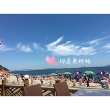

你是更好的
============================

|  |  |
| :--: | :-- |
| [ 你是更好的](https://emumo.xiami.com/album/2102964349) | **艺人**: [钢弦](../index.md) **语种**: 国语 **唱片公司**: 独立发行 **发行时间**: 2017年11月30日 **专辑类别**: EP, 单曲 **专辑风格**: 流行 Pop, 国语流行 Mandarin Pop, 独立流行 Indie Pop **播放数**: 209 **收藏数**: 1 **评论数**: 4  |

## 简介

 很早之前为你写的歌，尽力了。

## 曲目

## 评论

|  |  |  |  |
| :-- | :-- | :-- | :-- |
|  [虾米用户](https://emumo.xiami.com/u/8326332) 后来，即便是音乐，也无法... 2017-11-30 21:18 赞(0) 踩(0) | 
最近都流行单曲啊
 |
| ⇒ |  [虾米用户](https://emumo.xiami.com/u/8384826) 再见，虾米，谢谢！ 2018-01-08 23:08 赞(0) 踩(0) | 
荒废了
 |
| ⇒ |  [虾米用户](https://emumo.xiami.com/u/8326332) 后来，即便是音乐，也无法... 2018-01-09 07:19 赞(0) 踩(0) | 
<q><b>钢弦说：</b></q>
 |
| ⇒ |  [虾米用户](https://emumo.xiami.com/u/8384826) 再见，虾米，谢谢！ 2020-05-15 23:32 赞(0) 踩(0) | 
<q><b>韦几说：</b></q>
 |
