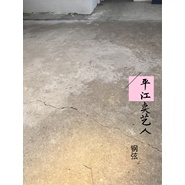

平江卖艺人
============================

|  |  |
| :--: | :-- |
| [ 平江卖艺人](https://emumo.xiami.com/album/2103670290) | **艺人**: [钢弦](../index.md) **语种**: 国语 **唱片公司**: 独立发行 **发行时间**: 2018年03月29日 **专辑类别**: EP, 单曲 **专辑风格**: 民谣 Folk, 国语流行 Mandarin Pop, 当代唱作人 Contemporary Singer-Songwriter **播放数**: 1329 **收藏数**: 5 **评论数**: 1  |

## 简介

 

我只是唱熟悉的歌过一种生活 只不过自己的声音没人欣赏罢了。
 

## 曲目

## 评论

|  |  |  |
| :-- | :-- | :-- |
|  [虾米用户](https://emumo.xiami.com/u/8384826) 再见，虾米，谢谢！ 2019-04-09 22:54 赞(0) 踩(0) | 
嗓子依然是废的
 |
