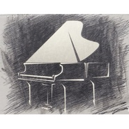

致爱丽丝
============================

|  |  |
| :--: | :-- |
| [ 致爱丽丝](https://emumo.xiami.com/album/2103713347) | **艺人**: [钢弦](../index.md) **语种**: 纯音乐 **唱片公司**: 独立发行 **发行时间**: 2018年05月18日 **专辑类别**: 录音室专辑 **专辑风格**: 轻音乐 Easy Listening, 器乐独奏 Solo Instrumental, 轻音乐流行 Light Pop **播放数**: 1597291 **收藏数**: 219 **评论数**: 13  |

## 简介

 致敬大师们给这个世界带来的音乐。

## 曲目

## 评论

|  |  |  |  |
| :-- | :-- | :-- | :-- |
|  [虾米用户](https://emumo.xiami.com/u/408790348)  2020-04-28 17:39 赞(0) 踩(0) | 
很安静 抒情
 |
| ⇒ |  [虾米用户](https://emumo.xiami.com/u/8384826) 再见，虾米，谢谢！ 2020-04-29 12:41 赞(0) 踩(0) | 

 |
|  [虾米用户](https://emumo.xiami.com/u/276944698) 不要自我设限..... 2020-03-22 19:59 赞(2) 踩(0) | 

 |
|  [虾米用户](https://emumo.xiami.com/u/430623508) 悠扬的声音～打动内心深处... 2020-02-18 14:12 赞(1) 踩(0) | 
像是真人在演奏，多发表点好吗
 |
| ⇒ |  [虾米用户](https://emumo.xiami.com/u/8384826) 再见，虾米，谢谢！ 2020-02-19 14:48 赞(0) 踩(0) | 

 |
|  [虾米用户](https://emumo.xiami.com/u/85375518)  2020-02-02 21:17 赞(0) 踩(0) | 

 |
| ⇒ |  [虾米用户](https://emumo.xiami.com/u/8384826) 再见，虾米，谢谢！ 2020-05-25 21:20 赞(0) 踩(0) | 
  
 |
|  [虾米用户](https://emumo.xiami.com/u/85375518)  2020-02-02 21:16 赞(0) 踩(0) | 

 |
|  [虾米用户](https://emumo.xiami.com/u/85375518)  2020-02-02 21:16 赞(1) 踩(0) | 
好
 |
|  [虾米用户](https://emumo.xiami.com/u/402014815)  2019-11-23 20:43 赞(1) 踩(0) | 

 |
|  [虾米用户](https://emumo.xiami.com/u/344506281) 大陆 2019-06-22 19:47 赞(0) 踩(0) | 
非常好听，让人回味……
 |
| ⇒ |  [虾米用户](https://emumo.xiami.com/u/8384826) 再见，虾米，谢谢！ 2019-06-23 13:12 赞(0) 踩(0) | 
谢谢
 |
