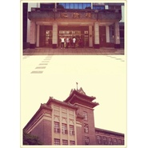

大学里的那些片段
============================

|  |  |
| :--: | :-- |
| [ 大学里的那些片段](https://emumo.xiami.com/album/905684016) | **艺人**: [钢弦](../index.md) **语种**: 其他 **唱片公司**: 独立发行 **发行时间**: 2015年07月01日 **专辑类别**: 录音室专辑 **专辑风格**: 自由即兴 Free Improvisation, 沙发音乐 Lounge, 放松新世纪 Relaxation New Age **播放数**: 42869 **收藏数**: 39 **评论数**: 40  |

## 简介

大一尘土纷飞的浦口点将台路40号以及大二大三大四的卫岗1号。
 

 

## 曲目

## 评论

|  |  |  |  |
| :-- | :-- | :-- | :-- |
|  [虾米用户](https://emumo.xiami.com/u/410006793)  2019-01-12 20:03 赞(0) 踩(0) | 
我对你非常满意。   
 |
| ⇒ |  [虾米用户](https://emumo.xiami.com/u/410006793)  2019-01-12 20:04 赞(0) 踩(0) | 
我是六岁的Denny, 上面的话是我说的，妈妈帮忙打的字。谢谢！
 |
| ⇒ |  [虾米用户](https://emumo.xiami.com/u/8384826) 再见，虾米，谢谢！ 2019-01-12 21:19 赞(0) 踩(0) | 
<q><b>阿步-Phoenix说：</b></q>
 |
|  [虾米用户](https://emumo.xiami.com/u/254935758)  2017-05-01 15:48 赞(0) 踩(0) | 
特别好听，非常喜欢大学里的那些片段这张专辑，希望你能继续创作下去，弱弱的问一句，可以分享一下谱子吗？   
 |
| ⇒ |  [虾米用户](https://emumo.xiami.com/u/8384826) 再见，虾米，谢谢！ 2017-05-01 15:49 赞(0) 踩(0) | 
需要哪首，我发微博
 |
| ⇒ |  [虾米用户](https://emumo.xiami.com/u/254935758)  2017-05-03 06:35 赞(0) 踩(0) | 
<q><b>钢弦说：</b></q>
 |
|  [虾米用户](https://emumo.xiami.com/u/2678391) 我还没想好要写什么... 2017-01-17 15:49 赞(1) 踩(0) | 
南京农业大学学生作品
 |
|  [虾米用户](https://emumo.xiami.com/u/1730251)  2016-01-02 14:54 赞(0) 踩(0) | 
好舒服~好动人
 |
| ⇒ |  [虾米用户](https://emumo.xiami.com/u/8384826) 再见，虾米，谢谢！ 2016-01-03 21:35 赞(0) 踩(0) | 
谢谢
 |
|  [虾米用户](https://emumo.xiami.com/u/54716498) 别问我谈过几个，我只爱过... 2015-09-20 22:56 赞(1) 踩(0) | 
喜欢
 |
|  [虾米用户](https://emumo.xiami.com/u/8326332) 后来，即便是音乐，也无法... 2014-12-04 10:29 赞(0) 踩(0) | 
加油，专辑在收藏夹里很久了，今天翻出来，喜欢《下马坊公园 》那种感觉！
 |
| ⇒ |  [虾米用户](https://emumo.xiami.com/u/8384826) 再见，虾米，谢谢！ 2014-12-04 20:51 赞(0) 踩(0) | 
谢谢！！！
 |
|  [虾米用户](https://emumo.xiami.com/u/5392152) Listening 2014-11-03 18:40 赞(0) 踩(0) | 
声音听着真舒服，好欢喜！！！
 |
| ⇒ |  [虾米用户](https://emumo.xiami.com/u/8384826) 再见，虾米，谢谢！ 2014-11-03 20:58 赞(0) 踩(0) | 
谢谢
 |
|  [虾米用户](https://emumo.xiami.com/u/24187826)  2014-07-27 16:50 赞(0) 踩(0) | 
唱的真好 让人回想起大学 青春 赞美的话不多说啦 好羡慕你有这么棒的回忆
 |
| ⇒ |  [虾米用户](https://emumo.xiami.com/u/8384826) 再见，虾米，谢谢！ 2014-07-27 20:28 赞(0) 踩(0) | 
谢谢
 |
|  [虾米用户](https://emumo.xiami.com/u/12259586) 落霞与孤鹜齐飞 2014-07-26 14:08 赞(1) 踩(0) | 
钢弦朗朗~欧仑堂堂~丽妃靓靓~爱音乐的人不会老~只为梦开始的夏天~O(∩_∩)O~
 |
|  [虾米用户](https://emumo.xiami.com/u/7175639) 黑夜给了我黑色的眼睛 2014-07-20 12:59 赞(0) 踩(0) | 
翻唱的平凡之路很好听，继续加加油！
 |
| ⇒ |  [虾米用户](https://emumo.xiami.com/u/8384826) 再见，虾米，谢谢！ 2014-07-20 17:02 赞(0) 踩(0) | 
谢谢
 |
|  [虾米用户](https://emumo.xiami.com/u/5025444) 泉水姐姐的迷弟 2014-07-19 12:48 赞(0) 踩(0) | 
三首歌的专辑呢噗
 |
| ⇒ |  [虾米用户](https://emumo.xiami.com/u/8384826) 再见，虾米，谢谢！ 2014-07-19 21:53 赞(0) 踩(0) | 
没完全出来
 |
|  [虾米用户](https://emumo.xiami.com/u/7776021) memento mori 2014-07-18 19:51 赞(0) 踩(0) | 
这是哪所大学啊？
 |
| ⇒ |  [虾米用户](https://emumo.xiami.com/u/8384826) 再见，虾米，谢谢！ 2014-07-18 19:56 赞(0) 踩(0) | 
南京农业大学
 |
| ⇒ |  [虾米用户](https://emumo.xiami.com/u/7776021) memento mori 2014-07-18 20:09 赞(0) 踩(0) | 
<q><b>钢弦说：</b></q>
 |
| ⇒ |  [虾米用户](https://emumo.xiami.com/u/8384826) 再见，虾米，谢谢！ 2014-07-18 20:10 赞(0) 踩(0) | 
<q><b>flamingo说：</b></q>
 |
| ⇒ |  [虾米用户](https://emumo.xiami.com/u/8384826) 再见，虾米，谢谢！ 2014-07-18 20:11 赞(0) 踩(0) | 
<q><b>flamingo说：</b></q>
 |
| ⇒ |  [虾米用户](https://emumo.xiami.com/u/7776021) memento mori 2014-07-18 20:11 赞(0) 踩(0) | 
<q><b>钢弦说：</b></q>
 |
| ⇒ |  [虾米用户](https://emumo.xiami.com/u/7776021) memento mori 2014-07-18 20:15 赞(0) 踩(0) | 
<q><b>钢弦说：</b></q>
 |
| ⇒ |  [虾米用户](https://emumo.xiami.com/u/8384826) 再见，虾米，谢谢！ 2014-07-18 20:15 赞(0) 踩(0) | 
<q><b>flamingo说：</b></q>
 |
| ⇒ |  [虾米用户](https://emumo.xiami.com/u/7776021) memento mori 2014-07-18 20:18 赞(0) 踩(0) | 
<q><b>钢弦说：</b></q>
 |
| ⇒ |  [虾米用户](https://emumo.xiami.com/u/8384826) 再见，虾米，谢谢！ 2014-07-18 20:24 赞(0) 踩(0) | 
<q><b>flamingo说：</b></q>
 |
| ⇒ |  [虾米用户](https://emumo.xiami.com/u/7776021) memento mori 2014-07-18 20:27 赞(0) 踩(0) | 
<q><b>钢弦说：</b></q>
 |
| ⇒ |  [虾米用户](https://emumo.xiami.com/u/8384826) 再见，虾米，谢谢！ 2014-07-18 20:56 赞(0) 踩(0) | 
<q><b>flamingo说：</b></q>
 |
| ⇒ |  [虾米用户](https://emumo.xiami.com/u/7776021) memento mori 2014-07-18 21:07 赞(0) 踩(0) | 
<q><b>钢弦说：</b></q>
 |
| ⇒ |  [虾米用户](https://emumo.xiami.com/u/8384826) 再见，虾米，谢谢！ 2014-07-18 21:16 赞(0) 踩(0) | 
<q><b>flamingo说：</b></q>
 |
| ⇒ |  [虾米用户](https://emumo.xiami.com/u/7776021) memento mori 2014-07-18 21:19 赞(0) 踩(0) | 
<q><b>钢弦说：</b></q>
 |
| ⇒ |  [虾米用户](https://emumo.xiami.com/u/8384826) 再见，虾米，谢谢！ 2014-07-18 21:21 赞(0) 踩(0) | 
<q><b>flamingo说：</b></q>
 |
| ⇒ |  [虾米用户](https://emumo.xiami.com/u/7776021) memento mori 2014-07-18 21:46 赞(0) 踩(0) | 
<q><b>钢弦说：</b></q>
 |
| ⇒ |  [虾米用户](https://emumo.xiami.com/u/35339217) 。 2017-10-29 14:13 赞(0) 踩(0) | 
what 您不是学音乐的吗？
 |
|  [虾米用户](https://emumo.xiami.com/u/7776021) memento mori 2014-07-18 19:50 赞(0) 踩(0) | 
~
 |
