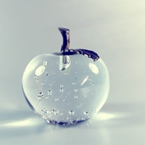
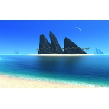
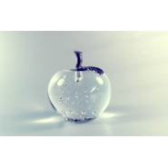

钢弦
============================

|  |  |
| :--: | :-- |
| [ 钢弦](https://i.xiami.com/zhuangyuan) | **播放数**: 4787607 **粉丝数**: 5459 **评论数**: 322 **地区**: China 中国大陆 **风格**: 清新, 纯音乐, 钢琴  |

## 档案

1992.05.25 
江苏

## 专辑

| 名称 | 语种 | 唱片公司 | 发行时间 | 专辑类别 | 专辑风格 |
| :--: | :-- | :-- | :-- | :-- | :-- |
| [ EAST](./albums/5021936721.md) | 纯音乐 | 独立发行 | 2020年11月15日 | EP, 单曲 | 器乐流行 Instrumental Pop, 轻音乐流行 Light Pop |
| [ 曙光](./albums/2105249078.md) | 国语 |  | 2019年08月19日 | EP, 单曲 | 流行摇滚 Pop Rock, 华语唱作人 Chinese Singer-Songwriter |
| [ 小男孩](./albums/2103823578.md) | 纯音乐 | 独立发行 | 2018年07月17日 | EP, 单曲 | 轻音乐 Easy Listening, 器乐独奏 Solo Instrumental, 轻音乐流行 Light Pop |
| [ 致爱丽丝](./albums/2103713347.md) | 纯音乐 | 独立发行 | 2018年05月18日 | 录音室专辑 | 轻音乐 Easy Listening, 器乐独奏 Solo Instrumental, 轻音乐流行 Light Pop |
| [ 最后的球赛](./albums/2103692604.md) | 国语 | 独立发行 | 2018年04月21日 | EP, 单曲 | 国语流行 Mandarin Pop, 独立摇滚 Indie Rock, 华语唱作人 Chinese Singer-Songwriter |
| [ 平江卖艺人](./albums/2103670290.md) | 国语 | 独立发行 | 2018年03月29日 | EP, 单曲 | 民谣 Folk, 国语流行 Mandarin Pop, 当代唱作人 Contemporary Singer-Songwriter |
| [ 你是更好的](./albums/2102964349.md) | 国语 | 独立发行 | 2017年11月30日 | EP, 单曲 | 流行 Pop, 国语流行 Mandarin Pop, 独立流行 Indie Pop |
| [ 我的婚礼音乐20170507](./albums/2102770926.md) | 纯音乐 | 独立发行 | 2017年05月07日 | EP, 单曲 | 器乐流行 Instrumental Pop, 管弦乐流行 Orchestral Pop, 轻音乐流行 Light Pop |
| [ 天赋很重](./albums/2100297412.md) | 国语 | 独立发行 | 2016年03月22日 | EP, 单曲 | 独立民谣 Indie Folk, 国语流行 Mandarin Pop, 华语唱作人 Chinese Singer-Songwriter |
| [ 小丑仿章](./albums/2100229502.md) | 国语 | 独立发行 | 2015年10月26日 | EP, 单曲 | 流行摇滚 Pop Rock, 国语流行 Mandarin Pop, 华语唱作人 Chinese Singer-Songwriter |
| [ 大学里的那些片段](./albums/905684016.md) | 其他 | 独立发行 | 2015年07月01日 | 录音室专辑 | 自由即兴 Free Improvisation, 沙发音乐 Lounge, 放松新世纪 Relaxation New Age |
| [ 爸爸妈妈](./albums/2100251230.md) | 国语 | 独立发行 | 2015年05月18日 | EP, 单曲 | 流行摇滚 Pop Rock, 国语流行 Mandarin Pop, 华语唱作人 Chinese Singer-Songwriter |
| [ 学霸的世界我们不懂](./albums/821939270.md) | 国语 | 独立发行 | 2014年12月26日 | EP, 单曲 | 当代节奏布鲁斯 Contemporary R&B, 摇滚 Rock & Roll, 中国民乐 Chinese Folk Music |
| [ 空中飞人](./albums/1796704367.md) | 国语 | 独立发行 | 2014年04月05日 | EP, 单曲 | 民谣流行 Folk Pop, 当代民谣 Contemporary Folk, 国语流行 Mandarin Pop |
| [ 几月一年](./albums/1792200372.md) | 国语 | 独立发行 | 2014年01月01日 | 录音室专辑 | 自由即兴 Free Improvisation, 轻音乐 Easy Listening, 独立流行 Indie Pop |
| [ 梅兰芳菲](./albums/973974647.md) | 国语 | 独立发行 | 2013年02月15日 | EP, 单曲 |  |
| [ 海上日出](./albums/1673974382.md) | 国语 | 独立发行 | 2013年02月01日 | EP, 单曲 | 边缘音乐人 Obscuro, 国语流行 Mandarin Pop, 华语唱作人 Chinese Singer-Songwriter |
| [ 旅行](./albums/1073974053.md) | 其他 | 独立发行 | 2013年01月01日 | 录音室专辑 | 轻音乐 Easy Listening |
| [ 校园歌手](./albums/175505574.md) | 国语 | 独立发行 | 2013年01月01日 | EP, 单曲 | 流行 Pop, 国语流行 Mandarin Pop, 独立流行 Indie Pop |
| [ 阳光的味道](./albums/973973263.md) | 国语 | 独立发行 | 2012年01月01日 | 录音室专辑 |  |
| [ 小小天空](./albums/1573972341.md) | 国语 | 独立发行 | 2011年01月01日 | 录音室专辑 |  |
| [ 钢弦的专辑](./albums/5022626731.md) | 其他 |  | 不详 |  |  |

## 评论

|  |  |  |  |
| :-- | :-- | :-- | :-- |
|  [虾米用户](https://emumo.xiami.com/u/8070377) 爱雾瑞性维欧腐漏 2021-01-06 12:42 赞(0) 踩(0) | 
用xiami这么久最早关注的一批 祝好
 |
| ⇒ |  [虾米用户](https://emumo.xiami.com/u/8384826) 再见，虾米，谢谢！ 2021-01-07 12:02 赞(0) 踩(0) | 
谢谢，我还在做音乐哦
 |
|  [虾米用户](https://emumo.xiami.com/u/8326332) 后来，即便是音乐，也无法... 2021-01-06 07:45 赞(0) 踩(0) | 
愿未来，我们都能好好的。
 |
| ⇒ |  [虾米用户](https://emumo.xiami.com/u/8384826) 再见，虾米，谢谢！ 2021-01-06 11:16 赞(0) 踩(0) | 
嗯
 |
|  [虾米用户](https://emumo.xiami.com/u/9537473) Replay. 2021-01-06 03:44 赞(0) 踩(0) | 
也谢谢你带来的音乐，再见
 |
| ⇒ |  [虾米用户](https://emumo.xiami.com/u/8384826) 再见，虾米，谢谢！ 2021-01-06 11:17 赞(0) 踩(0) | 
换个平台见哦
 |
|  [虾米用户](https://emumo.xiami.com/u/332254693) 此时相望不相闻 愿逐月华... 2021-01-06 00:22 赞(0) 踩(0) | 
也谢谢你带来的歌，再见！
 |
| ⇒ |  [虾米用户](https://emumo.xiami.com/u/8384826) 再见，虾米，谢谢！ 2021-01-06 11:16 赞(0) 踩(0) | 
换个平台见
 |
|  [虾米用户](https://emumo.xiami.com/u/358104299) 悲观的唯心存在现实解构虚... 2020-12-28 12:31 赞(0) 踩(0) | 
44563
 |
| ⇒ |  [虾米用户](https://emumo.xiami.com/u/8384826) 再见，虾米，谢谢！ 2020-12-29 10:46 赞(0) 踩(0) | 
？
 |
|  [虾米用户](https://emumo.xiami.com/u/400715332) 留白 2020-08-05 22:26 赞(1) 踩(0) | 
现在的坚持可以成就未来的你、我，和他  
 |
| ⇒ |  [虾米用户](https://emumo.xiami.com/u/8384826) 再见，虾米，谢谢！ 2020-08-06 11:32 赞(0) 踩(0) | 
加油
 |
|  [虾米用户](https://emumo.xiami.com/u/21966561)  2020-06-15 23:07 赞(0) 踩(0) | 
動聽
 |
| ⇒ |  [虾米用户](https://emumo.xiami.com/u/8384826) 再见，虾米，谢谢！ 2020-06-17 00:36 赞(0) 踩(0) | 
谢谢支持
 |
|  [虾米用户](https://emumo.xiami.com/u/8384826) 再见，虾米，谢谢！ 2020-05-18 22:22 赞(3) 踩(0) | 
十年前，出道未捷声先失，现在，出师未捷先突出。
 |
|  [虾米用户](https://emumo.xiami.com/u/8384826) 再见，虾米，谢谢！ 2020-03-27 23:55 赞(3) 踩(0) | 
不管以后到哪里 都不会忘了帮助过我的人 和从第一条评论开始支持我的你们
 |
|  [虾米用户](https://emumo.xiami.com/u/276944698) 不要自我设限..... 2020-03-22 19:59 赞(1) 踩(0) | 
⚛️⚛️⚛️
 |
|  [虾米用户](https://emumo.xiami.com/u/31325783) 雜食動物 2020-03-22 13:27 赞(1) 踩(0) | 
寻叔【id Kim刈闵】让我代他打个招呼~他说你是阳光大男孩~
 |
| ⇒ |  [虾米用户](https://emumo.xiami.com/u/8384826) 再见，虾米，谢谢！ 2020-03-23 15:25 赞(0) 踩(0) | 
哈哈哈，谢谢他
 |
|  [虾米用户](https://emumo.xiami.com/u/253100822) 要做哥哥们的御用舞者 E... 2020-03-15 19:28 赞(0) 踩(0) | 
ヾ(●&amp;acute;&amp;nabla;｀●)ﾉ哇～
 |
| ⇒ |  [虾米用户](https://emumo.xiami.com/u/8384826) 再见，虾米，谢谢！ 2020-03-16 11:03 赞(0) 踩(0) | 
新歌了解一下
 |
|  [虾米用户](https://emumo.xiami.com/u/354669631) 一切都是最好的安排 2020-01-17 07:06 赞(0) 踩(0) | 
你好，很喜欢你的音乐风格。我想知道这里收录的钢琴曲都是你演奏的吗？还是收录其他人的？非常感谢 
 |
| ⇒ |  [虾米用户](https://emumo.xiami.com/u/8384826) 再见，虾米，谢谢！ 2020-01-17 22:32 赞(0) 踩(0) | 
你可以尝试把你手机里的本地音乐用其他音乐播放器打开，就不会产生误解了
 |
| ⇒ |  [虾米用户](https://emumo.xiami.com/u/354669631) 一切都是最好的安排 2020-01-18 11:16 赞(0) 踩(0) | 
<q><b>钢弦说：</b></q>
 |
| ⇒ |  [虾米用户](https://emumo.xiami.com/u/8384826) 再见，虾米，谢谢！ 2020-01-18 11:17 赞(0) 踩(0) | 
<q><b>Julie说：</b></q>
 |
| ⇒ |  [虾米用户](https://emumo.xiami.com/u/8384826) 再见，虾米，谢谢！ 2020-01-18 11:18 赞(0) 踩(0) | 
<q><b>Julie说：</b></q>
 |
| ⇒ |  [虾米用户](https://emumo.xiami.com/u/8384826) 再见，虾米，谢谢！ 2020-01-18 11:21 赞(0) 踩(0) | 
手机APP为了节省流量，自动匹配了你的本地音乐。你重新用电脑网页播放，肯定不一样。
 |
| ⇒ |  [虾米用户](https://emumo.xiami.com/u/354669631) 一切都是最好的安排 2020-01-18 11:28 赞(0) 踩(0) | 
<q><b>钢弦说：</b></q>
 |
| ⇒ |  [虾米用户](https://emumo.xiami.com/u/354669631) 一切都是最好的安排 2020-01-18 11:34 赞(0) 踩(0) | 
<q><b>钢弦说：</b></q>
 |
| ⇒ |  [虾米用户](https://emumo.xiami.com/u/8384826) 再见，虾米，谢谢！ 2020-01-18 11:49 赞(0) 踩(0) | 
<q><b>Julie说：</b></q>
 |
|  [虾米用户](https://emumo.xiami.com/u/325374787)  2020-01-10 17:19 赞(0) 踩(0) | 
，
 |
|  [虾米用户](https://emumo.xiami.com/u/405419831)  2018-12-20 23:40 赞(0) 踩(0) | 
今天第一次听你的歌 你的声音很好听 加油
 |
| ⇒ |  [虾米用户](https://emumo.xiami.com/u/8384826) 再见，虾米，谢谢！ 2018-12-20 23:55 赞(0) 踩(0) | 
谢谢
 |
|  [虾米用户](https://emumo.xiami.com/u/48540768)  2018-12-17 11:19 赞(0) 踩(0) | 
9291
 |
| ⇒ |  [虾米用户](https://emumo.xiami.com/u/8384826) 再见，虾米，谢谢！ 2018-12-17 11:20 赞(0) 踩(0) | 
？
 |
| ⇒ |  [虾米用户](https://emumo.xiami.com/u/48540768)  2018-12-17 11:24 赞(0) 踩(0) | 
<q><b>钢弦说：</b></q>
 |
|  [虾米用户](https://emumo.xiami.com/u/331126146) 我喜欢安静的日子 2018-12-15 21:33 赞(0) 踩(0) | 
很喜欢你的歌(◦˙▽˙◦)加油
 |
| ⇒ |  [虾米用户](https://emumo.xiami.com/u/8384826) 再见，虾米，谢谢！ 2018-12-15 21:35 赞(0) 踩(0) | 
谢谢
 |
|  [虾米用户](https://emumo.xiami.com/u/405766268)  2018-10-08 23:46 赞(0) 踩(0) | 
今天下午为了上课，喝了好多茶，失眠，跑来听歌，哈哈，我喜欢爸爸去哪儿平凡之路，吉他弹唱的，其他曲子用什么演奏的
 |
| ⇒ |  [虾米用户](https://emumo.xiami.com/u/8384826) 再见，虾米，谢谢！ 2018-12-05 13:24 赞(0) 踩(0) | 
谢谢
 |
| ⇒ |  [虾米用户](https://emumo.xiami.com/u/405766268)  2018-12-05 13:25 赞(0) 踩(0) | 
多写点歌吧，现在有时间了
 |
|  [虾米用户](https://emumo.xiami.com/u/20177386) 感谢一切美好的遇见❤️ 2018-04-12 15:34 赞(1) 踩(0) | 

 |
|  [虾米用户](https://emumo.xiami.com/u/105451946) 亲们网易云见昵称：摩羯天... 2018-03-30 00:23 赞(0) 踩(0) | 
触碰心灵的音符，加油 
 |
| ⇒ |  [虾米用户](https://emumo.xiami.com/u/8384826) 再见，虾米，谢谢！ 2018-03-30 00:24 赞(0) 踩(0) | 

 |
|  [虾米用户](https://emumo.xiami.com/u/8384826) 再见，虾米，谢谢！ 2018-03-27 07:11 赞(2) 踩(0) | 
降库存！！！
 |
|  [虾米用户](https://emumo.xiami.com/u/343588165)  2018-01-10 19:55 赞(1) 踩(0) | 
声音很好听，很喜欢
 |
| ⇒ |  [虾米用户](https://emumo.xiami.com/u/8384826) 再见，虾米，谢谢！ 2018-01-25 21:28 赞(0) 踩(0) | 
谢谢
 |
|  [虾米用户](https://emumo.xiami.com/u/12553904)  2017-07-03 12:16 赞(2) 踩(0) | 
虽然不会弹奏钢琴，但钢琴曲一直是我最喜欢的。因为纯净 最能抒发内心最真挚的情感 所以有乐器之王  的美誉 好曲子都要静下心凭着感觉去找 你的作品的风格我很喜欢
 |
| ⇒ |  [虾米用户](https://emumo.xiami.com/u/8384826) 再见，虾米，谢谢！ 2017-07-03 12:18 赞(0) 踩(0) | 
谢谢
 |
|  [虾米用户](https://emumo.xiami.com/u/9261161) 音乐里流动 2017-03-16 13:20 赞(0) 踩(0) | 
好久没来了，不知是否安好
 |
| ⇒ |  [虾米用户](https://emumo.xiami.com/u/8384826) 再见，虾米，谢谢！ 2017-03-16 15:13 赞(0) 踩(0) | 
嗯，安好啊
 |
| ⇒ |  [虾米用户](https://emumo.xiami.com/u/8384826) 再见，虾米，谢谢！ 2017-05-18 21:43 赞(0) 踩(0) | 
最近是否安好
 |
| ⇒ |  [虾米用户](https://emumo.xiami.com/u/9261161) 音乐里流动 2017-05-18 22:34 赞(0) 踩(0) | 
<q><b>钢弦说：</b></q>
 |
| ⇒ |  [虾米用户](https://emumo.xiami.com/u/8384826) 再见，虾米，谢谢！ 2017-05-19 08:35 赞(0) 踩(0) | 
<q><b>Kim刈闵说：</b></q>
 |
| ⇒ |  [虾米用户](https://emumo.xiami.com/u/9261161) 音乐里流动 2017-05-19 10:05 赞(0) 踩(0) | 
<q><b>钢弦说：</b></q>
 |
|  [虾米用户](https://emumo.xiami.com/u/4131849) 网易云：非人類兔子Agy... 2017-01-16 21:37 赞(0) 踩(0) | 
5-25麽雙子啊
 |
| ⇒ |  [虾米用户](https://emumo.xiami.com/u/8384826) 再见，虾米，谢谢！ 2017-01-16 21:44 赞(0) 踩(0) | 
双子
 |
|  [虾米用户](https://emumo.xiami.com/u/8384826) 再见，虾米，谢谢！ 2016-12-27 23:45 赞(3) 踩(0) | 
想唱唱不出来的感觉真难受，想哭哭不出来心太平静的感觉难以言喻。
 |
|  [虾米用户](https://emumo.xiami.com/u/8384826) 再见，虾米，谢谢！ 2016-10-13 17:16 赞(4) 踩(0) | 
在有限的生命裡，要尽最大的能力创造最大的价值。这应该是我追求的方向。
 |
| ⇒ |  [虾米用户](https://emumo.xiami.com/u/208538522) 心有猛虎，细嗅蔷薇。 2016-12-08 12:32 赞(0) 踩(0) | 
坐在太阳下晒太阳，正好听到你的曲子，看到这一句话，我想，人生很短，却也很长，关键在于我们自己怎么走。我也一直想着，想要努力绽放，看看自己这一生倾尽全力，能够有着怎样的光，价值能释放到什么程度。加油，你一定可以的。所有的东西都来源于内心。你的心一定是极美的了~祝福你~~
 |
|  [虾米用户](https://emumo.xiami.com/u/14528323)  2016-08-02 10:52 赞(0) 踩(0) | 
对他说很有画面感和故事情节感啊， 今天才知道国内也有做得这么好的纯音乐啊。 钢弦加油啊。最美的事情就是亲手让梦想变成现实。 加油加油
 |
| ⇒ |  [虾米用户](https://emumo.xiami.com/u/8384826) 再见，虾米，谢谢！ 2016-08-07 20:10 赞(0) 踩(0) | 
怒谢！不忘初衷
 |
|  [虾米用户](https://emumo.xiami.com/u/11987794)  2016-06-12 14:32 赞(0) 踩(0) | 
音准？
 |
|  [虾米用户](https://emumo.xiami.com/u/9537473) Replay. 2016-05-28 22:18 赞(0) 踩(0) | 
之前来还是钢琴曲，没想到有翻唱了，学长声音很好听啊，加油=。=
 |
| ⇒ |  [虾米用户](https://emumo.xiami.com/u/8384826) 再见，虾米，谢谢！ 2016-05-28 23:04 赞(0) 踩(0) | 
谢谢！
 |
| ⇒ |  [虾米用户](https://emumo.xiami.com/u/8384826) 再见，虾米，谢谢！ 2016-05-28 23:04 赞(0) 踩(0) | 
南农的？
 |
| ⇒ |  [虾米用户](https://emumo.xiami.com/u/9537473) Replay. 2016-05-29 04:43 赞(0) 踩(0) | 
<q><b>钢弦说：</b></q>
 |
|  [虾米用户](https://emumo.xiami.com/u/11910102) 一一 2016-03-25 10:31 赞(0) 踩(0) | 
加油加油！！！清沿学长也来给你加油！！！
 |
| ⇒ |  [虾米用户](https://emumo.xiami.com/u/8384826) 再见，虾米，谢谢！ 2016-03-26 12:49 赞(0) 踩(0) | 
加油加油
 |
|  [虾米用户](https://emumo.xiami.com/u/11867505) 沿途的风景记在心里，心存... 2016-03-13 13:58 赞(0) 踩(0) | 
fighting  fighting fighting  –1＝99 剩下的一分怕你骄傲 。。。       ______ ___ ___ ___ ___                 〖表情留言〗
 |
| ⇒ |  [虾米用户](https://emumo.xiami.com/u/8384826) 再见，虾米，谢谢！ 2016-03-15 23:19 赞(0) 踩(0) | 
~
 |
|  [虾米用户](https://emumo.xiami.com/u/99692068) 陌生好吧⋯⋯ 2016-01-26 11:58 赞(0) 踩(0) | 
好听
 |
| ⇒ |  [虾米用户](https://emumo.xiami.com/u/8384826) 再见，虾米，谢谢！ 2016-02-07 11:46 赞(0) 踩(0) | 
谢谢
 |
|  [虾米用户](https://emumo.xiami.com/u/1730251)  2016-01-02 15:02 赞(0) 踩(0) | 
喜欢
 |
| ⇒ |  [虾米用户](https://emumo.xiami.com/u/8384826) 再见，虾米，谢谢！ 2016-01-03 21:38 赞(0) 踩(0) | 
谢谢啊
 |
|  [虾米用户](https://emumo.xiami.com/u/96571364)  2016-01-01 20:20 赞(0) 踩(0) | 
声音很好
 |
|  [虾米用户](https://emumo.xiami.com/u/96571364)  2016-01-01 20:20 赞(0) 踩(0) | 
。。
 |
|  [虾米用户](https://emumo.xiami.com/u/8213310)  2015-12-25 17:12 赞(0) 踩(0) | 
我天，虾米下载好复杂，能不能私聊。qq:1024206583
 |
|  [虾米用户](https://emumo.xiami.com/u/90559788)  2015-12-11 14:55 赞(1) 踩(0) | 
好久不在贴吧见你了，就来这里找了  
 |
| ⇒ |  [虾米用户](https://emumo.xiami.com/u/8384826) 再见，虾米，谢谢！ 2015-12-14 21:59 赞(0) 踩(0) | 
^_^
 |
|  [虾米用户](https://emumo.xiami.com/u/5429478) 唯有音乐和亲情不可遗落！ 2015-11-04 10:09 赞(0) 踩(0) | 
好喜欢这声音。
 |
| ⇒ |  [虾米用户](https://emumo.xiami.com/u/8384826) 再见，虾米，谢谢！ 2015-11-04 10:21 赞(0) 踩(0) | 
谢谢
 |
|  [虾米用户](https://emumo.xiami.com/u/32461398) 曾在云上浮想联翩如今也终... 2015-11-01 18:45 赞(0) 踩(0) | 
字体不错。
 |
| ⇒ |  [虾米用户](https://emumo.xiami.com/u/8384826) 再见，虾米，谢谢！ 2015-11-01 23:34 赞(0) 踩(0) | 
谢谢
 |
|  [虾米用户](https://emumo.xiami.com/u/12706878) 当森林陷入寂静，森林便开... 2015-11-01 10:55 赞(0) 踩(0) | 
声音很好听
 |
| ⇒ |  [虾米用户](https://emumo.xiami.com/u/8384826) 再见，虾米，谢谢！ 2015-11-01 11:13 赞(0) 踩(0) | 
谢谢
 |
|  [虾米用户](https://emumo.xiami.com/u/9261161) 音乐里流动 2015-09-21 23:02 赞(0) 踩(0) | 
这就是给你的考验么…有些沉重，但希望挺过去…音乐伴同行
 |
|  [虾米用户](https://emumo.xiami.com/u/8384826) 再见，虾米，谢谢！ 2015-09-13 23:23 赞(0) 踩(0) | 
一首歌，有那么一句歌词，足矣。
 |
|  [虾米用户](https://emumo.xiami.com/u/17641)  2015-09-13 15:53 赞(0) 踩(0) | 
好难听啊 怎么在虾米上会有这种ktv歌手（感觉好多同学唱的会更好听雪
 |
| ⇒ |  [虾米用户](https://emumo.xiami.com/u/99692068) 陌生好吧⋯⋯ 2016-01-26 12:00 赞(0) 踩(0) | 
如果你不喜欢 可以不听吖
 |
|  [虾米用户](https://emumo.xiami.com/u/54273681) 00后网络歌手 2015-08-04 11:58 赞(0) 踩(0) | 
好听·加油~
 |
| ⇒ |  [虾米用户](https://emumo.xiami.com/u/8384826) 再见，虾米，谢谢！ 2015-08-04 12:01 赞(0) 踩(0) | 
谢谢
 |
| ⇒ |  [虾米用户](https://emumo.xiami.com/u/54273681) 00后网络歌手 2015-08-04 12:02 赞(0) 踩(0) | 
<q><b>钢弦说：</b></q>
 |
|  [虾米用户](https://emumo.xiami.com/u/652919) 月寒日暖，来煎人寿。 2015-05-29 18:47 赞(0) 踩(0) | 
南农大学生来访~卫岗1号真的挺好！加油！已关注
 |
| ⇒ |  [虾米用户](https://emumo.xiami.com/u/8384826) 再见，虾米，谢谢！ 2015-05-29 21:46 赞(0) 踩(0) | 
谢谢校友
 |
| ⇒ |  [虾米用户](https://emumo.xiami.com/u/652919) 月寒日暖，来煎人寿。 2015-05-30 19:18 赞(0) 踩(0) | 
<q><b>钢弦说：</b></q>
 |
|  [虾米用户](https://emumo.xiami.com/u/8384826) 再见，虾米，谢谢！ 2015-05-25 15:18 赞(38) 踩(0) | 
今天是我的生日，妈妈我很爱你
 |
| ⇒ |  [虾米用户](https://emumo.xiami.com/u/9261161) 音乐里流动 2015-08-08 13:18 赞(0) 踩(0) | 
时间过得真快，上次过来还是4月，转眼8月，竟全然不觉……迟来的生日快乐，愿转安好
 |
| ⇒ |  [虾米用户](https://emumo.xiami.com/u/8384826) 再见，虾米，谢谢！ 2015-08-08 23:13 赞(0) 踩(0) | 
<q><b>Kim刈闵说：</b></q>
 |
|  [虾米用户](https://emumo.xiami.com/u/8384826) 再见，虾米，谢谢！ 2015-05-25 12:17 赞(1) 踩(0) | 
生日，唯有感恩
 |
|  [虾米用户](https://emumo.xiami.com/u/32288678) 彩月 2015-05-21 22:55 赞(0) 踩(0) | 
我来了
 |
|  [虾米用户](https://emumo.xiami.com/u/32031632)  2015-05-10 21:03 赞(0) 踩(0) | 
有道理的！
 |
|  [虾米用户](https://emumo.xiami.com/u/8384826) 再见，虾米，谢谢！ 2015-05-09 21:25 赞(24) 踩(0) | 
梦想是用来坚持的
 |
|  [虾米用户](https://emumo.xiami.com/u/8070377) 爱雾瑞性维欧腐漏 2015-05-06 21:35 赞(1) 踩(0) | 
刚才看见你在听 光良的 我爱你 在哪里
 |
|  [虾米用户](https://emumo.xiami.com/u/32031632)  2015-05-06 08:20 赞(0) 踩(0) | 
面对现实，需坦然接受！
 |
|  [虾米用户](https://emumo.xiami.com/u/31414236)  2015-04-20 22:19 赞(0) 踩(0) | 
喜欢您的旅行！一直很喜欢！说不上原因！
 |
| ⇒ |  [虾米用户](https://emumo.xiami.com/u/8384826) 再见，虾米，谢谢！ 2015-04-21 23:26 赞(0) 踩(0) | 
谢谢！！
 |
|  [虾米用户](https://emumo.xiami.com/u/8384826) 再见，虾米，谢谢！ 2015-04-08 08:05 赞(0) 踩(0) | 
尽我所能守护我的妈妈
 |
| ⇒ |  [虾米用户](https://emumo.xiami.com/u/9261161) 音乐里流动 2015-04-15 21:49 赞(0) 踩(0) | 
怎么啦？
 |
|  [虾米用户](https://emumo.xiami.com/u/8384826) 再见，虾米，谢谢！ 2015-04-04 18:03 赞(0) 踩(0) | 
我的脑神经已经控制不住泪腺了，好一会儿还流泪，头疼，浑身出汗
 |
|  [虾米用户](https://emumo.xiami.com/u/8384826) 再见，虾米，谢谢！ 2015-04-04 18:02 赞(0) 踩(0) | 
这阵子思想压力太大了，当听到隔壁病床上92岁上海老大爷对他孙女说：“我要走了，我多活一小时，就多害你们一小时”，“我这辈子最恨的就是小日本”，瞬间头皮发麻，泪崩。
 |
|  [虾米用户](https://emumo.xiami.com/u/9730064) 纯音党 2015-04-03 19:41 赞(0) 踩(0) | 
从我来！你的关注不过100！一直到现在接近90W！继续加油
 |
| ⇒ |  [虾米用户](https://emumo.xiami.com/u/8384826) 再见，虾米，谢谢！ 2015-04-06 23:08 赞(0) 踩(0) | 
加油
 |
|  [虾米用户](https://emumo.xiami.com/u/18842023) 世界都在听！ 2015-04-03 16:51 赞(0) 踩(0) | 
踩踩 加油
 |
| ⇒ |  [虾米用户](https://emumo.xiami.com/u/8384826) 再见，虾米，谢谢！ 2015-04-06 22:58 赞(0) 踩(0) | 
加油
 |
|  [虾米用户](https://emumo.xiami.com/u/8384826) 再见，虾米，谢谢！ 2015-04-02 19:13 赞(1) 踩(0) | 
营造积极的家庭氛围，加油
 |
|  [虾米用户](https://emumo.xiami.com/u/3869883) 微观世界 2015-03-09 21:01 赞(0) 踩(0) | 
很不错，祝走更远
 |
| ⇒ |  [虾米用户](https://emumo.xiami.com/u/8384826) 再见，虾米，谢谢！ 2015-03-09 21:05 赞(0) 踩(0) | 
谢谢
 |
|  [虾米用户](https://emumo.xiami.com/u/31221062)   2015-01-24 02:05 赞(0) 踩(0) | 
喜欢你的声音。理想中的男声，哈哈哈
 |
| ⇒ |  [虾米用户](https://emumo.xiami.com/u/8384826) 再见，虾米，谢谢！ 2015-01-24 09:24 赞(0) 踩(0) | 
谢谢
 |
|  [虾米用户](https://emumo.xiami.com/u/9537473) Replay. 2015-01-23 11:12 赞(0) 踩(0) | 
校友观光团支持
 |
| ⇒ |  [虾米用户](https://emumo.xiami.com/u/8384826) 再见，虾米，谢谢！ 2015-01-23 13:52 赞(0) 踩(0) | 
谢谢
 |
|  [虾米用户](https://emumo.xiami.com/u/16961759) 永远长不大的少年 2015-01-23 10:09 赞(0) 踩(0) | 
赞~
 |
| ⇒ |  [虾米用户](https://emumo.xiami.com/u/8384826) 再见，虾米，谢谢！ 2015-01-23 13:52 赞(0) 踩(0) | 
谢谢
 |
|  [虾米用户](https://emumo.xiami.com/u/8384826) 再见，虾米，谢谢！ 2014-12-29 19:36 赞(1) 踩(0) | 
三人成虎，谣言止于智者。
 |
|  [虾米用户](https://emumo.xiami.com/u/8326332) 后来，即便是音乐，也无法... 2014-12-28 22:45 赞(0) 踩(0) | 
老男孩唱弹都很不错哦！！
 |
| ⇒ |  [虾米用户](https://emumo.xiami.com/u/8384826) 再见，虾米，谢谢！ 2014-12-29 09:13 赞(0) 踩(0) | 
谢谢~
 |
|  [虾米用户](https://emumo.xiami.com/u/8384826) 再见，虾米，谢谢！ 2014-12-28 20:22 赞(0) 踩(0) | 
同学，生日快乐！
 |
|  [虾米用户](https://emumo.xiami.com/u/8384826) 再见，虾米，谢谢！ 2014-12-28 17:59 赞(2) 踩(0) | 
这条路上逐渐找到方向，找到会玩音乐，悟性不错的小伙伴，享受音乐的神奇，变化产生的美感，惊喜，感动。
 |
|  [虾米用户](https://emumo.xiami.com/u/8384826) 再见，虾米，谢谢！ 2014-12-23 17:31 赞(1) 踩(0) | 
路考没过，心态平和思维才会清晰
 |
|  [虾米用户](https://emumo.xiami.com/u/8384826) 再见，虾米，谢谢！ 2014-12-20 19:14 赞(1) 踩(0) | 
有些人很年轻就退役了，调整心态很重要
 |
|  [虾米用户](https://emumo.xiami.com/u/9730064) 纯音党 2014-12-09 23:05 赞(1) 踩(0) | 
刚刚在百度贴吧里看到了你加我！“钢弦08”   是你的ID吧？有什么事情吗？？？
 |
| ⇒ |  [虾米用户](https://emumo.xiami.com/u/6509257)  2014-12-09 23:06 赞(0) 踩(0) | 
哟！
 |
|  [虾米用户](https://emumo.xiami.com/u/20025417) 暂无签名~ 2014-11-28 23:21 赞(0) 踩(0) | 
感觉不错喔，又一位音乐才子诞生啦！
 |
| ⇒ |  [虾米用户](https://emumo.xiami.com/u/8384826) 再见，虾米，谢谢！ 2014-11-29 18:42 赞(0) 踩(0) | 
过奖
 |
|  [虾米用户](https://emumo.xiami.com/u/43788593)  2014-11-17 11:05 赞(1) 踩(0) | 
钢弦，我是一个刚刚读大学的音乐生
 |
| ⇒ |  [虾米用户](https://emumo.xiami.com/u/8384826) 再见，虾米，谢谢！ 2014-11-17 16:41 赞(0) 踩(0) | 
你好！
 |
|  [虾米用户](https://emumo.xiami.com/u/9117580)  2014-11-13 21:36 赞(0) 踩(0) | 
支持下！
 |
| ⇒ |  [虾米用户](https://emumo.xiami.com/u/8384826) 再见，虾米，谢谢！ 2014-11-14 12:31 赞(0) 踩(0) | 
^_^
 |
|  [虾米用户](https://emumo.xiami.com/u/32288678) 彩月 2014-10-26 20:16 赞(0) 踩(0) | 
很想知道要做到你这种的歌曲要学习钢琴还有什么？混声？
 |
| ⇒ |  [虾米用户](https://emumo.xiami.com/u/8384826) 再见，虾米，谢谢！ 2014-10-27 08:32 赞(0) 踩(0) | 
感觉很重要，基础也很重要。最好会一样乐器。其他的就是电脑音乐制作的知识。
 |
| ⇒ |  [虾米用户](https://emumo.xiami.com/u/32288678) 彩月 2014-10-31 22:31 赞(0) 踩(0) | 
<q><b>钢弦说：</b></q>
 |
|  [虾米用户](https://emumo.xiami.com/u/42361373) 感恩虾米，让我们相遇！请... 2014-10-16 16:16 赞(0) 踩(0) | 
你好，第一次弄虾米，想了解一下虾米这个DEMO，和专辑两种发布方式有什么区别？DEMO和热门歌曲的列表不相同是吗？ 还是说半成品才发布成DEMO？
 |
| ⇒ |  [虾米用户](https://emumo.xiami.com/u/8384826) 再见，虾米，谢谢！ 2014-10-16 21:15 赞(0) 踩(0) | 
你自己做一遍就知道啦~
 |
|  [虾米用户](https://emumo.xiami.com/u/1667797)  2014-10-10 23:25 赞(0) 踩(0) | 
听着听着周杰伦的声音都出来了，艹
 |
| ⇒ |  [虾米用户](https://emumo.xiami.com/u/8384826) 再见，虾米，谢谢！ 2014-10-11 13:14 赞(0) 踩(0) | 
有吗
 |
|  [虾米用户](https://emumo.xiami.com/u/8384826) 再见，虾米，谢谢！ 2014-10-09 23:29 赞(0) 踩(0) | 
以后应该也不会有什么幕前的机会了吧
 |
|  [虾米用户](https://emumo.xiami.com/u/28787225)  2014-09-27 13:19 赞(0) 踩(0) | 
奇妙自然的声音。
 |
| ⇒ |  [虾米用户](https://emumo.xiami.com/u/8384826) 再见，虾米，谢谢！ 2014-09-29 10:41 赞(0) 踩(0) | 
谢谢～^_^
 |
|  [虾米用户](https://emumo.xiami.com/u/6854854) 最后一个月，红心听一遍~ 2014-09-26 17:22 赞(0) 踩(0) | 
好听QAQ！
 |
| ⇒ |  [虾米用户](https://emumo.xiami.com/u/8384826) 再见，虾米，谢谢！ 2014-09-26 17:53 赞(0) 踩(0) | 
谢谢
 |
|  [虾米用户](https://emumo.xiami.com/u/13578043)   2014-09-25 18:33 赞(1) 踩(0) | 
喜欢你的曲 干净 舒服。牵出回忆
 |
| ⇒ |  [虾米用户](https://emumo.xiami.com/u/8384826) 再见，虾米，谢谢！ 2014-09-25 20:39 赞(0) 踩(0) | 
谢谢！
 |
|  [虾米用户](https://emumo.xiami.com/u/8384826) 再见，虾米，谢谢！ 2014-09-24 00:08 赞(1) 踩(0) | 
又去球馆打篮球，休息时候弹钢琴，很好
 |
|  [虾米用户](https://emumo.xiami.com/u/31018531) 暂无签名~ 2014-09-22 15:43 赞(2) 踩(0) | 
南航的，就在旁边，顶顶。
 |
|  [虾米用户](https://emumo.xiami.com/u/8384826) 再见，虾米，谢谢！ 2014-09-19 11:03 赞(1) 踩(0) | 
有热情的时候没条件实现，等到自己创造条件的时候，热情消褪了。还是没忘记初心，冷静的热情，逐渐达到我毕业前的预期。挫折让我更坦然。
 |
|  [虾米用户](https://emumo.xiami.com/u/8384826) 再见，虾米，谢谢！ 2014-09-16 21:36 赞(0) 踩(0) | 
致力于做瑕疵音乐
 |
|  [虾米用户](https://emumo.xiami.com/u/8384826) 再见，虾米，谢谢！ 2014-09-14 23:39 赞(1) 踩(0) | 
喧嚣之后宁静才是王道
 |
|  [虾米用户](https://emumo.xiami.com/u/9730064) 纯音党 2014-09-14 17:56 赞(0) 踩(0) | 
又来看你了！话说哇撒 2015年7月- -！
 |
| ⇒ |  [虾米用户](https://emumo.xiami.com/u/8384826) 再见，虾米，谢谢！ 2014-09-14 18:25 赞(0) 踩(0) | 
谢谢，因为还有一半未制作
 |
|  [虾米用户](https://emumo.xiami.com/u/8384826) 再见，虾米，谢谢！ 2014-09-13 23:45 赞(0) 踩(0) | 
今天才知道怪不得我们那时候如此契合
 |
|  [虾米用户](https://emumo.xiami.com/u/8384826) 再见，虾米，谢谢！ 2014-09-13 00:31 赞(0) 踩(0) | 
争取声音尽快回来
 |
|  [虾米用户](https://emumo.xiami.com/u/8384826) 再见，虾米，谢谢！ 2014-09-13 00:30 赞(0) 踩(0) | 
我想我们一定有机会再合唱一首歌的！
 |
|  [虾米用户](https://emumo.xiami.com/u/4225172)  2014-09-06 22:39 赞(0) 踩(0) | 
钢大什么时候唱夜空中最亮的星，感觉男神好适合那个风格！
 |
| ⇒ |  [虾米用户](https://emumo.xiami.com/u/8384826) 再见，虾米，谢谢！ 2014-09-07 00:47 赞(0) 踩(0) | 
待我声音回来
 |
| ⇒ |  [虾米用户](https://emumo.xiami.com/u/4225172)  2014-09-07 11:55 赞(0) 踩(0) | 
<q><b>钢弦说：</b></q>
 |
|  [虾米用户](https://emumo.xiami.com/u/25812912)  2014-08-22 15:09 赞(0) 踩(0) | 
那么多歌就觉得   平凡之路   的声音听起来最舒服   声音里可能是沉淀了些东西的感觉
 |
| ⇒ |  [虾米用户](https://emumo.xiami.com/u/8384826) 再见，虾米，谢谢！ 2014-08-22 21:06 赞(0) 踩(0) | 
谢谢！
 |
|  [虾米用户](https://emumo.xiami.com/u/7787849)  2014-08-17 12:20 赞(0) 踩(0) | 
平凡之路好好听！已沦陷！男神我可以给你生孩子嘛！
 |
| ⇒ |  [虾米用户](https://emumo.xiami.com/u/8384826) 再见，虾米，谢谢！ 2014-08-17 19:11 赞(0) 踩(0) | 
前提你要是个女的，哈哈
 |
| ⇒ |  [虾米用户](https://emumo.xiami.com/u/7787849)  2014-08-18 21:41 赞(0) 踩(0) | 
<q><b>钢弦说：</b></q>
 |
| ⇒ |  [虾米用户](https://emumo.xiami.com/u/8384826) 再见，虾米，谢谢！ 2014-08-18 21:49 赞(0) 踩(0) | 
<q><b>誰比我更想念你说：</b></q>
 |
|  [虾米用户](https://emumo.xiami.com/u/13276172)  2014-08-10 17:03 赞(0) 踩(0) | 
好棒！很喜欢！也不知道那些喷子是什么心态，最起码的尊重都不懂！
 |
| ⇒ |  [虾米用户](https://emumo.xiami.com/u/8384826) 再见，虾米，谢谢！ 2014-08-10 19:13 赞(0) 踩(0) | 
网络言论自由，况且一道菜不可能每个人都喜欢。谢谢~
 |
|  [虾米用户](https://emumo.xiami.com/u/13079917) 这个家伙很聪明，看起来什... 2014-08-05 13:36 赞(0) 踩(0) | 
只会弹唱麽？
 |
| ⇒ |  [虾米用户](https://emumo.xiami.com/u/8384826) 再见，虾米，谢谢！ 2014-08-05 19:38 赞(0) 踩(0) | 
没有手机客户端吗
 |
|  [虾米用户](https://emumo.xiami.com/u/752597)  2014-08-03 20:02 赞(0) 踩(0) | 
港台腔翻唱一堆口水歌，这他妈的有什么意义吗？
 |
| ⇒ |  [虾米用户](https://emumo.xiami.com/u/8384826) 再见，虾米，谢谢！ 2014-08-03 20:17 赞(0) 踩(0) | 
请问您能解释什么叫“有意义”？普通话带了点地方口音雷同点你所谓的港台腔就能叫港台腔，为什么不叫苏北腔，翻唱娱乐而已，这不是音乐社区吗
 |
| ⇒ |  [虾米用户](https://emumo.xiami.com/u/752597)  2014-08-04 13:09 赞(0) 踩(0) | 
<q><b>钢弦说：</b></q>
 |
| ⇒ |  [虾米用户](https://emumo.xiami.com/u/8384826) 再见，虾米，谢谢！ 2014-08-04 14:07 赞(0) 踩(0) | 
<q><b>民院路708号说：</b></q>
 |
| ⇒ |  [虾米用户](https://emumo.xiami.com/u/8384826) 再见，虾米，谢谢！ 2014-08-04 16:12 赞(0) 踩(0) | 
<q><b>民院路708号说：</b></q>
 |
|  [虾米用户](https://emumo.xiami.com/u/1963119) 全然的倾听。 2014-07-27 22:17 赞(0) 踩(0) | 
路过问好    嗓子比较熟悉而亲和 ~     已关注~  加油！  边走边唱的哥们儿们~
 |
| ⇒ |  [虾米用户](https://emumo.xiami.com/u/8384826) 再见，虾米，谢谢！ 2014-07-27 22:37 赞(0) 踩(0) | 
谢谢
 |
|  [虾米用户](https://emumo.xiami.com/u/1963119) 全然的倾听。 2014-07-27 22:14 赞(1) 踩(0) | 
路过问好~  嗓音比较熟悉亲和  关注啦~  加油 ！   边走边唱的哥们儿~
 |
|  [虾米用户](https://emumo.xiami.com/u/35183867) 音乐不是命题作文~ 2014-07-27 18:47 赞(0) 踩(0) | 
看到那个下马坊公园，熟悉的不得了，推测你肯定是在南京上大学的，然后一翻评论，哈哈，原来是南农的兄弟！我是南理工的，当然现在毕业工作了，已经不在学校了。感觉你的音乐风格多变，很有意思哦~来赞~
 |
| ⇒ |  [虾米用户](https://emumo.xiami.com/u/8384826) 再见，虾米，谢谢！ 2014-07-27 20:29 赞(0) 踩(0) | 
哈哈，学校就隔着一站地铁
 |
| ⇒ |  [虾米用户](https://emumo.xiami.com/u/35183867) 音乐不是命题作文~ 2014-07-27 22:23 赞(0) 踩(0) | 
<q><b>钢弦说：</b></q>
 |
|  [虾米用户](https://emumo.xiami.com/u/7921266)  2014-07-27 00:01 赞(0) 踩(0) | 
深夜听着「平凡之路」，声音太温柔惹QvQ
 |
| ⇒ |  [虾米用户](https://emumo.xiami.com/u/8384826) 再见，虾米，谢谢！ 2014-07-27 00:34 赞(0) 踩(0) | 
~~
 |
|  [虾米用户](https://emumo.xiami.com/u/12259586) 落霞与孤鹜齐飞 2014-07-26 13:17 赞(1) 踩(0) | 
纯音乐就是这个味道~波澜不惊~云淡风轻~
 |
|  [虾米用户](https://emumo.xiami.com/u/12828766) 哈哈哈。 2014-07-24 21:24 赞(0) 踩(0) | 
很喜欢你唱的平凡之路，今天循环了一天了！
 |
| ⇒ |  [虾米用户](https://emumo.xiami.com/u/8384826) 再见，虾米，谢谢！ 2014-07-24 21:52 赞(0) 踩(0) | 
谢谢^_^o~ 努力！
 |
| ⇒ |  [虾米用户](https://emumo.xiami.com/u/12828766) 哈哈哈。 2014-07-25 21:34 赞(0) 踩(0) | 
<q><b>钢弦说：</b></q>
 |
|  [虾米用户](https://emumo.xiami.com/u/37728884)  2014-07-24 15:53 赞(0) 踩(0) | 
平凡之路唱得很好听+1
 |
| ⇒ |  [虾米用户](https://emumo.xiami.com/u/8384826) 再见，虾米，谢谢！ 2014-07-24 19:20 赞(0) 踩(0) | 
谢谢
 |
|  [虾米用户](https://emumo.xiami.com/u/3426659)  2014-07-24 11:24 赞(0) 踩(0) | 
还蛮好听的！！！
 |
| ⇒ |  [虾米用户](https://emumo.xiami.com/u/8384826) 再见，虾米，谢谢！ 2014-07-24 19:20 赞(0) 踩(0) | 
谢谢你
 |
|  [虾米用户](https://emumo.xiami.com/u/37460672)  2014-07-24 09:44 赞(0) 踩(0) | 
哎呀。亲。平凡之路唱的很棒很有味道诶！
 |
| ⇒ |  [虾米用户](https://emumo.xiami.com/u/8384826) 再见，虾米，谢谢！ 2014-07-24 19:18 赞(0) 踩(0) | 
谢谢
 |
|  [虾米用户](https://emumo.xiami.com/u/33849263)  2014-07-22 00:54 赞(0) 踩(0) | 
愿得一人心听得太舒服了，很用心也很棒，千百度瞬间笑场哈哈，声音很好听啊，听了一首忍不住进来听的…
 |
| ⇒ |  [虾米用户](https://emumo.xiami.com/u/8384826) 再见，虾米，谢谢！ 2014-07-22 22:57 赞(0) 踩(0) | 
谢谢啊
 |
|  [虾米用户](https://emumo.xiami.com/u/6066908) 光芒与希望 *JazzH... 2014-07-18 08:53 赞(0) 踩(0) | 
声线很好听！
 |
| ⇒ |  [虾米用户](https://emumo.xiami.com/u/8384826) 再见，虾米，谢谢！ 2014-07-18 18:22 赞(0) 踩(0) | 
谢谢
 |
|  [虾米用户](https://emumo.xiami.com/u/7776021) memento mori 2014-07-10 12:27 赞(0) 踩(0) | 
竟然赞了我的评论！！而且还是没多少意义的符号...些许感动~
 |
| ⇒ |  [虾米用户](https://emumo.xiami.com/u/8384826) 再见，虾米，谢谢！ 2014-07-10 12:41 赞(0) 踩(0) | 
哈哈，感谢
 |
|  [虾米用户](https://emumo.xiami.com/u/13501413)  2014-06-21 19:01 赞(0) 踩(0) | 
特意去听的时候觉得一般，无意中听到的时候却觉得很快乐，令人想要跳舞。
 |
| ⇒ |  [虾米用户](https://emumo.xiami.com/u/8384826) 再见，虾米，谢谢！ 2014-06-21 22:37 赞(0) 踩(0) | 
谢谢
 |
|  [虾米用户](https://emumo.xiami.com/u/8384826) 再见，虾米，谢谢！ 2014-05-29 16:41 赞(0) 踩(0) | 
看来是要接受自己暂时失去唱歌的能力这件事了
 |
| ⇒ |  [虾米用户](https://emumo.xiami.com/u/9261161) 音乐里流动 2014-06-06 11:11 赞(0) 踩(0) | 
暂时了，或许过阵子会有令人欣喜的提升也说不定
 |
| ⇒ |  [虾米用户](https://emumo.xiami.com/u/8384826) 再见，虾米，谢谢！ 2014-06-06 17:31 赞(0) 踩(0) | 
<q><b>Kim刈闵说：</b></q>
 |
| ⇒ |  [虾米用户](https://emumo.xiami.com/u/9261161) 音乐里流动 2014-06-06 20:41 赞(0) 踩(0) | 
<q><b>钢弦说：</b></q>
 |
| ⇒ |  [虾米用户](https://emumo.xiami.com/u/8384826) 再见，虾米，谢谢！ 2014-06-06 20:45 赞(0) 踩(0) | 
<q><b>Kim刈闵说：</b></q>
 |
| ⇒ |  [虾米用户](https://emumo.xiami.com/u/9261161) 音乐里流动 2014-06-06 20:58 赞(0) 踩(0) | 
<q><b>钢弦说：</b></q>
 |
|  [虾米用户](https://emumo.xiami.com/u/8384826) 再见，虾米，谢谢！ 2014-05-27 21:34 赞(0) 踩(0) | 
刚看完山楂树之恋，纯真的爱
 |
|  [虾米用户](https://emumo.xiami.com/u/8384826) 再见，虾米，谢谢！ 2014-05-26 22:53 赞(0) 踩(0) | 
尊重是相互的
 |
|  [虾米用户](https://emumo.xiami.com/u/8384826) 再见，虾米，谢谢！ 2014-05-22 21:26 赞(1) 踩(0) | 
今天回工学院拍毕业照，很累很开心。吃完晚饭准备坐183回本部，发现183今天不走校门口走，是从东门大街原路返回的。从校门口走到东门大街，校门口依然飞扬的尘土，竖起的高架，还有等待拆迁的饭馆网吧，我差点又触到了泪点。这四年经历了很多，到毕业季，我仍然可以说，我的梦想从这里发源。
 |
|  [虾米用户](https://emumo.xiami.com/u/9730064) 纯音党 2014-04-28 19:12 赞(0) 踩(0) | 
今天看有人发你曲子！ 再次来过哈
 |
|  [虾米用户](https://emumo.xiami.com/u/8384826) 再见，虾米，谢谢！ 2014-04-18 22:29 赞(0) 踩(0) | 
可爱的听友们
 |
|  [虾米用户](https://emumo.xiami.com/u/34218184)  2014-04-15 20:40 赞(0) 踩(0) | 
声音很赞～偶然发现～加油。
 |
| ⇒ |  [虾米用户](https://emumo.xiami.com/u/8384826) 再见，虾米，谢谢！ 2014-04-15 22:30 赞(0) 踩(0) | 
谢谢^_^o~ 努力！
 |
| ⇒ |  [虾米用户](https://emumo.xiami.com/u/34218184)  2014-04-16 19:27 赞(0) 踩(0) | 
<q><b>钢弦说：</b></q>
 |
| ⇒ |  [虾米用户](https://emumo.xiami.com/u/8384826) 再见，虾米，谢谢！ 2014-04-16 20:13 赞(0) 踩(0) | 
<q><b>Dylan_東说：</b></q>
 |
|  [虾米用户](https://emumo.xiami.com/u/8384826) 再见，虾米，谢谢！ 2014-04-03 22:02 赞(0) 踩(0) | 
一直以来的计划就是在新街口上班，现在实现了，自己又改变了想法，旅行第一站是自己选的，还是十分感谢，感恩CMBC
 |
| ⇒ |  [虾米用户](https://emumo.xiami.com/u/5025444) 泉水姐姐的迷弟 2014-04-05 22:05 赞(0) 踩(0) | 
噗 我们都在南京啊
 |
|  [虾米用户](https://emumo.xiami.com/u/5025444) 泉水姐姐的迷弟 2014-03-29 18:56 赞(1) 踩(0) | 
我又来了~~
 |
|  [虾米用户](https://emumo.xiami.com/u/9730064) 纯音党 2014-03-20 17:45 赞(1) 踩(0) | 
再次回来0 0
 |
|  [虾米用户](https://emumo.xiami.com/u/21249268)  2014-03-08 22:19 赞(10) 踩(0) | 
声音很好听啊
 |
|  [虾米用户](https://emumo.xiami.com/u/32958927)  2014-03-06 11:32 赞(4) 踩(0) | 
很有感觉，让人静下来!
 |
| ⇒ |  [虾米用户](https://emumo.xiami.com/u/8384826) 再见，虾米，谢谢！ 2014-03-09 18:50 赞(0) 踩(0) | 
谢谢
 |
|  [虾米用户](https://emumo.xiami.com/u/33547079)  2014-03-04 11:31 赞(4) 踩(0) | 
舒心。流畅。
 |
| ⇒ |  [虾米用户](https://emumo.xiami.com/u/8384826) 再见，虾米，谢谢！ 2014-03-09 18:51 赞(0) 踩(0) | 
谢谢
 |
|  [虾米用户](https://emumo.xiami.com/u/8384826) 再见，虾米，谢谢！ 2014-02-20 20:19 赞(1) 踩(0) | 
一个人坐宿舍准备国考面试，冷，手脚冰凉，坚持
 |
|  [虾米用户](https://emumo.xiami.com/u/5025444) 泉水姐姐的迷弟 2014-01-27 14:34 赞(0) 踩(0) | 
今天传这么多歌是闹那样。。
 |
| ⇒ |  [虾米用户](https://emumo.xiami.com/u/8384826) 再见，虾米，谢谢！ 2014-01-27 14:43 赞(0) 踩(0) | 
都是昨晚趁爸妈出去参加婚礼我一个人在家用手机录的，我今天中午在外面吃饭趁有wifi就把录音传了
 |
| ⇒ |  [虾米用户](https://emumo.xiami.com/u/5025444) 泉水姐姐的迷弟 2014-01-27 16:36 赞(0) 踩(0) | 
<q><b>钢弦说：</b></q>
 |
|  [虾米用户](https://emumo.xiami.com/u/3576101)  2014-01-26 21:12 赞(0) 踩(0) | 
兄弟，偶然发现这个版本的爸爸去哪，先赞一个，请教你这个版本的吉他和旋.......真心请教啊，我想在儿子幼儿园的亲子表演上表演。
 |
| ⇒ |  [虾米用户](https://emumo.xiami.com/u/8384826) 再见，虾米，谢谢！ 2014-01-26 22:33 赞(0) 踩(0) | 
G调 C D Bm Em C D GC调 F G Em Bm F C G变调夹夹到你适合的，其实这些网上肯定有详细的吉他谱的
 |
| ⇒ |  [虾米用户](https://emumo.xiami.com/u/3576101)  2014-01-27 11:25 赞(0) 踩(0) | 
<q><b>钢弦说：</b></q>
 |
| ⇒ |  [虾米用户](https://emumo.xiami.com/u/8384826) 再见，虾米，谢谢！ 2014-01-27 13:29 赞(0) 踩(0) | 
<q><b>十三导游说：</b></q>
 |
|  [虾米用户](https://emumo.xiami.com/u/7772861) 喜欢好音乐 2014-01-26 13:20 赞(0) 踩(0) | 
好听
 |
| ⇒ |  [虾米用户](https://emumo.xiami.com/u/8384826) 再见，虾米，谢谢！ 2014-01-26 14:27 赞(0) 踩(0) | 
谢谢哈
 |
|  [虾米用户](https://emumo.xiami.com/u/883368) 海底的水族箱 2014-01-08 20:57 赞(0) 踩(0) | 
这个是midi做出来的吧，不错的旋律！
 |
| ⇒ |  [虾米用户](https://emumo.xiami.com/u/8384826) 再见，虾米，谢谢！ 2014-01-10 16:52 赞(0) 踩(0) | 
对啊，谢谢
 |
|  [虾米用户](https://emumo.xiami.com/u/8384826) 再见，虾米，谢谢！ 2013-12-27 14:44 赞(0) 踩(0) | 
期待回来
 |
| ⇒ |  [虾米用户](https://emumo.xiami.com/u/5025444) 泉水姐姐的迷弟 2014-01-15 23:21 赞(0) 踩(0) | 
新年快乐 之前就该跟你说了 ~~
 |
| ⇒ |  [虾米用户](https://emumo.xiami.com/u/8384826) 再见，虾米，谢谢！ 2014-01-16 13:25 赞(0) 踩(0) | 
<q><b>鬼魂猎奔说：</b></q>
 |
|  [虾米用户](https://emumo.xiami.com/u/8384826) 再见，虾米，谢谢！ 2013-12-24 14:27 赞(0) 踩(0) | 
听着纯音，写着毕业论文的开题报告，甚至不去管听的歌的歌名，作者，只记得那种感觉，那种旋律带给我的享受，很好
 |
|  [虾米用户](https://emumo.xiami.com/u/9261161) 音乐里流动 2013-12-22 00:20 赞(0) 踩(0) | 
过了几个月了嗓音应该恢复很多了吧，听了下你弹唱的爸爸去哪儿，还真治愈啊。虽然音准上被我找出瑕疵了，不过还是好厉害，尤其后面那段停顿，我也跟着笑了。。
 |
| ⇒ |  [虾米用户](https://emumo.xiami.com/u/8384826) 再见，虾米，谢谢！ 2013-12-22 11:42 赞(0) 踩(0) | 
嗓子还是反反复复，很难有恢复到从前的感觉。这一年多确实给我很多磨练，让我静下来重新思考了很多事情，关于人生，关于梦想，也许一切都是神在安排，不要对自己拥有的东西觉得理所当然，神会随时收走
 |
| ⇒ |  [虾米用户](https://emumo.xiami.com/u/8384826) 再见，虾米，谢谢！ 2013-12-23 12:02 赞(0) 踩(0) | 
<q><b>Kim刈闵说：</b></q>
 |
| ⇒ |  [虾米用户](https://emumo.xiami.com/u/9261161) 音乐里流动 2013-12-23 12:04 赞(0) 踩(0) | 
<q><b>钢弦说：</b></q>
 |
| ⇒ |  [虾米用户](https://emumo.xiami.com/u/8384826) 再见，虾米，谢谢！ 2013-12-23 12:31 赞(0) 踩(0) | 
<q><b>Kim刈闵说：</b></q>
 |
| ⇒ |  [虾米用户](https://emumo.xiami.com/u/9261161) 音乐里流动 2017-12-18 21:04 赞(0) 踩(0) | 
<q><b>钢弦说：</b></q>
 |
|  [虾米用户](https://emumo.xiami.com/u/5025444) 泉水姐姐的迷弟 2013-12-18 23:31 赞(0) 踩(0) | 
爸爸去哪儿demo真的好好听！！！~
 |
| ⇒ |  [虾米用户](https://emumo.xiami.com/u/8384826) 再见，虾米，谢谢！ 2013-12-19 22:03 赞(0) 踩(0) | 
谢谢哈
 |
| ⇒ |  [虾米用户](https://emumo.xiami.com/u/5025444) 泉水姐姐的迷弟 2013-12-19 23:28 赞(0) 踩(0) | 
<q><b>钢弦说：</b></q>
 |
| ⇒ |  [虾米用户](https://emumo.xiami.com/u/8384826) 再见，虾米，谢谢！ 2013-12-20 17:45 赞(0) 踩(0) | 
<q><b>鬼魂猎奔说：</b></q>
 |
|  [虾米用户](https://emumo.xiami.com/u/402611)  2013-10-11 11:36 赞(0) 踩(0) | 
旅行很好听。支持原创，请加油哟~~~有没有在虫虫发布过你编配的曲谱啊？
 |
| ⇒ |  [虾米用户](https://emumo.xiami.com/u/8384826) 再见，虾米，谢谢！ 2013-10-11 19:15 赞(0) 踩(0) | 
谢谢你，没有发布过
 |
|  [虾米用户](https://emumo.xiami.com/u/10337057) 独自穿行于空灵之境 2013-09-30 21:59 赞(0) 踩(0) | 
支持原创,好听
 |
| ⇒ |  [虾米用户](https://emumo.xiami.com/u/8384826) 再见，虾米，谢谢！ 2013-10-01 00:14 赞(0) 踩(0) | 
谢谢你！
 |
|  [虾米用户](https://emumo.xiami.com/u/8384826) 再见，虾米，谢谢！ 2013-09-30 19:48 赞(0) 踩(0) | 
谢谢各位可爱的听友，我目前在繁忙地备考招聘考试中～
 |
|  [虾米用户](https://emumo.xiami.com/u/9261161) 音乐里流动 2013-09-30 09:34 赞(0) 踩(0) | 
要不要在下稍微推广下？
 |
| ⇒ |  [虾米用户](https://emumo.xiami.com/u/8384826) 再见，虾米，谢谢！ 2013-09-30 19:46 赞(0) 踩(0) | 
谢谢你！
 |
|  [虾米用户](https://emumo.xiami.com/u/4312139) 为所爱之物，奉献一万小时... 2013-09-29 20:55 赞(0) 踩(0) | 
听音乐应该是个温柔的人，加油~~！(我喜欢旅行第六站~=w=)
 |
| ⇒ |  [虾米用户](https://emumo.xiami.com/u/8384826) 再见，虾米，谢谢！ 2013-09-30 19:45 赞(0) 踩(0) | 
谢谢哈！
 |
|  [虾米用户](https://emumo.xiami.com/u/5067224) 心安即是归处 2013-09-27 19:23 赞(0) 踩(0) | 
很喜欢的风格！望更多佳作。
 |
| ⇒ |  [虾米用户](https://emumo.xiami.com/u/8384826) 再见，虾米，谢谢！ 2013-09-28 21:55 赞(0) 踩(0) | 
谢谢哈
 |
|  [虾米用户](https://emumo.xiami.com/u/9730064) 纯音党 2013-09-18 23:37 赞(1) 踩(0) | 
还是最喜欢你的旅行第一站   0 0
 |
| ⇒ |  [虾米用户](https://emumo.xiami.com/u/8384826) 再见，虾米，谢谢！ 2013-09-18 23:41 赞(0) 踩(0) | 
希望会做出更多你喜欢的音乐
 |
| ⇒ |  [虾米用户](https://emumo.xiami.com/u/9730064) 纯音党 2013-09-19 13:35 赞(0) 踩(0) | 
<q><b>钢弦说：</b></q>
 |
| ⇒ |  [虾米用户](https://emumo.xiami.com/u/8384826) 再见，虾米，谢谢！ 2013-09-19 19:25 赞(0) 踩(0) | 
<q><b>Dance Cat说：</b></q>
 |
| ⇒ |  [虾米用户](https://emumo.xiami.com/u/9730064) 纯音党 2013-09-20 14:35 赞(0) 踩(0) | 
<q><b>钢弦说：</b></q>
 |
| ⇒ |  [虾米用户](https://emumo.xiami.com/u/9261161) 音乐里流动 2013-09-21 08:56 赞(0) 踩(0) | 
花舞兄，我还是最爱你头像的那只猫基佬吧里混迹了那么久，第一排的“的”应该移到第二排啊！话说，我也最喜欢第一站，那个摩托声……听着好有感觉
 |
| ⇒ |  [虾米用户](https://emumo.xiami.com/u/9730064) 纯音党 2013-09-21 17:49 赞(0) 踩(0) | 
<q><b>Kim刈闵说：</b></q>
 |
| ⇒ |  [虾米用户](https://emumo.xiami.com/u/5067224) 心安即是归处 2013-09-27 19:23 赞(0) 踩(0) | 
<q><b>Dance Cat说：</b></q>
 |
| ⇒ |  [虾米用户](https://emumo.xiami.com/u/9730064) 纯音党 2013-09-28 00:51 赞(0) 踩(0) | 
<q><b>风之和弦说：</b></q>
 |
|  [虾米用户](https://emumo.xiami.com/u/3235848)  2013-09-18 18:25 赞(0) 踩(0) | 
旅行
 |
| ⇒ |  [虾米用户](https://emumo.xiami.com/u/8384826) 再见，虾米，谢谢！ 2013-09-18 21:26 赞(0) 踩(0) | 
旅行心
 |
| ⇒ |  [虾米用户](https://emumo.xiami.com/u/9730064) 纯音党 2013-09-18 23:35 赞(0) 踩(0) | 
你不是被我带过来的吧？？？
 |
| ⇒ |  [虾米用户](https://emumo.xiami.com/u/9730064) 纯音党 2013-09-18 23:36 赞(0) 踩(0) | 
如果不是！哈  我比你来的早
 |
| ⇒ |  [虾米用户](https://emumo.xiami.com/u/3235848)  2013-09-19 19:06 赞(0) 踩(0) | 
<q><b>Dance Cat说：</b></q>
 |
| ⇒ |  [虾米用户](https://emumo.xiami.com/u/9730064) 纯音党 2013-09-20 14:35 赞(0) 踩(0) | 
<q><b>汐影说：</b></q>
 |
|  [虾米用户](https://emumo.xiami.com/u/8384826) 再见，虾米，谢谢！ 2013-09-11 22:44 赞(0) 踩(0) | 
八月<a href="http://musicman.migu.cn/otherLoginSys.do?musicid=43935" target="_blank" rel="nofollow noreferrer noopener">http://musicman.migu.cn/otherLoginSys.do?musicid=43935</a>
 |
|  [虾米用户](https://emumo.xiami.com/u/8384826) 再见，虾米，谢谢！ 2013-09-09 18:06 赞(0) 踩(0) | 
七月<a href="http://i.12530.com/otherLoginSys.do?musicid=42761" target="_blank" rel="nofollow noreferrer noopener">http://i.12530.com/otherLoginSys.do?musicid=42761</a>
 |
|  [虾米用户](https://emumo.xiami.com/u/10020375) silent 2013-09-06 14:01 赞(0) 踩(0) | 
好听的音乐，支持~自己创作就越发难得了~加油，期待更多好作品。^_^
 |
| ⇒ |  [虾米用户](https://emumo.xiami.com/u/8384826) 再见，虾米，谢谢！ 2013-09-06 17:10 赞(0) 踩(0) | 
谢谢啊！
 |
| ⇒ |  [虾米用户](https://emumo.xiami.com/u/10020375) silent 2013-09-07 10:22 赞(0) 踩(0) | 
<q><b>钢弦说：</b></q>
 |
|  [虾米用户](https://emumo.xiami.com/u/8384826) 再见，虾米，谢谢！ 2013-09-05 21:16 赞(0) 踩(0) | 
只是喜欢把自己的音乐与和自己有相似生活经验的朋友分享交流，如是而已
 |
|  [虾米用户](https://emumo.xiami.com/u/8384826) 再见，虾米，谢谢！ 2013-09-04 22:55 赞(0) 踩(0) | 
纪念今天有了100个听友！
 |
|  [虾米用户](https://emumo.xiami.com/u/9730064) 纯音党 2013-09-03 09:55 赞(0) 踩(0) | 
嘿嘿！给你带来了不少的听众0 0  感谢我吧0 0！
 |
| ⇒ |  [虾米用户](https://emumo.xiami.com/u/8384826) 再见，虾米，谢谢！ 2013-09-03 14:33 赞(0) 踩(0) | 
谢谢哈！
 |
|  [虾米用户](https://emumo.xiami.com/u/13173126)  2013-08-29 17:08 赞(0) 踩(0) | 
好听，喜欢
 |
| ⇒ |  [虾米用户](https://emumo.xiami.com/u/8384826) 再见，虾米，谢谢！ 2013-08-30 10:14 赞(0) 踩(0) | 
谢谢哈
 |
|  [虾米用户](https://emumo.xiami.com/u/9261161) 音乐里流动 2013-08-27 18:56 赞(0) 踩(0) | 
又点进来了，这次仔细听的是椅子山了，由于本人和弦都搞不清楚，编曲方面真是完全不敢谈论……竟然和我是同年，那我胡扯几句。椅子山不知道是不是你的故乡或者憧憬之地，曲子是承载着喜爱么？原谅我对音乐没有领悟力……舒缓是很舒缓，相当和谐。只是对我来说，似乎层次不那么鲜明，多点点变化会不会好点？普遍上我都蛮很喜欢你曲子的开头，你的旅行第一站我至今记得啊。ps：摇滚这个标签……你明明是小清新……
 |
| ⇒ |  [虾米用户](https://emumo.xiami.com/u/8384826) 再见，虾米，谢谢！ 2013-08-29 09:15 赞(0) 踩(0) | 
谢谢啊，我只是从大一开始自己自学摸索音乐，也没有多少课余时间，有时候有那么点灵感就记录下来。《椅子山》是一个下午完成的。椅子山是我大一时候的工学院的一座小山，之后转专业离开了那个学院，就是那个校区。我现在还是觉得感觉我的大一才叫大学，那种感觉，就像初恋，一切都那么新鲜，一切都充满活力，忙碌而充实，而那种感觉也一去不返了。接下来的一年是毕业季找工作阶段，你的建议很感谢，以后如果有时间每一个作品会精细打磨的。至于摇滚我也有玩哦，比如《特立独行的猪》，不过嗓子在恢复阶段，所以大半年只能做纯音乐
 |
| ⇒ |  [虾米用户](https://emumo.xiami.com/u/9261161) 音乐里流动 2013-08-29 13:55 赞(0) 踩(0) | 
<q><b>钢弦说：</b></q>
 |
| ⇒ |  [虾米用户](https://emumo.xiami.com/u/8384826) 再见，虾米，谢谢！ 2013-08-29 21:54 赞(0) 踩(0) | 
<q><b>Kim刈闵说：</b></q>
 |
| ⇒ |  [虾米用户](https://emumo.xiami.com/u/9730064) 纯音党 2013-09-18 23:38 赞(0) 踩(0) | 
我们是不是认识？？
 |
| ⇒ |  [虾米用户](https://emumo.xiami.com/u/9261161) 音乐里流动 2013-09-21 08:53 赞(0) 踩(0) | 
<q><b>Dance Cat说：</b></q>
 |
| ⇒ |  [虾米用户](https://emumo.xiami.com/u/9730064) 纯音党 2013-09-21 17:49 赞(0) 踩(0) | 
<q><b>Kim刈闵说：</b></q>
 |
|  [虾米用户](https://emumo.xiami.com/u/7487292) 不懒 2013-08-19 11:19 赞(0) 踩(0) | 
进级新人~支持一下~
 |
| ⇒ |  [虾米用户](https://emumo.xiami.com/u/8384826) 再见，虾米，谢谢！ 2013-08-19 19:45 赞(0) 踩(0) | 
谢谢
 |
| ⇒ |  [虾米用户](https://emumo.xiami.com/u/7487292) 不懒 2013-08-20 11:33 赞(0) 踩(0) | 
<q><b>钢弦说：</b></q>
 |
|  [虾米用户](https://emumo.xiami.com/u/11643877) 姑且听之 2013-08-11 00:56 赞(0) 踩(0) | 
很不错的钢琴曲~希望国内的纯音乐能发展起来~
 |
| ⇒ |  [虾米用户](https://emumo.xiami.com/u/8384826) 再见，虾米，谢谢！ 2013-08-11 14:14 赞(0) 踩(0) | 
谢谢，一起努力吧
 |
|  [虾米用户](https://emumo.xiami.com/u/9944996)  2013-08-03 17:47 赞(0) 踩(0) | 
让我们一起“出发”吧
 |
| ⇒ |  [虾米用户](https://emumo.xiami.com/u/8384826) 再见，虾米，谢谢！ 2013-08-03 20:04 赞(0) 踩(0) | 
好啊好啊
 |
| ⇒ |  [虾米用户](https://emumo.xiami.com/u/9730064) 纯音党 2013-08-07 22:43 赞(0) 踩(0) | 
哈哈！一定是你徒弟告诉你这个人的！
 |
| ⇒ |  [虾米用户](https://emumo.xiami.com/u/8384826) 再见，虾米，谢谢！ 2013-08-08 18:22 赞(0) 踩(0) | 
<q><b>Dance Cat说：</b></q>
 |
| ⇒ |  [虾米用户](https://emumo.xiami.com/u/9730064) 纯音党 2013-08-12 22:13 赞(0) 踩(0) | 
<q><b>钢弦说：</b></q>
 |
|  [虾米用户](https://emumo.xiami.com/u/1662559) 哈哈哈哈哈哈哈 2013-08-02 13:38 赞(0) 踩(0) | 
LZ可以在川藏线上找下灵感，出一张骑行的专辑
 |
| ⇒ |  [虾米用户](https://emumo.xiami.com/u/8384826) 再见，虾米，谢谢！ 2013-08-02 14:51 赞(0) 踩(0) | 
嗯，有机会一定，一直向往的
 |
|  [虾米用户](https://emumo.xiami.com/u/9261161) 音乐里流动 2013-07-28 00:08 赞(1) 踩(0) | 
好喜欢出发的感觉！不过骑不起摩托啊~~~音乐很舒心，希望在音乐道路出发后游览更美丽的风景！留~
 |
| ⇒ |  [虾米用户](https://emumo.xiami.com/u/8384826) 再见，虾米，谢谢！ 2013-07-28 12:18 赞(0) 踩(0) | 
很高兴能喜欢，谢谢
 |
|  [虾米用户](https://emumo.xiami.com/u/9730064) 纯音党 2013-07-27 23:40 赞(0) 踩(0) | 
再纯音友面前推荐一下你！0 0！
 |
|  [虾米用户](https://emumo.xiami.com/u/9730064) 纯音党 2013-07-27 23:36 赞(1) 踩(0) | 
喜欢旅游类型的旋律！和a pav的曲子一样！听了让人舒服的感觉！纯音乐爱好者！纯音乐吧爱好者！
 |
| ⇒ |  [虾米用户](https://emumo.xiami.com/u/8384826) 再见，虾米，谢谢！ 2013-07-28 12:17 赞(0) 踩(0) | 
谢谢爱音乐的友友支持
 |
|  [虾米用户](https://emumo.xiami.com/u/8961774)  2013-07-27 18:38 赞(0) 踩(0) | 
&amp;gt;&amp;lt;
 |
|  [虾米用户](https://emumo.xiami.com/u/8961774)  2013-07-27 18:37 赞(0) 踩(0) | 
还不错的样子
 |
| ⇒ |  [虾米用户](https://emumo.xiami.com/u/8384826) 再见，虾米，谢谢！ 2013-07-27 19:14 赞(0) 踩(0) | 
谢谢
 |
|  [虾米用户](https://emumo.xiami.com/u/8384826) 再见，虾米，谢谢！ 2013-07-21 00:52 赞(0) 踩(0) | 
我是音乐爱好者
 |
