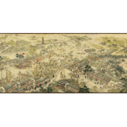
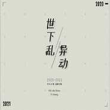
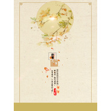

Pig小优
============================

|  |  |
| :--: | :-- |
| [ Pig小优](https://i.xiami.com/xiaoyou) | **地区**: China 中国大陆 **风格**: 国语流行 Mandarin Pop, 中国风 China-Wave **播放数**: 417364 **粉丝数**: 179 **评论数**: 15  |

## 档案

## 专辑

| 名称 | 语种 | 唱片公司 | 发行时间 | 专辑类别 | 专辑风格 |
| :--: | :-- | :-- | :-- | :-- | :-- |
| [ 小姐很忙](./albums/5021335821.md) | 国语 | 独立发行 | 2020年08月21日 | EP, 单曲 | 流行 Pop, 中国风 China-Wave |
| [ 公子对我摇](./albums/5021337564.md) | 国语 | 独立发行 | 2020年08月07日 | EP, 单曲 | 浩室舞曲 House, 中国风 China-Wave |
| [ 不见樱](./albums/5021367482.md) | 国语 | 独立发行 | 2020年07月31日 | EP, 单曲 | 流行 Pop |
| [ 侠之道也](./albums/5021331969.md) | 国语 | 独立发行 | 2020年07月27日 | EP, 单曲 | 流行 Pop, 中国风 China-Wave |
| [ 玄音妙境](./albums/5021334856.md) | 国语 | 独立发行 | 2020年07月18日 | EP, 单曲 | 电子舞曲 EDM / Electronic Dance Music, 中国风 China-Wave |
| [ 姑苏繁华图](./albums/5021334372.md) | 国语 | 独立发行 | 2020年06月24日 | EP, 单曲 | 流行 Pop, 中国风 China-Wave, 华语唱作人 Chinese Singer-Songwriter |
| [ 世下乱·异动](./albums/2108279955.md) | 国语 | 独立发行 | 2020年03月23日 | 录音室专辑 | 中国风 China-Wave, 古风 GuFeng Music, 华语唱作人 Chinese Singer-Songwriter |
| [ 一桥一月一伊人](./albums/2420332720.md) | 国语 | 独立发行 | 2020年03月01日 | 录音室专辑 | 流行 Pop, 中国风 China-Wave |
| [ 临风听暮蝉](./albums/2105598272.md) | 国语 | 独立发行 | 2019年12月18日 | EP, 单曲 | 中国风 China-Wave |
| [ 引神之谕](./albums/2105438920.md) | 国语 |  | 2019年11月14日 | 录音室专辑 |  |
| [ 拾繁花一梦](./albums/2104949946.md) | 国语 | 独立发行 | 2019年06月18日 | EP, 单曲 | 中国风 China-Wave |
| [ 怎误得青烟水阔](./albums/2104770081.md) | 国语 |  | 2019年04月12日 | EP, 单曲 | 中国风 China-Wave |
| [ 知蹊行完美国际师徒系统主题曲](./albums/2104720021.md) | 国语 | 独立发行 | 2018年12月14日 | EP, 单曲 | 古风 GuFeng Music, 国语流行 Mandarin Pop, 中国风 China-Wave |
| [ 浮梦山河（特制版）《女将军和长公主》广播剧主题曲](./albums/2104720033.md) | 国语 | 独立发行 | 2018年12月08日 | EP, 单曲 | 古风 GuFeng Music, 国语流行 Mandarin Pop |
| [ 纯白网剧《热拉物语‖》主题曲](./albums/2104720022.md) | 国语 | 独立发行 | 2018年11月18日 | 原声带, 影视音乐 | 国语流行 Mandarin Pop |
| [ 单翼成蝶](./albums/2104143799.md) | 国语 | 独立发行 | 2018年10月21日 | 精选集 | 流行摇滚 Pop Rock |
| [ 山嵌月](./albums/1632831259.md) | 国语 | 独立发行 | 2015年05月29日 | EP, 单曲 | 国语流行 Mandarin Pop |

## 评论

|  |  |  |
| :-- | :-- | :-- |
|  [虾米用户](https://emumo.xiami.com/u/426943527)  2020-08-24 06:33 赞(0) 踩(0) | 
真的很喜欢你的声音呀神仙姐姐
 |
|  [虾米用户](https://emumo.xiami.com/u/252198165) 吾心在生活中逝去！漯秦 2020-07-05 16:14 赞(1) 踩(0) | 
我来了
 |
| ⇒ |  [虾米用户](https://emumo.xiami.com/u/252198165) 吾心在生活中逝去！漯秦 2020-07-05 16:17 赞(0) 踩(0) | 
发次消息很慢，一晃会几十年的，大家想联系的及时找，我这有时虾米打不开没网
 |
|  [虾米用户](https://emumo.xiami.com/u/342038768) pucikaka don... 2020-06-12 00:09 赞(2) 踩(0) | 
神仙姐姐
 |
|  [虾米用户](https://emumo.xiami.com/u/375896458)  2020-05-25 17:17 赞(1) 踩(0) | 
为了能下载你的歌我都直接充会员了，挺你哦   
 |
|  [虾米用户](https://emumo.xiami.com/u/375896458)  2020-05-25 17:14 赞(2) 踩(0) | 
歌很好听，声音给人以震撼的感觉，我个人非常喜欢
 |
|  [虾米用户](https://emumo.xiami.com/u/354228898)  2019-05-19 23:34 赞(1) 踩(0) | 
太好听了，特别喜欢你唱慢节奏的歌！
 |
|  [虾米用户](https://emumo.xiami.com/u/419857655) 赤眼白发女一一就是我 2019-03-07 18:35 赞(2) 踩(0) | 
这个不错
 |
|  [虾米用户](https://emumo.xiami.com/u/342038768) pucikaka don... 2018-07-01 01:06 赞(3) 踩(0) | 
希望在这能看到更多作品  很好！！！
 |
|  [虾米用户](https://emumo.xiami.com/u/260379435) 我还没想好要写什么... 2017-09-17 10:44 赞(1) 踩(0) | 
大大我会一直支持你的，加油(ง &amp;bull;̀_&amp;bull;́)ง
 |
|  [虾米用户](https://emumo.xiami.com/u/260379435) 我还没想好要写什么... 2017-09-17 10:43 赞(1) 踩(0) | 
哇好棒ヾ ^_^♪
 |
|  [虾米用户](https://emumo.xiami.com/u/223091687) 所谓最难忘的，就是从不曾... 2017-02-15 13:14 赞(1) 踩(0) | 
我们互相做个粉丝吧，蛮喜欢你的声音！
 |
|  [虾米用户](https://emumo.xiami.com/u/65975356)  2015-09-24 15:13 赞(1) 踩(0) | 
声音柔美，曲调悠扬！
 |
|  [虾米用户](https://emumo.xiami.com/u/4180982)   2015-07-09 19:33 赞(1) 踩(0) | 
在echo里发现你的，声音很赞，支持
 |
| ⇒ |  [虾米用户](https://emumo.xiami.com/u/19879021) ➹ 2016-09-07 00:26 赞(0) 踩(0) | 
谢谢^_^
 |
