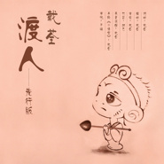

渡人（先行版）
============================

|  |  |
| :--: | :-- |
| [ 渡人（先行版）](https://emumo.xiami.com/album/2100178904) | **艺人**: [戴荃](../index.md) **语种**: 国语 **唱片公司**: 独立发行 **发行时间**: 2015年07月08日 **专辑类别**: EP, 单曲 **专辑风格**: 中国戏曲 Chinese Opera, 国语流行 Mandarin Pop **播放数**: 447711 **收藏数**: 201 **评论数**: 21  |

## 简介

从开始到陨灭，   
人生总一个“情”字当头，   
为情所困，   
为情所伤；   
当我们看到很多、懂得很多后，   
我们告诉别人淡定或是从容，   
却在有一天发现自己无法释怀；   
  
戴荃以《中国好歌曲》第二季中的一首《悟空》被大众所熟知，整首作品恰到好处的融入了中国元素，配以大气的唱腔，呈现出一个不同以往的悟空的内心世界，引起了无数人的共鸣。   
  
他的另一首作品《老神仙》，歌词来自于梦中已故亲人的叮咛，温暖的曲调，轻轻松松唱哭了很多人。   
  
新单曲《渡人》依然延续对于中国文化和元素进行融合的风格，以一个独特的角度、用一个轻松的情绪，希望能够化解的是一些生命中无法避免的情愁。

## 曲目

## 评论

|  |  |  |  |
| :-- | :-- | :-- | :-- |
|  [虾米用户](https://emumo.xiami.com/u/427867823) 什么都没有 2019-07-30 21:40 赞(0) 踩(0) | 
听着有一种舒舒服服的感觉，我很喜欢。
 |
|  [虾米用户](https://emumo.xiami.com/u/21468690) 风 2017-06-03 08:56 赞(0) 踩(0) | 
一道
 |
|  [虾米用户](https://emumo.xiami.com/u/295534682)  2017-05-11 19:46 赞(0) 踩(0) | 
好听 听N遍了
 |
|  [虾米用户](https://emumo.xiami.com/u/270940470)  2017-04-09 18:44 赞(0) 踩(0) | 
好神奇的歌~我居然觉得小清新&amp;hellip; 
 |
|  [虾米用户](https://emumo.xiami.com/u/256305659) 一杯浊酒尽余欢。 2017-03-31 09:12 赞(0) 踩(0) | 

 |
|  [虾米用户](https://emumo.xiami.com/u/260983581)  2017-02-25 18:05 赞(0) 踩(0) | 
不错不错 
 |
|  [虾米用户](https://emumo.xiami.com/u/268078706)  2017-01-26 20:28 赞(0) 踩(0) | 
也不错嘛
 |
|  [虾米用户](https://emumo.xiami.com/u/232708706)  2017-01-15 09:03 赞(0) 踩(0) | 
不错， 
 |
|  [虾米用户](https://emumo.xiami.com/u/249052618)  2016-12-03 04:49 赞(0) 踩(0) | 
因为听歌也要付费所以人少
 |
|  [虾米用户](https://emumo.xiami.com/u/18101042)  2016-09-25 21:41 赞(0) 踩(0) | 
满分
 |
|  [虾米用户](https://emumo.xiami.com/u/587531)  2016-04-27 10:53 赞(0) 踩(0) | 
像个调皮的小和尚唱歌
 |
|  [虾米用户](https://emumo.xiami.com/u/1785089)  2015-12-30 00:43 赞(1) 踩(0) | 
好听
 |
|  [虾米用户](https://emumo.xiami.com/u/7194216) 来聊聊音乐里的小故事吧  2015-09-12 18:58 赞(0) 踩(0) | 
这首歌像周华健呢
 |
| ⇒ |  [虾米用户](https://emumo.xiami.com/u/102743626) 挖金的矿玛士(*๓´╰╯... 2016-01-24 11:28 赞(0) 踩(0) | 
感觉不像
 |
|  [虾米用户](https://emumo.xiami.com/u/8257232)   2015-09-06 20:17 赞(0) 踩(0) | 
果然在网易驻扎了么
 |
|  [虾米用户](https://emumo.xiami.com/u/43974018)  2015-09-06 14:20 赞(1) 踩(0) | 
顶一下
 |
|  [虾米用户](https://emumo.xiami.com/u/10143373) 暂无签名~ 2015-08-23 20:52 赞(3) 踩(0) | 
这么好听的歌怎么人气这么少 
 |
| ⇒ |  [虾米用户](https://emumo.xiami.com/u/8384826) 再见，虾米，谢谢！ 2015-11-05 23:34 赞(0) 踩(0) | 

 |
|  [虾米用户](https://emumo.xiami.com/u/43131600) 岁月如歌，轻轻带过。 2015-08-17 09:36 赞(0) 踩(0) | 
yeah
 |
|  [虾米用户](https://emumo.xiami.com/u/35822739) 猫控 2015-08-15 16:52 赞(0) 踩(0) | 
来听
 |
|  [虾米用户](https://emumo.xiami.com/u/1987681) An elephant ... 2015-08-15 13:47 赞(0) 踩(0) | 
.
 |
