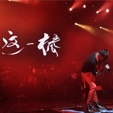

悟空（好歌曲十大金曲版）
============================

|  |  |
| :--: | :-- |
| [ 悟空（好歌曲十大金曲版）](https://emumo.xiami.com/album/2100233352) | **艺人**: [戴荃](../index.md) **语种**: 国语 **唱片公司**: 独立发行 **发行时间**: 2015年03月26日 **专辑类别**: EP, 单曲 **专辑风格**: 中国风 China-Wave **播放数**: 30464627 **收藏数**: 3590 **评论数**: 144  |

## 简介

悟空（好歌曲十大金曲版）

## 曲目

## 评论

|  |  |  |  |
| :-- | :-- | :-- | :-- |
|  [虾米用户](https://emumo.xiami.com/u/440584571)  2020-08-27 20:50 赞(0) 踩(0) | 
佳作
 |
|  [虾米用户](https://emumo.xiami.com/u/38305731)  2020-03-26 11:50 赞(1) 踩(0) | 
始于大闹天宫，终于往事如风告别最初的梦想，与世界和解。
 |
|  [虾米用户](https://emumo.xiami.com/u/423093587)  2019-04-10 14:38 赞(0) 踩(0) | 
壮哉，我要那天，再也遮不住我的眼 ，我要那地，再也埋不住我的心。众生吗，算了，其实，众生的贪婪，都想站在权利的塔顶，利用别人厮杀，以别人为食，众生就是孕育魔鬼的土壤！至于佛吗，佛叫你放下，转身离开，也要主地成佛，何其难；神呢，早就告诉人，人无药可救，听我的跟我走，考试通关，别有胜境！是那魔偏捂了人的眼拽了人的腿，埋了人的心在尘世里生死轮回，无休无止！
 |
|  [虾米用户](https://emumo.xiami.com/u/419926176)  2019-04-05 03:24 赞(0) 踩(0) | 
感触
 |
|  [虾米用户](https://emumo.xiami.com/u/208600447) 又下雨了…… 2019-02-21 11:13 赞(1) 踩(0) | 
歌曲巧妙的融合戏曲的风格，歌词写得精妙绝伦，让人赞叹哦！！！
 |
|  [虾米用户](https://emumo.xiami.com/u/526266) 我不能强迫自己天天签到，... 2018-08-08 15:37 赞(0) 踩(0) | 
我乃本分之人，不是那山间强人。只是越大越明，不敢逾越~
 |
|  [虾米用户](https://emumo.xiami.com/u/10645069)  2017-10-28 00:28 赞(2) 踩(0) | 
第一次还以为是“求佛”…看了欢乐喜剧人的演绎才醒悟，回去反复听了无数遍，结合“大圣归来”真是每次听得汗毛都竖起来。真是唱出了生活百味啊…
 |
|  [虾米用户](https://emumo.xiami.com/u/226833808) 梦里见 2017-10-16 21:47 赞(2) 踩(0) | 
  
 |
|  [虾米用户](https://emumo.xiami.com/u/294863251)   2017-10-12 06:30 赞(1) 踩(0) | 
为什么买了专辑还不能听
 |
|  [虾米用户](https://emumo.xiami.com/u/49959840) 无聊人 2017-09-08 00:39 赞(0) 踩(0) | 
❤️
 |
|  [虾米用户](https://emumo.xiami.com/u/296152848) 别催我！我还没想好要写什... 2017-08-21 07:34 赞(0) 踩(0) | 
我很有感觉
 |
|  [虾米用户](https://emumo.xiami.com/u/260123122)   2017-08-11 17:10 赞(0) 踩(0) | 
/
 |
|  [虾米用户](https://emumo.xiami.com/u/1546167) 钧钧大魔王 2017-07-04 22:17 赞(0) 踩(0) | 
选择了就很难回头了
 |
|  [虾米用户](https://emumo.xiami.com/u/254628352)  2017-06-03 15:07 赞(0) 踩(0) | 
这一棒 叫你灰飞烟灭
 |
|  [虾米用户](https://emumo.xiami.com/u/16399100)  2017-05-10 09:41 赞(0) 踩(0) | 
适合处理比较烦闷的工作时单曲循环
 |
|  [虾米用户](https://emumo.xiami.com/u/224893) 你这是想红你造吗 2017-05-08 19:33 赞(1) 踩(0) | 
现场版的伴奏+录音室的vocal 可以当准录音室版听了
 |
|  [虾米用户](https://emumo.xiami.com/u/51974571)  2017-05-02 05:27 赞(0) 踩(0) | 
hao
 |
|  [虾米用户](https://emumo.xiami.com/u/284696797)  2017-04-28 01:11 赞(0) 踩(0) | 
66
 |
|  [虾米用户](https://emumo.xiami.com/u/240209273)  2017-04-27 10:08 赞(0) 踩(0) | 
中国风，意境深，有韵味，听不厌！！推荐！！
 |
|  [虾米用户](https://emumo.xiami.com/u/289477491) 这家伙很聪明什么也没留下... 2017-04-26 22:33 赞(0) 踩(0) | 

 |
|  [虾米用户](https://emumo.xiami.com/u/289534347)   2017-04-24 23:47 赞(0) 踩(0) | 
支持师兄！ 
 |
| ⇒ |  [虾米用户](https://emumo.xiami.com/u/9922500) 好音乐分享 2017-05-04 05:46 赞(0) 踩(0) | 
你是八戒？
 |
| ⇒ |  [虾米用户](https://emumo.xiami.com/u/289534347)   2017-05-28 21:40 赞(0) 踩(0) | 
<q><b>小魚说：</b></q>
 |
|  [虾米用户](https://emumo.xiami.com/u/37445920)  2017-04-24 15:34 赞(0) 踩(0) | 
不错，好歌曲当时没听，现在听起来很有感觉，词写的也非常好～～
 |
|  [虾米用户](https://emumo.xiami.com/u/290603974)   2017-04-23 17:52 赞(0) 踩(0) | 
不知是师傅成就了悟空，还是悟空成就了师傅
 |
| ⇒ |  [虾米用户](https://emumo.xiami.com/u/202515667)  2017-04-24 17:23 赞(0) 踩(0) | 
是悟空成就了悟空
 |
| ⇒ |  [虾米用户](https://emumo.xiami.com/u/410947250)   2020-11-19 07:34 赞(0) 踩(0) | 
与其说谁成就了谁，不如说相互成就了对方。
 |
|  [虾米用户](https://emumo.xiami.com/u/289391121)  2017-04-17 20:18 赞(0) 踩(0) | 
好听
 |
|  [虾米用户](https://emumo.xiami.com/u/259284887)  2017-04-15 23:45 赞(0) 踩(0) | 
好听
 |
|  [虾米用户](https://emumo.xiami.com/u/252300379)  2017-04-13 14:56 赞(1) 踩(0) | 
好听
 |
|  [虾米用户](https://emumo.xiami.com/u/43516354)  2017-04-08 11:07 赞(1) 踩(0) | 
空灵
 |
|  [虾米用户](https://emumo.xiami.com/u/266608383)  2017-04-08 09:39 赞(2) 踩(0) | 
******
 |
|  [虾米用户](https://emumo.xiami.com/u/19209752)  2017-04-06 21:13 赞(1) 踩(0) | 
蛮好的
 |
|  [虾米用户](https://emumo.xiami.com/u/246521459)   2017-04-04 21:20 赞(1) 踩(0) | 
都是ViP   
 |
|  [虾米用户](https://emumo.xiami.com/u/266550220)  2017-04-04 14:03 赞(1) 踩(0) | 

 |
|  [虾米用户](https://emumo.xiami.com/u/267164387)  2017-04-03 21:07 赞(1) 踩(0) | 
好听
 |
|  [虾米用户](https://emumo.xiami.com/u/258688397)  2017-03-30 00:37 赞(2) 踩(0) | 
好
 |
|  [虾米用户](https://emumo.xiami.com/u/281092183) 耶稣爱我 2017-03-27 14:24 赞(3) 踩(0) | 
新奇戏曲风格加的自然不违和、小感人，很丰满的表现力，赞！更喜欢赞美之泉，耐听。
 |
|  [虾米用户](https://emumo.xiami.com/u/57065642)  2017-03-26 22:49 赞(1) 踩(0) | 
好听
 |
|  [虾米用户](https://emumo.xiami.com/u/283593489) 青春是人生的实验课 2017-03-26 18:32 赞(16) 踩(0) | 
这首歌经典在句句不提悟空，却句句不离悟空。
 |
|  [虾米用户](https://emumo.xiami.com/u/268628985)  2017-03-24 14:00 赞(1) 踩(0) | 
好听
 |
|  [虾米用户](https://emumo.xiami.com/u/282842628)  2017-03-24 06:36 赞(1) 踩(0) | 
很好，很喜欢
 |
|  [虾米用户](https://emumo.xiami.com/u/279715433) 我总不该将喜怒哀乐寄托在... 2017-03-23 19:10 赞(1) 踩(0) | 
好听
 |
|  [虾米用户](https://emumo.xiami.com/u/263692091)  2017-03-23 17:37 赞(1) 踩(0) | 
嗯
 |
|  [虾米用户](https://emumo.xiami.com/u/30655073)  2017-03-21 15:42 赞(1) 踩(0) | 
好听！
 |
|  [虾米用户](https://emumo.xiami.com/u/241794457)  2017-03-19 18:11 赞(1) 踩(0) | 
好听！
 |
|  [虾米用户](https://emumo.xiami.com/u/267819700) 等一阵风，等一个不可能的... 2017-03-16 13:07 赞(2) 踩(0) | 
爱过恨过就无悔 
 |
|  [虾米用户](https://emumo.xiami.com/u/279816932) 不作死就不会死，。，。？... 2017-03-15 21:02 赞(1) 踩(0) | 
好听!
 |
|  [虾米用户](https://emumo.xiami.com/u/280401445)  2017-03-14 21:33 赞(1) 踩(0) | 
太好听了
 |
|  [虾米用户](https://emumo.xiami.com/u/91372642) 不開心就不好看了 2017-03-02 11:48 赞(1) 踩(0) | 
呔
 |
|  [虾米用户](https://emumo.xiami.com/u/249937070) 人生若无悔放下过去归零 2017-02-27 08:42 赞(17) 踩(0) | 
颜值高的反而都单身，没娶的别慌，待嫁的别忙，经营好自己，珍惜当下时光，一切该来的总会到。岁月漫长，你心地善良，终会有一人陪你骑马喝酒走四方。 ​​​ ​​​​
 |
|  [虾米用户](https://emumo.xiami.com/u/275909990) 做一个善良的人 2017-02-25 01:48 赞(2) 踩(0) | 
斗战胜佛与齐天大圣，还是喜欢后者的桀骜
 |
|  [虾米用户](https://emumo.xiami.com/u/43570370) 云淡风轻 2017-02-10 17:37 赞(1) 踩(0) | 
和京剧结合最好的流行歌曲，词写得好也是重点。
 |
|  [虾米用户](https://emumo.xiami.com/u/250971574)  2017-01-26 23:21 赞(1) 踩(0) | 
喜欢
 |
|  [虾米用户](https://emumo.xiami.com/u/2016) 哈哈哈 2017-01-22 17:32 赞(1) 踩(0) | 
听着想哭
 |
|  [虾米用户](https://emumo.xiami.com/u/261930604)  2017-01-14 21:02 赞(1) 踩(0) | 
 
 |
|  [虾米用户](https://emumo.xiami.com/u/249937070) 人生若无悔放下过去归零 2016-12-26 00:42 赞(1) 踩(0) | 
渐渐的知道了，很多东西可遇而不可求，不属于自己的，何必拼了命去在乎。你是你人生的作者，何必把剧本写得苦不堪言。
 |
|  [虾米用户](https://emumo.xiami.com/u/253485847) 一个人滴音乐 2016-12-10 21:33 赞(1) 踩(0) | 
好听，感觉不错
 |
|  [虾米用户](https://emumo.xiami.com/u/119702322)  2016-11-26 23:11 赞(1) 踩(0) | 
悟空
 |
|  [虾米用户](https://emumo.xiami.com/u/49077808)   2016-11-21 11:07 赞(1) 踩(0) | 
特别
 |
|  [虾米用户](https://emumo.xiami.com/u/38626013)  2016-11-20 18:50 赞(1) 踩(0) | 
好
 |
|  [虾米用户](https://emumo.xiami.com/u/7056179)  2016-11-01 14:29 赞(1) 踩(0) | 
不耐听
 |
|  [虾米用户](https://emumo.xiami.com/u/19350462) 音乐和绘画都是好厉害的东 2016-10-30 17:32 赞(1) 踩(0) | 
给四分唯一的理由就是不是妹子唱的，个人的理由。
 |
| ⇒ |  [虾米用户](https://emumo.xiami.com/u/46001921)   2017-01-07 15:00 赞(0) 踩(0) | 
有些歌男女唱的感觉不一样
 |
|  [虾米用户](https://emumo.xiami.com/u/34303341)  2016-10-27 01:36 赞(1) 踩(0) | 
今何在的悟空传
 |
|  [虾米用户](https://emumo.xiami.com/u/80242)  2016-10-24 20:32 赞(1) 踩(0) | 
喜欢
 |
|  [虾米用户](https://emumo.xiami.com/u/237223925) 人生如刀 2016-10-21 21:04 赞(1) 踩(0) | 
谁叫我身手不凡
 |
|  [虾米用户](https://emumo.xiami.com/u/48002698)   2016-10-19 07:19 赞(1) 踩(0) | 
我要这铁棒有何用
 |
|  [虾米用户](https://emumo.xiami.com/u/7008104)   2016-10-16 08:38 赞(8) 踩(0) | 
内地原创，难有相比肩之佳作。
 |
|  [虾米用户](https://emumo.xiami.com/u/232614934) 爱！是什么？ 2016-10-11 09:45 赞(1) 踩(0) | 
挺好听的！
 |
|  [虾米用户](https://emumo.xiami.com/u/33588925)  2016-10-10 11:25 赞(1) 踩(0) | 
太好听
 |
|  [虾米用户](https://emumo.xiami.com/u/221793173) 时间总是在飞逝之间 2016-10-02 18:08 赞(1) 踩(0) | 
帮
 |
|  [虾米用户](https://emumo.xiami.com/u/88748156)   2016-09-30 20:57 赞(1) 踩(0) | 
好听
 |
|  [虾米用户](https://emumo.xiami.com/u/531675)   2016-09-23 18:07 赞(1) 踩(0) | 
还是最喜欢你唱的版本，加油
 |
|  [虾米用户](https://emumo.xiami.com/u/48909131)  2016-09-19 14:19 赞(1) 踩(0) | 
好听
 |
|  [虾米用户](https://emumo.xiami.com/u/24603211) 没那么多妄想就没那多失望 2016-09-14 19:29 赞(1) 踩(0) | 
原版的最好！
 |
|  [虾米用户](https://emumo.xiami.com/u/25772117)   2016-09-02 11:07 赞(1) 踩(0) | 
原创 给力 有才艺
 |
|  [虾米用户](https://emumo.xiami.com/u/25587361)  2016-09-01 13:45 赞(2) 踩(0) | 
那人好像狗啊
 |
|  [虾米用户](https://emumo.xiami.com/u/26581909)  2016-09-01 10:37 赞(3) 踩(0) | 
妈妈问我为什么跪着听歌
 |
|  [虾米用户](https://emumo.xiami.com/u/220649557)  2016-08-30 09:56 赞(0) 踩(0) | 
打妖怪专用
 |
|  [虾米用户](https://emumo.xiami.com/u/5985651) 逆风飞翔 2016-08-28 11:16 赞(0) 踩(0) | 
真好听。喜欢喜欢。
 |
|  [虾米用户](https://emumo.xiami.com/u/19728471)   2016-08-13 08:34 赞(0) 踩(0) | 
力荐
 |
|  [虾米用户](https://emumo.xiami.com/u/31066088) 奔四的男人 2016-08-10 03:13 赞(3) 踩(0) | 
个人认为是现今内地最棒的男声单曲，没有之一。
 |
|  [虾米用户](https://emumo.xiami.com/u/8226204) ≡ 2016-08-07 11:34 赞(0) 踩(0) | 
喜欢
 |
|  [虾米用户](https://emumo.xiami.com/u/12797763) 口味比较杂 2016-08-06 00:53 赞(0) 踩(0) | 
我不会戴紧箍咒的
 |
|  [虾米用户](https://emumo.xiami.com/u/9144182) 京阿尼挺住！！！冲鸭！！... 2016-07-24 09:17 赞(0) 踩(0) | 
昨晚的bml上听了他的现场版悟空，真是太赞了(•̀ᴗ•́)و ̑̑
 |
|  [虾米用户](https://emumo.xiami.com/u/204358613)  2016-07-23 22:21 赞(1) 踩(0) | 
太让人回味的一首歌
 |
|  [虾米用户](https://emumo.xiami.com/u/202257775)  2016-07-18 11:53 赞(0) 踩(0) | 
hao
 |
|  [虾米用户](https://emumo.xiami.com/u/89770270)  2016-07-18 04:37 赞(1) 踩(0) | 
欢乐喜剧人配合这歌简直绝了。循环了N遍……看喜欢现场版的，这个音质稍差…齐天大圣我们心中永远的神奇跟儿时最美好的回忆之一…
 |
|  [虾米用户](https://emumo.xiami.com/u/23938959)  2016-06-24 08:36 赞(2) 踩(0) | 
“是人是鬼是妖怪，不过是心有魔债” ——心有魔债，悟了“这一棒，让你灰飞烟灭”——当头一棒，执念没了，空了呵呵，我来强行解释
 |
|  [虾米用户](https://emumo.xiami.com/u/74209690) 旧地偏不可再遇你你在何地 2016-06-09 21:29 赞(0) 踩(0) | 
有才啊 
 |
|  [虾米用户](https://emumo.xiami.com/u/2974730)  2016-06-02 12:04 赞(0) 踩(0) | 
音质怎么这么差啊
 |
|  [虾米用户](https://emumo.xiami.com/u/468473) 你是妈妈的心肝宝贝 2016-05-15 08:18 赞(0) 踩(0) | 
有灵性的歌手，有灵性的歌曲。
 |
|  [虾米用户](https://emumo.xiami.com/u/4732522)  2016-05-11 17:24 赞(1) 踩(0) | 
这首歌充满了灵性！
 |
|  [虾米用户](https://emumo.xiami.com/u/80985690)  2016-05-07 16:02 赞(1) 踩(0) | 
这是原唱？
 |
|  [虾米用户](https://emumo.xiami.com/u/136665408)  2016-05-07 08:17 赞(0) 踩(0) | 
大爱！
 |
| ⇒ |  [虾米用户](https://emumo.xiami.com/u/87484618)  2016-11-02 23:49 赞(0) 踩(0) | 
对
 |
|  [虾米用户](https://emumo.xiami.com/u/157603454) 百度的方小顿 2016-05-02 23:42 赞(0) 踩(0) | 
 
 |
|  [虾米用户](https://emumo.xiami.com/u/118825860)  2016-04-15 22:49 赞(1) 踩(0) | 
我要，这铁棒有何用？
 |
|  [虾米用户](https://emumo.xiami.com/u/34348582) 你也在这里 2016-04-15 05:47 赞(0) 踩(0) | 
棒
 |
|  [虾米用户](https://emumo.xiami.com/u/33853317)  2016-04-13 11:38 赞(0) 踩(0) | 
叫一声佛祖，已无回头路。拜一人为师，再无自由。
 |
|  [虾米用户](https://emumo.xiami.com/u/7234064)  2016-04-11 22:45 赞(0) 踩(0) | 
难。
 |
|  [虾米用户](https://emumo.xiami.com/u/21174409)  2016-04-11 10:45 赞(1) 踩(0) | 
心有魔债！
 |
|  [虾米用户](https://emumo.xiami.com/u/27102886)  2016-04-10 13:41 赞(2) 踩(0) | 
金箍当头，欲说还休，世恶道险，终究难逃！
 |
|  [虾米用户](https://emumo.xiami.com/u/16746081)  2016-04-10 02:19 赞(2) 踩(0) | 
这个版本很难超越了！！
 |
|  [虾米用户](https://emumo.xiami.com/u/16746081)  2016-04-10 02:17 赞(2) 踩(0) | 
这歌太有深度了！！！
 |
|  [虾米用户](https://emumo.xiami.com/u/125086176)   2016-04-08 23:08 赞(0) 踩(0) | 
好听，听了好多遍
 |
|  [虾米用户](https://emumo.xiami.com/u/136757794)  2016-04-08 01:03 赞(0) 踩(0) | 
<a href="http://www.lenovo.com.cn/product/50662.html" target="_blank" rel="nofollow noreferrer noopener">http://www.lenovo.com.cn/product/50662.html</a>
 |
|  [虾米用户](https://emumo.xiami.com/u/136757794)  2016-04-08 01:01 赞(2) 踩(0) | 
评论这么少？难得的好歌，词好节奏好，有故事有深度，也是荃哥发挥的最淋漓尽致的一个版本！顶起
 |
|  [虾米用户](https://emumo.xiami.com/u/21183913)  2016-04-06 23:33 赞(2) 踩(0) | 
是人是鬼是妖怪，不过是，心有魔债……
 |
|  [虾米用户](https://emumo.xiami.com/u/9612065) 长不大的死小孩 2016-04-06 00:27 赞(1) 踩(0) | 
谁要成佛？我只要“御剑乘风来，除魔天地间，有酒乐逍遥，无酒我亦癫。”
 |
|  [虾米用户](https://emumo.xiami.com/u/55053690)  2016-04-05 17:35 赞(0) 踩(0) | 
唱尽人间百态，阅遍世间繁华，这一棒，叫你灰飞烟灭！
 |
|  [虾米用户](https://emumo.xiami.com/u/2127206) 冬雪小公主 2016-04-05 13:41 赞(0) 踩(0) | 
前途无量的歌手
 |
|  [虾米用户](https://emumo.xiami.com/u/125721562)  2016-04-05 10:22 赞(1) 踩(0) | 
听了几首，只有这首最感动。
 |
|  [虾米用户](https://emumo.xiami.com/u/19360588)  2016-04-04 23:19 赞(1) 踩(0) | 
金箍当头，欲说还休
 |
|  [虾米用户](https://emumo.xiami.com/u/94597050)  2016-04-04 02:06 赞(0) 踩(0) | 
有灵魂
 |
|  [虾米用户](https://emumo.xiami.com/u/133522352)  2016-04-03 22:02 赞(0) 踩(0) | 
好听
 |
|  [虾米用户](https://emumo.xiami.com/u/460669)   2016-04-02 01:43 赞(1) 踩(0) | 
好听 没话说 大圣 大圣！ ：）
 |
|  [虾米用户](https://emumo.xiami.com/u/460669)   2016-04-02 01:35 赞(0) 踩(0) | 
还是这个好～～
 |
|  [虾米用户](https://emumo.xiami.com/u/128327452)  2016-03-29 13:09 赞(0) 踩(0) | 
好听
 |
|  [虾米用户](https://emumo.xiami.com/u/128327452)  2016-03-29 13:09 赞(0) 踩(0) | 
中国风
 |
|  [虾米用户](https://emumo.xiami.com/u/51683602)   2016-03-24 18:13 赞(0) 踩(0) | 
很有感觉的歌曲~
 |
|  [虾米用户](https://emumo.xiami.com/u/51683602)   2016-03-24 18:13 赞(0) 踩(0) | 
很有感觉的歌曲~
 |
|  [虾米用户](https://emumo.xiami.com/u/11382705)   2016-02-27 21:20 赞(1) 踩(0) | 
居然是我生日这一天的专辑QAQ
 |
|  [虾米用户](https://emumo.xiami.com/u/15284428) (´･_･`) 2016-02-17 02:07 赞(1) 踩(0) | 
get
 |
|  [虾米用户](https://emumo.xiami.com/u/699132) Every small ... 2016-02-09 21:26 赞(1) 踩(0) | 
词写得好棒
 |
| ⇒ |  [虾米用户](https://emumo.xiami.com/u/45082224) 已不再是曾经那个他了。 2016-04-02 16:44 赞(0) 踩(0) | 
是的，我也感觉词写的好！
 |
|  [虾米用户](https://emumo.xiami.com/u/1322376) 背叛能让你获得自由 2016-02-01 20:33 赞(10) 踩(0) | 
还是现场版的？封面能换张不带水印的么……
 |
| ⇒ |  [虾米用户](https://emumo.xiami.com/u/8226204) ≡ 2016-09-30 22:03 赞(0) 踩(0) | 
换了_(:з」∠)_
 |
|  [虾米用户](https://emumo.xiami.com/u/40131943)  2016-01-29 13:17 赞(2) 踩(0) | 
越听越有味道
 |
|  [虾米用户](https://emumo.xiami.com/u/50807135) 你不困吗？ 2016-01-29 01:34 赞(2) 踩(0) | 
猴哥，我已成魔
 |
|  [虾米用户](https://emumo.xiami.com/u/22444238) 邱比官方虾米 2016-01-21 22:11 赞(17) 踩(0) | 
Get
 |
|  [虾米用户](https://emumo.xiami.com/u/54149011) 我还没想好要写什么... 2016-01-19 09:27 赞(1) 踩(0) | 
好听
 |
|  [虾米用户](https://emumo.xiami.com/u/85564558) 褪去虚伪，留下真实！ 2016-01-16 14:19 赞(1) 踩(0) | 

 |
|  [虾米用户](https://emumo.xiami.com/u/97204520)  2016-01-16 09:50 赞(1) 踩(0) | 
真的好听
 |
|  [虾米用户](https://emumo.xiami.com/u/98435764)  2016-01-08 16:20 赞(1) 踩(0) | 
好听哒
 |
|  [虾米用户](https://emumo.xiami.com/u/52690559) 真实中虚拟，虚拟中真实。 2016-01-08 11:27 赞(0) 踩(0) | 
韵味
 |
|  [虾米用户](https://emumo.xiami.com/u/9797272) ヽ(*´∀｀)ノ 2016-01-07 15:37 赞(84) 踩(0) | 
有志难伸，回头无岸。没了逍遥自在，换了一个斗战胜佛的名号你觉得可好？也好，连你都不得不选择随波逐流，我还有什么可抱怨的。
 |
| ⇒ |  [虾米用户](https://emumo.xiami.com/u/105822112) 乡村霉 2016-02-03 05:58 赞(0) 踩(0) | 
我宁愿相信悟空传是原版 死去的是大圣 活下来的是六耳
 |
|  [虾米用户](https://emumo.xiami.com/u/46775984) 鼠年大吉吧 2015-11-22 13:52 赞(0) 踩(0) | 

 |
|  [虾米用户](https://emumo.xiami.com/u/49600177) Young 4 ever... 2015-11-14 00:30 赞(0) 踩(0) | 
  
 |
|  [虾米用户](https://emumo.xiami.com/u/51938697) 我给的，不是你想要的。 2015-11-10 00:42 赞(3) 踩(0) | 
叫一声。  佛祖
 |
|  [虾米用户](https://emumo.xiami.com/u/44673580)  2015-11-09 13:19 赞(2) 踩(0) | 
还是这个版本有味道，那个新的总感觉精致是精致了，没有那种当初现场唱的力度和粗狂了
 |
|  [虾米用户](https://emumo.xiami.com/u/8608040) 在荒原里永远解不开的心结 2015-11-08 12:41 赞(1) 踩(0) | 
终于有了，在b站循环了无数次，但还是有味道
 |
