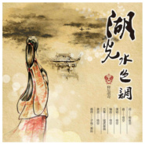

湖光水色调
============================

|  |  |
| :--: | :-- |
| [ 湖光水色调](https://emumo.xiami.com/album/2100233378) | **艺人**: [戴荃](../index.md) **语种**: 国语 **唱片公司**: 独立发行 **发行时间**: 2014年07月22日 **专辑类别**: EP, 单曲 **专辑风格**: 中国戏曲 Chinese Opera, 国语流行 Mandarin Pop, 中国风 China-Wave **播放数**: 1015315 **收藏数**: 194 **评论数**: 14  |

## 简介

这首歌是在墨明棋妙南京“金陵秦淮夜”音乐会期间和荀夜羽的合作，一直在道长的激励下终于完成了这次的男生版。这次的插图是水铅手绘，一直坚持自身艺术立场的好朋友的鼎力相助。自己唱自己写的歌感慨万千，啥也不说了，见歌。

## 曲目

## 评论

|  |  |  |
| :-- | :-- | :-- |
|  [虾米用户](https://emumo.xiami.com/u/427755129)  2019-10-26 14:16 赞(0) 踩(0) | 
很入心的轻柔！喜欢听能让心灵安静！
 |
|  [虾米用户](https://emumo.xiami.com/u/327763955) 天生我材必有用 2019-10-04 19:49 赞(0) 踩(0) | 
新时代古风代表作！
 |
|  [虾米用户](https://emumo.xiami.com/u/374322532)  2019-06-19 07:28 赞(0) 踩(0) | 
好听的声音
 |
|  [虾米用户](https://emumo.xiami.com/u/122129950)  2019-06-14 14:37 赞(0) 踩(0) | 
一曲中国风，唱出山水诗画意境，情丝穿梭时空，用美展现那一份情怀。 好啊！
 |
|  [虾米用户](https://emumo.xiami.com/u/9094085)  2018-07-26 19:25 赞(0) 踩(0) | 
好听，词美，听过后旋律一直在耳边萦绕
 |
|  [虾米用户](https://emumo.xiami.com/u/55219225)  2018-07-19 23:18 赞(0) 踩(0) | 
意蕴最足的版本。7月10号曾在洞庭湖边岳阳楼上哼这首歌╮(╯▽╰)╭
 |
|  [虾米用户](https://emumo.xiami.com/u/30800139) 我在低俗与高雅间活的很尴... 2018-02-28 00:24 赞(0) 踩(0) | 
。
 |
|  [虾米用户](https://emumo.xiami.com/u/51782389) 青山不改 绿水长流 2017-08-12 11:53 赞(0) 踩(0) | 
有别于一些浮躁的网络古风歌曲，八百里洞庭，该是如此
 |
|  [虾米用户](https://emumo.xiami.com/u/78116330)  2017-04-02 06:57 赞(0) 踩(0) | 
咯
 |
|  [虾米用户](https://emumo.xiami.com/u/1978863)  2017-03-20 04:05 赞(1) 踩(0) | 
喜欢中国风，歌词也很美
 |
|  [虾米用户](https://emumo.xiami.com/u/88762722)   2017-03-05 09:32 赞(0) 踩(0) | 
戴荃的歌，这是最喜欢的一首。
 |
|  [虾米用户](https://emumo.xiami.com/u/3893500)  2016-09-18 11:00 赞(0) 踩(0) | 
听了这歌特意去读了柳毅传
 |
|  [虾米用户](https://emumo.xiami.com/u/38482655)  2016-06-24 14:02 赞(0) 踩(0) | 
一听就是戴荃，辨识度超级高，非常好听
 |
|  [虾米用户](https://emumo.xiami.com/u/13961269)  2015-11-25 17:22 赞(0) 踩(0) | 
听来有烟波浩渺的感觉
 |
