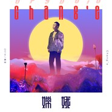

嫦娥
============================

|  |  |
| :--: | :-- |
| [ 嫦娥](https://emumo.xiami.com/album/2108139319) | **艺人**: [戴荃](../index.md) **语种**: 国语 **唱片公司**: 海蝶音乐 **发行时间**: 2018年07月30日 **专辑类别**: EP, 单曲 **专辑风格**: 流行 Pop **播放数**: 1142 **收藏数**: 0 **评论数**: 0  |

## 简介

音乐诗人 戴荃 加冕之作 
新融合主义「神」曲《嫦娥》 
音乐诗人加冕之夜，超级月亮再次悬挂天空 
与嫦娥共舞，戴荃新融合主义“神”曲，听觉飞升 
木心说：诗人加冕之夜，很寂静。读诗时，心中有似音乐非音乐的涌动，即可。 
诗不限于文字，安藤忠雄把建筑变成光线的容器，结构之中光的呈现被赋予生命的意义，当置身其中，你才明白为何他是“光的诗人”。音乐一样也可以是意象化的，刹那间让听者达到理性面和感性面的融合。戴荃新作《嫦娥》写对月亮和嫦娥的崇拜、向往，直到飞升上天与嫦娥共舞的幻乐一程，这样的内容显然不在当下流行音乐表述范畴之内。《嫦娥》是戴荃进行新融合主义尝试的一次潜心创作。歌曲以中国民乐的基调进入，古筝响起，听者进入一条分隔现实和幻想的长廊，拾阶而上的过程中，电子、古典、Triphop各种色彩融入，如同氤氲而起的浓雾，尽头何处？ 
“听说下一次，是2034年，到了那一天，我在哪边？“。长廊的尽头，看到的是高台上举头望月的另一个自己，超级月亮此刻挂在天空，嫦娥在上。中国宫廷雅乐式唱腔与现代唱法糅合，相互变换交错，似乎两个不同的自己在时空的切换点交叠，一个自己在和自己对话，一个自己在对嫦娥倾诉。 
戴荃用间奏调性的变化与节奏的转折，拉伸了整体线条；4/4/拍与8/12拍的交替混合，导致另类与迷离的听觉效果，倾诉者从地面飞升去往天上，与嫦娥共舞，摇滚的色彩恰好在烘托共舞时毫不突兀地抹上浓重的一笔。最后的一刻，超级月亮慢慢升起，与嫦娥和世人约定，2034我们再见。 
在戴荃的音乐里，中国风创作的边界消失了，在主题中自由徜徉，各种风格元素交叠融合，音乐的想象被完全释放，甚至天马行空。层层推进的曲式，没有重复的段落，颠覆掉流行歌曲写作题材、结构、风格上的限制，戴荃如同一个音乐世界里的诗人，听者最终集中所有在他呈现的意象之上与情境之中。融合主义虽然可以包罗万象，但万变又不离其宗，一个真正的风格调度者，每一种风格都熟捻于心。 
嫦娥的解读，可以有很多种，也可以是诗性的，超级月亮之下，嫦娥从一个向往、倾诉的对象，变成可以与之共舞，这样的「神」曲，确实是华语乐坛难得一闻的佳作。继上一波城市概念单曲《同时》在全国各大音乐电台榜单收获冠军之后，戴荃从现实题材，又飞升到一个超现实主义的题材，同一个戴荃，给你完全不同的听觉体验。

## 曲目

## 评论

