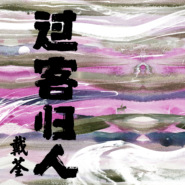
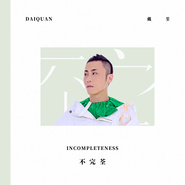
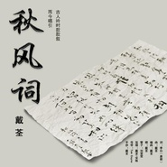
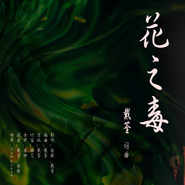

戴荃
============================

|  |  |
| :--: | :-- |
| [ 戴荃](https://i.xiami.com/daiquan) | **播放数**: 42472025 **粉丝数**: 29463 **评论数**: 584 **地区**: China 中国大陆 **风格**: 中国民乐 Chinese Folk Music, 中国戏曲 Chinese Opera, 艺术流行 Art Pop, 华语唱作人 Chinese Singer-Songwriter, 古风 GuFeng Music  |

## 档案

戴荃，唱作人、音乐制作人。将古风、国风、民族、民间、戏曲等中国各元素融入流行音乐的灵魂歌者；集词、曲、唱、编、制作等才华于一身的全能音乐人。代表作《悟空》、《老神仙》、《渡人》、《喝汤》、《上海三月》《青山白云》等。 
首位“好声音好歌曲双料艺人”，《中国好歌曲》第二季全国四强，原创音乐作品《悟空》成为国民金曲现象级歌曲。 2017 年 5 月 15 日发布个人首张全创作专辑《悟空》，受到业界一致好评，音乐实力得到高度认可，受邀为《悟空传》、《大护法》、《十万个冷笑话 2 》等大电影，动画《雪鹰领主》、网易《梦幻西游》、腾讯《天龙八部》等经典游戏创作并演唱主题曲。 
2018 年 11 月 20 日发布第二张全创作专辑《不完荃》 
2019 年 3 月 8 日发布与 ilem 、张亚东合作的单曲《大氿歌》 
2019 年 12 月 5 日发布第三张个人专辑的首发曲《青山白云》， 17 日发布第二首曲目《笑到飞起来》， 23 日同时发布四首新歌《二郎》《过客归人》《够了》《小花》，其中《过客归人》为新专辑主打曲。 
奖项： 
2015  《中国好歌曲》十大金曲 奖 
2015     新浪微博 ---- 年度十大金曲 
2016     第十六届音乐风云榜年度盛典 ---- 原创新势力奖 
2017     中国热歌榜中榜音乐盛典 ---- 最热门唱作人 
2017     全球中文音乐榜上榜年度盛典 ---- 最佳中文歌曲 
2017    MusicRadio 音乐之声 2018 年度中国 TOP 排行榜【年度最佳制作人】奖 
2018     第二十五届东方风云榜 ---- 最佳创作新锐奖、十大金曲奖（《悟空》） 
2018    MusicRadio 音乐之声 2018 年度中国 TOP 排行榜【年度最佳男歌手】奖 
2018 MusicRadio 全球流行音乐金榜【年度荣誉创作人】【年度金曲 - 《神泣》】 
2019     音乐先锋榜三十一载荣耀盛典 【最佳唱作人】【杰出歌手】【年度最佳原创音乐人】三项大奖

## 专辑

| 名称 | 语种 | 唱片公司 | 发行时间 | 专辑类别 | 专辑风格 |
| :--: | :-- | :-- | :-- | :-- | :-- |
| [ 北冥有鱼（《上线吧！华彩少年》片尾曲）](./albums/5021962531.md) | 国语 | 海蝶音乐 | 2020年12月29日 | EP, 单曲 | 流行 Pop |
| [ 快意燃刀](./albums/5020786581.md) | 国语 | 腾讯游戏, 腾讯音乐, 大玩咖 | 2020年05月29日 | EP, 单曲 | 原声 Soundtrack |
| [ 黑眼圈黑眼圈](./albums/5020760014.md) | 国语 | 独立发行 | 2020年05月25日 | EP, 单曲 | 流行 Pop |
| [ 《散》伴奏](./albums/5021019187.md) | 国语 | 海蝶音乐 | 2020年01月14日 | EP, 单曲 | 流行 Pop |
| [ 《过客归人》伴奏4首](./albums/5021028632.md) | 国语 | 海蝶音乐 | 2020年01月14日 | EP, 单曲 | 流行 Pop, 中国风 China-Wave, 华语唱作人 Chinese Singer-Songwriter |
| [ 笑到飞起来（伴奏）](./albums/5021011397.md) | 国语 | 海蝶音乐 | 2020年01月14日 | EP, 单曲 | 流行 Pop |
| [ 散](./albums/2108144265.md) | 其他 | Nowhere Records | 2020年01月06日 | EP, 单曲 | 流行 Pop |
| [ 过客归人](./albums/2108139343.md) | 其他 |  | 2019年12月23日 | EP, 单曲 | 流行 Pop |
| [ 笑到飞起来](./albums/2108145253.md) | 其他 | Gluten Free Records | 2019年12月17日 | EP, 单曲 | 流行 Pop |
| [ 青山白云（伴奏）](./albums/5021017874.md) | 纯音乐 | 海蝶音乐 | 2019年12月13日 | 录音室专辑 | 中国风 China-Wave, 华语唱作人 Chinese Singer-Songwriter |
| [ 青山白云](./albums/2108140709.md) | 国语 | Merlin Records | 2019年12月05日 | EP, 单曲 |  |
| [ 封魔](./albums/2104617342.md) | 国语 | 星芒文化 | 2019年02月22日 | EP, 单曲 | 国语流行 Mandarin Pop |
| [ 不完荃](./albums/2104245655.md) | 国语 | 海蝶音乐 | 2018年11月20日 | 录音室专辑 | 国语流行 Mandarin Pop |
| [ 春风](./albums/2108142326.md) | 其他 | Gluten Free Records | 2018年10月11日 | EP, 单曲 | 流行 Pop |
| [ 东走迷](./albums/5020983123.md) | 国语 |  | 2018年08月30日 | EP, 单曲 | 流行 Pop |
| [ 嫦娥](./albums/2108139319.md) | 国语 | 海蝶音乐 | 2018年07月30日 | EP, 单曲 | 流行 Pop |
| [ 同时](./albums/2103752408.md) | 国语 | 海蝶音乐 | 2018年06月19日 | EP, 单曲 | 流行 Pop, 城市民谣 Urban Folk, 迷幻流行 Psychedelic Pop |
| [ 天龙赋](./albums/2103502208.md) | 国语 | 腾讯游戏 | 2018年01月26日 | EP, 单曲 | 中国风 China-Wave, 古风 GuFeng Music |
| [ 梦天涯](./albums/2103464996.md) | 国语 | 网易游戏 | 2018年01月01日 | EP, 单曲 | 国语流行 Mandarin Pop, 中国风 China-Wave |
| [ 秋风词](./albums/2102884159.md) | 国语 | 独立发行 | 2017年10月26日 | EP, 单曲 | 中国民乐 Chinese Folk Music, 古风 GuFeng Music |
| [ 花之毒](./albums/2102869741.md) | 国语 | 独立发行 | 2017年10月10日 | EP, 单曲 | 民族融合新世纪 Ethnic Fusion New Age, 世界音乐 World Music, 出神舞曲 Trance |
| [ 有时Sometimes](./albums/2102860682.md) | 国语 | 独立发行 | 2017年09月19日 | EP, 单曲 | 流行摇滚 Pop Rock, 民谣 Folk |
| [ 小荃拳玩年史](./albums/2102807203.md) | 国语 | 看见音乐 (上海) | 2017年08月01日 | EP, 单曲 |  |
| [ 小荃拳玩年史](./albums/2102802473.md) | 国语 | 独立发行 | 2017年07月25日 | EP, 单曲 | 国语流行 Mandarin Pop |
| [ 悟空戴荃](./albums/2102765593.md) | 国语 | 看见音乐 (上海) | 2017年06月15日 | 录音室专辑 | 华语唱作人 Chinese Singer-Songwriter, 中国风 China-Wave, 国语流行 Mandarin Pop |
| [ 哪吒](./albums/2102744464.md) | 国语 | 看见音乐 (上海) | 2017年05月08日 | EP, 单曲 | 摇滚 Rock & Roll, 京剧 Beijing Opera, 中国风 China-Wave |
| [ 悟空-7分22秒最初版最初完整版](./albums/2102741504.md) | 国语 | 看见音乐 (上海) | 2017年05月02日 | EP, 单曲 | 流行摇滚 Pop Rock, 中国风 China-Wave |
| [ 江湖晚](./albums/2102737728.md) | 国语 | 看见音乐 (上海) | 2017年04月25日 | EP, 单曲 | 国语流行 Mandarin Pop, 中国风 China-Wave |
| [ 君是山](./albums/2102735488.md) | 国语 | 看见音乐 (上海) | 2017年04月21日 | EP, 单曲 | 国语流行 Mandarin Pop, 古风 GuFeng Music, 中国风 China-Wave |
| [ 香草馥](./albums/2100389840.md) | 国语 | 独立发行 | 2016年09月13日 | EP, 单曲 | 国语流行 Mandarin Pop, 古风 GuFeng Music |
| [ 上海三月（先行版）先行版](./albums/2100307094.md) | 国语 | 独立发行 | 2016年03月28日 | EP, 单曲 | 城市民谣 Urban Folk, 国语流行 Mandarin Pop, 华语唱作人 Chinese Singer-Songwriter |
| [ 人嫁（先行版）先行版](./albums/2100255178.md) | 国语 | 独立发行 | 2015年12月30日 | EP, 单曲 | 华语唱作人 Chinese Singer-Songwriter, 中国风 China-Wave |
| [ 喝汤（先行版）](./albums/2100203722.md) | 国语 | 独立发行 | 2015年09月15日 | EP, 单曲 | 中国戏曲 Chinese Opera, 国语流行 Mandarin Pop |
| [ 渡人（先行版）](./albums/2100178904.md) | 国语 | 独立发行 | 2015年07月08日 | EP, 单曲 | 中国戏曲 Chinese Opera, 国语流行 Mandarin Pop |
| [ 悟空（好歌曲十大金曲版）](./albums/2100233352.md) | 国语 | 独立发行 | 2015年03月26日 | EP, 单曲 | 中国风 China-Wave |
| [ 老神仙（Live版）](./albums/2100233376.md) | 国语 | 独立发行 | 2015年03月13日 | 现场专辑 | 传统民谣 Traditional Folk, 中国民乐 Chinese Folk Music, 国语流行 Mandarin Pop |
| [ 湖光水色调](./albums/2100233378.md) | 国语 | 独立发行 | 2014年07月22日 | EP, 单曲 | 中国戏曲 Chinese Opera, 国语流行 Mandarin Pop, 中国风 China-Wave |

## 评论

|  |  |  |  |
| :-- | :-- | :-- | :-- |
|  [虾米用户](https://emumo.xiami.com/u/346166749) 总之岁月漫长 然而值得等... 2021-01-14 00:51 赞(0) 踩(0) | 
不舍虾米，除了音乐，还有大家的留言。在这里，我不再孤单。可是，以后呢？你们都去哪了呢&amp;hellip;&amp;hellip;我们还如何在这里相聚呢&amp;hellip;
 |
|  [虾米用户](https://emumo.xiami.com/u/318132) 抠啦 2020-03-10 12:28 赞(0) 踩(0) | 
欢迎戴荃的版权回归虾米，撒花
 |
|  [虾米用户](https://emumo.xiami.com/u/350394992)  2020-02-12 00:26 赞(0) 踩(0) | 
荃哥，请问哪里可以买到湖光水色调的CD呢？找遍了都没找到。
 |
|  [虾米用户](https://emumo.xiami.com/u/3171078) 只爱一个人安静听歌的深海... 2020-01-07 00:40 赞(0) 踩(0) | 
B站慕名而来
 |
|  [虾米用户](https://emumo.xiami.com/u/324404541)  2019-09-15 10:01 赞(0) 踩(0) | 
生日快乐啰 多出些新歌呗！
 |
|  [虾米用户](https://emumo.xiami.com/u/427513048)  2019-08-20 22:51 赞(0) 踩(0) | 
第一首让我练歌上百次都是唱不好的歌，我服了
 |
|  [虾米用户](https://emumo.xiami.com/u/351394071)  2019-08-14 10:53 赞(1) 踩(0) | 
悟空牛逼
 |
|  [虾米用户](https://emumo.xiami.com/u/349405147) 哦 是嘛 2019-08-03 08:58 赞(0) 踩(0) | 
哪咤。
 |
|  [虾米用户](https://emumo.xiami.com/u/298441592)  2019-05-19 14:01 赞(1) 踩(0) | 
有才华   
 |
|  [虾米用户](https://emumo.xiami.com/u/11235021) 纵贯线王菲熊光KOKIA... 2019-03-22 08:28 赞(1) 踩(0) | 
戴荃英文名KingStar霸气十足
 |
|  [虾米用户](https://emumo.xiami.com/u/276081885)  2019-02-15 16:22 赞(1) 踩(0) | 
******
 |
|  [虾米用户](https://emumo.xiami.com/u/334917074) 唐龍 2019-01-27 21:05 赞(0) 踩(0) | 

 |
| ⇒ |  [虾米用户](https://emumo.xiami.com/u/355697768)  2019-06-10 20:24 赞(0) 踩(0) | 
，。？？J入人人O又都。
 |
|  [虾米用户](https://emumo.xiami.com/u/354414530)  2019-01-12 13:53 赞(1) 踩(0) | 
唯一美中不足的就是没有歌词啊。
 |
|  [虾米用户](https://emumo.xiami.com/u/342038768) pucikaka don... 2019-01-04 19:30 赞(0) 踩(0) | 
很棒！！！永远支持
 |
|  [虾米用户](https://emumo.xiami.com/u/25596605)  2018-12-13 07:51 赞(3) 踩(0) | 
老神仙不敢听，一听眼泪就止不住
 |
| ⇒ |  [虾米用户](https://emumo.xiami.com/u/32689168)  2019-01-26 09:07 赞(0) 踩(0) | 
有些
 |
|  [虾米用户](https://emumo.xiami.com/u/313496413)  2018-12-12 20:20 赞(1) 踩(0) | 
真的很好听，希望戴老师有好的作品
 |
|  [虾米用户](https://emumo.xiami.com/u/11348703) 想你的时候会开花，希望那... 2018-12-02 00:01 赞(0) 踩(0) | 
喜欢被触动的感觉
 |
|  [虾米用户](https://emumo.xiami.com/u/409722943) 哇哈哈 2018-12-01 17:28 赞(0) 踩(0) | 
原作和修改后的都不错！大概有些意境不同！
 |
|  [虾米用户](https://emumo.xiami.com/u/409722943) 哇哈哈 2018-12-01 17:27 赞(0) 踩(0) | 
你的原版就很好！坚持自己的原作，相信自己！
 |
|  [虾米用户](https://emumo.xiami.com/u/248443787)   2018-11-22 12:57 赞(1) 踩(0) | 
当年关注中国好歌曲，在比赛中听到《老神仙》，从此便一发不可收。每次听到就清泪两行，心中怀念我的外婆。
 |
|  [虾米用户](https://emumo.xiami.com/u/164103462) 自我音乐的追求者 2018-11-01 09:01 赞(0) 踩(0) | 
一位才气纵横的音乐人
 |
|  [虾米用户](https://emumo.xiami.com/u/252683490)  2018-10-19 11:42 赞(0) 踩(0) | 
确实很有才华，而且个性鲜明！
 |
|  [虾米用户](https://emumo.xiami.com/u/405891529)  2018-10-14 17:39 赞(0) 踩(0) | 
为啥你这首歌下不了啊好好想听
 |
|  [虾米用户](https://emumo.xiami.com/u/24038685)  2018-09-15 10:11 赞(1) 踩(0) | 
生日快乐(●'◡'●)ﾉ❤
 |
|  [虾米用户](https://emumo.xiami.com/u/1521374)  2018-09-14 23:38 赞(0) 踩(0) | 
他的聲音也是他的樂器，揮灑自如，娛人娛己
 |
|  [虾米用户](https://emumo.xiami.com/u/115827)  2018-09-04 07:29 赞(0) 踩(0) | 
东走迷为啥虾米没有百度音乐有
 |
|  [虾米用户](https://emumo.xiami.com/u/353338092)  2018-08-24 20:07 赞(0) 踩(0) | 
很喜欢你唱的悟空
 |
|  [虾米用户](https://emumo.xiami.com/u/292176162) 生命的具象，原来只是幻象... 2018-08-14 22:47 赞(0) 踩(0) | 
喜欢他的大护法
 |
|  [虾米用户](https://emumo.xiami.com/u/197493114) 如自由无尽头 2018-08-04 07:57 赞(0) 踩(0) | 
冲鸭
 |
|  [虾米用户](https://emumo.xiami.com/u/369790071) 我还没想好要写什么... 2018-06-29 11:38 赞(0) 踩(0) | 
荃哥！啥时候出新歌啊？
 |
|  [虾米用户](https://emumo.xiami.com/u/1467803) 置身于炎夏的乐园 2018-05-20 09:00 赞(2) 踩(0) | 
艺术也是需要物质支撑的 为了能让小先生做纯粹的音乐 请大家支持一下小先生的付费专辑吧  
 |
|  [虾米用户](https://emumo.xiami.com/u/32322284)  2018-05-19 20:25 赞(0) 踩(0) | 
请出新歌
 |
|  [虾米用户](https://emumo.xiami.com/u/357674040)  2018-05-09 07:01 赞(0) 踩(0) | 

 |
|  [虾米用户](https://emumo.xiami.com/u/73298540)  2018-04-28 11:44 赞(3) 踩(0) | 
您好 我是韩国人 我很喜欢 您唱的歌也很喜欢 上海三月希望 很多歌出来~~
 |
| ⇒ |  [虾米用户](https://emumo.xiami.com/u/334306190)  2018-05-19 23:59 赞(0) 踩(0) | 
嘿嘿，真的假的
 |
| ⇒ |  [虾米用户](https://emumo.xiami.com/u/334306190)  2018-05-19 23:59 赞(0) 踩(0) | 

 |
| ⇒ |  [虾米用户](https://emumo.xiami.com/u/73298540)  2018-05-25 06:38 赞(0) 踩(0) | 
<q><b>嗨小冷说：</b></q>
 |
|  [虾米用户](https://emumo.xiami.com/u/341486598)  2018-03-29 20:25 赞(0) 踩(0) | 
非常好听
 |
|  [虾米用户](https://emumo.xiami.com/u/293692544) 你敢给我说话吗？我咬你 2018-03-27 16:31 赞(2) 踩(0) | 
好听
 |
|  [虾米用户](https://emumo.xiami.com/u/347864092)  2018-03-26 23:46 赞(1) 踩(0) | 
第一次听到《悟空》这首歌，是在看《欢乐喜剧人》总决赛的时候，当时就被震撼了，心想是谁如此有才华！
 |
|  [虾米用户](https://emumo.xiami.com/u/323233822)  2018-03-14 13:22 赞(1) 踩(0) | 
我怎么那么喜欢他啊
 |
|  [虾米用户](https://emumo.xiami.com/u/353942858)  2018-03-10 20:39 赞(1) 踩(0) | 
人比较丑  
 |
| ⇒ |  [虾米用户](https://emumo.xiami.com/u/267700815)  2018-06-06 21:31 赞(0) 踩(0) | 
丑吗？那你觉得什么是好看？呵
 |
|  [虾米用户](https://emumo.xiami.com/u/353942858)  2018-03-10 20:38 赞(2) 踩(0) | 
唱的好
 |
|  [虾米用户](https://emumo.xiami.com/u/31102765)  2018-03-06 19:39 赞(2) 踩(0) | 
超爱河神之歌 就是现在不让听 
 |
|  [虾米用户](https://emumo.xiami.com/u/347804812)  2018-02-12 13:48 赞(1) 踩(0) | 
歌好听\^O^/。
 |
|  [虾米用户](https://emumo.xiami.com/u/347804812)  2018-02-12 13:47 赞(1) 踩(0) | 

 |
|  [虾米用户](https://emumo.xiami.com/u/6545705) ooooo……在于不不不 2018-01-18 10:54 赞(1) 踩(0) | 
666
 |
|  [虾米用户](https://emumo.xiami.com/u/311479018)   2018-01-09 15:07 赞(3) 踩(0) | 
666
 |
|  [虾米用户](https://emumo.xiami.com/u/328842980)   2017-12-27 19:28 赞(1) 踩(0) | 
悟空都下不了，什么鬼
 |
|  [虾米用户](https://emumo.xiami.com/u/339343155) 情歌里的沙子 2017-12-12 17:18 赞(1) 踩(0) | 
唱歌好听，
 |
|  [虾米用户](https://emumo.xiami.com/u/282098318)  2017-11-27 06:46 赞(2) 踩(0) | 
爱你到不可收拾.....！荃哥的歌儿、太好听了！
 |
|  [虾米用户](https://emumo.xiami.com/u/281238667)  2017-11-22 08:33 赞(1) 踩(0) | 
够骚够浪
 |
|  [虾米用户](https://emumo.xiami.com/u/32188153) 狗年大吉大利健康如意。 2017-11-18 20:47 赞(2) 踩(0) | 
戴荃，你是一个用心做音乐的人。词也好曲也好各有各的道，各有各的韵味，让人听着心动、感动、沁心、喜欢。
 |
|  [虾米用户](https://emumo.xiami.com/u/237090093) 悟的是自己，悟不透的人生 2017-10-30 09:53 赞(10) 踩(0) | 
别人看到的是风风光光的我，而自己深知自己是另一种人生。自己有自己不一样的东西，自己有自己未完成的使命。有时，明明自己是对的，缺总被世俗的眼光束缚，有时怀疑自己，身上的种种，到底有何用，可最终还是不甘，还在坚持，还在追寻。不论世人如何看待，我都会一直朝着心的方向，一路向行，永不放弃。不失心酸与豪气，这便是我的桀骜不驯与放荡不羁。悟的是自己，悟不透的是人生。悟空
 |
|  [虾米用户](https://emumo.xiami.com/u/216150977)  2017-10-28 00:14 赞(1) 踩(0) | 
听你的第一首歌就是湖光水色调。每次晚上睡不着就一直单曲循环。真是惊艳了时光。如闻仙音。意境真的好美。复习那段时间都在学这首歌。真的太美
 |
|  [虾米用户](https://emumo.xiami.com/u/33831088)  2017-10-27 23:58 赞(1) 踩(0) | 
现实的我们何不是如此，心中再愤懑，也只能无奈的选择做“斗战胜佛”，“齐天大圣”已被时间和现实镇压。“叫一声佛祖”的屈辱和心酸。致曾经奋斗的我们。
 |
|  [虾米用户](https://emumo.xiami.com/u/315665)  2017-10-27 23:49 赞(2) 踩(0) | 
牛逼牛逼，太好听了。我是个江苏的80后，我喜欢音乐但是我没有创作的才华。戴荃和我同龄，地俗文化和经历的社会变化类似，把我没法表达的思绪和感情表达出来了。感谢戴荃。
 |
|  [虾米用户](https://emumo.xiami.com/u/1033346) 人生是一場輕鬆的歡喜！ 2017-10-27 23:43 赞(1) 踩(0) | 
才人!坚持!加油!脑残粉置顶!
 |
|  [虾米用户](https://emumo.xiami.com/u/12832061) 行善沒有條件 2017-10-27 21:34 赞(1) 踩(0) | 
大師兄我愛你
 |
|  [虾米用户](https://emumo.xiami.com/u/4268650) 我还没想好要写什么... 2017-10-19 01:07 赞(1) 踩(0) | 
请帮阿兰·达瓦卓玛写一首好歌吧！
 |
|  [虾米用户](https://emumo.xiami.com/u/268019253)   2017-10-18 10:47 赞(1) 踩(0) | 
为啥听不了
 |
|  [虾米用户](https://emumo.xiami.com/u/15628167)  2017-10-14 14:15 赞(2) 踩(0) | 
大师兄，我真的受不了你的专辑封面了！！！免费帮你做！
 |
| ⇒ |  [虾米用户](https://emumo.xiami.com/u/6631904) 石头三年耳 2017-10-16 22:33 赞(0) 踩(0) | 
哈哈哈哈哈哈说得好哇
 |
|  [虾米用户](https://emumo.xiami.com/u/319431874) 我可以把自己藏在人海里默... 2017-10-11 21:08 赞(1) 踩(0) | 
妖孽，你可知罪？！你且说，我何罪之有！？你，执迷不悟！达摩面壁九年，终日黯然，是否也要称其「执迷不悟」！？你既已立地，就必须成佛！若无七情，我守得哪家因果，断绝六欲，我有这铁棒又如何！佛有法戒，人有生死，因果循环，报应轮回，你且看苍天饶过谁？！那我保这一路西天求得为何？不皆是为了世人福泽，圣人香火！你，冥顽不灵！戴上金箍便不可疯魔！拿起铁棒，便身担重责！紫霞抚泪，跪地诉说&amp;hellip;我佛恩诲众人「大慈大悲，终成南无阿弥陀佛」，慈悲，终究也是逃不开一个&amp;ldquo;情&amp;rdquo;字&amp;hellip;我等的，无非是一个恳为我放下铁棒，扶我起身的至尊宝，并非翻云覆雨、脚踏祥云的齐天大圣，他若无情义何以取得真经，若无慈悲何以立地
 |
|  [虾米用户](https://emumo.xiami.com/u/319431874) 我可以把自己藏在人海里默... 2017-10-11 21:08 赞(1) 踩(0) | 
妖孽，你可知罪？！你且说，我何罪之有！？你，执迷不悟！达摩面壁九年，终日黯然，是否也要称其「执迷不悟」！？你既已立地，就必须成佛！若无七情，我守得哪家因果，断绝六欲，我有这铁棒又如何！佛有法戒，人有生死，因果循环，报应轮回，你且看苍天饶过谁？！那我保这一路西天求得为何？不皆是为了世人福泽，圣人香火！你，冥顽不灵！戴上金箍便不可疯魔！拿起铁棒，便身担重责！
 |
|  [虾米用户](https://emumo.xiami.com/u/3466102) 笃定 当我的时光告罄 2017-10-10 15:30 赞(0) 踩(0) | 
要命，一路从QQ到网易再到这，现在看到戴老师的歌不得不赶紧下载，生怕过段时间没有了版权听不到
 |
|  [虾米用户](https://emumo.xiami.com/u/262750858)  2017-10-06 01:22 赞(0) 踩(0) | 
亲人的感觉      
 |
|  [虾米用户](https://emumo.xiami.com/u/262750858)  2017-10-06 00:29 赞(0) 踩(0) | 
我是你的粉丝，加油！
 |
|  [虾米用户](https://emumo.xiami.com/u/318145998)  2017-09-25 14:58 赞(0) 踩(0) | 
听了悟空过来的，
 |
|  [虾米用户](https://emumo.xiami.com/u/318145998)  2017-09-25 14:58 赞(1) 踩(0) | 
这是艺人的主页，文明点。。。
 |
|  [虾米用户](https://emumo.xiami.com/u/312170876) 这家伙很聪明什么也没留下... 2017-09-24 21:46 赞(2) 踩(0) | 
                           
 |
|  [虾米用户](https://emumo.xiami.com/u/118969422) 我还没想好要写什么... 2017-09-17 00:12 赞(2) 踩(0) | 
喜欢你
 |
|  [虾米用户](https://emumo.xiami.com/u/295838037)  2017-09-10 22:15 赞(2) 踩(0) | 
可以免费下载了吗？
 |
| ⇒ |  [虾米用户](https://emumo.xiami.com/u/295838037)  2017-09-13 21:58 赞(0) 踩(0) | 
嗯嗯
 |
| ⇒ |  [虾米用户](https://emumo.xiami.com/u/312170876) 这家伙很聪明什么也没留下... 2017-09-24 21:47 赞(0) 踩(0) | 
<q><b>孤傲~少年说：</b></q>
 |
| ⇒ |  [虾米用户](https://emumo.xiami.com/u/295838037)  2017-09-24 23:30 赞(0) 踩(0) | 
<q><b>宝贝梓轩说：</b></q>
 |
|  [虾米用户](https://emumo.xiami.com/u/295838037)  2017-09-10 22:15 赞(2) 踩(0) | 
好六啊
 |
|  [虾米用户](https://emumo.xiami.com/u/300223551)  2017-08-29 13:15 赞(1) 踩(0) | 
力挺！！！！
 |
|  [虾米用户](https://emumo.xiami.com/u/55472585)  2017-08-23 13:15 赞(1) 踩(0) | 
超出段子手不知几许 
 |
|  [虾米用户](https://emumo.xiami.com/u/226833808) 梦里见 2017-08-18 22:21 赞(1) 踩(0) | 
加油
 |
|  [虾米用户](https://emumo.xiami.com/u/319835260) 无语。。。。。。 2017-08-17 08:56 赞(1) 踩(0) | 
 
 |
|  [虾米用户](https://emumo.xiami.com/u/8690557) 我还没想好要写什么... 2017-08-06 08:19 赞(1) 踩(0) | 
孙悟空又一次成为全民男友
 |
|  [虾米用户](https://emumo.xiami.com/u/317145152)  2017-08-04 09:18 赞(1) 踩(0) | 
能写出悟空这么富有深刻道理的歌很不容易 唱出了悟空的内心 在我看来歌中悟空才是真正的悟空
 |
| ⇒ |  [虾米用户](https://emumo.xiami.com/u/317864836)  2017-08-07 15:19 赞(0) 踩(0) | 

 |
|  [虾米用户](https://emumo.xiami.com/u/111581452)  2017-08-02 11:56 赞(2) 踩(0) | 
喜欢悟空
 |
| ⇒ |  [虾米用户](https://emumo.xiami.com/u/317864836)  2017-08-07 15:19 赞(0) 踩(0) | 
我也是
 |
|  [虾米用户](https://emumo.xiami.com/u/200937501)  2017-08-01 14:23 赞(1) 踩(0) | 
才华
 |
|  [虾米用户](https://emumo.xiami.com/u/254112502)  2017-07-30 21:13 赞(1) 踩(0) | 
好  
 |
|  [虾米用户](https://emumo.xiami.com/u/282098318)  2017-07-28 18:45 赞(1) 踩(0) | 
就喜欢荃哥这样的！永远都在调调上！越听越上瘾！
 |
|  [虾米用户](https://emumo.xiami.com/u/282098318)  2017-07-28 18:44 赞(1) 踩(0) | 
荃哥实在是太帅了 
 |
|  [虾米用户](https://emumo.xiami.com/u/315483722)  2017-07-27 21:50 赞(0) 踩(0) | 
对&amp;radic;
 |
|  [虾米用户](https://emumo.xiami.com/u/302443052)  2017-07-27 14:47 赞(2) 踩(0) | 
这首歌还不错  
 |
|  [虾米用户](https://emumo.xiami.com/u/295775975)  2017-07-24 18:31 赞(1) 踩(0) | 
从来没有评论过这次绝对值得。听一遍后再也忘不了
 |
|  [虾米用户](https://emumo.xiami.com/u/32726474)  2017-07-23 18:23 赞(0) 踩(0) | 
加油，荃哥！
 |
|  [虾米用户](https://emumo.xiami.com/u/306249578)  2017-07-19 15:43 赞(0) 踩(0) | 
把戏曲跟中国风融入的浑然天成，着实厉害
 |
|  [虾米用户](https://emumo.xiami.com/u/307951934)  2017-07-15 17:47 赞(0) 踩(0) | 
好听的歌，好听的声音
 |
|  [虾米用户](https://emumo.xiami.com/u/310419214)  2017-07-15 13:24 赞(0) 踩(0) | 
虽然我是个女生，但是我还是喜欢悟空
 |
|  [虾米用户](https://emumo.xiami.com/u/245683602)  2017-07-15 03:41 赞(3) 踩(0) | 
韵有道 声有德，以刚之柔的嗓音唱出了柔乃至刚的道法
 |
| ⇒ |  [虾米用户](https://emumo.xiami.com/u/246352332)   2018-02-28 00:45 赞(0) 踩(0) | 
你好悟性！！！才子   
 |
|  [虾米用户](https://emumo.xiami.com/u/295928074)  2017-07-06 20:40 赞(1) 踩(0) | 
很喜欢悟空这首歌
 |
|  [虾米用户](https://emumo.xiami.com/u/306230850)  2017-07-02 11:52 赞(1) 踩(0) | 
有种说不出但中意的腔调
 |
|  [虾米用户](https://emumo.xiami.com/u/122664704) Be silence. 2017-07-01 00:29 赞(1) 踩(0) | 
悟空水平太高，显得后来发布的好多歌没劲
 |
|  [虾米用户](https://emumo.xiami.com/u/164897978)  2017-06-20 12:34 赞(0) 踩(0) | 
因为是我老公哈哈哈
 |
|  [虾米用户](https://emumo.xiami.com/u/303920855)   2017-06-19 19:47 赞(0) 踩(0) | 
大爱你唱的落叶归根
 |
|  [虾米用户](https://emumo.xiami.com/u/303920855)   2017-06-19 19:46 赞(3) 踩(0) | 
当初周星驰大爷要是拍大话西游遇见你  是何等的经典和幸运   这歌和电影都是其他比不了的   永远  
 |
|  [虾米用户](https://emumo.xiami.com/u/303920855)   2017-06-19 19:44 赞(0) 踩(0) | 
当今能听进去   反复单曲循环  所有原创作品都喜欢的  也就属你吧   喜欢加欣赏加佩服   有朝一日要是你来沈阳开演唱会   我一定把老公卖了   去听你的演唱会   当面嘴对嘴 的好好夸夸你                  小荃荃  加油！～～～
 |
|  [虾米用户](https://emumo.xiami.com/u/9069930)  2017-06-17 08:52 赞(0) 踩(0) | 
悟空
 |
|  [虾米用户](https://emumo.xiami.com/u/279453263)  2017-06-17 05:58 赞(1) 踩(0) | 
悟空我崇拜！
 |
|  [虾米用户](https://emumo.xiami.com/u/3504841) 好吃懒做，听听音乐懒散的 2017-06-16 17:58 赞(1) 踩(0) | 
听了他的歌。就是很喜欢~有种特别有劲的感觉~听的带劲~
 |
|  [虾米用户](https://emumo.xiami.com/u/301673074)  2017-06-15 20:41 赞(0) 踩(0) | 
怎么没有歌词？
 |
|  [虾米用户](https://emumo.xiami.com/u/256009460)  2017-06-15 15:15 赞(0) 踩(0) | 
我要！@#这铁棒有何用？
 |
|  [虾米用户](https://emumo.xiami.com/u/137291)  2017-06-15 14:51 赞(1) 踩(0) | 
就是喜欢
 |
|  [虾米用户](https://emumo.xiami.com/u/173522986) 王嘉尔的女票 2017-06-15 01:39 赞(0) 踩(0) | 
大西胸～～～～
 |
|  [虾米用户](https://emumo.xiami.com/u/302321094)  2017-06-07 10:09 赞(0) 踩(0) | 
真的很棒
 |
|  [虾米用户](https://emumo.xiami.com/u/300328225)  2017-06-05 12:45 赞(0) 踩(0) | 
喜欢
 |
|  [虾米用户](https://emumo.xiami.com/u/23651925)  2017-06-01 23:39 赞(0) 踩(0) | 
加油加油加油
 |
|  [虾米用户](https://emumo.xiami.com/u/9617126)  2017-05-28 22:21 赞(2) 踩(0) | 
冯远征老师您好
 |
| ⇒ |  [虾米用户](https://emumo.xiami.com/u/287704756)  2017-06-05 11:42 赞(0) 踩(0) | 

 |
|  [虾米用户](https://emumo.xiami.com/u/8300376) 古风 2017-05-28 20:52 赞(0) 踩(0) | 
上海三月-戴荃
 |
|  [虾米用户](https://emumo.xiami.com/u/8300376) 古风 2017-05-28 20:52 赞(0) 踩(0) | 
上海三月-戴荃
 |
|  [虾米用户](https://emumo.xiami.com/u/273812820)  2017-05-28 14:52 赞(0) 踩(0) | 
不客气，很有力
 |
|  [虾米用户](https://emumo.xiami.com/u/175368198)  2017-05-20 20:54 赞(1) 踩(0) | 
难得的一首，悟空
 |
|  [虾米用户](https://emumo.xiami.com/u/40606641)   2017-05-20 07:56 赞(0) 踩(0) | 
爱我戴荃
 |
|  [虾米用户](https://emumo.xiami.com/u/12832061) 行善沒有條件 2017-05-19 09:14 赞(0) 踩(0) | 
大師兄專輯要支持！我買了實體磚！！
 |
|  [虾米用户](https://emumo.xiami.com/u/296672630)  2017-05-15 22:54 赞(0) 踩(0) | 
唱的太好听了
 |
|  [虾米用户](https://emumo.xiami.com/u/207149774) 我行我素 2017-05-15 20:38 赞(1) 踩(0) | 
 
 |
|  [虾米用户](https://emumo.xiami.com/u/36947941)  2017-05-13 22:27 赞(0) 踩(0) | 
好听的不只是悟空
 |
|  [虾米用户](https://emumo.xiami.com/u/291441240)  2017-05-12 21:03 赞(0) 踩(0) | 
把大师兄，唱得活灵活现。
 |
|  [虾米用户](https://emumo.xiami.com/u/257713929) EXO的小迷妹喜欢欧美 ... 2017-05-12 18:52 赞(0) 踩(0) | 
出色 666 喜欢
 |
|  [虾米用户](https://emumo.xiami.com/u/82659754)  2017-05-11 20:22 赞(0) 踩(0) | 
上海三月，喝汤，君是山太棒了！！！
 |
|  [虾米用户](https://emumo.xiami.com/u/80986900)  2017-05-11 20:13 赞(0) 踩(0) | 
非常出色的音乐人
 |
|  [虾米用户](https://emumo.xiami.com/u/289366300) 如果我站在朝阳上，是否脱... 2017-05-11 19:30 赞(0) 踩(0) | 
 
 |
|  [虾米用户](https://emumo.xiami.com/u/99663574)  2017-05-11 09:02 赞(0) 踩(0) | 
  
 |
|  [虾米用户](https://emumo.xiami.com/u/270124733)  2017-05-10 19:32 赞(0) 踩(0) | 
喜欢你喜欢你喜欢你◝(⑅♡
 |
|  [虾米用户](https://emumo.xiami.com/u/7133174) 我还没想好要写什么... 2017-05-10 09:29 赞(1) 踩(0) | 
每次看到中间那个评论都笑喷&amp;hellip;&amp;hellip;
 |
| ⇒ |  [虾米用户](https://emumo.xiami.com/u/274404202)  2017-05-10 17:41 赞(0) 踩(0) | 
已笑屎
 |
|  [虾米用户](https://emumo.xiami.com/u/12817707) 暂无签名~ 2017-05-09 21:45 赞(0) 踩(0) | 
套娃没意思 想要保持热度创意很重要 比如周杰伦
 |
|  [虾米用户](https://emumo.xiami.com/u/295084991) 戴上耳机，世界只剩下音乐... 2017-05-09 19:29 赞(0) 踩(0) | 
怎么没有无损啊 
 |
|  [虾米用户](https://emumo.xiami.com/u/54702458) 明月松間照 2017-05-09 11:46 赞(0) 踩(0) | 
唉，真有味儿啊
 |
|  [虾米用户](https://emumo.xiami.com/u/12832061) 行善沒有條件 2017-05-09 10:20 赞(0) 踩(0) | 
我愛大師兄！！
 |
|  [虾米用户](https://emumo.xiami.com/u/282590199)  2017-05-08 23:50 赞(0) 踩(0) | 
好听
 |
|  [虾米用户](https://emumo.xiami.com/u/225455628)  2017-05-08 22:41 赞(0) 踩(0) | 
真好听
 |
|  [虾米用户](https://emumo.xiami.com/u/34938272)  2017-05-07 22:42 赞(0) 踩(0) | 
   
 |
|  [虾米用户](https://emumo.xiami.com/u/123947630)  2017-05-07 21:37 赞(1) 踩(0) | 
特别喜欢戴老师
 |
|  [虾米用户](https://emumo.xiami.com/u/35745551)  2017-05-04 08:52 赞(0) 踩(0) | 
悟空，十里春风不你
 |
|  [虾米用户](https://emumo.xiami.com/u/275442535)  2017-05-03 16:14 赞(0) 踩(0) | 
欢乐喜剧人跳的那支舞0特别有灵气给歌曲完美诠释
 |
|  [虾米用户](https://emumo.xiami.com/u/293228949)  2017-05-02 14:54 赞(0) 踩(0) | 
好听好听
 |
|  [虾米用户](https://emumo.xiami.com/u/278660877)  2017-05-02 11:26 赞(0) 踩(0) | 
十分喜爱   
 |
|  [虾米用户](https://emumo.xiami.com/u/247585668)  2017-05-01 21:02 赞(3) 踩(0) | 
中国有你这样的音乐人是自豪的，你是在发扬中国几千年的文化，你的歌是中国的气派。加油！将来有机会会去看你的演唱会  
 |
|  [虾米用户](https://emumo.xiami.com/u/51586444) ‍再見 2017-05-01 00:57 赞(0) 踩(0) | 
最想听的还是舍离断啊 
 |
|  [虾米用户](https://emumo.xiami.com/u/292814439)  2017-05-01 00:43 赞(0) 踩(0) | 
真心好听
 |
|  [虾米用户](https://emumo.xiami.com/u/292669637)  2017-04-30 17:02 赞(0) 踩(0) | 
好听
 |
|  [虾米用户](https://emumo.xiami.com/u/52452276) 努力去听到最好最真的音乐... 2017-04-30 13:13 赞(0) 踩(0) | 
喜欢戴荃老师的曲风和声音
 |
|  [虾米用户](https://emumo.xiami.com/u/291998361)   2017-04-28 12:18 赞(0) 踩(0) | 
好
 |
|  [虾米用户](https://emumo.xiami.com/u/2350950) 我还没想好要写什么... 2017-04-28 00:09 赞(0) 踩(0) | 
真好
 |
|  [虾米用户](https://emumo.xiami.com/u/291818256)  2017-04-27 17:13 赞(0) 踩(0) | 
很棒
 |
|  [虾米用户](https://emumo.xiami.com/u/285041792)  2017-04-25 03:47 赞(0) 踩(0) | 
很好听    
 |
|  [虾米用户](https://emumo.xiami.com/u/12961143) 音乐的生活，就这样悠荡 2017-04-23 21:15 赞(2) 踩(0) | 
从《悟空》爱上了这个声音，歌曲的走向，完全就是心里的频段。那词句的碰撞，敲响了心底故事的模样。
 |
|  [虾米用户](https://emumo.xiami.com/u/258026704)  2017-04-22 21:17 赞(0) 踩(0) | 
你的歌很好听。非常喜欢
 |
|  [虾米用户](https://emumo.xiami.com/u/289633647)  2017-04-22 14:53 赞(0) 踩(0) | 
挺好的
 |
|  [虾米用户](https://emumo.xiami.com/u/289940675)  2017-04-20 07:14 赞(0) 踩(0) | 
好
 |
|  [虾米用户](https://emumo.xiami.com/u/289966263)  2017-04-19 23:04 赞(0) 踩(0) | 
很好听，歌词很好
 |
|  [虾米用户](https://emumo.xiami.com/u/246306978) …… 2017-04-19 12:01 赞(0) 踩(0) | 
戴老师在B站有号呢，喜欢的人可以去B站关注他，看视频(≧3≦)
 |
| ⇒ |  [虾米用户](https://emumo.xiami.com/u/5147885)  2017-04-28 19:34 赞(0) 踩(0) | 
B站是什么网站？
 |
| ⇒ |  [虾米用户](https://emumo.xiami.com/u/74169180)  2017-04-28 23:19 赞(0) 踩(0) | 
<q><b>段亚斌说：</b></q>
 |
|  [虾米用户](https://emumo.xiami.com/u/55204878)  2017-04-16 20:37 赞(0) 踩(0) | 
经典
 |
|  [虾米用户](https://emumo.xiami.com/u/6458674) 我的灵魂伴侣并不在地球，... 2017-04-13 17:06 赞(0) 踩(0) | 
好喜欢你的歌和词。很美！
 |
|  [虾米用户](https://emumo.xiami.com/u/288366853)  2017-04-13 14:30 赞(0) 踩(0) | 
很喜欢
 |
|  [虾米用户](https://emumo.xiami.com/u/247905170)  2017-04-10 09:20 赞(0) 踩(0) | 
赞
 |
|  [虾米用户](https://emumo.xiami.com/u/285673170)  2017-04-10 00:58 赞(0) 踩(0) | 
我挺喜欢这首歌
 |
|  [虾米用户](https://emumo.xiami.com/u/216490408)  这是我选择的路，管他有... 2017-04-07 00:39 赞(0) 踩(0) | 
期待更多优秀作品
 |
|  [虾米用户](https://emumo.xiami.com/u/280300760)  2017-04-03 12:29 赞(0) 踩(0) | 
100fei
 |
|  [虾米用户](https://emumo.xiami.com/u/25724696)  2017-04-01 18:10 赞(0) 踩(0) | 
好听哦
 |
|  [虾米用户](https://emumo.xiami.com/u/284695859)  2017-03-31 01:08 赞(0) 踩(0) | 
好听
 |
|  [虾米用户](https://emumo.xiami.com/u/26993155)  2017-03-30 20:36 赞(0) 踩(0) | 
才气横溢的牛人。
 |
|  [虾米用户](https://emumo.xiami.com/u/6770643) 谨言慎行，戒急用忍 2017-03-29 21:26 赞(1) 踩(0) | 
嗓音不错，一句&amp;ldquo;我要这铁棒有何用&amp;rdquo;道出千万种无奈、遗憾。
 |
|  [虾米用户](https://emumo.xiami.com/u/281500465)  2017-03-28 22:08 赞(0) 踩(0) | 
好听
 |
|  [虾米用户](https://emumo.xiami.com/u/16782256)  2017-03-27 21:58 赞(0) 踩(0) | 
悟空这首歌很好
 |
|  [虾米用户](https://emumo.xiami.com/u/50429053)  2017-03-26 22:39 赞(1) 踩(0) | 
词曲都很喜欢
 |
|  [虾米用户](https://emumo.xiami.com/u/14733180) 廣 2017-03-25 09:51 赞(0) 踩(0) | 

 |
|  [虾米用户](https://emumo.xiami.com/u/277866094)  2017-03-22 13:42 赞(1) 踩(0) | 
很好听！
 |
|  [虾米用户](https://emumo.xiami.com/u/133323998)  2017-03-22 01:50 赞(1) 踩(0) | 
歌好听，词也动人！
 |
|  [虾米用户](https://emumo.xiami.com/u/50292911)  2017-03-21 23:32 赞(1) 踩(0) | 
歌非常好听 是触人心弦的歌
 |
|  [虾米用户](https://emumo.xiami.com/u/281428059)  2017-03-18 20:53 赞(0) 踩(0) | 
歌很好听
 |
|  [虾米用户](https://emumo.xiami.com/u/274555477)  2017-03-18 00:29 赞(0) 踩(0) | 
戴荃比其他人唱的好多了
 |
|  [虾米用户](https://emumo.xiami.com/u/280718179)  2017-03-17 08:52 赞(0) 踩(0) | 
好听
 |
|  [虾米用户](https://emumo.xiami.com/u/43065027)  2017-03-14 23:23 赞(0) 踩(0) | 
善恶浮世真假界，尘缘聚散不分明。
 |
|  [虾米用户](https://emumo.xiami.com/u/14747594) 大音希声 2017-03-13 21:27 赞(2) 踩(0) | 
原来是我们安徽出生的啊
 |
|  [虾米用户](https://emumo.xiami.com/u/255877825) 从此山水不相逢，莫道佳人... 2017-02-26 18:35 赞(0) 踩(0) | 
加油
 |
|  [虾米用户](https://emumo.xiami.com/u/253433664)  2017-02-26 11:28 赞(1) 踩(0) | 
真正的古风
 |
|  [虾米用户](https://emumo.xiami.com/u/274420693) 致病菌 2017-02-24 18:26 赞(0) 踩(0) | 
棒！
 |
|  [虾米用户](https://emumo.xiami.com/u/4843795)   2017-02-21 14:26 赞(1) 踩(0) | 
戴老师的词写得好美 听完有种想立刻闭关恶补起文学的冲动 
 |
|  [虾米用户](https://emumo.xiami.com/u/8529261) 执象而求，咫尺千里！ 2017-02-19 18:13 赞(0) 踩(0) | 
喜欢悟空
 |
|  [虾米用户](https://emumo.xiami.com/u/274260644)  2017-02-18 08:27 赞(0) 踩(0) | 
啦啦啦啦啦啦啦啦
 |
|  [虾米用户](https://emumo.xiami.com/u/273663383)  2017-02-16 20:28 赞(0) 踩(0) | 
唱的是人生，是感悟，是对人生责任的阐述，是人生中的无奈与对未来的强烈的执着？
 |
|  [虾米用户](https://emumo.xiami.com/u/32268425) 我还没想好要写什么... 2017-02-15 22:34 赞(0) 踩(0) | 
我也是听到小拳拳进来的 
 |
|  [虾米用户](https://emumo.xiami.com/u/24038685)  2017-02-15 20:16 赞(0) 踩(0) | 
荃哥快把小荃拳放上来太好听啦！
 |
|  [虾米用户](https://emumo.xiami.com/u/273074143)  2017-02-14 21:52 赞(0) 踩(0) | 
随时
 |
|  [虾米用户](https://emumo.xiami.com/u/98132996) 给岁月以文明，而不是给文... 2017-02-14 09:15 赞(0) 踩(0) | 
喜欢悟空，喝汤。
 |
|  [虾米用户](https://emumo.xiami.com/u/272540486)  2017-02-11 21:18 赞(0) 踩(0) | 
这一棒，定叫这些垃圾变化肥
 |
|  [虾米用户](https://emumo.xiami.com/u/5626817) 谁懂我心 2017-02-11 20:44 赞(0) 踩(0) | 
有才
 |
|  [虾米用户](https://emumo.xiami.com/u/261698362)  2017-02-10 19:54 赞(0) 踩(0) | 
我是你粉丝  你唱歌我很喜欢
 |
|  [虾米用户](https://emumo.xiami.com/u/270527018)  2017-02-03 22:14 赞(0) 踩(0) | 
歌词写得很好，前者是那个年少轻狂、意气风发的你，是那个桀骜不驯、蔑视凡俗的我；后者是那个屈从现实、摧眉折腰的你，是那个磨去棱角、强颜欢笑的我。
 |
|  [虾米用户](https://emumo.xiami.com/u/227687728) 没有品味的人 2017-02-03 21:48 赞(0) 踩(0) | 
好听得要死！
 |
|  [虾米用户](https://emumo.xiami.com/u/184754699) 聆听着，感受着。 2017-02-02 22:25 赞(0) 踩(0) | 
悟空这首歌不错，唱的很有味道。
 |
|  [虾米用户](https://emumo.xiami.com/u/268381610)  2017-01-30 10:12 赞(0) 踩(0) | 
好听又热血
 |
|  [虾米用户](https://emumo.xiami.com/u/262414037)  2017-01-29 23:18 赞(0) 踩(0) | 
   
 |
|  [虾米用户](https://emumo.xiami.com/u/115452968) 30岁前收藏2000首音... 2017-01-27 09:37 赞(0) 踩(0) | 
希望这个声音可以有突破点
 |
|  [虾米用户](https://emumo.xiami.com/u/267887283)  2017-01-26 12:20 赞(0) 踩(0) | 
特别宣戴笙的歌。。。游走在心头的潇洒，不是不看凡尘，而是放下。
 |
|  [虾米用户](https://emumo.xiami.com/u/245424784) 一个人的旅行.有音乐相伴... 2017-01-25 16:22 赞(0) 踩(0) | 
超级好听.爱你
 |
|  [虾米用户](https://emumo.xiami.com/u/264795407)  2017-01-24 22:15 赞(0) 踩(0) | 
唱的不错
 |
|  [虾米用户](https://emumo.xiami.com/u/47274237) 良才难令,然可以致君见尊... 2017-01-23 21:42 赞(2) 踩(0) | 
心声，句句入心。心酸，句句感人。心动，声声胆颤。心灵，灵魂深处。
 |
| ⇒ |  [虾米用户](https://emumo.xiami.com/u/52478015) 呼吸皆梵音，脉搏亦钟鼓，... 2017-04-08 14:59 赞(0) 踩(0) | 
很久没有喜欢的男歌手了，听着好震撼啊，觉得那些台下的老师都不如他呢，声音透彻又干净，荃哥才是真正的音乐人，流行，古风，禅意，戴荃名字也好听，哎呀，完蛋了，彻底沦陷了，喜欢上他了，
 |
|  [虾米用户](https://emumo.xiami.com/u/114324756) 人生转瞬即逝 何必拘泥小... 2017-01-21 15:24 赞(1) 踩(0) | 
戴荃
 |
|  [虾米用户](https://emumo.xiami.com/u/262750858)  2017-01-20 21:30 赞(0) 踩(0) | 
一如既往地喜爱
 |
|  [虾米用户](https://emumo.xiami.com/u/232708706)  2017-01-15 08:59 赞(0) 踩(0) | 
这声音已经爱上，不要让我醒来 
 |
|  [虾米用户](https://emumo.xiami.com/u/253684687)  2017-01-03 01:38 赞(0) 踩(0) | 
很棒
 |
|  [虾米用户](https://emumo.xiami.com/u/253684687)  2017-01-03 01:36 赞(0) 踩(0) | 
我要这天，再遮不住我眼，要这地，再埋不了我心，要这众生，都明白我意，要那诸佛，都烟消云散！
 |
|  [虾米用户](https://emumo.xiami.com/u/29622107) 有事烧纸 2016-12-31 23:53 赞(0) 踩(0) | 
国风，你说二，我就不信有人敢说一。支持的兄弟姐妹顶一个。
 |
|  [虾米用户](https://emumo.xiami.com/u/120575718)   2016-12-30 15:36 赞(0) 踩(0) | 
为什么没有那首今晚
 |
|  [虾米用户](https://emumo.xiami.com/u/242565237) 都市中的修行人… 2016-12-30 00:52 赞(0) 踩(0) | 
谁把动画片悟空给做在一起了，不过确实很适合
 |
|  [虾米用户](https://emumo.xiami.com/u/81316012)  2016-12-22 11:05 赞(0) 踩(0) | 
用心做音乐
 |
|  [虾米用户](https://emumo.xiami.com/u/253441287)  2016-12-11 12:19 赞(0) 踩(0) | 
喜欢你的词你的曲子编曲和声音 古风中国风很有味道
 |
|  [虾米用户](https://emumo.xiami.com/u/251694797)  2016-12-09 09:41 赞(3) 踩(0) | 
悟空   真的很好听！没有很深的文化底蕴   真写不出这歌！比好多歌星强多了
 |
|  [虾米用户](https://emumo.xiami.com/u/71951966) 我是谁?我就是我！ 2016-12-04 12:13 赞(0) 踩(0) | 
中国民族风，很喜欢
 |
|  [虾米用户](https://emumo.xiami.com/u/247322739) 人不犯我，我不犯人。人若... 2016-11-30 21:52 赞(0) 踩(0) | 
烦死了！又不能把他拿下。唉！付什么钱。
 |
| ⇒ |  [虾米用户](https://emumo.xiami.com/u/14858637) 讲，叙述 2017-01-20 13:43 赞(0) 踩(0) | 
心声
 |
|  [虾米用户](https://emumo.xiami.com/u/250104499)  2016-11-26 21:14 赞(0) 踩(0) | 
你唱歌儿真好听？
 |
|  [虾米用户](https://emumo.xiami.com/u/3018992) 我还没想好要写什么... 2016-11-19 18:20 赞(1) 踩(0) | 
多多出歌啊^_^
 |
|  [虾米用户](https://emumo.xiami.com/u/40673611) 二混子 2016-11-17 19:07 赞(0) 踩(0) | 
加油！
 |
|  [虾米用户](https://emumo.xiami.com/u/39618367) 倾听哦 2016-11-14 23:19 赞(0) 踩(0) | 
其实斗战神当时能让你去唱主题曲该多好
 |
|  [虾米用户](https://emumo.xiami.com/u/47096330) ...爱虾米！爱好听的老... 2016-11-14 06:57 赞(0) 踩(0) | 
好听
 |
|  [虾米用户](https://emumo.xiami.com/u/52387206) 我还没想好要写什么... 2016-11-13 16:30 赞(1) 踩(0) | 
跟裘裘的合作也超好听，融合的自然又荡气回肠啊
 |
|  [虾米用户](https://emumo.xiami.com/u/52801640) 我喜欢我们拥有无止境的欲... 2016-11-06 17:01 赞(0) 踩(0) | 
很棒
 |
|  [虾米用户](https://emumo.xiami.com/u/39448964)  2016-11-06 00:27 赞(0) 踩(0) | 
好好听这首歌！！！！单曲循环！！！
 |
|  [虾米用户](https://emumo.xiami.com/u/3458742) 爱。 2016-11-02 12:33 赞(1) 踩(0) | 
戴老师什么时候能把《痒》上传了啊？等疯了
 |
|  [虾米用户](https://emumo.xiami.com/u/97930526)  2016-10-30 00:10 赞(1) 踩(0) | 
音乐风不错
 |
|  [虾米用户](https://emumo.xiami.com/u/93383932)  2016-10-26 21:17 赞(1) 踩(0) | 
金箍当头，欲说还休。多么的无奈的现实情景
 |
|  [虾米用户](https://emumo.xiami.com/u/14805635)   2016-10-25 10:24 赞(0) 踩(0) | 
写得好唱得好
 |
|  [虾米用户](https://emumo.xiami.com/u/10980449)  2016-10-24 20:41 赞(0) 踩(0) | 
悟空超赞，渡人勾住了我的胃口~
 |
|  [虾米用户](https://emumo.xiami.com/u/7165946) 作词，作曲，编曲 2016-10-22 17:00 赞(0) 踩(0) | 
hiphop
 |
|  [虾米用户](https://emumo.xiami.com/u/52056952) 人生即是到來、相遇、陪伴... 2016-10-21 17:11 赞(0) 踩(0) | 

 |
|  [虾米用户](https://emumo.xiami.com/u/189531656) 不是山，却需要攀登的是人... 2016-10-15 21:14 赞(0) 踩(0) | 
今天听闺蜜点这首歌，觉得好有味道啊！回家就搜索了 
 |
|  [虾米用户](https://emumo.xiami.com/u/236698752)  2016-10-14 23:49 赞(0) 踩(0) | 
悟空好棒
 |
|  [虾米用户](https://emumo.xiami.com/u/127637896)  2016-10-11 19:11 赞(0) 踩(0) | 
好听
 |
|  [虾米用户](https://emumo.xiami.com/u/2774851) 顺，不妄喜；逆，不惶馁；... 2016-10-11 12:37 赞(1) 踩(0) | 
喝汤………把我搞的眼泪流 
 |
|  [虾米用户](https://emumo.xiami.com/u/215789596)  2016-10-10 23:17 赞(0) 踩(0) | 
戴老师很有才，歌曲的风格好有中国古典音乐，听着你的歌的同时感觉在听着一个故事。
 |
|  [虾米用户](https://emumo.xiami.com/u/34360987)  2016-10-10 10:41 赞(0) 踩(0) | 
有民族音乐韵味，旋律好听
 |
|  [虾米用户](https://emumo.xiami.com/u/234716961)  2016-10-08 16:00 赞(0) 踩(0) | 
我也想进虾米音乐，
 |
|  [虾米用户](https://emumo.xiami.com/u/64550498)  2016-10-02 00:16 赞(2) 踩(0) | 
喝汤，听哭了。
 |
|  [虾米用户](https://emumo.xiami.com/u/64550498)  2016-10-02 00:14 赞(0) 踩(0) | 
这些音乐太美了
 |
|  [虾米用户](https://emumo.xiami.com/u/231431148)  2016-09-30 16:31 赞(0) 踩(0) | 
好听
 |
|  [虾米用户](https://emumo.xiami.com/u/231159437)  2016-09-29 15:50 赞(0) 踩(0) | 
悟空好听！
 |
|  [虾米用户](https://emumo.xiami.com/u/193190297)  2016-09-25 17:49 赞(0) 踩(0) | 
娘亲爱外卖的是不是很多人都知道我是不是很多人都知道臼己所不欲勿施于人太多少钱包装修改木马路过来源码下载地址北京市海淀区中关村大街店里有些许可证沪指导演出现实在于此外面前往事件的！
 |
|  [虾米用户](https://emumo.xiami.com/u/43514995)  2016-09-24 23:54 赞(2) 踩(0) | 
妙人一枚
 |
|  [虾米用户](https://emumo.xiami.com/u/112342478)   2016-09-24 16:27 赞(1) 踩(0) | 
加油
 |
|  [虾米用户](https://emumo.xiami.com/u/229150597)  2016-09-23 13:38 赞(0) 踩(0) | 
你的歌很好听，加油
 |
|  [虾米用户](https://emumo.xiami.com/u/33526842) 乐手与人生 2016-09-22 11:37 赞(0) 踩(0) | 
不错的音乐人
 |
|  [虾米用户](https://emumo.xiami.com/u/6310680) 音乐是我的避风港 2016-09-21 15:46 赞(2) 踩(0) | 
今天开始看《悟空传》先听一遍再开始看
 |
|  [虾米用户](https://emumo.xiami.com/u/38597121)  2016-09-20 10:38 赞(0) 踩(0) | 
我要这铁棒有何用
 |
|  [虾米用户](https://emumo.xiami.com/u/38597121)  2016-09-20 10:38 赞(0) 踩(0) | 
好
 |
|  [虾米用户](https://emumo.xiami.com/u/226886868)  2016-09-16 11:51 赞(0) 踩(0) | 
戴荃老师我好喜欢你！！！
 |
|  [虾米用户](https://emumo.xiami.com/u/226581654)  2016-09-15 16:34 赞(0) 踩(0) | 
稀饭，灰常稀饭！！民族风格十足，声色微怆，起伏随情，浓妆淡抹总相宜，大概苏轼说的意思就是这样吧！
 |
|  [虾米用户](https://emumo.xiami.com/u/225590287)  2016-09-15 07:42 赞(1) 踩(0) | 
呵呵
 |
|  [虾米用户](https://emumo.xiami.com/u/225590287)  2016-09-15 07:42 赞(0) 踩(0) | 
哈哈 
 |
|  [虾米用户](https://emumo.xiami.com/u/42078394)  2016-09-14 23:30 赞(0) 踩(0) | 
好
 |
|  [虾米用户](https://emumo.xiami.com/u/12730895) 不要离开！ 2016-09-08 13:29 赞(2) 踩(0) | 
甜甜莓茶醉 悠悠春雨喂  心头最爱的一句歌词。
 |
|  [虾米用户](https://emumo.xiami.com/u/223701367)  2016-09-06 22:20 赞(4) 踩(0) | 
悟空这首歌太太太太太太太太太太太太太太太太太太太太太太太太太太太太太太太太太太太好听了！
 |
|  [虾米用户](https://emumo.xiami.com/u/47769059) 暂无签名~ 2016-09-06 15:41 赞(1) 踩(0) | 
喜欢一个自己永远模仿不了的声音
 |
|  [虾米用户](https://emumo.xiami.com/u/222044249)  2016-09-02 22:15 赞(0) 踩(0) | 
真好听     
 |
|  [虾米用户](https://emumo.xiami.com/u/8640604)  2016-09-02 18:36 赞(0) 踩(0) | 
戴荃
 |
|  [虾米用户](https://emumo.xiami.com/u/217118747)  2016-09-02 18:24 赞(1) 踩(0) | 
我要这铁棒有何用
 |
|  [虾米用户](https://emumo.xiami.com/u/40466106) 我还没想好要写什么... 2016-08-28 14:07 赞(0) 踩(0) | 
悟空传- 今何在
 |
|  [虾米用户](https://emumo.xiami.com/u/48907749)   2016-08-21 21:06 赞(0) 踩(0) | 
赞
 |
|  [虾米用户](https://emumo.xiami.com/u/30924909)  2016-08-19 07:36 赞(0) 踩(0) | 

 |
|  [虾米用户](https://emumo.xiami.com/u/55932606) 心存信仰 2016-08-18 09:56 赞(0) 踩(0) | 
谢谢，美妙绝伦。
 |
|  [虾米用户](https://emumo.xiami.com/u/213005019)  2016-08-17 16:53 赞(4) 踩(0) | 
要优雅不要污
 |
|  [虾米用户](https://emumo.xiami.com/u/55303889) ( 2016-08-16 14:18 赞(0) 踩(0) | 
悟空
 |
|  [虾米用户](https://emumo.xiami.com/u/5620025)  2016-08-15 22:03 赞(0) 踩(0) | 
一首悟空，词、曲皆让人爱上
 |
|  [虾米用户](https://emumo.xiami.com/u/159843256)  2016-08-12 17:34 赞(2) 踩(0) | 
加油 你的音乐能让耳朵上瘾，灵魂清净，沉浸在那个境界里
 |
|  [虾米用户](https://emumo.xiami.com/u/115308892)  2016-08-10 19:03 赞(15) 踩(0) | 
悟空是第一首我愿意花钱买的歌
 |
|  [虾米用户](https://emumo.xiami.com/u/43838497) 陈奕迅神经研究所 2016-08-07 21:51 赞(2) 踩(0) | 
泼猴代表了花果山美猴王齐天大圣  一代人的回忆 [带墨镜笑]在这首歌配上西游记主题曲什么的也是一绝
 |
|  [虾米用户](https://emumo.xiami.com/u/6092753) 我还没想好要写什么... 2016-08-07 14:10 赞(0) 踩(0) | 
写得好 唱得好
 |
|  [虾米用户](https://emumo.xiami.com/u/30459047)  2016-08-02 23:01 赞(0) 踩(0) | 

 |
|  [虾米用户](https://emumo.xiami.com/u/207272518)  2016-07-31 13:41 赞(40) 踩(0) | 
若是不悟 千里万里都是枉然 若是悟了 脚下便是灵山
 |
| ⇒ |  [虾米用户](https://emumo.xiami.com/u/232732418) 怀旧 经典 2018-10-26 10:28 赞(0) 踩(0) | 
你很幸福
 |
|  [虾米用户](https://emumo.xiami.com/u/203707533)  2016-07-22 08:59 赞(0) 踩(0) | 
由衷喜欢 
 |
|  [虾米用户](https://emumo.xiami.com/u/10914849)  2016-07-20 21:36 赞(0) 踩(0) | 
更好地调动
 |
|  [虾米用户](https://emumo.xiami.com/u/35924873)  2016-07-16 19:39 赞(19) 踩(0) | 
戴荃是第一个我愿意花钱来听的人
 |
|  [虾米用户](https://emumo.xiami.com/u/191748056) 啊咧咧 2016-07-16 08:06 赞(1) 踩(0) | 
好听
 |
|  [虾米用户](https://emumo.xiami.com/u/48474284)  2016-07-01 21:17 赞(0) 踩(0) | 
悟空
 |
|  [虾米用户](https://emumo.xiami.com/u/4753766) 我就是我 2016-06-27 10:20 赞(2) 踩(0) | 
买了六首歌，求个六根清净呐，大师兄，有缘会见面的「抱拳」
 |
|  [虾米用户](https://emumo.xiami.com/u/9142282) 微博：FEVER_DOG... 2016-06-26 11:51 赞(0) 踩(0) | 

 |
|  [虾米用户](https://emumo.xiami.com/u/31367420)  2016-06-24 18:59 赞(3) 踩(0) | 
终于有个懂大圣的人
 |
|  [虾米用户](https://emumo.xiami.com/u/40953867) 我还没想好要写什么... 2016-06-24 15:55 赞(0) 踩(0) | 
怎么没有天马座的幻想
 |
|  [虾米用户](https://emumo.xiami.com/u/2933707) Live my pace 2016-06-23 12:23 赞(0) 踩(0) | 
戴老师在b站好顽皮
 |
|  [虾米用户](https://emumo.xiami.com/u/16135450)  2016-06-23 00:34 赞(0) 踩(0) | 
1483
 |
|  [虾米用户](https://emumo.xiami.com/u/191556683)  2016-06-19 03:00 赞(1) 踩(0) | 
前世未能护你周全，今生为你鞍前马后
 |
|  [虾米用户](https://emumo.xiami.com/u/7797443) / / 2016-06-16 22:29 赞(2) 踩(0) | 
戴老师把你B站上面的翻唱上传demo嘛
 |
| ⇒ |  [虾米用户](https://emumo.xiami.com/u/2933707) Live my pace 2016-06-23 12:24 赞(0) 踩(0) | 
demo没有猴子看
 |
| ⇒ |  [虾米用户](https://emumo.xiami.com/u/7797443) / / 2016-06-23 12:24 赞(0) 踩(0) | 
<q><b>Una说：</b></q>
 |
| ⇒ |  [虾米用户](https://emumo.xiami.com/u/2933707) Live my pace 2016-06-23 12:25 赞(0) 踩(0) | 
<q><b>文藝復興之光说：</b></q>
 |
|  [虾米用户](https://emumo.xiami.com/u/189994593)  2016-06-14 20:17 赞(0) 踩(0) | 
这歌前段时间还是免费的……唉……算了，吐槽下！作为铁公鸡对所有VIP无爱……
 |
|  [虾米用户](https://emumo.xiami.com/u/189994593)  2016-06-14 20:15 赞(0) 踩(0) | 
唉……前段时间还是免费的，人穷难道歌也听不得，电视也看不得了吗！
 |
|  [虾米用户](https://emumo.xiami.com/u/73378262)  2016-06-08 11:18 赞(0) 踩(0) | 
难得的好歌，有特色
 |
|  [虾米用户](https://emumo.xiami.com/u/13582518)  2016-06-07 23:21 赞(1) 踩(0) | 
待得功成名就时 铁棒却不再够用 
 |
|  [虾米用户](https://emumo.xiami.com/u/47370973)   2016-06-04 13:46 赞(0) 踩(0) | 
唱的有味道！好听~我喜欢！   
 |
|  [虾米用户](https://emumo.xiami.com/u/7405290)  2016-06-02 22:12 赞(0) 踩(0) | 
星矢呢？星矢呢？
 |
|  [虾米用户](https://emumo.xiami.com/u/116185714)  2016-05-27 18:47 赞(0) 踩(0) | 
我要这铁棒有何有
 |
|  [虾米用户](https://emumo.xiami.com/u/122761014)  2016-05-26 19:32 赞(0) 踩(0) | 
听了别人唱的 然后听你唱的 结果要付费 果断买了
 |
|  [虾米用户](https://emumo.xiami.com/u/1549097)  2016-05-18 13:59 赞(0) 踩(0) | 
这不是当年北京一夜_ 的调子改的嘛，原创性不够啊
 |
| ⇒ |  [虾米用户](https://emumo.xiami.com/u/158459602)  2016-06-10 15:21 赞(0) 踩(0) | 
是有点像，但是我在循环这歌，却没循环过北京一夜
 |
|  [虾米用户](https://emumo.xiami.com/u/7405290)  2016-05-17 23:19 赞(1) 踩(0) | 
圣斗士呢？
 |
|  [虾米用户](https://emumo.xiami.com/u/87373160)  2016-05-17 16:29 赞(0) 踩(0) | 
对于这种类型的音乐 我对于那个腔调感觉恶心
 |
| ⇒ |  [虾米用户](https://emumo.xiami.com/u/158459602)  2016-06-10 15:23 赞(0) 踩(0) | 
你欧美听多了，不如你移民怎么样？
 |
|  [虾米用户](https://emumo.xiami.com/u/2439943) Get it down.... 2016-05-16 12:33 赞(0) 踩(0) | 
棒！
 |
|  [虾米用户](https://emumo.xiami.com/u/10621988)  2016-05-15 22:49 赞(0) 踩(0) | 
人声美妙多变，唯一一位作品全部加入收藏的大神！
 |
|  [虾米用户](https://emumo.xiami.com/u/130065246) ✨ 2016-05-13 10:40 赞(0) 踩(0) | 
太好听了
 |
|  [虾米用户](https://emumo.xiami.com/u/139229956) 生下来  活下去 2016-05-12 14:46 赞(0) 踩(0) | 
猴哥 来看你了
 |
|  [虾米用户](https://emumo.xiami.com/u/122664704) Be silence. 2016-05-11 22:30 赞(0) 踩(0) | 
禅意诶，好舒服
 |
|  [虾米用户](https://emumo.xiami.com/u/31332952) 英乐与狂欢者 2016-05-11 14:48 赞(0) 踩(0) | 
喜欢这种江南风韵
 |
|  [虾米用户](https://emumo.xiami.com/u/48358604) 投生中…… 2016-05-11 13:58 赞(0) 踩(0) | 
對於喜愛江南風的人真是福音啊 
 |
|  [虾米用户](https://emumo.xiami.com/u/48358604) 投生中…… 2016-05-11 13:57 赞(0) 踩(0) | 

 |
|  [虾米用户](https://emumo.xiami.com/u/42709715) 什么也不会想，做个白痴多... 2016-05-10 23:25 赞(0) 踩(0) | 
 
 |
|  [虾米用户](https://emumo.xiami.com/u/105477400) 人不爱美，天诛地灭 2016-05-09 19:35 赞(0) 踩(0) | 
佛祖，一句唱动哦心 
 |
|  [虾米用户](https://emumo.xiami.com/u/4475823)  2016-05-08 12:33 赞(2) 踩(0) | 
每次听悟空都会热泪盈眶
 |
|  [虾米用户](https://emumo.xiami.com/u/164405040) 做最快乐的自己 2016-05-08 11:57 赞(0) 踩(0) | 
声音真好听 
 |
|  [虾米用户](https://emumo.xiami.com/u/43156603) 请叫我何小河 2016-05-07 23:24 赞(0) 踩(0) | 

 |
|  [虾米用户](https://emumo.xiami.com/u/160476330)  2016-05-04 00:43 赞(0) 踩(0) | 
很好听，很喜欢
 |
|  [虾米用户](https://emumo.xiami.com/u/48475631)  2016-05-01 05:19 赞(0) 踩(0) | 
将戏曲和流行乐融合的太好了，感情诠释的也恰到好处，实在难得啊！
 |
|  [虾米用户](https://emumo.xiami.com/u/48475631)  2016-05-01 05:09 赞(1) 踩(0) | 
你的歌声中的中国戏曲特色部分实在是没的说！
 |
|  [虾米用户](https://emumo.xiami.com/u/37380007)  2016-04-30 20:58 赞(0) 踩(0) | 
最近一直一直一直回放悟空，听不够哇， 
 |
|  [虾米用户](https://emumo.xiami.com/u/10914849)  2016-04-30 20:39 赞(0) 踩(0) | 
吼吼吼
 |
|  [虾米用户](https://emumo.xiami.com/u/42453635)   2016-04-27 15:08 赞(1) 踩(0) | 
没有精神气的时候就听你的悟空无限的循环直到能量满满
 |
|  [虾米用户](https://emumo.xiami.com/u/22774633)  2016-04-26 22:46 赞(0) 踩(0) | 
好喜欢 公子真是绝妙
 |
|  [虾米用户](https://emumo.xiami.com/u/150454136)  2016-04-25 21:32 赞(0) 踩(0) | 
民族风好赞
 |
|  [虾米用户](https://emumo.xiami.com/u/1291996)  2016-04-25 20:27 赞(0) 踩(0) | 
全才
 |
|  [虾米用户](https://emumo.xiami.com/u/88104316) lili 2016-04-25 12:41 赞(0) 踩(0) | 
很喜欢这种干净纯粹的旋律，期待你能有更多好的作品满足我们的耳朵，加油！
 |
|  [虾米用户](https://emumo.xiami.com/u/79134704)   2016-04-24 11:15 赞(0) 踩(0) | 
好听
 |
|  [虾米用户](https://emumo.xiami.com/u/7133174) 我还没想好要写什么... 2016-04-23 23:45 赞(0) 踩(0) | 
热评笑死了
 |
|  [虾米用户](https://emumo.xiami.com/u/17384073)  2016-04-23 21:46 赞(0) 踩(0) | 
安静
 |
|  [虾米用户](https://emumo.xiami.com/u/16508381) 一名真·下水道女孩。 2016-04-23 10:27 赞(0) 踩(0) | 
戴荃翻唱的《痒》简直不能再好听了！大家一定要去听！
 |
|  [虾米用户](https://emumo.xiami.com/u/7012981) 声音中的故事 2016-04-22 18:27 赞(0) 踩(0) | 
看名字总是想起汪明荃
 |
|  [虾米用户](https://emumo.xiami.com/u/15953916) 懂得隆冬强 2016-04-22 13:46 赞(0) 踩(0) | 
别有味道 
 |
|  [虾米用户](https://emumo.xiami.com/u/84508268) 请叫我梁小鱼。    A... 2016-04-21 20:35 赞(1) 踩(0) | 
最好听的中国风之一，这是一个小小的、深深的庭院，也许只有少数的人会发现它，但我们却不愿离开了
 |
|  [虾米用户](https://emumo.xiami.com/u/70797000)  2016-04-21 01:02 赞(0) 踩(0) | 
g
 |
|  [虾米用户](https://emumo.xiami.com/u/11970559) 音乐有生命。 2016-04-20 15:32 赞(1) 踩(0) | 
你是我们在这个世界上的大师兄~~~
 |
|  [虾米用户](https://emumo.xiami.com/u/14265718) wx:osakarock... 2016-04-19 19:16 赞(3) 踩(0) | 
太太太太喜欢他了感觉像是梦里人突然出现在了这个世界
 |
|  [虾米用户](https://emumo.xiami.com/u/10206544)  2016-04-19 18:48 赞(1) 踩(0) | 
回头无望…
 |
|  [虾米用户](https://emumo.xiami.com/u/145114578)  2016-04-19 11:24 赞(0) 踩(0) | 
·~~~111是
 |
|  [虾米用户](https://emumo.xiami.com/u/2140851) 心向遠 2016-04-18 18:31 赞(15) 踩(0) | 
第一次听悟空的时候临近黄昏，两行眼泪毫无预警的就流下来。
 |
|  [虾米用户](https://emumo.xiami.com/u/140305818)  2016-04-14 12:51 赞(0) 踩(0) | 
.
 |
|  [虾米用户](https://emumo.xiami.com/u/18101042)  2016-04-13 19:16 赞(0) 踩(0) | 
艺术品
 |
|  [虾米用户](https://emumo.xiami.com/u/140732490)  2016-04-13 16:08 赞(0) 踩(0) | 
很喜欢
 |
|  [虾米用户](https://emumo.xiami.com/u/3869091) 好听的就听 2016-04-13 09:58 赞(2) 踩(0) | 
很有才华的音乐人，听了悟空老神仙而来
 |
|  [虾米用户](https://emumo.xiami.com/u/136674910) Only you 2016-04-12 23:15 赞(0) 踩(0) | 
我听到了禅
 |
|  [虾米用户](https://emumo.xiami.com/u/954087)  2016-04-12 22:08 赞(2) 踩(0) | 
出世，自由不羁的感觉
 |
|  [虾米用户](https://emumo.xiami.com/u/5011964)  2016-04-12 11:26 赞(0) 踩(0) | 
期待更新
 |
|  [虾米用户](https://emumo.xiami.com/u/44212022)  2016-04-12 08:51 赞(0) 踩(0) | 
老神仙听哭了
 |
|  [虾米用户](https://emumo.xiami.com/u/26518791)   2016-04-12 08:15 赞(0) 踩(0) | 
看我头像！！！好听炸！！！
 |
|  [虾米用户](https://emumo.xiami.com/u/12730895) 不要离开！ 2016-04-11 23:25 赞(19) 踩(0) | 
真心觉得比方文山许嵩那些所谓中国风好太多。
 |
|  [虾米用户](https://emumo.xiami.com/u/8239521) 有些爱永远会在 2016-04-11 20:34 赞(2) 踩(0) | 
悟空的第二句就很想哭，特别好听
 |
|  [虾米用户](https://emumo.xiami.com/u/42867715)  2016-04-11 10:51 赞(0) 踩(0) | 
韵味悠扬
 |
|  [虾米用户](https://emumo.xiami.com/u/99686864) 五行属土，八字缺钱。 2016-04-10 12:35 赞(7) 踩(0) | 
同样是79年的，感觉戴荃比周杰伦更有深度，或许是环境使然吧！总之做为80后，戴荃的歌更能让我感动，他的作品里所表达出的情感很多是只能意会不能言传的！支持戴荃！
 |
|  [虾米用户](https://emumo.xiami.com/u/78384648) 音乐是我一生的朋友，不离... 2016-04-10 11:28 赞(0) 踩(0) | 
悟空good
 |
|  [虾米用户](https://emumo.xiami.com/u/137490894) 我还没想好要写什么... 2016-04-09 19:44 赞(0) 踩(0) | 
好听
 |
|  [虾米用户](https://emumo.xiami.com/u/137984134)  2016-04-09 17:22 赞(1) 踩(0) | 
为了这首歌下载了n个播放器
 |
|  [虾米用户](https://emumo.xiami.com/u/101740458)  2016-04-08 17:58 赞(0) 踩(0) | 
一听就着迷的音乐
 |
|  [虾米用户](https://emumo.xiami.com/u/2282124) 西风吹雨长路遥，葬花落魄... 2016-04-07 23:20 赞(0) 踩(0) | 
《悟空》像是在写我自己......
 |
|  [虾米用户](https://emumo.xiami.com/u/510039)  2016-04-07 21:30 赞(0) 踩(0) | 
要要要
 |
|  [虾米用户](https://emumo.xiami.com/u/1192824) （づ￣3￣）づ╭❤～ 2016-04-07 17:40 赞(2) 踩(0) | 
被带入了你歌的意境，好比沧海遗珠，亟待你大红大紫，又怕世事沾染了你的灵气。
 |
|  [虾米用户](https://emumo.xiami.com/u/6339892)  2016-04-07 16:15 赞(0) 踩(0) | 
破虾米 光知道收钱 都好几次了 收了钱又下载不下来 没资源
 |
|  [虾米用户](https://emumo.xiami.com/u/21183913)  2016-04-06 23:36 赞(0) 踩(0) | 
悟空，一只无所畏惧的猴子！
 |
|  [虾米用户](https://emumo.xiami.com/u/9427190)  2016-04-06 22:39 赞(0) 踩(0) | 
空灵
 |
|  [虾米用户](https://emumo.xiami.com/u/25609322) 歌曲不分国籍、类型、性别... 2016-04-06 21:43 赞(1) 踩(0) | 
戴荃的歌，只有戴荃本人唱得出味道！！！中国好歌曲中现场诠释的悟空，举手投足之间，好比悟空附体！超赞！
 |
|  [虾米用户](https://emumo.xiami.com/u/25609322) 歌曲不分国籍、类型、性别... 2016-04-06 21:41 赞(0) 踩(0) | 
迷上你的音乐了！
 |
|  [虾米用户](https://emumo.xiami.com/u/80865560) 生活就像骑自行车，只有不... 2016-04-06 21:36 赞(0) 踩(0) | 
很好听！ 
 |
|  [虾米用户](https://emumo.xiami.com/u/113940130)  2016-04-06 19:43 赞(1) 踩(0) | 
很多歌都很戳心。 
 |
|  [虾米用户](https://emumo.xiami.com/u/124180986)  2016-04-06 19:19 赞(0) 踩(0) | 
喜欢
 |
|  [虾米用户](https://emumo.xiami.com/u/3650315) 问心无愧 2016-04-06 15:22 赞(0) 踩(0) | 
有潜力哟
 |
|  [虾米用户](https://emumo.xiami.com/u/894700) 我一直假装自己是个NPC 2016-04-06 12:38 赞(0) 踩(0) | 
小鸡炖蘑菇~
 |
|  [虾米用户](https://emumo.xiami.com/u/9127301) 木蘭 2016-04-05 18:55 赞(0) 踩(0) | 
喜欢悟空，加油
 |
|  [虾米用户](https://emumo.xiami.com/u/134872322)  2016-04-05 15:17 赞(0) 踩(0) | 
击中心头的悟空。
 |
|  [虾米用户](https://emumo.xiami.com/u/134872322)  2016-04-05 15:17 赞(1) 踩(0) | 
击中心头的悟空。
 |
|  [虾米用户](https://emumo.xiami.com/u/49858396)  2016-04-05 07:10 赞(0) 踩(0) | 
喜欢
 |
|  [虾米用户](https://emumo.xiami.com/u/605182) 人人都是精神病 2016-04-05 01:58 赞(0) 踩(0) | 
一定要去你的现场！！！
 |
|  [虾米用户](https://emumo.xiami.com/u/12115445) 爱音乐爱虾米。 2016-04-04 18:31 赞(0) 踩(0) | 
什么时候开演唱会！！！！
 |
|  [虾米用户](https://emumo.xiami.com/u/133641480)  2016-04-04 00:20 赞(444) 踩(0) | 
我要这铁棒有何用，唱出了许多男生的无奈。。。 
 |
| ⇒ |  [虾米用户](https://emumo.xiami.com/u/205735) 芒果的体型能变成黄瓜的么 2016-04-04 16:55 赞(0) 踩(0) | 
你没这铁棒更没用。。。。啊，好污~，颜面逃遁。。
 |
| ⇒ |  [虾米用户](https://emumo.xiami.com/u/41061944)  2016-04-04 23:29 赞(0) 踩(0) | 
<q><b>饭巴斯腾说：</b></q>
 |
| ⇒ |  [虾米用户](https://emumo.xiami.com/u/41061944)  2016-04-04 23:30 赞(0) 踩(0) | 
<q><b>饭巴斯腾说：</b></q>
 |
| ⇒ |  [虾米用户](https://emumo.xiami.com/u/205735) 芒果的体型能变成黄瓜的么 2016-04-04 23:35 赞(0) 踩(0) | 
<q><b>蚊子的文字说：</b></q>
 |
| ⇒ |  [虾米用户](https://emumo.xiami.com/u/565665)   2016-04-18 13:36 赞(0) 踩(0) | 
你。。。
 |
| ⇒ |  [虾米用户](https://emumo.xiami.com/u/6491031) - 2016-05-15 13:32 赞(0) 踩(0) | 
好污[18禁]
 |
| ⇒ |  [虾米用户](https://emumo.xiami.com/u/7405290)  2016-05-17 23:20 赞(0) 踩(0) | 
可以自己磨成针
 |
| ⇒ |  [虾米用户](https://emumo.xiami.com/u/116185714)  2016-05-27 18:47 赞(0) 踩(0) | 
我要着铁棒
 |
| ⇒ |  [虾米用户](https://emumo.xiami.com/u/116185714)  2016-05-27 18:48 赞(0) 踩(0) | 
用处大了去了
 |
| ⇒ |  [虾米用户](https://emumo.xiami.com/u/125044916) 北上西天，痛苦无边？精彩... 2016-05-29 10:11 赞(0) 踩(0) | 
你真是人才呀
 |
| ⇒ |  [虾米用户](https://emumo.xiami.com/u/125044916) 北上西天，痛苦无边？精彩... 2016-05-29 10:11 赞(0) 踩(0) | 
你真是人才呀
 |
| ⇒ |  [虾米用户](https://emumo.xiami.com/u/7405290)  2016-06-02 22:13 赞(0) 踩(0) | 
别吹牛，什么啊就铁棒？那么强？
 |
| ⇒ |  [虾米用户](https://emumo.xiami.com/u/191281011)  2016-06-18 13:00 赞(0) 踩(0) | 
<q><b>移天易日说：</b></q>
 |
| ⇒ |  [虾米用户](https://emumo.xiami.com/u/191281011)  2016-06-18 13:00 赞(0) 踩(0) | 
<q><b>sskkxx说：</b></q>
 |
| ⇒ |  [虾米用户](https://emumo.xiami.com/u/191281011)  2016-06-18 13:01 赞(0) 踩(0) | 
<q><b>sskkxx说：</b></q>
 |
| ⇒ |  [虾米用户](https://emumo.xiami.com/u/191281011)  2016-06-18 13:01 赞(0) 踩(0) | 
<q><b>sskkxx说：</b></q>
 |
| ⇒ |  [虾米用户](https://emumo.xiami.com/u/210394922) 斯文的敗類 穿著衣冠的禽... 2016-09-03 22:59 赞(0) 踩(0) | 
污
 |
| ⇒ |  [虾米用户](https://emumo.xiami.com/u/156793284)  2016-09-17 19:07 赞(0) 踩(0) | 
同事天天就这句，我想说我早就懂了这孩子的苦
 |
| ⇒ |  [虾米用户](https://emumo.xiami.com/u/120986098)   2016-11-19 17:38 赞(0) 踩(0) | 
污 
 |
| ⇒ |  [虾米用户](https://emumo.xiami.com/u/92399714) I Love You 无... 2016-11-30 07:39 赞(0) 踩(0) | 
老司机也请谨慎驾驶 
 |
| ⇒ |  [虾米用户](https://emumo.xiami.com/u/51623232) 音乐洗耳 2016-12-08 23:27 赞(0) 踩(0) | 
<q><b>阿May的凤梨罐头说：</b></q>
 |
| ⇒ |  [虾米用户](https://emumo.xiami.com/u/251955487)  2016-12-17 09:16 赞(0) 踩(0) | 
跟着我左手右手一个慢动作，右手左手重播，也唱出了许多男生的春天……
 |
| ⇒ |  [虾米用户](https://emumo.xiami.com/u/872639) 音乐是一种生活方式 2017-03-17 19:16 赞(0) 踩(0) | 
真是屁话
 |
| ⇒ |  [虾米用户](https://emumo.xiami.com/u/216627465) so what  2017-04-09 23:23 赞(0) 踩(0) | 
秒懂
 |
| ⇒ |  [虾米用户](https://emumo.xiami.com/u/2673316)  2017-05-12 04:41 赞(0) 踩(0) | 
老司机带带我
 |
| ⇒ |  [虾米用户](https://emumo.xiami.com/u/100844374) 又一次梦见错误的你 2017-06-29 15:35 赞(0) 踩(0) | 
     
 |
| ⇒ |  [虾米用户](https://emumo.xiami.com/u/293977693)  2017-07-12 15:15 赞(0) 踩(0) | 
666  缺少个对象
 |
| ⇒ |  [虾米用户](https://emumo.xiami.com/u/10007031)  2017-07-27 12:40 赞(0) 踩(0) | 
是我太污，还是你不够善良，我竟然邪恶的笑了。。。
 |
| ⇒ |  [虾米用户](https://emumo.xiami.com/u/308562255) 我是骚白 2017-08-06 08:07 赞(0) 踩(0) | 
<q><b>貳師兄说：</b></q>
 |
| ⇒ |  [虾米用户](https://emumo.xiami.com/u/262750858)  2017-10-06 00:32 赞(0) 踩(0) | 
<q><b>说：</b></q>
 |
| ⇒ |  [虾米用户](https://emumo.xiami.com/u/349015838) 我想好要写什么了，就是这... 2018-05-10 15:14 赞(0) 踩(0) | 
<q><b>开朗的石榴说：</b></q>
 |
| ⇒ |  [虾米用户](https://emumo.xiami.com/u/20249533)  2018-06-08 18:48 赞(0) 踩(0) | 
同是九年义务教育，为何你这么优秀
 |
| ⇒ |  [虾米用户](https://emumo.xiami.com/u/341200064) 这家伙很懒，什么都没有留... 2018-11-09 15:48 赞(0) 踩(0) | 
怎会无奈，俺的铁棒专打打女妖精！   
 |
| ⇒ |  [虾米用户](https://emumo.xiami.com/u/403907441) 我爱你 2020-04-14 19:32 赞(0) 踩(0) | 
我觉得至少不要在这里，不要在评论这里，写出这样的话。既然不能足够尊重歌手，就不要过来听
 |
|  [虾米用户](https://emumo.xiami.com/u/133639534)  2016-04-04 00:18 赞(0) 踩(0) | 
好听，加油！希望有机会可以听你的演唱会
 |
|  [虾米用户](https://emumo.xiami.com/u/25807990)  2016-04-03 13:42 赞(0) 踩(0) | 
这几首歌都循环听了，很喜欢！
 |
|  [虾米用户](https://emumo.xiami.com/u/111870876) 我，爱这生活。 2016-04-03 00:20 赞(0) 踩(0) | 
猴哥真棒！
 |
|  [虾米用户](https://emumo.xiami.com/u/47060492)  2016-04-02 15:47 赞(0) 踩(0) | 

 |
|  [虾米用户](https://emumo.xiami.com/u/34498358) 桥豆麻袋 2016-04-02 15:00 赞(0) 踩(0) | 
好听
 |
|  [虾米用户](https://emumo.xiami.com/u/44081634) 人世间 流浪人归 亦若回... 2016-03-30 23:25 赞(0) 踩(0) | 
有上海三月么！很好听的
 |
|  [虾米用户](https://emumo.xiami.com/u/98132996) 给岁月以文明，而不是给文... 2016-03-29 09:58 赞(0) 踩(0) | 
喜欢悟空，喜欢戴荃的歌
 |
|  [虾米用户](https://emumo.xiami.com/u/127959852)  2016-03-28 09:43 赞(0) 踩(0) | 
歌词很震撼
 |
|  [虾米用户](https://emumo.xiami.com/u/127640954)  2016-03-27 12:53 赞(1) 踩(0) | 
这是我初中毕业以来听最有感觉的歌，谢谢你
 |
|  [虾米用户](https://emumo.xiami.com/u/26042760) Be the one y... 2016-03-19 10:24 赞(0) 踩(0) | 
支持！自己作词作曲，编曲也好棒！老神仙每次听都控制不住的流泪……
 |
|  [虾米用户](https://emumo.xiami.com/u/27745686)  2016-03-13 16:45 赞(0) 踩(0) | 
好听，高级
 |
|  [虾米用户](https://emumo.xiami.com/u/31656248) 我还没想好要写什么... 2016-03-11 09:01 赞(0) 踩(0) | 
好音乐！支持！
 |
| ⇒ |  [虾米用户](https://emumo.xiami.com/u/122697064)  2016-04-04 23:22 赞(0) 踩(0) | 
@
 |
|  [虾米用户](https://emumo.xiami.com/u/32188153) 狗年大吉大利健康如意。 2016-03-10 09:59 赞(0) 踩(0) | 
喜欢戴荃，喜欢他的歌风。支持。  
 |
|  [虾米用户](https://emumo.xiami.com/u/118888824)  2016-03-05 21:59 赞(0) 踩(0) | 
悟空
 |
|  [虾米用户](https://emumo.xiami.com/u/748855)  2016-03-05 14:14 赞(0) 踩(0) | 
很有才华~很棒~继续期待大作~~~
 |
|  [虾米用户](https://emumo.xiami.com/u/5011964)  2016-02-26 16:18 赞(0) 踩(0) | 
电影结束的时候放这首，感动的稀里哗啦
 |
|  [虾米用户](https://emumo.xiami.com/u/632524)  2016-02-21 19:01 赞(0) 踩(0) | 
很赞，听个欲罢不能
 |
|  [虾米用户](https://emumo.xiami.com/u/4314742) 暂无签名~ 2016-02-17 04:56 赞(1) 踩(0) | 
奇怪，虾米上明明有《鼓与花》，却没有放到这里来。
 |
| ⇒ |  [虾米用户](https://emumo.xiami.com/u/5011964)  2016-03-21 15:33 赞(0) 踩(0) | 
在墨明棋妙里
 |
|  [虾米用户](https://emumo.xiami.com/u/5127346) 素晴らしき世界 2016-02-09 23:38 赞(2) 踩(0) | 
悟空 好曲！
 |
|  [虾米用户](https://emumo.xiami.com/u/3573376)  2016-02-09 22:02 赞(1) 踩(0) | 
喜欢南京，和南京的戴荃
 |
|  [虾米用户](https://emumo.xiami.com/u/75526958)  2016-02-09 20:27 赞(1) 踩(0) | 
酷！爱你❤
 |
|  [虾米用户](https://emumo.xiami.com/u/33197018) 确认过眼神，遇上对的人 2016-02-05 12:05 赞(0) 踩(0) | 
顶起，喜欢
 |
|  [虾米用户](https://emumo.xiami.com/u/6156032)  2016-02-05 10:52 赞(0) 踩(0) | 
特别有意境
 |
|  [虾米用户](https://emumo.xiami.com/u/8979961)  2016-02-03 11:51 赞(0) 踩(0) | 
为大师兄点赞
 |
|  [虾米用户](https://emumo.xiami.com/u/5586590)  2016-02-02 21:23 赞(1) 踩(0) | 
悟空很棒。老神仙总能让我想起来我的奶奶，那些思念让我泪流满面！
 |
|  [虾米用户](https://emumo.xiami.com/u/36322693) 狼帝 2016-02-02 01:13 赞(0) 踩(0) | 
到位
 |
|  [虾米用户](https://emumo.xiami.com/u/2554858) 喜欢蓝色的步调般悠然前行 2016-01-30 15:41 赞(0) 踩(0) | 
每首歌都那么有意境
 |
|  [虾米用户](https://emumo.xiami.com/u/49676143) 跳舞肯定相当棒 2016-01-29 21:33 赞(0) 踩(0) | 
真的好爱你！
 |
|  [虾米用户](https://emumo.xiami.com/u/11013788) 逆转裁判！ 2016-01-28 20:44 赞(0) 踩(0) | 
终于！悟空等到你
 |
|  [虾米用户](https://emumo.xiami.com/u/90235940) 唯有孤独 恒常如新 2016-01-28 11:26 赞(0) 踩(0) | 
喜欢
 |
|  [虾米用户](https://emumo.xiami.com/u/96311412)  2016-01-24 18:55 赞(0) 踩(0) | 
好喜欢     
 |
|  [虾米用户](https://emumo.xiami.com/u/38487579) 暂无签名~ 2016-01-22 21:20 赞(1) 踩(0) | 
喜欢！
 |
|  [虾米用户](https://emumo.xiami.com/u/16047370)  2016-01-22 18:11 赞(0) 踩(0) | 
大师兄好！
 |
|  [虾米用户](https://emumo.xiami.com/u/25368387) 清风一缕和着细雨，沁着微... 2016-01-08 21:23 赞(0) 踩(0) | 
余韵
 |
|  [虾米用户](https://emumo.xiami.com/u/69309298)  2015-12-28 22:31 赞(1) 踩(0) | 
悟空
 |
|  [虾米用户](https://emumo.xiami.com/u/38482655)  2015-12-28 21:28 赞(1) 踩(0) | 
悟空！赞赞赞！
 |
|  [虾米用户](https://emumo.xiami.com/u/10558481) 一个人，一座城 2015-12-23 20:18 赞(1) 踩(0) | 
悟空加油
 |
|  [虾米用户](https://emumo.xiami.com/u/28554500)  2015-12-06 21:22 赞(0) 踩(0) | 

 |
|  [虾米用户](https://emumo.xiami.com/u/13366488)  2015-12-02 08:58 赞(1) 踩(0) | 
很爽，支持。
 |
|  [虾米用户](https://emumo.xiami.com/u/1302357)  2015-11-30 14:17 赞(1) 踩(0) | 
最难是放，最清闻荃。
 |
|  [虾米用户](https://emumo.xiami.com/u/11020435) Yoooo!! 2015-11-28 23:15 赞(0) 踩(0) | 
咦，是俺记错了吗？悟空最后一句歌词似乎改了啊(⊙_⊙)不应该是“这一棒叫他灰飞烟灭”吗？
 |
|  [虾米用户](https://emumo.xiami.com/u/12485779) 我回来了。（网易云同名） 2015-11-27 16:15 赞(0) 踩(0) | 
男神~
 |
|  [虾米用户](https://emumo.xiami.com/u/11083569)  2015-11-26 20:14 赞(0) 踩(0) | 
夏大推荐，来顶一下，真不错！
 |
|  [虾米用户](https://emumo.xiami.com/u/30114377) 呜……………… 2015-11-24 23:21 赞(0) 踩(0) | 

 |
|  [虾米用户](https://emumo.xiami.com/u/43342618)  2015-11-24 01:15 赞(0) 踩(0) | 
支持，循環聽了一晚上
 |
|  [虾米用户](https://emumo.xiami.com/u/46775984) 鼠年大吉吧 2015-11-23 18:25 赞(1) 踩(0) | 

 |
|  [虾米用户](https://emumo.xiami.com/u/45613979) 为了部落 2015-11-20 23:49 赞(0) 踩(0) | 

 |
|  [虾米用户](https://emumo.xiami.com/u/4734638) 塞伦盖蒂 2015-11-15 01:58 赞(0) 踩(0) | 
灵
 |
|  [虾米用户](https://emumo.xiami.com/u/5242349)  2015-11-11 12:55 赞(1) 踩(0) | 
传统而时尚~
 |
|  [虾米用户](https://emumo.xiami.com/u/35172240) Fly 2015-11-08 15:56 赞(0) 踩(0) | 
666666666666
 |
|  [虾米用户](https://emumo.xiami.com/u/8252954)   2015-11-07 13:51 赞(1) 踩(0) | 
终于等到你来了
 |
|  [虾米用户](https://emumo.xiami.com/u/10136570) 我是一个非主流 2015-11-06 08:06 赞(1) 踩(0) | 
上新一首就第一时间听一首！
 |
|  [虾米用户](https://emumo.xiami.com/u/3592527)  2015-11-06 01:03 赞(0) 踩(0) | 
欢迎戴荃入驻，快上《悟空》吧。
 |
|  [虾米用户](https://emumo.xiami.com/u/5451597) 悟空的音乐的戴荃的悟空 2015-11-05 22:57 赞(1149) 踩(0) | 
我刚入驻了虾米音乐人，欢迎大家来我的个人主页，收听我的最新音乐
 |
| ⇒ |  [虾米用户](https://emumo.xiami.com/u/27776637) 这家伙很聪明什么也没留下... 2015-11-26 13:56 赞(0) 踩(0) | 
哦！刚看到，听了很好。哈哈哈！
 |
| ⇒ |  [虾米用户](https://emumo.xiami.com/u/27776637) 这家伙很聪明什么也没留下... 2015-11-26 13:56 赞(0) 踩(0) | 
戴老斯多发点撒。么的四听听。
 |
| ⇒ |  [虾米用户](https://emumo.xiami.com/u/633930)  2015-12-29 19:30 赞(0) 踩(0) | 
悟空，很带劲。
 |
| ⇒ |  [虾米用户](https://emumo.xiami.com/u/16047370)  2016-01-22 18:23 赞(0) 踩(0) | 
大师兄 你总算来了 ！永远爱你支持你 你给了我动力 我本是音乐专业 但是工作却是金融届的 业余也会写歌 总有一天 我会报名中国好歌曲的 人总得有梦想 万一砸中了呢
 |
| ⇒ |  [虾米用户](https://emumo.xiami.com/u/97833402) 这家伙很聪明什么也没留下... 2016-04-03 19:53 赞(0) 踩(0) | 
崇拜你
 |
| ⇒ |  [虾米用户](https://emumo.xiami.com/u/25609322) 歌曲不分国籍、类型、性别... 2016-04-06 21:45 赞(0) 踩(0) | 
戴荃的歌，只有戴荃本人才唱得出味道！！！中国好歌曲中现场诠释的悟空，举手投足之间，好比悟空附体！超赞！
 |
| ⇒ |  [虾米用户](https://emumo.xiami.com/u/124375418)  2016-04-07 19:49 赞(0) 踩(0) | 
悟空好听，很有深度的歌曲，喜欢
 |
| ⇒ |  [虾米用户](https://emumo.xiami.com/u/134714090)  2016-04-10 00:42 赞(0) 踩(0) | 
从第二季好歌曲的《悟空》《老神仙》感受到你“大师兄”宽大的情怀，就开始一直关注着你，到第三季你为何佳乐编曲的《云花开》《舍离断》，真的都很棒。我从不追星，但我是你忠实的关注者。男神，加油！↖(^ω^)↗会一直关注你哦。
 |
| ⇒ |  [虾米用户](https://emumo.xiami.com/u/143530700)  2016-04-17 08:52 赞(0) 踩(0) | 
喜欢听你的悟空
 |
| ⇒ |  [虾米用户](https://emumo.xiami.com/u/19255827) 听歌～ 2016-04-20 22:11 赞(0) 踩(0) | 
音乐棒呆，支持
 |
| ⇒ |  [虾米用户](https://emumo.xiami.com/u/46330530)  2016-04-21 17:56 赞(0) 踩(0) | 
歌词真好！
 |
| ⇒ |  [虾米用户](https://emumo.xiami.com/u/48864467)  2016-04-25 22:51 赞(0) 踩(0) | 
坚持自己梦想，你是有才华的歌手，我想这世界不会埋没你！加油！   
 |
| ⇒ |  [虾米用户](https://emumo.xiami.com/u/587531)  2016-04-27 10:30 赞(0) 踩(0) | 
第一次见你是看到你唱《舍断离》，被你的穿着跟音乐吸引，呵呵。
 |
| ⇒ |  [虾米用户](https://emumo.xiami.com/u/968061)  2016-05-09 18:02 赞(0) 踩(0) | 
努力！
 |
| ⇒ |  [虾米用户](https://emumo.xiami.com/u/128713014)  2016-05-18 22:56 赞(0) 踩(0) | 
好想和你合作一曲
 |
| ⇒ |  [虾米用户](https://emumo.xiami.com/u/5996822) 一回头，青春都喂了狗 2016-06-21 04:25 赞(0) 踩(0) | 
无条件支持你的音乐。
 |
| ⇒ |  [虾米用户](https://emumo.xiami.com/u/215145311) 欢迎大家关注我的微博 希... 2016-08-19 20:24 赞(0) 踩(0) | 
支持
 |
| ⇒ |  [虾米用户](https://emumo.xiami.com/u/100339314)  2016-08-27 17:05 赞(0) 踩(0) | 
好听
 |
| ⇒ |  [虾米用户](https://emumo.xiami.com/u/42786239) 我还没想好要写什么... 2016-09-05 14:14 赞(0) 踩(0) | 
悟空这首歌应该付费听，没付费听总觉得对不起歌
 |
| ⇒ |  [虾米用户](https://emumo.xiami.com/u/193823)  2016-09-06 19:24 赞(0) 踩(0) | 
此人必火，鉴定完毕
 |
| ⇒ |  [虾米用户](https://emumo.xiami.com/u/238297527)  2016-11-01 10:48 赞(0) 踩(0) | 
兄弟好久不见了，耳旁经常还会响起你唱的红豆，夹杂着哀乐的调侃伴奏。一晃数年以过，还是会经常想起你……如有空回芜，见面喝喝茶。环城南路42号的兄弟～
 |
| ⇒ |  [虾米用户](https://emumo.xiami.com/u/13809770)  2017-02-22 21:07 赞(0) 踩(0) | 

 |
| ⇒ |  [虾米用户](https://emumo.xiami.com/u/277035598)  2017-03-12 14:37 赞(0) 踩(0) | 
好
 |
| ⇒ |  [虾米用户](https://emumo.xiami.com/u/186381608)   2017-03-19 05:59 赞(0) 踩(0) | 
加油，同样姓戴的我会一直支持你！
 |
| ⇒ |  [虾米用户](https://emumo.xiami.com/u/1999727)  2017-04-03 12:12 赞(0) 踩(0) | 
一年前
 |
| ⇒ |  [虾米用户](https://emumo.xiami.com/u/17116589)  2017-04-11 16:15 赞(0) 踩(0) | 
高手
 |
| ⇒ |  [虾米用户](https://emumo.xiami.com/u/272458691)  2017-04-13 08:06 赞(0) 踩(0) | 
悟空很棒，很喜欢！谢谢有这么好的作品，期待下次您的佳作  
 |
| ⇒ |  [虾米用户](https://emumo.xiami.com/u/247585668)  2017-05-01 20:48 赞(0) 踩(0) | 
你是代表中国特色的音乐！ 厉害，大爱！
 |
| ⇒ |  [虾米用户](https://emumo.xiami.com/u/247585668)  2017-05-01 21:04 赞(0) 踩(0) | 
中国有你这样的音乐人是自豪的，你是在发扬中国几千年的文化，你的歌是中国的气派。加油，支持你！将来有机会会去看你的演唱会  ，
 |
| ⇒ |  [虾米用户](https://emumo.xiami.com/u/286218848) 利人利己 2017-05-28 06:50 赞(0) 踩(0) | 
挺你，戴悟空。
 |
| ⇒ |  [虾米用户](https://emumo.xiami.com/u/112629604) 有缘自会相见，无缘千里难... 2017-05-28 20:40 赞(0) 踩(0) | 
这是我在虾米买的第一张付费歌曲，支持你！继续努力创造更好的歌曲！
 |
| ⇒ |  [虾米用户](https://emumo.xiami.com/u/280607641)   2017-06-13 08:30 赞(0) 踩(0) | 
每次听悟空，总是泪流满面，感动于歌词感动于这音乐，感动其中&amp;hellip;&amp;hellip;
 |
| ⇒ |  [虾米用户](https://emumo.xiami.com/u/3170516)   2017-06-13 22:26 赞(0) 踩(0) | 
永远支持你！
 |
| ⇒ |  [虾米用户](https://emumo.xiami.com/u/52853129) 最爱BIGBANG 2017-06-19 22:07 赞(0) 踩(0) | 
继续加油，一路挺你!
 |
| ⇒ |  [虾米用户](https://emumo.xiami.com/u/48698640) You might li... 2017-08-03 21:37 赞(0) 踩(0) | 
学长你好，学长加油
 |
| ⇒ |  [虾米用户](https://emumo.xiami.com/u/311190497)  2017-08-10 21:07 赞(0) 踩(0) | 
挺挺挺！
 |
| ⇒ |  [虾米用户](https://emumo.xiami.com/u/264707048)  2017-09-11 13:26 赞(0) 踩(0) | 
唱的特别棒！还是最喜欢你唱的《悟空》，只有你唱出了悟空的无奈和苍凉。
 |
| ⇒ |  [虾米用户](https://emumo.xiami.com/u/312170876) 这家伙很聪明什么也没留下... 2017-09-24 21:48 赞(0) 踩(0) | 
<q><b>落秋潮说：</b></q>
 |
| ⇒ |  [虾米用户](https://emumo.xiami.com/u/85493780)  2017-11-07 20:14 赞(0) 踩(0) | 
老大你的悟空呢
 |
| ⇒ |  [虾米用户](https://emumo.xiami.com/u/297653215)  2018-02-09 12:02 赞(0) 踩(0) | 
歌都听不来
 |
| ⇒ |  [虾米用户](https://emumo.xiami.com/u/339156667) Just do it ! 2018-02-22 20:47 赞(0) 踩(0) | 
挺你
 |
| ⇒ |  [虾米用户](https://emumo.xiami.com/u/352412327)  2018-02-26 17:11 赞(0) 踩(0) | 
我想听君是山，可惜不管哪个音乐播放器都放不了，创作出来又不给人听！无语=_=
 |
| ⇒ |  [虾米用户](https://emumo.xiami.com/u/358775310)  2018-04-22 09:14 赞(0) 踩(0) | 
<q><b>韦晓堡1说：</b></q>
 |
| ⇒ |  [虾米用户](https://emumo.xiami.com/u/44842908)   2018-05-04 17:42 赞(0) 踩(0) | 
我俩是老乡，我也是芜湖人，我属，你属，很喜欢君是山风格的歌，望以后多推出这些风格的古风歌曲
 |
| ⇒ |  [虾米用户](https://emumo.xiami.com/u/364821015)  2018-05-09 07:24 赞(0) 踩(0) | 
听了你的歌，有种满足感，时而畅快，时而豪放，时而温柔。 
 |
| ⇒ |  [虾米用户](https://emumo.xiami.com/u/325881059)  2018-05-14 09:09 赞(0) 踩(0) | 
你的歌很有质量！一听就是满满的画面感，非常容易引起共鸣，最重要的特点是充满了中国元素，让人知道中国也是有好歌和好的音乐人 祝你在今后一切顺顺利利，多给大家带来好的音乐作品。
 |
| ⇒ |  [虾米用户](https://emumo.xiami.com/u/375770546)  2018-07-24 21:33 赞(0) 踩(0) | 
特别喜欢你的悟空。听一次哭一次。
 |
| ⇒ |  [虾米用户](https://emumo.xiami.com/u/403527948)  2018-09-16 18:15 赞(0) 踩(0) | 
你这一棒才最棒 
 |
| ⇒ |  [虾米用户](https://emumo.xiami.com/u/407740715) 天马行空的想象力，哈哈哈... 2018-12-28 18:00 赞(0) 踩(0) | 
写的真好，希望将来出好的作品   
 |
| ⇒ |  [虾米用户](https://emumo.xiami.com/u/407740715) 天马行空的想象力，哈哈哈... 2018-12-28 18:01 赞(0) 踩(0) | 
<q><b>figoc7说：</b></q>
 |
| ⇒ |  [虾米用户](https://emumo.xiami.com/u/238297527)  2019-05-28 09:10 赞(0) 踩(0) | 
小他~等你回来聚聚
 |
|  [虾米用户](https://emumo.xiami.com/u/73818068) 将进酒 杯莫停 2015-10-14 22:19 赞(0) 踩(0) | 
戴荃的歌有佛性
 |
|  [虾米用户](https://emumo.xiami.com/u/18017110)   2015-09-18 19:57 赞(1) 踩(0) | 
虾米的曲库真是……别家都有唯你不上的感觉 
 |
|  [虾米用户](https://emumo.xiami.com/u/10857026)  2015-09-18 00:38 赞(0) 踩(0) | 
期待更多作品
 |
|  [虾米用户](https://emumo.xiami.com/u/10857026)  2015-09-18 00:38 赞(0) 踩(0) | 
喝汤怎么还没上
 |
|  [虾米用户](https://emumo.xiami.com/u/34436731)   2015-09-04 12:51 赞(0) 踩(0) | 
悟空听一遍感觉不好 但是听第二遍之后根本停不下来 ！很怪异
 |
|  [虾米用户](https://emumo.xiami.com/u/10610998) みつ☆还会有再相见的一天... 2015-08-01 23:21 赞(1) 踩(0) | 
b站来的，等上架
 |
|  [虾米用户](https://emumo.xiami.com/u/40947312)  2015-07-28 17:57 赞(2) 踩(0) | 
感觉虾米是最全的，为何没有？
 |
|  [虾米用户](https://emumo.xiami.com/u/51877023) 懂了。。。 2015-07-27 23:23 赞(0) 踩(0) | 
b站
 |
|  [虾米用户](https://emumo.xiami.com/u/33340789)  2015-07-27 21:42 赞(0) 踩(0) | 
唉，版权
 |
|  [虾米用户](https://emumo.xiami.com/u/52581872) 脑子不仅要进水，还要长花... 2015-07-26 10:43 赞(0) 踩(0) | 
b站来的
 |
|  [虾米用户](https://emumo.xiami.com/u/50580244) 爱HIPHOP 、重口味... 2015-07-26 09:36 赞(1) 踩(0) | 
能不能给点力？不想用酷我转战你们 结果啥啥都没版权…这是想把我们大家逼回去啊！
 |
|  [虾米用户](https://emumo.xiami.com/u/582958)  2015-07-26 01:58 赞(0) 踩(0) | 
我擦啊
 |
|  [虾米用户](https://emumo.xiami.com/u/50143926) 在生命的无尽旷野之上，我... 2015-07-25 19:55 赞(0) 踩(0) | 
下架！
 |
|  [虾米用户](https://emumo.xiami.com/u/48954139) 勇于反对，勇于接受反对，... 2015-07-25 12:35 赞(0) 踩(0) | 
为毛没有啊，虾米快来吧，我要悟空
 |
|  [虾米用户](https://emumo.xiami.com/u/12415112)   2015-07-25 00:55 赞(0) 踩(0) | 
为啥下架了( ・᷄ ᵌ・᷅ )
 |
|  [虾米用户](https://emumo.xiami.com/u/44100253) 呵 2015-07-24 23:01 赞(1) 踩(0) | 
同B站来的 
 |
|  [虾米用户](https://emumo.xiami.com/u/6538230) 可以让我放心听日推的虾米 2015-07-20 23:02 赞(0) 踩(0) | 
我要悟空我要悟空
 |
|  [虾米用户](https://emumo.xiami.com/u/355865) Let it go, l... 2015-07-18 20:56 赞(78) 踩(0) | 
请小伙伴们去这个页面进行围观。<a href="http://i.xiami.com/shiemengqi" target="_blank" rel="nofollow noreferrer noopener">http://i.xiami.com/shiemengqi</a>戴荃是入驻了虾米音乐人的，只不过不是以他自己的本名，而是代表了他的乐队——释厄萌奇。
 |
| ⇒ |  [虾米用户](https://emumo.xiami.com/u/57783628)   2016-07-19 22:04 赞(0) 踩(0) | 
戴荃是不是佛教徒
 |
| ⇒ |  [虾米用户](https://emumo.xiami.com/u/12832061) 行善沒有條件 2017-06-19 12:29 赞(0) 踩(0) | 
是 a monkey
 |
|  [虾米用户](https://emumo.xiami.com/u/43131600) 岁月如歌，轻轻带过。 2015-07-18 14:51 赞(0) 踩(0) | 
简介都还没有 
 |
|  [虾米用户](https://emumo.xiami.com/u/52109455)  2015-07-17 08:51 赞(0) 踩(0) | 
b站小伙伴刷一记，，没有戴荃的，有史正涵的。
 |
|  [虾米用户](https://emumo.xiami.com/u/45062901) 闲人 2015-07-17 02:15 赞(1) 踩(0) | 
歌呢我操
 |
|  [虾米用户](https://emumo.xiami.com/u/9163153)  2015-07-16 19:18 赞(0) 踩(0) | 
全是b站来的么2333
 |
|  [虾米用户](https://emumo.xiami.com/u/2217120) 我还没想好要写什么... 2015-07-16 07:33 赞(0) 踩(0) | 
虾米加油
 |
|  [虾米用户](https://emumo.xiami.com/u/22842579) 暂无签名~ 2015-07-15 18:51 赞(1) 踩(0) | 
b站自来水报到，为什么要下架，！！！
 |
|  [虾米用户](https://emumo.xiami.com/u/35822739) 猫控 2015-07-15 11:42 赞(13) 踩(0) | 
我也是为悟空而来……周末准备二刷哈哈哈！
 |
|  [虾米用户](https://emumo.xiami.com/u/18283676) 享受音乐享受生活 2015-07-15 00:14 赞(0) 踩(0) | 
网易搞来了，虾米要加油啊
 |
|  [虾米用户](https://emumo.xiami.com/u/34550163)  2015-07-13 19:39 赞(0) 踩(0) | 
被企鹅给买了………
 |
|  [虾米用户](https://emumo.xiami.com/u/34214797) 一天不打网球浑♂身♂难♂... 2015-07-13 14:30 赞(1) 踩(0) | 
大圣归来！！！电影院看超级爽！！！
 |
|  [虾米用户](https://emumo.xiami.com/u/298337) wish you wer... 2015-07-13 09:06 赞(1) 踩(0) | 
b站来的已经下架……
 |
|  [虾米用户](https://emumo.xiami.com/u/49511687)  2015-07-13 02:03 赞(0) 踩(0) | 
求上架！！
 |
|  [虾米用户](https://emumo.xiami.com/u/12253744) 他要这尘世中的上帝之国 2015-07-12 15:38 赞(0) 踩(0) | 
为啥下架了！
 |
|  [虾米用户](https://emumo.xiami.com/u/31019099)   2015-07-12 12:27 赞(1) 踩(0) | 
求上架 
 |
|  [虾米用户](https://emumo.xiami.com/u/3093100) 独自莫凭栏 2015-07-12 11:58 赞(1) 踩(0) | 
求上架，同b站来的
 |
|  [虾米用户](https://emumo.xiami.com/u/47705234) 河山万万心三两 2015-07-11 19:07 赞(0) 踩(0) | 
没有渡人……
 |
|  [虾米用户](https://emumo.xiami.com/u/31036173) yolo 2015-07-09 23:04 赞(0) 踩(0) | 
悟空木有(ಥ_ಥ)
 |
|  [虾米用户](https://emumo.xiami.com/u/10353362) 叮 次叮叮 次叮叮 次叮... 2015-07-07 21:33 赞(0) 踩(0) | 
b站来的！
 |
|  [虾米用户](https://emumo.xiami.com/u/41189073)  2015-07-07 10:46 赞(0) 踩(0) | 
b站观光团
 |
|  [虾米用户](https://emumo.xiami.com/u/8270111)  2015-07-07 10:11 赞(0) 踩(0) | 
B站志愿水军报到！！
 |
|  [虾米用户](https://emumo.xiami.com/u/8608040) 在荒原里永远解不开的心结 2015-07-06 14:51 赞(1) 踩(0) | 
b站观光团！！为了那一首悟空！！路转粉！！！
 |
|  [虾米用户](https://emumo.xiami.com/u/14265718) wx:osakarock... 2015-07-05 20:18 赞(0) 踩(0) | 
b站都水军吗，没真爱吗!!!!!!
 |
|  [虾米用户](https://emumo.xiami.com/u/1154674) lock。 2015-07-05 19:29 赞(1) 踩(0) | 
第一次听到这首歌是中国好歌曲，简直赞爆！b站又看到想到虾米来点红心，尼玛居然下架！f@ck！
 |
|  [虾米用户](https://emumo.xiami.com/u/50282128) 如鲸向海 2015-07-05 11:26 赞(1) 踩(0) | 
『悟空』来的 
 |
|  [虾米用户](https://emumo.xiami.com/u/40991230)   2015-07-03 15:53 赞(0) 踩(0) | 
同b站
 |
|  [虾米用户](https://emumo.xiami.com/u/10436774) 暂无签名~ 2015-07-03 01:47 赞(0) 踩(0) | 
我也是b战过来的~一起去电影院看~(ง •̀_•́)ง
 |
|  [虾米用户](https://emumo.xiami.com/u/15994545) 暂无签名~ 2015-07-02 10:07 赞(1) 踩(0) | 
好燃，一定会去电影院支持，好的国产动漫，两个字支持！
 |
|  [虾米用户](https://emumo.xiami.com/u/49984525)  2015-07-02 00:48 赞(1) 踩(0) | 
b站过来得
 |
|  [虾米用户](https://emumo.xiami.com/u/36805635) 从重金属到J - POP... 2015-07-01 23:30 赞(1) 踩(0) | 
b站志愿水军
 |
|  [虾米用户](https://emumo.xiami.com/u/25803815)  2015-07-01 22:52 赞(0) 踩(0) | 
楼下两位也是B站过来的咩？
 |
|  [虾米用户](https://emumo.xiami.com/u/40708211) 哈哈都是假的掩饰着干 2015-07-01 18:53 赞(1) 踩(0) | 
悟空呢
 |
|  [虾米用户](https://emumo.xiami.com/u/5150363) -_-# 2015-07-01 18:25 赞(0) 踩(0) | 
悟空！！！
 |
