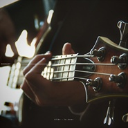

颜丙沂
============================

|  |  |
| :--: | :-- |
| [ 颜丙沂](https://i.xiami.com/yanbingyi) | **地区**: China 中国大陆 **风格**: 国语流行 Mandarin Pop, 欧美流行 Western Pop, 韩国流行 K-Pop, 独立民谣 Indie Folk, 儿童音乐 Children's Music **播放数**: 8899234 **粉丝数**: 703 **评论数**: 45  |

## 档案

颜丙沂（Alice），女，1998年7月18日出生。四岁开始学习声乐，国际少儿声乐学会会员；多次随银河艺术团参加国内外的大型演出，并为中央电视台少儿栏目录制主题曲、童谣及动画配音等；2010年发行个人演唱专辑《阳光女孩》。 现就读于中国传媒大学16级声乐表演系。 
主要音乐历程： 
· 随 中国青少年艺术团、银河艺术团赴多个国家进行交流演出； 
· 赴维也纳金色大厅参加“相约维也纳中国艺术节”庆典活动； 
· 赴香港参加香港童军团“童军百周年”盛大音乐会”演出； 
· 获共青团中央举办的第四届“星星火炬”中国青少年艺术英才推选活动声乐类金奖； 
· 获“七彩阳光”全国音乐舞蹈展评声乐比赛金奖； 
· 获“首届亚洲少儿歌曲大赛”儿童组金奖； 
· 获新加坡“首届国际少儿声乐大赛”获银奖； 
· 第一季《中国新声代》陈明班成员； 
· 演唱央视动画片《淮南子》主题曲；电影《云朵上的羊角花》片头、片尾曲。 
· 央视《音乐快递》节目优秀歌手，央视歌曲大赛小评委，歌曲范唱者； 
· 为手机软件“唱吧”录制多首导入范唱歌曲。 
……

## 专辑

| 名称 | 语种 | 唱片公司 | 发行时间 | 专辑类别 | 专辑风格 |
| :--: | :-- | :-- | :-- | :-- | :-- |
| [ 有你的青春](./albums/2106090113.md) | 国语 | Gstar音乐工作室 | 2020年04月15日 | 原声带, 影视音乐 |  |
| [ 小女上房揭瓦 影视剧原声带](./albums/2105690500.md) | 国语 | 卓颜巍声 | 2020年01月14日 | 原声带, 影视音乐 |  |
| [ Check This Out Ep](./albums/2103739909.md) | 英语 | 看见音乐 (上海) | 2018年06月08日 | EP, 单曲 | 电子 Electronic |
| [ In Arms](./albums/2103737079.md) | 英语 | 看见音乐 (上海) | 2018年05月31日 | EP, 单曲 | 电子 Electronic |
| [ GIRLS X BOYS](./albums/2103722686.md) | 英语 | Virgin EMI | 2018年05月28日 | EP, 单曲 | 欧美流行 Western Pop |
| [ 唱吧范唱导入歌曲专辑颜丙沂为唱吧录制的范唱导入歌曲](./albums/2102666250.md) | 国语 | 独立发行 | 2016年12月20日 | 录音室专辑 | 国语流行 Mandarin Pop |
| [ 颜丙沂韩语歌曲演唱专辑](./albums/2102665989.md) | 韩语 | 独立发行 | 2016年12月01日 | 录音室专辑 | 韩国 | 演歌 Korea Trot, 浩室舞曲 House, 韩国流行 K-Pop |
| [ 颜丙沂英文歌曲演唱专辑](./albums/2102665049.md) | 英语 | 独立发行 | 2016年12月01日 | 录音室专辑 | 欧美流行 Western Pop, 流行 Pop |
| [ 颜丙沂/王禹文 合唱歌曲专辑](./albums/2102666151.md) | 国语 | 独立发行 | 2015年12月31日 | 录音室专辑 |  |
| [ 颜丙沂独唱专辑-流行歌曲颜丙沂流行歌曲演唱专辑](./albums/2102665027.md) | 国语 | 独立发行 | 2015年08月26日 | 录音室专辑 |  |
| [ 小小少年 - 童年留声机颜丙沂少年时期歌曲演唱专辑](./albums/2102664899.md) | 国语 | 独立发行 | 2013年12月01日 | 录音室专辑 | 儿歌 Nursery Rhyme, 儿童音乐 Children's Music |
| [ 书香有约南国书香节主题歌](./albums/2102665029.md) | 国语 | 独立发行 | 2012年08月27日 | EP, 单曲 | 酸性浩室舞曲 Acid House, 时代曲 Shidaiqu |
| [ 康定情缘颜丙沂 藏族歌曲演唱专辑](./albums/2102665011.md) | 国语 | 独立发行 | 2012年01月16日 | 精选集 | 西藏传统乐 Tibetan Traditional Music, 中国传统民歌 Chinese Traditional Folk, 民谣流行 Folk Pop |
| [ 阳光女孩：颜丙沂2010个人演唱专辑](./albums/2102664984.md) | 国语 | 中国录音录像出版总社 | 2010年03月09日 | 录音室专辑 | 儿歌 Nursery Rhyme, 儿童音乐 Children's Music |
| [ 动漫电视剧《淮南子传奇》主题歌淮南子说](./albums/2102665037.md) | 国语 | 央视动画有限公司 | 2010年03月01日 | 原声带, 影视音乐 |  |
| [ 北京胡同走来的金娃儿颜丙沂7-9岁童声歌曲演唱专辑](./albums/2102664955.md) | 国语 | 独立发行 | 2009年06月01日 | 录音室专辑 |  |

## 评论

|  |  |  |
| :-- | :-- | :-- |
|  [虾米用户](https://emumo.xiami.com/u/229833949)  2021-01-30 07:19 赞(0) 踩(0) | 
好孩子，你很优秀，继续努力
 |
|  [虾米用户](https://emumo.xiami.com/u/352220781)  2020-11-18 10:19 赞(1) 踩(0) | 
  
 |
|  [虾米用户](https://emumo.xiami.com/u/28039561)  2020-04-09 20:01 赞(1) 踩(0) | 
加油
 |
|  [虾米用户](https://emumo.xiami.com/u/311954558) 交个朋友呗❤ 2020-04-04 22:17 赞(1) 踩(0) | 
可否出自己的歌，期待期待 
 |
|  [虾米用户](https://emumo.xiami.com/u/351696817) 随风行走 生命中心仪的景... 2020-03-08 19:12 赞(1) 踩(0) | 
我有你140斤的照片 用你来激励我自己减肥 
 |
| ⇒ |  [虾米用户](https://emumo.xiami.com/u/311954558) 交个朋友呗❤ 2020-04-04 22:14 赞(0) 踩(0) | 
你怎么能这样子 
 |
| ⇒ |  [虾米用户](https://emumo.xiami.com/u/351696817) 随风行走 生命中心仪的景... 2020-04-05 17:00 赞(0) 踩(0) | 
<q><b>dubidubidu说：</b></q>
 |
|  [虾米用户](https://emumo.xiami.com/u/434620487)  2020-02-16 20:05 赞(1) 踩(0) | 
声音很棒，干净清透，委婉动人。比张碧晨唱的好。
 |
|  [虾米用户](https://emumo.xiami.com/u/49560656)  2020-02-14 17:31 赞(1) 踩(0) | 
很好听
 |
|  [虾米用户](https://emumo.xiami.com/u/358104299) 悲观的唯心存在现实解构虚... 2019-12-15 15:22 赞(1) 踩(0) | 
14322
 |
|  [虾米用户](https://emumo.xiami.com/u/321555315) 你好！有情必者多思…… 2018-11-14 22:36 赞(1) 踩(0) | 
很好听！ 上来我们彩云之南制作开唱，我们这里是明星区，四季气候平衡地…… 云南本中华地位未来大地国际商贸力量…… 获取更多正文首页，请打开微博点击输入@My1杨志满
 |
|  [虾米用户](https://emumo.xiami.com/u/404393843)  2018-10-31 22:57 赞(1) 踩(0) | 
小美妞，请问唐砖里面的插曲是不是你唱的。第十三集最后那首女单唱的。求歌名，求无损。
 |
|  [虾米用户](https://emumo.xiami.com/u/103542012)   2018-08-31 15:28 赞(2) 踩(0) | 
天赋满满
 |
|  [虾米用户](https://emumo.xiami.com/u/342085329)  2018-08-29 16:19 赞(3) 踩(0) | 
好听
 |
|  [虾米用户](https://emumo.xiami.com/u/335951183) 다시 한번만 널 안아볼... 2018-08-15 14:38 赞(3) 踩(0) | 
我们是一家人  按辈份我应该叫你妹妹
 |
|  [虾米用户](https://emumo.xiami.com/u/63787230)  2018-04-15 19:46 赞(3) 踩(0) | 
听着声音得劲   
 |
|  [虾米用户](https://emumo.xiami.com/u/324489847)  2018-03-12 15:45 赞(2) 踩(0) | 
关注了
 |
|  [虾米用户](https://emumo.xiami.com/u/322986258)  2018-03-01 21:34 赞(2) 踩(0) | 
   
 |
|  [虾米用户](https://emumo.xiami.com/u/71620354) I'm a dancer... 2017-10-11 22:35 赞(3) 踩(0) | 
自然
 |
|  [虾米用户](https://emumo.xiami.com/u/278095586) 宽容是人生最好的Teac... 2017-09-26 21:55 赞(3) 踩(0) | 
很柔和，声音甜甜的。
 |
|  [虾米用户](https://emumo.xiami.com/u/320952934)  2017-09-17 23:23 赞(2) 踩(0) | 
好棒啊！
 |
|  [虾米用户](https://emumo.xiami.com/u/190167975) 就这样吧 2017-09-04 12:42 赞(3) 踩(0) | 
音色美，加油哦 
 |
|  [虾米用户](https://emumo.xiami.com/u/16459227)   2017-08-22 07:42 赞(2) 踩(0) | 
加油！小才女！ 
 |
|  [虾米用户](https://emumo.xiami.com/u/319137644) 但求无悔 2017-08-21 11:10 赞(2) 踩(0) | 
喜欢呢，加油
 |
|  [虾米用户](https://emumo.xiami.com/u/70570460) 春雨如酒，柳如烟 2017-08-17 16:37 赞(2) 踩(0) | 
哇，比我还小，真是惭愧啊哈哈
 |
|  [虾米用户](https://emumo.xiami.com/u/246482645)  2017-07-03 12:44 赞(3) 踩(0) | 
非常好听的声音，声线控制得很不错，加油!
 |
|  [虾米用户](https://emumo.xiami.com/u/273482036)  2017-06-28 21:45 赞(1) 踩(0) | 
声音很不错 
 |
|  [虾米用户](https://emumo.xiami.com/u/277470793)   2017-03-03 15:42 赞(1) 踩(0) | 
快点更新新歌儿吧
 |
|  [虾米用户](https://emumo.xiami.com/u/277470793)   2017-03-03 15:42 赞(1) 踩(0) | 
每天都等你更新
 |
|  [虾米用户](https://emumo.xiami.com/u/245739502)  2017-02-14 09:34 赞(1) 踩(0) | 
喜欢！！
 |
|  [虾米用户](https://emumo.xiami.com/u/99271220) 我还没想好要写什么... 2017-02-07 16:16 赞(3) 踩(0) | 
韩语那张专辑超棒！声音很好听 加油哦！
 |
|  [虾米用户](https://emumo.xiami.com/u/266484889)  2017-02-04 21:48 赞(16) 踩(0) | 
年纪这小，声音就这好听
 |
|  [虾米用户](https://emumo.xiami.com/u/263841742)  2017-01-26 11:37 赞(2) 踩(0) | 
姐姐你的声音真好听！ヾ(≧∪≦*)ノ〃
 |
|  [虾米用户](https://emumo.xiami.com/u/141608860)  2017-01-23 12:16 赞(1) 踩(0) | 
真好听的声音，尾音颤音真美
 |
|  [虾米用户](https://emumo.xiami.com/u/246156299) 动听的音乐似一杯暖暖的咖... 2017-01-14 08:27 赞(1) 踩(0) | 
额    
 |
|  [虾米用户](https://emumo.xiami.com/u/37765987)  2017-01-14 06:03 赞(1) 踩(0) | 
加油哦，有些歌翻唱的不错哦
 |
|  [虾米用户](https://emumo.xiami.com/u/255708991) Jenny 2016-12-20 15:16 赞(2) 踩(0) | 
好听的歌，姐姐加油！
 |
|  [虾米用户](https://emumo.xiami.com/u/145240306)  2016-12-20 15:11 赞(2) 踩(0) | 
颜丙沂加油！
 |
|  [虾米用户](https://emumo.xiami.com/u/254526164)  2016-12-16 12:46 赞(52) 踩(0) | 
我刚入驻了虾米音乐人，欢迎大家来我的个人主页，收听我的最新音乐
 |
| ⇒ |  [虾米用户](https://emumo.xiami.com/u/244923385) 就这样吧... 2017-02-23 22:05 赞(0) 踩(0) | 
唱的不错，加油！
 |
| ⇒ |  [虾米用户](https://emumo.xiami.com/u/299550250)  2019-01-25 09:59 赞(0) 踩(0) | 
期待你的声音，很好听，加油啦
 |
| ⇒ |  [虾米用户](https://emumo.xiami.com/u/405029505) 心有多大，你的舞台就有多... 2019-02-16 03:58 赞(0) 踩(0) | 
喜欢你
 |
| ⇒ |  [虾米用户](https://emumo.xiami.com/u/356550110)  2019-06-12 17:09 赞(0) 踩(0) | 
加油，喜欢你好久了٩(๑^o^๑)۶
 |
|  [虾米用户](https://emumo.xiami.com/u/45707705) 只要你敢想，没有什么是你... 2016-02-23 17:07 赞(5) 踩(0) | 
沙发
 |
| ⇒ |  [虾米用户](https://emumo.xiami.com/u/254526164)  2016-12-16 18:00 赞(0) 踩(0) | 
谢谢亲！
 |
