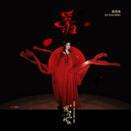

梦归电视剧《凤归四时歌》插曲
============================

|  |  |
| :--: | :-- |
| [ 梦归电视剧《凤归四时歌》插曲](https://emumo.xiami.com/album/5020931829) | **艺人**: [曲肖冰](../index.md) **语种**: 国语 **唱片公司**: 听见时代 **发行时间**: 2020年06月19日 **专辑类别**: EP, 单曲 **专辑风格**: 国语流行 Mandarin Pop, 古风 GuFeng Music, 电视原声 Television Music **播放数**: 9323 **收藏数**: 5 **评论数**: 1  |

## 简介

<strong>落入梦里 一曲四时歌</strong>

<strong>梦的深处 你在那里等我</strong>

<strong>归来仍有故事对你说</strong>

<strong>月光下许诺 是你和我</strong>

 

 

曲肖冰

《梦归》【电视剧《凤归四时歌》插曲】

 

《凤归四时歌》影视原声带由听见时代定制，插曲《梦归》今日正式上线。

 

插曲《梦归》由张赢作词，罗琨作曲，曲肖冰演唱。随着悦耳古风落入幽静梦中，梦里风云柔和辉映着灿烂天色，心跳也染红了你我的脸色。梦醒归来，那曲四时歌的余波仍在月光下荡漾，你我的故事便停泊在这动人时刻。曲肖冰用优美的歌声许诺着“预言”夫妇在梦醒时分仍甜蜜十分。

 

《凤归四时歌》影视原声带由听见时代操刀，打造「酸甜之恋」古风系OST，原声带后续曲目将陆续上线，敬请期待。

 

古装甜宠剧《凤归四时歌》正在腾讯视频独家热播中，该剧由企鹅影视出品，华海影业承制，赵洁担任总制片人，孙恺凯导演执导，许雅婷、陈靖可、张赫、赵尧珂、周翊然等主演，讲述了将门之女为了救出替自己出嫁的姐姐接近新继位王爷，两人斗智斗勇却阴差阳错暗生情愫的故事。

 

## 曲目

## 评论

|  |  |  |
| :-- | :-- | :-- |
|  [虾米用户](https://emumo.xiami.com/u/289191988) 华夏声韵 2020-06-22 18:36 赞(0) 踩(0) | 
好听     
 |
