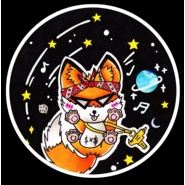

福无双至·章节二
============================

|  |  |
| :--: | :-- |
| [ 福无双至·章节二](https://emumo.xiami.com/album/2104042226) | **艺人**: [福克斯](../index.md) **语种**: 国语 **唱片公司**: 独立发行 **发行时间**: 2018年09月20日 **专辑类别**: 录音室专辑 **专辑风格**: 嘻哈 Hip-Hop **播放数**: 914516 **收藏数**: 46 **评论数**: 13  |

## 简介

  
 

章节二·源于生活：
 

 
 

福无双至，“我”不单行，第二章节，如期而至。承接第一章节的内容，章节二无论是曲风还是表达的观念，都与上一章节大不相同。依然收录歌曲三首，以刻画个人情感以及生活环境为主。
 

 
 

01.《爱》如果说“孝”是我国传承千年的优良品质，那么“爱”便是诞生于世界延续至今的伟大产物。“孝”是因为“爱”才诞生的，所以也是因为“爱”，才有了这个世界，有了千千万万不同的种族和群体。感受真正的“大爱”，去理解、包容和付出。让“爱”对于现在的我们不再是羞于言表和难以启齿的事物。
 

 
 

02.《你》当我们被浓烈的母爱包围感受其温暖时，别忽略一个重要的男人，那便是父亲。纵使他的严厉苛刻让你体会到短暂的心碎，也莫要怨他一生。如果说母亲决定了孩子的高度，那么父亲，便决定了孩子的深度…
 

 
 

03.《决定》人生的道路会出现数不清的选择，身边也会出现许多为你引路的善人。但最终，该做什么决定还是要回归你的本心，任何一项选择，都是一种能使人成长的挑战。
 

 
 

三首歌曲均围绕自己的亲身经历以及内心的情感变化感悟而创作，刻画细腻的人物心理，感受当今年轻一代看待问题的角度与对生活的反思。体现艺术源于生活，且高于生活的宗旨。
 

 
 

 
 

 
 

特别鸣谢：
 

Young BO$$制作团队
 

XXLOKI
 

叶懿瓒
 

ASK钟倩
 

阿曼
 

 

## 曲目

## 评论

|  |  |  |  |
| :-- | :-- | :-- | :-- |
|  [虾米用户](https://emumo.xiami.com/u/265909103)  2020-08-15 13:33 赞(0) 踩(0) | 
很棒哦！
 |
|  [虾米用户](https://emumo.xiami.com/u/419102018)  2020-04-04 23:02 赞(0) 踩(0) | 
唱歌特别好但是人品需要判断
 |
|  [虾米用户](https://emumo.xiami.com/u/284275151) 我还没想好要写什么... 2020-03-16 17:42 赞(0) 踩(0) | 
很好听特别是决定
 |
|  [虾米用户](https://emumo.xiami.com/u/441260165)  2020-03-10 19:41 赞(0) 踩(0) | 
一直默默关注
 |
|  [虾米用户](https://emumo.xiami.com/u/255912427)  2019-10-27 08:19 赞(0) 踩(0) | 
加油
 |
|  [虾米用户](https://emumo.xiami.com/u/38386335)  2019-09-13 08:54 赞(2) 踩(0) | 
福克斯的歌听之前我会有期待 有想象。听黄旭 杨和苏 大傻的 总是千篇一律 战斗 dis 抵抗 没了
 |
|  [虾米用户](https://emumo.xiami.com/u/427851720)  2019-08-11 19:53 赞(0) 踩(0) | 
福克斯真的帅，声音好听
 |
|  [虾米用户](https://emumo.xiami.com/u/295536041) 笑着对世界。。不代表我真... 2019-07-19 13:19 赞(0) 踩(0) | 
觉得这个声音与词好鸡儿帅
 |
|  [虾米用户](https://emumo.xiami.com/u/346492287) 虾米不要离开我！ 2019-07-14 01:31 赞(0) 踩(0) | 

 |
|  [虾米用户](https://emumo.xiami.com/u/15966073) just go away 2019-07-13 19:04 赞(0) 踩(0) | 
狐狸要火啦
 |
|  [虾米用户](https://emumo.xiami.com/u/408405365)  2019-07-04 10:03 赞(0) 踩(0) | 
不錯
 |
|  [虾米用户](https://emumo.xiami.com/u/378841944)  2019-06-06 15:54 赞(2) 踩(0) | 
这个夏天福克斯会牛逼的
 |
|  [虾米用户](https://emumo.xiami.com/u/335624001)  2019-06-03 16:04 赞(0) 踩(0) | 
一切察？小时候＂、在！一
 |
