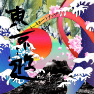

东京游Tokyo Trip
============================

|  |  |
| :--: | :-- |
| [ 东京游Tokyo Trip](https://emumo.xiami.com/album/5021451429) | **艺人**: [福克斯](../index.md) **语种**: 国语 **唱片公司**: 刺猬兄弟HBe **发行时间**: 2020年09月15日 **专辑类别**: EP, 单曲 **专辑风格**: 嘻哈 Hip-Hop **播放数**: 39687 **收藏数**: 16 **评论数**: 9  |

## 简介

当三味线的声音响起的时候，冲绳岛的海浪就淹没了我的耳朵，它带着一股寂静又充满生机的力量，带着我从冲绳来到了东京。五彩斑斓的霓虹灯光占据着我的眼球，这里有古老蓊郁的传统文化，也有最特立独行的时尚弄潮儿，东京像彩色的琉璃灯，从不同的角度投射出不一样的光芒，神秘又亲切。这首《东京游（Tokyo Trip）》缘起于福克斯在东京录制的综艺节目，让他和藤冈靛两个有趣的灵魂相遇相知。这首节奏俏皮不羁的单曲极具异域风情，玄秘又热烈，正如远道而来的客人福克斯对一切都充满着好奇，而热情的东道主藤冈靛悉心招待，两人从规矩的初遇问候到破冰相知，逐渐展现出各自身上最本真的一面并携手游东京。整首歌非常具有节奏感，中文和日文的混搭唱法诙谐特别，藤冈靛的声线沙哑低沉，深邃且厚重，福克斯的演绎朝气蓬勃，有一种桀骜不羁的自信味道。两个人的搭配默契十足却又各自彰显特色，营造了强烈的东京玩乐氛围。

## 曲目

## 评论

|  |  |  |  |
| :-- | :-- | :-- | :-- |
|  [虾米用户](https://emumo.xiami.com/u/3689967)  2020-09-24 15:38 赞(0) 踩(0) | 
~
 |
|  [虾米用户](https://emumo.xiami.com/u/411763420)  2020-09-19 20:49 赞(0) 踩(0) | 
很有东京的感觉
 |
|  [虾米用户](https://emumo.xiami.com/u/428031593) 【十灰】春对夏，喜对√哀... 2020-09-19 16:32 赞(0) 踩(0) | 
白日依山尽，黄河入海流。欲穷千里目，更上一层楼！故人西辞黄鹤楼，烟花三月下扬州。孤帆远影碧空尽，惟见长江天际流。独立寒秋。
 |
|  [虾米用户](https://emumo.xiami.com/u/440536179)  2020-09-18 07:23 赞(1) 踩(0) | 
非常很好好聽。我快樂
 |
|  [虾米用户](https://emumo.xiami.com/u/323791757) 不等你了， 2020-09-16 20:09 赞(0) 踩(0) | 
不懂音乐，但听着舒服
 |
|  [虾米用户](https://emumo.xiami.com/u/13003640)  2020-09-16 03:16 赞(0) 踩(0) | 
很好！滿有意思的
 |
|  [虾米用户](https://emumo.xiami.com/u/10242251) 打起精神来~ 2020-09-15 20:38 赞(0) 踩(0) | 
挺有意思的啊
 |
|  [虾米用户](https://emumo.xiami.com/u/41193756) 我还没想好要写什么... 2020-09-15 20:22 赞(0) 踩(0) | 
难听得吓到了
 |
|  [虾米用户](https://emumo.xiami.com/u/2945971) 「写歌的人假正经 听歌的... 2020-09-15 09:36 赞(0) 踩(0) | 
2020.9.15 09:35
 |
