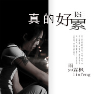

雨霖枫
============================

|  |  |
| :--: | :-- |
| [ 雨霖枫](https://i.xiami.com/ylf) | **播放数**: 4568644 **粉丝数**: 153 **评论数**: 9 **地区**: China 中国大陆 **风格**: 国语流行 Mandarin Pop  |

## 档案

生日：1988-06-01 
代表作品：《也许哭一场痛会少一点》 
国籍：中国 
出生地：安徽阜阳 
简介：歌手雨霖枫中国内地知名音乐制作人男歌手、词曲创作人，词曲编制作混然于一体的音乐人，2006年12月参加原创音乐节荣获2006最佳原创歌手奖，代表作品：《也许哭一场痛会少一点》、《逆天的爱》。雨霖枫从学校毕业以后曾在各地酒吧做酒吧歌手。也曾为许多歌手创作过很多伤感歌曲。雨霖枫放肆的情歌，爱恨的情感，体贴灵魂的声音，重新体味感动的力量，揭开爱情的迷雾，却走不出爱与痛的边缘……他沙哑迷人的声线和真情流露以及展现在专辑里的音乐才华和天赋，得到了发烧友的认可和钟爱。人们在他的歌里沉醉，伤感，寻求安慰，释放着情感。内心情感世界的告白、抒发心情放松的解药、抚慰心灵的疗伤音乐。笛子的悠长、排箫的绵密、古筝的闲情、巴乌的醇厚、葫芦丝的多情……民乐再次成为主角。 
从艺历程：雨霖枫 8岁开始练习吉他 15岁正式成为音乐制作人 2012年推出单曲《我不要你走》，2016年推出个人单曲《也许哭一场痛会少一点》在网络上颇受好评。同年推出全新单曲《既然相爱了就别分手》雨霖枫年少时只身走出家乡闯荡，漂泊异乡，终于在北京这个陌生的群龙聚首的城市里白手起家，打拼出了一片属于自己的天地。他带领着自己的团队开办了自己的第一家传媒公司（雨世霖枫国际文化传播有限公司），（雨霖枫音乐工作室发展中心）雨霖枫是一位非常了不起的音乐制作人兼企业家！虽然长年在异乡漂泊，但雨霖枫始终心系着自己的事业，还有那个让他终身无法忘却的儿时梦想——唱歌。当小雨的事业蒸蒸日上的时候，他冒出了当歌手的想法。他找到了国内某知名音乐人，为他度身打造了最新单曲——《这条路》。是呀，雨霖枫常年独居在外，身处异乡，那颗漂泊的心怎能不寂寞？享受寂寞，成了他一种特别的生活态度。雨霖枫的寂寞气质深深感染了每一位聆听他歌曲的人。“这条路，究竟走了有多远，这条路，是否走的好漫长”也许会有人说这首歌曲也隐隐道出了雨霖枫的爱情与游子之心。 
荣誉记录： 
2006年12月参加音乐先锋榜荣获2006原创歌手奖 
2006年9月参加广东《和你在一起》百名音乐人为广东灾区重建家园慰问义演 
2007年6月荣获“广东流行音乐”最具潜力奖 
2007年9月27日参加安徽卫视“网络流行音乐颁奖晚会”，获得“2007网络流行歌手”大奖 
2007年--2008年在全国各地演出！8月10日赴泗洪，郴州等地为受灾群众义演！ 
2008年5月，被深圳电台评为最佳词曲人 
2008年6月，应邀担四川省“爱心形象大使” 
2008年4月8日 浙江星光灿烂(单曲发布会) 
2008年4月30 安徽安庆(个人演唱会) 
2008年5月30号 北京东城华都 ---(歌迷见面会) 
2009年04月1日 公演北京科技大学站 
2008年5月，被深圳电台评为最佳词曲人 
2008年3月，被青海省授予“爱心大使 
2009年6月9日深圳公益演出 
2010年8月7日福州州台节目 
2010年10月8日广东惠州歌友会 
2009年2月--10月应南京电视台教科频道“万人相亲会”栏目组邀请做客嘉宾！ 
2010年3月20日徐州演唱会！嘉宾：阿杜，陈瑞等 
2013年荣获华语音乐流行榜“最佳编曲奖 
2013年3月22日 《我不要你走》单曲发布会 
2010年3月16日应邀南京江宁电视台慈善晚会！ 
2010年4月17日盐城体育馆演唱会：汤灿，胡彦斌 陈瑞，郁钧剑等 
2010年5月2日无锡大型歌友会！ 
2011年1月19日南京民 警 联欢应邀嘉宾 
2011年7月周华健，信，黄安，陈瑞，陈飞彤等唱响济宁体育馆 
2011年3月13日 北京公益群星歌友会 
2012年原创中国十年巡演“十大金曲奖” 
2012年广东流行乐坛“最佳贡献奖

## 专辑

| 名称 | 语种 | 唱片公司 | 发行时间 | 专辑类别 | 专辑风格 |
| :--: | :-- | :-- | :-- | :-- | :-- |
| [ 爱情的头七](./albums/5021312032.md) | 国语 | 安雨琪枫 | 2020年08月13日 | EP, 单曲 | 国语流行 Mandarin Pop |
| [ 好想好好爱一场](./albums/5021310361.md) | 国语 | 安雨琪枫 | 2020年08月13日 | EP, 单曲 | 国语流行 Mandarin Pop |
| [ 没有第二个我](./albums/5021307465.md) | 国语 | 安雨琪枫 | 2020年08月13日 | EP, 单曲 | 国语流行 Mandarin Pop |
| [ 当初的那个少年](./albums/2108358003.md) | 国语 | 安雨琪枫 | 2020年04月13日 | EP, 单曲 | 国语流行 Mandarin Pop |
| [ 年少轻狂的悲伤](./albums/2105589862.md) | 国语 | 安雨琪枫 | 2019年12月13日 | EP, 单曲 | 国语流行 Mandarin Pop |
| [ 新唱别说我的眼泪你无所谓](./albums/2108285440.md) | 国语 | 禾信科技 | 2019年07月05日 | EP, 单曲 | 国语流行 Mandarin Pop |
| [ 新唱别说我的眼泪你无所谓](./albums/5021011077.md) | 国语 | 禾信科技 | 2019年07月02日 | EP, 单曲 | 国语流行 Mandarin Pop |
| [ 在你心里我是谁](./albums/2104846280.md) | 国语 | 墨枫文化 | 2019年05月08日 | EP, 单曲 |  |
| [ 后来的我们没有在一起](./albums/2104781063.md) | 国语 | 安雨琪枫 | 2019年04月16日 | EP, 单曲 | 国语流行 Mandarin Pop |
| [ 后来的我们没有在一起](./albums/2104720379.md) | 国语 | 安雨琪枫 | 2019年03月27日 | EP, 单曲 | 国语流行 Mandarin Pop |
| [ 一往情深](./albums/2104720381.md) | 国语 | 安雨琪枫 | 2019年03月27日 | EP, 单曲 | 国语流行 Mandarin Pop |
| [ 爱上一个已婚的人](./albums/5021174670.md) | 国语 | 禾念信息 | 2019年01月17日 | EP, 单曲 | 国语流行 Mandarin Pop |
| [ 我们的相遇](./albums/2104456915.md) | 国语 | 安雨琪枫 | 2019年01月08日 | EP, 单曲 | 国语流行 Mandarin Pop |
| [ 我们的相遇](./albums/5021189215.md) | 国语 | 禾信科技 | 2018年12月31日 | EP, 单曲 | 国语流行 Mandarin Pop |
| [ 妈妈辛苦了](./albums/2104423415.md) | 国语 | 安雨琪枫 | 2018年12月28日 | EP, 单曲 | 国语流行 Mandarin Pop |
| [ 分手的理由](./albums/2104413316.md) | 国语 | 安雨琪枫 | 2018年12月25日 | EP, 单曲 | 国语流行 Mandarin Pop |
| [ 爱情都太假](./albums/2104413315.md) | 国语 | 安雨琪枫 | 2018年12月25日 | EP, 单曲 | 国语流行 Mandarin Pop |
| [ 小猪佩奇](./albums/5021178451.md) | 国语 | 禾信科技 | 2018年12月19日 | EP, 单曲 | 国语流行 Mandarin Pop |
| [ 也许哭一场痛会少一点](./albums/2104366384.md) | 国语 | 安雨琪枫 | 2018年12月12日 | EP, 单曲 | 国语流行 Mandarin Pop |
| [ 我不是故意想你](./albums/2104290373.md) | 国语 | 安雨琪枫 | 2018年11月27日 | EP, 单曲 | 国语流行 Mandarin Pop |
| [ 孤独的伤](./albums/5021239531.md) | 国语 | 禾信科技 | 2018年11月27日 | EP, 单曲 | 国语流行 Mandarin Pop |
| [ 不能没有你](./albums/2104260344.md) | 国语 | 安雨琪枫 | 2018年11月21日 | EP, 单曲 | 国语流行 Mandarin Pop |
| [ 孤独的伤](./albums/5021248823.md) | 国语 | 禾信科技 | 2018年11月20日 | EP, 单曲 | 国语流行 Mandarin Pop |
| [ 也许哭一场痛会少一点](./albums/2104224153.md) | 国语 | 安雨琪枫 | 2018年11月16日 | EP, 单曲 | 国语流行 Mandarin Pop |
| [ 是你让我学会了哭](./albums/5021256880.md) | 国语 | 禾信科技 | 2018年11月14日 | EP, 单曲 | 国语流行 Mandarin Pop |
| [ 泪如雨下](./albums/2104195558.md) | 国语 | 安雨琪枫 | 2018年11月09日 | EP, 单曲 | 国语流行 Mandarin Pop |
| [ 一个人伤心](./albums/2104195561.md) | 国语 | 安雨琪枫 | 2018年11月09日 | EP, 单曲 | 国语流行 Mandarin Pop |
| [ 别人的新娘](./albums/5021280501.md) | 国语 | 禾信科技 | 2018年11月06日 | EP, 单曲 | 国语流行 Mandarin Pop |
| [ 无药可救](./albums/2104150476.md) | 国语 | 安雨琪枫 | 2018年10月26日 | EP, 单曲 | 国语流行 Mandarin Pop |
| [ 既然爱了为何要放弃](./albums/5021277714.md) | 国语 | 禾信科技 | 2018年10月21日 | EP, 单曲 | 国语流行 Mandarin Pop |
| [ 你答应过我不会再和他联系](./albums/2104116770.md) | 国语 | 安雨琪枫 | 2018年10月18日 | EP, 单曲 | 国语流行 Mandarin Pop |
| [ 我们相爱吧](./albums/2104098789.md) | 国语 | 安雨琪枫 | 2018年10月12日 | EP, 单曲 | 国语流行 Mandarin Pop |
| [ 也许哭一场痛会少一点](./albums/5021284708.md) | 国语 | 禾信科技 | 2018年10月12日 | EP, 单曲 | 国语流行 Mandarin Pop |
| [ 我们相爱吧](./albums/5021295270.md) | 国语 | 禾信科技 | 2018年09月30日 | EP, 单曲 | 国语流行 Mandarin Pop |
| [ 好久没有回来了](./albums/2104052990.md) | 国语 | 安雨琪枫 | 2018年09月25日 | EP, 单曲 | 国语流行 Mandarin Pop |
| [ 好久没有回来了](./albums/5021294768.md) | 国语 | 禾信科技 | 2018年09月22日 | EP, 单曲 | 国语流行 Mandarin Pop |
| [ 好久没有回家了](./albums/2104040340.md) | 国语 | 安雨琪枫 | 2018年09月18日 | EP, 单曲 |  |
| [ 爱你是前世的约定](./albums/5021298090.md) | 国语 | 禾信科技 | 2018年09月12日 | EP, 单曲 | 国语流行 Mandarin Pop |
| [ 你的誓言](./albums/2103949577.md) | 国语 | 安雨琪枫 | 2018年08月28日 | EP, 单曲 |  |
| [ 我一个人流泪](./albums/2103923958.md) | 国语 | 安雨琪枫 | 2018年08月14日 | EP, 单曲 |  |
| [ 爱的狼狈](./albums/2103904802.md) | 国语 | 安雨琪枫 | 2018年08月04日 | EP, 单曲 |  |
| [ 两个小朋友](./albums/5021338957.md) | 国语 | 禾信科技 | 2018年07月12日 | EP, 单曲 | 国语流行 Mandarin Pop |
| [ 如果感情的路可以重新来过](./albums/2103795298.md) | 国语 | 安雨琪枫 | 2018年07月11日 | EP, 单曲 |  |
| [ 真的死了心](./albums/5021440938.md) | 国语 | 禾信科技 | 2018年06月22日 | EP, 单曲 | 国语流行 Mandarin Pop |
| [ 妈妈已老了](./albums/2103724772.md) | 国语 | 安雨琪枫 | 2018年05月31日 | EP, 单曲 |  |
| [ 真的好累](./albums/2103717084.md) | 国语 | 安雨琪枫文化 | 2018年05月23日 | EP, 单曲 |  |
| [ 你是个男人就别哭](./albums/2102976200.md) | 国语 | 禾信科技 | 2017年12月17日 | EP, 单曲 |  |
| [ 爱的太仓促](./albums/2102945076.md) | 国语 | 安雨琪枫 | 2017年11月18日 | EP, 单曲 |  |
| [ 倒退几万年](./albums/2102909531.md) | 国语 | 禾信科技 | 2017年11月07日 | EP, 单曲 |  |
| [ 如果感情的路可以重新来过](./albums/2102867173.md) | 国语 | 禾信科技 | 2017年10月02日 | EP, 单曲 |  |
| [ 也许哭一场痛会少一点](./albums/2102861411.md) | 国语 | 禾信科技 | 2017年09月22日 | EP, 单曲 |  |
| [ 再唱Beyond](./albums/2102976179.md) | 国语 | 安雨琪枫 | 2017年09月15日 | EP, 单曲 |  |
| [ 再唱Beyond](./albums/2102976181.md) | 国语 | 安雨琪枫 | 2017年09月15日 | EP, 单曲 |  |
| [ 狼狈的爱](./albums/2102976184.md) | 国语 | 安雨琪枫 | 2017年09月11日 | EP, 单曲 |  |
| [ 让它说去](./albums/2102976183.md) | 国语 | 安雨琪枫 | 2017年09月07日 | EP, 单曲 |  |
| [ 誓言已破裂](./albums/2102976185.md) | 国语 | 安雨琪枫文化 | 2017年08月29日 | EP, 单曲 |  |
| [ 雨你同蒙](./albums/2102976186.md) | 国语 | 禾信科技 | 2017年07月26日 | EP, 单曲 |  |
| [ 宁负天下不负你](./albums/2102761734.md) | 国语 | 禾信科技 | 2017年06月08日 | EP, 单曲 |  |
| [ 故园](./albums/2102760710.md) | 国语 | 一阳文化 | 2017年06月06日 | EP, 单曲 |  |
| [ 唱尽伤心](./albums/2102755946.md) | 国语 | 禾信科技 | 2017年05月29日 | EP, 单曲 |  |
| [ 世上最伤心的人](./albums/2102746856.md) | 国语 | 禾信科技 | 2017年05月12日 | EP, 单曲 |  |
| [ 你给我喝下了爱你的毒](./albums/2102976192.md) | 国语 | 一阳文化 | 2017年05月04日 | EP, 单曲 |  |
| [ 男人三十要成家](./albums/2102743287.md) | 国语 | 一阳文化 | 2017年05月04日 | EP, 单曲 |  |
| [ 告诉我你有没有爱过我](./albums/2102739600.md) | 国语 | 一阳文化 | 2017年04月27日 | EP, 单曲 |  |
| [ 如果感情的路可以重新来过](./albums/2102738330.md) | 国语 | 禾信科技 | 2017年04月26日 | EP, 单曲 |  |
| [ 既然分手了就不要再联系](./albums/2102735675.md) | 国语 | 一阳文化 | 2017年04月21日 | EP, 单曲 |  |
| [ 你答应过我不会再和他联系](./albums/2102738335.md) | 国语 | 禾信科技 | 2017年04月21日 | EP, 单曲 |  |
| [ 对你的爱我怎么才能解脱](./albums/2102734902.md) | 国语 | 一阳文化 | 2017年04月19日 | EP, 单曲 |  |
| [ 想用时间来把你忘记](./albums/2102734800.md) | 国语 | 一阳文化 | 2017年04月18日 | EP, 单曲 |  |
| [ 男人的眼泪](./albums/2102705111.md) | 国语 | 一阳文化 | 2017年03月06日 | EP, 单曲 |  |
| [ 我不想再为你喝醉](./albums/2102691099.md) | 国语 | 一阳文化 | 2017年02月09日 | EP, 单曲 |  |
| [ 真心换来伤心](./albums/2102676852.md) | 国语 | 一阳文化 | 2017年01月04日 | EP, 单曲 |  |
| [ 爸妈已经老了](./albums/2102676827.md) | 国语 | 一阳文化 | 2017年01月04日 | EP, 单曲 |  |
| [ 下定决心忘记你](./albums/2102664788.md) | 国语 | 一阳文化 | 2016年12月15日 | EP, 单曲 |  |
| [ 爸妈已经老了](./albums/2102662572.md) | 国语 | 一阳文化 | 2016年12月06日 | EP, 单曲 |  |
| [ 泪的海洋](./albums/2102659048.md) | 国语 | 一阳文化 | 2016年12月01日 | EP, 单曲 |  |
| [ 逆天的爱](./albums/2102657505.md) | 国语 | 一阳文化 | 2016年11月28日 | EP, 单曲 |  |
| [ 蓝瘦香菇](./albums/2102976198.md) | 国语 | 一阳文化 | 2016年10月28日 | EP, 单曲 |  |
| [ 我爱你是一个错](./albums/2102976191.md) | 国语 | 一阳文化 | 2016年10月20日 | EP, 单曲 |  |
| [ 你为何要把我的心给偷走](./albums/2100386566.md) | 国语 | 一阳文化 | 2016年09月05日 | EP, 单曲 |  |
| [ 静静不理我](./albums/2100377275.md) | 国语 | 一阳文化 | 2016年08月08日 | EP, 单曲 |  |
| [ 你的心里我是谁](./albums/2100365751.md) | 国语 | 一阳文化 | 2016年07月11日 | EP, 单曲 |  |
| [ 为什么爱情走着走着就会散](./albums/2100364416.md) | 国语 | 一阳文化 | 2016年07月08日 | EP, 单曲 |  |
| [ 你说亲爱的请把我忘记](./albums/2100362303.md) | 国语 | 一阳文化 | 2016年07月04日 | EP, 单曲 |  |
| [ 一亿个伤心](./albums/2100360292.md) | 国语 | 一阳文化 | 2016年06月29日 | EP, 单曲 |  |
| [ 没钱没车没老婆](./albums/2100357828.md) | 国语 | 一阳文化 | 2016年06月23日 | EP, 单曲 |  |
| [ 你为什么这样的对我](./albums/2100345120.md) | 国语 | 一阳文化 | 2016年05月26日 | EP, 单曲 |  |
| [ 你是伤我最深的那个人](./albums/2102976197.md) | 国语 | 一阳文化 | 2016年03月15日 | EP, 单曲 |  |
| [ 既然相爱了就别分手](./albums/2100292626.md) | 国语 | 一阳文化 | 2016年03月14日 | EP, 单曲 |  |
| [ 也许哭一场痛会少一点](./albums/2100284700.md) | 国语 | 一阳文化 | 2016年03月01日 | EP, 单曲 |  |
| [ 寂寞夜里一个人哭泣](./albums/2102976196.md) | 国语 | 一阳文化 | 2015年12月31日 | EP, 单曲 |  |
| [ 想要真心去爱](./albums/2100242870.md) | 国语 | 一阳文化 | 2015年11月30日 | EP, 单曲 |  |
| [ 这条绝路](./albums/2102976195.md) | 国语 | 一阳文化 | 2015年10月12日 | EP, 单曲 |  |

## 评论

|  |  |  |  |
| :-- | :-- | :-- | :-- |
|  [虾米用户](https://emumo.xiami.com/u/358104299) 悲观的唯心存在现实解构虚... 2020-12-28 02:52 赞(0) 踩(0) | 
44365
 |
|  [虾米用户](https://emumo.xiami.com/u/441436602)  2020-04-21 00:50 赞(0) 踩(0) | 
加油
 |
|  [虾米用户](https://emumo.xiami.com/u/293692544) 你敢给我说话吗？我咬你 2018-09-16 11:47 赞(1) 踩(0) | 
好
 |
|  [虾米用户](https://emumo.xiami.com/u/353670299) Love  Health... 2018-06-30 02:18 赞(3) 踩(0) | 
唱歌感情投入，好啊! 
 |
|  [虾米用户](https://emumo.xiami.com/u/356519121) 你与时间皆薄情…… 2018-06-07 13:58 赞(2) 踩(0) | 
翻唱下天后呗，也挺好 
 |
|  [虾米用户](https://emumo.xiami.com/u/315987862) 缘 2018-03-28 23:15 赞(1) 踩(0) | 
像个女孩 
 |
|  [虾米用户](https://emumo.xiami.com/u/271169707) 找个爱人的啊 2018-01-25 08:57 赞(1) 踩(0) | 
老乡你好棒哒         
 |
|  [虾米用户](https://emumo.xiami.com/u/260003943)  2017-10-14 16:27 赞(2) 踩(0) | 
好帅好美
 |
|  [虾米用户](https://emumo.xiami.com/u/260003943)  2017-10-14 16:26 赞(1) 踩(0) | 
喜欢雨霖枫的歌
 |
