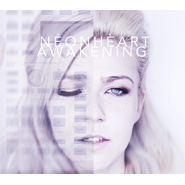

AWAKENING
============================

|  |  |
| :--: | :-- |
| [ AWAKENING](https://emumo.xiami.com/album/2100230202) | **艺人**: [NÉONHÈART荧光红心](../index.md) **语种**: 英语 **唱片公司**: 独立发行 **发行时间**: 2015年06月30日 **专辑类别**: EP, 单曲 **专辑风格**: 独立流行 Indie Pop, 另类摇滚 Alternative Rock, 电音流行 Electropop **播放数**: 1505849 **收藏数**: 46 **评论数**: 10  |

## 简介

加拿大天籁克里丝缇娜与中国籍制作人HAOO 在梦想之城洛杉矶相遇，碰撞出NÉONHÈART荧光心。首张EP AWAKENING（苏醒）登陆虾米！
 

 

以下是洛杉矶著名的潮流站 Grimy Goods 的乐评。
 

 

Sometimes people find each other, a spark is lit, and they make beautiful music together. In the case of Los Angeles synth-pop duo NÉONHÈART, thanks to a meeting via a mutual friend, what originally started as a producer-for-hire arrangement quickly turned into a full-fledged band. The duo comprised of songwriter/composer HAOO and singer-songwriter Christina O’Connor have just self-released their rich, debut EP Awakening which features four irresistible and bittersweet tracks, ripe for listening. You can download the EP from iTunes.  
“Comatose” evokes a heightened sense of sadness with its breathy, pleading vocals (“Won’t you stay one more night“) and textured synths. The tone of the song is haunting, yet beautiful with a slow-rising build of energy and by the time we reach the song’s final moments, it exhales with a deep sense of relief and freedom. It is a satisfying resolution, no doubt, to an otherwise melancholic track – a great reminder that joy can be found and explored in sadness.  
“Nothing Left” is an intimate number, lush with resonant piano and driven by sparse, clean drumbeats – a sound that feels polished, but never falling prey to over-produced cheese.  
“Road” is a rollicking electro-pop jam that will have you choreographing dance moves in your bedroom and it may very well find its way onto your playlist, nestled between Kylie Minogue and Ellie Goulding.  
“You” is a musically playful, fist-pumping dance anthem that gets you moving but steers clear of feeling like the button pushing fanfare we are often inundated with in electronic music.  
NÉONHÈART kindly took the time to chat with us about finding themselves as a band, their favorite tearjerker jams, and what it was like piecing together the Awakening EP. Read on!  
  
By Emily Saex from Grimy Goods  
(Original article li<x>nk:&nbsp;<a href="http://tinyurl.com/pj7v22r" target="_blank" rel="nofollow noreferrer noopener">http://tinyurl.com/pj7v22r</a>)</x>  

## 曲目

## 评论

|  |  |  |  |
| :-- | :-- | :-- | :-- |
|  [虾米用户](https://emumo.xiami.com/u/1866707) 音乐果然什么都能治愈~ 2020-02-26 10:32 赞(0) 踩(0) | 
整张都好听
 |
|  [虾米用户](https://emumo.xiami.com/u/125615076) 青絲慢掠獨披塵 2020-01-06 16:39 赞(0) 踩(0) | 

 |
|  [虾米用户](https://emumo.xiami.com/u/41769699) 我还没想好要写什么... 2019-08-02 06:32 赞(0) 踩(0) | 
早上起来开车第一首歌
 |
|  [虾米用户](https://emumo.xiami.com/u/73307718) 你是我不曾听闻的传奇 2019-07-04 21:47 赞(0) 踩(0) | 
(●'◡'●)ﾉ❤女声超好听~
 |
|  [虾米用户](https://emumo.xiami.com/u/46378692) If you come.... 2019-06-02 00:03 赞(0) 踩(0) | 
这专辑我爱爆
 |
|  [虾米用户](https://emumo.xiami.com/u/418455318)  2019-02-23 18:22 赞(0) 踩(0) | 
nice
 |
|  [虾米用户](https://emumo.xiami.com/u/9701762) :D 2017-08-07 16:00 赞(0) 踩(0) | 
666
 |
|  [虾米用户](https://emumo.xiami.com/u/7380655) 从暗潮里爬出来… 2017-07-20 20:45 赞(0) 踩(0) | 

 |
|  [虾米用户](https://emumo.xiami.com/u/181119266)  2016-05-28 02:12 赞(0) 踩(0) | 
天赖之音
 |
|  [虾米用户](https://emumo.xiami.com/u/29116621)  2015-10-31 04:03 赞(4) 踩(0) | 
加拿大天籁克里丝缇娜与中国籍制作人HAOO 在梦想之城洛杉矶相遇，碰撞出NÉONHÈART荧光心。首张EP AWAKENING（苏醒）登陆虾米！
 |
