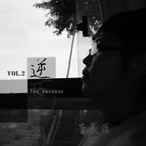

逆
============================

|  |  |
| :--: | :-- |
| [ 逆](https://emumo.xiami.com/album/2100194584) | **艺人**: [李晨阳](../index.md) **语种**: 国语 **唱片公司**: 独立发行 **发行时间**: 2015年09月15日 **专辑类别**: 录音室专辑 **专辑风格**: 民谣流行 Folk Pop, 城市民谣 Urban Folk, 独立民谣 Indie Folk **播放数**: 118110 **收藏数**: 15 **评论数**: 1  |

## 简介

如有一城能让你择其终老，我愿自此远行飘摇。

## 曲目

## 评论

|  |  |  |
| :-- | :-- | :-- |
|  [虾米用户](https://emumo.xiami.com/u/7996861)  2015-10-06 15:01 赞(0) 踩(0) | 
出色，收。
 |
