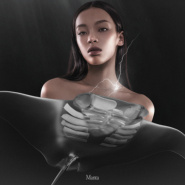

Manta
============================

|  |  |
| :--: | :-- |
| [ Manta](https://emumo.xiami.com/album/2105584739) | **艺人**: [刘柏辛Lexie](../index.md) **语种**: 国语 **唱片公司**: StreetVoice, 泥鞋文化 **发行时间**: 2019年12月17日 **专辑类别**: EP, 单曲 **专辑风格**: 国语流行 Mandarin Pop, 华语唱作人 Chinese Singer-Songwriter **播放数**: 306659 **收藏数**: 121 **评论数**: 42  |

## 简介

“我爱他们游动时优雅的姿势，不紧不慢上下扇动着的翅膀，两只略显呆滞的眼睛下诡谲的讥笑。  
  
他们有一个听起来很可怕的名字，但一颗牙齿都没有。  
  
当我第一次隔着厚厚的玻璃在海洋馆看到Manta游泳的样子，被造物主的创意和巧思冲昏了头脑: 原来水下也有飞行家。远看光滑如镜的皮肤和错落的白色斑纹，是他们前卫廓形的燕尾服，沉默飞翔的魔鬼鱼们像是星辰和大海之间的使者，在无尽的蓝色中穿梭。  
  
他们在水里飞起来的样子，像极了天空上展翅高飞的鸟，美得不像鱼，据说在中生代侏罗纪时就在海洋里了。都说鱼儿在水里游，鸟儿在天上飞，但是魔鬼鱼的存在，打破了那些常理和规则对我来说，这些美丽生命的特殊性给我展示了一种世上无限的可能，和在规则之上的自由洒脱。  
  
在海洋馆时看到的魔鬼鱼总能让我感受到困兽的忧郁，后来为了想要亲眼看到属于大自然的野生魔鬼鱼，去斐济学了水肺潜水，终于考完证在最后一天和跟随当地渔民坐船6个小时去蹲点魔鬼鱼吃饭，但当我赶到时却错过了他们，要是有朝一日能够和他们在水里一起舞蹈就太美妙啦。  
  
蝠鲼俗称魔鬼鱼，听起来像是海底怪兽，但张开深渊一般的大嘴之后其实光秃秃的没有牙齿，捕食习惯是对着洋流游泳，一边张开嘴坐等小鱼小虾被冲进嘴里。听说他们性情温顺但偶尔古怪，喜欢搞点恶作剧捉弄人，得知这饭来张口的佛系吃饭习惯之后更觉得他们可爱了，加上傻乎乎的黑眼睛和嘲讽的假笑，怎么会有这么完整生动的鱼设？矛盾，藐视规则，热爱自由，复杂得像你，像我，像每一个人。  
  
他们吸引我的这几个特质都看起来有些矛盾，而这种冲突感是我这首歌灵感的来源，代表着世上真的存在难以被定义的存在，和身为一个异类却依然自由的状态。我在这首歌里把自己装进了魔鬼鱼的身体，赋予自己在这一首歌的时间里无限的可能，试图让这股能量能穿透耳膜冲进每个听者的血液，成为“打破规则”行为的BGM.  
  
不用定义，他们是特别的存在，你也是。”  
  
----刘柏辛  
  
Lexie: “Manta is one of the key symbols of this whole album that’s coming right up. The song ‘Manta’ is about possibility and freedom.   
  
Manta Ray is my favorite animal. I love the way they move underwater: flapping their wide fins up and down (as if they had real wings) in a nonchalant manner silently, different from everything else down there in the ocean.   
  
I saw Manta Rays for the first time in an aquarium behind those thick glass walls. I was in awe of these exquisite and delicate creatures—the sleek, glossy skin shimmers underwater, looking like an avant-garde black tuxedo with white prints. “Flying” underwater, defying the rules of gravity, challenging the stereotypical “birds flying in the sky, fish swimming underwater” type of notion, with a little black tux on, a Manta Ray is like an elegant emissary, or a rhetoric traveller between the stars and the ocean.   
  
Their 100 million years of the peculiar existence on earth really hit me with the infinity of possibilities of life on this planet.   
  
I actually learned scuba diving in Fiji just to see the wild ones in flesh, but sadly I still missed them after spending 6 hours on the yacht looking for their eating spot. Maybe that’s why the wild ones are wild! I still wish someday I get to dance with them underwater.  
  
Sometimes I see myself in them. I can sense the depression of the ones trapped in an aquarium. Their complexity, nonchalance, unruly spirit, and just the peculiarity of these coexisting yet conflicting elements, even the half-ridicule, half-playful “smile”.  
  
In this song, I imagined myself being inside a Manta Ray’s body for three and a half minutes and went crazy by challenging infinite possibilities in my music. Hopefully I can transfer this power to whomever listening, pump up the blood in their systems with the energy of my sound, and waken the sleeping beast inside their hearts and souls haha.  
  
I also wanna send out this message through not only this song but the entire album that there is no single definition of your existence, and you should be whatever you want to be. ”

## 曲目

## 评论

|  |  |  |
| :-- | :-- | :-- |
|  [虾米用户](https://emumo.xiami.com/u/338436169) PSYCHO 2020-12-14 22:53 赞(0) 踩(0) | 

 |
|  [虾米用户](https://emumo.xiami.com/u/308437955)   2020-07-12 14:22 赞(0) 踩(0) | 
咋没版权呢
 |
|  [虾米用户](https://emumo.xiami.com/u/441415394)  2020-03-28 21:21 赞(0) 踩(0) | 
好听到爆！爱了
 |
|  [虾米用户](https://emumo.xiami.com/u/301081887)  2020-03-26 22:02 赞(0) 踩(0) | 
好听哦(´-ω-`)
 |
|  [虾米用户](https://emumo.xiami.com/u/276339850)  2020-03-12 13:17 赞(0) 踩(0) | 
好听！！！
 |
|  [虾米用户](https://emumo.xiami.com/u/334518262) 我还没想好要写什么... 2020-03-01 01:03 赞(0) 踩(0) | 
非常惊艳，很有腔调
 |
|  [虾米用户](https://emumo.xiami.com/u/2135411)   2020-02-21 17:58 赞(0) 踩(0) | 
喜欢，粉了
 |
|  [虾米用户](https://emumo.xiami.com/u/314313169)  2020-02-20 22:30 赞(0) 踩(0) | 
高级感扑面而来，大赞
 |
|  [虾米用户](https://emumo.xiami.com/u/287853432)  2020-02-20 03:27 赞(0) 踩(0) | 
非常好，期待
 |
|  [虾米用户](https://emumo.xiami.com/u/317762104)  2020-02-19 21:09 赞(0) 踩(0) | 
非常喜欢
 |
|  [虾米用户](https://emumo.xiami.com/u/35387820)  2020-02-19 12:43 赞(0) 踩(0) | 
Breakthrough
 |
|  [虾米用户](https://emumo.xiami.com/u/15499483)  2020-02-17 19:48 赞(0) 踩(0) | 
太喜欢了
 |
|  [虾米用户](https://emumo.xiami.com/u/14224138)  2020-02-16 22:02 赞(0) 踩(0) | 
加油呀！超级喜欢！
 |
|  [虾米用户](https://emumo.xiami.com/u/251135831)   2020-02-16 20:02 赞(0) 踩(0) | 
有自信，有才华，双商都高的创作型歌手，不得不爱啊
 |
|  [虾米用户](https://emumo.xiami.com/u/353704145)  2020-02-16 18:04 赞(2) 踩(0) | 
看了《歌手》找来的，很好听，舞台表现力很棒！
 |
|  [虾米用户](https://emumo.xiami.com/u/359868114)  2020-02-16 00:30 赞(0) 踩(0) | 
完美
 |
|  [虾米用户](https://emumo.xiami.com/u/315584890)  2020-02-15 21:32 赞(0) 踩(0) | 
超级好听，诚意满满
 |
|  [虾米用户](https://emumo.xiami.com/u/334798130)   2020-02-15 20:03 赞(0) 踩(0) | 
超级棒！！
 |
|  [虾米用户](https://emumo.xiami.com/u/420102498) 喜相逢 尽余欢 酹江月 2020-02-15 17:46 赞(0) 踩(0) | 
棒
 |
|  [虾米用户](https://emumo.xiami.com/u/440495771)  2020-02-15 16:33 赞(1) 踩(0) | 
请出专辑
 |
|  [虾米用户](https://emumo.xiami.com/u/41485153) 我还没想好要写什么... 2020-02-15 15:13 赞(0) 踩(0) | 
请出专辑，谢谢
 |
|  [虾米用户](https://emumo.xiami.com/u/334964731)   2020-02-15 10:34 赞(1) 踩(0) | 
很久没听到这么有态度的音乐 很棒，加油！上次喜欢这样的音乐是花花。看比赛以为你成功了！
 |
|  [虾米用户](https://emumo.xiami.com/u/334964731)   2020-02-15 10:34 赞(0) 踩(0) | 
很久没听到这么有态度的音乐 很棒，加油！上次喜欢这样的音乐是花花。看比赛以为你成功了！
 |
|  [虾米用户](https://emumo.xiami.com/u/8217179) 喜欢自己一手砌起来的幸福... 2020-02-15 10:30 赞(0) 踩(0) | 
太酷啦！！喜欢这妹妹！
 |
|  [虾米用户](https://emumo.xiami.com/u/247186799)  2020-02-15 10:12 赞(0) 踩(0) | 
爽，跑步听着很舒服
 |
|  [虾米用户](https://emumo.xiami.com/u/18282017)  2020-02-15 09:32 赞(0) 踩(0) | 
好听
 |
|  [虾米用户](https://emumo.xiami.com/u/431224648)  2020-02-15 09:18 赞(0) 踩(0) | 
Oh my god
 |
|  [虾米用户](https://emumo.xiami.com/u/259144117)  2020-02-15 05:27 赞(0) 踩(0) | 
很好听
 |
|  [虾米用户](https://emumo.xiami.com/u/2749966) 我还没想好要写什么... 2020-02-15 00:58 赞(2) 踩(0) | 
三个奇袭歌手里最喜欢的一个，的确也很有才，非常惊艳！
 |
|  [虾米用户](https://emumo.xiami.com/u/264545472)  2020-02-14 23:53 赞(0) 踩(0) | 
好喜欢呀
 |
|  [虾米用户](https://emumo.xiami.com/u/343809879) 九锥 2020-02-14 23:35 赞(0) 踩(0) | 
太棒了我爱了！！
 |
|  [虾米用户](https://emumo.xiami.com/u/308198) (。・∀・)ノ゛... 2020-02-14 23:02 赞(0) 踩(0) | 
好棒呀！！！！
 |
|  [虾米用户](https://emumo.xiami.com/u/432127269)  2020-02-14 22:12 赞(0) 踩(0) | 
好听，特别的旋律
 |
|  [虾米用户](https://emumo.xiami.com/u/430565779) 我还没想好要写什么... 2020-02-07 18:15 赞(0) 踩(0) | 
cooool
 |
|  [虾米用户](https://emumo.xiami.com/u/99568924) 我还没想好要写什么... 2020-01-04 08:51 赞(0) 踩(0) | 
蝠鲼
 |
|  [虾米用户](https://emumo.xiami.com/u/17157405) 当然我也没有签名 2020-01-03 03:40 赞(0) 踩(0) | 
为什么只有一首。
 |
|  [虾米用户](https://emumo.xiami.com/u/38592641) 嗯，迷幻本幻。 2020-01-01 19:56 赞(0) 踩(0) | 
一般的存在
 |
|  [虾米用户](https://emumo.xiami.com/u/26455408) 骑着哈雷放着AC/DC 2019-12-31 11:07 赞(0) 踩(0) | 
manta-蝠鲼，魔鬼鱼之一。刺鳐是我最喜欢的鱼
 |
|  [虾米用户](https://emumo.xiami.com/u/31531934) 恋の道に近道はない 2019-12-31 09:19 赞(0) 踩(0) | 

 |
|  [虾米用户](https://emumo.xiami.com/u/324498092) ‘错过’即：看不见看不... 2019-12-31 08:27 赞(1) 踩(0) | 
刘柏辛，我们爱你！
 |
|  [虾米用户](https://emumo.xiami.com/u/8866401) 踏遍青山人未老 2019-12-31 01:07 赞(0) 踩(0) | 
李佳琦表妹真厉害！！！！
 |
|  [虾米用户](https://emumo.xiami.com/u/3553665) We can be He... 2019-12-31 00:00 赞(0) 踩(0) | 
❤️
 |
