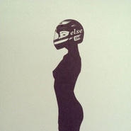
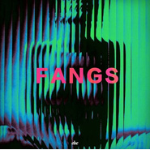

Else
============================

|  |  |
| :--: | :-- |
| [ Else](https://i.xiami.com/else) | **播放数**: 3949452 **粉丝数**: 2824 **评论数**: 160 **地区**: France 法国 **风格**: 电子 Electronic  |

## 档案

We are Else, a French electro duo from the artist collective L'Ordre

## 专辑

| 名称 | 语种 | 唱片公司 | 发行时间 | 专辑类别 | 专辑风格 |
| :--: | :-- | :-- | :-- | :-- | :-- |
| [ Views](./albums/5020861842.md) | 纯音乐 | L’ordre Music | 2020年06月10日 | 录音室专辑 | 电子乐 Electronica |
| [ Sequence, Pt. I](./albums/5020426024.md) | 其他 | Merlin Records | 2019年09月18日 | EP, 单曲 |  |
| [ Back to 8](./albums/5020425028.md) | 其他 | Merlin Records | 2019年09月04日 | EP, 单曲 |  |
| [ Night Thoughts](./albums/2420349278.md) | 英语 | Merlin Records | 2019年06月26日 | EP, 单曲 |  |
| [ Sonora](./albums/2103952332.md) | 英语 | L'ordre Music & Bsharp | 2018年06月27日 | EP, 单曲 |  |
| [ You](./albums/2102864628.md) | 英语 | L'ordre Music & Bsharp | 2017年06月16日 | EP, 单曲 |  |
| [ Ambre](./albums/2102805580.md) | 英语 | L'ordre Music & Bsharp | 2017年05月19日 | EP, 单曲 |  |
| [ After All (Else Remix)](./albums/2100373180.md) | 英语 | Self-Released | 2016年07月17日 | EP, 单曲 |  |
| [ About You](./albums/5020409656.md) | 其他 | Merlin Records | 2016年06月10日 | EP, 单曲 |  |
| [ Paris](./albums/2100316124.md) | 英语 | L'ordre | 2016年04月18日 | EP, 单曲 | 电子乐 Electronica |
| [ Mirage](./albums/2100273014.md) | 英语 | L'ordre Music | 2016年01月25日 | EP, 单曲 |  |
| [ ACE](./albums/2100266052.md) | 英语 | L'ordre Music | 2015年12月07日 | EP, 单曲 |  |
| [ Kanye (Else Remix)](./albums/2100223542.md) | 英语 | L'ordre | 2015年10月14日 | EP, 单曲 |  |
| [ SummerTape](./albums/2100192166.md) | 英语 | L'ordre | 2015年08月16日 | EP, 单曲 |  |
| [ If](./albums/2100187806.md) | 英语 | Self-Released | 2015年04月27日 | EP, 单曲 |  |
| [ SpringTape](./albums/2100192168.md) | 英语 | L'ordre | 2015年04月02日 | EP, 单曲 |  |
| [ Fangs](./albums/2100192170.md) | 英语 | L'ordre | 2015年01月05日 | EP, 单曲 |  |
| [ Pacific](./albums/2105843155.md) | 英语 | Maquisards | 2013年06月24日 | EP, 单曲 |  |
| [ Sunburst](./albums/2100192172.md) | 英语 | L'ordre | 2013年02月01日 | EP, 单曲 |  |
| [ Ariane](./albums/2100187768.md) | 英语 | Self-Released | 2013年01月01日 | EP, 单曲 |  |
| [ Northway](./albums/2105934623.md) | 英语 | Maquisards | 2012年01月01日 | EP, 单曲 |  |

## 评论

|  |  |  |  |
| :-- | :-- | :-- | :-- |
|  [虾米用户](https://emumo.xiami.com/u/356264705)  2021-01-03 16:25 赞(0) 踩(0) | 
听音乐就好了，真的不错啊！
 |
|  [虾米用户](https://emumo.xiami.com/u/443074904)  2020-11-11 11:14 赞(0) 踩(0) | 
太棒了
 |
|  [虾米用户](https://emumo.xiami.com/u/99568924) 我还没想好要写什么... 2020-10-31 22:15 赞(0) 踩(0) | 
﹏
 |
|  [虾米用户](https://emumo.xiami.com/u/438576942) 不了谢谢 2020-06-15 17:31 赞(0) 踩(0) | 
！
 |
|  [虾米用户](https://emumo.xiami.com/u/4930744)  2020-06-11 14:40 赞(0) 踩(0) | 
想听20202 summer tapes了
 |
| ⇒ |  [虾米用户](https://emumo.xiami.com/u/4930744)  2020-06-11 14:42 赞(0) 踩(0) | 
多了一个2
 |
|  [虾米用户](https://emumo.xiami.com/u/3583995) 一個人的戰爭 2020-03-12 00:29 赞(1) 踩(0) | 
.
 |
|  [虾米用户](https://emumo.xiami.com/u/143401552) 我没有能力我有野心 2020-02-06 22:10 赞(0) 踩(0) | 
未找到
 |
|  [虾米用户](https://emumo.xiami.com/u/7133174) 我还没想好要写什么... 2019-11-16 23:49 赞(1) 踩(0) | 
太短了，完全听不够 
 |
| ⇒ |  [虾米用户](https://emumo.xiami.com/u/108363) 不捨蝦米的一切 有意wx... 2019-11-17 20:59 赞(0) 踩(0) | 
确实太短了 结束的猝不及防
 |
|  [虾米用户](https://emumo.xiami.com/u/108363) 不捨蝦米的一切 有意wx... 2019-11-09 13:09 赞(0) 踩(0) | 
16号深圳有一起的吗‍♀️‍♂️
 |
|  [虾米用户](https://emumo.xiami.com/u/42810132) Aprés l'amou... 2019-11-07 20:07 赞(0) 踩(0) | 

 |
|  [虾米用户](https://emumo.xiami.com/u/50625743) SO ROSÉ SO C... 2019-10-23 18:15 赞(0) 踩(0) | 
11.15 Arkham11.16 Still Bar
 |
| ⇒ |  [虾米用户](https://emumo.xiami.com/u/343770) 保持鲜活 2019-10-25 17:20 赞(0) 踩(0) | 
要来了吗
 |
| ⇒ |  [虾米用户](https://emumo.xiami.com/u/50625743) SO ROSÉ SO C... 2019-10-25 17:25 赞(0) 踩(0) | 
<q><b>三川三川说：</b></q>
 |
|  [虾米用户](https://emumo.xiami.com/u/346492287) 虾米不要离开我！ 2019-10-20 22:29 赞(1) 踩(0) | 
要来了？
 |
|  [虾米用户](https://emumo.xiami.com/u/2165528)   2019-10-12 01:59 赞(1) 踩(0) | 
是两汉子无误！大家还是不要错过现场嘛
 |
|  [虾米用户](https://emumo.xiami.com/u/72961532) 艺术是多维的理念，美感不... 2019-09-23 23:18 赞(0) 踩(0) | 
 
 |
|  [虾米用户](https://emumo.xiami.com/u/52056952) 人生即是到來、相遇、陪伴... 2019-05-19 01:42 赞(0) 踩(0) | 
[文字cool]
 |
|  [虾米用户](https://emumo.xiami.com/u/3674293) pug lover 2019-03-13 17:26 赞(3) 踩(0) | 
专门看了他们的FB，其实是糙汉子跟封面的小姐姐没啥关联
 |
| ⇒ |  [虾米用户](https://emumo.xiami.com/u/21376367) 最爱的是电音，其次才是其... 2019-08-11 19:48 赞(0) 踩(0) | 
完犊子了 
 |
|  [虾米用户](https://emumo.xiami.com/u/45686435) 一壺飛鳧 尋山夢鶴   ... 2019-03-08 02:05 赞(0) 踩(0) | 
〰️
 |
|  [虾米用户](https://emumo.xiami.com/u/297061438) 热泪盈眶 长生不老 2019-01-21 20:47 赞(0) 踩(0) | 
你呢
 |
|  [虾米用户](https://emumo.xiami.com/u/12177420) 网易云: FIUFIU_... 2019-01-20 03:35 赞(0) 踩(0) | 

 |
|  [虾米用户](https://emumo.xiami.com/u/21880854) 救われる 2018-11-26 15:27 赞(2) 踩(0) | 
我也有一頂全罩式安全帽卻沒有這樣的腰這樣的胸這樣的屁股
 |
|  [虾米用户](https://emumo.xiami.com/u/30385472) 网易云:NothingP... 2018-11-13 01:38 赞(1) 踩(0) | 

 |
|  [虾米用户](https://emumo.xiami.com/u/71178106) 塵世や 酒、風呂を抜け ... 2018-10-24 23:59 赞(1) 踩(0) | 
♡
 |
|  [虾米用户](https://emumo.xiami.com/u/47748785)   2018-09-16 10:35 赞(0) 踩(0) | 
难忘的一晚 9.15 cdc
 |
|  [虾米用户](https://emumo.xiami.com/u/339191478)   2018-09-15 20:04 赞(0) 踩(0) | 
❤
 |
|  [虾米用户](https://emumo.xiami.com/u/66823378)  2018-09-15 18:19 赞(1) 踩(0) | 

 |
|  [虾米用户](https://emumo.xiami.com/u/117364148) 我还没想好要写什么... 2018-09-14 02:07 赞(0) 踩(0) | 
nice!
 |
|  [虾米用户](https://emumo.xiami.com/u/355268138)  2018-09-13 16:47 赞(0) 踩(0) | 
太TM好听了原谅我骂脏话
 |
|  [虾米用户](https://emumo.xiami.com/u/7133174) 我还没想好要写什么... 2018-09-13 08:37 赞(0) 踩(0) | 
敢不敢多走几个城市 
 |
|  [虾米用户](https://emumo.xiami.com/u/1369844)  2018-09-13 07:19 赞(0) 踩(0) | 
成都mula！收藏一年的大神居然来成都了！
 |
|  [虾米用户](https://emumo.xiami.com/u/17146554) weibo：@L1RRO... 2018-09-12 21:10 赞(3) 踩(0) | 
生日那天要来我的城市哎
 |
| ⇒ |  [虾米用户](https://emumo.xiami.com/u/339191478)   2018-09-15 20:05 赞(0) 踩(0) | 
生日快樂哦：）
 |
| ⇒ |  [虾米用户](https://emumo.xiami.com/u/17146554) weibo：@L1RRO... 2018-09-15 21:32 赞(0) 踩(0) | 
<q><b>然而说：</b></q>
 |
|  [虾米用户](https://emumo.xiami.com/u/117364148) 我还没想好要写什么... 2018-09-12 17:43 赞(0) 踩(0) | 
!
 |
|  [虾米用户](https://emumo.xiami.com/u/340461740) 我还没想好要写什么... 2018-09-12 16:37 赞(1) 踩(0) | 
9.14上海！9.15成都！详情请关注微信公众号discjockeysh
 |
|  [虾米用户](https://emumo.xiami.com/u/1860756) 一点我就燃 2018-09-10 20:25 赞(0) 踩(0) | 
915成都
 |
|  [虾米用户](https://emumo.xiami.com/u/223280) suck it！ 2018-09-02 11:44 赞(0) 踩(0) | 
9月15来cdc 
 |
|  [虾米用户](https://emumo.xiami.com/u/252015722) 要再见了 2018-08-30 16:51 赞(0) 踩(0) | 
♡
 |
|  [虾米用户](https://emumo.xiami.com/u/4930744)  2018-08-13 18:01 赞(0) 踩(0) | 
虽然总看到说else学darius 但是我更喜欢else
 |
|  [虾米用户](https://emumo.xiami.com/u/228843687) 懒惰统治人间 2018-08-09 18:07 赞(2) 踩(0) | 

 |
|  [虾米用户](https://emumo.xiami.com/u/318486001) suck it 2018-07-27 22:24 赞(0) 踩(0) | 
为什么专辑封面那么好看啊啊啊啊
 |
|  [虾米用户](https://emumo.xiami.com/u/2724370) 王权没有永恒，你将何去何... 2018-06-15 08:32 赞(0) 踩(0) | 
噫&amp;hellip;&amp;hellip;所以说是个妹子= =？
 |
| ⇒ |  [虾米用户](https://emumo.xiami.com/u/5454976) lei 2018-09-12 17:33 赞(0) 踩(0) | 
俩爷们儿
 |
|  [虾米用户](https://emumo.xiami.com/u/50093825) 。 2018-06-01 02:04 赞(1) 踩(0) | 
: )
 |
|  [虾米用户](https://emumo.xiami.com/u/36537308) 重的都留在這 2018-05-03 12:35 赞(0) 踩(0) | 
Seek
 |
|  [虾米用户](https://emumo.xiami.com/u/70998312) musicproduct... 2018-04-20 12:28 赞(0) 踩(0) | 
&amp;clubs;
 |
|  [虾米用户](https://emumo.xiami.com/u/39954947) 我们是保守同一个秘密的两... 2018-03-30 00:15 赞(1) 踩(0) | 
无头骑士异闻录
 |
|  [虾米用户](https://emumo.xiami.com/u/228843687) 懒惰统治人间 2018-01-30 14:52 赞(2) 踩(0) | 
:-O
 |
|  [虾米用户](https://emumo.xiami.com/u/91372642) 不開心就不好看了 2018-01-27 15:33 赞(0) 踩(0) | 
x
 |
|  [虾米用户](https://emumo.xiami.com/u/46583488)  2018-01-05 00:40 赞(0) 踩(0) | 
:)
 |
|  [虾米用户](https://emumo.xiami.com/u/289862757) 我还没想好要写什么... 2017-12-04 15:56 赞(1) 踩(0) | 
我也想到了无头骑士&amp;hellip;&amp;hellip;
 |
|  [虾米用户](https://emumo.xiami.com/u/324879742)   2017-10-27 12:33 赞(2) 踩(0) | 

 |
|  [虾米用户](https://emumo.xiami.com/u/119382432)  2017-10-27 10:57 赞(1) 踩(0) | 
无头骑士异闻录………
 |
|  [虾米用户](https://emumo.xiami.com/u/247358999) 在荒野上跳舞 2017-10-06 20:01 赞(1) 踩(0) | 

 |
|  [虾米用户](https://emumo.xiami.com/u/52536056) (◉ω◉υ)⁼³₌₃悄咪... 2017-10-04 19:51 赞(1) 踩(0) | 
嗷嗷嗷嗷嗷嗷嗷嗷嗷 ！！！赛尔提！！！天惹噜(๑✧◡✧๑)
 |
|  [虾米用户](https://emumo.xiami.com/u/49523935) 我还没想好要写什么... 2017-09-28 09:13 赞(0) 踩(0) | 
喜欢
 |
|  [虾米用户](https://emumo.xiami.com/u/15477519) 爱  是生命的和弦，而不... 2017-09-26 10:16 赞(3) 踩(0) | 

 |
|  [虾米用户](https://emumo.xiami.com/u/3957571)  2017-09-15 08:05 赞(0) 踩(0) | 

 |
|  [虾米用户](https://emumo.xiami.com/u/24807095) 暂无签名~ 2017-08-14 10:50 赞(0) 踩(0) | 

 |
|  [虾米用户](https://emumo.xiami.com/u/206707719)  2017-08-13 23:54 赞(0) 踩(0) | 
这么小，差评
 |
|  [虾米用户](https://emumo.xiami.com/u/18371533) 如梦幻泡影 如露亦如电 2017-07-17 23:02 赞(1) 踩(0) | 
封面党
 |
|  [虾米用户](https://emumo.xiami.com/u/212238768) 我穷得只剩下梦想了=_= 2017-07-11 23:20 赞(0) 踩(0) | 

 |
|  [虾米用户](https://emumo.xiami.com/u/2418238) weibo: @尤米口 2017-07-04 15:43 赞(0) 踩(0) | 
ღ
 |
|  [虾米用户](https://emumo.xiami.com/u/243971200)  2017-06-28 16:03 赞(0) 踩(0) | 

 |
|  [虾米用户](https://emumo.xiami.com/u/12719802) lame 2017-06-15 23:32 赞(0) 踩(0) | 
敲好听
 |
|  [虾米用户](https://emumo.xiami.com/u/17146554) weibo：@L1RRO... 2017-06-01 21:26 赞(0) 踩(0) | 
about u
 |
|  [虾米用户](https://emumo.xiami.com/u/1418202)  江山共老 2017-05-25 09:13 赞(0) 踩(0) | 
，
 |
|  [虾米用户](https://emumo.xiami.com/u/10417095) 听客 2017-05-14 16:26 赞(1) 踩(0) | 
M
 |
|  [虾米用户](https://emumo.xiami.com/u/70596582) how much i v... 2017-05-02 19:25 赞(0) 踩(0) | 
。
 |
|  [虾米用户](https://emumo.xiami.com/u/264283064) bye  2017-04-30 09:26 赞(0) 踩(0) | 
△
 |
|  [虾米用户](https://emumo.xiami.com/u/6118835) 咖啡加奶不加糖 2017-04-22 23:15 赞(0) 踩(0) | 
一个字：服！
 |
|  [虾米用户](https://emumo.xiami.com/u/12047410) (;´༎ຶД༎ຶ`) 2017-04-14 00:25 赞(2) 踩(0) | 
法国电音牛逼
 |
| ⇒ |  [虾米用户](https://emumo.xiami.com/u/650561) 所有的喜剧即将收场 所有... 2018-09-12 01:17 赞(0) 踩(0) | 
超爱法国电音
 |
|  [虾米用户](https://emumo.xiami.com/u/16511667) Official：【集物... 2017-03-20 23:02 赞(0) 踩(0) | 
鉴藏！
 |
|  [虾米用户](https://emumo.xiami.com/u/156056836) 我还没想好要写什么... 2017-03-02 23:20 赞(0) 踩(0) | 
Back
 |
|  [虾米用户](https://emumo.xiami.com/u/6978091) 少年驴马的烦恼 2017-02-27 08:55 赞(0) 踩(0) | 
koyi
 |
|  [虾米用户](https://emumo.xiami.com/u/5577839) ☯☯☯ 2017-02-10 23:28 赞(0) 踩(0) | 
好美妙 唱出了舌头缠绕的赶脚
 |
|  [虾米用户](https://emumo.xiami.com/u/30617820) 窝列大窝列大哟 2017-02-02 01:40 赞(0) 踩(0) | 
|ω・）
 |
|  [虾米用户](https://emumo.xiami.com/u/13521200)  2017-01-30 18:49 赞(0) 踩(0) | 
留名
 |
|  [虾米用户](https://emumo.xiami.com/u/18718606)  2017-01-18 15:59 赞(0) 踩(0) | 
.
 |
|  [虾米用户](https://emumo.xiami.com/u/33552517) 偏好、 2017-01-15 10:11 赞(0) 踩(0) | 
[直升机]
 |
|  [虾米用户](https://emumo.xiami.com/u/13917752) . 2017-01-02 00:14 赞(0) 踩(0) | 
T
 |
|  [虾米用户](https://emumo.xiami.com/u/39925823) # 2016-12-24 21:47 赞(0) 踩(0) | 
好他妈爱你
 |
|  [虾米用户](https://emumo.xiami.com/u/7133174) 我还没想好要写什么... 2016-12-13 01:15 赞(0) 踩(0) | 
法国的电音有种灵动的感觉
 |
|  [虾米用户](https://emumo.xiami.com/u/2888769)  2016-12-03 13:04 赞(0) 踩(0) | 
hi
 |
|  [虾米用户](https://emumo.xiami.com/u/11378268) l i s t e n 2016-12-02 16:15 赞(1) 踩(0) | 
法國產，二位男子的組合。<a href="https://soundcloud.com/else-official" target="_blank" rel="nofollow noreferrer noopener">https://soundcloud.com/else-official</a>
 |
|  [虾米用户](https://emumo.xiami.com/u/11362811) 干净 2016-11-19 08:11 赞(0) 踩(0) | 
  
 |
|  [虾米用户](https://emumo.xiami.com/u/33568380) Excuse me? 2016-11-04 23:08 赞(0) 踩(0) | 
牛逼不要不要的
 |
|  [虾米用户](https://emumo.xiami.com/u/17954420) LUCKY 2016-11-03 13:32 赞(0) 踩(0) | 
好听的要命
 |
|  [虾米用户](https://emumo.xiami.com/u/1318932) 想好写什么了 就是我不想... 2016-11-01 08:04 赞(0) 踩(0) | 
这么像 darius 会不会是女朋友  呵呵
 |
|  [虾米用户](https://emumo.xiami.com/u/34012310) V: Jsong108 ... 2016-10-26 00:24 赞(0) 踩(0) | 
又是一个棒棒的French duo
 |
|  [虾米用户](https://emumo.xiami.com/u/6936702) 原谅这世界所有的不对。 2016-10-21 14:07 赞(0) 踩(0) | 
..z..
 |
|  [虾米用户](https://emumo.xiami.com/u/54537050) 我还没想好要写什么... 2016-10-03 12:08 赞(0) 踩(0) | 
☁️
 |
|  [虾米用户](https://emumo.xiami.com/u/73857918) 在黎明之前 2016-09-28 18:59 赞(0) 踩(0) | 
列表第一首大赞
 |
|  [虾米用户](https://emumo.xiami.com/u/3607930) 一条红色的鱼，一只黑色的... 2016-09-13 20:02 赞(0) 踩(0) | 
‣
 |
|  [虾米用户](https://emumo.xiami.com/u/105749784) 我还没想好要写什么... 2016-09-10 21:57 赞(0) 踩(0) | 
惊喜
 |
|  [虾米用户](https://emumo.xiami.com/u/14074126) 收集灵魂的藏品 2016-09-06 03:50 赞(23) 踩(0) | 
这货学Darius 太到位
 |
| ⇒ |  [虾米用户](https://emumo.xiami.com/u/5873020) Hi 2017-06-26 17:58 赞(0) 踩(0) | 
墙不扶就服你
 |
| ⇒ |  [虾米用户](https://emumo.xiami.com/u/14074126) 收集灵魂的藏品 2017-06-26 17:59 赞(0) 踩(0) | 
<q><b>雨后清岚说：</b></q>
 |
|  [虾米用户](https://emumo.xiami.com/u/18412060) v15175288880 2016-09-01 22:53 赞(0) 踩(0) | 
.
 |
|  [虾米用户](https://emumo.xiami.com/u/43547593) ♡ 2016-08-12 00:13 赞(0) 踩(0) | 
⅋
 |
|  [虾米用户](https://emumo.xiami.com/u/33310780) ！ 2016-07-10 14:03 赞(0) 踩(0) | 
!!
 |
|  [虾米用户](https://emumo.xiami.com/u/7951384) 我还没想好要写什么... 2016-07-03 01:07 赞(0) 踩(0) | 

 |
|  [虾米用户](https://emumo.xiami.com/u/10294790) ヽ(*·ω·)ﾉ 2016-06-07 10:44 赞(0) 踩(0) | 
赛尔提【x】
 |
|  [虾米用户](https://emumo.xiami.com/u/45621221) 卸载状态。 2016-06-06 20:43 赞(0) 踩(0) | 
=
 |
|  [虾米用户](https://emumo.xiami.com/u/13996771)   2016-05-20 01:15 赞(0) 踩(0) | 
  
 |
|  [虾米用户](https://emumo.xiami.com/u/294340) ( ..缓冲☮)))) 2016-05-07 16:56 赞(0) 踩(0) | 
quik来的
 |
|  [虾米用户](https://emumo.xiami.com/u/13069983) 品味很怪，心肠很坏。 2016-05-04 15:02 赞(0) 踩(0) | 
为啥没有Zephyr啊啊啊，最喜欢那首！
 |
|  [虾米用户](https://emumo.xiami.com/u/9028760) 豆瓣见 spotify ... 2016-04-30 21:24 赞(0) 踩(0) | 
⚗
 |
|  [虾米用户](https://emumo.xiami.com/u/43153617) 我还没想好要写什么... 2016-04-24 23:00 赞(0) 踩(0) | 
else
 |
|  [虾米用户](https://emumo.xiami.com/u/22881143) ㅤㅤㅤㅤ 2016-04-19 16:47 赞(0) 踩(0) | 
.
 |
|  [虾米用户](https://emumo.xiami.com/u/5490437) 女士优先 2016-04-16 14:51 赞(0) 踩(0) | 
+
 |
|  [虾米用户](https://emumo.xiami.com/u/666947) ISTP 2016-04-13 01:55 赞(0) 踩(0) | 
.
 |
|  [虾米用户](https://emumo.xiami.com/u/46128112) 一个假泰国人  2016-03-29 14:54 赞(0) 踩(0) | 
嗯
 |
|  [虾米用户](https://emumo.xiami.com/u/7729258)  2016-03-19 13:49 赞(0) 踩(0) | 
******
 |
|  [虾米用户](https://emumo.xiami.com/u/2763753) The best is ... 2016-03-16 22:11 赞(0) 踩(0) | 
今天挖到的宝贝特别多～
 |
|  [虾米用户](https://emumo.xiami.com/u/8424657) 海岸线 2016-03-06 21:25 赞(0) 踩(0) | 

 |
|  [虾米用户](https://emumo.xiami.com/u/60455770) 自己喜欢听就好 2016-03-05 07:43 赞(0) 踩(0) | 
我愛你
 |
|  [虾米用户](https://emumo.xiami.com/u/108363) 不捨蝦米的一切 有意wx... 2016-03-02 21:05 赞(0) 踩(0) | 
法國人
 |
|  [虾米用户](https://emumo.xiami.com/u/37334254) Voracity / ✝... 2016-02-25 15:42 赞(0) 踩(0) | 

 |
|  [虾米用户](https://emumo.xiami.com/u/30511848) 并没有特别之处 2016-02-24 19:27 赞(0) 踩(0) | 
听出了一点DP的味
 |
|  [虾米用户](https://emumo.xiami.com/u/42137411) 我还没想好要写什么... 2016-02-19 19:28 赞(0) 踩(0) | 
-
 |
|  [虾米用户](https://emumo.xiami.com/u/7546128) 歌品相同➕jinnnn1... 2016-02-12 01:01 赞(0) 踩(0) | 
值得分享
 |
|  [虾米用户](https://emumo.xiami.com/u/1828555) Omnivore 2016-02-11 17:20 赞(0) 踩(0) | 
纠正一下，Else是个小伙子
 |
|  [虾米用户](https://emumo.xiami.com/u/84571136) 唯有音乐不离不弃 2016-02-07 14:07 赞(0) 踩(0) | 
Else – Mirage – EP
 |
|  [虾米用户](https://emumo.xiami.com/u/2556225)  2016-02-06 10:43 赞(0) 踩(0) | 
©️
 |
|  [虾米用户](https://emumo.xiami.com/u/34376040) 再见 虾米！ 2016-02-05 14:46 赞(0) 踩(0) | 

 |
|  [虾米用户](https://emumo.xiami.com/u/7994519) +++++ 2016-01-28 22:16 赞(0) 踩(0) | 
+++++
 |
|  [虾米用户](https://emumo.xiami.com/u/3089567) instagram、網易... 2016-01-24 13:22 赞(0) 踩(0) | 
Ｅｒｒｏｒ.
 |
|  [虾米用户](https://emumo.xiami.com/u/28529835) wechat：13306... 2016-01-22 15:19 赞(0) 踩(0) | 
♻️
 |
|  [虾米用户](https://emumo.xiami.com/u/44261599) 想好了 也不写 2016-01-21 20:59 赞(0) 踩(0) | 

 |
|  [虾米用户](https://emumo.xiami.com/u/36208991)   2016-01-21 00:04 赞(0) 踩(0) | 
ฅ⃛
 |
|  [虾米用户](https://emumo.xiami.com/u/55072809)   2016-01-20 15:40 赞(0) 踩(0) | 
else
 |
|  [虾米用户](https://emumo.xiami.com/u/34899991) 一切都是最好的安排 2016-01-16 13:08 赞(0) 踩(0) | 
♬
 |
|  [虾米用户](https://emumo.xiami.com/u/10944859) ‏‏‏‏‏‏‏‏ 2016-01-12 18:46 赞(0) 踩(0) | 
无头骑士
 |
|  [虾米用户](https://emumo.xiami.com/u/1036823) 无风放筝 2016-01-11 22:58 赞(0) 踩(0) | 
打啵～
 |
|  [虾米用户](https://emumo.xiami.com/u/48621783) 微信联系 Sacred-... 2016-01-07 15:56 赞(0) 踩(0) | 
√
 |
|  [虾米用户](https://emumo.xiami.com/u/51865794) 我还没想好要写什么... 2016-01-06 18:22 赞(0) 踩(0) | 
۞
 |
|  [虾米用户](https://emumo.xiami.com/u/16396509)  2016-01-03 11:17 赞(0) 踩(0) | 
⚫
 |
|  [虾米用户](https://emumo.xiami.com/u/2289778) fuk u all！ 2015-12-27 03:10 赞(0) 踩(0) | 
不错 喜欢
 |
|  [虾米用户](https://emumo.xiami.com/u/47711130) 让她降落。 2015-12-03 23:33 赞(0) 踩(0) | 
⭐️
 |
|  [虾米用户](https://emumo.xiami.com/u/10008325) wechat：nocas... 2015-12-02 12:06 赞(0) 踩(0) | 
wow
 |
|  [虾米用户](https://emumo.xiami.com/u/28381021) 所有人都跟我没关系 2015-11-26 00:03 赞(0) 踩(0) | 

 |
|  [虾米用户](https://emumo.xiami.com/u/8241728) 张开你的双腿让空气流动起... 2015-11-17 12:37 赞(0) 踩(0) | 
!!!
 |
|  [虾米用户](https://emumo.xiami.com/u/42725114) ThistheshitI... 2015-11-15 22:55 赞(0) 踩(0) | 

 |
|  [虾米用户](https://emumo.xiami.com/u/44858319) 永远是我最爱的虾米 2015-11-15 11:25 赞(0) 踩(0) | 
。
 |
|  [虾米用户](https://emumo.xiami.com/u/26015717) 微博：浪漫失格 2015-11-04 23:59 赞(0) 踩(0) | 

 |
|  [虾米用户](https://emumo.xiami.com/u/9726884)    今  食  飯 2015-10-31 14:13 赞(0) 踩(0) | 

 |
|  [虾米用户](https://emumo.xiami.com/u/10908289)  2015-10-21 14:58 赞(0) 踩(0) | 
好嗨
 |
|  [虾米用户](https://emumo.xiami.com/u/19258387) Wechat: chri... 2015-10-21 08:46 赞(0) 踩(0) | 
U
 |
|  [虾米用户](https://emumo.xiami.com/u/7322777) ∮ 2015-10-05 00:46 赞(0) 踩(0) | 
...A....
 |
|  [虾米用户](https://emumo.xiami.com/u/50046431) baby 2015-09-27 09:45 赞(0) 踩(0) | 

 |
|  [虾米用户](https://emumo.xiami.com/u/12845416) 23-06-93 2015-09-02 00:24 赞(0) 踩(0) | 
$$$
 |
|  [虾米用户](https://emumo.xiami.com/u/32405675) 在美丽和怪诞的边缘 2015-09-01 16:32 赞(0) 踩(0) | 
怼
 |
|  [虾米用户](https://emumo.xiami.com/u/10223816) ㅤ  2015-09-01 14:54 赞(0) 踩(0) | 
❌
 |
|  [虾米用户](https://emumo.xiami.com/u/1828555) Omnivore 2015-08-31 23:40 赞(1) 踩(0) | 
enjoy~
 |
