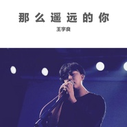
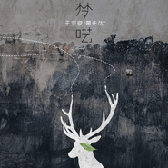
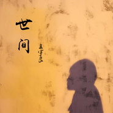

王宇良
============================

|  |  |
| :--: | :-- |
| [ 王宇良](https://i.xiami.com/wangyuliang) | **播放数**: 7813036 **粉丝数**: 899 **评论数**: 48 **地区**: China 中国大陆 **风格**: 民谣流行 Folk Pop, 独立民谣 Indie Folk  |

## 档案

## 专辑

| 名称 | 语种 | 唱片公司 | 发行时间 | 专辑类别 | 专辑风格 |
| :--: | :-- | :-- | :-- | :-- | :-- |
| [ 热泪被风吹凉](./albums/5021454748.md) | 国语 | 太声文化 | 2020年09月15日 | EP, 单曲 | 民谣 Folk |
| [ 时光里的他和她](./albums/5021364005.md) | 国语 | 太声文化 | 2020年08月28日 | EP, 单曲 | 国语流行 Mandarin Pop |
| [ 长大](./albums/5020797382.md) | 国语 |  | 2020年05月30日 | 录音室专辑 | 流行 Pop |
| [ 那么遥远的你](./albums/2105536227.md) | 国语 | 太声文化 | 2019年11月06日 | EP, 单曲 | 国语流行 Mandarin Pop |
| [ 小桥](./albums/2104499210.md) | 国语 | 太声文化 | 2019年01月21日 | EP, 单曲 | 国语流行 Mandarin Pop |
| [ 梦呓](./albums/2103511102.md) | 国语 | 太声文化 | 2018年02月01日 | EP, 单曲 |  |
| [ 闻窗一如初见](./albums/2102879782.md) | 国语 | 太声文化 | 2017年10月26日 | EP, 单曲 |  |
| [ 江州](./albums/2103467819.md) | 国语 | 独立发行 | 2017年07月21日 | EP, 单曲 |  |
| [ 世间](./albums/2102730825.md) | 国语 | 华谊聚星 | 2017年04月12日 | EP, 单曲 | 国语流行 Mandarin Pop |
| [ 而寂于钟情时](./albums/2102730861.md) | 国语 | 华谊聚星 | 2017年02月15日 | EP, 单曲 |  |
| [ 碎云](./albums/2102661262.md) | 国语 | 华谊兄弟 | 2016年12月08日 | EP, 单曲 |  |
| [ 最美好的时刻](./albums/2102643514.md) | 国语 | 华谊音乐 | 2016年11月02日 | EP, 单曲 |  |
| [ 我渴望](./albums/2100382597.md) | 国语 | 华谊音乐 | 2016年08月24日 | EP, 单曲 |  |
| [ 回家](./albums/2100371893.md) | 国语 | 华谊音乐 | 2016年07月22日 | EP, 单曲 |  |
| [ 春夏秋冬的你](./albums/2100333118.md) | 国语 | 华谊音乐 | 2016年05月10日 | EP, 单曲 |  |
| [ 每一刻的漂泊 EP](./albums/2100283360.md) | 国语 | 金麦田文化 | 2016年02月29日 | EP, 单曲 |  |
| [ 梦想的方向](./albums/2100188536.md) | 国语 | 金麦田文化 | 2015年08月31日 | 录音室专辑 |  |

## 评论

|  |  |  |  |
| :-- | :-- | :-- | :-- |
|  [虾米用户](https://emumo.xiami.com/u/358104299) 悲观的唯心存在现实解构虚... 2020-12-09 11:05 赞(1) 踩(0) | 
42721
 |
|  [虾米用户](https://emumo.xiami.com/u/444140235) 希望和悲伤都是一缕光 2020-10-17 07:58 赞(0) 踩(0) | 
默默听着也渡过了一些岁月
 |
|  [虾米用户](https://emumo.xiami.com/u/8337431) 以乐会友 2020-08-16 17:36 赞(0) 踩(0) | 
20200816.47
 |
|  [虾米用户](https://emumo.xiami.com/u/375338516) 二货，来根士力架！ 2019-08-07 19:29 赞(0) 踩(0) | 
喜欢你的声音，加油，七夕快乐
 |
|  [虾米用户](https://emumo.xiami.com/u/93838670) nothing spec... 2019-07-21 18:20 赞(0) 踩(0) | 
声音蛮好听的喲
 |
|  [虾米用户](https://emumo.xiami.com/u/278694692) 小众民谣爱好者 2019-07-05 00:37 赞(1) 踩(0) | 
很喜欢你的歌，加油
 |
|  [虾米用户](https://emumo.xiami.com/u/411061396)  2019-05-22 16:16 赞(0) 踩(0) | 
加油加油加油～好好听
 |
|  [虾米用户](https://emumo.xiami.com/u/404444043)  2019-04-20 21:02 赞(0) 踩(0) | 
歌如生活，他的填词就像在讲一个故事，向你娓娓道来
 |
|  [虾米用户](https://emumo.xiami.com/u/378708383) 在你意料不到的地方，总有... 2019-04-06 00:46 赞(0) 踩(0) | 
在这里等你❤️
 |
|  [虾米用户](https://emumo.xiami.com/u/116808764) 你要自己做自己的决定哦 2018-12-24 22:49 赞(3) 踩(0) | 
这么好听的歌，我喜欢的人，喜欢的歌都火了，从南山南，到陈粒，奇妙能力歌，到赵雷，下一个，是你。
 |
|  [虾米用户](https://emumo.xiami.com/u/39467022) 做个有朝气的行尸走肉 2018-09-14 17:31 赞(1) 踩(0) | 
加油加油
 |
|  [虾米用户](https://emumo.xiami.com/u/215130901)  2018-08-13 06:52 赞(3) 踩(0) | 
迟早会火！真的喜欢！
 |
|  [虾米用户](https://emumo.xiami.com/u/355306416) 希望我们会到永远 2018-07-16 19:37 赞(1) 踩(0) | 
不错 不错
 |
|  [虾米用户](https://emumo.xiami.com/u/324429382)  2018-05-22 00:01 赞(1) 踩(0) | 
好听，声音也好听，作曲也好，加油
 |
|  [虾米用户](https://emumo.xiami.com/u/339191478)   2018-05-10 13:05 赞(1) 踩(0) | 
:-)
 |
|  [虾米用户](https://emumo.xiami.com/u/276770837)  2018-04-16 07:34 赞(0) 踩(0) | 
加油！喜欢你的音乐
 |
|  [虾米用户](https://emumo.xiami.com/u/353254277)  2018-04-14 22:20 赞(1) 踩(0) | 
嘻嘻
 |
|  [虾米用户](https://emumo.xiami.com/u/351339422)  2018-02-28 18:11 赞(0) 踩(0) | 
很棒，加油(ง &amp;bull;̀_&amp;bull;́)ง
 |
|  [虾米用户](https://emumo.xiami.com/u/330055634) 愿我们都能找到那个叫青鸟... 2018-02-09 22:10 赞(1) 踩(0) | 
这不会是我曾喜欢的歌，希望有更多的佳作，加油！
 |
|  [虾米用户](https://emumo.xiami.com/u/348621378)  2018-02-08 14:57 赞(1) 踩(0) | 
加油
 |
|  [虾米用户](https://emumo.xiami.com/u/135874460) 金额百度inb 2018-01-14 18:58 赞(0) 踩(0) | 
每次听你的歌，都让我心里感到宁静加油加油加油支持你
 |
|  [虾米用户](https://emumo.xiami.com/u/265690440) 人走茶凉，故事还长。 2017-12-17 08:42 赞(2) 踩(0) | 
淡淡的节奏缓缓的流淌，每一首歌都是百听不厌的，听着入心，每隔一段时间听都会有不同的触感，很喜欢这种风格，特别是春夏秋冬和百闻不如一见，单曲循环好长时间了，加油吧！
 |
|  [虾米用户](https://emumo.xiami.com/u/335795771)  2017-11-26 18:35 赞(1) 踩(0) | 
这首歌是不错。非常喜欢。
 |
|  [虾米用户](https://emumo.xiami.com/u/16255463) @Revolution9... 2017-11-19 10:27 赞(0) 踩(0) | 
.
 |
|  [虾米用户](https://emumo.xiami.com/u/328975763)  2017-11-16 20:53 赞(0) 踩(0) | 
喜欢你，加油！
 |
|  [虾米用户](https://emumo.xiami.com/u/285498181) 比吴亦凡差一点的男人 2017-11-05 13:55 赞(2) 踩(0) | 
现在唱民谣的太多了&amp;hellip;&amp;hellip; 不过还是要加油啊
 |
|  [虾米用户](https://emumo.xiami.com/u/318278797) 我还没想好要写什么... 2017-11-05 03:25 赞(0) 踩(0) | 
好过好些个无病呻吟的民谣歌手支持你在南京的深夜有你的歌陪伴真好
 |
|  [虾米用户](https://emumo.xiami.com/u/190976431)  2017-10-14 19:17 赞(0) 踩(0) | 
加油呀
 |
|  [虾米用户](https://emumo.xiami.com/u/255847868)  2017-09-14 22:03 赞(0) 踩(0) | 
好听
 |
|  [虾米用户](https://emumo.xiami.com/u/120231276)  2017-09-09 00:23 赞(6) 踩(0) | 
最喜欢世间
 |
|  [虾米用户](https://emumo.xiami.com/u/135087424)  2017-09-04 19:08 赞(1) 踩(0) | 
你的歌是那种单曲循环几十遍之后，再过好久听起来还是可以循环的歌。喜欢这样的歌，喜欢这样的你，加油哦。
 |
|  [虾米用户](https://emumo.xiami.com/u/155221644) 身体上的疼痛可以让人缓解... 2017-09-04 10:39 赞(0) 踩(0) | 
加油啊
 |
|  [虾米用户](https://emumo.xiami.com/u/97542118) 宝贝 人和人一场游戏 2017-08-28 01:38 赞(0) 踩(0) | 
❤️
 |
|  [虾米用户](https://emumo.xiami.com/u/173560296)  2017-08-11 08:20 赞(0) 踩(0) | 
喜欢春夏秋冬的你，带着似有似无的忧伤
 |
|  [虾米用户](https://emumo.xiami.com/u/219116210) Lee soo 2017-06-23 20:28 赞(0) 踩(0) | 
浮生若梦梦里面 
 |
|  [虾米用户](https://emumo.xiami.com/u/135087424)  2017-06-05 11:27 赞(0) 踩(0) | 

 |
|  [虾米用户](https://emumo.xiami.com/u/43182804) 最孤独的人 2017-05-25 10:07 赞(1) 踩(0) | 
八个月前，第一条留言。
 |
|  [虾米用户](https://emumo.xiami.com/u/271836503)  2017-05-15 10:54 赞(0) 踩(0) | 
非常喜欢春夏秋冬的你
 |
|  [虾米用户](https://emumo.xiami.com/u/3873758)   2017-05-09 19:56 赞(0) 踩(0) | 
好喜欢，希望出更多好作品  
 |
|  [虾米用户](https://emumo.xiami.com/u/256874676)  2017-05-03 02:05 赞(0) 踩(0) | 

 |
|  [虾米用户](https://emumo.xiami.com/u/276962455)  2017-04-14 06:22 赞(0) 踩(0) | 
好听
 |
|  [虾米用户](https://emumo.xiami.com/u/287766602) 我的❤️随巧克力一起融化 2017-04-12 18:55 赞(0) 踩(0) | 
加油 
 |
|  [虾米用户](https://emumo.xiami.com/u/253631322)  2017-04-11 17:32 赞(1) 踩(0) | 
好听。
 |
|  [虾米用户](https://emumo.xiami.com/u/48303188)  2017-04-06 15:51 赞(0) 踩(0) | 

 |
|  [虾米用户](https://emumo.xiami.com/u/82523382) 我还没想好要写什么... 2017-03-14 23:21 赞(0) 踩(0) | 
吉他弹奏好听
 |
|  [虾米用户](https://emumo.xiami.com/u/7115373)  2016-12-10 23:11 赞(0) 踩(0) | 
    
 |
|  [虾米用户](https://emumo.xiami.com/u/119811744) 不幸却不争 2016-10-19 22:53 赞(0) 踩(0) | 
蛮好的
 |
|  [虾米用户](https://emumo.xiami.com/u/43182804) 最孤独的人 2016-09-05 07:30 赞(0) 踩(0) | 

 |
