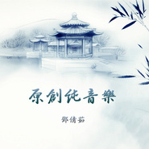

原创纯音乐
============================

|  |  |
| :--: | :-- |
| [ 原创纯音乐](https://emumo.xiami.com/album/2100189850) | **艺人**: [邓倩茹](../index.md) **语种**: 其他 **唱片公司**: 独立发行 **发行时间**: 2015年09月01日 **专辑类别**: 精选集 **专辑风格**: 原声 Soundtrack, 轻音乐 Easy Listening, 新世纪音乐 New Age **播放数**: 23519 **收藏数**: 76 **评论数**: 2  |

## 简介

中国民乐与西方管弦乐
 

为醉梦千城团队与工作室创作的音乐与一些配乐

## 曲目

## 评论

|  |  |  |  |
| :-- | :-- | :-- | :-- |
|  [虾米用户](https://emumo.xiami.com/u/53565) 更多武侠音乐，请关注武聆... 2018-04-02 17:00 赞(0) 踩(0) | 
- -
 |
|  [虾米用户](https://emumo.xiami.com/u/10991119) 纯粹是为了听音乐 2017-01-13 10:10 赞(0) 踩(0) | 
哀怨
 |
