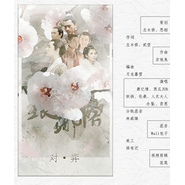

《对弈》——记2015年热播剧《琅琊榜》电视剧《琅琊榜》群像歌曲
============================

|  |  |
| :--: | :-- |
| [ 《对弈》——记2015年热播剧《琅琊榜》电视剧《琅琊榜》群像歌曲](https://emumo.xiami.com/album/2100314532) | **艺人**: [邓倩茹](../index.md) **语种**: 国语 **唱片公司**: PFT工作室 **发行时间**: 2016年04月15日 **专辑类别**: EP, 单曲 **专辑风格**: 国语流行 Mandarin Pop **播放数**: 873750 **收藏数**: 23 **评论数**: 3  |

## 简介

 一局对弈中，并非黑白两色”《对弈》
 

苏哥哥，想你了。

## 曲目

## 评论

|  |  |  |
| :-- | :-- | :-- |
|  [虾米用户](https://emumo.xiami.com/u/343343282)  2019-07-09 22:46 赞(0) 踩(0) | 
还可以，唱出了尔虞我诈的真谛。
 |
|  [虾米用户](https://emumo.xiami.com/u/8863870) 还我精选集！ 2016-08-01 15:46 赞(0) 踩(0) | 
从b站过来的，能在虾米上搜到这首歌真是太棒了！默默占个沙发……
 |
| ⇒ |  [虾米用户](https://emumo.xiami.com/u/4925005) nothing 2017-03-08 21:34 赞(0) 踩(0) | 
我有个精选集是古风的，虾米这边古风不多，我把觉得好听的都收藏起来了，你可以有空听听看~ <a href="http://www.xiami.com/collect/240853488?spm=a1z1s.6929273.1561534893.6.mNL2KN" target="_blank" rel="nofollow noreferrer noopener">http://www.xiami.com/collect/240853488?spm=a1z1s.6929273.1561534893.6.mNL2KN</a>
 |
