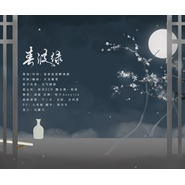

邓倩茹
============================

|  |  |
| :--: | :-- |
| [ 邓倩茹](https://i.xiami.com/dengqianru) | **地区**: China 中国大陆 **风格**: 轻音乐 Easy Listening, 管弦乐 Orchestral, 国语流行 Mandarin Pop, 中国风 China-Wave, 中国民乐 Chinese Folk Music **播放数**: 3279394 **粉丝数**: 186 **评论数**: 5  |

## 档案

音乐制作人 原创影视、动画、游戏等配乐； 
师从《仙剑奇侠传》、《古剑奇谭》《花千骨》等影视剧香港著名配乐大师麦振鸿； 
擅长流行中国风和各类配乐，参与醉梦千城原创音乐团队出品音乐剧专辑《回眸三生》原著小说、编剧、作词以及部分配乐创作； 
代表作《春波绿》、《对弈》、《临歧久别歌》、《恨枉生》、《不败》、《长河渐落》等。 
新浪微博：@月龙暮雪 
编曲/混音请私信或联系QQ/wechat：386455889。

## 专辑

| 名称 | 语种 | 唱片公司 | 发行时间 | 专辑类别 | 专辑风格 |
| :--: | :-- | :-- | :-- | :-- | :-- |
| [ 《琴律四韵·问灵》《魔道祖师》配乐](./albums/2104664003.md) | 国语 |  | 2019年03月10日 | EP, 单曲 | 中国民乐 Chinese Folk Music, 流行 Pop, 中国风 China-Wave |
| [ 《图灵密码》普罗印象曲（管弦乐）Prometheus｜amor y eternidad（爱与永恒）](./albums/2104266768.md) | 其他 |  | 2018年11月20日 | EP, 单曲 | 管弦乐流行 Orchestral Pop |
| [ 《图灵密码》时光掠影越和同人曲](./albums/2104266783.md) | 国语 |  | 2018年10月21日 | EP, 单曲 | 国语流行 Mandarin Pop, 管弦乐流行 Orchestral Pop |
| [ 山海经·拂尘意之浩然风骨](./albums/2103924018.md) | 其他 | 独立发行 | 2018年08月13日 | 原声带, 影视音乐 | 原声 Soundtrack |
| [ 《有鹤衔花》剑网三怪志系列六界轮回其一](./albums/2103523027.md) | 国语 | 独立发行 | 2018年02月09日 | EP, 单曲 | 流行 Pop, 古风 GuFeng Music |
| [ 春波绿忘羡七夕贺曲](./albums/2102820883.md) | 国语 | 独立发行 | 2017年08月27日 | EP, 单曲 | 流行 Pop, 国语流行 Mandarin Pop, 中国风 China-Wave |
| [ 《魔道祖师》春野旧城———温氏姐弟曲](./albums/2102816750.md) | 国语 | 独立发行 | 2017年08月19日 | EP, 单曲 | 流行 Pop, 中国风 China-Wave, 国语流行 Mandarin Pop |
| [ 长河渐落——《魔道祖师》晓星尘个人配乐](./albums/2102742931.md) | 纯音乐 | 独立发行 | 2017年05月01日 | 原声带, 影视音乐 | 流行 Pop, 原声 Soundtrack, 中国风 China-Wave |
| [ 不败笑傲江湖](./albums/2102680184.md) | 国语 | 独立发行 | 2017年01月13日 | EP, 单曲 | 流行 Pop, 中国风 China-Wave |
| [ 《魔道祖师》恨枉生————薛洋金光瑶恶友向](./albums/2102652331.md) | 国语 |  | 2016年11月13日 | EP, 单曲 | 浩室舞曲 House, 原声 Soundtrack, 中国风 China-Wave |
| [ 听路人之沧海桑田](./albums/2100381250.md) | 其他 | PFT工作室 | 2016年08月20日 | 原声带, 影视音乐 |  |
| [ 临歧久别歌——《魔道祖师》群像《魔道祖师》群像合唱](./albums/2100375760.md) | 国语 | PFT工作室 | 2016年08月03日 | EP, 单曲 | 浩室舞曲 House, 国语流行 Mandarin Pop, 原声 Soundtrack, 中国风 China-Wave |
| [ 拂晓约十二生肖系列之“鸡”](./albums/2100374287.md) | 国语 | 凡城客栈 | 2016年07月30日 | EP, 单曲 |  |
| [ 《对弈》——记2015年热播剧《琅琊榜》电视剧《琅琊榜》群像歌曲](./albums/2100314532.md) | 国语 | PFT工作室 | 2016年04月15日 | EP, 单曲 | 国语流行 Mandarin Pop |
| [ 改编电视剧《琅琊榜》插曲《赤血长殷》](./albums/2100272492.md) | 其他 | 独立发行 | 2016年02月05日 | 原声带, 影视音乐 | 原声 Soundtrack, 电视原声 Television Music |
| [ 音乐剧《回眸三生》原声集醉梦千城](./albums/2100272494.md) | 国语 | 醉梦千城 | 2016年02月05日 | 原声带, 影视音乐 | 民族融合新世纪 Ethnic Fusion New Age, 原声 Soundtrack, 国语流行 Mandarin Pop |
| [ 原创纯音乐](./albums/2100189850.md) | 其他 | 独立发行 | 2015年09月01日 | 精选集 | 原声 Soundtrack, 轻音乐 Easy Listening, 新世纪音乐 New Age |
| [ 《茉莉香片》原声配乐由落雨主演改编自张爱玲小说的微电影](./albums/2100189816.md) | 其他 | 独立发行 | 2015年08月08日 | 原声带, 影视音乐 | 电影原声 Film Score, 管弦乐 Orchestral |
| [ 有所思醉梦千城](./albums/2100276840.md) | 国语 | 醉梦千城 | 2013年10月25日 | EP, 单曲 | 民族融合新世纪 Ethnic Fusion New Age, 国语流行 Mandarin Pop |
| [ 邓倩茹的专辑](./albums/5022633588.md) | 其他 |  | 不详 |  |  |

## 评论

|  |  |  |
| :-- | :-- | :-- |
|  [虾米用户](https://emumo.xiami.com/u/330009846) 可惜明年花更好 ，知与谁... 2018-07-09 09:23 赞(1) 踩(0) | 
临岐久别歌爱死了
 |
|  [虾米用户](https://emumo.xiami.com/u/6066908) 光芒与希望 *JazzH... 2018-02-02 17:11 赞(1) 踩(0) | 
好像听出了一种仙剑的感觉
 |
|  [虾米用户](https://emumo.xiami.com/u/31028791) 网易和q也是神圣剑帝 2017-03-05 01:03 赞(2) 踩(0) | 
    
 |
|  [虾米用户](https://emumo.xiami.com/u/93226796) 只见雪色映衣袂，抚琴月显... 2016-09-17 07:08 赞(1) 踩(0) | 
对弈最好听
 |
|  [虾米用户](https://emumo.xiami.com/u/49690058) 我正常的时候就是不正常，... 2016-07-03 13:47 赞(0) 踩(0) | 
好听耶
 |
