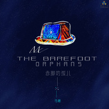

赤脚的孤儿
============================

|  |  |
| :--: | :-- |
| [ 赤脚的孤儿](https://emumo.xiami.com/album/2100264328) | **艺人**: [马融](../index.md) **语种**: 国语 **唱片公司**: 唐嘉文化 **发行时间**: 2016年01月21日 **专辑类别**: EP, 单曲 **专辑风格**: 城市民谣 Urban Folk **播放数**: 951244 **收藏数**: 54 **评论数**: 15  |

## 简介

单曲《赤脚的孤儿》是马融写给他父亲的歌，他想表达对父亲的思念及敬佩。马融父亲出生在西北偏远山村，在他父亲12岁之前，都没有一双属于自己的鞋子，上下学的路上都是光着脚丫，但是凭借他父亲的那种毅力和精神，考上了当时的大学，走出了那个让他永生难忘的山村。当时，马融父亲跟他讲起曾经的这些故事，他只是觉得他父亲这个人碎碎念，甚至不相信一个人怎么可能12岁了还没有一双自己的鞋子！直到他父亲去世后，马融跟身边的亲戚了解，才知道父亲当时讲的都是真的，才明白父亲当时的辛苦，为了摆脱那种命运而不懈的努力。其实，每个人来到这个世界上都是光着脚丫的，离开时，也是一个人孤孤单单的走。 世间的东西也是生不带来、死不带走。唯有就是活得有理想，为自己的理想去拼搏，去努力！ 

## 曲目

## 评论

|  |  |  |
| :-- | :-- | :-- |
|  [虾米用户](https://emumo.xiami.com/u/285477790) 我还没想好要写什么... 2019-08-03 16:09 赞(0) 踩(0) | 
 
 |
|  [虾米用户](https://emumo.xiami.com/u/331206238)   2019-07-05 20:42 赞(0) 踩(0) | 
嗓音还是可以得，但还是有点着急，祝你越来越棒
 |
|  [虾米用户](https://emumo.xiami.com/u/327570713) 知足，上進，不負野心 2019-04-08 09:03 赞(0) 踩(0) | 
境由心生
 |
|  [虾米用户](https://emumo.xiami.com/u/15973499)  2017-05-03 21:50 赞(0) 踩(0) | 
赤脚的孤儿
 |
|  [虾米用户](https://emumo.xiami.com/u/108652140)   2016-11-17 14:41 赞(0) 踩(0) | 
  
 |
|  [虾米用户](https://emumo.xiami.com/u/53683231) 一个吉他手而已 2016-06-29 03:20 赞(0) 踩(0) | 
这作品很成熟了
 |
| ⇒ |  [虾米用户](https://emumo.xiami.com/u/55878558)  2018-05-09 04:31 赞(0) 踩(0) | 
随缘了
 |
|  [虾米用户](https://emumo.xiami.com/u/1617806)  2016-05-26 16:16 赞(0) 踩(0) | 
收尾重复了三词，有点多余了，两句感觉应该不错。
 |
| ⇒ |  [虾米用户](https://emumo.xiami.com/u/52313286) 独立音乐唱作人 2016-06-27 04:20 赞(0) 踩(0) | 
脑残！
 |
|  [虾米用户](https://emumo.xiami.com/u/52313286) 独立音乐唱作人 2016-05-06 03:02 赞(0) 踩(0) | 
谢谢大家一路来的支持 从新编曲的歌陆续上架  
 |
|  [虾米用户](https://emumo.xiami.com/u/1892211) 持久专注简单 2016-01-23 10:07 赞(0) 踩(0) | 
人生应该是一场旅行
 |
|  [虾米用户](https://emumo.xiami.com/u/1892211) 持久专注简单 2016-01-23 10:07 赞(0) 踩(0) | 
人生应该是一场旅行
 |
|  [虾米用户](https://emumo.xiami.com/u/1892211) 持久专注简单 2016-01-23 10:06 赞(0) 踩(0) | 
世间的东西生不带来，死不带走，唯有就是活得有理想，为了摆脱命运而不懈努力。
 |
|  [虾米用户](https://emumo.xiami.com/u/10011485) 听说小虾米要去报澳龙精修... 2016-01-21 22:56 赞(0) 踩(0) | 
每一句都唱的那么透彻……
 |
|  [虾米用户](https://emumo.xiami.com/u/8244559)  2016-01-21 16:18 赞(1) 踩(0) | 
******
 |
