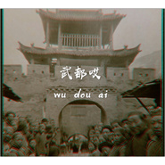

武都哎
============================

|  |  |
| :--: | :-- |
| [ 武都哎](https://emumo.xiami.com/album/2103744387) | **艺人**: [马融](../index.md) **语种**: 国语 **唱片公司**: 独立发行 **发行时间**: 2018年06月01日 **专辑类别**: EP, 单曲 **专辑风格**: 民谣 Folk, 当代民谣 Contemporary Folk, 独立民谣 Indie Folk **播放数**: 7594 **收藏数**: 3 **评论数**: 4  |

## 简介

武都人民自己的歌曲。作词：马融/马力。作曲：马融。编曲与制作：马融。乐器录制：马融。 

## 曲目

## 评论

|  |  |  |
| :-- | :-- | :-- |
|  [虾米用户](https://emumo.xiami.com/u/6096346)  2020-03-13 20:48 赞(0) 踩(0) | 
喜欢这个调调，加油马融
 |
|  [虾米用户](https://emumo.xiami.com/u/10227780) 唯有音乐不会辜负我… 2018-06-10 21:11 赞(0) 踩(0) | 
期待完整版
 |
| ⇒ |  [虾米用户](https://emumo.xiami.com/u/342139966)  2018-06-12 02:18 赞(0) 踩(0) | 
网易云貌似是完整版
 |
| ⇒ |  [虾米用户](https://emumo.xiami.com/u/10227780) 唯有音乐不会辜负我… 2018-06-12 06:12 赞(0) 踩(0) | 
<q><b>肉团子小仙说：</b></q>
 |
