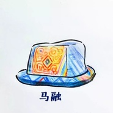
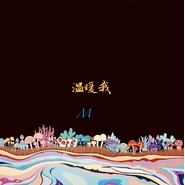
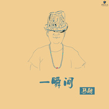

马融
============================

|  |  |
| :--: | :-- |
| [ 马融](https://i.xiami.com/czh) | **播放数**: 5520856 **粉丝数**: 1317 **评论数**: 90 **地区**: China 中国大陆 **风格**: 城市民谣 Urban Folk  |

## 档案

马融-独立音乐唱作人。1986年出生于甘肃。 2006年毕于北京迷笛音乐学院。2008年入住丽江后创始《丽江原创》音乐音乐活动。2014中国好歌曲高校推荐西南区总冠军 ，即将发行首张专辑《赤脚的孤儿》

## 专辑

| 名称 | 语种 | 唱片公司 | 发行时间 | 专辑类别 | 专辑风格 |
| :--: | :-- | :-- | :-- | :-- | :-- |
| [ 我是神仙](./albums/2108278969.md) | 国语 | Live Music | 2020年04月08日 | EP, 单曲 | 国语流行 Mandarin Pop |
| [ 武都哎](./albums/2103744387.md) | 国语 | 独立发行 | 2018年06月01日 | EP, 单曲 | 民谣 Folk, 当代民谣 Contemporary Folk, 独立民谣 Indie Folk |
| [ 第一百个梦](./albums/2103714497.md) | 国语 | 独立发行 | 2018年05月20日 | 录音室专辑 | 独立民谣 Indie Folk, 当代民谣 Contemporary Folk |
| [ 思念观世音](./albums/2103702954.md) | 国语 | 独立发行 | 2018年05月06日 | EP, 单曲 | 独立民谣 Indie Folk |
| [ 冬季](./albums/2103641694.md) | 国语 | 独立发行 | 2018年03月25日 | EP, 单曲 | 民谣 Folk, 城市民谣 Urban Folk, 新民谣 Neofolk |
| [ 温暖我](./albums/2103464722.md) | 国语 | 独立发行 | 2017年12月28日 | EP, 单曲 | 民谣 Folk, 独立民谣 Indie Folk, 新民谣 Neofolk |
| [ 在这短暂一生里](./albums/2102905804.md) | 国语 | 独立发行 | 2017年11月05日 | EP, 单曲 | 民谣 Folk, 独立民谣 Indie Folk, 新民谣 Neofolk |
| [ 赤脚的孤儿](./albums/2102751142.md) | 国语 | Live Music | 2017年05月06日 | 录音室专辑 | 独立流行 Indie Pop |
| [ 一瞬间](./albums/2100358099.md) | 国语 | 唐嘉文化 | 2016年06月24日 | EP, 单曲 |  |
| [ 我是神仙](./albums/2100314726.md) | 国语 | 唐嘉文化 | 2016年04月16日 | EP, 单曲 | 摇滚 Rock & Roll |
| [ 赤脚的孤儿](./albums/2100264328.md) | 国语 | 唐嘉文化 | 2016年01月21日 | EP, 单曲 | 城市民谣 Urban Folk |
| [ 新New](./albums/2100199412.md) | 国语 | 马融 | 2015年10月02日 | EP, 单曲 | 城市民谣 Urban Folk |

## 评论

|  |  |  |  |
| :-- | :-- | :-- | :-- |
|  [虾米用户](https://emumo.xiami.com/u/6684451)  2021-01-06 16:58 赞(0) 踩(0) | 
2021.01.06
 |
|  [虾米用户](https://emumo.xiami.com/u/8337431) 以乐会友 2020-08-26 15:45 赞(0) 踩(0) | 
20200826.84
 |
|  [虾米用户](https://emumo.xiami.com/u/434750029) 我还没想好要写什么... 2020-08-09 00:13 赞(0) 踩(0) | 
哥们，挺有才！唱功好。
 |
|  [虾米用户](https://emumo.xiami.com/u/35935921) 暂无签名~ 2019-09-15 11:30 赞(0) 踩(0) | 
九月死了
 |
|  [虾米用户](https://emumo.xiami.com/u/347186879)  2019-09-14 10:44 赞(0) 踩(0) | 
九月挂了？？？
 |
|  [虾米用户](https://emumo.xiami.com/u/184290548) 80的大叔 2019-09-08 23:01 赞(0) 踩(0) | 
九月没有了，改个歌词吧，老马，九月的确好听啊可我不敢用音响听，你看吧，下架了
 |
|  [虾米用户](https://emumo.xiami.com/u/196781938)  2019-09-08 18:42 赞(1) 踩(0) | 
九月九月九月 秘密也行啊   
 |
|  [虾米用户](https://emumo.xiami.com/u/184290548) 80的大叔 2019-08-28 20:47 赞(0) 踩(0) | 
只听其歌 不评其人红时不追 落实不黑只赏其作 不问是非
 |
|  [虾米用户](https://emumo.xiami.com/u/336691185)  2019-01-05 00:17 赞(0) 踩(0) | 
喜欢你的歌
 |
|  [虾米用户](https://emumo.xiami.com/u/4148998) 你所遇到的一切，都不是偶... 2018-10-17 20:19 赞(0) 踩(0) | 
什么时候有演唱会
 |
|  [虾米用户](https://emumo.xiami.com/u/127857200) 双手带电二百二十伏    2018-09-15 15:36 赞(2) 踩(0) | 
先做人，再做音乐。
 |
| ⇒ |  [虾米用户](https://emumo.xiami.com/u/55878558)  2019-08-20 00:34 赞(0) 踩(0) | 
傻b
 |
|  [虾米用户](https://emumo.xiami.com/u/11105318) 我是个很懒很懒的人，懒到... 2018-09-02 23:41 赞(4) 踩(0) | 
刚刚在苏州听完了现场。这是我听过人最少的现场，约莫20人。Livehouse和演唱会音乐节的现场不一样，因为它的小，你会感觉与歌手呼吸着同一块空气，音乐在这小房子里弥漫，渗进血液，这时就完成了与歌手的交心。而这一场，因为人少，感觉更是来的直接和强烈，尤其是听到《赤脚的孤儿》的时候。我也是孤儿，这首歌很早就惊艳了我，一直是我压箱底的收藏。当他在舞台上嘶吼，几米外台下的我几欲落泪。很多人说他人品不好，其实人品这东西只有自己知道。我们听的是音乐，柯本和罗斯歌迷也不计其数，我们只需要听纯粹的音乐，反正感觉他很缺钱，他需要钱做音乐，所以，我还是希望喜欢他音乐的人支持一下他，能去次现场还是要去的。
 |
| ⇒ |  [虾米用户](https://emumo.xiami.com/u/127857200) 双手带电二百二十伏    2018-09-15 15:38 赞(0) 踩(0) | 
此言差矣，音乐无国界，音乐人有，先做人，再做音乐，音乐差点都没事，人不好可就&amp;hellip;&amp;hellip;
 |
| ⇒ |  [虾米用户](https://emumo.xiami.com/u/11105318) 我是个很懒很懒的人，懒到... 2018-09-15 22:12 赞(0) 踩(0) | 
<q><b>+1说：</b></q>
 |
|  [虾米用户](https://emumo.xiami.com/u/49895220) 一念静心花开遍世界 2018-07-25 12:39 赞(0) 踩(0) | 
我是神仙呢？！
 |
|  [虾米用户](https://emumo.xiami.com/u/17066813) 虾米认证:一只咸鱼 2018-07-19 17:22 赞(4) 踩(0) | 
卧槽，骗完王宝强的钱又来出道出唱片了。臭婊子， 
 |
| ⇒ |  [虾米用户](https://emumo.xiami.com/u/11105318) 我是个很懒很懒的人，懒到... 2018-09-02 23:21 赞(0) 踩(0) | 
666哈哈
 |
| ⇒ |  [虾米用户](https://emumo.xiami.com/u/1957723) 我喜欢你离我远一点 2018-10-20 03:21 赞(0) 踩(0) | 
我谁都不服 只服你 哈哈哈
 |
| ⇒ |  [虾米用户](https://emumo.xiami.com/u/360159470) 我还没想好要写什么... 2018-11-06 20:22 赞(0) 踩(0) | 
你是来搞笑的吗？O(&amp;cap;_&amp;cap;)O哈哈~
 |
| ⇒ |  [虾米用户](https://emumo.xiami.com/u/264029252) 活着！活着！还活着！ 2019-09-07 10:19 赞(0) 踩(0) | 
牛。
 |
|  [虾米用户](https://emumo.xiami.com/u/345122290)  2018-06-06 19:37 赞(0) 踩(0) | 
您唱的很好听
 |
|  [虾米用户](https://emumo.xiami.com/u/288516691)  2018-05-21 16:29 赞(0) 踩(0) | 
好听
 |
|  [虾米用户](https://emumo.xiami.com/u/343113758) 美好世界 2018-03-16 17:16 赞(0) 踩(0) | 
还行
 |
|  [虾米用户](https://emumo.xiami.com/u/17132003) 一个开始认真养虾米的人 2017-12-04 08:59 赞(8) 踩(0) | 
转发一段文字：马融更赖账！之前谈好在他专辑上放个商业logo钱当下就付他了，答应制作好后给我方五十张作品，两月后他只发了个电脑制作的文本图给我方，到现在一年多了他电话、微信、微博全屏蔽了我，专辑上也没有给我方制作上logo！现在连微博都把我给设置了，根本联系不上！！看完我就来搜一搜 到底是什么人啊那么牛逼 
 |
| ⇒ |  [虾米用户](https://emumo.xiami.com/u/55878558)  2018-05-09 05:11 赞(0) 踩(0) | 
据我了解的 你借他钱一直没有还给他哦！
 |
| ⇒ |  [虾米用户](https://emumo.xiami.com/u/17132003) 一个开始认真养虾米的人 2020-04-12 15:46 赞(0) 踩(0) | 
<q><b>超级73·复仇者说：</b></q>
 |
|  [虾米用户](https://emumo.xiami.com/u/289324997)  2017-11-11 02:36 赞(1) 踩(0) | 
微信截图也可以伪造啊，自己整个号改一名字就行，玩新媒体的应该都懂吧~~~所以都别跟着瞎吵吵了，真的，用大脑思考下，再愤怒。中国人自己砸自己国人的日本车这类事情&amp;hellip;&amp;hellip;能不能少点，老外都看笑话呢，觉得丫们智商是不是都缺，尴尬了。
 |
| ⇒ |  [虾米用户](https://emumo.xiami.com/u/88869) 我就是老姐姐 2017-12-17 11:02 赞(0) 踩(0) | 
伪造只能一个人做 但是人在做天在看 他的事情不止这次曝光的一次 很多地方都碰到他耍无赖的事情怎么伪造？
 |
|  [虾米用户](https://emumo.xiami.com/u/282632728) 我还没想好要写什么... 2017-11-10 14:47 赞(2) 踩(0) | 
你火了，没素质的东西
 |
|  [虾米用户](https://emumo.xiami.com/u/36703044) 暂无签名~ 2017-11-10 13:09 赞(2) 踩(0) | 
看了推文才来好奇听听到底是谁，你火了
 |
|  [虾米用户](https://emumo.xiami.com/u/38612217) 我还没想好要写什么... 2017-11-10 11:10 赞(2) 踩(0) | 
你放人家鸽子，把你放火了啊！混子观光大军到
 |
|  [虾米用户](https://emumo.xiami.com/u/307258679)   2017-11-10 10:20 赞(3) 踩(0) | 
稀烂的班子
 |
|  [虾米用户](https://emumo.xiami.com/u/38883178) “” 2017-11-10 09:55 赞(0) 踩(0) | 
gg man
 |
|  [虾米用户](https://emumo.xiami.com/u/38883178) “” 2017-11-10 09:54 赞(0) 踩(0) | 
ggman
 |
|  [虾米用户](https://emumo.xiami.com/u/4727415) swallowyours... 2017-11-09 23:25 赞(13) 踩(0) | 
关于马融取消孝感MFhouse今晚（2017/11/9）巡演的公告2017-11-09 alexxiaoshuai MFhouse<a href="http://mp.weixin.qq.com/s/SedB_qKeMG3ixVF6Sl_nkA" target="_blank" rel="nofollow noreferrer noopener">http://mp.weixin.qq.com/s/SedB_qKeMG3ixVF6Sl_nkA</a>
 |
| ⇒ |  [虾米用户](https://emumo.xiami.com/u/122588872)  2017-11-10 02:34 赞(0) 踩(0) | 
湖北人表示本地公众号推送疯了!
 |
| ⇒ |  [虾米用户](https://emumo.xiami.com/u/88869) 我就是老姐姐 2017-11-10 05:17 赞(0) 踩(0) | 
听说了 人品太差了 一点责任感也没有 就这几个粉丝还耍大牌 等着看他吃土
 |
| ⇒ |  [虾米用户](https://emumo.xiami.com/u/282632728) 我还没想好要写什么... 2017-11-10 14:48 赞(0) 踩(0) | 
广州地区发来祝力
 |
| ⇒ |  [虾米用户](https://emumo.xiami.com/u/286062072) 每一针吗啡都是打开通往灵... 2017-12-15 10:52 赞(0) 踩(0) | 
做人的品德修养非常重要，特别是公众人物，刚才看到歌手在孝感演唱会耍大牌，单方取消出场的文章，脏话真多，这样的艺人，不是爱乐者需追寻的共鸣，取关了。
 |
| ⇒ |  [虾米用户](https://emumo.xiami.com/u/184290548) 80的大叔 2019-07-21 15:55 赞(0) 踩(0) | 
<q><b>Crush说：</b></q>
 |
| ⇒ |  [虾米用户](https://emumo.xiami.com/u/88869) 我就是老姐姐 2019-08-12 21:52 赞(0) 踩(0) | 
我只是把大家都知道的事再说一遍 你要是不愿意听 你自己就可以乖乖听歌 别看我发的
 |
| ⇒ |  [虾米用户](https://emumo.xiami.com/u/184290548) 80的大叔 2019-09-10 12:06 赞(0) 踩(0) | 
<q><b>Crush说：</b></q>
 |
| ⇒ |  [虾米用户](https://emumo.xiami.com/u/88869) 我就是老姐姐 2019-09-19 08:42 赞(0) 踩(0) | 
<q><b>K、说：</b></q>
 |
| ⇒ |  [虾米用户](https://emumo.xiami.com/u/184290548) 80的大叔 2019-09-21 00:14 赞(0) 踩(0) | 
<q><b>Crush说：</b></q>
 |
| ⇒ |  [虾米用户](https://emumo.xiami.com/u/88869) 我就是老姐姐 2019-10-08 22:01 赞(0) 踩(0) | 
<q><b>K、说：</b></q>
 |
| ⇒ |  [虾米用户](https://emumo.xiami.com/u/88869) 我就是老姐姐 2019-10-08 22:05 赞(0) 踩(0) | 
<q><b>K、说：</b></q>
 |
|  [虾米用户](https://emumo.xiami.com/u/258122685) 独立众生… 2017-09-06 23:31 赞(0) 踩(0) | 
加油。
 |
|  [虾米用户](https://emumo.xiami.com/u/53683231) 一个吉他手而已 2017-08-31 01:27 赞(0) 踩(0) | 
有才有才
 |
|  [虾米用户](https://emumo.xiami.com/u/9701985) 我很丑可是我有音乐和啤酒 2017-06-29 16:58 赞(0) 踩(0) | 
破音嗓子好好奇
 |
|  [虾米用户](https://emumo.xiami.com/u/38883178) “” 2017-06-21 11:39 赞(0) 踩(0) | 
洛阳8.4号
 |
|  [虾米用户](https://emumo.xiami.com/u/271354855) 这家伙很聪明什么也没留下... 2017-04-18 00:10 赞(0) 踩(0) | 
谢谢
 |
|  [虾米用户](https://emumo.xiami.com/u/2816412) 音乐才是我的脉搏。 2017-04-03 11:25 赞(0) 踩(0) | 
内容已删除
 |
| ⇒ |  [虾米用户](https://emumo.xiami.com/u/282632728) 我还没想好要写什么... 2017-11-10 14:48 赞(0) 踩(0) | 
这种没素质的东西还是你哥哥？早点绝交吧
 |
|  [虾米用户](https://emumo.xiami.com/u/266866220)  2017-02-08 18:21 赞(0) 踩(0) | 
歌声很干净 加油吧！
 |
|  [虾米用户](https://emumo.xiami.com/u/36778808) 目标之一 2016-11-24 09:05 赞(0) 踩(0) | 
生活像一场梦境
 |
|  [虾米用户](https://emumo.xiami.com/u/219861618)  2016-10-15 00:28 赞(0) 踩(0) | 

 |
|  [虾米用户](https://emumo.xiami.com/u/207264) 其实，生活就要像疯子一样... 2016-07-24 12:53 赞(0) 踩(0) | 
加油！！！
 |
|  [虾米用户](https://emumo.xiami.com/u/3333187)  2016-07-07 17:39 赞(0) 踩(0) | 
嗯嗯
 |
|  [虾米用户](https://emumo.xiami.com/u/773755)  2016-06-25 07:09 赞(4) 踩(0) | 
听着听着怎么听出汪峰的味儿来了
 |
|  [虾米用户](https://emumo.xiami.com/u/10471420)  2016-06-24 20:06 赞(0) 踩(0) | 
赤脚的孤儿好听
 |
|  [虾米用户](https://emumo.xiami.com/u/126644380)  2016-06-05 16:25 赞(1) 踩(0) | 
嘶喊声音真实彻底  希望多出一些高潮的曲调
 |
|  [虾米用户](https://emumo.xiami.com/u/39260842)   2016-05-17 14:14 赞(0) 踩(0) | 
卧槽  赤脚的孤儿 超好听的！！！
 |
|  [虾米用户](https://emumo.xiami.com/u/6568850)  2016-05-12 14:10 赞(0) 踩(0) | 
非常棒，满满能量！
 |
|  [虾米用户](https://emumo.xiami.com/u/151669622)  2016-04-25 22:23 赞(0) 踩(0) | 
很棒很棒
 |
|  [虾米用户](https://emumo.xiami.com/u/151669622)  2016-04-25 22:23 赞(0) 踩(0) | 
很棒
 |
|  [虾米用户](https://emumo.xiami.com/u/52313286) 独立音乐唱作人 2016-04-19 01:48 赞(28) 踩(0) | 
谢谢大家，全新编曲的歌陆续都会上线，谢谢大家一路来的支持！ 
 |
| ⇒ |  [虾米用户](https://emumo.xiami.com/u/8269589)  2016-05-11 01:06 赞(0) 踩(0) | 
挺好听的，但是真的希望吧发到某倩的某些评论删掉，掉价不值得。
 |
| ⇒ |  [虾米用户](https://emumo.xiami.com/u/54554952) 你永远欠我的 2016-05-31 03:07 赞(0) 踩(0) | 
融哥，有粉丝群或者交流群之类的吗？一个方便大家关注你，二个可能会有少量宣传作用。 
 |
| ⇒ |  [虾米用户](https://emumo.xiami.com/u/184290548) 80的大叔 2019-07-21 15:49 赞(0) 踩(0) | 
你的新歌呢   
 |
|  [虾米用户](https://emumo.xiami.com/u/143735622)  2016-04-17 13:47 赞(3) 踩(0) | 
难道只有我发现前奏和间奏是西游记的主题曲吗？
 |
|  [虾米用户](https://emumo.xiami.com/u/8424657) 海岸线 2016-03-20 22:25 赞(0) 踩(0) | 

 |
|  [虾米用户](https://emumo.xiami.com/u/1308967) 虾米听重型极端音乐这块的... 2016-03-20 08:06 赞(0) 踩(0) | 
可以
 |
|  [虾米用户](https://emumo.xiami.com/u/11253294) 我还没想好要写什么... 2016-02-26 14:01 赞(1) 踩(0) | 
为啥专辑封面是奈良美智。。
 |
|  [虾米用户](https://emumo.xiami.com/u/6959352) 你头发湿了 2016-02-06 09:43 赞(0) 踩(0) | 
很好听加油 不是很平静无味的民谣 声音好听
 |
|  [虾米用户](https://emumo.xiami.com/u/105485364) 没有什么好装的 2016-02-01 10:47 赞(0) 踩(0) | 
    
 |
|  [虾米用户](https://emumo.xiami.com/u/12319515)  2016-01-29 22:56 赞(0) 踩(0) | 
好听好有爆发力的赶脚
 |
|  [虾米用户](https://emumo.xiami.com/u/10250709)  2016-01-28 15:06 赞(0) 踩(0) | 
加油，音乐很好
 |
|  [虾米用户](https://emumo.xiami.com/u/51690777) 解忧 2016-01-27 21:48 赞(0) 踩(0) | 
OK
 |
|  [虾米用户](https://emumo.xiami.com/u/50440334)  2016-01-25 17:01 赞(0) 踩(0) | 

 |
|  [虾米用户](https://emumo.xiami.com/u/7012981) 声音中的故事 2016-01-25 16:55 赞(0) 踩(0) | 
能够坚持住自己的那份信念是非常难能可贵的
 |
|  [虾米用户](https://emumo.xiami.com/u/52023384)   2016-01-24 23:07 赞(0) 踩(0) | 
喜欢
 |
|  [虾米用户](https://emumo.xiami.com/u/48123835)  2016-01-24 16:25 赞(0) 踩(0) | 

 |
|  [虾米用户](https://emumo.xiami.com/u/91025436)  2015-12-13 00:01 赞(0) 踩(0) | 
fighting
 |
|  [虾米用户](https://emumo.xiami.com/u/35015211)   2015-11-14 17:00 赞(1) 踩(0) | 
我战友
 |
|  [虾米用户](https://emumo.xiami.com/u/74294460)  2015-10-17 00:21 赞(1) 踩(0) | 
额NIANIA，无限的赞
 |
| ⇒ |  [虾米用户](https://emumo.xiami.com/u/55878558)  2015-10-20 05:44 赞(0) 踩(0) | 

 |
| ⇒ |  [虾米用户](https://emumo.xiami.com/u/60583164) 莎菲娜   莎菲娜   ... 2016-12-25 16:22 赞(0) 踩(0) | 
喜欢痛仰啊
 |
|  [虾米用户](https://emumo.xiami.com/u/56636812) 待就业文艺青年 2015-10-13 00:15 赞(0) 踩(0) | 
非常好听，支持原创！
 |
|  [虾米用户](https://emumo.xiami.com/u/56741942) 我尽量不装逼，不与人撕逼 2015-10-08 23:40 赞(0) 踩(0) | 
沙发   
 |
| ⇒ |  [虾米用户](https://emumo.xiami.com/u/55878558)  2015-10-14 05:36 赞(0) 踩(0) | 

 |
