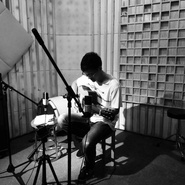

成磊
============================

|  |  |
| :--: | :-- |
| [ 成磊](https://i.xiami.com/chenglei) | **地区**: China 中国大陆 **风格**: 器乐独奏 Solo Instrumental, 轻音乐 Easy Listening, 新世纪音乐 New Age, 中国风 China-Wave **播放数**: 4731714 **粉丝数**: 2131 **评论数**: 68  |

## 档案

原声吉他手 
出道于2015年，同年10月上海育音堂首次亮相。 
近年来，在中国各地的演出活动不断增加，也得到海外演奏家前辈们的赞赏。 
他的作品保留了中国风元素，并融入流行乐、摇滚乐、R&B、Fusion等各种风格，以旋律为主导营造画面感，追求个性和多元化的曲风从热情励志到温婉柔美，从清新动人到幽怨伤感，大胆多变。 
艺术形式是一个人，一把吉他的演奏，利用开放调弦，手法技巧多样，仿佛是一支乐队的演出效果，被广大吉他爱好者评价为“一人乐队 One Man Band”。 
目前正以独奏吉他手身份进行全国巡演，同时也参与到纪录片配乐、动漫主题曲、广告音乐等的吉他部分作曲和编曲。 
发行专辑： 
2015年 《无限》 全创作指弹吉他专辑 
2016年 《奇点》 全创作指弹吉他专辑

## 专辑

| 名称 | 语种 | 唱片公司 | 发行时间 | 专辑类别 | 专辑风格 |
| :--: | :-- | :-- | :-- | :-- | :-- |
| [ 电光石火](./albums/2102753503.md) | 纯音乐 | 独立发行 | 2017年05月25日 | EP, 单曲 | 流行摇滚 Pop Rock, 器乐流行 Instrumental Pop |
| [ 奇点](./albums/2102739148.md) | 纯音乐 | 独立发行 | 2016年12月01日 | 录音室专辑 | 轻音乐 Easy Listening, 器乐独奏 Solo Instrumental, 中国风 China-Wave |
| [ 一把吉他的万千世界](./albums/2102670727.md) | 国语 | 独立发行 | 2016年10月01日 | 合集, 杂锦 | 轻音乐 Easy Listening, 器乐独奏 Solo Instrumental |
| [ 无限](./albums/2100238948.md) | 国语 | 独立发行 | 2015年11月10日 | 录音室专辑 |  |
| [ B站视频MP3堆放区](./albums/2100248922.md) | 国语 | 独立发行 | 2015年11月10日 | 合集, 杂锦 | 器乐独奏 Solo Instrumental |

## 评论

|  |  |  |
| :-- | :-- | :-- |
|  [虾米用户](https://emumo.xiami.com/u/358104299) 悲观的唯心存在现实解构虚... 2020-10-12 05:09 赞(1) 踩(0) | 
41604
 |
|  [虾米用户](https://emumo.xiami.com/u/102044206)  2020-05-10 07:06 赞(0) 踩(0) | 
成大师，感谢你带来这么美好的音乐。感射     
 |
|  [虾米用户](https://emumo.xiami.com/u/407507157)  2020-03-31 11:01 赞(0) 踩(0) | 
大佬，求谱子啊。网上很多人都需要
 |
|  [虾米用户](https://emumo.xiami.com/u/228843687) 懒惰统治人间 2019-11-06 11:49 赞(0) 踩(0) | 

 |
|  [虾米用户](https://emumo.xiami.com/u/10537792)  2019-10-15 10:24 赞(0) 踩(0) | 

 |
|  [虾米用户](https://emumo.xiami.com/u/307669015)  2019-10-10 00:58 赞(0) 踩(0) | 
深夜静静的听，真好  
 |
|  [虾米用户](https://emumo.xiami.com/u/4771146) 每一个音乐响起的都是一段... 2019-07-06 00:23 赞(0) 踩(0) | 
好听，安静
 |
|  [虾米用户](https://emumo.xiami.com/u/322003235)  2019-05-29 21:58 赞(0) 踩(0) | 
适合一个人慢慢聆听，我用的是魅族21HD耳机，手机开了HIFI音效，效果很棒，希望成磊能出新的作品！
 |
|  [虾米用户](https://emumo.xiami.com/u/368988131)  2019-02-19 03:14 赞(0) 踩(0) | 
很喜欢，加油！
 |
|  [虾米用户](https://emumo.xiami.com/u/318438068)  2019-01-06 02:57 赞(1) 踩(0) | 
这首地球仪是我最喜欢的纯音乐版本
 |
|  [虾米用户](https://emumo.xiami.com/u/100378774) 希望音乐能永远慰藉每一个... 2018-08-04 14:20 赞(0) 踩(0) | 
后期真棒
 |
|  [虾米用户](https://emumo.xiami.com/u/7874823) 不再沉溺，做个温暖别人的... 2018-08-01 15:37 赞(1) 踩(0) | 
很少听吉他曲，总觉得钢琴更接近灵魂。但是他的作品把我深深打动了。
 |
|  [虾米用户](https://emumo.xiami.com/u/50643597)  2018-06-28 17:32 赞(0) 踩(0) | 
am用得很好
 |
|  [虾米用户](https://emumo.xiami.com/u/32994344)   2018-05-10 20:24 赞(1) 踩(0) | 
小哥哥金光闪闪，超好听特别来劲
 |
|  [虾米用户](https://emumo.xiami.com/u/289038809) 我还没想好要写什么... 2018-05-08 13:43 赞(0) 踩(0) | 
谢谢您 您让我有了重新学习音乐的动力
 |
|  [虾米用户](https://emumo.xiami.com/u/291301454)  2018-02-28 23:02 赞(0) 踩(0) | 
很棒真的  加油
 |
|  [虾米用户](https://emumo.xiami.com/u/20177386) 感谢一切美好的遇见❤️ 2018-02-23 10:37 赞(0) 踩(0) | 

 |
|  [虾米用户](https://emumo.xiami.com/u/54445709) 于无声处听惊雷。 2018-02-02 01:21 赞(1) 踩(0) | 
 
 |
|  [虾米用户](https://emumo.xiami.com/u/307225684)  2017-12-15 19:36 赞(0) 踩(0) | 
喜歡你的 無限 跟 追 很棒！ 支持你！
 |
|  [虾米用户](https://emumo.xiami.com/u/43274932) 我就是我，爱节奏又爱卖萌... 2017-10-01 23:35 赞(4) 踩(0) | 
在淘宝上可以买木头老师的专辑和原版谱，希望大家支持正版，支持木头老师，还有老师的亲笔签名哦ꉂ(ˊᗜˋ*)
 |
| ⇒ |  [虾米用户](https://emumo.xiami.com/u/84917746) 我还没想好要写什么... 2018-12-24 18:52 赞(0) 踩(0) | 
搜不到啊
 |
|  [虾米用户](https://emumo.xiami.com/u/278830283)  2017-09-24 10:35 赞(0) 踩(0) | 
吉他
 |
|  [虾米用户](https://emumo.xiami.com/u/3190828)  2017-08-27 21:22 赞(2) 踩(0) | 
原来是木头呀！要支持下～
 |
|  [虾米用户](https://emumo.xiami.com/u/263360637)  2017-08-20 01:38 赞(0) 踩(0) | 
很棒！！
 |
|  [虾米用户](https://emumo.xiami.com/u/46256393) 当里个当 2017-07-13 11:59 赞(0) 踩(0) | 
加油加油
 |
|  [虾米用户](https://emumo.xiami.com/u/121821262) 秉烛夜游 2017-07-12 19:30 赞(2) 踩(0) | 
原来是木头老师，好久前就加了qq，今天又在虾米偶遇，还刚好第1000个粉丝，哈哈哈
 |
|  [虾米用户](https://emumo.xiami.com/u/54583869)   2017-06-13 23:48 赞(3) 踩(0) | 
你的能量超乎你想象，听到了大陆指弹的希望
 |
|  [虾米用户](https://emumo.xiami.com/u/240510106)  2017-06-02 01:41 赞(0) 踩(0) | 
不错哦， 期待多出点
 |
|  [虾米用户](https://emumo.xiami.com/u/278930145)  2017-05-18 22:24 赞(0) 踩(0) | 
加油！
 |
|  [虾米用户](https://emumo.xiami.com/u/478527) 好想跟衣服在洗衣机里滚 2017-05-09 02:08 赞(0) 踩(0) | 
奇点，加油
 |
|  [虾米用户](https://emumo.xiami.com/u/478527) 好想跟衣服在洗衣机里滚 2017-05-09 01:53 赞(0) 踩(0) | 
听来听去，最爱的还是这一曲【琅琊一梦】
 |
|  [虾米用户](https://emumo.xiami.com/u/291273831)   2017-04-25 10:31 赞(0) 踩(0) | 

 |
|  [虾米用户](https://emumo.xiami.com/u/9233073) Hugo(雨中的苹果)，... 2016-06-04 19:05 赞(1) 踩(0) | 
加油(ง •̀_•́)ง
 |
|  [虾米用户](https://emumo.xiami.com/u/41914778)   2016-05-27 00:23 赞(0) 踩(0) | 
木头木头！！！我来催更啦！
 |
|  [虾米用户](https://emumo.xiami.com/u/51597118)    我也不会再对谁满怀... 2016-04-21 08:20 赞(0) 踩(0) | 
要出新砖了吗!
 |
|  [虾米用户](https://emumo.xiami.com/u/47011209)   2016-03-07 23:17 赞(0) 踩(0) | 

 |
|  [虾米用户](https://emumo.xiami.com/u/31107860) 电影是人类内心无法言喻的... 2016-03-06 10:42 赞(0) 踩(0) | 
听了你的《地球仪》，不能更棒啊！！太喜欢   
 |
|  [虾米用户](https://emumo.xiami.com/u/7703874)  2016-02-13 20:35 赞(0) 踩(0) | 
猴听！！！！！！！！
 |
|  [虾米用户](https://emumo.xiami.com/u/77983024)  2016-01-28 02:12 赞(1) 踩(0) | 
我老爸超喜欢你的无限，画中人和琅琊一梦，当然，我也一样
 |
|  [虾米用户](https://emumo.xiami.com/u/95739900)  2015-12-30 00:55 赞(0) 踩(0) | 
破晓中听出wings的味道 很赞呀！
 |
|  [虾米用户](https://emumo.xiami.com/u/95073050)  2015-12-27 17:35 赞(0) 踩(0) | 
咱们同名同姓
 |
|  [虾米用户](https://emumo.xiami.com/u/93458920) 我要做一个很赞的人，一个... 2015-12-21 20:02 赞(0) 踩(0) | 
现场听更棒啊啊啊！！
 |
|  [虾米用户](https://emumo.xiami.com/u/10642256) 现在要努力向前跑，总有一... 2015-12-20 00:14 赞(0) 踩(0) | 
沐音堂~
 |
|  [虾米用户](https://emumo.xiami.com/u/46994857)  2015-12-03 14:51 赞(0) 踩(0) | 
超级喜欢画中人！
 |
|  [虾米用户](https://emumo.xiami.com/u/88277332)  2015-12-02 22:28 赞(0) 踩(0) | 
还不错
 |
|  [虾米用户](https://emumo.xiami.com/u/87740738)  2015-12-02 08:52 赞(0) 踩(0) | 
旋律优美
 |
|  [虾米用户](https://emumo.xiami.com/u/53546541)  2015-11-29 12:28 赞(0) 踩(0) | 
中国玩吉他的大都不容易，加油。
 |
|  [虾米用户](https://emumo.xiami.com/u/84339408) 不接受自己的不努力 2015-11-18 21:30 赞(0) 踩(0) | 
丝丝弦弦，余音绕梁
 |
|  [虾米用户](https://emumo.xiami.com/u/45133325)  2015-11-13 13:15 赞(0) 踩(0) | 
期待新专辑
 |
| ⇒ |  [虾米用户](https://emumo.xiami.com/u/45876077) Fingerstyle 2015-11-14 23:05 赞(0) 踩(0) | 
不日即将发布！！
 |
|  [虾米用户](https://emumo.xiami.com/u/33814712)  2015-11-07 19:51 赞(0) 踩(0) | 
喜欢沐音堂
 |
| ⇒ |  [虾米用户](https://emumo.xiami.com/u/90641582)  2016-01-03 19:57 赞(0) 踩(0) | 
木头老师已经离开沐音堂了，跟rusi老师和郑老师一起开了声道琴行。
 |
|  [虾米用户](https://emumo.xiami.com/u/49491008)  2015-10-19 19:48 赞(0) 踩(0) | 
老师棒棒哒
 |
|  [虾米用户](https://emumo.xiami.com/u/12159800) 不斯文不斯文不斯文 2015-10-13 22:53 赞(0) 踩(0) | 
  
 |
|  [虾米用户](https://emumo.xiami.com/u/42820440)   2015-10-08 01:46 赞(0) 踩(0) | 
请允许我膜拜
 |
|  [虾米用户](https://emumo.xiami.com/u/49655038) ☀️☀️☀️ 2015-09-20 02:57 赞(0) 踩(0) | 
头像可以换了 
 |
|  [虾米用户](https://emumo.xiami.com/u/4072243) 上外X自由音乐社 2015-09-16 06:51 赞(0) 踩(0) | 
来捧个场  
 |
|  [虾米用户](https://emumo.xiami.com/u/28489284)   2015-09-16 00:08 赞(0) 踩(0) | 
老师棒棒！！
 |
|  [虾米用户](https://emumo.xiami.com/u/798900)   2015-09-15 23:33 赞(0) 踩(0) | 
超级喜欢画中人，期待新专辑。
 |
|  [虾米用户](https://emumo.xiami.com/u/41561375)  2015-09-15 22:30 赞(0) 踩(0) | 
太赞了
 |
|  [虾米用户](https://emumo.xiami.com/u/49517255) 磊落 2015-09-15 22:21 赞(0) 踩(0) | 
木头来了
 |
|  [虾米用户](https://emumo.xiami.com/u/19502920) 爱着很多野马。我养马。 2015-09-15 22:03 赞(0) 踩(0) | 
可能是最早的一批骨肉皮之一吧。
 |
|  [虾米用户](https://emumo.xiami.com/u/45876077) Fingerstyle 2015-09-15 21:45 赞(67) 踩(0) | 
我刚入驻了虾米音乐人，欢迎大家来我的个人主页，收听我的最新音乐
 |
| ⇒ |  [虾米用户](https://emumo.xiami.com/u/98643740) 我还没想好要写什么... 2016-05-30 20:48 赞(0) 踩(0) | 
磊哥unravel最好的版本
 |
| ⇒ |  [虾米用户](https://emumo.xiami.com/u/54526401)  2017-07-07 23:07 赞(0) 踩(0) | 
好好好听啊
 |
| ⇒ |  [虾米用户](https://emumo.xiami.com/u/293323955)  2017-10-06 16:43 赞(0) 踩(0) | 
很用心的做音乐，加油 
 |
| ⇒ |  [虾米用户](https://emumo.xiami.com/u/305780844)  2017-10-18 19:59 赞(0) 踩(0) | 
改编的很好听(*˘︶˘*).｡.:*♡
 |
| ⇒ |  [虾米用户](https://emumo.xiami.com/u/419842077)  2019-12-22 21:35 赞(0) 踩(0) | 
听到你的音乐心情好了
 |
