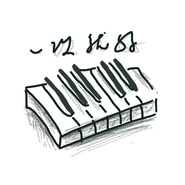

一次就好《夏洛特烦恼》插曲
============================

|  |  |
| :--: | :-- |
| [ 一次就好《夏洛特烦恼》插曲](https://emumo.xiami.com/album/2100244506) | **艺人**: [饭碗的彼岸](../index.md) **语种**: 国语 **唱片公司**: 独立发行 **发行时间**: 2015年10月23日 **专辑类别**: EP, 单曲 **专辑风格**: 国语流行 Mandarin Pop **播放数**: 698292 **收藏数**: 13 **评论数**: 2  |

## 简介

 《一次就好》钢琴版

## 曲目

## 评论

|  |  |  |  |
| :-- | :-- | :-- | :-- |
|  [虾米用户](https://emumo.xiami.com/u/325374787)  2020-01-01 14:26 赞(2) 踩(0) | 
好
 |
|  [虾米用户](https://emumo.xiami.com/u/16031588)  2018-09-09 22:37 赞(1) 踩(0) | 
  
 |
