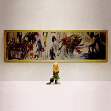
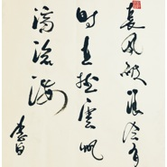

饭碗的彼岸
============================

|  |  |
| :--: | :-- |
| [ 饭碗的彼岸](https://i.xiami.com/fwdba) | **播放数**: 825789 **粉丝数**: 299 **评论数**: 21 **地区**: China 中国大陆 **风格**: 轻音乐 Easy Listening  |

## 档案

## 专辑

| 名称 | 语种 | 唱片公司 | 发行时间 | 专辑类别 | 专辑风格 |
| :--: | :-- | :-- | :-- | :-- | :-- |
| [ 山眠](./albums/5022371488.md) | 纯音乐 |  | 2020年08月25日 | EP, 单曲 |  |
| [ 城のある町にて](./albums/5022370332.md) | 纯音乐 |  | 2020年05月02日 | EP, 单曲 |  |
| [ 葡萄紫的清晨](./albums/5022382353.md) | 纯音乐 |  | 2020年05月01日 | EP, 单曲 |  |
| [ 冬莺](./albums/5022388829.md) | 纯音乐 |  | 2020年01月03日 | EP, 单曲 |  |
| [ 云隐](./albums/5022362455.md) | 纯音乐 |  | 2019年12月06日 | EP, 单曲 |  |
| [ 彼女の歩く姿の美しいさま （She walks in beauty）](./albums/5022387300.md) | 纯音乐 |  | 2019年08月11日 | EP, 单曲 |  |
| [ 似近而实远。繁星之间。](./albums/5022378687.md) | 纯音乐 |  | 2019年08月03日 | EP, 单曲 |  |
| [ 我们别时和见时不同](./albums/5020715705.md) | 纯音乐 |  | 2018年06月29日 | 录音室专辑 | 流行 Pop |
| [ Rainy Dumplings](./albums/5022549651.md) | 纯音乐 |  | 2018年06月09日 | EP, 单曲 |  |
| [ Trailish](./albums/2103690016.md) | 英语 | 独立发行 | 2018年02月06日 | EP, 单曲 |  |
| [ 配乐 & Demo](./albums/5022384743.md) | 纯音乐 |  | 2018年02月06日 | 录音室专辑 |  |
| [ 长逝的时流](./albums/2103690013.md) | 国语 | 独立发行 | 2017年11月24日 | EP, 单曲 |  |
| [ Ibuprofen](./albums/2103690015.md) | 英语 | 独立发行 | 2017年09月03日 | EP, 单曲 |  |
| [ 三途の川（さんずのかわ）](./albums/2103690029.md) | 国语 | 独立发行 | 2017年05月21日 | EP, 单曲 |  |
| [ 饭碗的彼岸](./albums/2103690032.md) | 国语 |  | 2017年03月10日 | EP, 单曲 |  |
| [ Moonlight Lake](./albums/2103690030.md) | 英语 |  | 2017年02月25日 | EP, 单曲 |  |
| [ Flowers of Harada](./albums/2103690031.md) | 英语 |  | 2017年02月10日 | EP, 单曲 |  |
| [ 结び](./albums/2103691749.md) | 国语 | 独立发行 | 2016年12月07日 | EP, 单曲 |  |
| [ Ib，我只是想和你跳舞](./albums/2103691745.md) | 国语 | 独立发行 | 2016年11月11日 | EP, 单曲 |  |
| [ 她的名字](./albums/2103691747.md) | 国语 | 独立发行 | 2016年10月31日 | EP, 单曲 |  |
| [ 当安静的公园披上了夜网, 东方的夜莺徒然向玫瑰花歌唱](./albums/2103691743.md) | 国语 | 独立发行 | 2016年10月17日 | EP, 单曲 |  |
| [ 秋 • 浸寻](./albums/2103691746.md) | 国语 | 独立发行 | 2016年09月15日 | EP, 单曲 |  |
| [ 鶯之緒](./albums/2103691744.md) | 国语 | 独立发行 | 2016年06月08日 | EP, 单曲 |  |
| [ LovingIng](./albums/5022387674.md) | 纯音乐 |  | 2016年05月12日 | EP, 单曲 |  |
| [ 小夏，多变的天气如妳](./albums/2103691731.md) | 国语 |  | 2016年04月21日 | EP, 单曲 |  |
| [ 我看到你的倒影在水中翩翩起舞](./albums/2103691739.md) | 国语 | 独立发行 | 2016年04月09日 | EP, 单曲 |  |
| [ 小樱](./albums/2103691735.md) | 国语 | 独立发行 | 2016年03月11日 | EP, 单曲 |  |
| [ 七月初一， 你去的地方将是秋日和黄昏](./albums/5022389904.md) | 纯音乐 |  | 2016年03月03日 | EP, 单曲 |  |
| [ Lover's illumination](./albums/2103691741.md) | 英语 | 独立发行 | 2016年02月12日 | EP, 单曲 |  |
| [ 破碎在冬日里的誓言](./albums/2103691740.md) | 国语 | 独立发行 | 2016年01月26日 | EP, 单曲 |  |
| [ Fluoxetine](./albums/2103745779.md) | 英语 | 独立发行 | 2016年01月20日 | EP, 单曲 |  |
| [ 阳光明媚的早晨我迟到了](./albums/2103691738.md) | 国语 | 独立发行 | 2016年01月05日 | EP, 单曲 |  |
| [ Countdown of the Heartbeat](./albums/2103691734.md) | 英语 | 独立发行 | 2015年12月18日 | EP, 单曲 |  |
| [ The last month of 2015lightbeat](./albums/2100244496.md) | 其他 | 独立发行 | 2015年12月04日 | EP, 单曲 | 爵士说唱 Jazz Rap |
| [ 旧作 • Demo2](./albums/5022379954.md) | 纯音乐 |  | 2015年11月12日 | 录音室专辑 |  |
| [ 旧作 • Demo1](./albums/5022377298.md) | 纯音乐 |  | 2015年11月11日 | 录音室专辑 |  |
| [ 与布偶的三手连弹](./albums/2103691733.md) | 国语 | 独立发行 | 2015年11月07日 | EP, 单曲 |  |
| [ 画框中的玛丽（重制版）](./albums/2103691732.md) | 国语 |  | 2015年10月28日 | EP, 单曲 |  |
| [ 画框中的梅阿丽](./albums/5022386118.md) | 纯音乐 |  | 2015年10月28日 | EP, 单曲 |  |
| [ 一次就好《夏洛特烦恼》插曲](./albums/2100244506.md) | 国语 | 独立发行 | 2015年10月23日 | EP, 单曲 | 国语流行 Mandarin Pop |
| [ Fragrance](./albums/5022406575.md) | 纯音乐 |  | 2015年09月19日 | EP, 单曲 |  |
| [ 懒虫的梦境](./albums/2100200608.md) | 其他 | 独立发行 | 2015年08月27日 | EP, 单曲 | 器乐独奏 Solo Instrumental |
| [ 像紫堇。像金色的麦野。生长出诗。](./albums/5022386873.md) | 纯音乐 |  | 2011年01月11日 | 录音室专辑 |  |

## 评论

|  |  |  |  |
| :-- | :-- | :-- | :-- |
|  [虾米用户](https://emumo.xiami.com/u/252997561) 再见，虾米 2020-07-30 08:47 赞(0) 踩(0) | 
想要《我曾这样寂寞生活》 
 |
|  [虾米用户](https://emumo.xiami.com/u/308780917) 这家伙很鸡贼什么也没留下... 2018-11-22 06:40 赞(0) 踩(0) | 
求风居住的街道！！！
 |
|  [虾米用户](https://emumo.xiami.com/u/4780612) 人生顺其自然 2018-04-03 21:06 赞(0) 踩(0) | 
赞
 |
| ⇒ |  [虾米用户](https://emumo.xiami.com/u/15830361)  2018-05-20 17:36 赞(0) 踩(0) | 
大佬好，我的作品基本上都在网易了
 |
| ⇒ |  [虾米用户](https://emumo.xiami.com/u/308780917) 这家伙很鸡贼什么也没留下... 2018-11-22 06:42 赞(0) 踩(0) | 
<q><b>饭碗的彼岸说：</b></q>
 |
|  [虾米用户](https://emumo.xiami.com/u/323783622)  2018-01-31 17:45 赞(0) 踩(0) | 
为啥没有长逝的河流
 |
|  [虾米用户](https://emumo.xiami.com/u/4975063)  2016-09-05 13:47 赞(0) 踩(0) | 
很不错，希望多多出作品。
 |
|  [虾米用户](https://emumo.xiami.com/u/52683150)  2016-09-04 09:28 赞(0) 踩(0) | 
很棒！超喜欢～希望有更多音乐能在虾米看到
 |
|  [虾米用户](https://emumo.xiami.com/u/7910525) 有音乐的世界不孤单 2016-06-08 18:58 赞(0) 踩(0) | 
炒鸡棒！
 |
|  [虾米用户](https://emumo.xiami.com/u/12194481) 敲击的不是音符,是心率;... 2016-05-04 22:51 赞(0) 踩(0) | 
网易那边你有好多曲子，这边怎么只有三张专辑啊
 |
| ⇒ |  [虾米用户](https://emumo.xiami.com/u/15830361)  2017-07-31 08:02 赞(0) 踩(0) | 
之前上传有问题，最近整理一下
 |
| ⇒ |  [虾米用户](https://emumo.xiami.com/u/15830361)  2018-05-20 17:36 赞(0) 踩(0) | 
嗯，和网易签了独家代理，所以是版权问题了
 |
|  [虾米用户](https://emumo.xiami.com/u/42361373) 感恩虾米，让我们相遇！请... 2016-02-12 16:52 赞(1) 踩(0) | 
饭碗！
 |
|  [虾米用户](https://emumo.xiami.com/u/2644274) 从虾米一路走来，留下了许... 2016-01-10 12:46 赞(0) 踩(0) | 
The last month of 2015 好听~~~~
 |
| ⇒ |  [虾米用户](https://emumo.xiami.com/u/15830361)  2016-01-18 09:55 赞(0) 踩(0) | 
谢谢~~~
 |
|  [虾米用户](https://emumo.xiami.com/u/15830361)  2015-09-15 18:49 赞(10) 踩(0) | 
我刚入驻了虾米音乐人，主创轻音乐、钢琴音乐。欢迎大家来我的个人主页，收听我的最新音乐
 |
| ⇒ |  [虾米用户](https://emumo.xiami.com/u/5520234) 淡泊宁静以致远 2016-01-18 21:18 赞(0) 踩(0) | 
我喜欢后摇，你的也不错
 |
| ⇒ |  [虾米用户](https://emumo.xiami.com/u/15830361)  2016-01-19 00:31 赞(0) 踩(0) | 
<q><b>秋之憬说：</b></q>
 |
| ⇒ |  [虾米用户](https://emumo.xiami.com/u/5520234) 淡泊宁静以致远 2016-08-07 22:23 赞(0) 踩(0) | 
<q><b>饭碗的彼岸说：</b></q>
 |
| ⇒ |  [虾米用户](https://emumo.xiami.com/u/88011894)  2017-05-01 17:24 赞(0) 踩(0) | 
不打算把歌放在这了吗？
 |
| ⇒ |  [虾米用户](https://emumo.xiami.com/u/15830361)  2017-07-31 08:02 赞(0) 踩(0) | 
<q><b>红丝冬瓜说：</b></q>
 |
