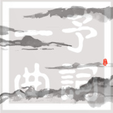

予词一曲原创 | 填词
============================

|  |  |
| :--: | :-- |
| [ 予词一曲原创 | 填词](https://emumo.xiami.com/album/2102756323) | **艺人**: [予词](../index.md) **语种**: 国语 **唱片公司**: 独立发行 **发行时间**: 2017年05月30日 **专辑类别**: 精选集 **专辑风格**: 古风 GuFeng Music, 国语流行 Mandarin Pop **播放数**: 4178215 **收藏数**: 303 **评论数**: 6  |

## 简介

 
 

清风早将山河都吹破。
 

予词一曲，邀君共赏。
 

CD1：原创作品
 

CD2：填词作品
 

词作内容：古风向，游戏向，情歌向，同人向。
 

谢谢大家喜欢~
 

 

## 曲目

## 评论

|  |  |  |
| :-- | :-- | :-- |
|  [虾米用户](https://emumo.xiami.com/u/278566348) 心随我动，我随心动 2020-05-31 20:08 赞(0) 踩(0) | 
快意！
 |
|  [虾米用户](https://emumo.xiami.com/u/377055248)  2020-02-11 14:10 赞(0) 踩(0) | 
❤️❤️❤️
 |
|  [虾米用户](https://emumo.xiami.com/u/33941879) 别再说自己是单身狗了，你... 2019-04-16 01:33 赞(1) 踩(0) | 
好听
 |
|  [虾米用户](https://emumo.xiami.com/u/322544321) hahaha 2017-08-31 13:57 赞(2) 踩(0) | 
好听 
 |
| ⇒ |  [虾米用户](https://emumo.xiami.com/u/320872243) Voilà! 2018-03-11 13:26 赞(0) 踩(0) | 
冲着你头像画着的笑容嫣然的小小白都要赞你
 |
|  [虾米用户](https://emumo.xiami.com/u/180962606)  你总是要很努力  2017-06-24 20:07 赞(1) 踩(0) | 
表白 
 |
