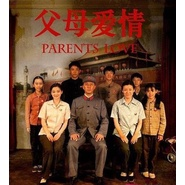

父母爱情影视原声带
============================

|  |  |
| :--: | :-- |
| [ 父母爱情影视原声带](https://emumo.xiami.com/album/2103729630) | **艺人**: [孟可](../index.md) **语种**: 国语 **唱片公司**: 青春繁花 **发行时间**: 2014年02月02日 **专辑类别**: 原声带, 影视音乐 **专辑风格**: 原声 Soundtrack, 电视原声 Television Music **播放数**: 331110 **收藏数**: 369 **评论数**: 16  |

## 简介

《父母爱情》是由<a href="https://baike.baidu.com/item/%E5%AD%94%E7%AC%99" style="color: rgb(19, 110, 194); text-decoration: none;" target="_blank">孔笙</a>执导、<a href="https://baike.baidu.com/item/%E5%88%98%E9%9D%99/10464173" style="color: rgb(19, 110, 194); text-decoration: none;" target="_blank">刘静</a>编剧，<a href="https://baike.baidu.com/item/%E9%83%AD%E6%B6%9B/5894" style="color: rgb(19, 110, 194); text-decoration: none;" target="_blank">郭涛</a>、<a href="https://baike.baidu.com/item/%E6%A2%85%E5%A9%B7/62868" style="color: rgb(19, 110, 194); text-decoration: none;" target="_blank">梅婷</a>、<a href="https://baike.baidu.com/item/%E5%88%98%E7%90%B3/7722712" style="color: rgb(19, 110, 194); text-decoration: none;" target="_blank">刘琳</a>、<a href="https://baike.baidu.com/item/%E4%BB%BB%E5%B8%85/10139" style="color: rgb(19, 110, 194); text-decoration: none;" target="_blank">任帅</a>等主演的家庭情感剧。 该剧主要讲述了海军军官江德福和资本家小姐安杰相识、相知、相爱、相守的50年爱情生活。 该剧于2014年2月2日在中央电视台综合频道首播。 《父母爱情》原声音乐，由著名音乐制作人孟可操刀制作。

## 曲目

## 评论

|  |  |  |  |
| :-- | :-- | :-- | :-- |
|  [虾米用户](https://emumo.xiami.com/u/406194981) 喜欢怀旧经典的曲子 2020-06-08 21:11 赞(1) 踩(0) | 
太美，剧情和音乐，多少年看多少遍都不腻的巅峰制作
 |
|  [虾米用户](https://emumo.xiami.com/u/30127330) 我还没想好要写什么... 2020-05-26 11:49 赞(0) 踩(0) | 
平静
 |
|  [虾米用户](https://emumo.xiami.com/u/18236235) 我还没想好要写什么... 2020-02-25 22:14 赞(1) 踩(0) | 
没有人可以拒绝父母爱情
 |
|  [虾米用户](https://emumo.xiami.com/u/4091035) 因为音乐所以无所不能 2020-02-07 10:49 赞(1) 踩(0) | 
看过了才觉得真是好
 |
|  [虾米用户](https://emumo.xiami.com/u/421697973) 做人逆势如饮酒，顺势却如... 2019-04-16 21:21 赞(2) 踩(0) | 
很棒的电视剧，音乐也很简约大气，打动人心。很喜欢！
 |
|  [虾米用户](https://emumo.xiami.com/u/85556854) 你是你，而我是我 2019-04-08 20:57 赞(2) 踩(0) | 
良心剧，配乐超好听
 |
|  [虾米用户](https://emumo.xiami.com/u/16008515) Do  a better... 2019-03-06 17:42 赞(2) 踩(0) | 
满满的感动     
 |
|  [虾米用户](https://emumo.xiami.com/u/335644222) 哈哈哈哈哈哈 2019-02-23 22:23 赞(2) 踩(0) | 
开头曲 在我大二下学期开学返校的时候我听了 脑海里全部都是关于我的妈妈回忆 手上还拎着她包的一大袋饺子还有卤牛肉
 |
|  [虾米用户](https://emumo.xiami.com/u/418523935) 我已经想了一半了呢 2019-02-22 20:11 赞(1) 踩(0) | 
太太太太太棒了，感动 ，没想到能找到
 |
|  [虾米用户](https://emumo.xiami.com/u/322465556) 我还没想好要写什么... 2018-12-12 18:07 赞(1) 踩(0) | 
很棒 ，感谢！
 |
|  [虾米用户](https://emumo.xiami.com/u/358377007) 虾米再见❤️❤️❤️ 2018-11-05 23:18 赞(5) 踩(0) | 
封面触动人心
 |
|  [虾米用户](https://emumo.xiami.com/u/380145455) “一如既往，万事顺意” 2018-10-12 22:51 赞(6) 踩(0) | 
找了很久，良心制作
 |
|  [虾米用户](https://emumo.xiami.com/u/339155029)  2018-08-24 10:38 赞(3) 踩(0) | 
终于找到《父母爱情》背景音乐了！感谢。
 |
|  [虾米用户](https://emumo.xiami.com/u/378209176)  2018-08-16 13:04 赞(1) 踩(0) | 
喜欢
 |
|  [虾米用户](https://emumo.xiami.com/u/53646041) …… 2018-07-21 13:11 赞(13) 踩(0) | 
这部戏的配乐编配非常简约，基本都是单一乐器（长笛，手风琴，口琴等）加弦乐伴奏，显得干净，单纯。旋律又舒缓，温柔，符合对爱情的回忆。旋律跟剧中流畅琐碎的故事非常贴合，展示了作曲家精准的理解力。这些音乐让电视剧的情感上升到了更好的层次。
 |
|  [虾米用户](https://emumo.xiami.com/u/37231598) yolo 2018-06-07 00:17 赞(2) 踩(0) | 
相似的起名风格，没错了，就是你 
 |
