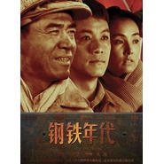

钢铁年代影视原声
============================

|  |  |
| :--: | :-- |
| [ 钢铁年代影视原声](https://emumo.xiami.com/album/2103869480) | **艺人**: [孟可](../index.md) **语种**: 国语 **唱片公司**: 青春繁花 **发行时间**: 2018年07月29日 **专辑类别**: 原声带, 影视音乐 **专辑风格**: 古典音乐 Classical **播放数**: 170627 **收藏数**: 90 **评论数**: 1  |

## 简介

《钢铁年代》是由<a href="https://baike.baidu.com/item/%E5%B1%B1%E4%B8%9C%E5%BD%B1%E8%A7%86%E9%9B%86%E5%9B%A2/3840028">山东影视集团</a>制作，<a href="https://baike.baidu.com/item/%E5%AD%94%E7%AC%99/6544803">孔笙</a>执导，<a href="https://baike.baidu.com/item/%E9%99%88%E5%AE%9D%E5%9B%BD/11569">陈宝国</a>、<a href="https://baike.baidu.com/item/%E5%86%AF%E8%BF%9C%E5%BE%81/9983867">冯远征</a>、<a href="https://baike.baidu.com/item/%E5%A7%9C%E5%AE%8F%E6%B3%A2/4550844">姜宏波</a>、<a href="https://baike.baidu.com/item/%E5%BC%A0%E8%AF%91/4637596">张译</a>、<a href="https://baike.baidu.com/item/%E8%B0%A2%E9%92%A2/993922">谢钢</a>联袂主演的年代大戏。该剧讲述了一群小人物扎根<a href="https://baike.baidu.com/item/%E9%9E%8D%E9%92%A2/2297942">鞍钢</a>，在各种不利的条件下顽强克服困难建设鞍钢的故事，还原了新中国成立初期<a href="https://baike.baidu.com/item/%E9%9E%8D%E9%92%A2/2297942">鞍钢</a>建设发展的历史。陈宝国扮演的尚铁龙和冯远征扮演的杨寿山是一对谁也离不开谁的“欢喜冤家”，从解放前一直斗争到解放后。该剧原声配乐由作曲家孟可创作。 

## 曲目

## 评论

|  |  |  |  |
| :-- | :-- | :-- | :-- |
|  [虾米用户](https://emumo.xiami.com/u/124111256)  2019-08-22 23:13 赞(0) 踩(0) | 
非常棒！
 |
