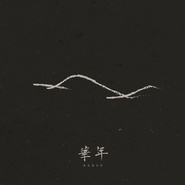

华年
============================

|  |  |
| :--: | :-- |
| [ 华年](https://emumo.xiami.com/album/2103806761) | **艺人**: [鹿先森乐队](../index.md) **语种**: 国语 **唱片公司**: 鹿先森工作室, StreetVoice **发行时间**: 2018年07月16日 **专辑类别**: 录音室专辑 **专辑风格**: 独立摇滚 Indie Rock, 独立流行 Indie Pop **播放数**: 5841452 **收藏数**: 1510 **评论数**: 75  |

## 简介

这三年来，我们都不约而同时常会想起2015年8月的那个夏天，晚风轻柔，啤酒管够，欢声笑语，醉饮高歌……那是鹿先森最初的模样。决定组建这个乐队的那一刻，所有人的眼睛里清澈，明亮。后来我们如愿做了第一张专辑，又因此遇到了你们，开始了一段高速奔跑又壮阔波澜的时光。如果非要给这些时光下个定义，我们愿称之为“绽放的日子”。华年，即绽放的日子，因为遇到鹿先森的彼此、遇到天南海北的你们而一起绽放的日子。  
  
曾经十几二十来岁那些忘不掉的时光，热烈，飘荡而充满渴望，每一刻都是光泽无比的华年。经年过往之后我们的肉体正在悄悄地老去，生活的枷锁却越来越多， 而那个仍然不安的灵魂将何处安放？我们一直试图寻找答案，渐渐地才发现原来答案就在每时每刻的生活里。生活汇聚成音符，音符承载情感，于是有了这张专辑。那些命运、渴望和热烈，青春、鲜血和真切，宛如昨日，也宛如此刻。悲欢仍旧交织，生活依然不易，所幸仍然有所坚定，有所较劲，愿意穷极一生让每一个当下都成为“绽放的日子”，继续努力。  
  
如果你跟鹿先森一样，历经万千悲喜仍笃定于当下，那么此时此刻，就是你我的华年。感受到了吗？迎面夏日晚风轻柔，期许相拥波澜壮阔。那是你的华年，鹿先森的华年，咱们的华年。

## 曲目

## 评论

|  |  |  |
| :-- | :-- | :-- |
|  [虾米用户](https://emumo.xiami.com/u/425077727) LOVEYOU…… 2020-03-17 17:45 赞(2) 踩(0) | 
♡♡
 |
|  [虾米用户](https://emumo.xiami.com/u/38168812) 他人即是地狱 2019-12-16 15:39 赞(1) 踩(0) | 
华年好听爆
 |
|  [虾米用户](https://emumo.xiami.com/u/357025622)  2019-12-11 00:49 赞(0) 踩(0) | 
由耳颤心
 |
|  [虾米用户](https://emumo.xiami.com/u/3453279) Love Music F... 2019-07-09 10:17 赞(0) 踩(0) | 
喜欢鹿先森，不需要认可
 |
|  [虾米用户](https://emumo.xiami.com/u/419713914)  2019-06-15 22:44 赞(0) 踩(0) | 
我喜欢山，也喜欢海。
 |
|  [虾米用户](https://emumo.xiami.com/u/301502525)  2019-06-05 22:01 赞(1) 踩(0) | 
给人的感觉很干净，很青春
 |
|  [虾米用户](https://emumo.xiami.com/u/404719341)  2019-06-05 14:56 赞(2) 踩(0) | 
华年这首歌真的棒
 |
|  [虾米用户](https://emumo.xiami.com/u/256672628)  2019-05-16 08:21 赞(0) 踩(0) | 
@）
 |
|  [虾米用户](https://emumo.xiami.com/u/303794619)  2019-05-11 23:43 赞(0) 踩(0) | 
一如既往地好听
 |
|  [虾米用户](https://emumo.xiami.com/u/421635798)  2019-05-10 21:14 赞(0) 踩(0) | 
I be
 |
|  [虾米用户](https://emumo.xiami.com/u/48369835)  2019-04-23 07:49 赞(1) 踩(0) | 
华年
 |
|  [虾米用户](https://emumo.xiami.com/u/53701186) 人海 如深海 终有了你让... 2019-04-14 10:21 赞(4) 踩(0) | 
鹿先森的摇滚热情、温暖而纯净，主唱声音舒服极了，华年首首都是精品，词曲都好，最近几个月只听鹿先森，期待新作品！加油！沈阳演唱会很嗨，谢谢你们，爱你们！
 |
|  [虾米用户](https://emumo.xiami.com/u/29892051)   2019-03-06 08:54 赞(1) 踩(0) | 
喜欢
 |
|  [虾米用户](https://emumo.xiami.com/u/5411520) 就爱虾米 2019-03-01 12:03 赞(0) 踩(0) | 
很好
 |
|  [虾米用户](https://emumo.xiami.com/u/332169524)  2019-02-26 00:28 赞(0) 踩(0) | 
神作
 |
|  [虾米用户](https://emumo.xiami.com/u/348531855)  2019-02-16 05:42 赞(1) 踩(0) | 
华年，年华随着时光的逝去，留下的是对梦想的坚持。
 |
|  [虾米用户](https://emumo.xiami.com/u/119821102)  2019-02-13 20:45 赞(0) 踩(0) | 
不错
 |
|  [虾米用户](https://emumo.xiami.com/u/16509404) 可是命运啊 渴望啊 和热... 2019-02-10 01:02 赞(0) 踩(0) | 
这张专辑里最喜欢的歌：你住在我心里的原因和华年。
 |
|  [虾米用户](https://emumo.xiami.com/u/607772) 在喧闹的城市中找个安静的... 2019-01-04 22:33 赞(1) 踩(0) | 
去年粉上的乐队。文学性很强 
 |
|  [虾米用户](https://emumo.xiami.com/u/245280261) 要能做到:不以物喜不以己... 2018-11-28 23:46 赞(0) 踩(0) | 
太棒了，这一张专辑都很不错
 |
|  [虾米用户](https://emumo.xiami.com/u/103542012)   2018-09-10 16:04 赞(2) 踩(0) | 
奈何当初，《春风十里》太过惊艳。。。
 |
|  [虾米用户](https://emumo.xiami.com/u/16509404) 可是命运啊 渴望啊 和热... 2018-09-05 21:00 赞(0) 踩(0) | 
前后两张专辑听了很多次，越发觉得主唱倍倍的唱功提升了好多好多，第一张专辑里，能听出主唱和乐手们的青涩，第二张专辑就变得游刃有余了，情感表达得更加丰富多元与厚实，这就是所谓的工多艺熟了。
 |
|  [虾米用户](https://emumo.xiami.com/u/124795000)   2018-08-24 13:31 赞(1) 踩(0) | 
天啦！我怎么这么久都没发现出了整张！
 |
|  [虾米用户](https://emumo.xiami.com/u/5738103)  2018-08-21 23:28 赞(0) 踩(0) | 
期待演唱会～
 |
|  [虾米用户](https://emumo.xiami.com/u/401419370)  2018-08-13 11:38 赞(2) 踩(0) | 
一首华年唱出最美的年华 
 |
|  [虾米用户](https://emumo.xiami.com/u/5629816)   2018-08-09 23:30 赞(0) 踩(0) | 
好
 |
|  [虾米用户](https://emumo.xiami.com/u/519455)  2018-08-05 11:49 赞(0) 踩(0) | 
喜欢，怎么不能整张专辑购买，非要一首一首买吗
 |
|  [虾米用户](https://emumo.xiami.com/u/10971538)  2018-08-03 06:44 赞(0) 踩(0) | 
11月长沙。。。有伴么
 |
|  [虾米用户](https://emumo.xiami.com/u/79804154)  2018-07-29 01:00 赞(1) 踩(0) | 
喜欢喜欢❤
 |
|  [虾米用户](https://emumo.xiami.com/u/16509404) 可是命运啊 渴望啊 和热... 2018-07-25 18:50 赞(2) 踩(0) | 
这张专辑曲风更多元了，各种乐器玩得更极致，编排上多了很多solo的地方，越来越像乐队了，在演出现场可以玩得更high。赞
 |
|  [虾米用户](https://emumo.xiami.com/u/241878874) 各种音乐配沙发，嘿嘿 2018-07-23 08:46 赞(0) 踩(0) | 
回忆杀
 |
|  [虾米用户](https://emumo.xiami.com/u/343256556)  2018-07-20 23:42 赞(2) 踩(0) | 
从听了春风十里，就粉上了。追下去希望出越来越多好听的歌～～～
 |
|  [虾米用户](https://emumo.xiami.com/u/11979517) xj 2018-07-20 19:41 赞(1) 踩(0) | 
可以 可以
 |
|  [虾米用户](https://emumo.xiami.com/u/127205922)  2018-07-20 12:20 赞(1) 踩(0) | 
去年入坑，越来越喜欢鹿先森，期待更多作品
 |
|  [虾米用户](https://emumo.xiami.com/u/35180958)  2018-07-20 07:32 赞(0) 踩(0) | 
你住在我心里的原因
 |
|  [虾米用户](https://emumo.xiami.com/u/16709135) 一个有光的小角落 2018-07-19 23:35 赞(0) 踩(0) | 
编曲各方面都太令人惊喜了，满分满分
 |
|  [虾米用户](https://emumo.xiami.com/u/339762388)  2018-07-19 13:24 赞(1) 踩(0) | 
棒棒哒，棒棒哒，好听 
 |
|  [虾米用户](https://emumo.xiami.com/u/6012902)  2018-07-19 11:34 赞(1) 踩(0) | 
终于等到了 
 |
|  [虾米用户](https://emumo.xiami.com/u/325438693) 我还没想好要写什么... 2018-07-18 18:10 赞(0) 踩(0) | 
什么时候能多出一些mv啊 想在KTV里唱 
 |
|  [虾米用户](https://emumo.xiami.com/u/7278009)  2018-07-18 14:22 赞(0) 踩(0) | 
假声ok
 |
|  [虾米用户](https://emumo.xiami.com/u/334696614) 不负初心^ω^ 2018-07-17 20:44 赞(0) 踩(0) | 
打卡
 |
|  [虾米用户](https://emumo.xiami.com/u/284238359)  2018-07-17 20:38 赞(0) 踩(0) | 
天啊是新专吗！昨天发的？？
 |
|  [虾米用户](https://emumo.xiami.com/u/260949025)  2018-07-17 11:39 赞(2) 踩(0) | 
鹿先森 
 |
|  [虾米用户](https://emumo.xiami.com/u/342515313) 哥不是高富帅，只是农二代... 2018-07-17 11:03 赞(1) 踩(0) | 
依然支持鹿先森
 |
|  [虾米用户](https://emumo.xiami.com/u/199432847) the dream pl... 2018-07-17 01:08 赞(1) 踩(0) | 
挺好听的呀
 |
|  [虾米用户](https://emumo.xiami.com/u/269812345)  2018-07-16 22:05 赞(2) 踩(0) | 
不错哦 
 |
|  [虾米用户](https://emumo.xiami.com/u/244477560)  2018-07-16 22:01 赞(0) 踩(0) | 
棒
 |
|  [虾米用户](https://emumo.xiami.com/u/306790873)  2018-07-16 21:09 赞(0) 踩(0) | 
一如以往的好。
 |
|  [虾米用户](https://emumo.xiami.com/u/43137226) 唯有好音乐不可辜负。 2018-07-16 20:07 赞(0) 踩(0) | 
赶紧下载 免得下架
 |
|  [虾米用户](https://emumo.xiami.com/u/6133489)   2018-07-16 18:08 赞(0) 踩(0) | 
敢于挑战假声 歌词进步超大 编曲更加多元 爆灯爆灯爆灯
 |
|  [虾米用户](https://emumo.xiami.com/u/290607263)    知行合一 2018-07-16 13:42 赞(2) 踩(0) | 
为什么是夏天，暖得我，汗也淌，泪也流
 |
|  [虾米用户](https://emumo.xiami.com/u/190918944) 如今最好没有来日方长 2018-07-16 13:23 赞(0) 踩(0) | 
❤️
 |
|  [虾米用户](https://emumo.xiami.com/u/124515996)  2018-07-16 13:14 赞(0) 踩(0) | 
嘻嘻嘻
 |
|  [虾米用户](https://emumo.xiami.com/u/35398542) 公众号：湾辟斯 2018-07-16 13:06 赞(0) 踩(0) | 
N
 |
|  [虾米用户](https://emumo.xiami.com/u/46485215) 我还没想好要写什么... 2018-07-16 12:17 赞(0) 踩(0) | 
每首歌都戳到骨子里 真他妈的疼啊
 |
| ⇒ |  [虾米用户](https://emumo.xiami.com/u/346873153)  2019-02-16 08:28 赞(0) 踩(0) | 
不疼哥哥
 |
|  [虾米用户](https://emumo.xiami.com/u/5679852) 爱就不要说抱歉 2018-07-16 12:15 赞(0) 踩(0) | 
盼望已久 
 |
|  [虾米用户](https://emumo.xiami.com/u/326585199)  2018-07-16 11:28 赞(0) 踩(0) | 
终于你来了！
 |
|  [虾米用户](https://emumo.xiami.com/u/341558817)  2018-07-16 11:12 赞(3) 踩(0) | 
这一整张专辑都太好听了
 |
|  [虾米用户](https://emumo.xiami.com/u/232205242)  2018-07-16 10:44 赞(0) 踩(0) | 
好听
 |
|  [虾米用户](https://emumo.xiami.com/u/232205242)  2018-07-16 10:44 赞(0) 踩(0) | 
四月份成都演唱会说的专辑 终于出了   
 |
|  [虾米用户](https://emumo.xiami.com/u/44006869)  2018-07-16 10:25 赞(0) 踩(0) | 
哇哦，出新专辑了！
 |
|  [虾米用户](https://emumo.xiami.com/u/39573267)  2018-07-16 10:07 赞(1) 踩(0) | 
是青春，是爱情，是人生，喜欢
 |
|  [虾米用户](https://emumo.xiami.com/u/32315688) save me 2018-07-16 09:46 赞(0) 踩(0) | 
来啦
 |
|  [虾米用户](https://emumo.xiami.com/u/44743196) 听虾米记得收藏～ 2018-07-16 09:41 赞(0) 踩(0) | 
前排
 |
|  [虾米用户](https://emumo.xiami.com/u/269907643) Bewater 2018-07-16 09:16 赞(2) 踩(0) | 
之间
 |
|  [虾米用户](https://emumo.xiami.com/u/306068721)   2018-07-16 09:05 赞(0) 踩(0) | 
属于自己的风格
 |
|  [虾米用户](https://emumo.xiami.com/u/250036918) @。 2018-07-16 09:00 赞(1) 踩(0) | 
太好听！！！！！！太有感觉！！！！！！
 |
|  [虾米用户](https://emumo.xiami.com/u/2421624) 最近都没怎么在听歌 2018-07-16 08:37 赞(0) 踩(0) | 
来了
 |
|  [虾米用户](https://emumo.xiami.com/u/222928213)   2018-07-16 08:23 赞(0) 踩(0) | 
棒棒棒！总算等到这一天～ 等待的日子不复存在，接下来又是新一轮的歌曲陪伴的日子&amp;hellip;&amp;hellip; 期待年底北京演唱会，期待下一张专辑 哈哈哈
 |
|  [虾米用户](https://emumo.xiami.com/u/11421497) dont act lik... 2018-07-16 08:18 赞(0) 踩(0) | 
好
 |
|  [虾米用户](https://emumo.xiami.com/u/334576991)  2018-07-16 08:14 赞(0) 踩(0) | 
听新歌啦
 |
|  [虾米用户](https://emumo.xiami.com/u/186773508) 南瓜马车的午夜，换上童话... 2018-07-16 08:07 赞(3) 踩(0) | 
鹿先森乐队---我的钟爱 
 |
|  [虾米用户](https://emumo.xiami.com/u/231674859)  2018-07-16 08:02 赞(0) 踩(0) | 
留名
 |
|  [虾米用户](https://emumo.xiami.com/u/16509404) 可是命运啊 渴望啊 和热... 2018-07-16 08:00 赞(1) 踩(0) | 
马上听一听，谢谢。
 |
