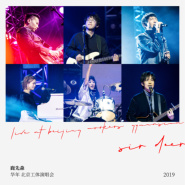

鹿先森乐队“华年”北京工体演唱会Live专辑
============================

|  |  |
| :--: | :-- |
| [ 鹿先森乐队“华年”北京工体演唱会Live专辑](https://emumo.xiami.com/album/2104937622) | **艺人**: [鹿先森乐队](../index.md) **语种**: 国语 **唱片公司**: StreetVoice, 鹿先森工作室 **发行时间**: 2019年06月16日 **专辑类别**: 现场专辑 **专辑风格**:  **播放数**: 1655699 **收藏数**: 203 **评论数**: 13  |

## 简介

这是鹿先森的第一张Live音乐专辑，包含迄今为止发行过的全部21首音乐作品，记录了鹿先森首个体育馆演唱会的温暖“华年”。  
  
专辑包含21首鹿先森作品，5支北京工体演唱会Live视频（《华年》、《风云日记》《TIME》《诗人的家》《他们满足了你所有的美梦》），以及包含Intro在内的3首纯音乐作品。所有购买此数字专辑的用户除了可以抢先试听所有Live歌曲之外，还可以抢先观看5支鹿先森北京工体演唱会Live视频。  
  
此外，鹿先森还对以下部分歌曲进行了局部改编。  
《你喜欢海却不喜欢山》《能随心情来听歌》改成了不插电版本，听感格外舒心欢愉；  
《晚安》独奏曲首次加入了演唱，相比之前“有词无唱”的版本多了一份惊喜；  
《失眠》《昨日》《TIME》与管弦乐团的合奏演绎让歌曲情绪张力十足，气势恢弘。  
《风云日记》的间奏除了有每个成员的惯常Solo之外，主唱倍倍也加入了鼓Solo环节，与鼓手PP同台飚鼓；  
《春风十里》的全场合唱部分，让人仿佛置身5000人的 工人体育馆，台上台下所有声音和情绪融为一体，回荡在空中。  
  
其他部分编曲与原版专辑并无明显差异，区别主要在于不同的混音听感。声响效果上，Live版会更加宽阔、宏大，在混音时尽可能地重现了现场的直达听感和空间感，让听者仿佛置身于演唱会现场。  
  
但更重要的是，这场演出对于鹿先森乐队而言，是一个里程碑式的目标。乐队成员以及整个团队对此进行了长达一年的辛勤准备，每个人都对此满怀热情与希望，不放过每一个可以改进的细节。因此我们即将听到的这张Live专辑，不单单是一个现场专辑，更是鹿先森在2018年的成长，是鹿先森对于站上工体的渴望，也是鹿先森在实现目标的进程中，心中那股巨大能量的释放。同时我们还可以听到，每一位台下的你们对鹿先森的支持。无论悲伤与欢笑，呐喊与流泪，我们都在一起感同身受。  
  
愿以这张Live纪念专辑，与你一起感受、铭记鹿先森北京工体演唱会温润如春般的温暖。

## 曲目

## 评论

|  |  |  |  |
| :-- | :-- | :-- | :-- |
|  [虾米用户](https://emumo.xiami.com/u/317346376)  2020-11-13 20:53 赞(0) 踩(0) | 
这就是青春的感觉
 |
|  [虾米用户](https://emumo.xiami.com/u/300914240)  2020-01-19 12:35 赞(0) 踩(0) | 
我爸也喜欢
 |
|  [虾米用户](https://emumo.xiami.com/u/348455810)  2019-07-31 13:06 赞(0) 踩(0) | 
好听
 |
|  [虾米用户](https://emumo.xiami.com/u/380395981)  2019-06-23 21:39 赞(0) 踩(0) | 
m买
 |
|  [虾米用户](https://emumo.xiami.com/u/146660900) 独一，无二 2019-06-22 23:00 赞(1) 踩(0) | 
呢喃细语，含情脉脉，亦或朗朗热歌，娟娟情歌，挡不住的终究是挡不住，进了耳朵就像深藏大脑里歌唱一样，是走心了。
 |
|  [虾米用户](https://emumo.xiami.com/u/16509404) 可是命运啊 渴望啊 和热... 2019-06-21 20:24 赞(2) 踩(0) | 
戴耳机完整地听完了整张专辑，的确比当时现场效果好很多，但是，乐队不能因为自己不是专职玩音乐的而放松对自己的要求，千万别做一支录音棚乐队，不能把现场唱成K歌。
 |
|  [虾米用户](https://emumo.xiami.com/u/326585199)  2019-06-21 07:55 赞(1) 踩(0) | 
不错
 |
|  [虾米用户](https://emumo.xiami.com/u/244786949)  2019-06-19 00:08 赞(0) 踩(0) | 
非常不错
 |
|  [虾米用户](https://emumo.xiami.com/u/1742396)  2019-06-18 12:52 赞(0) 踩(0) | 
听前奏就进入状态
 |
|  [虾米用户](https://emumo.xiami.com/u/322420283)  2019-06-17 00:14 赞(0) 踩(0) | 

 |
|  [虾米用户](https://emumo.xiami.com/u/48392255)  2019-06-16 14:21 赞(0) 踩(0) | 
一定要去演唱会
 |
|  [虾米用户](https://emumo.xiami.com/u/16509404) 可是命运啊 渴望啊 和热... 2019-06-16 11:58 赞(1) 踩(0) | 
赞。终于听到晚安的歌词版。
 |
|  [虾米用户](https://emumo.xiami.com/u/194650418) 我还没想好要写什么... 2019-06-16 10:26 赞(0) 踩(0) | 
听了好多年的鹿先森，感怀依旧
 |
