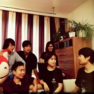
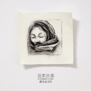

鹿先森乐队
============================

|  |  |
| :--: | :-- |
| [ 鹿先森乐队](https://i.xiami.com/lxsyd) | **播放数**: 92481927 **粉丝数**: 74727 **评论数**: 433 **地区**: China 中国大陆 **风格**: 独立流行 Indie Pop  |

## 档案

鹿先森乐队，中国内地民谣乐队，由主唱郭倍倍 (倍倍)、主音吉他手董斌 (董三角)、节奏吉他手杨松霖 (杨博士)、键盘手董荔冰 (冰冰)、鼓手田芳茗 (PP)、贝斯手李斯组成。 
“曲风清新，旋律自然，气质温和，态度坚定。鹿先森唱着生活的给予和索取，唱着点点滴滴的小情小爱，也试图表达着生活之上的大情与大爱。这支成立于2015年8月的乐队，只愿能随心情，唱出内心的声音。” 
小档案 
团名：鹿先森乐队 
国籍：中国 
团员组成：郭倍倍、董斌、杨松霖、董荔冰、田芳茗、李斯 
团员人数：6 
代表作：《春风十里》 
成团日期：2015年8月31日 
代表作品：《春风十里》、《所有的酒，都不如你》 
团队成员 
中文名: 郭倍倍 
别名: 倍倍 
乐队位置: 主唱 
中文名: 董斌 
别名: 董三角 
乐队位置: 主音吉他手 
中文名: 杨松霖 
别名: 杨博士 
乐队位置: 节奏吉他手 
中文名: 董荔冰 
别名: 冰冰 
乐队位置: 键盘手 
中文名: 田芳茗 
别名: PP 
乐队位置: 鼓手 
中文名: 李斯 
乐队位置: 贝斯手 
从艺历程 
鹿先森正式成军于2015年8月31日，同年10月发布了首支单曲《春风十里》，歌曲一上线便迅速俘获了全国各地文艺青年的芳心 
2016年2月21日，鹿先森乐队通过乐童音乐发布了首张原创专辑《所有的酒，都不如你》的众筹，原本预计众筹10万元资金，在历时近9个月的专辑众筹之后，在2016年11月7日获得了超过30万元的众筹支持 
2016年11月9日，鹿先森乐队发布了首张原创专辑《所有的酒，都不如你》，在历时近9个月的专辑众筹之后，终于如期兑现了他们的承诺。专辑一经发出便获得乐迷的广泛好评，各平台评论数量迅速增长 
2017年3月，举行“春风千里”全国巡演 ；8月31日，推出乐队单曲《给大家的歌》 ；10月6日，参加简单生活节 ；12月20日，推出乐队单曲《能随心情来听歌》 
2018年1月17日，其演唱的歌曲《春风十里》获得硬地围炉夜·2017原创盛典年度热评单曲奖 ；随后，举行“华年”全国巡演 ；3月5日，推出乐队单曲《华年》；11月14日，获得全球华语金曲奖年度民谣组合奖 
2019年5月，参加音乐综艺节目《乐队的夏天》 
荣誉记录 
音乐类奖项 
2018-11-14 全球华语金曲奖年度民谣组合奖 (获奖) 
2018-01-17 硬地围炉夜·2017原创盛典年度热评单曲奖 《春风十里》  (获奖)

## 专辑

| 名称 | 语种 | 唱片公司 | 发行时间 | 专辑类别 | 专辑风格 |
| :--: | :-- | :-- | :-- | :-- | :-- |
| [ 谁会听完这首歌](./albums/5021831966.md) | 国语 | StreetVoice, 天津微光文化传媒工作室 | 2020年11月05日 | EP, 单曲 | 国语流行 Mandarin Pop |
| [ 在心碎处](./albums/5021362445.md) | 国语 | StreetVoice, 微光文化 | 2020年08月31日 | 录音室专辑 | 国语流行 Mandarin Pop, 独立流行 Indie Pop |
| [ 温柔故事](./albums/2105250976.md) | 国语 | StreetVoice, 鹿先森工作室 | 2019年09月17日 | EP, 单曲 |  |
| [ 给鹿小姐的一封信luckin coffee小鹿茶推广曲](./albums/2104975171.md) | 国语 | StreetVoice, 鹿先森工作室 | 2019年07月08日 | EP, 单曲 |  |
| [ 鹿先森乐队“华年”北京工体演唱会Live专辑](./albums/2104937622.md) | 国语 | StreetVoice, 鹿先森工作室 | 2019年06月16日 | 现场专辑 |  |
| [ 我会怀念此刻的我们](./albums/2104909328.md) | 国语 | StreetVoice, 鹿先森工作室 | 2019年06月03日 | EP, 单曲 | 国语流行 Mandarin Pop |
| [ 华年](./albums/2103806761.md) | 国语 | 鹿先森工作室, StreetVoice | 2018年07月16日 | 录音室专辑 | 独立摇滚 Indie Rock, 独立流行 Indie Pop |
| [ 给大家的歌The song for everyone](./albums/2102822599.md) | 国语 | StreetVoice | 2017年08月31日 | EP, 单曲 | 独立摇滚 Indie Rock |
| [ 所有的酒，都不如你](./albums/2100229552.md) | 国语 | StreetVoice, 鹿先森工作室 | 2016年11月09日 | 录音室专辑 | 独立流行 Indie Pop, 独立民谣 Indie Folk |
| [ 你喜欢海却不喜欢山](./albums/2102403338.md) | 国语 | 独立发行 | 2016年09月21日 | EP, 单曲 | 独立流行 Indie Pop |

## 评论

|  |  |  |  |
| :-- | :-- | :-- | :-- |
|  [虾米用户](https://emumo.xiami.com/u/251567664) 愿你做自己的太阳，不需凭... 2021-01-01 15:18 赞(0) 踩(0) | 
小巷子ii
 |
|  [虾米用户](https://emumo.xiami.com/u/276944698) 不要自我设限..... 2020-09-03 13:00 赞(0) 踩(0) | 
☑️☑️☑️
 |
|  [虾米用户](https://emumo.xiami.com/u/443094630) 虾米，再见 2020-08-31 15:02 赞(0) 踩(0) | 
怎么都清空啦
 |
|  [虾米用户](https://emumo.xiami.com/u/375651506)  2020-08-28 14:23 赞(0) 踩(0) | 
：）
 |
|  [虾米用户](https://emumo.xiami.com/u/2890944) 疯狂生长的时节 2020-08-27 10:34 赞(0) 踩(0) | 
&amp;amp;quot;你美的能从千里外，取我双眼&amp;amp;quot;  哈哈哈哈哈哈哈哈哈哈哈哈哈
 |
|  [虾米用户](https://emumo.xiami.com/u/351907624)  2020-07-19 18:13 赞(0) 踩(0) | 
地址581这是63339线8名ye
 |
|  [虾米用户](https://emumo.xiami.com/u/421578063) fox god 2020-05-17 07:56 赞(0) 踩(0) | 
(๑＞ڡ＜)☆
 |
|  [虾米用户](https://emumo.xiami.com/u/148457570) 天天动听 ！虾米加油。 2020-03-20 12:31 赞(0) 踩(0) | 
反正 生活不易嘛！
 |
|  [虾米用户](https://emumo.xiami.com/u/432352889) 人类终将归于太空 2020-03-16 11:31 赞(2) 踩(0) | 
不敢和他表白 就来听听他喜欢的乐队
 |
|  [虾米用户](https://emumo.xiami.com/u/10574944) - 2020-02-11 01:14 赞(0) 踩(0) | 
-
 |
|  [虾米用户](https://emumo.xiami.com/u/299397076)   2019-12-13 06:45 赞(1) 踩(0) | 
我最喜欢的乐队
 |
|  [虾米用户](https://emumo.xiami.com/u/280869900) 我还没想好要写什么... 2019-11-28 08:58 赞(2) 踩(0) | 
很喜欢听，也经常分享到朋友圈。 
 |
|  [虾米用户](https://emumo.xiami.com/u/430595579) 听虾米是个美好的事 2019-11-20 11:36 赞(2) 踩(0) | 
  西安等你！欢度良宵。
 |
|  [虾米用户](https://emumo.xiami.com/u/13337996) 听 2019-11-18 20:58 赞(1) 踩(0) | 
恭喜啊鹿头要加强了～（？
 |
|  [虾米用户](https://emumo.xiami.com/u/258014942)  2019-11-06 16:04 赞(2) 踩(0) | 
第一次听，好好听，喜欢，加油！！
 |
|  [虾米用户](https://emumo.xiami.com/u/428235557)  2019-08-31 13:16 赞(2) 踩(0) | 
，
 |
|  [虾米用户](https://emumo.xiami.com/u/289097860) wow 2019-08-03 18:35 赞(3) 踩(0) | 
为什么不叫鹿先生，而是鹿先森。很别扭
 |
|  [虾米用户](https://emumo.xiami.com/u/140924984)  2019-08-01 13:51 赞(2) 踩(0) | 
配乐太好，其他跟不上，不是一个水平
 |
|  [虾米用户](https://emumo.xiami.com/u/25811662)  2019-07-22 19:49 赞(2) 踩(0) | 
好听
 |
|  [虾米用户](https://emumo.xiami.com/u/10994142) 睡前梦游故事 2019-07-15 15:02 赞(10) 踩(0) | 
我觉得来踩的人就没必要了…甚至有点低俗。说得好像你自己能做出来多么好听的音乐一样。萝卜青菜各有所爱，你不喜欢不代表别人不喜欢，技术有多好不走心还是泛泛之辈。只要它某一个时刻戳中你的点，就够了，何必争个高低之分，真的没必要！
 |
|  [虾米用户](https://emumo.xiami.com/u/53737210) 哼哼哼 2019-07-15 11:15 赞(3) 踩(0) | 
海澜之家代言人
 |
|  [虾米用户](https://emumo.xiami.com/u/350003253) brlu brlu. 2019-07-14 22:22 赞(1) 踩(0) | 
送票我都不去看。。。
 |
|  [虾米用户](https://emumo.xiami.com/u/350003253) brlu brlu. 2019-07-14 22:15 赞(3) 踩(0) | 
就一流行民谣乐队 
 |
|  [虾米用户](https://emumo.xiami.com/u/425499564)  2019-07-10 20:49 赞(2) 踩(0) | 
好棒
 |
|  [虾米用户](https://emumo.xiami.com/u/16509404) 可是命运啊 渴望啊 和热... 2019-07-08 22:50 赞(1) 踩(0) | 
感觉最近发新歌速度太快了些，还是需要更多地精雕细琢啊。
 |
|  [虾米用户](https://emumo.xiami.com/u/3584216) 书包里装满了蛋糕和汽水，... 2019-06-25 21:35 赞(1) 踩(0) | 
江郎才尽
 |
|  [虾米用户](https://emumo.xiami.com/u/53737210) 哼哼哼 2019-06-21 16:43 赞(4) 踩(0) | 
音乐无病呻吟，主唱的脸看着就孬心。。。
 |
|  [虾米用户](https://emumo.xiami.com/u/54378052) 就当我在外地旅游 2019-06-15 22:22 赞(3) 踩(0) | 
想吐槽的心情无法平复
 |
|  [虾米用户](https://emumo.xiami.com/u/54378052) 就当我在外地旅游 2019-06-15 21:49 赞(15) 踩(0) | 
真是 。。。无法描述。。张亚东 太客气了
 |
|  [虾米用户](https://emumo.xiami.com/u/3597272)  2019-06-11 23:46 赞(5) 踩(0) | 
&amp;ldquo;音乐&amp;rdquo;，一定要专业成啥样才叫&amp;ldquo;音乐&amp;rdquo;？一边口生生说着音乐是平等的，一边又玩鄙视链。难道摇滚就必须天生高贵？
 |
|  [虾米用户](https://emumo.xiami.com/u/2247512) 我还没想好要写什么... 2019-06-06 15:51 赞(4) 踩(0) | 
这个乐队有背于音乐的初衷，专业水平不高也就算了，自我封闭和成员间的不协调是大问题，更严重的是乐团基因上的致命伤，那就是音乐本身不是第一位。
 |
|  [虾米用户](https://emumo.xiami.com/u/334281164)  2019-06-04 11:39 赞(1) 踩(0) | 
春风十里咋就不如你了？
 |
|  [虾米用户](https://emumo.xiami.com/u/6312441) 电音中毒无药可救 2019-06-04 10:25 赞(1) 踩(0) | 
春风十里，不如睡你
 |
|  [虾米用户](https://emumo.xiami.com/u/52490613)  2019-06-03 08:08 赞(52) 踩(0) | 
我觉得凤凰传奇比这洋气
 |
| ⇒ |  [虾米用户](https://emumo.xiami.com/u/14383749) 我还没想好要写什么... 2020-11-15 10:49 赞(0) 踩(0) | 
啊这
 |
|  [虾米用户](https://emumo.xiami.com/u/6531780) 想要变成你 2019-06-01 23:50 赞(31) 踩(0) | 
樂隊的夏天裡那段口白太尬了...
 |
|  [虾米用户](https://emumo.xiami.com/u/424086216)  2019-05-22 09:00 赞(3) 踩(0) | 
现场听过两次你们唱歌了，感觉你们好有亲和力好温暖，而且那两次音乐节是跟我当时的男朋友，现在的老公小辉辉一起去的呢，也是很好的爱情纪念了。
 |
|  [虾米用户](https://emumo.xiami.com/u/200794012) 无 2019-05-03 15:49 赞(2) 踩(0) | 
期待新歌ing(๑˙ー˙๑)
 |
|  [虾米用户](https://emumo.xiami.com/u/416812891) KEEP COOL # 2019-04-26 13:33 赞(4) 踩(0) | 
期待你们有更好的创作。春风十里这首歌很好听。
 |
|  [虾米用户](https://emumo.xiami.com/u/421947445)  2019-03-30 00:51 赞(1) 踩(0) | 
春风十里，不如听你
 |
|  [虾米用户](https://emumo.xiami.com/u/328537239)  2019-03-26 12:33 赞(1) 踩(0) | 
加油
 |
|  [虾米用户](https://emumo.xiami.com/u/317961598)  2019-03-17 18:50 赞(2) 踩(0) | 
加油，好听
 |
|  [虾米用户](https://emumo.xiami.com/u/195011211)  2019-03-12 23:07 赞(4) 踩(0) | 
听一首新歌时，喜欢先看歌词再听旋律对我来说，歌词才是歌曲的灵魂即使同样的歌词用不同的旋律演绎出来会有不同的感觉，但是它的情感的不会变的很高兴有这么一个乐队能够写出戳中我内心的歌词每天一边听着鹿先森的歌一边想着我的过去她们的过去幻想着未来虽然平淡无常却是每天对我来说最放松的时候
 |
|  [虾米用户](https://emumo.xiami.com/u/25618280)  2019-02-28 20:32 赞(2) 踩(0) | 
真的真的好，之前没有留意过，好乐队啊！春风十里，单曲循环中。
 |
|  [虾米用户](https://emumo.xiami.com/u/35010982) 我还没想好要写什么... 2019-02-24 08:14 赞(2) 踩(0) | 
春风十里，好听好听。加油！！
 |
|  [虾米用户](https://emumo.xiami.com/u/324049362) 午后的月光 2019-02-19 12:24 赞(2) 踩(0) | 
不管是什么样的境遇，听到舒服的曲调，什么烦恼都抛掉。晚安，早安，温暖的世界
 |
|  [虾米用户](https://emumo.xiami.com/u/101636444) ❤️一只喜欢闵玧其的疯姑... 2019-02-10 11:31 赞(2) 踩(0) | 
2.10 《能随心情来听歌》❤️
 |
|  [虾米用户](https://emumo.xiami.com/u/203037494) Do you reall... 2019-01-16 01:01 赞(3) 踩(0) | 
最开始喜欢的是春风十里，后来是失眠，再后来是年华，现在的现在最喜欢很久以前！
 |
|  [虾米用户](https://emumo.xiami.com/u/29720968)  2019-01-07 21:26 赞(3) 踩(0) | 
偶然听昨日，才认识了这个乐队，歌词真得很棒 
 |
|  [虾米用户](https://emumo.xiami.com/u/16509404) 可是命运啊 渴望啊 和热... 2019-01-05 22:57 赞(5) 踩(0) | 
前面废话写了那么多，其实还有两句话必须说出来。一是，乐队在18年实在太忙了吧？看了下演出表，时间安排得很紧张，很担心因为音乐演出占用你们太多的时间而影响到工作，最终导致能放在音乐上的时间越来越少，希望19年的演出少一点，留给乐队成员更多的私人时间，细水长流，未来的十年二十年三十年都能听到你们的歌，看到你们的演出。二是主唱的现场唱功还得继续加油加油，咱们不是职业乐队，只要唱得在调上，不错漏歌词足矣。
 |
|  [虾米用户](https://emumo.xiami.com/u/16509404) 可是命运啊 渴望啊 和热... 2019-01-05 22:57 赞(5) 踩(0) | 
也许，这就是鹿先森乐队住在我心里的原因吧，喜欢他们歌里那种积极向上的一面，有时会伤感，但不会消沉，不会哀怨。喜欢总会深情凝视前方的主唱，心疼他在尬聊后低头收起笑容，等待前奏响起前那一刻露出的落寞；喜欢给每一个镜头都露出甜美微笑的键盘手；喜欢弹奏时一脸严肃状若政委老干部的主音吉他手；喜欢含着拨片低头沉浸在美妙旋律中的电音吉他手；喜欢虽然总被“黑”却保持腼腆笑容的贝斯手；喜欢前个瞬间还在打鼓然而下一刻立马帅气地按住镲片的鼓手。
 |
|  [虾米用户](https://emumo.xiami.com/u/16509404) 可是命运啊 渴望啊 和热... 2019-01-05 22:56 赞(7) 踩(0) | 
前后两张专辑听了很多次，越发觉得主唱倍倍的唱功提升了好多好多，第一张专辑里，能听出主唱和乐手们的各方面青涩，第二张专辑就变得游刃有余了，情感表达得更加丰富多元与厚实，这就是所谓的工多艺熟了。第一张专辑的整体性很高，曲风比较统一，也可以说比较单调，但其实我也喜欢这种统一性。而第二张专辑，曲风更多元，各种乐器玩得更极致，编排上多了很多solo的地方，越来越像乐队了，在演出现场可以玩得更high。制作水平如若能再提升，唱片的质量将更高。
 |
|  [虾米用户](https://emumo.xiami.com/u/16509404) 可是命运啊 渴望啊 和热... 2019-01-05 22:56 赞(4) 踩(0) | 
某一晚，忘记了是心血来潮还是怎么的，突然就看着歌词听着这歌。这一看就无可救药般爱上这歌。歌词写得真他妈的棒！原来这乐队就是网络上流行的✕✕先森的来历啊！原来那句“所有的酒，都不如你”就是出自这歌啊！这句话，没有喝过酒的人不懂，没有喝醉过的人也不懂，宿醉过的人能懂，忍着头痛欲裂的宿醉继续喝酒的人最懂。多次的宿醉，让我对这歌产生了莫名的熟悉感和亲切感，进而喜欢了这个乐队，喜欢了他们的每一首歌。很遗憾地错过了他们第一张专辑的众筹，但庆幸赶上了第二张。
 |
|  [虾米用户](https://emumo.xiami.com/u/16509404) 可是命运啊 渴望啊 和热... 2019-01-05 22:56 赞(6) 踩(0) | 
之前也想到过这个，怎么就这样喜欢上了一支乐队的歌。在这发生之前的一个大前提是，不知道怎么的，年初时我一下子意识到，播放器的歌单里的歌，基本上都是十年前的老歌，新歌听得极少，放进播放列表里的更是没有，同时，发生了一系列事情，让我觉得不能再一成不变下去。于是，穷B只能来虾米音乐，用赠送的穷逼VIP听歌。然而，还是听着手机里的存歌，并没有在线听歌的习惯。然后，某些晚上，状态很丧，情绪很糟糕，于是试听虾米音乐推荐的歌。所以听到了《春风十里》。但当时，其实也就是六月底时，对这歌并没有什么特别深刻的印象，更谈不上一下子就喜欢上了这歌。但在不停的推荐中，以及对这歌的一点点喜欢，还是把这歌放进了播放列表。
 |
|  [虾米用户](https://emumo.xiami.com/u/91570) Destiny 2019-01-05 22:56 赞(4) 踩(0) | 
今晚工体演出好棒！
 |
|  [虾米用户](https://emumo.xiami.com/u/116808764) 你要自己做自己的决定哦 2018-12-24 23:33 赞(2) 踩(0) | 
很好听
 |
|  [虾米用户](https://emumo.xiami.com/u/6111314) 夜间飞行 2018-12-24 20:53 赞(2) 踩(0) | 
今晚www懂的人都懂
 |
|  [虾米用户](https://emumo.xiami.com/u/375156028)  2018-11-23 17:34 赞(3) 踩(0) | 
为什么下载都需要VIP呢？
 |
|  [虾米用户](https://emumo.xiami.com/u/303506160) 因为我对你爱的深沉 2018-11-15 00:40 赞(2) 踩(0) | 
嘿呦
 |
|  [虾米用户](https://emumo.xiami.com/u/11217074) 因為音樂接近上帝，所以我... 2018-11-14 08:30 赞(3) 踩(0) | 
在石家庄见到了你们，喜欢听你们说话的声音，很温暖。
 |
|  [虾米用户](https://emumo.xiami.com/u/308317427) 我还没想好要写什么... 2018-11-12 22:58 赞(2) 踩(0) | 
你好，鹿先生，谢谢你的音乐给我力量
 |
|  [虾米用户](https://emumo.xiami.com/u/375327272) 原谅我这一生不羁放纵爱自... 2018-11-07 21:58 赞(3) 踩(0) | 
我去，要不要人活了，歌好，学历还高
 |
|  [虾米用户](https://emumo.xiami.com/u/32705062)  2018-09-27 19:02 赞(2) 踩(0) | 
这个乐队不错哦，文艺青年
 |
|  [虾米用户](https://emumo.xiami.com/u/375402687) 快乐 2018-09-24 16:23 赞(2) 踩(0) | 
我才发现有新专！！！啊啊啊
 |
|  [虾米用户](https://emumo.xiami.com/u/401730591)  2018-09-21 18:23 赞(2) 踩(0) | 
走心得词，多情的音乐。
 |
|  [虾米用户](https://emumo.xiami.com/u/404155984)  2018-09-15 13:42 赞(2) 踩(0) | 
喜欢就收藏了
 |
|  [虾米用户](https://emumo.xiami.com/u/35062303) 一个喜欢唱歌的小女孩 2018-08-12 15:21 赞(2) 踩(0) | 
好棒 赞赞赞！
 |
|  [虾米用户](https://emumo.xiami.com/u/193251970) 任他们多漂亮 未及你矜贵 2018-07-30 12:33 赞(2) 踩(0) | 
都很好听啊 很幸运能听见这么用心的歌曲
 |
|  [虾米用户](https://emumo.xiami.com/u/260370692)  2018-07-27 18:20 赞(3) 踩(0) | 
好歌
 |
|  [虾米用户](https://emumo.xiami.com/u/16509404) 可是命运啊 渴望啊 和热... 2018-07-15 22:28 赞(3) 踩(0) | 
期待明早八点发布的第二张专辑。
 |
|  [虾米用户](https://emumo.xiami.com/u/346611492)  2018-07-11 09:56 赞(2) 踩(0) | 
新宠
 |
|  [虾米用户](https://emumo.xiami.com/u/8070377) 爱雾瑞性维欧腐漏 2018-07-04 18:27 赞(4) 踩(0) | 
*
 |
|  [虾米用户](https://emumo.xiami.com/u/221183589)   2018-07-03 14:06 赞(2) 踩(0) | 
《he》什么时候发布呀？上回演唱会的时候就被种草了 
 |
|  [虾米用户](https://emumo.xiami.com/u/329987571)  2018-06-27 09:06 赞(2) 踩(0) | 
:
 |
|  [虾米用户](https://emumo.xiami.com/u/334712893)  2018-06-10 23:01 赞(6) 踩(0) | 
期待出新歌，喜欢这样的民谣，不矫情不做作。
 |
|  [虾米用户](https://emumo.xiami.com/u/245580741)  2018-06-01 20:30 赞(2) 踩(0) | 
谢谢你们的歌，一直在问自己为什么没有早点发现你们    
 |
|  [虾米用户](https://emumo.xiami.com/u/85936436)   2018-05-28 17:24 赞(1) 踩(0) | 
好听的乐队
 |
|  [虾米用户](https://emumo.xiami.com/u/269871110) 我还没想好要写什么... 2018-05-27 00:47 赞(2) 踩(0) | 
橘州音乐节来的打卡，你们真的太棒了，很温暖，喜欢 
 |
|  [虾米用户](https://emumo.xiami.com/u/359180842)  2018-05-12 23:56 赞(2) 踩(0) | 
习惯了看评论 不说话 是不是已经暴露了我的孤单 
 |
|  [虾米用户](https://emumo.xiami.com/u/352626776)  2018-05-06 16:23 赞(2) 踩(0) | 
好听  
 |
|  [虾米用户](https://emumo.xiami.com/u/308652751) 嗜乐如命之自由灵魂 2018-05-06 00:08 赞(3) 踩(0) | 
&amp;zwj;♂️
 |
|  [虾米用户](https://emumo.xiami.com/u/244990099) 虾米改变我的心情，指导我... 2018-05-04 07:59 赞(1) 踩(0) | 
加油！你们是最棒哒
 |
|  [虾米用户](https://emumo.xiami.com/u/293692544) 你敢给我说话吗？我咬你 2018-05-03 18:01 赞(3) 踩(0) | 
好听
 |
|  [虾米用户](https://emumo.xiami.com/u/293692544) 你敢给我说话吗？我咬你 2018-04-28 05:26 赞(2) 踩(0) | 
好听
 |
|  [虾米用户](https://emumo.xiami.com/u/332910447) 哦哈哈哈 2018-04-25 21:56 赞(2) 踩(0) | 
超级好听！
 |
|  [虾米用户](https://emumo.xiami.com/u/54621300)  2018-04-08 02:18 赞(2) 踩(0) | 
好听十二分
 |
|  [虾米用户](https://emumo.xiami.com/u/52301801)  2018-04-08 00:50 赞(2) 踩(0) | 
来上海开演唱会哦
 |
|  [虾米用户](https://emumo.xiami.com/u/169241982)  2018-03-29 18:50 赞(2) 踩(0) | 
你们的歌我听了好几首，都挺好啊
 |
|  [虾米用户](https://emumo.xiami.com/u/336705613)   2018-03-09 01:02 赞(3) 踩(0) | 
好听到爆炸
 |
|  [虾米用户](https://emumo.xiami.com/u/10530548) 我喜歡隨性的音樂 2018-03-02 13:40 赞(23) 踩(0) | 
在與妻子談離婚的時候, 反覆地聽著春風十里, 甚至拿起了十幾年沒有彈的吉他, 睡不著的夜裡,一遍又一遍的彈著唱著, 把前奏、間奏都彈熟了,年過了婚還是離了, 正如鹿先森在廣州演唱會最後說的, 所有的難關、所有的不快樂都會過去; 感謝這首歌好難過好難過,卻有溫暖無比的歌, 陪我度過了難過的日子
 |
|  [虾米用户](https://emumo.xiami.com/u/320747647) 虾米音乐变安静了 2018-02-28 12:38 赞(39) 踩(0) | 
大爱鹿先森乐队！同意的请点赞
 |
|  [虾米用户](https://emumo.xiami.com/u/344482489)  2018-02-27 16:00 赞(1) 踩(0) | 
心甘情愿买来听 
 |
|  [虾米用户](https://emumo.xiami.com/u/352393548)  2018-02-26 14:42 赞(1) 踩(0) | 
勒贝
 |
|  [虾米用户](https://emumo.xiami.com/u/184614748) 12年不容易 2018-02-22 20:58 赞(1) 踩(0) | 
加油，鹿先森乐队！！失落的时候一直循环春风十里
 |
|  [虾米用户](https://emumo.xiami.com/u/347257243)  2018-02-15 13:20 赞(1) 踩(0) | 
         
 |
|  [虾米用户](https://emumo.xiami.com/u/347257243)  2018-02-15 13:19 赞(1) 踩(0) | 
 
 |
|  [虾米用户](https://emumo.xiami.com/u/347257243)  2018-02-15 13:18 赞(1) 踩(0) | 
大家好
 |
|  [虾米用户](https://emumo.xiami.com/u/348462883) 听我所听 2018-02-12 23:47 赞(2) 踩(0) | 
歌词真的写的很棒，从以前的众筹到现在的城市巡演，一路走来很不容易，挺你 
 |
|  [虾米用户](https://emumo.xiami.com/u/300625188)  2018-02-04 15:53 赞(2) 踩(0) | 
特别喜欢歌词
 |
|  [虾米用户](https://emumo.xiami.com/u/53734018) 小虾最近不太懂我 2018-02-04 00:22 赞(2) 踩(0) | 
昨日、之间啥时候发行啊 
 |
|  [虾米用户](https://emumo.xiami.com/u/39916415) 实在不行了 2018-01-09 22:18 赞(3) 踩(0) | 
歌比很多同类型乐队做得更有味道 更耐听，只是有点奇怪，标签为什么是 &amp;lsquo;indie rock&amp;rsquo;
 |
|  [虾米用户](https://emumo.xiami.com/u/37643793)   2017-12-28 09:16 赞(2) 踩(0) | 
吉他手简直不能再棒！
 |
|  [虾米用户](https://emumo.xiami.com/u/303506160) 因为我对你爱的深沉 2017-12-26 00:10 赞(1) 踩(0) | 
嘿呦
 |
|  [虾米用户](https://emumo.xiami.com/u/205195597) 大家好，我是疯子 2017-12-23 11:09 赞(3) 踩(0) | 
鹿先森的音乐能触动心弦
 |
|  [虾米用户](https://emumo.xiami.com/u/311031868) 我说所有的酒，都不如你 2017-12-22 22:58 赞(1) 踩(0) | 
大爱鹿先森
 |
|  [虾米用户](https://emumo.xiami.com/u/43156603) 请叫我何小河 2017-12-21 22:20 赞(1) 踩(0) | 

 |
|  [虾米用户](https://emumo.xiami.com/u/9306795)  2017-12-21 11:05 赞(1) 踩(0) | 
斯斯又弹起贝斯啦
 |
|  [虾米用户](https://emumo.xiami.com/u/323943629) 我还没想好要写什么... 2017-12-20 08:09 赞(2) 踩(0) | 
一群认真做音乐，还做得非常好的乐队，有你们，真好！
 |
|  [虾米用户](https://emumo.xiami.com/u/52668461)  2017-12-18 13:59 赞(2) 踩(0) | 
《春风十里》太有感觉了
 |
|  [虾米用户](https://emumo.xiami.com/u/78362496)  2017-12-16 12:56 赞(35) 踩(0) | 
此刻，距离2018考研还有7天。和小伙伴去吃最后一顿聚餐，出租车上听着音乐响起，心里泛起不知如何形容的涟漪，那就像这一年的时光像路两旁的风景飞速向后我向前，就像这一年的努力可能收货果实可能付诸东流，可能&amp;hellip;&amp;hellip;不管怎样，谢谢你的音乐给我的感动，祝你写出越来越好的歌，陪我们更久，祝福我和小伙伴们都能实现我们的目标，做不一样的人。 
 |
| ⇒ |  [虾米用户](https://emumo.xiami.com/u/55396963)  2017-12-21 12:57 赞(0) 踩(0) | 
因研究生考试占教室获得额外假期的高考生祝你和你的小伙伴考研顺利！！ 
 |
| ⇒ |  [虾米用户](https://emumo.xiami.com/u/194814150)  2017-12-22 13:01 赞(0) 踩(0) | 
考研加油
 |
| ⇒ |  [虾米用户](https://emumo.xiami.com/u/191789750)  2017-12-27 08:25 赞(0) 踩(0) | 
加油
 |
| ⇒ |  [虾米用户](https://emumo.xiami.com/u/331800818) 挥挥手就当万语千言，可这... 2017-12-27 16:53 赞(0) 踩(0) | 
感觉发挥的怎么样？
 |
| ⇒ |  [虾米用户](https://emumo.xiami.com/u/215469764)  2018-03-03 22:19 赞(0) 踩(0) | 
怎么样
 |
|  [虾米用户](https://emumo.xiami.com/u/254266724) 别人也不错，但我只一个。 2017-12-15 22:19 赞(1) 踩(0) | 
好听喜欢
 |
|  [虾米用户](https://emumo.xiami.com/u/112426200)  2017-11-27 09:58 赞(5) 踩(0) | 
春风十里是我有生以来第一次花钱买的歌
 |
| ⇒ |  [虾米用户](https://emumo.xiami.com/u/335945121)  2018-02-27 15:41 赞(0) 踩(0) | 
我也是
 |
|  [虾米用户](https://emumo.xiami.com/u/326382736)  2017-11-21 19:34 赞(3) 踩(0) | 
还有该项目支持喜欢的歌手吗
 |
|  [虾米用户](https://emumo.xiami.com/u/267913166)  2017-11-15 15:09 赞(3) 踩(0) | 
昨天晚上偶然认真听到你们的歌春风十里，已经找不到词来形容这种喜欢了
 |
|  [虾米用户](https://emumo.xiami.com/u/203397403) 任何虚情假意的歌曲，最终... 2017-11-13 14:16 赞(1) 踩(0) | 
讲真我觉得所有民谣歌都是一个套路
 |
| ⇒ |  [虾米用户](https://emumo.xiami.com/u/112426200)  2017-11-27 10:03 赞(0) 踩(0) | 
那就对了，它和摇滚或流行肯定不会是一个套路。不是吗？
 |
| ⇒ |  [虾米用户](https://emumo.xiami.com/u/33505124) 一个代号5069 2017-12-06 22:29 赞(0) 踩(0) | 
但是这首民谣一点都不落俗套
 |
| ⇒ |  [虾米用户](https://emumo.xiami.com/u/327822112)  2018-03-11 15:07 赞(0) 踩(0) | 
那你去唱去弹去编没有那本事不要说人家不好
 |
| ⇒ |  [虾米用户](https://emumo.xiami.com/u/203397403) 任何虚情假意的歌曲，最终... 2018-03-12 23:04 赞(0) 踩(0) | 
<q><b>Discomposure说：</b></q>
 |
|  [虾米用户](https://emumo.xiami.com/u/41276255)  2017-11-12 15:09 赞(2) 踩(0) | 
很好听，可以收费
 |
|  [虾米用户](https://emumo.xiami.com/u/332676277)  2017-11-01 15:33 赞(1) 踩(0) | 
就是喜欢。
 |
|  [虾米用户](https://emumo.xiami.com/u/7144125) 静下来 2017-10-30 09:52 赞(2) 踩(0) | 
加油,我也是学建筑的，超爱春风十里！！！！关于这块，现在的苦和累啊，都是当时选专业时脑子进的屎   。累，却无怨无悔！
 |
| ⇒ |  [虾米用户](https://emumo.xiami.com/u/292261184) 每天都在笑，你猜我过的好... 2017-11-03 08:57 赞(0) 踩(0) | 
学了后但没做建筑的事  
 |
| ⇒ |  [虾米用户](https://emumo.xiami.com/u/221947090)   2017-11-12 15:49 赞(0) 踩(0) | 
<q><b>维克托说：</b></q>
 |
| ⇒ |  [虾米用户](https://emumo.xiami.com/u/1203851)  2018-03-24 23:14 赞(0) 踩(0) | 
学建筑的我发现成员有我的师兄，青春万岁。
 |
|  [虾米用户](https://emumo.xiami.com/u/12145358) 逃不掉 2017-10-29 19:23 赞(2) 踩(0) | 
用才华温暖世界的一群人
 |
|  [虾米用户](https://emumo.xiami.com/u/91380550)  2017-10-28 00:39 赞(1) 踩(0) | 
近期大部分民谣貌似都是类似调调，于我而言已经没有辨识度了  
 |
|  [虾米用户](https://emumo.xiami.com/u/330692222) 我已不再对谁，满怀期待 2017-10-22 10:20 赞(2) 踩(0) | 
今天偶然听到春风十里，很喜欢
 |
|  [虾米用户](https://emumo.xiami.com/u/240951476) 就是要折腾 2017-10-08 18:17 赞(2) 踩(0) | 
默默地喜欢着一个人，他不知道也没关系，开始心里有还怀揣着希望，现在他过得挺好，我自己一个人也无妨，南风过境，春风十里不如你。
 |
|  [虾米用户](https://emumo.xiami.com/u/11614547) 十指耕田，煮字疗饥。 2017-09-28 03:03 赞(1) 踩(0) | 
感觉太一般了 散了吧 该干嘛干嘛去
 |
| ⇒ |  [虾米用户](https://emumo.xiami.com/u/374372955)  2018-11-14 16:30 赞(0) 踩(0) | 
那您唱一首来听听，你连一般都不如，是否应该回炉重造，再来做人？
 |
| ⇒ |  [虾米用户](https://emumo.xiami.com/u/335312843)  2018-11-15 21:23 赞(0) 踩(0) | 
搞笑 你一点欣赏水平都没有 还敢发评论！
 |
|  [虾米用户](https://emumo.xiami.com/u/322548957)  2017-09-20 22:57 赞(0) 踩(0) | 
老铁，歌咋收费了 
 |
|  [虾米用户](https://emumo.xiami.com/u/32263356)  2017-09-20 02:56 赞(1) 踩(0) | 
soft and drum
 |
|  [虾米用户](https://emumo.xiami.com/u/280393964)   2017-09-18 23:04 赞(2) 踩(0) | 
想法很自私，但真的希望你们不要火起来，做好自己就好，喜欢录音棚里的你们。
 |
|  [虾米用户](https://emumo.xiami.com/u/323831080)  2017-09-07 18:04 赞(1) 踩(0) | 
很棒!
 |
|  [虾米用户](https://emumo.xiami.com/u/40073308)  失望源于期望… 2017-09-06 19:50 赞(2) 踩(0) | 
歌词很文艺，难得的好歌！支持了
 |
| ⇒ |  [虾米用户](https://emumo.xiami.com/u/8037668) 爱上小爱克 2017-09-20 10:45 赞(0) 踩(0) | 
文艺你麻痹
 |
| ⇒ |  [虾米用户](https://emumo.xiami.com/u/374372955)  2018-11-14 16:29 赞(0) 踩(0) | 
<q><b>bluegate说：</b></q>
 |
|  [虾米用户](https://emumo.xiami.com/u/303506160) 因为我对你爱的深沉 2017-09-01 08:30 赞(1) 踩(0) | 
嘿呦
 |
|  [虾米用户](https://emumo.xiami.com/u/108176458) 这家伙很好看什么也没留下... 2017-08-31 20:29 赞(1) 踩(0) | 
很棒
 |
|  [虾米用户](https://emumo.xiami.com/u/79544222)  2017-08-29 18:47 赞(2) 踩(0) | 
百听不厌 单曲循环
 |
|  [虾米用户](https://emumo.xiami.com/u/315672001)  2017-08-18 21:35 赞(1) 踩(0) | 
[文字cool]
 |
|  [虾米用户](https://emumo.xiami.com/u/266209977) 音乐不会迟到 2017-08-11 19:26 赞(2) 踩(0) | 
所有故事该如何说起呢，就从今天开始吧，下首歌也很好听。。。。。。。。。。。。。。你听过吗...................
 |
|  [虾米用户](https://emumo.xiami.com/u/245558983) 想含笑合群  奈何孤独成... 2017-08-06 09:56 赞(2) 踩(0) | 
很有味道 希望越写越好
 |
|  [虾米用户](https://emumo.xiami.com/u/135041168)  2017-07-30 01:23 赞(4) 踩(0) | 
细听有点羽泉的味道
 |
|  [虾米用户](https://emumo.xiami.com/u/10692) 谁人痴狂，谁人颠 2017-07-29 16:20 赞(1) 踩(0) | 
一切念念不忘的理由主要因为朗朗上口 欢愉的爱恋致死不休 ~~好听啊~买了你们实体碟放在车上听。
 |
|  [虾米用户](https://emumo.xiami.com/u/262862076)  2017-07-24 21:27 赞(2) 踩(0) | 
pp撸炮和打鼓都很棒 
 |
|  [虾米用户](https://emumo.xiami.com/u/285175632) 因为爱所以爱 2017-07-23 21:49 赞(2) 踩(0) | 
加油，我看好你们！希望你们用心创作唯美音乐！
 |
|  [虾米用户](https://emumo.xiami.com/u/26108503)  2017-07-13 08:58 赞(1) 踩(0) | 
建筑师
 |
|  [虾米用户](https://emumo.xiami.com/u/202184139)   2017-07-11 16:47 赞(1) 踩(0) | 
很有文采的
 |
|  [虾米用户](https://emumo.xiami.com/u/306662598)  2017-07-03 22:20 赞(1) 踩(0) | 
点睛之笔，春风十里一一所有的酒都不如你
 |
|  [虾米用户](https://emumo.xiami.com/u/72866822)   2017-06-24 09:56 赞(3) 踩(0) | 
喜欢旅游我的
 |
|  [虾米用户](https://emumo.xiami.com/u/71591920)  2017-06-04 21:15 赞(2) 踩(0) | 
又有一首可以无限循环的歌，完美
 |
|  [虾米用户](https://emumo.xiami.com/u/26993155)  2017-05-28 20:09 赞(1) 踩(0) | 
很好听的歌。
 |
|  [虾米用户](https://emumo.xiami.com/u/50566915) 冷月 2017-05-26 19:11 赞(1) 踩(0) | 
廘先生乐队
 |
|  [虾米用户](https://emumo.xiami.com/u/6747304)   2017-05-26 18:52 赞(0) 踩(0) | 
声音很好听，歌词略弱
 |
|  [虾米用户](https://emumo.xiami.com/u/29053) 大白若辱，大方无隅，大器... 2017-05-25 08:09 赞(1) 踩(0) | 
默默欣赏～ 默默的喜欢～ 希望鹿先森好好的～
 |
|  [虾米用户](https://emumo.xiami.com/u/143765476)  2017-05-24 23:23 赞(1) 踩(0) | 
也许每个年轻人心中都有那么一个&amp;ldquo;乐队&amp;rdquo;，很棒，支持你们！
 |
|  [虾米用户](https://emumo.xiami.com/u/298461370) 乖个隆地洞 2017-05-22 23:01 赞(1) 踩(0) | 
好想去看你们的演唱会 
 |
|  [虾米用户](https://emumo.xiami.com/u/284765687) 为音乐而生... 2017-05-22 15:33 赞(2) 踩(0) | 
很棒,当时听了春风十里,推荐给琴友听,现在周围的朋友都知道了这首歌,所有的美都不如你-鹿先森乐队。
 |
|  [虾米用户](https://emumo.xiami.com/u/282273990)  2017-05-21 13:44 赞(1) 踩(0) | 
春风十里，千里之外，不离开~   
 |
|  [虾米用户](https://emumo.xiami.com/u/42175309)  2017-05-17 22:23 赞(2) 踩(0) | 
上次看了你们成都演唱会就中了你们的毒了   
 |
| ⇒ |  [虾米用户](https://emumo.xiami.com/u/4261928)   2017-05-18 09:50 赞(0) 踩(0) | 
错过了他们的成都巡演
 |
| ⇒ |  [虾米用户](https://emumo.xiami.com/u/42175309)  2017-05-21 12:54 赞(0) 踩(0) | 
<q><b>Darryyyyyyyy说：</b></q>
 |
|  [虾米用户](https://emumo.xiami.com/u/14004084) 你好 2017-05-16 10:41 赞(1) 踩(0) | 
哈喽，鹿先生  
 |
|  [虾米用户](https://emumo.xiami.com/u/280584286) 非黑即白，黑白不分。 2017-05-15 22:11 赞(1) 踩(0) | 
加油 
 |
|  [虾米用户](https://emumo.xiami.com/u/16317358)  2017-05-15 19:36 赞(1) 踩(0) | 
加油
 |
|  [虾米用户](https://emumo.xiami.com/u/256044192) EXO L，天团的女人，... 2017-05-06 22:09 赞(1) 踩(0) | 
加油啊
 |
|  [虾米用户](https://emumo.xiami.com/u/187186645)  2017-05-03 23:18 赞(1) 踩(0) | 
把所有听不下的言语变成都秘密，关上了门&amp;hellip;&amp;hellip;
 |
|  [虾米用户](https://emumo.xiami.com/u/6187648) ✎。 2017-04-24 20:11 赞(1) 踩(0) | 
鹿先森 
 |
|  [虾米用户](https://emumo.xiami.com/u/185573206)  2017-04-23 21:11 赞(1) 踩(0) | 
好喜欢 
 |
|  [虾米用户](https://emumo.xiami.com/u/185573206)  2017-04-23 21:11 赞(1) 踩(0) | 
歌太棒了
 |
|  [虾米用户](https://emumo.xiami.com/u/266284544)  2017-04-23 18:14 赞(1) 踩(0) | 
超级爱，句句入心
 |
|  [虾米用户](https://emumo.xiami.com/u/266284544)  2017-04-23 18:13 赞(1) 踩(0) | 
买了买了
 |
|  [虾米用户](https://emumo.xiami.com/u/181950496) 所有的酒都不如你 2017-04-15 21:09 赞(1) 踩(0) | 
下载不了不开心
 |
|  [虾米用户](https://emumo.xiami.com/u/55478753) 授人玫瑰，手留余香 2017-04-12 19:42 赞(1) 踩(0) | 
喜欢春风十里里面的吉他 
 |
|  [虾米用户](https://emumo.xiami.com/u/244155073) 亲吻你的鹅头~ 2017-04-09 22:21 赞(3) 踩(0) | 
我为什么联想到了鹿哥 （并无恶意）
 |
|  [虾米用户](https://emumo.xiami.com/u/154785104)  2017-04-09 10:43 赞(1) 踩(0) | 
喜欢春风十里
 |
|  [虾米用户](https://emumo.xiami.com/u/271354855) 这家伙很聪明什么也没留下... 2017-04-08 17:40 赞(1) 踩(0) | 
喜欢
 |
|  [虾米用户](https://emumo.xiami.com/u/287138561)  2017-04-08 15:13 赞(1) 踩(0) | 
好听
 |
|  [虾米用户](https://emumo.xiami.com/u/280060350)  2017-04-06 15:24 赞(2) 踩(0) | 
好想跟你们一起，享受生活
 |
|  [虾米用户](https://emumo.xiami.com/u/45986253) 医学狗，啥都想学，然会皮 2017-04-05 21:36 赞(2) 踩(0) | 
刚从西安场回来，继续加油哦！
 |
|  [虾米用户](https://emumo.xiami.com/u/283346554)  2017-04-03 03:02 赞(2) 踩(0) | 
加油↖(^&amp;omega;^)↗
 |
|  [虾米用户](https://emumo.xiami.com/u/42889836) 生活 音乐 读书 缺一不... 2017-04-03 00:41 赞(2) 踩(0) | 
我会去听你们的演唱会，只为这段难以忘记的回忆，或者说勾起我一段记忆
 |
|  [虾米用户](https://emumo.xiami.com/u/33267778)  2017-04-02 13:09 赞(2) 踩(0) | 
好听
 |
|  [虾米用户](https://emumo.xiami.com/u/82556294) 你看不见我crab cr... 2017-03-30 06:37 赞(2) 踩(0) | 
值得能看着歌词认真听的
 |
|  [虾米用户](https://emumo.xiami.com/u/815139) 生有去处，苍有归途 2017-03-26 06:44 赞(2) 踩(0) | 
春风十里已收藏
 |
|  [虾米用户](https://emumo.xiami.com/u/282877051)  2017-03-24 10:45 赞(2) 踩(0) | 
folk
 |
|  [虾米用户](https://emumo.xiami.com/u/279019352)  2017-03-22 13:36 赞(5) 踩(0) | 
第一次听《春风十里》被吸引了，说不出的感觉！
 |
| ⇒ |  [虾米用户](https://emumo.xiami.com/u/815139) 生有去处，苍有归途 2017-03-26 06:45 赞(0) 踩(0) | 
有味道
 |
|  [虾米用户](https://emumo.xiami.com/u/85798824)  2017-03-22 12:31 赞(2) 踩(0) | 
很喜欢你们的曲风和唱功
 |
|  [虾米用户](https://emumo.xiami.com/u/1860670)  2017-03-21 10:32 赞(2) 踩(0) | 
好久不见
 |
|  [虾米用户](https://emumo.xiami.com/u/205829762)  2017-03-19 20:19 赞(3) 踩(0) | 
什么时候来广东演唱呢？
 |
|  [虾米用户](https://emumo.xiami.com/u/180518344)  2017-03-18 10:55 赞(2) 踩(0) | 
惊喜
 |
|  [虾米用户](https://emumo.xiami.com/u/280928600)  2017-03-17 01:10 赞(3) 踩(0) | 
春风十里，不如听你
 |
|  [虾米用户](https://emumo.xiami.com/u/129259964)   2017-03-16 21:10 赞(3) 踩(0) | 
如沐春风
 |
|  [虾米用户](https://emumo.xiami.com/u/191274325) 不打扰 是我的温柔 2017-03-15 20:57 赞(4) 踩(0) | 
发现了这个乐队像是发现了宝贝  
 |
|  [虾米用户](https://emumo.xiami.com/u/230986612) 那就这样吧five 2017-03-15 01:20 赞(2) 踩(0) | 
春天里，春风十里手心的光年慢慢流逝，而你任就是，春风十里 
 |
|  [虾米用户](https://emumo.xiami.com/u/251573035)  2017-03-10 21:29 赞(3) 踩(0) | 
这是我第一次听你们的歌，当我听了之后，非常喜欢，春风十里不如你，多麽好听啊。
 |
|  [虾米用户](https://emumo.xiami.com/u/42373550) 没有什么能够阻挡我对自由... 2017-02-27 23:39 赞(2) 踩(0) | 
强推。 
 |
|  [虾米用户](https://emumo.xiami.com/u/49500126) 我还没想好要写什么... 2017-02-18 11:12 赞(2) 踩(0) | 
我在左轮的视频和pp过一段鼓
 |
|  [虾米用户](https://emumo.xiami.com/u/12026657) 有时候 2017-02-10 10:13 赞(2) 踩(0) | 
无需多言，只因感动。 
 |
|  [虾米用户](https://emumo.xiami.com/u/244911380)  2017-02-07 08:32 赞(2) 踩(0) | 
感动
 |
|  [虾米用户](https://emumo.xiami.com/u/245216359)  2017-02-05 11:04 赞(2) 踩(0) | 
期待新作品
 |
|  [虾米用户](https://emumo.xiami.com/u/4400366) 再也不见 2017-01-30 04:36 赞(2) 踩(0) | 
囍
 |
|  [虾米用户](https://emumo.xiami.com/u/122192200)   2017-01-28 17:27 赞(4) 踩(0) | 
不知道什么时候在微博知道了这个乐队，因为一首《你喜欢海却不喜欢山》，一直找不到能听的软件，每次想听的时候都是打开微博。终于可以认真的看歌词听了。加油
 |
|  [虾米用户](https://emumo.xiami.com/u/268057686)  2017-01-26 19:45 赞(2) 踩(0) | 

 |
|  [虾米用户](https://emumo.xiami.com/u/96119356) 你问我全世界是哪里最美，... 2017-01-23 15:10 赞(2) 踩(0) | 
我们曾被春花不实的外物迷惑着，小小的人却大大的幸福着
 |
|  [虾米用户](https://emumo.xiami.com/u/266443305)  2017-01-22 23:44 赞(2) 踩(0) | 

 |
|  [虾米用户](https://emumo.xiami.com/u/262576095)  2017-01-17 12:34 赞(2) 踩(0) | 
喜欢这种风格、这种声音！
 |
|  [虾米用户](https://emumo.xiami.com/u/51837463)  2017-01-14 01:37 赞(1) 踩(0) | 
春风十里为什么只有1分53秒
 |
|  [虾米用户](https://emumo.xiami.com/u/229851119)  2017-01-04 11:39 赞(2) 踩(0) | 
好喜欢你们，唱出了我内心的感受，永远支持你们
 |
|  [虾米用户](https://emumo.xiami.com/u/856026) to the moon 2017-01-01 00:30 赞(2) 踩(0) | 
在廣州偶遇，好巧
 |
|  [虾米用户](https://emumo.xiami.com/u/246029812)  2016-12-31 09:31 赞(1) 踩(0) | 
内容已删除
 |
| ⇒ |  [虾米用户](https://emumo.xiami.com/u/23743911) 我还没想好要写什么... 2017-04-07 02:43 赞(0) 踩(0) | 
哈哈哈   
 |
|  [虾米用户](https://emumo.xiami.com/u/251920808)  2016-12-29 20:09 赞(2) 踩(0) | 
很不错哎~资瓷一下！ 
 |
|  [虾米用户](https://emumo.xiami.com/u/85928852) 穷极一生 追求快乐 2016-12-23 23:29 赞(2) 踩(0) | 
真的好喜欢你们 
 |
|  [虾米用户](https://emumo.xiami.com/u/218898823)  2016-12-22 20:41 赞(2) 踩(0) | 
有些话无法用言语表达，说不出来的好 
 |
|  [虾米用户](https://emumo.xiami.com/u/19747339) 只争朝夕 2016-12-21 13:53 赞(1) 踩(0) | 
才华横溢
 |
|  [虾米用户](https://emumo.xiami.com/u/99743348) ♥️ 2016-12-21 10:28 赞(2) 踩(0) | 
车里是你们的专辑，循环无数次，不想停下
 |
|  [虾米用户](https://emumo.xiami.com/u/142800380) 愿我如初 2016-12-19 00:24 赞(2) 踩(0) | 
第一次原谅我听没下去就切了歌，但是昨晚我确实是爱上了。感谢你们的付出
 |
|  [虾米用户](https://emumo.xiami.com/u/110797892) 想你的时候就听听歌吧 2016-12-18 14:10 赞(2) 踩(0) | 
支持！
 |
|  [虾米用户](https://emumo.xiami.com/u/246670250)  2016-12-13 14:01 赞(2) 踩(0) | 
怎么可以这么有才，真棒！喜欢你们！
 |
|  [虾米用户](https://emumo.xiami.com/u/2888769)  2016-12-04 19:29 赞(1) 踩(0) | 
hi
 |
|  [虾米用户](https://emumo.xiami.com/u/204479016)  2016-11-25 21:37 赞(1) 踩(0) | 

 |
|  [虾米用户](https://emumo.xiami.com/u/5017341)  2016-11-20 08:05 赞(1) 踩(0) | 
倍倍好骚
 |
|  [虾米用户](https://emumo.xiami.com/u/4921023)  2016-11-17 15:50 赞(1) 踩(0) | 
Hey, guys! Anyway to get 所有的酒，都不如你 without having to scan a QR code? Or using mobile?
 |
| ⇒ |  [虾米用户](https://emumo.xiami.com/u/4181241) Hello there 2016-11-19 11:04 赞(0) 踩(0) | 
It says the only way to purchase the album is through the mobile app.
 |
| ⇒ |  [虾米用户](https://emumo.xiami.com/u/4921023)  2016-11-19 13:01 赞(0) 踩(0) | 
<q><b>GaryWOO说：</b></q>
 |
|  [虾米用户](https://emumo.xiami.com/u/1588824)   2016-11-17 00:14 赞(1) 踩(0) | 
正中我心……怎么办怎么办怎么办，好喜欢，太喜欢了   
 |
|  [虾米用户](https://emumo.xiami.com/u/245281603)  2016-11-16 20:59 赞(1) 踩(0) | 
终于有个软件能听了 ~我说所有的酒都不如你
 |
|  [虾米用户](https://emumo.xiami.com/u/1944687)  2016-11-14 17:13 赞(1) 踩(0) | 
温暖
 |
|  [虾米用户](https://emumo.xiami.com/u/127104886) 不入流不落俗 2016-11-13 23:49 赞(1) 踩(0) | 
6666正好对味儿，只哦会持续关注的
 |
|  [虾米用户](https://emumo.xiami.com/u/190371985)  2016-11-03 12:08 赞(1) 踩(0) | 
听着很轻松
 |
|  [虾米用户](https://emumo.xiami.com/u/16135450)  2016-10-23 23:15 赞(1) 踩(0) | 
5192
 |
|  [虾米用户](https://emumo.xiami.com/u/3774664) 听歌、写字、读书、足球、... 2016-10-13 21:41 赞(0) 踩(0) | 
怎么下呀 
 |
|  [虾米用户](https://emumo.xiami.com/u/69213876) 原创是一种信仰 2016-10-12 22:48 赞(0) 踩(0) | 
轻松
 |
|  [虾米用户](https://emumo.xiami.com/u/11300175)   2016-09-07 09:53 赞(0) 踩(0) | 
购买了《春风十里》下载下来的格式无法播放哇......
 |
|  [虾米用户](https://emumo.xiami.com/u/48375398)  2016-09-01 22:20 赞(2) 踩(0) | 
偶然刷着听到了春风十里，付费也要下，真的太好听，第一件事就是找原谱然后学会了弹唱给喜欢的人听~
 |
|  [虾米用户](https://emumo.xiami.com/u/48665543) 带你飞向明媚的天际 2016-08-24 00:36 赞(0) 踩(0) | 
原来有一种缘分叫春风十里，给喜欢的她听了你们的歌，心有灵犀地喜。 百里外的春风，把她带到我身边，她答应了和我一起去你们的演唱会。这是我第一次众筹，希望在上海牵着她的手一起聆听，这所有的酒，和春风十里的她。
 |
|  [虾米用户](https://emumo.xiami.com/u/34456354) 何必久睡 自会长眠 2016-08-23 14:00 赞(0) 踩(0) | 
好听哭
 |
|  [虾米用户](https://emumo.xiami.com/u/23951681)  2016-07-27 12:07 赞(0) 踩(0) | 
鹿先森乐队
 |
|  [虾米用户](https://emumo.xiami.com/u/202161803)  2016-07-18 00:58 赞(1) 踩(0) | 
春风十里听了超过一百遍
 |
|  [虾米用户](https://emumo.xiami.com/u/202161803)  2016-07-18 00:57 赞(0) 踩(0) | 
非常棒，好喜欢
 |
|  [虾米用户](https://emumo.xiami.com/u/37124194) 我想我是个球迷 2016-07-11 13:18 赞(1) 踩(0) | 
三首歌足以让我路转粉！
 |
|  [虾米用户](https://emumo.xiami.com/u/18985669) 悲观过界 2016-07-02 20:02 赞(0) 踩(0) | 
鹿先森就在眼前啊
 |
|  [虾米用户](https://emumo.xiami.com/u/18985669) 悲观过界 2016-07-02 20:02 赞(0) 踩(0) | 
今晚在广州啊
 |
|  [虾米用户](https://emumo.xiami.com/u/53537861) 就愛搖滾！ 2016-07-02 07:43 赞(1) 踩(0) | 
鹿先生   春风十里     牛逼
 |
|  [虾米用户](https://emumo.xiami.com/u/76427692)  2016-06-28 23:40 赞(1) 踩(0) | 
好喜欢啊。春风十里
 |
|  [虾米用户](https://emumo.xiami.com/u/96597104) 一整个宇宙 换一颗红豆 2016-06-20 22:47 赞(0) 踩(0) | 
唱好听的歌的乐队/鹿先森乐队
 |
|  [虾米用户](https://emumo.xiami.com/u/188758086)   2016-06-13 13:52 赞(0) 踩(0) | 
不开森要付钱…
 |
|  [虾米用户](https://emumo.xiami.com/u/36655779) 爱你，爱音乐 2016-06-09 14:02 赞(0) 踩(0) | 
曾经听音乐都是买磁带和CD的，单曲付费，这是一件正确的事
 |
|  [虾米用户](https://emumo.xiami.com/u/14354507) 美好音乐相伴 2016-06-08 04:12 赞(0) 踩(0) | 
建筑师如何有时间吃喝玩乐 
 |
|  [虾米用户](https://emumo.xiami.com/u/12878826) 谢谢陪伴 再见哦！ 2016-06-03 21:15 赞(0) 踩(0) | 
看到你们的简介很羡慕
 |
|  [虾米用户](https://emumo.xiami.com/u/92004036) ..!!!... 2016-05-30 11:26 赞(0) 踩(0) | 
232231
 |
|  [虾米用户](https://emumo.xiami.com/u/31135234) 来场一万人的合唱 2016-05-28 10:41 赞(0) 踩(0) | 
鹿先森名字好听，歌更舒心，大写的舒服，这声线一听就是有故事的人。支持！
 |
|  [虾米用户](https://emumo.xiami.com/u/15488879) 这家伙很聪明什么也没留下... 2016-05-27 12:37 赞(0) 踩(0) | 

 |
|  [虾米用户](https://emumo.xiami.com/u/13437502) Vincent 2016-05-27 01:57 赞(0) 踩(0) | 
特别喜欢怎么办
 |
|  [虾米用户](https://emumo.xiami.com/u/146538122)  2016-05-23 14:42 赞(0) 踩(0) | 
单循。 
 |
|  [虾米用户](https://emumo.xiami.com/u/48870746) 看烟云变化，体多味人生 2016-05-21 12:37 赞(0) 踩(0) | 
超好听！！！
 |
|  [虾米用户](https://emumo.xiami.com/u/48870746) 看烟云变化，体多味人生 2016-05-21 12:34 赞(0) 踩(0) | 
好听！！！！！
 |
|  [虾米用户](https://emumo.xiami.com/u/94906194)  2016-05-19 22:18 赞(2) 踩(0) | 
感觉像羽泉二人的声音
 |
|  [虾米用户](https://emumo.xiami.com/u/450284)  2016-05-18 22:50 赞(0) 踩(0) | 
好！就喜欢这声线！
 |
|  [虾米用户](https://emumo.xiami.com/u/172562128) 关你屁事！关我屁事！ 2016-05-18 11:08 赞(0) 踩(0) | 

 |
|  [虾米用户](https://emumo.xiami.com/u/48676479) 己所不欲勿施于人 2016-05-17 14:21 赞(0) 踩(0) | 
看我能在你们乐队做什么  
 |
|  [虾米用户](https://emumo.xiami.com/u/418601) 他的声音是春药，身体是色... 2016-05-14 06:16 赞(0) 踩(0) | 
倍倍我爱你！
 |
|  [虾米用户](https://emumo.xiami.com/u/337895) 全平台同名 2016-05-11 18:40 赞(0) 踩(0) | 
很好听诶
 |
|  [虾米用户](https://emumo.xiami.com/u/45298985) Wechat:dqx19... 2016-05-10 13:20 赞(0) 踩(0) | 
+
 |
|  [虾米用户](https://emumo.xiami.com/u/98863718) 只因你在山中 2016-05-10 00:45 赞(0) 踩(0) | 
花香自来～
 |
|  [虾米用户](https://emumo.xiami.com/u/159572344) 庭有枇杷树 2016-05-09 12:22 赞(0) 踩(0) | 
我说所有的酒都不如你
 |
|  [虾米用户](https://emumo.xiami.com/u/160282620)  2016-05-03 20:58 赞(0) 踩(0) | 
舒心
 |
|  [虾米用户](https://emumo.xiami.com/u/35777742) 啥都别说了 2016-05-02 20:42 赞(0) 踩(0) | 
好好听真的
 |
|  [虾米用户](https://emumo.xiami.com/u/1670424) 我是白 2016-04-27 23:15 赞(0) 踩(0) | 
活下去
 |
|  [虾米用户](https://emumo.xiami.com/u/3552342) 孤独一人 照顾星辰 2016-04-27 18:19 赞(0) 踩(0) | 
好听！~
 |
|  [虾米用户](https://emumo.xiami.com/u/48545903)  2016-04-23 23:47 赞(0) 踩(0) | 
旋律简明，欢快，歌词洒脱，富有真诚，加油
 |
|  [虾米用户](https://emumo.xiami.com/u/2232053)  2016-04-20 21:27 赞(0) 踩(0) | 
喜欢逃跑计划，之后喜欢好妹妹，现在，我希望能喜欢上鹿先森！你们加油！喜欢春风十里！ 
 |
|  [虾米用户](https://emumo.xiami.com/u/5729792) 自娱自乐 2016-04-19 23:27 赞(1) 踩(0) | 
把所有停不下的言语都变成密码，关上了门。好的歌曲能让人产生共鸣，在一个阳光斑驳的下午，我清风传来这首歌的时候，驻足停留到最后一个音符，回忆了整个青春，发现原来我们已经过了热血的少年时光，在跌跌撞撞中渐渐磨光了棱角，而有些人有些事，在时光的酒坛中越来越像，温暖着慢慢坚硬的心
 |
|  [虾米用户](https://emumo.xiami.com/u/25937004)  2016-04-19 16:43 赞(0) 踩(0) | 
第一次听，是在国家会议中心的大风音乐节。出场的乐队除了gala,就只记得鹿先森。记得还唱了一首名叫 你喜欢山，我喜欢海（记不太清了）。可惜的是在网上找没有找到
 |
| ⇒ |  [虾米用户](https://emumo.xiami.com/u/199042620) 人是不能闲的，一闲就会想... 2016-09-06 22:28 赞(0) 踩(0) | 
这首歌微博有录制的视频了    
 |
| ⇒ |  [虾米用户](https://emumo.xiami.com/u/17792501) 耳朵里的海，奔放的一望无... 2016-09-22 12:07 赞(0) 踩(0) | 
<q><b>洋孓-说：</b></q>
 |
| ⇒ |  [虾米用户](https://emumo.xiami.com/u/199042620) 人是不能闲的，一闲就会想... 2016-09-22 12:09 赞(0) 踩(0) | 
<q><b>Y说：</b></q>
 |
|  [虾米用户](https://emumo.xiami.com/u/48211350) 已弃虾米，勿扰 2016-04-17 21:46 赞(1) 踩(0) | 
你们很牛逼
 |
|  [虾米用户](https://emumo.xiami.com/u/143880292)  2016-04-17 17:06 赞(0) 踩(0) | 
你在远方的山上春风十里 
 |
|  [虾米用户](https://emumo.xiami.com/u/31142962)  2016-04-14 08:34 赞(0) 踩(0) | 
我说所有的酒都不如你
 |
|  [虾米用户](https://emumo.xiami.com/u/29091967)   2016-04-07 23:13 赞(0) 踩(0) | 
好听
 |
|  [虾米用户](https://emumo.xiami.com/u/4929299) 音楽と生きよう 2016-04-07 20:57 赞(1) 踩(0) | 
大学四年贯穿了一个人，回过头来发现，自己的每一点改变都是他引领着我而发生的。他回来，饭桌上一杯接一杯，他说所有的酒都不如你。我喜欢上这首歌。又一次跟着他的脚步。
 |
|  [虾米用户](https://emumo.xiami.com/u/3000268)  2016-04-05 00:32 赞(0) 踩(0) | 
火前留名~加油~
 |
|  [虾米用户](https://emumo.xiami.com/u/96021666) 是的。 2016-04-04 19:50 赞(0) 踩(0) | 
火前留名，你们真的很棒！
 |
|  [虾米用户](https://emumo.xiami.com/u/52792053)   2016-03-24 10:49 赞(0) 踩(0) | 
喜欢这种风格，期待更多的歌 
 |
|  [虾米用户](https://emumo.xiami.com/u/44944677)  2016-03-23 11:02 赞(1) 踩(0) | 
单曲循环一百遍一百遍
 |
|  [虾米用户](https://emumo.xiami.com/u/34554399)   2016-03-21 01:48 赞(0) 踩(0) | 
恭喜你们，进入了我的收藏夹
 |
|  [虾米用户](https://emumo.xiami.com/u/83663136)  2016-03-20 23:21 赞(0) 踩(0) | 
火前留名。
 |
|  [虾米用户](https://emumo.xiami.com/u/93547644)  2016-03-13 13:47 赞(0) 踩(0) | 
所有的酒，都不如你.........
 |
|  [虾米用户](https://emumo.xiami.com/u/42358371)  2016-03-13 13:18 赞(0) 踩(0) | 
已经迷醉在这旋律里在这歌词里。
 |
|  [虾米用户](https://emumo.xiami.com/u/41628384) 谁伴我闯荡 2016-03-13 02:38 赞(0) 踩(0) | 
春风十里 不如你。听了好久出不去。
 |
|  [虾米用户](https://emumo.xiami.com/u/72750002)  2016-03-08 09:30 赞(0) 踩(0) | 
太喜欢你们了  我该怎样帮助你们呢。
 |
|  [虾米用户](https://emumo.xiami.com/u/94583202) 自由自在 2016-03-05 23:29 赞(0) 踩(0) | 
这个季节有这首歌 感激
 |
|  [虾米用户](https://emumo.xiami.com/u/46005259) 愿所有的时间  都能把s... 2016-02-29 14:00 赞(0) 踩(0) | 
希望能有更多的人去众筹，希望鹿先森的专辑能早点出。
 |
|  [虾米用户](https://emumo.xiami.com/u/40694778)   2016-02-27 10:09 赞(0) 踩(0) | 
我说所有的酒，都不如你 
 |
|  [虾米用户](https://emumo.xiami.com/u/3818634)   2016-02-23 19:19 赞(0) 踩(0) | 
什么时候能来上海开专场哇 
 |
|  [虾米用户](https://emumo.xiami.com/u/45298985) Wechat:dqx19... 2016-02-22 23:24 赞(0) 踩(0) | 
+
 |
|  [虾米用户](https://emumo.xiami.com/u/47711130) 让她降落。 2016-02-22 23:15 赞(0) 踩(0) | 

 |
|  [虾米用户](https://emumo.xiami.com/u/95043358)  2016-02-22 19:35 赞(0) 踩(0) | 
特别喜欢你们的歌
 |
|  [虾米用户](https://emumo.xiami.com/u/72709630) 【831新专上线】鹿先森... 2016-02-21 19:48 赞(148) 踩(0) | 
【专辑众筹】几个平均年龄过30岁的人凑到酒桌边商量：出张唱片吧，给青春一个交代！希望能找到约1500个忠实听众，帮助我们把唱片做出来，把音乐的愉悦与你分享！每张众筹唱片带数字编号，每个听者与我们灵魂共通。你会支持我们吗？我们需要你的支持！感谢相遇！<a href="http://www.musikid.com/project/1835" target="_blank" rel="nofollow noreferrer noopener">http://www.musikid.com/project/1835</a>
 |
| ⇒ |  [虾米用户](https://emumo.xiami.com/u/39724670)  2016-03-03 22:20 赞(0) 踩(0) | 
手机用户怎么支持你们的众筹呢
 |
| ⇒ |  [虾米用户](https://emumo.xiami.com/u/118882078) FUNNY 2016-03-08 06:14 赞(0) 踩(0) | 
<q><b>_高笑美有打不倒的精气神说：</b></q>
 |
| ⇒ |  [虾米用户](https://emumo.xiami.com/u/102149790) 大大就是大大 2016-12-14 13:15 赞(0) 踩(0) | 
超级喜欢你们，真心的，你们的歌真的很好听，希望你们以后一直做下去，我会一直支持你们
 |
| ⇒ |  [虾米用户](https://emumo.xiami.com/u/229841741)  2017-01-05 15:42 赞(0) 踩(0) | 
非常喜欢你们的，《春风十里》
 |
| ⇒ |  [虾米用户](https://emumo.xiami.com/u/266443305)  2017-01-22 23:46 赞(0) 踩(0) | 
永远支持你们
 |
| ⇒ |  [虾米用户](https://emumo.xiami.com/u/248864297)  2017-04-01 21:59 赞(0) 踩(0) | 
加油
 |
| ⇒ |  [虾米用户](https://emumo.xiami.com/u/52033074) 我还没想好要写什么... 2017-07-21 08:40 赞(0) 踩(0) | 
听哭了
 |
| ⇒ |  [虾米用户](https://emumo.xiami.com/u/43932046) 爱雷鬼，爱民谣，爱电音。 2017-08-26 21:22 赞(0) 踩(0) | 
很棒
 |
| ⇒ |  [虾米用户](https://emumo.xiami.com/u/23743911) 我还没想好要写什么... 2017-10-27 23:00 赞(0) 踩(0) | 
<q><b>大大说：</b></q>
 |
| ⇒ |  [虾米用户](https://emumo.xiami.com/u/323943629) 我还没想好要写什么... 2017-12-20 08:13 赞(0) 踩(0) | 
一年前你们还在众筹找1500个听众出专辑，现在可以把巡演开在各个大小城市了，鹿先森你们真的特别棒，以后你们继续出新作品，我继续支持你们！
 |
| ⇒ |  [虾米用户](https://emumo.xiami.com/u/3517342)   2018-05-13 21:11 赞(0) 踩(0) | 
来晚了  
 |
| ⇒ |  [虾米用户](https://emumo.xiami.com/u/28904821) 外向的孤独患者去蹦迪了！... 2018-06-12 23:20 赞(0) 踩(0) | 
为什么都是两年前的，无论如何加油！！！
 |
| ⇒ |  [虾米用户](https://emumo.xiami.com/u/37162974) 一生中，有些雨必然得下 2020-08-04 11:41 赞(0) 踩(0) | 
<q><b>蜗牛也有小JJ说：</b></q>
 |
|  [虾米用户](https://emumo.xiami.com/u/88103316) 喝最烈的酒，日最野的狗 2016-02-21 15:42 赞(0) 踩(0) | 
这几年听的新歌排进前五，听了一下午歌就下载了这一首
 |
|  [虾米用户](https://emumo.xiami.com/u/2670207)   2016-02-20 23:21 赞(0) 踩(0) | 
歌都好好听呀！如果有演出我一定去看！
 |
|  [虾米用户](https://emumo.xiami.com/u/6425782)   2016-02-16 21:17 赞(1) 踩(0) | 
一直在听“春风十里”，旋律很动人，而且看了歌词之后，觉得歌词也很打动我，有一种春天来了的感觉，让我再次想起了那个“所有的酒都不如你”的她。
 |
|  [虾米用户](https://emumo.xiami.com/u/2446856)  2016-02-16 11:30 赞(0) 踩(0) | 
被春风十里惊艳到了
 |
|  [虾米用户](https://emumo.xiami.com/u/102719288)   2016-02-15 19:36 赞(0) 踩(0) | 
春风十里好听！！
 |
|  [虾米用户](https://emumo.xiami.com/u/42737716)  2016-02-14 21:21 赞(0) 踩(0) | 

 |
|  [虾米用户](https://emumo.xiami.com/u/10008948) 暂无签名~ 2016-02-11 18:14 赞(0) 踩(0) | 
春风十里太好听啦
 |
|  [虾米用户](https://emumo.xiami.com/u/37135684) 听点儿妙的 2016-01-26 00:13 赞(2) 踩(0) | 
最近一段时间听过最好听的歌了
 |
|  [虾米用户](https://emumo.xiami.com/u/8263838) 我还没想好要写什么... 2016-01-25 19:19 赞(0) 踩(0) | 
好好听
 |
|  [虾米用户](https://emumo.xiami.com/u/6519762) 一条打鼓的民谣狗 2016-01-19 00:23 赞(0) 踩(0) | 
贝贝加油，李思加油
 |
|  [虾米用户](https://emumo.xiami.com/u/7603700) 我还没想好要写什么... 2016-01-17 23:29 赞(0) 踩(0) | 
朋友推薦過來。
 |
|  [虾米用户](https://emumo.xiami.com/u/42506929)  2016-01-17 19:20 赞(0) 踩(0) | 
先循环一段时间再说
 |
|  [虾米用户](https://emumo.xiami.com/u/57965194)   2016-01-12 16:25 赞(0) 踩(0) | 
钢琴太赞了！这是15年听过的最好的歌！
 |
|  [虾米用户](https://emumo.xiami.com/u/72709630) 【831新专上线】鹿先森... 2016-01-11 23:31 赞(315) 踩(0) | 
你们好，我们是鹿先森乐队！正在 为新单曲《我们拥抱亲吻相爱的人》寻找前100位听众，5天时间，若感兴趣请支持我们的众筹：<a href="http://www.musikid.com/project/1783" target="_blank" rel="nofollow noreferrer noopener">http://www.musikid.com/project/1783</a>
 |
| ⇒ |  [虾米用户](https://emumo.xiami.com/u/6425782)   2016-01-13 13:49 赞(0) 踩(0) | 
已经够100个了
 |
| ⇒ |  [虾米用户](https://emumo.xiami.com/u/42737716)  2016-02-14 21:21 赞(0) 踩(0) | 
怎么找得到你们呢！？？
 |
| ⇒ |  [虾米用户](https://emumo.xiami.com/u/7144125) 静下来 2016-04-03 23:51 赞(0) 踩(0) | 
你们歌真好听，我也是学建筑的，真为你们感到骄傲！
 |
| ⇒ |  [虾米用户](https://emumo.xiami.com/u/124248172)  2016-06-02 14:34 赞(0) 踩(0) | 
支持你们 加油(ง •̀_•́)ง
 |
| ⇒ |  [虾米用户](https://emumo.xiami.com/u/27804518) 天知道... 2016-07-04 16:02 赞(0) 踩(0) | 
很牛  
 |
| ⇒ |  [虾米用户](https://emumo.xiami.com/u/213636871)  2016-10-26 10:51 赞(0) 踩(0) | 
百听不厌
 |
| ⇒ |  [虾米用户](https://emumo.xiami.com/u/221521879) 他的国不在这个世界 2016-12-12 21:59 赞(0) 踩(0) | 
感谢你们 在我人生最痛苦的时候用音乐打动了我，在以后的旅途中，一定会支持你们
 |
| ⇒ |  [虾米用户](https://emumo.xiami.com/u/254641929)  2016-12-15 23:08 赞(0) 踩(0) | 
一晚上的单曲循环
 |
| ⇒ |  [虾米用户](https://emumo.xiami.com/u/278267585)  2017-03-06 22:23 赞(0) 踩(0) | 
喜欢
 |
| ⇒ |  [虾米用户](https://emumo.xiami.com/u/291684727)  2017-06-04 21:10 赞(0) 踩(0) | 
我参加
 |
| ⇒ |  [虾米用户](https://emumo.xiami.com/u/52668461)  2017-12-18 13:58 赞(0) 踩(0) | 
支持
 |
| ⇒ |  [虾米用户](https://emumo.xiami.com/u/250879419)   2017-12-29 20:33 赞(0) 踩(0) | 
很久以前里面的日语叫什么名字
 |
| ⇒ |  [虾米用户](https://emumo.xiami.com/u/310525292) 我还没想好要写什么... 2018-04-19 01:28 赞(0) 踩(0) | 
因为一段情感相识春风十里。4月14成都现场参加了暖心的表演，很棒，赞！主唱歌词写的扎耳入心 唱的动情，最暖心的场景是灯光变暖，一道白光从上而下打到PP身上，全场寂静。开口唱的那一刻好像天使一样&amp;hellip;&amp;hellip;&amp;hellip;&amp;hellip; 
 |
| ⇒ |  [虾米用户](https://emumo.xiami.com/u/22347994)  我欠一个人管我 2018-06-08 19:56 赞(0) 踩(0) | 
<q><b>後绘无柒说：</b></q>
 |
| ⇒ |  [虾米用户](https://emumo.xiami.com/u/184290548) 80的大叔 2018-07-11 23:50 赞(0) 踩(0) | 
可惜以前没发现，好乐队，好歌，加油
 |
| ⇒ |  [虾米用户](https://emumo.xiami.com/u/266438791)  2019-12-09 22:50 赞(0) 踩(0) | 
跟你们一样搞建筑设计行业，工作8年依然孑然一身。看不到行业的未来，希望我也能转行成功。
 |
|  [虾米用户](https://emumo.xiami.com/u/15378291)  2016-01-09 15:09 赞(0) 踩(0) | 
之前偶然间听到这首歌 。听到旋律就想到最爱的奶奶，希望她在山上也能春风十里，我想你奶奶
 |
|  [虾米用户](https://emumo.xiami.com/u/51852616)  2016-01-08 23:08 赞(0) 踩(0) | 
很棒 期待出新歌
 |
|  [虾米用户](https://emumo.xiami.com/u/10533955) 摇啊摇 2016-01-08 00:14 赞(0) 踩(0) | 
很喜欢，加油！
 |
|  [虾米用户](https://emumo.xiami.com/u/84717848) 谁画下这天地 又画下我和... 2016-01-05 12:15 赞(0) 踩(0) | 
醉民谣，舍不得分享
 |
|  [虾米用户](https://emumo.xiami.com/u/50346013) ok 2016-01-04 08:27 赞(0) 踩(0) | 
好听。大爱
 |
|  [虾米用户](https://emumo.xiami.com/u/39894373) 远离油腻人间 2016-01-04 02:06 赞(0) 踩(0) | 
快出新歌啊
 |
|  [虾米用户](https://emumo.xiami.com/u/7971186)  2015-12-29 19:13 赞(0) 踩(0) | 
美好
 |
|  [虾米用户](https://emumo.xiami.com/u/87778000)  2015-12-28 12:50 赞(0) 踩(0) | 
春风十里不如你
 |
|  [虾米用户](https://emumo.xiami.com/u/87778000)  2015-12-28 12:40 赞(0) 踩(0) | 
一个朋友舍不得拿出来的私房歌  很荣幸听到 喜欢
 |
|  [虾米用户](https://emumo.xiami.com/u/3512690) 寡言，心有一片海。 2015-12-27 15:27 赞(2) 踩(0) | 
寒冷的冬天夜里跑步时，听着这样的歌儿，总是想起中学时代。
 |
|  [虾米用户](https://emumo.xiami.com/u/95004586) 无 2015-12-27 13:51 赞(0) 踩(0) | 
哪里有现场可以听？  
 |
| ⇒ |  [虾米用户](https://emumo.xiami.com/u/72709630) 【831新专上线】鹿先森... 2017-10-30 09:52 赞(0) 踩(0) | 
1月14日在北京国家会议中心~后续乐队微博会公布哦
 |
|  [虾米用户](https://emumo.xiami.com/u/48438280) 荔枝fm签约主播【波段号... 2015-12-27 12:26 赞(0) 踩(0) | 
好好听啊，期待下一首歌！！！！
 |
|  [虾米用户](https://emumo.xiami.com/u/36387962)  2015-12-27 10:31 赞(0) 踩(0) | 
加油
 |
|  [虾米用户](https://emumo.xiami.com/u/46001218)  2015-12-25 02:40 赞(0) 踩(0) | 
好听，加油！
 |
|  [虾米用户](https://emumo.xiami.com/u/27490798) 我还没想好要写什么... 2015-12-22 17:10 赞(1) 踩(0) | 
可以的 加油
 |
|  [虾米用户](https://emumo.xiami.com/u/8273609)  2015-12-22 02:30 赞(0) 踩(0) | 

 |
|  [虾米用户](https://emumo.xiami.com/u/37138608) 青春的人啊 想象一个人的... 2015-12-21 23:41 赞(0) 踩(0) | 
可以的，加油。
 |
|  [虾米用户](https://emumo.xiami.com/u/38470551)   2015-12-20 01:23 赞(0) 踩(0) | 
吉他手好帅啊哈哈
 |
|  [虾米用户](https://emumo.xiami.com/u/38470551)   2015-12-20 01:22 赞(0) 踩(0) | 
期待新歌~
 |
|  [虾米用户](https://emumo.xiami.com/u/80937940) 谁此刻没有房，就不必建造... 2015-12-19 16:18 赞(0) 踩(0) | 
谢谢谢谢谢谢你
 |
|  [虾米用户](https://emumo.xiami.com/u/11757151) 西部吃土青年 2015-12-17 02:13 赞(0) 踩(0) | 
支持！
 |
|  [虾米用户](https://emumo.xiami.com/u/85644296) 当所有人都在向你招手，我... 2015-12-15 00:48 赞(0) 踩(0) | 
你好鹿先森，我最爱鹿，纹身也是鹿，听到这首歌就沉醉，真庆幸第一时间遇到春风十里，我说所有的酒 都不如你～希望将来有机会听你们的现场 
 |
|  [虾米用户](https://emumo.xiami.com/u/91472444)  我有一个很喜欢的姑娘 2015-12-14 16:13 赞(0) 踩(0) | 
偶然听到后，满世界的找，终于被我捉住啦   
 |
|  [虾米用户](https://emumo.xiami.com/u/61284900) 快乐生活 2015-12-14 12:14 赞(0) 踩(0) | 
很开心成为你的第一批倾听者 Fighting 
 |
|  [虾米用户](https://emumo.xiami.com/u/47963251) 见一个爱一个 2015-12-13 15:09 赞(0) 踩(0) | 
走了
 |
|  [虾米用户](https://emumo.xiami.com/u/11456645)  2015-12-11 17:31 赞(0) 踩(0) | 
很久都没有单曲循环一首新歌，很久没有陷入歌曲中无法自拔，感谢自己可以遇上一首歌，加油，鹿先森
 |
| ⇒ |  [虾米用户](https://emumo.xiami.com/u/72709630) 【831新专上线】鹿先森... 2015-12-14 01:17 赞(0) 踩(0) | 
荣幸你会喜欢！
 |
|  [虾米用户](https://emumo.xiami.com/u/18985669) 悲观过界 2015-12-08 18:05 赞(0) 踩(0) | 
你们快点出新歌啊啊啊啊啊啊
 |
| ⇒ |  [虾米用户](https://emumo.xiami.com/u/72709630) 【831新专上线】鹿先森... 2015-12-14 01:17 赞(0) 踩(0) | 
被你说中啦~
 |
|  [虾米用户](https://emumo.xiami.com/u/46932366) 永远年轻，永远热泪盈眶 2015-12-07 09:14 赞(0) 踩(0) | 
11.26虾米给我推荐这首歌，一直循环到现在 
 |
| ⇒ |  [虾米用户](https://emumo.xiami.com/u/72709630) 【831新专上线】鹿先森... 2015-12-14 01:17 赞(0) 踩(0) | 
荣幸你会喜欢~
 |
|  [虾米用户](https://emumo.xiami.com/u/48233289) 就这样孤独地记着你，直到... 2015-12-02 22:47 赞(0) 踩(0) | 
潜力股
 |
| ⇒ |  [虾米用户](https://emumo.xiami.com/u/72709630) 【831新专上线】鹿先森... 2015-12-14 01:17 赞(0) 踩(0) | 
谢谢你！
 |
|  [虾米用户](https://emumo.xiami.com/u/568427)   2015-12-02 01:57 赞(0) 踩(0) | 
什么时候北京还有现场？我接着去现场支持！
 |
| ⇒ |  [虾米用户](https://emumo.xiami.com/u/72709630) 【831新专上线】鹿先森... 2015-12-14 01:18 赞(0) 踩(0) | 
这让人感动！12.18. 麻雀瓦舍 江湖音乐节 预售：<a href="http://www.youyanchu.com/show/19376" target="_blank" rel="nofollow noreferrer noopener">http://www.youyanchu.com/show/19376</a>
 |
|  [虾米用户](https://emumo.xiami.com/u/5782717) 永不复还 2015-12-01 17:42 赞(0) 踩(0) | 
那天在mao听倍倍唱这首歌的时候就被打动了。唱者非常认真，听者非常安心。加油＠(￣-￣)＠期待新歌
 |
| ⇒ |  [虾米用户](https://emumo.xiami.com/u/72709630) 【831新专上线】鹿先森... 2015-12-14 01:18 赞(0) 踩(0) | 
荣幸你会喜欢~
 |
|  [虾米用户](https://emumo.xiami.com/u/87911260)  2015-12-01 15:44 赞(0) 踩(0) | 
哈哈，大爱这首歌，只是找不到谱诶……
 |
|  [虾米用户](https://emumo.xiami.com/u/87518688) 突然打猪 2015-11-29 23:11 赞(0) 踩(0) | 
我说所有的酒 都不如你
 |
| ⇒ |  [虾米用户](https://emumo.xiami.com/u/39238675)   2015-12-02 23:36 赞(0) 踩(0) | 
我发现你了！
 |
| ⇒ |  [虾米用户](https://emumo.xiami.com/u/87518688) 突然打猪 2016-01-21 17:19 赞(0) 踩(0) | 
<q><b>小_路安说：</b></q>
 |
|  [虾米用户](https://emumo.xiami.com/u/1113477) 你来啦，一起听歌啊 2015-11-29 20:11 赞(0) 踩(0) | 
有乐队主页、微博之类的吗
 |
| ⇒ |  [虾米用户](https://emumo.xiami.com/u/72709630) 【831新专上线】鹿先森... 2015-12-14 01:19 赞(0) 踩(0) | 
有的，微博就叫鹿先森乐队：<a href="http://weibo.com/lxsyd" target="_blank" rel="nofollow noreferrer noopener">http://weibo.com/lxsyd</a>
 |
|  [虾米用户](https://emumo.xiami.com/u/53852099)  2015-11-28 15:57 赞(0) 踩(0) | 
好听 
 |
|  [虾米用户](https://emumo.xiami.com/u/53852099)  2015-11-28 15:57 赞(0) 踩(0) | 
好听 
 |
|  [虾米用户](https://emumo.xiami.com/u/10372090) 以梦为马，不负韶华 2015-11-27 11:45 赞(0) 踩(0) | 
很好听，不过个人觉得编曲简单一点的话会更有感觉
 |
| ⇒ |  [虾米用户](https://emumo.xiami.com/u/72709630) 【831新专上线】鹿先森... 2015-11-28 01:14 赞(0) 踩(0) | 
谢谢！以后一定会有新编曲！
 |
|  [虾米用户](https://emumo.xiami.com/u/5594983) 何须执着春风十里 2015-11-26 22:56 赞(107) 踩(0) | 
内容已删除
 |
| ⇒ |  [虾米用户](https://emumo.xiami.com/u/72709630) 【831新专上线】鹿先森... 2015-11-28 01:13 赞(0) 踩(0) | 
哈哈哈 你加油
 |
| ⇒ |  [虾米用户](https://emumo.xiami.com/u/72709630) 【831新专上线】鹿先森... 2016-01-11 23:08 赞(0) 踩(0) | 
你好，我们是鹿先森乐队！正在 为新单曲《我们拥抱亲吻相爱的人》寻找前100位听众，若感兴趣请支持我们的众筹：<a href="http://www.musikid.com/project/1783" target="_blank" rel="nofollow noreferrer noopener">http://www.musikid.com/project/1783</a>
 |
| ⇒ |  [虾米用户](https://emumo.xiami.com/u/5594983) 何须执着春风十里 2016-01-12 06:57 赞(0) 踩(0) | 
<q><b>鹿先森乐队说：</b></q>
 |
| ⇒ |  [虾米用户](https://emumo.xiami.com/u/51904059) 一个活在梦里却又十分清醒... 2016-05-07 12:25 赞(0) 踩(0) | 
到时候可不要胆怯
 |
| ⇒ |  [虾米用户](https://emumo.xiami.com/u/50792813) 爱你 虾米 2016-05-08 11:51 赞(0) 踩(0) | 
考完再过来留言 我来看
 |
| ⇒ |  [虾米用户](https://emumo.xiami.com/u/174442602)  2016-05-20 13:42 赞(0) 踩(0) | 
加油
 |
| ⇒ |  [虾米用户](https://emumo.xiami.com/u/73857918) 在黎明之前 2016-06-11 21:44 赞(0) 踩(0) | 
中考前夕老师让我们给自己写一句话，我喜欢的男生写的是春风十里不及你，我当时不知道是给谁写的，听你这么一说冯唐是写给初恋的，那肯定不是给我写的了。不过我不会难过，一个男生记得初恋缅怀初恋是一件好事。所以也祝他以后会幸福 
 |
| ⇒ |  [虾米用户](https://emumo.xiami.com/u/284434660)  2017-04-22 00:02 赞(0) 踩(0) | 
别傻了，喜欢你的人，一定会来 找你
 |
| ⇒ |  [虾米用户](https://emumo.xiami.com/u/296509815)  2017-05-21 11:22 赞(0) 踩(0) | 
成功了吗？
 |
| ⇒ |  [虾米用户](https://emumo.xiami.com/u/57704942) 永不回头 2017-05-26 00:31 赞(0) 踩(0) | 
成功了吗？ 
 |
| ⇒ |  [虾米用户](https://emumo.xiami.com/u/57704942) 永不回头 2017-05-26 00:31 赞(0) 踩(0) | 
<q><b>如若我是他说：</b></q>
 |
| ⇒ |  [虾米用户](https://emumo.xiami.com/u/322708103)  2017-09-01 06:44 赞(0) 踩(0) | 
如果你真的爱上过一个人，春风十里都不如你，那么永远去爱去收藏。我曾经也那么爱过一个人，但是我没有告诉他，后来他去了大洋彼岸就再也没有回来，每次春风拂面，我都会想起，他在操场上奔跑过，洒下一路阳光的样子
 |
| ⇒ |  [虾米用户](https://emumo.xiami.com/u/90109968) acabbage 2017-10-27 23:46 赞(0) 踩(0) | 
希望你像冯唐那样风骚大地
 |
| ⇒ |  [虾米用户](https://emumo.xiami.com/u/1303286) 暂无签名~ 2018-11-11 10:39 赞(0) 踩(0) | 
春风十里扬州路，卷上珠帘总不知。
 |
|  [虾米用户](https://emumo.xiami.com/u/77103372) 行到水穷处，坐看云起时。 2015-11-26 22:22 赞(0) 踩(0) | 
真的真的真的太好听了，期待更好的作品！加油！
 |
|  [虾米用户](https://emumo.xiami.com/u/34948452)  2015-11-26 22:11 赞(0) 踩(0) | 
好听哟，加油加油，还想听更多
 |
|  [虾米用户](https://emumo.xiami.com/u/68271224) 这是我一生的朋友 2015-11-26 22:06 赞(0) 踩(0) | 
Great
 |
|  [虾米用户](https://emumo.xiami.com/u/11932180)  2015-11-26 20:34 赞(0) 踩(0) | 
被首页推荐中的一句“所有的酒，都不如你”吸引来，很好听，期待以后更多的好歌。
 |
| ⇒ |  [虾米用户](https://emumo.xiami.com/u/72709630) 【831新专上线】鹿先森... 2015-11-28 01:13 赞(0) 踩(0) | 
谢谢！新歌快发啦~
 |
| ⇒ |  [虾米用户](https://emumo.xiami.com/u/48438280) 荔枝fm签约主播【波段号... 2015-12-27 15:17 赞(0) 踩(0) | 
<q><b>鹿先森乐队说：</b></q>
 |
|  [虾米用户](https://emumo.xiami.com/u/31354322) 时间倾斜 开出玫瑰 2015-11-26 14:46 赞(0) 踩(0) | 
春风十里 不如你
 |
|  [虾米用户](https://emumo.xiami.com/u/10504307) 花痴了这大男孩 2015-11-26 12:00 赞(0) 踩(0) | 
干净，悠扬
 |
|  [虾米用户](https://emumo.xiami.com/u/23074816) 你从来不知道我有多么冷 2015-11-04 00:20 赞(0) 踩(0) | 
刚刚听了一首很逗的春风十里不如你，是李行亮的，然后点进来了这首，不错的歌，居然这么早被我发现了
 |
|  [虾米用户](https://emumo.xiami.com/u/635810)  2015-10-31 07:24 赞(0) 踩(0) | 
好听！一首不过瘾，期待更多好歌
 |
| ⇒ |  [虾米用户](https://emumo.xiami.com/u/72709630) 【831新专上线】鹿先森... 2015-11-28 01:11 赞(0) 踩(0) | 
谢谢！新歌快啦！
 |
|  [虾米用户](https://emumo.xiami.com/u/568427)   2015-10-30 16:14 赞(0) 踩(0) | 
我是来听三角的 但是感觉都很棒 如果是金属就更棒啦   
 |
|  [虾米用户](https://emumo.xiami.com/u/77777310) 忧桑是可微的，幸福是可积... 2015-10-29 23:58 赞(0) 踩(0) | 
晚上刚听到的时候来虾米找还没发布呢，睡觉前来瞄一眼就发布啦，今天运气真好~喜欢吉他民谣，简单干净的风格，打动人心的词。盲听时除了觉得整体风格是我喜欢的，最抓住我的是“莫名的情愫啊请问谁来将它带走呢”，搔到痒处。这首作为原创，其实是否有借鉴冯唐的春风十里不如你吧，希望能出更厉害的原创作品，让别人来借鉴你们！
 |
|  [虾米用户](https://emumo.xiami.com/u/777675) 事物发生研究员 2015-10-29 23:44 赞(0) 踩(0) | 
火前留名！！
 |
|  [虾米用户](https://emumo.xiami.com/u/72709630) 【831新专上线】鹿先森... 2015-10-29 23:07 赞(1) 踩(0) | 
大家快来说说你的听歌感受，无论是音乐性角度，还是个人喜好角度，赞美虽好，批评更佳哦~！
 |
|  [虾米用户](https://emumo.xiami.com/u/72709630) 【831新专上线】鹿先森... 2015-10-29 22:53 赞(1) 踩(0) | 
鹿先森正式入驻虾米音乐人，单曲《春风十里》已发布，没听过的快听起来啊 #所有的酒，都不如你#
 |
|  [虾米用户](https://emumo.xiami.com/u/61320608) 自在非凡 2015-10-21 04:43 赞(1) 踩(0) | 
春风十里已收到，，好听滴，，，
 |
|  [虾米用户](https://emumo.xiami.com/u/4415503)  2015-10-18 11:54 赞(0) 踩(0) | 
 歌咧
 |
