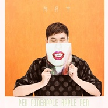

PPAP（清新版）
============================

|  |  |
| :--: | :-- |
| [ PPAP（清新版）](https://emumo.xiami.com/album/2102680553) | **艺人**: [陈柯宇](../index.md) **语种**: 国语 **唱片公司**: 独立发行 **发行时间**: 2017年01月15日 **专辑类别**: EP, 单曲 **专辑风格**: 流行 Pop **播放数**: 52670 **收藏数**: 38 **评论数**: 3  |

## 简介

陈柯宇通过自己的理解，改编出了PPAP清新版。这个版本的PPAP清新感十足，就像有股水果清香的微风迎面吹来。 

## 曲目

## 评论

|  |  |  |
| :-- | :-- | :-- |
|  [虾米用户](https://emumo.xiami.com/u/446036099)  2020-11-18 15:20 赞(0) 踩(0) | 
还行缺少点什么有点怪
 |
|  [虾米用户](https://emumo.xiami.com/u/307738425)  2017-06-26 22:55 赞(0) 踩(0) | 
  
 |
|  [虾米用户](https://emumo.xiami.com/u/259140494)   2017-01-18 12:00 赞(1) 踩(0) | 
很好听 完全！
 |
