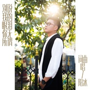

阳冰
============================

|  |  |
| :--: | :-- |
| [ 阳冰](https://i.xiami.com/ybmusic) | **地区**: China 中国大陆 **风格**: 国语流行 Mandarin Pop **播放数**: 2050085 **粉丝数**: 33 **评论数**: 1  |

## 档案

阳冰，本名杨斌，新锐音乐人，04年以一曲《 别说我的眼泪你无所谓 》[1]    入行，并斩获颇多音乐奖项，从而正式进入唱片业，一直从事幕后的音乐创作以及制作，参与制作的单曲以及专辑数十张，07年填词作品《不要再来伤害我》入围 音乐风云榜 最佳专辑提名，2012年开始转入影视音乐圈，湖南卫视年度女人攻心大戏《笑红颜》主题曲就出自于阳冰之手，2013年操刀宅男女神 赵奕欢 主演的中国首部青春校园惊悚电影《校花诡异事件》主题音乐，以及小清新喜剧电影《爱爱囧事》主题曲以及插曲

## 专辑

| 名称 | 语种 | 唱片公司 | 发行时间 | 专辑类别 | 专辑风格 |
| :--: | :-- | :-- | :-- | :-- | :-- |
| [ 我不是坏男人](./albums/2100374605.md) | 国语 | 众水之音 | 2016年07月27日 | EP, 单曲 | 华语唱作人 Chinese Singer-Songwriter, 国语流行 Mandarin Pop |
| [ 别说我的眼泪你无所谓](./albums/2100218130.md) | 国语 | 乐动时代 | 2015年10月13日 | EP, 单曲 | 华语唱作人 Chinese Singer-Songwriter, 国语流行 Mandarin Pop |

## 评论

|  |  |  |
| :-- | :-- | :-- |
|  [虾米用户](https://emumo.xiami.com/u/358104299) 悲观的唯心存在现实解构虚... 2021-01-06 06:33 赞(0) 踩(0) | 
45471
 |
