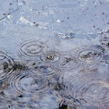
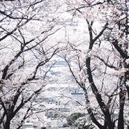
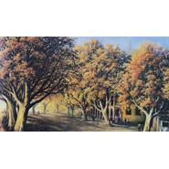
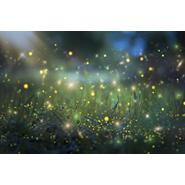
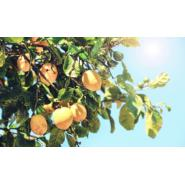

dylanf
============================

|  |  |
| :--: | :-- |
| [ dylanf](https://i.xiami.com/dylanfang) | **播放数**: 181457 **粉丝数**: 70 **评论数**: 7 **地区**: China 中国大陆 **风格**: 古风 GuFeng Music, 轻音乐 Easy Listening, 新世纪音乐 New Age  |

## 档案

Berklee伯克利音乐学院，Verse社，喜欢创作带着故事的纯音，分享自己的故事。乐谱/交流扣扣群703746569。

## 专辑

| 名称 | 语种 | 唱片公司 | 发行时间 | 专辑类别 | 专辑风格 |
| :--: | :-- | :-- | :-- | :-- | :-- |
| [ 睡前音乐Vol.3](./albums/5022529783.md) | 其他 |  | 2020年10月23日 | 录音室专辑 |  |
| [ 睡前音乐Vol.1](./albums/5022527288.md) | 其他 |  | 2020年09月30日 | 录音室专辑 |  |
| [ 魔岛](./albums/5022531223.md) | 其他 |  | 2020年02月10日 | EP, 单曲 |  |
| [ 晚空](./albums/5022526254.md) | 国语 |  | 2020年02月08日 | EP, 单曲 |  |
| [ 生命之光](./albums/5022532176.md) | 其他 |  | 2020年01月22日 | EP, 单曲 |  |
| [ 吴山天风](./albums/5022533062.md) | 国语 |  | 2019年10月15日 | EP, 单曲 |  |
| [ 在雨中与你相遇](./albums/5022518870.md) | 其他 |  | 2019年09月01日 | EP, 单曲 |  |
| [ 情诗](./albums/5022512463.md) | 国语 |  | 2019年08月15日 | EP, 单曲 |  |
| [ 夏日荷风](./albums/5022517372.md) | 纯音乐 |  | 2019年08月01日 | EP, 单曲 |  |
| [ 十里樱花](./albums/5022513906.md) | 国语 |  | 2019年07月01日 | 录音室专辑 |  |
| [ 北街梦寻](./albums/5022519381.md) | 国语 |  | 2019年06月15日 | EP, 单曲 |  |
| [ 云栖竹径](./albums/5022529279.md) | 国语 |  | 2019年06月01日 | EP, 单曲 |  |
| [ 遇见萤火](./albums/5022548927.md) | 国语 |  | 2019年04月15日 | EP, 单曲 |  |
| [ 柠檬树下](./albums/5022544894.md) | 国语 |  | 2019年03月15日 | EP, 单曲 |  |
| [ 天空云海](./albums/5022546423.md) | 纯音乐 |  | 2019年03月01日 | EP, 单曲 |  |
| [ 夜的钢琴曲](./albums/5021356011.md) | 纯音乐 | 独立发行 | 2018年08月04日 | EP, 单曲 | 轻音乐 Easy Listening, 器乐流行 Instrumental Pop |
| [ 天空之城](./albums/2108419046.md) | 纯音乐 | 独立发行 | 2018年07月07日 | EP, 单曲 | 轻音乐 Easy Listening |
| [ 卡农Canon in D](./albums/2108380034.md) | 纯音乐 | 独立发行 | 2017年03月23日 | EP, 单曲 | 轻音乐 Easy Listening, 古典音乐 Classical |

## 评论

|  |  |  |  |
| :-- | :-- | :-- | :-- |
|  [虾米用户](https://emumo.xiami.com/u/9327494) http://www.x... 2016-11-13 23:59 赞(0) 踩(0) | 
love
 |
|  [虾米用户](https://emumo.xiami.com/u/110206748)  2016-02-05 12:55 赞(0) 踩(0) | 
好听有活力
 |
|  [虾米用户](https://emumo.xiami.com/u/110206748)  2016-02-05 12:55 赞(0) 踩(0) | 
好听有活力
 |
|  [虾米用户](https://emumo.xiami.com/u/110206748)  2016-02-05 11:54 赞(0) 踩(0) | 
很不错啊，行云流水般，期待有更好的作品发布！
 |
|  [虾米用户](https://emumo.xiami.com/u/109963738)  2016-02-05 11:04 赞(1) 踩(0) | 
好听，很干净
 |
|  [虾米用户](https://emumo.xiami.com/u/109963738)  2016-02-04 21:22 赞(1) 踩(0) | 
期待你的首张音乐专辑成功!
 |
|  [虾米用户](https://emumo.xiami.com/u/70274014) 我还没想好要写什么... 2015-10-17 21:03 赞(2) 踩(0) | 
我刚入驻了虾米音乐人，欢迎大家来我的个人主页，收听我的最新音乐
 |
