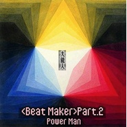
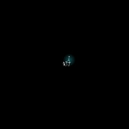
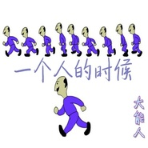
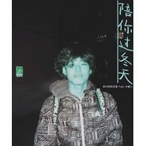

大能人
============================

|  |  |
| :--: | :-- |
| [ 大能人](https://i.xiami.com/rey) | **地区**: China 中国大陆 **风格**: 南方说唱 Southern Hip Hop, 流行说唱 Pop Rap, 国语流行 Mandarin Pop **播放数**: 7324968 **粉丝数**: 1597 **评论数**: 71  |

## 档案

直率的告诉你，我做音乐就是为了钱，女孩和能有一个快乐的家。 
姓名：大能人 
生日：12-29 
地区：新疆克拉玛依 
商业合作/交际：lzh867449580   186-9901-6226 
微博主页：  http://weibo.com/p/1005055108063349/home?from=page_100505&mod=TAB&is_all=1#place

## 专辑

| 名称 | 语种 | 唱片公司 | 发行时间 | 专辑类别 | 专辑风格 |
| :--: | :-- | :-- | :-- | :-- | :-- |
| [ 最佳男友 (which one)](./albums/2103649248.md) | 国语 | 博轩音乐 | 2018年03月28日 | EP, 单曲 |  |
| [ 陪你吧](./albums/2103649251.md) | 国语 | 博轩音乐 | 2018年03月28日 | EP, 单曲 |  |
| [ 当你不在](./albums/2103649249.md) | 国语 | 博轩音乐 | 2018年03月28日 | EP, 单曲 |  |
| [ 年轻的情种](./albums/2103649250.md) | 国语 | 博轩音乐 | 2018年03月28日 | EP, 单曲 |  |
| [ 留在你心里](./albums/2102644315.md) | 国语 | 博轩音乐 | 2016年11月07日 | EP, 单曲 |  |
| [ Professional Beat Maker](./albums/2100375953.md) | 国语 | 独立发行 | 2016年08月04日 | EP, 单曲 |  |
| [ 处男](./albums/2100373988.md) | 其他 | 独立发行 | 2016年07月29日 | EP, 单曲 |  |
| [ MaKeFa(马克发）](./albums/2100365876.md) | 国语 | 独立发行 | 2016年07月12日 | EP, 单曲 |  |
| [ Rich Xinnga  (Hot Nigga Remix)](./albums/2100358857.md) | 国语 | 独立发行 | 2016年06月26日 | EP, 单曲 |  |
| [ 异地（Elsewhere)](./albums/2100349499.md) | 国语 | 独立发行 | 2016年06月02日 | EP, 单曲 | 流行说唱 Pop Rap, 国语流行 Mandarin Pop, 意识说唱 Conscious Hip Hop |
| [ 大人物](./albums/2100330306.md) | 国语 | 独立发行 | 2016年05月06日 | EP, 单曲 | 硬核说唱 Hardcore Hip Hop, 国语流行 Mandarin Pop |
| [ 山楂树之恋](./albums/2100310164.md) | 国语 | 博轩音乐 | 2016年04月10日 | EP, 单曲 | 国语流行 Mandarin Pop |
| [ 拼了一生只为MoneY](./albums/2100305444.md) | 国语 | 独立发行 | 2016年04月03日 | EP, 单曲 | 流行说唱 Pop Rap, 国语流行 Mandarin Pop, 意识说唱 Conscious Hip Hop |
| [ 今夜](./albums/2100287778.md) | 国语 | 独立发行 | 2016年03月07日 | EP, 单曲 | 南方说唱 Southern Hip Hop, 流行说唱 Pop Rap |
| [ 新鲜感](./albums/2100268374.md) | 国语 | 博轩音乐 | 2016年01月30日 | EP, 单曲 | 流行说唱 Pop Rap, 国语流行 Mandarin Pop, 意识说唱 Conscious Hip Hop |
| [ 快乐的生活](./albums/2100244346.md) | 国语 | 独立发行 | 2015年12月07日 | EP, 单曲 | 爵士流行 Jazz Pop, 爵士说唱 Jazz Rap, 国语流行 Mandarin Pop |
| [ 三人游](./albums/2100242812.md) | 国语 | 独立发行 | 2015年11月29日 | EP, 单曲 | 西岸说唱 West Coast Hip Hop, 流行说唱 Pop Rap, 国语流行 Mandarin Pop |
| [ 冈斯特](./albums/2100237746.md) | 国语 | 独立发行 | 2015年11月16日 | EP, 单曲 | 南方说唱 Southern Hip Hop, 地下说唱 Underground Hip Hop |
| [ 一个人的时候](./albums/2100234370.md) | 国语 | 独立发行 | 2015年11月09日 | EP, 单曲 | 流行说唱 Pop Rap, 国语流行 Mandarin Pop |
| [ Goodbye 2015](./albums/2100231966.md) | 国语 | 独立发行 | 2015年11月04日 | EP, 单曲 | 室内爵士 Chamber Jazz, 流行说唱 Pop Rap, 国语流行 Mandarin Pop |
| [ 可能我得了相思病](./albums/2100228234.md) | 国语 | 大能人 | 2015年10月28日 | EP, 单曲 | 流行说唱 Pop Rap, 意识说唱 Conscious Hip Hop |
| [ 陪你过冬天Remix](./albums/2100228296.md) | 国语 | 大能人 | 2015年10月28日 | EP, 单曲 | 流行说唱 Pop Rap |

## 评论

|  |  |  |
| :-- | :-- | :-- |
|  [虾米用户](https://emumo.xiami.com/u/177436310) emo 2020-08-20 00:46 赞(0) 踩(0) | 
新说唱拉胯
 |
|  [虾米用户](https://emumo.xiami.com/u/286775597)  2020-05-14 18:14 赞(0) 踩(0) | 
很喜欢直率的人
 |
|  [虾米用户](https://emumo.xiami.com/u/277739481)  2020-01-02 13:21 赞(0) 踩(0) | 
抄袭可耻
 |
|  [虾米用户](https://emumo.xiami.com/u/213479812) 顽劣不改初衷，两眼冷似刀... 2019-12-20 00:47 赞(2) 踩(0) | 
我也直率的告诉你，我欣赏你
 |
|  [虾米用户](https://emumo.xiami.com/u/39850091) 死于心碎  2019-10-26 09:36 赞(0) 踩(0) | 
喜欢
 |
|  [虾米用户](https://emumo.xiami.com/u/101675278) 我还没想好要写什么... 2019-09-11 13:43 赞(0) 踩(0) | 
甜歌发源地
 |
|  [虾米用户](https://emumo.xiami.com/u/49958047) 寻找陪睡曲目(૭ ᐕ)૭ 2019-06-18 00:16 赞(1) 踩(0) | 
女孩 和快乐的家
 |
|  [虾米用户](https://emumo.xiami.com/u/346165752)  2019-04-06 11:03 赞(0) 踩(0) | 

 |
|  [虾米用户](https://emumo.xiami.com/u/337592878) 一 2019-02-20 09:54 赞(0) 踩(0) | 

 |
|  [虾米用户](https://emumo.xiami.com/u/412611631)  2019-01-29 18:42 赞(0) 踩(0) | 
好听666
 |
|  [虾米用户](https://emumo.xiami.com/u/323951858) 喜欢安静，喜欢听歌 2018-12-25 01:33 赞(0) 踩(0) | 
很喜欢你的声音
 |
|  [虾米用户](https://emumo.xiami.com/u/261971903)  2018-12-06 09:55 赞(1) 踩(0) | 
很久以前还加了你的微信
 |
|  [虾米用户](https://emumo.xiami.com/u/242443016) 波光粼粼的河滩 2018-07-02 15:22 赞(4) 踩(0) | 
被你喜欢的人真幸福。
 |
|  [虾米用户](https://emumo.xiami.com/u/374635245)  2018-07-01 18:34 赞(0) 踩(0) | 
你真的hustle?
 |
|  [虾米用户](https://emumo.xiami.com/u/335885835) 帮忙黑一下童可可这个绿茶... 2018-06-30 19:53 赞(0) 踩(0) | 
喜欢
 |
|  [虾米用户](https://emumo.xiami.com/u/1115247) @Nebula_7293 2018-05-28 20:15 赞(1) 踩(0) | 
现在你都不回虾米了
 |
| ⇒ |  [虾米用户](https://emumo.xiami.com/u/417826606)  2019-02-04 17:37 赞(0) 踩(0) | 
他把密码忘了
 |
| ⇒ |  [虾米用户](https://emumo.xiami.com/u/341184650) 长风破浪会有时，直挂云帆... 2020-09-13 23:52 赞(0) 踩(0) | 
<q><b>霍衍说：</b></q>
 |
|  [虾米用户](https://emumo.xiami.com/u/358988229)  2018-04-18 23:41 赞(0) 踩(0) | 
你的每一首歌我都有
 |
|  [虾米用户](https://emumo.xiami.com/u/293692544) 你敢给我说话吗？我咬你 2018-04-15 17:28 赞(1) 踩(0) | 
好听好听
 |
|  [虾米用户](https://emumo.xiami.com/u/143401552) 我没有能力我有野心 2018-04-04 00:18 赞(2) 踩(0) | 
有个性，我喜欢
 |
|  [虾米用户](https://emumo.xiami.com/u/262886923) 网易️️：yahokny... 2018-03-24 12:05 赞(4) 踩(0) | 
炒鸡喜欢你的新鲜感 
 |
|  [虾米用户](https://emumo.xiami.com/u/213969318) 企鹅搜索：HL-小浪 2018-02-05 09:43 赞(2) 踩(0) | 
6666
 |
|  [虾米用户](https://emumo.xiami.com/u/338473420)  2018-02-04 14:26 赞(4) 踩(0) | 
克拉玛依？这么有才，祝福你！今年春节回去，哈哈！
 |
|  [虾米用户](https://emumo.xiami.com/u/346446837)  2018-01-26 18:37 赞(2) 踩(0) | 
好听
 |
|  [虾米用户](https://emumo.xiami.com/u/13111079) 有缘再见 2018-01-09 18:04 赞(2) 踩(0) | 
ෆ
 |
|  [虾米用户](https://emumo.xiami.com/u/11051264) 我还没想好要写什么... 2017-12-19 10:45 赞(2) 踩(0) | 
克拉玛依不是那个盗墓笔记
 |
|  [虾米用户](https://emumo.xiami.com/u/250085929)   2017-11-29 02:50 赞(39) 踩(0) | 
只想赚钱的音乐人算是很有诚意了
 |
|  [虾米用户](https://emumo.xiami.com/u/328320358)  2017-11-10 19:06 赞(2) 踩(0) | 
好听
 |
|  [虾米用户](https://emumo.xiami.com/u/44565735) 人生是一方通行 2017-11-01 23:44 赞(2) 踩(0) | 
୧⍢⃝୨
 |
|  [虾米用户](https://emumo.xiami.com/u/195902502)  2017-10-21 23:23 赞(1) 踩(0) | 
最喜欢我们皓皓辣
 |
|  [虾米用户](https://emumo.xiami.com/u/46850625) 不感兴趣 不想了解 2017-10-04 00:02 赞(3) 踩(0) | 
喜欢你
 |
|  [虾米用户](https://emumo.xiami.com/u/217895133) 是個垃圾. 2017-09-05 07:43 赞(1) 踩(0) | 
Bolin
 |
|  [虾米用户](https://emumo.xiami.com/u/30694412) 我还没想好要写什么... 2017-09-04 13:40 赞(2) 踩(0) | 
新鲜感那个歌  这个没有伴奏的呢
 |
|  [虾米用户](https://emumo.xiami.com/u/297965489) 天高任宇飞，羽毛永相随！... 2017-08-14 17:07 赞(1) 踩(0) | 
好听
 |
|  [虾米用户](https://emumo.xiami.com/u/249971889) 自己最大的缺点就是：白日... 2017-08-07 18:27 赞(4) 踩(0) | 
新鲜感支持
 |
|  [虾米用户](https://emumo.xiami.com/u/44188955) 如果你和我相似度90%那... 2017-07-30 08:39 赞(1) 踩(0) | 
喜欢你
 |
|  [虾米用户](https://emumo.xiami.com/u/276268024)  2017-07-21 12:53 赞(1) 踩(0) | 
老好听了，  
 |
|  [虾米用户](https://emumo.xiami.com/u/2418238) weibo: @尤米口 2017-07-10 18:12 赞(0) 踩(0) | 
//
 |
|  [虾米用户](https://emumo.xiami.com/u/307749573)  2017-06-26 23:38 赞(1) 踩(0) | 
danengr................
 |
|  [虾米用户](https://emumo.xiami.com/u/300496822)  2017-05-30 15:49 赞(0) 踩(0) | 
酷
 |
|  [虾米用户](https://emumo.xiami.com/u/298245708) 情浅。不情深 2017-05-22 05:44 赞(1) 踩(0) | 
好听
 |
|  [虾米用户](https://emumo.xiami.com/u/203670788) 我还没想好要写什么... 2017-05-21 14:40 赞(0) 踩(0) | 
如果你爱我就跟我语音通话70分钟
 |
|  [虾米用户](https://emumo.xiami.com/u/46202390) 软嘴唇 2017-05-16 11:30 赞(2) 踩(0) | 
网易云日推结果变成脑残粉:) 大能人小眼睛软嘴唇 hhh
 |
|  [虾米用户](https://emumo.xiami.com/u/290592239)  2017-04-22 15:55 赞(1) 踩(0) | 
有没有山楂树之恋的伴奏
 |
|  [虾米用户](https://emumo.xiami.com/u/8424657) 海岸线 2017-02-17 12:36 赞(0) 踩(0) | 
噗
 |
|  [虾米用户](https://emumo.xiami.com/u/1115247) @Nebula_7293 2017-02-12 22:16 赞(0) 踩(0) | 
新疆是个好地方
 |
|  [虾米用户](https://emumo.xiami.com/u/85868814) love is biu ... 2016-12-05 21:11 赞(1) 踩(0) | 

 |
|  [虾米用户](https://emumo.xiami.com/u/85868814) love is biu ... 2016-10-16 10:13 赞(0) 踩(0) | 
么么哒
 |
|  [虾米用户](https://emumo.xiami.com/u/49751135) 关注我的人都很有品味 2016-06-25 04:26 赞(0) 踩(0) | 
啧啧啧 比我都小了
 |
|  [虾米用户](https://emumo.xiami.com/u/50462742) UZI9mm 2016-05-23 04:23 赞(0) 踩(0) | 

 |
|  [虾米用户](https://emumo.xiami.com/u/43642750) 乡村路，带我回家。。。 2016-05-22 10:45 赞(0) 踩(0) | 
程sir助阵 加油⛽️
 |
|  [虾米用户](https://emumo.xiami.com/u/43173766) 算了我放下了   再会吧... 2016-05-06 09:21 赞(0) 踩(0) | 
发布新歌了
 |
|  [虾米用户](https://emumo.xiami.com/u/126024086)  2016-03-23 14:15 赞(0) 踩(0) | 
支持大能人  
 |
|  [虾米用户](https://emumo.xiami.com/u/112701142) gangsta! 2016-02-11 02:11 赞(0) 踩(0) | 
我是你的粉丝！
 |
|  [虾米用户](https://emumo.xiami.com/u/110957694) 当你正在死去突然所有人都... 2016-02-06 18:01 赞(1) 踩(0) | 
新鲜感超级好听！！
 |
|  [虾米用户](https://emumo.xiami.com/u/45172026)  2016-01-31 19:14 赞(0) 踩(0) | 
可以可以
 |
|  [虾米用户](https://emumo.xiami.com/u/43173766) 算了我放下了   再会吧... 2016-01-19 11:48 赞(0) 踩(0) | 
6666
 |
|  [虾米用户](https://emumo.xiami.com/u/86630380)   2015-11-26 21:06 赞(0) 踩(0) | 
 
 |
|  [虾米用户](https://emumo.xiami.com/u/85906124)  2015-11-24 03:33 赞(0) 踩(0) | 

 |
|  [虾米用户](https://emumo.xiami.com/u/85812836)  2015-11-23 19:49 赞(0) 踩(0) | 
加油  
 |
|  [虾米用户](https://emumo.xiami.com/u/33078922)  2015-11-21 03:19 赞(0) 踩(0) | 
老弟，加油！                                    
 |
|  [虾米用户](https://emumo.xiami.com/u/83771010)  2015-11-16 23:35 赞(0) 踩(0) | 
支持 
 |
|  [虾米用户](https://emumo.xiami.com/u/83771010)  2015-11-16 23:34 赞(1) 踩(0) | 
以前只知道你玩说唱
 |
|  [虾米用户](https://emumo.xiami.com/u/83771010)  2015-11-16 23:34 赞(1) 踩(0) | 
没想到你现在这么厉害
 |
|  [虾米用户](https://emumo.xiami.com/u/56112211) 认识的加吧 2015-11-02 22:32 赞(0) 踩(0) | 
可以，支持！
 |
|  [虾米用户](https://emumo.xiami.com/u/78505156)  2015-11-02 05:30 赞(0) 踩(0) | 
支持
 |
|  [虾米用户](https://emumo.xiami.com/u/78500134) 我家的母老虎 2015-11-02 01:29 赞(0) 踩(0) | 
66666
 |
|  [虾米用户](https://emumo.xiami.com/u/77511204)  2015-10-28 20:33 赞(0) 踩(0) | 
牛逼同桌
 |
|  [虾米用户](https://emumo.xiami.com/u/76961668)  2015-10-26 19:45 赞(0) 踩(0) | 
阿力 祝贺 
 |
|  [虾米用户](https://emumo.xiami.com/u/47131644) keep it real... 2015-10-26 14:33 赞(0) 踩(0) | 
阿克前来助阵 
 |
