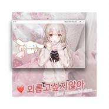

외롭고싶지않아️️Don't wanna be alone
============================

|  |  |
| :--: | :-- |
| [ 외롭고싶지않아️️Don't wanna be alone](https://emumo.xiami.com/album/2104881964) | **艺人**: [眠](../index.md) **语种**: 韩语 **唱片公司**:  **发行时间**: 2019年05月20日 **专辑类别**: EP, 单曲 **专辑风格**: 放克 Funk **播放数**: 8528 **收藏数**: 9 **评论数**: 10  |

## 简介

## 曲目

## 评论

|  |  |  |
| :-- | :-- | :-- |
|  [虾米用户](https://emumo.xiami.com/u/233288026) 77777777 2019-06-06 22:36 赞(0) 踩(0) | 
s 哈哈哈
 |
|  [虾米用户](https://emumo.xiami.com/u/410173118) 环游世界   去遍偶像所... 2019-05-28 22:18 赞(0) 踩(0) | 
好
 |
|  [虾米用户](https://emumo.xiami.com/u/13096185) 独留余香满堂春~ 2019-05-27 14:51 赞(0) 踩(0) | 
甜甜的~少男心一样融化了
 |
|  [虾米用户](https://emumo.xiami.com/u/71334632) Watching and... 2019-05-23 03:41 赞(0) 踩(0) | 
哇里古得
 |
|  [虾米用户](https://emumo.xiami.com/u/126231994) 山水温柔 2019-05-22 20:43 赞(0) 踩(0) | 
❤️
 |
|  [虾米用户](https://emumo.xiami.com/u/325374787)  2019-05-21 11:20 赞(0) 踩(0) | 
好
 |
|  [虾米用户](https://emumo.xiami.com/u/3076618) ins: 1225bg ... 2019-05-21 00:25 赞(0) 踩(0) | 
不想孤单
 |
|  [虾米用户](https://emumo.xiami.com/u/335545583) LASTFM：https... 2019-05-21 00:21 赞(0) 踩(0) | 
爱你宝贝
 |
|  [虾米用户](https://emumo.xiami.com/u/2761419) 镜中之花，水影倒月. 2019-05-20 23:10 赞(0) 踩(0) | 
哈
 |
|  [虾米用户](https://emumo.xiami.com/u/322523580) 夜空 总有更大密度的蓝色 2019-05-20 23:09 赞(0) 踩(0) | 
V
 |
