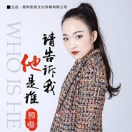

娅琳-请告诉我他是谁
============================

|  |  |
| :--: | :-- |
| [ 娅琳-请告诉我他是谁](https://emumo.xiami.com/album/2103754757) | **艺人**: [娅琳](../index.md) **语种**: 国语 **唱片公司**: 独立发行 **发行时间**: 2017年04月05日 **专辑类别**: EP, 单曲 **专辑风格**: 流行 Pop, 国语流行 Mandarin Pop **播放数**: 2540 **收藏数**: 0 **评论数**: 0  |

## 简介

《请告诉我他是谁》由娅琳影视文化传媒出品/发行，娅琳在创作这首词写下自己的感想：“三月里绵绵的细雨，滴落在我的眼眸，在这雨中我只有拾起还未绽放的花蕾，记忆深处的前尘旧事浮现在眼前,今日执笔千言，无法倾诉心中的悲伤，承载太多斑驳的流年，只有寻找曾经逝去记忆的碎片去回忆，用乐音去表达自己的情感，倾诉心中的独白，希望现在的男女对爱情多一份真诚，彼此珍惜……更希望女人们在感情中一定要学会坚强、勇敢的去面对一切，坚持做一个善良的人，相信幸福会来临的。

## 曲目

## 评论

|  |  |  |  |
| :-- | :-- | :-- | :-- |
