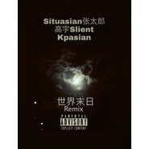

世界末日Remix
============================

|  |  |
| :--: | :-- |
| [ 世界末日Remix](https://emumo.xiami.com/album/2102779725) | **艺人**: [高宇Slient](../index.md) **语种**: 国语 **唱片公司**: 独立发行 **发行时间**: 2017年07月09日 **专辑类别**: EP, 单曲 **专辑风格**: 嘻哈 Hip-Hop, 流行说唱 Pop Rap, 地下说唱 Underground Hip Hop **播放数**: 662 **收藏数**: 0 **评论数**: 0  |

## 简介

围城里外的人一直互相眺望，终于有一天门开了，大家拥抱握手打架上床后发现原来彼此都是一样的天真也无知，善良又自私。 

## 曲目

## 评论

|  |  |  |  |
| :-- | :-- | :-- | :-- |
