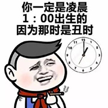
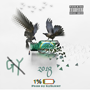
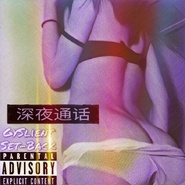
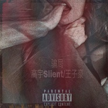
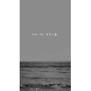

高宇Slient
============================

|  |  |
| :--: | :-- |
| [ 高宇Slient](https://i.xiami.com/gaoyu) | **地区**: China 中国大陆 **风格**: 老派说唱 Old-school Hip Hop, 流行说唱 Pop Rap, 流行 Pop **播放数**: 3316028 **粉丝数**: 191 **评论数**: 7  |

## 档案

沉淀 
不迎合 不争夺 
脑残里的智者，黑夜中的阳光。

## 专辑

| 名称 | 语种 | 唱片公司 | 发行时间 | 专辑类别 | 专辑风格 |
| :--: | :-- | :-- | :-- | :-- | :-- |
| [ 你的怀里才是人间](./albums/5022521973.md) | 国语 |  | 2020年10月31日 | 录音室专辑 |  |
| [ 又是一个想你的午夜](./albums/5022556564.md) | 国语 |  | 2020年10月31日 | 录音室专辑 |  |
| [ Nobody really cares](./albums/2104984430.md) | 国语 | 看见文娱 | 2019年07月10日 | EP, 单曲 |  |
| [ 与你2.0](./albums/2104871625.md) | 国语 |  | 2019年05月20日 | 录音室专辑 | 流行说唱 Pop Rap |
| [ Yes or No](./albums/2104784396.md) | 国语 |  | 2019年04月18日 | EP, 单曲 | 陷阱说唱 Trap Rap |
| [ 坏情绪](./albums/2104624138.md) | 国语 | 独立发行 | 2019年02月25日 | 录音室专辑 | 流行 Pop, 流行说唱 Pop Rap, 嘻哈 Hip-Hop |
| [ 不明不白](./albums/2104556812.md) | 国语 |  | 2019年02月03日 | 录音室专辑 | 嘻哈 Hip-Hop |
| [ 习惯就好](./albums/2104556740.md) | 国语 |  | 2019年01月30日 | 录音室专辑 | 嘻哈 Hip-Hop |
| [ 真或假（Yes or No）](./albums/2104481086.md) | 国语 |  | 2019年01月14日 | 录音室专辑 | 嘻哈 Hip-Hop |
| [ 坐天观井](./albums/2104441501.md) | 国语 |  | 2019年01月03日 | EP, 单曲 | 嘻哈 Hip-Hop |
| [ 挚爱](./albums/2104556729.md) | 国语 |  | 2018年10月06日 | 录音室专辑 | 嘻哈 Hip-Hop |
| [ 安排](./albums/2104073903.md) | 国语 | 独立发行 | 2018年10月04日 | 录音室专辑 | 流行说唱 Pop Rap, 嘻哈 Hip-Hop, 喜剧说唱 Comedy Hip Hop |
| [ 你](./albums/2104073902.md) | 国语 | 独立发行 | 2018年10月03日 | 录音室专辑 | 流行说唱 Pop Rap, 嘻哈 Hip-Hop |
| [ 逐梦](./albums/2104073904.md) | 国语 | 独立发行 | 2018年10月02日 | 录音室专辑 | 硬核说唱 Hardcore Hip Hop, 流行说唱 Pop Rap, 嘻哈 Hip-Hop |
| [ 工业革命Cypher工业革命](./albums/2104073900.md) | 国语 | 独立发行 | 2018年10月02日 | 录音室专辑 | 老派说唱 Old-school Hip Hop, 流行说唱 Pop Rap, 嘻哈 Hip-Hop |
| [ 都是被逼的](./albums/2103991170.md) | 国语 | 独立发行 | 2018年09月07日 | 录音室专辑 | 硬核说唱 Hardcore Hip Hop, 老派说唱 Old-school Hip Hop, 嘻哈 Hip-Hop |
| [ 失控（prod by dajian）](./albums/2103944154.md) | 国语 | 独立发行 | 2018年09月01日 | 录音室专辑 | 流行 Pop, 流行说唱 Pop Rap, 嘻哈 Hip-Hop |
| [ 住进你梦里](./albums/2103944074.md) | 国语 | 独立发行 | 2018年08月25日 | 录音室专辑 | 国语流行 Mandarin Pop, 嘻哈 Hip-Hop, 地下说唱 Underground Hip Hop |
| [ Good NightGood Night](./albums/2103934913.md) | 国语 | 独立发行 | 2018年08月19日 | 录音室专辑 | 流行说唱 Pop Rap, 嘻哈 Hip-Hop, 地下说唱 Underground Hip Hop |
| [ 9277是个好人](./albums/2103873137.md) | 国语 | 独立发行 | 2018年07月30日 | 录音室专辑 | 流行说唱 Pop Rap, 嘻哈 Hip-Hop, 喜剧说唱 Comedy Hip Hop |
| [ 是个好人是个好人](./albums/2103873166.md) | 国语 | 独立发行 | 2018年07月30日 | 录音室专辑 | 流行说唱 Pop Rap, 嘻哈 Hip-Hop, 另类嘻哈 Left-Field Hip-Hop |
| [ 92779277](./albums/2103873188.md) | 国语 | 独立发行 | 2018年07月30日 | 录音室专辑 | 嘻哈 Hip-Hop, 流行说唱 Pop Rap, 另类嘻哈 Left-Field Hip-Hop |
| [ 我一直都在等着你](./albums/2103830120.md) | 国语 | 独立发行 | 2018年07月21日 | 录音室专辑 | 嘻哈 Hip-Hop, 流行说唱 Pop Rap, 地下说唱 Underground Hip Hop |
| [ 纯正好货](./albums/2103830119.md) | 国语 | 独立发行 | 2018年07月20日 | 录音室专辑 | 陷阱说唱 Trap Rap, 地下说唱 Underground Hip Hop, 嘻哈 Hip-Hop |
| [ 写给你写给你](./albums/2103702384.md) | 国语 | 独立发行 | 2018年05月04日 | 录音室专辑 | 流行说唱 Pop Rap, 嘻哈 Hip-Hop |
| [ 骗自己骗自己](./albums/2103693990.md) | 国语 | 独立发行 | 2018年04月23日 | 录音室专辑 | 流行说唱 Pop Rap, 嘻哈 Hip-Hop, 爵士嘻哈 Jazz Hip Hop |
| [ 深夜通话（Latenight Calling Remix）深夜通话（Latenight Calling Remix）](./albums/2103693993.md) | 国语 | 独立发行 | 2018年04月23日 | 录音室专辑 | 嘻哈 Hip-Hop, 流行说唱 Pop Rap |
| [ 啵啵remix啵啵remix](./albums/2103693992.md) | 国语 | 独立发行 | 2018年04月23日 | 录音室专辑 | 流行说唱 Pop Rap |
| [ 骗局骗局](./albums/2103693995.md) | 国语 | 独立发行 | 2018年04月23日 | 录音室专辑 | 嘻哈 Hip-Hop, 陷阱说唱 Trap Rap, 中国地下说唱 Chinese Underground Hip Hop |
| [ 午夜游民午夜游民](./albums/2103641852.md) | 国语 | 独立发行 | 2018年03月26日 | 录音室专辑 | 嘻哈 Hip-Hop, 流行说唱 Pop Rap, 地下说唱 Underground Hip Hop |
| [ You are a good man好人是你](./albums/2103635336.md) | 国语 | 独立发行 | 2018年03月23日 | 录音室专辑 | 嘻哈 Hip-Hop |
| [ 我和你我和你](./albums/2103635340.md) | 国语 | 独立发行 | 2018年03月23日 | 录音室专辑 | 嘻哈 Hip-Hop, 流行说唱 Pop Rap |
| [ Look at me看着我](./albums/2103604056.md) | 国语 | 独立发行 | 2018年03月12日 | 录音室专辑 | 嘻哈 Hip-Hop, 流行说唱 Pop Rap, 爵士说唱 Jazz Rap |
| [ 那个人Remix（Feat 房岳）那个人](./albums/2103583331.md) | 国语 | 独立发行 | 2018年03月04日 | 录音室专辑 | 流行 Pop, 流行说唱 Pop Rap |
| [ 病变Remix病变Remix](./albums/2103583321.md) | 国语 | 独立发行 | 2018年03月04日 | 录音室专辑 | 嘻哈 Hip-Hop, 流行说唱 Pop Rap, 国语流行 Mandarin Pop |
| [ 多金少年多金少年](./albums/2103583316.md) | 国语 | 独立发行 | 2018年03月04日 | 录音室专辑 | 嘻哈 Hip-Hop, 流行说唱 Pop Rap, 地下说唱 Underground Hip Hop |
| [ 一生热爱一生热爱](./albums/2103583325.md) | 国语 | 独立发行 | 2018年03月04日 | 录音室专辑 | 嘻哈 Hip-Hop, 流行说唱 Pop Rap, 意识说唱 Conscious Hip Hop |
| [ Gy造型专业户（Gy Gang）Gy造型专业户（Gy Gang）](./albums/2103583334.md) | 国语 | 独立发行 | 2018年03月04日 | 录音室专辑 | 嘻哈 Hip-Hop, 西岸说唱 West Coast Hip Hop, 地下说唱 Underground Hip Hop |
| [ 与你与你](./albums/2103528017.md) | 国语 | 独立发行 | 2018年02月14日 | 录音室专辑 | 嘻哈 Hip-Hop, 流行说唱 Pop Rap |
| [ 12.19（Demo）12.19](./albums/2103528014.md) | 国语 | 独立发行 | 2018年02月14日 | 录音室专辑 | 轻音乐 Easy Listening, 嘻哈 Hip-Hop, 流行说唱 Pop Rap |
| [ 你非要过什么情人节你非要过什么情人节](./albums/2103528855.md) | 国语 | 独立发行 | 2018年02月14日 | 录音室专辑 | 地下说唱 Underground Hip Hop, 嘻哈 Hip-Hop, 陷阱说唱 Trap Rap |
| [ Feel at ease诉REMIX](./albums/2103519849.md) | 国语 | 独立发行 | 2018年02月07日 | 录音室专辑 | 嘻哈 Hip-Hop, 流行说唱 Pop Rap, 爵士说唱 Jazz Rap |
| [ 我多喜欢你，你会知道我多喜欢你，你会知道](./albums/2102971029.md) | 国语 | 独立发行 | 2017年12月10日 | 录音室专辑 | 流行 Pop, 国语流行 Mandarin Pop, 独立流行 Indie Pop |
| [ I will leave you（Demo）I will leave you（Demo）](./albums/2102971030.md) | 国语 | 独立发行 | 2017年12月10日 | 录音室专辑 | 嘻哈 Hip-Hop, 爵士说唱 Jazz Rap, 流行说唱 Pop Rap |
| [ 为你打call（Remix）为你打call](./albums/2102971026.md) | 国语 | 独立发行 | 2017年12月09日 | 录音室专辑 | 嘻哈 Hip-Hop, 流行说唱 Pop Rap |
| [ 黑暗三色园黑暗三色园](./albums/2102971027.md) | 国语 | 独立发行 | 2017年12月09日 | 录音室专辑 | 嘻哈 Hip-Hop, 地下说唱 Underground Hip Hop |
| [ 黑暗三色园红-黄-蓝](./albums/2102963558.md) | 国语 | 独立发行 | 2017年11月24日 | 录音室专辑 | 嘻哈 Hip-Hop, 流行说唱 Pop Rap, 地下说唱 Underground Hip Hop |
| [ 失控失控](./albums/2102900397.md) | 国语 | 独立发行 | 2017年11月01日 | 录音室专辑 | 嘻哈 Hip-Hop, 流行说唱 Pop Rap, 地下说唱 Underground Hip Hop |
| [ 越长大越孤单（说唱Remix）越长大越孤单](./albums/2102900396.md) | 国语 | 独立发行 | 2017年10月31日 | 录音室专辑 | 嘻哈 Hip-Hop, 流行说唱 Pop Rap, 地下说唱 Underground Hip Hop |
| [ 多金少年（RICH REMIX）](./albums/2102900393.md) | 国语 | 独立发行 | 2017年10月31日 | EP, 单曲 | 嘻哈 Hip-Hop, 西岸说唱 West Coast Hip Hop, 地下说唱 Underground Hip Hop |
| [ 失控失控](./albums/2102867340.md) | 国语 | 独立发行 | 2017年10月03日 | 录音室专辑 | 流行说唱 Pop Rap, 地下说唱 Underground Hip Hop |
| [ 2015-2017年Remix Demo高宇Slient demo](./albums/2102851300.md) | 国语 | 独立发行 | 2017年09月04日 | 录音室专辑 | 嘻哈 Hip-Hop, 流行说唱 Pop Rap, 地下说唱 Underground Hip Hop |
| [ 我的未来女友我的未来女友](./albums/2102849302.md) | 国语 | 独立发行 | 2017年08月28日 | 录音室专辑 | 流行说唱 Pop Rap |
| [ 给老子注意点（Prod by wizard）给老子注意点](./albums/2102849299.md) | 国语 | 独立发行 | 2017年08月24日 | 录音室专辑 | 嘻哈 Hip-Hop |
| [ 后高宇Slient/徐真真](./albums/2102805489.md) | 国语 | 独立发行 | 2017年07月30日 | EP, 单曲 | 流行说唱 Pop Rap |
| [ 闭嘴吧键盘侠sneer](./albums/2102802776.md) | 国语 | 独立发行 | 2017年07月25日 | 录音室专辑 | 地下说唱 Underground Hip Hop |
| [ 可能你还不明白remix可能你还不明白remix](./albums/2102802777.md) | 国语 | 独立发行 | 2017年07月21日 | EP, 单曲 | 流行说唱 Pop Rap |
| [ 陪你过冬天Remix陪你过冬天Remix](./albums/2102802778.md) | 国语 | 独立发行 | 2017年07月20日 | EP, 单曲 | 流行说唱 Pop Rap |
| [ 世界末日Remix](./albums/2102779725.md) | 国语 | 独立发行 | 2017年07月09日 | EP, 单曲 | 嘻哈 Hip-Hop, 流行说唱 Pop Rap, 地下说唱 Underground Hip Hop |
| [ 暴雨Remix暴雨](./albums/2102778873.md) | 国语 | 独立发行 | 2017年07月07日 | EP, 单曲 | 流行说唱 Pop Rap |
| [ 过我自己的Remix](./albums/2102776440.md) | 国语 | 独立发行 | 2017年06月29日 | EP, 单曲 | 流行说唱 Pop Rap, 独立电子乐 Indietronica, 爵士流行 Jazz Pop |
| [ 抱歉](./albums/2100362293.md) | 国语 | 独立发行 | 2016年07月04日 | EP, 单曲 |  |
| [ 再也不见再也不见](./albums/2100354668.md) | 国语 | 独立发行 | 2016年06月15日 | EP, 单曲 | 流行说唱 Pop Rap |
| [ 一生热爱一生热爱](./albums/2100331820.md) | 国语 | 独立发行 | 2016年05月08日 | EP, 单曲 | 流行说唱 Pop Rap, 意识说唱 Conscious Hip Hop |
| [ 初恋时代初恋时代](./albums/2100310126.md) | 国语 | 独立发行 | 2016年04月10日 | EP, 单曲 | 东岸说唱 East Coast Hip Hop, 流行说唱 Pop Rap |
| [ 人性人性（兰亭疾序Remxi）](./albums/2100320346.md) | 国语 | 独立发行 | 2016年04月10日 | EP, 单曲 | 流行说唱 Pop Rap, 地下说唱 Underground Hip Hop |
| [ 本色GySlient](./albums/2100292166.md) | 国语 | 独立发行 | 2016年03月13日 | EP, 单曲 | 流行说唱 Pop Rap, 地下说唱 Underground Hip Hop |
| [ 关于你的印记](./albums/2100237800.md) | 国语 | 维音唱片 | 2015年11月16日 | EP, 单曲 |  |
| [ 好久不见Long time no see](./albums/2104940493.md) | 国语 | 看见文娱 | 不详 | 录音室专辑 | 流行说唱 Pop Rap |
| [ 我只想要能够和你在一起](./albums/2104556734.md) | 国语 |  | 不详 | 录音室专辑 | 嘻哈 Hip-Hop |
| [ Yes or No](./albums/2104658682.md) | 国语 |  | 不详 | 录音室专辑 | 陷阱说唱 Trap Rap |
| [ 尊重](./albums/2104784443.md) | 国语 |  | 不详 | EP, 单曲 | 陷阱说唱 Trap Rap |
| [ ♪≠…♡0℃](./albums/2104784511.md) | 国语 |  | 不详 | 录音室专辑 | 流行 Pop |
| [ I don't need](./albums/2104792957.md) | 国语 |  | 不详 | 精选集 | 陷阱说唱 Trap Rap, 流行说唱 Pop Rap |
| [ 安排Part2](./albums/2104556728.md) | 国语 |  | 不详 | 录音室专辑 | 嘻哈 Hip-Hop |
| [ 高宇Slient的专辑](./albums/5022633088.md) | 其他 |  | 不详 |  |  |

## 评论

|  |  |  |
| :-- | :-- | :-- |
|  [虾米用户](https://emumo.xiami.com/u/906190)   2019-01-13 22:48 赞(0) 踩(0) | 
加油！
 |
|  [虾米用户](https://emumo.xiami.com/u/36481311) 网易云账号:ZACOBO... 2018-08-25 13:23 赞(1) 踩(0) | 
找幼稚园杀手怎么跳到这个页面了。。
 |
|  [虾米用户](https://emumo.xiami.com/u/247220777) 平凡的挣扎没人歌颂 2017-04-13 22:07 赞(0) 踩(0) | 
讲真的   每一首都特别用心
 |
|  [虾米用户](https://emumo.xiami.com/u/239355329) 精神洁癖者 2016-10-22 23:08 赞(0) 踩(0) | 
宇哥，我在这里
 |
|  [虾米用户](https://emumo.xiami.com/u/120813468) 在吗 2016-05-30 22:01 赞(1) 踩(0) | 
不知道。。你。。介绍里那两句。。怎么。。好意思。。写。。出来的。 。加油吧 
 |
|  [虾米用户](https://emumo.xiami.com/u/167328316)  2016-05-11 23:17 赞(0) 踩(0) | 
走心
 |
|  [虾米用户](https://emumo.xiami.com/u/57048810) 与你何干 2015-11-23 14:57 赞(2) 踩(0) | 
我刚入驻了虾米音乐人，欢迎大家来我的个人主页，收听我的最新音乐
 |
