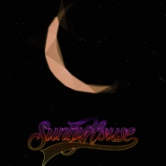
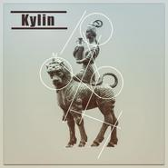
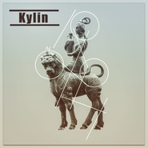

SunnyHouse弘哲
============================

|  |  |
| :--: | :-- |
| [ SunnyHouse弘哲](https://i.xiami.com/sunnyhouse) | **播放数**: 1394522 **粉丝数**: 1832 **评论数**: 65 **地区**: China 中国大陆 **风格**: 都市流行 City Pop, 独立流行 Indie Pop  |

## 档案

大家如果以后虾米找不到我 就来网易 或者来我微博 其他所有音乐平台  同名，  同名，       我永远是你们的SUNNYHOUSE弘哲 ❥(^_-)

## 专辑

| 名称 | 语种 | 唱片公司 | 发行时间 | 专辑类别 | 专辑风格 |
| :--: | :-- | :-- | :-- | :-- | :-- |
| [ 孤城](./albums/5022445615.md) | 国语 | 声音丛林 | 2021年01月13日 | EP, 单曲 | 国语流行 Mandarin Pop |
| [ 似是而非](./albums/5021042938.md) | 国语 | 声音丛林 | 2020年07月09日 | EP, 单曲 | 国语流行 Mandarin Pop |
| [ 回家Go Home](./albums/5020780536.md) | 国语 | 独立发行 | 2020年05月30日 | EP, 单曲 | 流行说唱 Pop Rap |
| [ 后现代爱情](./albums/2108373120.md) | 国语 | 声音丛林 | 2020年04月28日 | EP, 单曲 | 独立流行 Indie Pop |
| [ 只有月亮陪我](./albums/2105723214.md) | 国语 | 声音丛林 | 2020年01月17日 | EP, 单曲 | 国语流行 Mandarin Pop |
| [ 雨](./albums/2105575129.md) | 国语 | 声音丛林 | 2019年12月16日 | EP, 单曲 | 国语流行 Mandarin Pop |
| [ 美梦](./albums/2105194933.md) | 国语 | 声音丛林 | 2019年09月02日 | EP, 单曲 |  |
| [ 她的世界](./albums/2104844470.md) | 国语 | 声音丛林 | 2019年05月09日 | EP, 单曲 | 国语流行 Mandarin Pop |
| [ Find](./albums/2104444506.md) | 国语 | 世鸿君汇 | 2019年01月07日 | EP, 单曲 | 国语流行 Mandarin Pop, 新迪斯科 Nu-Disco, 放克电子 Electro (Electro-Funk) |
| [ 你You](./albums/2103925788.md) | 国语 | 声音丛林 | 2018年08月17日 | EP, 单曲 | 都市流行 City Pop, 国语流行 Mandarin Pop |
| [ Kylin《麒麟》](./albums/5022463441.md) | 其他 | 世鸿君汇 | 2018年07月12日 | EP, 单曲 |  |
| [ Kylin麒麟城](./albums/2103748830.md) | 国语 | 世鸿君汇 | 2018年06月16日 | EP, 单曲 | 放克 Funk, 独立流行 Indie Pop |
| [ Party Girl派对女孩](./albums/2102746012.md) | 国语 | 独立发行 | 2017年05月10日 | EP, 单曲 | 电音流行 Electropop, 流行舞曲 Dance-Pop, 独立流行 Indie Pop |
| [ Summer Night夏夜](./albums/2100353290.md) | 其他 | 独立发行 | 2016年06月12日 | EP, 单曲 | 放克 Funk, 电子迪斯科 Electro-Disco |
| [ New Life新生](./albums/2100247176.md) | 其他 |  | 2015年12月15日 | EP, 单曲 | 流行舞曲 Dance-Pop, 放克 Funk, 电音流行 Electropop |

## 评论

|  |  |  |  |
| :-- | :-- | :-- | :-- |
|  [虾米用户](https://emumo.xiami.com/u/13526500) Comment ça v... 2021-01-24 16:56 赞(1) 踩(0) | 
敲棒。耶✌️
 |
|  [虾米用户](https://emumo.xiami.com/u/9602872) 我还没想好要写什么... 2020-12-05 19:47 赞(1) 踩(0) | 
不拍首mv吗？
 |
|  [虾米用户](https://emumo.xiami.com/u/149856206) 氣 2020-12-01 10:59 赞(1) 踩(0) | 
爱你
 |
|  [虾米用户](https://emumo.xiami.com/u/54676006) 冷記憶 2020-11-27 23:39 赞(1) 踩(0) | 
ॱଳ͘
 |
|  [虾米用户](https://emumo.xiami.com/u/358739)  2020-10-08 14:05 赞(1) 踩(0) | 
很棒，还是云南人！哪里可以看演出！
 |
|  [虾米用户](https://emumo.xiami.com/u/195027875) takemyhearta... 2020-09-26 17:38 赞(1) 踩(0) | 
小哥哥唱歌好好听呀！
 |
|  [虾米用户](https://emumo.xiami.com/u/55340614)   2020-09-04 14:33 赞(1) 踩(0) | 
咋都这好听
 |
|  [虾米用户](https://emumo.xiami.com/u/12334946)  2020-07-27 19:13 赞(2) 踩(0) | 
你应该开通你频道的赞赏功能
 |
| ⇒ |  [虾米用户](https://emumo.xiami.com/u/5327138) 2021虾米最后一首新歌... 2020-07-27 22:27 赞(0) 踩(0) | 
哈哈好的
 |
|  [虾米用户](https://emumo.xiami.com/u/92686490)  2020-07-19 21:04 赞(1) 踩(0) | 

 |
|  [虾米用户](https://emumo.xiami.com/u/25800)  2020-06-16 19:22 赞(1) 踩(0) | 
歌曲都有点九十年代日式怀旧的纯净感，非常喜欢，加油！
 |
| ⇒ |  [虾米用户](https://emumo.xiami.com/u/150564860) 我还没想好要写什么... 2020-06-19 12:23 赞(0) 踩(0) | 
<q><b>说：</b></q>
 |
|  [虾米用户](https://emumo.xiami.com/u/50555903) 我永失你爱，却有人高歌。 2020-05-24 10:29 赞(1) 踩(0) | 
居然也是云南的！
 |
|  [虾米用户](https://emumo.xiami.com/u/41843325)   2020-05-22 22:08 赞(1) 踩(0) | 
好听哦
 |
|  [虾米用户](https://emumo.xiami.com/u/192310732) alita小野猫 2020-05-22 17:45 赞(1) 踩(0) | 
倾盆大雨单曲循环了《雨》两天了～很应景也很应心情
 |
|  [虾米用户](https://emumo.xiami.com/u/192310732) alita小野猫 2020-05-18 22:37 赞(1) 踩(0) | 
无意发现。从《你》到《她的世界》，每首歌都是单曲循环好几天，真的唱到了心底
 |
|  [虾米用户](https://emumo.xiami.com/u/150564860) 我还没想好要写什么... 2020-05-18 15:55 赞(2) 踩(0) | 
太喜欢了
 |
|  [虾米用户](https://emumo.xiami.com/u/7810033) 我还没想好要写什么... 2020-05-15 11:26 赞(1) 踩(0) | 
Pre-chorus部分突入其来的离调好赞！！！！
 |
|  [虾米用户](https://emumo.xiami.com/u/12334946)  2020-05-13 20:07 赞(2) 踩(0) | 
我8岁的女儿时不时和我提起要听 《她的世界》 ， 《一纸门外》 ，《Kylin》等等...
 |
|  [虾米用户](https://emumo.xiami.com/u/358104299) 悲观的唯心存在现实解构虚... 2020-05-04 11:14 赞(1) 踩(0) | 
40999
 |
|  [虾米用户](https://emumo.xiami.com/u/1062244)   2020-04-05 22:12 赞(2) 踩(0) | 
最近迷上你的音乐最近深圳阴雨连连&amp;hellip;&amp;hellip;开着车漫无目的游走，幸好有你的音乐陪伴！
 |
|  [虾米用户](https://emumo.xiami.com/u/2554858) 喜欢蓝色的步调般悠然前行 2020-03-12 21:42 赞(1) 踩(0) | 
你的旋律有着很重的香港90年代流行歌曲的调调
 |
|  [虾米用户](https://emumo.xiami.com/u/2554858) 喜欢蓝色的步调般悠然前行 2020-03-12 21:41 赞(1) 踩(0) | 
大爱，触动心灵的每一个旋律，弘哲很有才！
 |
|  [虾米用户](https://emumo.xiami.com/u/247068839) 我还没想好要写什么... 2020-02-29 21:13 赞(1) 踩(0) | 
每日推荐里听到了kylin，超级喜欢，进而发现你的每一首歌都非常棒，相见恨晚，期待新歌，请加油^_^
 |
|  [虾米用户](https://emumo.xiami.com/u/356763773) 我还没想好要写什么... 2020-02-28 11:18 赞(1) 踩(0) | 
~
 |
|  [虾米用户](https://emumo.xiami.com/u/346492287) 虾米不要离开我！ 2020-02-24 09:42 赞(1) 踩(0) | 
支持
 |
|  [虾米用户](https://emumo.xiami.com/u/71178106) 塵世や 酒、風呂を抜け ... 2020-02-11 04:31 赞(2) 踩(0) | 
♡
 |
|  [虾米用户](https://emumo.xiami.com/u/50213160) 简单 喜静  2020-02-04 11:45 赞(2) 踩(0) | 

 |
|  [虾米用户](https://emumo.xiami.com/u/103777172)  2020-02-03 08:31 赞(1) 踩(0) | 
好听
 |
|  [虾米用户](https://emumo.xiami.com/u/45652374) Love you mor... 2019-12-19 09:16 赞(1) 踩(0) | 
很棒 请坚持做好音乐
 |
| ⇒ |  [虾米用户](https://emumo.xiami.com/u/5327138) 2021虾米最后一首新歌... 2020-02-09 23:37 赞(0) 踩(0) | 
必须
 |
|  [虾米用户](https://emumo.xiami.com/u/51708894) ʕ•̫͡•ོʔ•̫͡•ཻ... 2019-11-25 05:39 赞(1) 踩(0) | 
这是什么宝藏男孩！太对口了！粉了！！
 |
| ⇒ |  [虾米用户](https://emumo.xiami.com/u/5327138) 2021虾米最后一首新歌... 2019-11-25 13:37 赞(0) 踩(0) | 

 |
|  [虾米用户](https://emumo.xiami.com/u/48542696) YY L 2019-11-19 18:38 赞(2) 踩(0) | 
雨！
 |
|  [虾米用户](https://emumo.xiami.com/u/10384285)  2019-10-22 07:17 赞(2) 踩(0) | 
好听 帅哥加油
 |
|  [虾米用户](https://emumo.xiami.com/u/378157786) 我还没想好要写什么... 2019-10-15 17:11 赞(2) 踩(0) | 
支持就完事 
 |
|  [虾米用户](https://emumo.xiami.com/u/25065248) we are one 2019-09-05 10:31 赞(1) 踩(0) | 
美梦写的真好，有机会希望在云南见到你们现场演出
 |
|  [虾米用户](https://emumo.xiami.com/u/47055238) 肤浅的是我 2019-08-23 22:11 赞(2) 踩(0) | 
兄弟唱的好听！ 
 |
|  [虾米用户](https://emumo.xiami.com/u/313434744) onlyforyan♡ 2019-08-20 17:14 赞(2) 踩(0) | 
我又发现了一个超级大宝藏呢！！
 |
|  [虾米用户](https://emumo.xiami.com/u/18236235) 我还没想好要写什么... 2019-07-05 19:55 赞(2) 踩(0) | 
∿
 |
|  [虾米用户](https://emumo.xiami.com/u/323488295)  2019-06-11 19:50 赞(1) 踩(0) | 
好听
 |
|  [虾米用户](https://emumo.xiami.com/u/12334946)  2019-06-10 21:09 赞(2) 踩(0) | 
我更加感觉中国音乐有希望了
 |
| ⇒ |  [虾米用户](https://emumo.xiami.com/u/5327138) 2021虾米最后一首新歌... 2019-06-11 12:01 赞(0) 踩(0) | 
 
 |
|  [虾米用户](https://emumo.xiami.com/u/144925264) 你当它是一段浪漫关系，他... 2019-05-18 21:28 赞(1) 踩(0) | 
惊艳了
 |
|  [虾米用户](https://emumo.xiami.com/u/379306048)  2019-05-03 14:54 赞(1) 踩(0) | 
支持  加油哦
 |
|  [虾米用户](https://emumo.xiami.com/u/379979317)  2019-05-03 14:22 赞(0) 踩(0) | 
喜欢上了你的音乐 加油
 |
|  [虾米用户](https://emumo.xiami.com/u/379978975)  2019-05-02 21:56 赞(1) 踩(0) | 
期待新歌
 |
|  [虾米用户](https://emumo.xiami.com/u/379962720)  2019-05-02 21:53 赞(1) 踩(0) | 
_(•̀ω•́ 」∠)_.
 |
|  [虾米用户](https://emumo.xiami.com/u/379961986)  2019-05-02 21:50 赞(1) 踩(0) | 
青春活力
 |
|  [虾米用户](https://emumo.xiami.com/u/379961530)  2019-05-02 21:47 赞(1) 踩(0) | 
现在真大不轻易听你的歌，回忆突然涌入太奇妙
 |
|  [虾米用户](https://emumo.xiami.com/u/379960611)  2019-05-02 21:44 赞(1) 踩(0) | 
SunnyHouse 一直很优秀！  加油
 |
|  [虾米用户](https://emumo.xiami.com/u/379794868)  2019-05-02 21:39 赞(1) 踩(0) | 
期待《她的世界》
 |
|  [虾米用户](https://emumo.xiami.com/u/379794557)  2019-05-02 21:38 赞(1) 踩(0) | 
好喜欢你的歌曲
 |
|  [虾米用户](https://emumo.xiami.com/u/46828956) 没有音乐我会死 2019-04-28 14:25 赞(1) 踩(0) | 
偶然的机会听到了《恍惚》，觉得很对味儿，于是点进来听了整张专辑，喜欢上了你的音乐，超赞，加油！支持你！
 |
|  [虾米用户](https://emumo.xiami.com/u/25065248) we are one 2019-02-15 14:28 赞(1) 踩(0) | 
一直听国外的，没想到国内也有这么美的
 |
|  [虾米用户](https://emumo.xiami.com/u/400361967)  2018-08-30 20:37 赞(1) 踩(0) | 
还有没有新作品哈
 |
|  [虾米用户](https://emumo.xiami.com/u/49735987) 你是我一辈子不敢提的伤 2018-08-06 00:48 赞(0) 踩(0) | 
歌曲魔性烧脑，听了一遍，马上就能跟着哼唱起来
 |
|  [虾米用户](https://emumo.xiami.com/u/36002060) 暂无签名~ 2017-06-29 11:59 赞(0) 踩(0) | 
我不爱你了。
 |
|  [虾米用户](https://emumo.xiami.com/u/3287770) 路见不平是气也不敢出~ 2017-05-17 17:31 赞(0) 踩(0) | 
论合理浪费生命的重要性~
 |
|  [虾米用户](https://emumo.xiami.com/u/45909620) 呼呼 2016-04-23 02:28 赞(0) 踩(0) | 
好听！！支持！
 |
|  [虾米用户](https://emumo.xiami.com/u/112499232) 刺青师 2016-02-23 03:53 赞(2) 踩(0) | 
我找不到你了
 |
|  [虾米用户](https://emumo.xiami.com/u/6177323) V:IvanWu-juv... 2016-02-19 14:50 赞(0) 踩(0) | 
ks
 |
|  [虾米用户](https://emumo.xiami.com/u/39784810)  2015-12-14 15:35 赞(0) 踩(0) | 
男神
 |
|  [虾米用户](https://emumo.xiami.com/u/1560954) Lilith 2015-11-29 15:50 赞(0) 踩(0) | 

 |
|  [虾米用户](https://emumo.xiami.com/u/1020409) 狂躁 2015-01-19 20:18 赞(0) 踩(0) | 
很喜欢你的的音乐
 |
