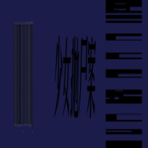

-dasoiwjajkvgrt=-//1
============================

|  |  |
| :--: | :-- |
| [ -dasoiwjajkvgrt=-//1](https://emumo.xiami.com/album/2104081822) | **艺人**: [少女抛尸案](../index.md) **语种**: 其他 **唱片公司**: 独立发行 **发行时间**: 2018年10月05日 **专辑类别**: EP, 单曲 **专辑风格**: 红歌 Red Song **播放数**: 7526 **收藏数**: 14 **评论数**: 9  |

## 简介

 无限补齐

## 曲目

## 评论

|  |  |  |
| :-- | :-- | :-- |
|  [虾米用户](https://emumo.xiami.com/u/47074231) “这个世界显然不是满足愿... 2018-10-15 10:05 赞(0) 踩(0) | 
红歌哈哈哈哈哈哈
 |
|  [虾米用户](https://emumo.xiami.com/u/6076438) 起身見頭暈，行路打倒褪。... 2018-10-08 02:56 赞(1) 踩(0) | 
0..0
 |
|  [虾米用户](https://emumo.xiami.com/u/17146554) weibo：@L1RRO... 2018-10-08 01:50 赞(0) 踩(0) | 
/
 |
|  [虾米用户](https://emumo.xiami.com/u/73857918) 在黎明之前 2018-10-05 12:45 赞(2) 踩(0) | 
你开你的叮叮车，我坐我的飞飞鱼
 |
|  [虾米用户](https://emumo.xiami.com/u/346492287) 虾米不要离开我！ 2018-10-05 11:33 赞(0) 踩(0) | 

 |
|  [虾米用户](https://emumo.xiami.com/u/291631232) 我还没想好要写什么... 2018-10-05 10:01 赞(0) 踩(0) | 
来了
 |
|  [虾米用户](https://emumo.xiami.com/u/339191478)   2018-10-05 09:59 赞(0) 踩(0) | 
❤
 |
|  [虾米用户](https://emumo.xiami.com/u/325763180) 我还没想好要写什么... 2018-10-05 09:42 赞(0) 踩(0) | 

 |
|  [虾米用户](https://emumo.xiami.com/u/181162018) fxxk off 2018-10-05 09:41 赞(0) 踩(0) | 
第一！
 |
