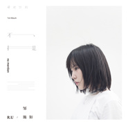

不提
============================

|  |  |
| :--: | :-- |
| [ 不提](https://emumo.xiami.com/album/2103689157) | **艺人**: [邹施如](../index.md) **语种**: 国语 **唱片公司**: 虾米音乐人 **发行时间**: 2018年04月19日 **专辑类别**: 录音室专辑 **专辑风格**: 国语流行 Mandarin Pop, 华语唱作人 Chinese Singer-Songwriter **播放数**: 12141617 **收藏数**: 2804 **评论数**: 153  |

## 简介

已经忘了多久之前  
被一首华语流行歌曲打动  
在歌词逐渐被旋律省略的今天  
你一次次点开陌生的歌单  
播放然后关闭  
  
为何不给自己点空白  
打开这张专辑  
缓缓聆听循环  
相信你能寻到久违的感动  
因为有一种音乐  
能直接走进你的心  
  
这一种音乐里有  
邹施如  
  
  
听一张失恋  
  
邹施如自己也没有想到，因为一场失恋，让她写出了第一首正式的原创作品《线形关系》。更没有想到的是，因为上传这首新歌顺手点了虾米音乐寻光计划第二季的报名按钮，她的这首《线形关系》竟最终以评委组与用户组双双高票胜出，获得评委台湾知名音乐人黄玠的高度赞扬，甚至连华裔电子音乐人ZHU都“跨界”点赞。  
  
“每一段关系从最开始的时候，就像简单的一条线，或许直接或许缠绕曲折。可不管怎样改变，它只是一条线。原本是想写一首歌告别这段关系，结果成了我的代表作，好像很多事情都是这样，不管有多想剪断，那‘一条线’就是会永远的连接。”在获胜时的采访里，邹施如是这样形容。  
  
胜出的那一刻，一个新的任务诞生，她要不到5个月里，从无到有，完成人生第一张原创专辑。然而做一首歌和统筹一张专辑完全不一样。邹施如翻出电脑文件夹里零散的草稿、构思唱成整曲的样子、想象专辑每首歌的画面、一边模拟封面里自己的状态、一边敲心仪的制作人档期联系录音棚时间。边做边写，推翻重来，争吵妥协，北京长沙。最终沉淀为专辑里的9首歌。  
  
就像也许一夜之间，你决定离开你爱的那个并不爱你的人。然而接下来并不是闺蜜倾诉彻夜痛饮，或者独自开车面朝大海边哭边喊。现实版的失恋故事，可能完全没有时间伤心，擦干眼泪，打开APP联系搬家租房，然后签合同、清扫粉刷、添置家具、锅碗调盆，几乎无法喘气的忙碌填满了时间。直到有一天的早晨，你对着镜子发现，昨天的自己早已清理出门。  
  
“这张专辑里面，有着一段爱情从开始到结束的全部”邹施如回头端详这来之不易的9首歌曲：“如果要用一个标题，我希望是《不提》”。  
  
  
听一张成长  
  
邹施如来自湖南长沙，自幼学习民族、戏曲，后自觉不适合，磕磕撞撞，最后选择了走上流行音乐的道路。凭借这一把入耳舒爽的极具辨识度的好嗓音，邹施如曾因参加歌唱比赛被多家老牌娱乐公司相中，后因学业放弃发片机会，最终还是回归了独立唱作歌手身份，直到认识叶进贤。  
  
如果没有遇到这位来自马来西亚的音乐人，邹施如也许就没有《线形关系》这首歌，更不提之后的这一切。叶进贤曾经是与梁静茹、方炯镔一起出道的歌手，但最终成为一名制作人，邹施如形容他为“正能量的良师益友”，一路指引她去做自己。因为叶进贤的介绍，邹施如认识了当时同样是小朋友的伍昊予，一拍即合成为好友，从此成为默契十足的音乐搭档，一晃就是数十年。  
  
最终，《不提》就是由这三位音乐人一同塑造而成，其中邹施如包揽几乎所有的词曲，伍昊予负责编曲制作，叶进贤完成后期工程，也有众多知名乐手、音乐人献力其中。专辑动机始于《线形关系》，闪回着热恋的《你》、不舍的《雨夜》、绝决的《差一点晴朗》、顿悟的《过往》、倔强的《独自站立》，最终落笔《不提》，9首作品各有独特的面貌，又一气呵成融为一体。专辑还特别收录邹施如写给过世爷爷的《永恒的星星》，而好友伍昊予还在《过往》中特别献声。  
  
回到特别策划的专辑封面，是《线形关系》里的深蓝，渐渐褪去阴霾，露出剔透全新新的纯白。热恋失恋、憎恨醒悟、挫折成长，不用再提，一切都在这30多分钟的音乐里。  
  
邹施如：感恩每一位在幕后为我付出老师、伙伴，谢谢你们给我全然的爱，我爱你们！  
  
出品：虾米音乐寻光计划/邹施如  
发行时间：2018.4.19  
唱片编号：XA-022  
  
制作人：叶进贤/伍昊予/邹施如  
监制：邹施如  
作词：邹施如/伍昊予  
作曲：邹施如/伍昊予  
演唱：邹施如  
编曲：伍昊予/Nai Kong  
键盘：Suwon  
吉它：伍昊予/牛晖/Sham/  
贝斯：JungTae Kim  
鼓：Jason Meekins/John Thomas/Derrick Siow/  
弦乐编写：雷震  
弦乐：国际首席爱乐乐团  
和声编写：伍昊予  
和声：伍昊予/邹施如  
录音师：刘子达/叶进贤/陈晓磊/何欣/叶晓  
录音室：Banner Music Base/Zen at BD Studio Beijing/Kong Studio/DB Audio Studio@changsha  
混音师：叶进贤/mAjorHon  
母带后期处理：叶进贤  
  
企划/文案 ：邹施如/赵宗  
平面设计：Annsey赵宏韬  
平面摄影：Ethan向果/靖杰/赵斌  
造型/化妆：邹施如  
MV拍摄：腔调广告《独自站立》  
实体发行：星外星音乐  
海外数字发行：风潮音乐  
  
  
  
关于寻光计划  
  
他们在跟风，你在亲手制造未来。寻光计划是虾米音乐对平台内独立音乐人的全面扶持计划，旨通过互联网用户的喜好选择、专家媒体敏锐的嗅觉，挖掘出所有尚未崛起的年轻新锐之声，以各种方式帮助他们发出耀眼光芒。  
  
第二季寻光计划主题为“寻找未曝光少年”，意想让真正代表独立音乐之未来的音乐人被更多对的人听到，让未现之光得以有释放无畏的能量。无论他们现在身在何方，在过着怎样的人生。或许他们现在并不完美，但Leonard Cohen说过：万物皆有缝隙，那是光照进来的地方。  
  
最终胜出的SHAWEE、邹施如、方拾贰、KWORLD、GALI、何小河、WAV乐队、SARAH、未来星、阿图什冲浪男孩等10位音乐人，会在2018年的4月起陆续发布正式的首张原创个人专辑，并全球同步数字发行。 

## 曲目

## 评论

|  |  |  |
| :-- | :-- | :-- |
|  [虾米用户](https://emumo.xiami.com/u/263625478)  2020-11-17 23:51 赞(0) 踩(0) | 
邹施如的出专辑速度快追平lorde了。。。你俩是迷失在音乐的迷幻森林里了吗
 |
|  [虾米用户](https://emumo.xiami.com/u/324422924) 帅到不用签名 2020-07-31 18:49 赞(1) 踩(0) | 
好听，词也很棒
 |
|  [虾米用户](https://emumo.xiami.com/u/352984766)  2020-05-22 22:52 赞(1) 踩(0) | 
质量超级高
 |
|  [虾米用户](https://emumo.xiami.com/u/282232520) 帅。 2019-10-03 15:25 赞(1) 踩(0) | 
宝藏歌曲
 |
|  [虾米用户](https://emumo.xiami.com/u/423924402)  2019-08-01 15:12 赞(0) 踩(0) | 
希望有新歌发布哦
 |
|  [虾米用户](https://emumo.xiami.com/u/352984766)  2019-07-29 08:14 赞(0) 踩(0) | 
超级喜欢，百听不厌？！！！
 |
|  [虾米用户](https://emumo.xiami.com/u/20138836) 这家伙很懒，什么都不想写... 2019-07-06 21:01 赞(0) 踩(0) | 
邹施如的声音很好听，听了有种恋爱的感jio！我想说音乐风格很独特，像女版方大同，并没有不尊重歌手的意思哦！加油！超级超级喜欢！
 |
|  [虾米用户](https://emumo.xiami.com/u/47499525) 汀酱的吉桑 2019-07-02 11:38 赞(0) 踩(0) | 
想要买实体砖
 |
|  [虾米用户](https://emumo.xiami.com/u/47499525) 汀酱的吉桑 2019-07-02 11:37 赞(0) 踩(0) | 
超级超级喜欢
 |
|  [虾米用户](https://emumo.xiami.com/u/20138836) 这家伙很懒，什么都不想写... 2019-06-26 01:09 赞(0) 踩(0) | 
很好听，真的做的超级棒！期待以后的专辑，加油！
 |
|  [虾米用户](https://emumo.xiami.com/u/425518751)  2019-06-14 23:13 赞(0) 踩(0) | 
人总得明白一个道理，别总是掏心掏肺的去对待每一个人，总有一瞬间，让你突然就死了心。 总有一些态度，让你突然伤了心。 总有一些语气，让你突然就酸了心。 总有一些行为，让你突然就寒了心。 总有一些事情，让你不经意中，看透了一颗心。 别太高估自己在别人心里的位置，也许你在别人眼里什么都不是。 有时候付出的多了，反而低贱的被人看扁了，不是谁都认识“珍惜”两个字！！！
 |
|  [虾米用户](https://emumo.xiami.com/u/51690941)   2019-05-28 01:19 赞(0) 踩(0) | 
什么时候出实体。
 |
|  [虾米用户](https://emumo.xiami.com/u/695987) 我还没想好要写什么... 2019-05-01 02:17 赞(0) 踩(0) | 
一种安静的力量
 |
|  [虾米用户](https://emumo.xiami.com/u/346606736) 目成心许 2019-04-26 19:30 赞(0) 踩(0) | 
个人感觉声音好听  但是旋律一般般呢
 |
| ⇒ |  [虾米用户](https://emumo.xiami.com/u/4771470) 暂无签名~ 2020-05-30 13:39 赞(0) 踩(0) | 
你说反了 但是声音也好听 只是旋律实在太惊艳
 |
|  [虾米用户](https://emumo.xiami.com/u/495958) 暂无签名~ 2019-04-19 07:20 赞(0) 踩(0) | 
难得的好专辑！
 |
|  [虾米用户](https://emumo.xiami.com/u/319816380)  2019-04-11 21:59 赞(0) 踩(0) | 
好喜欢你的音乐
 |
|  [虾米用户](https://emumo.xiami.com/u/257367673) 我还没想好要写什么... 2019-04-09 17:22 赞(0) 踩(0) | 
好听不能停下来
 |
|  [虾米用户](https://emumo.xiami.com/u/420027432)  2019-03-30 19:30 赞(0) 踩(0) | 
能从中听出自己经历的音乐，就是好音乐
 |
|  [虾米用户](https://emumo.xiami.com/u/420023594)  2019-03-12 23:03 赞(0) 踩(0) | 
特别好听
 |
|  [虾米用户](https://emumo.xiami.com/u/420346429)  2019-03-08 21:49 赞(0) 踩(0) | 
666
 |
|  [虾米用户](https://emumo.xiami.com/u/96636718) 所謂風格 要獨特都要代價 2019-03-07 11:28 赞(0) 踩(0) | 
哪里买的到实体
 |
|  [虾米用户](https://emumo.xiami.com/u/416000929)  2019-02-19 22:57 赞(0) 踩(0) | 
给力
 |
|  [虾米用户](https://emumo.xiami.com/u/263625478)  2019-01-31 20:23 赞(0) 踩(0) | 
暖
 |
|  [虾米用户](https://emumo.xiami.com/u/140899054)  2019-01-10 19:27 赞(0) 踩(0) | 
听得骨头都酥了 
 |
|  [虾米用户](https://emumo.xiami.com/u/301894089)  2019-01-05 23:51 赞(0) 踩(0) | 
还不错
 |
|  [虾米用户](https://emumo.xiami.com/u/868146)  2018-10-24 11:26 赞(0) 踩(0) | 
8、9
 |
|  [虾米用户](https://emumo.xiami.com/u/122981928) 玫瑰❤️❤️❤️ 2018-10-14 23:02 赞(1) 踩(0) | 
质量很好的专辑
 |
|  [虾米用户](https://emumo.xiami.com/u/376332909) 我们都有看不见的朋友，夜... 2018-07-22 16:41 赞(2) 踩(0) | 
整部专辑的歌曲质量都很高。不过整体上最喜欢中间的&amp;ldquo;你&amp;rdquo;，因为是唯一一首甜蜜的歌吧，其余的歌曲都充满了淡淡的思愁和期待。到了我这个年纪只想多一些甜蜜了。很期待邹施如的下一张专辑。
 |
|  [虾米用户](https://emumo.xiami.com/u/377924436)  2018-07-07 22:27 赞(0) 踩(0) | 
******
 |
|  [虾米用户](https://emumo.xiami.com/u/6848745)  2018-06-20 09:20 赞(0) 踩(0) | 
明日可期
 |
|  [虾米用户](https://emumo.xiami.com/u/21182456) 谁打捞我的尸体 谁看我的... 2018-06-01 10:45 赞(0) 踩(0) | 
超级棒！
 |
|  [虾米用户](https://emumo.xiami.com/u/4771470) 暂无签名~ 2018-05-20 14:39 赞(1) 踩(0) | 
很好听，相当耐听，有自己想法，但又不做作。
 |
|  [虾米用户](https://emumo.xiami.com/u/359368921)  2018-05-18 08:59 赞(0) 踩(0) | 
这几年唯一能接受和喜欢的新歌手。
 |
|  [虾米用户](https://emumo.xiami.com/u/44501338)   2018-05-10 09:34 赞(0) 踩(0) | 
很棒哦 真的 一耳朵吸引
 |
|  [虾米用户](https://emumo.xiami.com/u/492358)  2018-05-09 19:29 赞(0) 踩(0) | 
很棒，很认真的专辑
 |
|  [虾米用户](https://emumo.xiami.com/u/316004052)  2018-05-04 10:50 赞(1) 踩(0) | 
听了不提   我是感动到了
 |
|  [虾米用户](https://emumo.xiami.com/u/17816196) 暂无签名~ 2018-05-01 18:19 赞(1) 踩(0) | 
我现在在超现场听到
 |
|  [虾米用户](https://emumo.xiami.com/u/114312394) 然后呢？一起走吧 2018-04-29 22:36 赞(0) 踩(0) | 
小姐姐很棒啊 潜力无限看好你
 |
|  [虾米用户](https://emumo.xiami.com/u/48935681) 樓閣新晨花欲語，夢中誰是... 2018-04-28 07:38 赞(0) 踩(0) | 
还不错
 |
|  [虾米用户](https://emumo.xiami.com/u/647008) 性格伴乐同奏  心境随曲... 2018-04-28 00:56 赞(0) 踩(0) | 
创作音乐人必须支持，不过想吐槽一下编曲，配器感觉比较简单，配乐与主旋律呼应不够，略显单薄，不够丰满，否则整张专辑还可提高一个档次。作曲尽管在细节上有些生涩，但已不能要求更多。希望继续努力，期待新专。纯属个人意见，不喜勿喷～   
 |
| ⇒ |  [虾米用户](https://emumo.xiami.com/u/492358)  2018-05-09 19:16 赞(0) 踩(0) | 
编曲不见得需要丰满，这种风格的已经很好了，合适风格的编曲更好
 |
| ⇒ |  [虾米用户](https://emumo.xiami.com/u/647008) 性格伴乐同奏  心境随曲... 2018-05-09 20:21 赞(0) 踩(0) | 
<q><b>艾姆纳米说：</b></q>
 |
| ⇒ |  [虾米用户](https://emumo.xiami.com/u/492358)  2018-05-10 21:33 赞(0) 踩(0) | 
<q><b>深的蓝说：</b></q>
 |
| ⇒ |  [虾米用户](https://emumo.xiami.com/u/4771470) 暂无签名~ 2018-05-20 14:38 赞(0) 踩(0) | 
<q><b>艾姆纳米说：</b></q>
 |
| ⇒ |  [虾米用户](https://emumo.xiami.com/u/376332909) 我们都有看不见的朋友，夜... 2018-07-22 16:35 赞(0) 踩(0) | 
&amp;quot;配乐与主旋律呼应不够&amp;quot;什么鬼？
 |
|  [虾米用户](https://emumo.xiami.com/u/1799007) 呵呵 2018-04-26 23:21 赞(0) 踩(0) | 
棒！
 |
|  [虾米用户](https://emumo.xiami.com/u/297476491)  2018-04-26 13:57 赞(1) 踩(0) | 
做海报的人厉害
 |
|  [虾米用户](https://emumo.xiami.com/u/216867) 无垠无涯的蓝 2018-04-23 11:08 赞(1) 踩(0) | 
邹姑娘 感谢你带来的惊喜。
 |
|  [虾米用户](https://emumo.xiami.com/u/335832741) 我还没想好要写什么... 2018-04-21 23:36 赞(1) 踩(0) | 
支持
 |
|  [虾米用户](https://emumo.xiami.com/u/341954944)  2018-04-21 23:34 赞(1) 踩(0) | 
你的声音太有吸引力了 挺你
 |
|  [虾米用户](https://emumo.xiami.com/u/292514924)  2018-04-21 23:31 赞(1) 踩(0) | 
把低频去掉！
 |
|  [虾米用户](https://emumo.xiami.com/u/51741278)  2018-04-21 23:27 赞(0) 踩(0) | 
邹施如的声音越听越有感觉，声线识别度很高，我喜欢这种感觉
 |
|  [虾米用户](https://emumo.xiami.com/u/6826803)   2018-04-21 22:07 赞(4) 踩(0) | 
每一首歌 都好喜欢 越听越好听 不经意间 已经分享了4首歌到朋友圈了  循环这张专辑 听了一天❤️
 |
|  [虾米用户](https://emumo.xiami.com/u/324016248) 有时候你不努力一把，你都... 2018-04-21 21:48 赞(4) 踩(0) | 
关于情关于你，关于回忆已经来不及，关于现在的我们不是我和你，碎的彻底&amp;hellip;&amp;hellip;‭　　⃢━⃢
 |
|  [虾米用户](https://emumo.xiami.com/u/1930130) 一个真实的人 2018-04-21 21:34 赞(2) 踩(0) | 
理性评价
 |
|  [虾米用户](https://emumo.xiami.com/u/287113952) 吼~吼~吼~ 2018-04-21 21:32 赞(1) 踩(0) | 
邹泉，邹歆媛，邹星羽。邹氏家族
 |
|  [虾米用户](https://emumo.xiami.com/u/29141779) 福祸自求 2018-04-21 20:57 赞(5) 踩(0) | 
虾米总是给我带来惊喜，先是陈璧，接着是陈粒，现在是邹施如。
 |
|  [虾米用户](https://emumo.xiami.com/u/36598085)   2018-04-21 20:26 赞(2) 踩(0) | 
为什么大陆女歌手专辑封面都要走这样的非主流路线？
 |
| ⇒ |  [虾米用户](https://emumo.xiami.com/u/177749976) 我还没想好要写什么... 2018-04-30 04:17 赞(0) 踩(0) | 
期待你专辑的封面
 |
| ⇒ |  [虾米用户](https://emumo.xiami.com/u/3420821) 我还没想好要写什么... 2019-05-29 15:30 赞(0) 踩(0) | 
<q><b>leafbox说：</b></q>
 |
| ⇒ |  [虾米用户](https://emumo.xiami.com/u/177749976) 我还没想好要写什么... 2019-05-29 15:52 赞(0) 踩(0) | 
<q><b>邹施如说：</b></q>
 |
|  [虾米用户](https://emumo.xiami.com/u/4380308) 宇宙里有什么不是暂时？ 2018-04-21 20:05 赞(2) 踩(0) | 
相片以为是邵夷贝。
 |
|  [虾米用户](https://emumo.xiami.com/u/333340231) 我还没想好要写什么... 2018-04-21 19:57 赞(1) 踩(0) | 
小姐姐好棒，加油
 |
|  [虾米用户](https://emumo.xiami.com/u/268973688)  2018-04-21 18:50 赞(4) 踩(0) | 
小姐姐好好看，侧面深深吸引了我 
 |
|  [虾米用户](https://emumo.xiami.com/u/352382600) 其实路在脚下 2018-04-21 18:48 赞(1) 踩(0) | 
声音好听
 |
|  [虾米用户](https://emumo.xiami.com/u/43830865) VON. 2018-04-21 18:27 赞(1) 踩(0) | 
嗓音还不错，曲风让人舒服，喜欢 
 |
|  [虾米用户](https://emumo.xiami.com/u/199539731) 快乐的就是我 2018-04-21 18:13 赞(0) 踩(0) | 
我很看好她
 |
|  [虾米用户](https://emumo.xiami.com/u/23543797) 我还没想好要写什么... 2018-04-21 17:03 赞(2) 踩(0) | 
好像本兮
 |
|  [虾米用户](https://emumo.xiami.com/u/346755875) 走吧 2018-04-21 16:53 赞(2) 踩(0) | 
内心很柔软，嘟嘟嘟
 |
|  [虾米用户](https://emumo.xiami.com/u/330903846)  2018-04-21 16:13 赞(3) 踩(0) | 
她的歌真的没有雷点 都太好听了！
 |
|  [虾米用户](https://emumo.xiami.com/u/54725780) 帅伟 2018-04-21 15:21 赞(1) 踩(0) | 
不错不错
 |
|  [虾米用户](https://emumo.xiami.com/u/345172835) 不念过往，不畏将来 2018-04-21 15:00 赞(1) 踩(0) | 
质量真的高，每首歌都很好听
 |
|  [虾米用户](https://emumo.xiami.com/u/87525078)   2018-04-21 13:40 赞(0) 踩(0) | 
好听
 |
|  [虾米用户](https://emumo.xiami.com/u/42061164) swagggggggg 2018-04-21 12:57 赞(4) 踩(0) | 
短发女人也可以性感和可爱
 |
|  [虾米用户](https://emumo.xiami.com/u/109019164) GOODBYE 2018-04-21 12:33 赞(0) 踩(0) | 
明明可以靠颜值取胜的
 |
|  [虾米用户](https://emumo.xiami.com/u/130878584)  2018-04-21 11:39 赞(0) 踩(0) | 
蛮喜欢她的歌
 |
|  [虾米用户](https://emumo.xiami.com/u/277941113) 一切人类文化活动，都是为... 2018-04-21 11:33 赞(4) 踩(0) | 
这发型好喜欢啊
 |
|  [虾米用户](https://emumo.xiami.com/u/33166351)  2018-04-21 10:25 赞(3) 踩(0) | 
侧脸好像冲田老师&amp;hellip;&amp;hellip;&amp;hellip;&amp;hellip; 
 |
|  [虾米用户](https://emumo.xiami.com/u/1930130) 一个真实的人 2018-04-21 10:18 赞(38) 踩(0) | 
一个阿克江，一个邹施如，还有一个唱Rap《我是李小龙》的，一次挖了三个真正的音乐人。虾米在考虑市场制作的情况下，不要把这三个人做臭掉。
 |
| ⇒ |  [虾米用户](https://emumo.xiami.com/u/317152737)  2018-04-22 01:14 赞(0) 踩(0) | 
呃
 |
| ⇒ |  [虾米用户](https://emumo.xiami.com/u/317152737)  2018-04-22 01:14 赞(0) 踩(0) | 
呃
 |
| ⇒ |  [虾米用户](https://emumo.xiami.com/u/317152737)  2018-04-22 01:15 赞(0) 踩(0) | 
饿
 |
|  [虾米用户](https://emumo.xiami.com/u/358288214)  2018-04-21 09:35 赞(4) 踩(0) | 
好！
 |
|  [虾米用户](https://emumo.xiami.com/u/11858601) 被斥力吸进参宿四 2018-04-21 09:22 赞(14) 踩(0) | 
这封面真不是邵夷贝？？
 |
| ⇒ |  [虾米用户](https://emumo.xiami.com/u/5694660) 暂无签名~ 2018-04-21 23:02 赞(0) 踩(0) | 
第一反应也是邵夷贝
 |
|  [虾米用户](https://emumo.xiami.com/u/22906024) 岂能尽如人意  但求无愧... 2018-04-21 05:55 赞(10) 踩(0) | 
关于情关于你，关于回忆已经来不及，关于现在的我们不是我和你，碎的彻底&amp;hellip;&amp;hellip;
 |
|  [虾米用户](https://emumo.xiami.com/u/150644716) 我和我的赘肉，一刻也不能... 2018-04-21 03:55 赞(5) 踩(0) | 
壶在哪？
 |
|  [虾米用户](https://emumo.xiami.com/u/42364980) 你的孤独，虽败犹荣。 2018-04-21 03:01 赞(8) 踩(0) | 
我不管你们说什么，这张专辑我就是超级喜欢！
 |
|  [虾米用户](https://emumo.xiami.com/u/175520786) 乌 2018-04-21 01:28 赞(3) 踩(0) | 
好听的
 |
|  [虾米用户](https://emumo.xiami.com/u/3779414) good job 2018-04-21 01:06 赞(10) 踩(0) | 
看封面写的是柔软女声。。小编你特么是耳朵瞎？？
 |
| ⇒ |  [虾米用户](https://emumo.xiami.com/u/1154943) 嬲 2018-04-21 11:46 赞(0) 踩(0) | 
嗯？一直用的是柔软啊，在刚选出来的时候就是这个词了
 |
|  [虾米用户](https://emumo.xiami.com/u/126369654) 谁说要庞大，才能够伟大，... 2018-04-21 00:57 赞(10) 踩(0) | 
内容已删除
 |
| ⇒ |  [虾米用户](https://emumo.xiami.com/u/277941113) 一切人类文化活动，都是为... 2018-04-21 11:36 赞(0) 踩(0) | 
从来没有习惯流行情歌
 |
|  [虾米用户](https://emumo.xiami.com/u/4282340)  2018-04-21 00:30 赞(11) 踩(0) | 
一般般啊， 哪里有这么夸张，比起上一届的还是差一点吧
 |
|  [虾米用户](https://emumo.xiami.com/u/322104425)  2018-04-20 22:37 赞(6) 踩(0) | 
瞬间击中内心，小姐姐超好听
 |
|  [虾米用户](https://emumo.xiami.com/u/338635986)  2018-04-20 21:16 赞(1) 踩(0) | 
很好
 |
|  [虾米用户](https://emumo.xiami.com/u/34721574) (((((()))))) 2018-04-20 14:31 赞(4) 踩(0) | 
可以循環的專輯 &amp;lt;3
 |
|  [虾米用户](https://emumo.xiami.com/u/287672891) 我还没想好要写什么... 2018-04-20 12:32 赞(1) 踩(0) | 
喜欢
 |
|  [虾米用户](https://emumo.xiami.com/u/135725906)  2018-04-20 10:29 赞(2) 踩(0) | 
真的好好听，下载了每一首歌！
 |
|  [虾米用户](https://emumo.xiami.com/u/263266019)  2018-04-20 10:08 赞(2) 踩(0) | 
嗓音条件不错，但是可能为了保持磁性的感觉编曲基本避免高音，以至于太平了，就感觉听完了觉得不错但是又记不起
 |
|  [虾米用户](https://emumo.xiami.com/u/96636718) 所謂風格 要獨特都要代價 2018-04-20 09:47 赞(1) 踩(0) | 
声音有点吴汶芳的味道
 |
|  [虾米用户](https://emumo.xiami.com/u/331501834)  2018-04-19 23:30 赞(3) 踩(0) | 
风格挺明显 ，离脍炙人口还有差距
 |
|  [虾米用户](https://emumo.xiami.com/u/281561370)  2018-04-19 23:02 赞(2) 踩(0) | 
666
 |
| ⇒ |  [虾米用户](https://emumo.xiami.com/u/281561370)  2018-04-19 23:04 赞(0) 踩(0) | 
连发！连发！连发！无法夫吸 <a href="http://act.xiami.com/wow/xiami/act/discovereddebut?tagInfo=goodID&amp;amp;_uxid=82f6c26050854541db5096840a3c7cfa#tab3" target="_blank" rel="nofollow noreferrer noopener">http://act.xiami.com/wow/xiami/act/discovereddebut?tagInfo=goodID&amp;amp;_uxid=82f6c26050854541db5096840a3c7cfa#tab3</a>
 |
|  [虾米用户](https://emumo.xiami.com/u/1930130) 一个真实的人 2018-04-19 22:34 赞(3) 踩(0) | 
算了，后面几首匆忙制作没有诚意的我自动忽略吧。不过把整体专辑评分拉低了。
 |
|  [虾米用户](https://emumo.xiami.com/u/321714515)   2018-04-19 21:23 赞(2) 踩(0) | 
真的好难得一下子有这么多好听的歌可以听
 |
|  [虾米用户](https://emumo.xiami.com/u/321714515)   2018-04-19 21:16 赞(1) 踩(0) | 
实在是太惊喜
 |
|  [虾米用户](https://emumo.xiami.com/u/5506611) 我还没想好要写什么... 2018-04-19 17:10 赞(1) 踩(0) | 
还不错
 |
|  [虾米用户](https://emumo.xiami.com/u/1154943) 嬲 2018-04-19 15:00 赞(19) 踩(0) | 
听完几遍之后，我也想跟邹妹子谈恋爱 
 |
| ⇒ |  [虾米用户](https://emumo.xiami.com/u/1113346) 你曾怀疑，别忧郁我们终将... 2018-04-19 23:09 赞(0) 踩(0) | 
所以你到底想跟哪一个谈恋爱
 |
| ⇒ |  [虾米用户](https://emumo.xiami.com/u/33783803) SY 2018-04-20 13:36 赞(0) 踩(0) | 
<q><b>囍寶说：</b></q>
 |
| ⇒ |  [虾米用户](https://emumo.xiami.com/u/1154943) 嬲 2018-04-20 17:19 赞(0) 踩(0) | 
<q><b>囍寶说：</b></q>
 |
| ⇒ |  [虾米用户](https://emumo.xiami.com/u/41284147) 我就是你要找的贱人 2018-05-10 10:41 赞(0) 踩(0) | 
一次寻光之后，这位先生的恋情对象未免有点太多了吧！
 |
|  [虾米用户](https://emumo.xiami.com/u/97910870) 生活没有音乐是不行的，是... 2018-04-19 14:48 赞(2) 踩(0) | 
纯好午后阳光下细细听来
 |
|  [虾米用户](https://emumo.xiami.com/u/68630552) This above a... 2018-04-19 14:02 赞(4) 踩(0) | 
恭喜恭喜！
 |
|  [虾米用户](https://emumo.xiami.com/u/5429478) 唯有音乐和亲情不可遗落！ 2018-04-19 13:58 赞(49) 踩(0) | 
真的太好听了。整张专辑都很棒，粗略听一遍忍不住收藏，接下来会好好听！
 |
|  [虾米用户](https://emumo.xiami.com/u/47355043)  2018-04-19 13:15 赞(2) 踩(0) | 
我感觉我爱上这个小妹妹啦
 |
|  [虾米用户](https://emumo.xiami.com/u/43089386) 我爱羊仔 2018-04-19 13:05 赞(2) 踩(0) | 
chong tian xing li
 |
|  [虾米用户](https://emumo.xiami.com/u/335088772)  2018-04-19 11:47 赞(1) 踩(0) | 
蛮好蛮好
 |
|  [虾米用户](https://emumo.xiami.com/u/289168650) 要有梦想 即使远方 2018-04-19 11:27 赞(1) 踩(0) | 
超好听 喜欢小姐姐
 |
|  [虾米用户](https://emumo.xiami.com/u/8415029) 一颗苹果的人生海海。 2018-04-19 11:15 赞(2) 踩(0) | 
所有歌曲听起来都很舒服～加油～ 
 |
|  [虾米用户](https://emumo.xiami.com/u/335260885) 没有人能用纸包火的技术去... 2018-04-19 11:04 赞(1) 踩(0) | 
加油加油
 |
|  [虾米用户](https://emumo.xiami.com/u/48935681) 樓閣新晨花欲語，夢中誰是... 2018-04-19 10:40 赞(1) 踩(0) | 
还行
 |
|  [虾米用户](https://emumo.xiami.com/u/41284147) 我就是你要找的贱人 2018-04-19 09:21 赞(1) 踩(0) | 
喜欢线形关系!
 |
|  [虾米用户](https://emumo.xiami.com/u/52432812) 什么乱七八糟的歌都听 2018-04-19 08:56 赞(2) 踩(0) | 
之前喜欢上了差一点晴朗，看到有完整专辑就赶紧跑来，声音好舒服，表白编曲和声音超搭
 |
|  [虾米用户](https://emumo.xiami.com/u/8264062)  2018-04-19 08:56 赞(2) 踩(0) | 
一九很好听，其它没感觉，加油！
 |
|  [虾米用户](https://emumo.xiami.com/u/2154872) 新浪潮/后朋克  2018-04-19 08:43 赞(2) 踩(0) | 
我滴天啊 这得让多少歌手望尘莫及啊&amp;hellip;&amp;hellip;邹施如这张整体性很强，作曲编曲的功力太牛
 |
|  [虾米用户](https://emumo.xiami.com/u/109019164) GOODBYE 2018-04-19 08:06 赞(1) 踩(0) | 
怒送180个赞
 |
|  [虾米用户](https://emumo.xiami.com/u/124515996)  2018-04-19 07:42 赞(1) 踩(0) | 
嘻嘻嘻
 |
|  [虾米用户](https://emumo.xiami.com/u/30231995) 暂无签名~ 2018-04-19 07:30 赞(2) 踩(0) | 
作为歌手，专业性有了。
 |
|  [虾米用户](https://emumo.xiami.com/u/204856414) 愿时光匆匆流去、我只在乎... 2018-04-19 06:14 赞(1) 踩(0) | 
很好听
 |
|  [虾米用户](https://emumo.xiami.com/u/276156120)  2018-04-19 01:59 赞(1) 踩(0) | 
大发大发 
 |
|  [虾米用户](https://emumo.xiami.com/u/302029673) 有你的世界，才会更精彩 2018-04-19 01:38 赞(1) 踩(0) | 
不错，期待下一张
 |
|  [虾米用户](https://emumo.xiami.com/u/89029652) 我还没想好要写什么... 2018-04-19 00:57 赞(1) 踩(0) | 
音乐不停，惊喜不断[带墨镜笑]
 |
|  [虾米用户](https://emumo.xiami.com/u/18640914) 白茶清欢无别事，碧海金阳... 2018-04-19 00:54 赞(1) 踩(0) | 

 |
|  [虾米用户](https://emumo.xiami.com/u/358994049)  2018-04-19 00:50 赞(1) 踩(0) | 
超级赞️
 |
|  [虾米用户](https://emumo.xiami.com/u/358993755)  2018-04-19 00:46 赞(2) 踩(0) | 
This is the best album ever!!!! Been waiting for so long!
 |
|  [虾米用户](https://emumo.xiami.com/u/1154943) 嬲 2018-04-19 00:43 赞(3) 踩(0) | 
啊啊啊啊啊啊啊给邹妹子摇杂铃子！
 |
|  [虾米用户](https://emumo.xiami.com/u/313444067)  2018-04-19 00:17 赞(2) 踩(0) | 
哇男朋友帅如变我的小仙女如了 
 |
|  [虾米用户](https://emumo.xiami.com/u/318132) 抠啦 2018-04-19 00:15 赞(1) 踩(0) | 
抠啦
 |
|  [虾米用户](https://emumo.xiami.com/u/53006422) 不是个好人 2018-04-19 00:14 赞(1) 踩(0) | 

 |
|  [虾米用户](https://emumo.xiami.com/u/319743720)   2018-04-19 00:13 赞(1) 踩(0) | 
    
 |
|  [虾米用户](https://emumo.xiami.com/u/358991531)  2018-04-19 00:12 赞(2) 踩(0) | 
我们来了！
 |
|  [虾米用户](https://emumo.xiami.com/u/15) 吃嘛嘛香 2018-04-19 00:06 赞(1) 踩(0) | 
噢噢噢
 |
|  [虾米用户](https://emumo.xiami.com/u/42966238) 虾米再见！我爱你！ 2018-04-19 00:06 赞(1) 踩(0) | 

 |
|  [虾米用户](https://emumo.xiami.com/u/33783803) SY 2018-04-19 00:04 赞(2) 踩(0) | 
我不管 赞我！！施如看过来！
 |
|  [虾米用户](https://emumo.xiami.com/u/66) 六楼后座 2018-04-19 00:03 赞(1) 踩(0) | 
七楼哦耶！
 |
|  [虾米用户](https://emumo.xiami.com/u/348250008)  2018-04-19 00:01 赞(2) 踩(0) | 
12:01
 |
|  [虾米用户](https://emumo.xiami.com/u/280138865) 我还没想好要写什么... 2018-04-19 00:01 赞(1) 踩(0) | 
几楼了  
 |
|  [虾米用户](https://emumo.xiami.com/u/36253461) 你快乐 所以 我快乐 2018-04-19 00:00 赞(1) 踩(0) | 
收藏了
 |
|  [虾米用户](https://emumo.xiami.com/u/2523233) 太热 2018-04-18 18:16 赞(1) 踩(0) | 
哎哟
 |
|  [虾米用户](https://emumo.xiami.com/u/49905125)  2018-04-18 17:09 赞(0) 踩(0) | 
封面为什么极简风 ，小姐姐很好看呀
 |
|  [虾米用户](https://emumo.xiami.com/u/1355706)   2018-04-18 16:29 赞(1) 踩(0) | 
一楼是我的
 |
