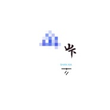

山下
============================

|  |  |
| :--: | :-- |
| [ 山下](https://emumo.xiami.com/album/2102781613) | **艺人**: [方拾贰](../index.md) **语种**: 国语 **唱片公司**: 独立发行 **发行时间**: 2017年07月12日 **专辑类别**: EP, 单曲 **专辑风格**: 当代民谣 Contemporary Folk, 当代唱作人 Contemporary Singer-Songwriter, 华语唱作人 Chinese Singer-Songwriter **播放数**: 115144 **收藏数**: 418 **评论数**: 52  |

## 简介

古人常云山上有神仙，常道世外高人都归隐山中，所以，山下的世界便是凡尘，便是人间。只羡鸳鸯不羡仙，所以来到这山下的世界，沾染人间烟火，翻山越岭，踏遍山河也要寻到你。而你比这山下一切美好的事物都要美好。无论你身在何处，请不要害怕孤身一人，我会来陪你。

## 曲目

## 评论

|  |  |  |  |
| :-- | :-- | :-- | :-- |
|  [虾米用户](https://emumo.xiami.com/u/236788346) 我们这代人涉世未深又提前... 2019-02-26 11:09 赞(1) 踩(0) | 
越听越有滋味
 |
|  [虾米用户](https://emumo.xiami.com/u/289770915)  2018-06-18 06:09 赞(3) 踩(0) | 
我的妈哎， 这丫头在唱庄子， 十二， 别告诉我你也喜欢看北冥有鱼， 我那个去啊， 太激动了。
 |
|  [虾米用户](https://emumo.xiami.com/u/317251880) 唯爱永恒 2018-05-08 09:05 赞(2) 踩(0) | 
绵薄之力，望你远行。
 |
|  [虾米用户](https://emumo.xiami.com/u/188131130)  2018-04-28 13:58 赞(1) 踩(0) | 
有没有这首歌的纯音乐
 |
|  [虾米用户](https://emumo.xiami.com/u/966562)  2018-01-04 10:38 赞(0) 踩(0) | 
后边的鼓声和音乐让我想起王啸坤的&amp;ldquo;两湾城&amp;rdquo;
 |
|  [虾米用户](https://emumo.xiami.com/u/98927) 最多12个字符。 2017-12-05 13:10 赞(1) 踩(0) | 
天秤座的女生太对味了
 |
|  [虾米用户](https://emumo.xiami.com/u/336543908) 有酒修仙  无酒参佛……... 2017-11-29 06:28 赞(0) 踩(0) | 
不想說話&amp;hellip;&amp;hellip;&amp;hellip;
 |
|  [虾米用户](https://emumo.xiami.com/u/9046285)  2017-11-22 23:07 赞(0) 踩(0) | 
喜欢，为了这么好听的声音和歌点赞
 |
|  [虾米用户](https://emumo.xiami.com/u/5482931)  2017-11-15 04:39 赞(0) 踩(0) | 
把所有夸你的评论赞了一遍，太美了
 |
|  [虾米用户](https://emumo.xiami.com/u/30800571) 无知 2017-10-08 00:08 赞(1) 踩(0) | 
好听
 |
|  [虾米用户](https://emumo.xiami.com/u/236020725) 勿扰…… 2017-09-23 11:47 赞(3) 踩(0) | 
作者的声音很干净，让人欣喜的是 她的音乐风格并不是一味的古风加民谣，其实她是个电子音乐人。难得的上品佳作，没有落入俗套 ！希望可以在电子音乐的道路上走的更好更远 ！
 |
|  [虾米用户](https://emumo.xiami.com/u/22444238) 邱比官方虾米 2017-09-04 22:30 赞(1) 踩(0) | 
GET.
 |
| ⇒ |  [虾米用户](https://emumo.xiami.com/u/95204464) 假设我思考，那么我必然存... 2017-09-04 22:34 赞(0) 踩(0) | 
你都get了一遍 
 |
|  [虾米用户](https://emumo.xiami.com/u/189297197) 愿生有去处，苍有归途 2017-08-13 11:38 赞(1) 踩(0) | 
我希望她出更多的歌
 |
|  [虾米用户](https://emumo.xiami.com/u/23841964) 音乐是解药 2017-08-01 13:40 赞(1) 踩(0) | 
单曲循环了一周依旧好听
 |
|  [虾米用户](https://emumo.xiami.com/u/300288095)  2017-07-27 21:54 赞(3) 踩(0) | 
这是首只关乎山河，风雪，爱与自由的民谣
 |
|  [虾米用户](https://emumo.xiami.com/u/314856444)  2017-07-25 15:59 赞(1) 踩(0) | 
余音袅袅，不绝如缕
 |
|  [虾米用户](https://emumo.xiami.com/u/1747221)  2017-07-22 13:40 赞(1) 踩(0) | 
静美！
 |
|  [虾米用户](https://emumo.xiami.com/u/313732604)  2017-07-20 22:44 赞(1) 踩(0) | 
支持，超棒
 |
|  [虾米用户](https://emumo.xiami.com/u/13496155) Bring it. 2017-07-19 15:14 赞(1) 踩(0) | 
非常喜欢的作品，已经支持。期待更多佳作～ 
 |
|  [虾米用户](https://emumo.xiami.com/u/72666568)  2017-07-16 20:29 赞(3) 踩(0) | 
即使落网免费。还是过来支持。微薄之力盼你远行。
 |
| ⇒ |  [虾米用户](https://emumo.xiami.com/u/95204464) 假设我思考，那么我必然存... 2017-07-16 22:22 赞(0) 踩(0) | 
谢谢你的支持。
 |
|  [虾米用户](https://emumo.xiami.com/u/277393436)  2017-07-15 08:36 赞(2) 踩(0) | 
好听，洒脱，侠义，深情，有仙气，有画面感，飘渺却娓娓道来
 |
|  [虾米用户](https://emumo.xiami.com/u/18564205)  2017-07-14 10:03 赞(1) 踩(0) | 
一个充满惊喜的歌
 |
|  [虾米用户](https://emumo.xiami.com/u/134697)  2017-07-14 09:49 赞(0) 踩(0) | 
7.12是于小姐的生日 八年了 突然又想起 ^_^
 |
|  [虾米用户](https://emumo.xiami.com/u/283858138)   2017-07-14 07:53 赞(2) 踩(0) | 
特别美
 |
|  [虾米用户](https://emumo.xiami.com/u/1837237) 8.25《沧浪亭/Can... 2017-07-13 21:49 赞(46) 踩(0) | 
我被十二绑过来夸她，她说我是个有内涵的人，得写点有内涵的话。我换了一身衣服照了半天镜子，觉得她说的没错。过不了多久，她会霸占各种排行榜，拿奖也会拿到手软，十二啊,我建议你快去健身，奖杯可沉了！有一年迷笛还发板砖，你要不提把体格练好，怎么搬砖！！！
 |
| ⇒ |  [虾米用户](https://emumo.xiami.com/u/95204464) 假设我思考，那么我必然存... 2017-07-13 22:37 赞(0) 踩(0) | 
所以你媳妇儿说你在写字原来是真的，我去网易云看了半天，没看见你来，原来你来虾米了。
 |
| ⇒ |  [虾米用户](https://emumo.xiami.com/u/49887765)  2017-07-19 06:52 赞(0) 踩(0) | 
老哥看你的评论真的要笑死我了哈哈哈哈哈哈  
 |
| ⇒ |  [虾米用户](https://emumo.xiami.com/u/1837237) 8.25《沧浪亭/Can... 2017-07-20 20:49 赞(0) 踩(0) | 
<q><b>1229说：</b></q>
 |
| ⇒ |  [虾米用户](https://emumo.xiami.com/u/49887765)  2017-07-20 21:58 赞(0) 踩(0) | 
<q><b>杨众国说：</b></q>
 |
| ⇒ |  [虾米用户](https://emumo.xiami.com/u/211616358) 若他日重逢，我将以何贺你... 2017-07-22 00:48 赞(0) 踩(0) | 
居然抓到众国兄
 |
| ⇒ |  [虾米用户](https://emumo.xiami.com/u/48096813)  2017-07-23 17:13 赞(0) 踩(0) | 
<q><b>1229说：</b></q>
 |
| ⇒ |  [虾米用户](https://emumo.xiami.com/u/49887765)  2017-07-23 22:20 赞(0) 踩(0) | 
<q><b>Kkk说：</b></q>
 |
|  [虾米用户](https://emumo.xiami.com/u/14637601)  2017-07-13 18:56 赞(1) 踩(0) | 
姐姐你卖2元钱我支持你，但你居然不提供无损的音质，我真的无法接受！
 |
| ⇒ |  [虾米用户](https://emumo.xiami.com/u/95204464) 假设我思考，那么我必然存... 2017-07-13 21:36 赞(0) 踩(0) | 
WAV的只在之前预售的数字专辑中有，谢谢你的支持。
 |
|  [虾米用户](https://emumo.xiami.com/u/247518258)   2017-07-13 09:00 赞(1) 踩(0) | 
棒棒哒
 |
|  [虾米用户](https://emumo.xiami.com/u/303165396) 世间仅此一个你呀～ 2017-07-13 08:53 赞(1) 踩(0) | 
太好听      
 |
|  [虾米用户](https://emumo.xiami.com/u/311765355)  2017-07-12 23:35 赞(1) 踩(0) | 

 |
|  [虾米用户](https://emumo.xiami.com/u/4043410) 唯夜色浪漫 2017-07-12 23:27 赞(1) 踩(0) | 
要是歌词上再完善一点就完美了
 |
|  [虾米用户](https://emumo.xiami.com/u/16206377) rabbit_❀moon 2017-07-12 23:13 赞(0) 踩(0) | 
还行
 |
|  [虾米用户](https://emumo.xiami.com/u/311737449)   2017-07-12 21:44 赞(1) 踩(0) | 
记得第一次听到你的声音 是在 网综 偶的歌神啊，到现在快三年了 真快
 |
|  [虾米用户](https://emumo.xiami.com/u/112861676)  2017-07-12 21:15 赞(1) 踩(0) | 
好听
 |
|  [虾米用户](https://emumo.xiami.com/u/123451220) 微博-家住在仙女山里的J... 2017-07-12 15:58 赞(0) 踩(0) | 
❤❤❤很高兴遇见你们有相同的眼光喜欢同一个人。
 |
|  [虾米用户](https://emumo.xiami.com/u/246943783)   2017-07-12 13:47 赞(1) 踩(0) | 
粉你了 
 |
|  [虾米用户](https://emumo.xiami.com/u/33783803) SY 2017-07-12 11:58 赞(1) 踩(0) | 
Nice
 |
|  [虾米用户](https://emumo.xiami.com/u/307853257)  2017-07-12 11:54 赞(2) 踩(0) | 
太享受
 |
|  [虾米用户](https://emumo.xiami.com/u/133205042) 南，湳，女，㵖。 2017-07-12 10:38 赞(2) 踩(0) | 
喜欢。
 |
|  [虾米用户](https://emumo.xiami.com/u/8244559)  2017-07-12 10:18 赞(2) 踩(0) | 
******
 |
|  [虾米用户](https://emumo.xiami.com/u/298477461)  2017-07-12 10:10 赞(0) 踩(0) | 
&amp;hearts;️
 |
|  [虾米用户](https://emumo.xiami.com/u/306212883)  2017-07-12 10:07 赞(1) 踩(0) | 
戳进心窝
 |
