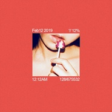

假装我们不需要呼吸
============================

|  |  |
| :--: | :-- |
| [ 假装我们不需要呼吸](https://emumo.xiami.com/album/2104591073) | **艺人**: [方拾贰](../index.md) **语种**: 国语 **唱片公司**: 独立发行 **发行时间**: 2019年02月12日 **专辑类别**: EP, 单曲 **专辑风格**: 流行 Pop, 独立流行 Indie Pop **播放数**: 1769068 **收藏数**: 175 **评论数**: 150  |

## 简介

关于“爱情”的讨论，从未停止过，当我们还在反思自己为何成为“爱无能”，另一篇宣扬真爱无敌的文章已经十万+。  
&nbsp;  
2018年的秋天，在广州飞往北京的飞机上，方拾贰写下了这首《假装我们不需要呼吸》，因为下午3点倾斜又刺眼的阳光让她感到炙热，这种炙热让她联想到爱情。“我想要表達這樣的感覺 — 當愛上一個人，當把這個人視作靈魂伴侶時，我們就不再孤單，不再是一顆孤獨的星球。”  
&nbsp;  
带着这样的想法，音乐人Soulspeak把编曲绘制成“一次寻爱的星际旅行”，歌词与编曲的互相辉映，却意外得与春节爆款科幻电影《流浪地球》有一些相似的元素。“假装我们都不需要呼吸，养分靠两人相互地换气；拥抱颗星球，浇灌这宇宙......”如果《流浪地球》里有爱情，大概也就是这样的一种情景。  
&nbsp;  
方拾贰继2018年通过寻光计划第二季推出全长专辑《拾贰》后，在平台收获千万播放量，更接连得到华语金曲奖、全球华语金曲奖、阿比鹿等奖项的肯定，作为2018年才开始正式发表作品的新人来说，已是意料之外的赞誉。在众多呼声下，方拾贰及团队筹备半年之久，于2019开年正式启动个人首次全国巡演《掘野》，从5月起至6月底，接连登录上海、北京、成都、广州等11座城市，目前限量预购票已登陆各大票务网站。  
&nbsp;  
《假装我们不需要呼吸》是方拾贰2019全新创作系列的首支歌曲，在接下来的一段时间，方拾贰会发布多首新创作的单曲，整体企划也将随着歌曲的发布逐渐清晰。这次《掘野》的全国巡演，方拾贰除了完整演绎首张专辑的经典曲目，也会带来这个全新创作系列中的未公布曲目。  
  
&nbsp;  
 

## 曲目

## 评论

|  |  |  |
| :-- | :-- | :-- |
|  [虾米用户](https://emumo.xiami.com/u/374541895) 我还没想好要写什么...... 2020-07-25 14:03 赞(0) 踩(0) | 
拥抱着你我已忘记呼吸
 |
|  [虾米用户](https://emumo.xiami.com/u/306065331) 幸福开始有人选 2020-03-07 20:32 赞(1) 踩(0) | 
在大地上，我们只过一生
 |
| ⇒ |  [虾米用户](https://emumo.xiami.com/u/376627587) 原谅我这一生不羁放纵爱自... 2020-03-07 22:10 赞(0) 踩(0) | 
有点意思
 |
|  [虾米用户](https://emumo.xiami.com/u/60344052) 我还没想好要写什么... 2020-01-09 14:27 赞(1) 踩(0) | 
俏咪咪性感的女中音，好听～
 |
|  [虾米用户](https://emumo.xiami.com/u/351746727) 我还没想好要写什么... 2019-09-14 16:38 赞(1) 踩(0) | 
好
 |
|  [虾米用户](https://emumo.xiami.com/u/273457680)  2019-08-17 11:00 赞(0) 踩(0) | 
好听
 |
|  [虾米用户](https://emumo.xiami.com/u/210881923)  2019-08-14 13:08 赞(0) 踩(0) | 
方拾贰是个才女，父母都是武汉大学的，她自己在澳门读书
 |
|  [虾米用户](https://emumo.xiami.com/u/35406987)   2019-06-23 13:01 赞(1) 踩(0) | 
很随性但又理性的唱腔
 |
|  [虾米用户](https://emumo.xiami.com/u/50427852)  2019-06-09 14:28 赞(1) 踩(0) | 
得一人共呼吸
 |
|  [虾米用户](https://emumo.xiami.com/u/333466274)  2019-06-05 22:32 赞(0) 踩(0) | 
超级喜欢，循环无数遍，太爱了
 |
|  [虾米用户](https://emumo.xiami.com/u/367009564)  2019-05-26 21:08 赞(0) 踩(0) | 
这首歌太棒了，让人有一种微醺的感觉！！！
 |
|  [虾米用户](https://emumo.xiami.com/u/197537501) 我还没想好要写什么... 2019-05-18 00:47 赞(0) 踩(0) | 
在你歌声中感觉我恋爱了
 |
|  [虾米用户](https://emumo.xiami.com/u/478527) 好想跟衣服在洗衣机里滚 2019-05-05 01:13 赞(0) 踩(0) | 
done
 |
|  [虾米用户](https://emumo.xiami.com/u/4260824) 在心脏盖高楼 2019-04-04 21:33 赞(1) 踩(0) | 
六月才来北京，不用假装我们也不需要呼吸
 |
|  [虾米用户](https://emumo.xiami.com/u/195727105) 来自宇宙的外星猫好吧～ 2019-04-01 16:25 赞(0) 踩(0) | 
好听
 |
|  [虾米用户](https://emumo.xiami.com/u/150644716) 我和我的赘肉，一刻也不能... 2019-03-31 04:00 赞(0) 踩(0) | 
好评哟！亲亲 （拉我进群！开启发财致富路……
 |
|  [虾米用户](https://emumo.xiami.com/u/332659115) 我还没想好要写什么... 2019-03-27 14:48 赞(0) 踩(0) | 
   
 |
|  [虾米用户](https://emumo.xiami.com/u/356740228)  2019-03-25 23:56 赞(0) 踩(0) | 
满分好评！
 |
|  [虾米用户](https://emumo.xiami.com/u/47997871)  2019-03-11 03:40 赞(0) 踩(0) | 
nice
 |
|  [虾米用户](https://emumo.xiami.com/u/100032950)  2019-03-10 09:30 赞(0) 踩(0) | 
zc
 |
|  [虾米用户](https://emumo.xiami.com/u/334935432)  2019-03-08 16:08 赞(0) 踩(0) | 
初恋的感觉
 |
|  [虾米用户](https://emumo.xiami.com/u/347176404)  2019-03-04 09:36 赞(0) 踩(0) | 
非常好听!
 |
|  [虾米用户](https://emumo.xiami.com/u/10365681)  2019-03-03 11:13 赞(0) 踩(0) | 
虽然打的分比实际的低了一点，但我觉得发展空间还有很大
 |
|  [虾米用户](https://emumo.xiami.com/u/333998618) 执子之手与子偕老。琴瑟在... 2019-03-02 22:22 赞(0) 踩(0) | 
太好听了
 |
|  [虾米用户](https://emumo.xiami.com/u/415798208)  2019-03-01 23:06 赞(0) 踩(0) | 
很不错呦！！！
 |
|  [虾米用户](https://emumo.xiami.com/u/297101300)  2019-02-28 23:13 赞(0) 踩(0) | 
真的超级超级喜欢！！！
 |
|  [虾米用户](https://emumo.xiami.com/u/2342226) 等你啊令令 2019-02-28 17:03 赞(0) 踩(0) | 
好，期待，个人认为目前最有希望的歌者
 |
|  [虾米用户](https://emumo.xiami.com/u/15270473) 听到喜欢的歌 身体不跟着... 2019-02-24 15:17 赞(0) 踩(0) | 
-
 |
|  [虾米用户](https://emumo.xiami.com/u/252730942) 咚咚咚，我来啦！ 2019-02-23 20:46 赞(1) 踩(0) | 
真心好听，喜欢
 |
|  [虾米用户](https://emumo.xiami.com/u/67964378) 我还没想好要写什么... 2019-02-21 21:47 赞(2) 踩(0) | 
去年知道的她，这首虾米AI推荐，一下子就让收拾行李的我停了下来
 |
|  [虾米用户](https://emumo.xiami.com/u/418620260) ❥ 白茶清欢无别事；  ... 2019-02-20 09:21 赞(2) 踩(0) | 
个人很喜欢这首歌的旋律跟歌词，声音听着很舒缓。都单曲循环半个月了，超级喜欢。
 |
|  [虾米用户](https://emumo.xiami.com/u/73638642) 再见了各位 我永远爱虾米... 2019-02-20 01:43 赞(0) 踩(0) | 
浪漫治愈
 |
|  [虾米用户](https://emumo.xiami.com/u/320547575) 磨刀霍霍向猪羊，我向马化... 2019-02-19 22:31 赞(0) 踩(0) | 
内容已删除
 |
| ⇒ |  [虾米用户](https://emumo.xiami.com/u/95204464) 假设我思考，那么我必然存... 2019-02-20 08:08 赞(0) 踩(0) | 
沒有。
 |
|  [虾米用户](https://emumo.xiami.com/u/407175841) 2020.8.8 2019-02-19 16:32 赞(0) 踩(0) | 
哟西，花姑娘！！！声音有点像那个谁？
 |
|  [虾米用户](https://emumo.xiami.com/u/60733582)  2019-02-19 12:51 赞(0) 踩(0) | 
上瘾
 |
|  [虾米用户](https://emumo.xiami.com/u/412365356)  2019-02-19 01:25 赞(0) 踩(0) | 
好听
 |
|  [虾米用户](https://emumo.xiami.com/u/410472948) 我还没想好要写什么... 2019-02-19 00:08 赞(0) 踩(0) | 
好听
 |
|  [虾米用户](https://emumo.xiami.com/u/250134899) moRose 2019-02-18 23:23 赞(0) 踩(0) | 

 |
|  [虾米用户](https://emumo.xiami.com/u/742907) 我还没想好要写什么... 2019-02-18 21:10 赞(0) 踩(0) | 
sweet
 |
|  [虾米用户](https://emumo.xiami.com/u/15786602)  2019-02-18 19:29 赞(0) 踩(0) | 
花月正春风
 |
|  [虾米用户](https://emumo.xiami.com/u/223206738)  2019-02-18 11:24 赞(0) 踩(0) | 
独爱
 |
|  [虾米用户](https://emumo.xiami.com/u/35657913) 喜欢一首歌，就让更多人一... 2019-02-17 23:09 赞(0) 踩(0) | 
好听
 |
|  [虾米用户](https://emumo.xiami.com/u/107632876) Empty Swimmi... 2019-02-17 21:45 赞(0) 踩(0) | 
一如既往的安心
 |
|  [虾米用户](https://emumo.xiami.com/u/63673530) 如果天各一方，愿你别来无... 2019-02-17 21:06 赞(0) 踩(0) | 
好听，很触动
 |
|  [虾米用户](https://emumo.xiami.com/u/51545742)  2019-02-17 16:59 赞(0) 踩(0) | 
haoting
 |
|  [虾米用户](https://emumo.xiami.com/u/44301278) 和你听一样的音乐 2019-02-17 06:44 赞(0) 踩(0) | 
假装我们都不需要呼吸 氧分靠彼此相互的换气  给喜欢的小姐姐唱了
 |
|  [虾米用户](https://emumo.xiami.com/u/186225498) 为什么要不断战斗 ？要给... 2019-02-16 17:34 赞(0) 踩(0) | 
假如
 |
|  [虾米用户](https://emumo.xiami.com/u/5493286) 。 2019-02-16 13:12 赞(0) 踩(0) | 
循环了很多遍呢
 |
|  [虾米用户](https://emumo.xiami.com/u/245649967)  2019-02-16 05:02 赞(0) 踩(0) | 
很甜很美好，封面好评。
 |
|  [虾米用户](https://emumo.xiami.com/u/353488142) 可乐 2019-02-15 23:46 赞(0) 踩(0) | 
棒！
 |
|  [虾米用户](https://emumo.xiami.com/u/44342625) Pull up your... 2019-02-15 23:40 赞(0) 踩(0) | 
独特的嗓音，很吸引人
 |
|  [虾米用户](https://emumo.xiami.com/u/6559717)  2019-02-15 19:31 赞(0) 踩(0) | 
好听
 |
|  [虾米用户](https://emumo.xiami.com/u/34753891) 山海不及你 2019-02-15 15:19 赞(1) 踩(0) | 
我有90%的烦恼  其中  10%的烦恼是因为to be or not to be  25%的烦恼是因为缺钱  而你解决了我65%的烦恼  于是我有了75%的快乐  当我把你抱在怀里，快乐上升到98%  余下的1%的烦恼是因为雪天的冷空气钻进我们的被子  最后1%的烦恼是因为怕明天你得回家
 |
|  [虾米用户](https://emumo.xiami.com/u/38969630) 如果有，就让你自由 2019-02-15 14:13 赞(0) 踩(0) | 
慵懒且甜
 |
|  [虾米用户](https://emumo.xiami.com/u/47527017) 懒散 2019-02-15 12:10 赞(0) 踩(0) | 
你真的是我的宝藏！！
 |
|  [虾米用户](https://emumo.xiami.com/u/40860845) 如你 2019-02-15 11:23 赞(0) 踩(0) | 
小情侣的甜甜蜜蜜
 |
|  [虾米用户](https://emumo.xiami.com/u/3575458) 重度精神分裂患者 2019-02-15 01:22 赞(0) 踩(0) | 
甜到心里！！！
 |
|  [虾米用户](https://emumo.xiami.com/u/119260418) 三个人的科幻摇滚 2019-02-15 01:21 赞(0) 踩(0) | 
超乎想象！
 |
|  [虾米用户](https://emumo.xiami.com/u/329521893) 唯有音乐 能创造抗体 去... 2019-02-14 23:54 赞(1) 踩(0) | 
终于上新～拾贰   
 |
|  [虾米用户](https://emumo.xiami.com/u/42208190)  2019-02-14 22:51 赞(0) 踩(0) | 
爱情开始时让所有人窒息，爱情结束时也让所有人窒息。
 |
|  [虾米用户](https://emumo.xiami.com/u/48502798)  2019-02-14 21:04 赞(0) 踩(0) | 
节奏不错
 |
|  [虾米用户](https://emumo.xiami.com/u/27759558) 一个脱离了高级文化素养的... 2019-02-14 17:42 赞(0) 踩(0) | 
内容已删除
 |
| ⇒ |  [虾米用户](https://emumo.xiami.com/u/195696246)  2019-02-14 19:45 赞(0) 踩(0) | 
你可认识字哦，名字都打错了是“拾贰（shi  er）”
 |
| ⇒ |  [虾米用户](https://emumo.xiami.com/u/195696246)  2019-02-15 09:42 赞(0) 踩(0) | 
<q><b>说：</b></q>
 |
|  [虾米用户](https://emumo.xiami.com/u/89341108) 愿一切顺利。 2019-02-14 14:29 赞(0) 踩(0) | 
节奏感还不错
 |
|  [虾米用户](https://emumo.xiami.com/u/41781422) 暂无签名~ 2019-02-14 14:15 赞(0) 踩(0) | 
超级棒！越听越有恋爱的感觉
 |
|  [虾米用户](https://emumo.xiami.com/u/348765559)  2019-02-14 11:37 赞(0) 踩(0) | 
迷幻慵懒，让人不自主的跟着鼓点陷进去然后再琴声中抽离一切
 |
|  [虾米用户](https://emumo.xiami.com/u/81807802) 舍，予。 2019-02-14 09:51 赞(0) 踩(0) | 
哦豁
 |
|  [虾米用户](https://emumo.xiami.com/u/285670391) 曾经的我贻笑大方 2019-02-14 09:34 赞(0) 踩(0) | 
奈斯
 |
|  [虾米用户](https://emumo.xiami.com/u/416907571)  2019-02-14 07:40 赞(1) 踩(0) | 
可以让你慢慢静下来感受自己的感受 如果有古筝版那就更享受了
 |
|  [虾米用户](https://emumo.xiami.com/u/2318507)  2019-02-14 07:23 赞(0) 踩(0) | 
特别好
 |
|  [虾米用户](https://emumo.xiami.com/u/18496943) 好舒服的安静 2019-02-14 00:56 赞(0) 踩(0) | 
赞！
 |
|  [虾米用户](https://emumo.xiami.com/u/349299788) 我们就要相爱 不可思愚。 2019-02-14 00:31 赞(0) 踩(0) | 

 |
|  [虾米用户](https://emumo.xiami.com/u/342329138)  2019-02-14 00:04 赞(0) 踩(0) | 
就是喜欢。
 |
|  [虾米用户](https://emumo.xiami.com/u/276092565)  2019-02-13 22:33 赞(1) 踩(0) | 
无需多言的好听
 |
|  [虾米用户](https://emumo.xiami.com/u/42079216) bong 2019-02-13 22:22 赞(0) 踩(0) | 

 |
|  [虾米用户](https://emumo.xiami.com/u/360443666)  2019-02-13 22:14 赞(0) 踩(0) | 
心平气和
 |
|  [虾米用户](https://emumo.xiami.com/u/247464944)  2019-02-13 21:53 赞(0) 踩(0) | 
给四星是因为怕骄傲√
 |
|  [虾米用户](https://emumo.xiami.com/u/270782613) 喜欢就好了 2019-02-13 21:29 赞(0) 踩(0) | 

 |
|  [虾米用户](https://emumo.xiami.com/u/123246788) Music is my ... 2019-02-13 20:54 赞(1) 踩(0) | 

 |
|  [虾米用户](https://emumo.xiami.com/u/15808073) 治疗你的失眠 治愈你的心... 2019-02-13 19:28 赞(0) 踩(0) | 
节日甜歌
 |
|  [虾米用户](https://emumo.xiami.com/u/25891560) ♪blow mymind 2019-02-13 18:07 赞(0) 踩(0) | 
单循，人间难得方拾贰
 |
|  [虾米用户](https://emumo.xiami.com/u/636300) 。 2019-02-13 16:56 赞(0) 踩(0) | 
迷恋。
 |
|  [虾米用户](https://emumo.xiami.com/u/263343487) 音乐是最好的精神良药～ 2019-02-13 16:54 赞(0) 踩(0) | 
与众不同的新风格，好听(ง •̀_•́)ง
 |
|  [虾米用户](https://emumo.xiami.com/u/280690842) 你的马子很漂亮。 2019-02-13 14:48 赞(0) 踩(0) | 
主唱的声音再清晰一点
 |
| ⇒ |  [虾米用户](https://emumo.xiami.com/u/46171337) 暂无签名~ 2019-02-13 16:21 赞(0) 踩(0) | 
要不您来示范一下。
 |
|  [虾米用户](https://emumo.xiami.com/u/407512962) 纵有困难，亦要拼命追。 2019-02-13 14:07 赞(0) 踩(0) | 
还不错
 |
|  [虾米用户](https://emumo.xiami.com/u/52556920)  2019-02-13 13:38 赞(0) 踩(0) | 
好听
 |
|  [虾米用户](https://emumo.xiami.com/u/18134263)  2019-02-13 12:59 赞(0) 踩(0) | 
听着都很舒服！
 |
|  [虾米用户](https://emumo.xiami.com/u/135971264) morvsin.lnc 2019-02-13 10:46 赞(0) 踩(0) | 
终于等到新曲了
 |
|  [虾米用户](https://emumo.xiami.com/u/37717331)   2019-02-13 09:08 赞(1) 踩(0) | 
喜欢
 |
|  [虾米用户](https://emumo.xiami.com/u/313135270) 我还没想好要写什么... 2019-02-13 08:37 赞(0) 踩(0) | 
编曲很棒 配上歌词和唱腔都一如既往的有种半仙气质 画面感强烈
 |
|  [虾米用户](https://emumo.xiami.com/u/1527637) 素琴彈復彈，會有知音知 2019-02-13 01:42 赞(0) 踩(0) | 
獨特
 |
|  [虾米用户](https://emumo.xiami.com/u/33149354) 电子游戏及炫酷音乐爱好者 2019-02-13 01:10 赞(0) 踩(0) | 
完美
 |
|  [虾米用户](https://emumo.xiami.com/u/115628982) 别走的太远，忘了当初为了... 2019-02-12 23:52 赞(0) 踩(0) | 
如此甜甜的方拾贰，是我喜欢的。
 |
|  [虾米用户](https://emumo.xiami.com/u/314990132) 这家伙很聪明 2019-02-12 23:17 赞(0) 踩(0) | 
調子溫暖舒服，甜而不膩，歌者嗓音也很吸引人，很有魅力
 |
|  [虾米用户](https://emumo.xiami.com/u/342329138)  2019-02-12 23:04 赞(0) 踩(0) | 
奕杨，你也是这样么？
 |
|  [虾米用户](https://emumo.xiami.com/u/82248268)  2019-02-12 22:35 赞(0) 踩(0) | 
有点上瘾单纯的好听
 |
|  [虾米用户](https://emumo.xiami.com/u/402387597) EPIK HIGH&LE... 2019-02-12 21:59 赞(0) 踩(0) | 
呼吸假装~与你
 |
|  [虾米用户](https://emumo.xiami.com/u/261943383) 生活里处处是艺术 2019-02-12 21:51 赞(0) 踩(0) | 
支持方拾贰小姐姐
 |
|  [虾米用户](https://emumo.xiami.com/u/96180436) 生活不易  猪猪叹气 2019-02-12 21:41 赞(0) 踩(0) | 
同款棒棒糖？ 
 |
|  [虾米用户](https://emumo.xiami.com/u/14323905) 追忆似水年华，看童时的纯... 2019-02-12 20:41 赞(0) 踩(0) | 
挺好的
 |
|  [虾米用户](https://emumo.xiami.com/u/58838294)  2019-02-12 20:04 赞(0) 踩(0) | 
好听
 |
|  [虾米用户](https://emumo.xiami.com/u/50113425)  2019-02-12 19:57 赞(0) 踩(0) | 
我个人比较喜欢歌词，满满的喜欢，至于曲调，轻缓的音乐加上渐无渐有的电子和声，总体满分！
 |
|  [虾米用户](https://emumo.xiami.com/u/50496716) 躍入煙火。 2019-02-12 19:31 赞(0) 踩(0) | 
好聽
 |
|  [虾米用户](https://emumo.xiami.com/u/1337559) 我还没想好要写什么... 2019-02-12 18:35 赞(0) 踩(0) | 
不错哟
 |
|  [虾米用户](https://emumo.xiami.com/u/15437387) 一满足 2019-02-12 18:22 赞(0) 踩(0) | 
wa
 |
|  [虾米用户](https://emumo.xiami.com/u/215698051) CHIU PI  2019-02-12 18:15 赞(0) 踩(0) | 
不一样的风格 很甜的风格
 |
|  [虾米用户](https://emumo.xiami.com/u/28408574) Going my way... 2019-02-12 17:31 赞(0) 踩(0) | 
情人节没有情人 有你
 |
|  [虾米用户](https://emumo.xiami.com/u/47479564)  2019-02-12 17:22 赞(1) 踩(0) | 
情人节礼物吗
 |
|  [虾米用户](https://emumo.xiami.com/u/253731921) 嘿. 2019-02-12 17:16 赞(1) 踩(0) | 
低吟浅唱的风格，一以贯之歌手的不多，唱出风格唱作人的更少。很有味道，加油！
 |
|  [虾米用户](https://emumo.xiami.com/u/125892570)  2019-02-12 17:03 赞(1) 踩(0) | 
希望拾贰继续尝试不同的的风格~
 |
|  [虾米用户](https://emumo.xiami.com/u/401868417) 我还没想好要写什么... 2019-02-12 16:28 赞(0) 踩(0) | 
哇哦！！！！
 |
|  [虾米用户](https://emumo.xiami.com/u/163088440) 心随乐动，自在人生！ 2019-02-12 16:28 赞(0) 踩(0) | 
❤️❤️❤️
 |
|  [虾米用户](https://emumo.xiami.com/u/163088440) 心随乐动，自在人生！ 2019-02-12 16:20 赞(0) 踩(0) | 
  
 |
|  [虾米用户](https://emumo.xiami.com/u/1271812) WX:Likejazzm... 2019-02-12 14:54 赞(0) 踩(0) | 
已被封面引诱 
 |
|  [虾米用户](https://emumo.xiami.com/u/47448978) 今晚月色真美 2019-02-12 13:48 赞(0) 踩(0) | 
很简单，很舒服，像喝一杯美酒，一口口慢慢沉醉
 |
|  [虾米用户](https://emumo.xiami.com/u/173522986) 王嘉尔的女票 2019-02-12 13:44 赞(0) 踩(0) | 
拾贰我来啦~(　ﾟ∀ﾟ) ﾉ♡
 |
|  [虾米用户](https://emumo.xiami.com/u/13775919) 再见，虾米，谢谢。 2019-02-12 13:30 赞(0) 踩(0) | 
喜欢。
 |
|  [虾米用户](https://emumo.xiami.com/u/12456097) 我还没想好要写什么... 2019-02-12 13:20 赞(1) 踩(0) | 
方老师和很多主流明星的区别是：那些人的作品发布即消失，而方老师的作品可以留给人世间细细品味。
 |
|  [虾米用户](https://emumo.xiami.com/u/308908844) 再见 2019-02-12 13:08 赞(0) 踩(0) | 

 |
|  [虾米用户](https://emumo.xiami.com/u/324498092) ‘错过’即：看不见看不... 2019-02-12 12:51 赞(0) 踩(0) | 
小方，你的音乐充满魔力，可以把人瞬间带到一个空灵、幽静、清纯而又仙境般的境界！我爱村里的姑娘小方～～方拾贰！
 |
|  [虾米用户](https://emumo.xiami.com/u/127595856)  2019-02-12 12:51 赞(0) 踩(0) | 
很棒很棒，在异地城市里，拾贰这首歌给我温暖甜蜜感觉。
 |
|  [虾米用户](https://emumo.xiami.com/u/196313669) 呵呵 2019-02-12 12:47 赞(0) 踩(0) | 
不错
 |
|  [虾米用户](https://emumo.xiami.com/u/95204464) 假设我思考，那么我必然存... 2019-02-12 12:32 赞(1) 踩(0) | 
拒絕「愛無能」
 |
|  [虾米用户](https://emumo.xiami.com/u/284510957) 疮痍的麻木 2019-02-12 12:01 赞(2) 踩(0) | 
甜，情人节礼物
 |
|  [虾米用户](https://emumo.xiami.com/u/23161745) 无情无义，没心没肺 2019-02-12 11:51 赞(1) 踩(0) | 
温暖，暖心，心动，动情
 |
|  [虾米用户](https://emumo.xiami.com/u/276769169) 静听 2019-02-12 11:51 赞(1) 踩(0) | 
单曲循环一晚....
 |
|  [虾米用户](https://emumo.xiami.com/u/350934946)  2019-02-12 11:51 赞(0) 踩(0) | 
热闹是他她们的，情人节是她他们的，情与爱是她他们的。 落日余晖是我的，光棍节是我一人的，穷和丧是我一人的。 我在熬日子，但心中渴望着世界和平。 2019.02.14
 |
|  [虾米用户](https://emumo.xiami.com/u/298245011) 弘毅去惰仁者童心 2019-02-12 11:47 赞(0) 踩(0) | 
太温柔了！治愈系
 |
|  [虾米用户](https://emumo.xiami.com/u/229838921) 嘴上的女流氓，行为上的好... 2019-02-12 11:07 赞(1) 踩(0) | 
这个情人节不孤单！很甜很甜
 |
|  [虾米用户](https://emumo.xiami.com/u/409513146)  2019-02-12 10:54 赞(0) 踩(0) | 
喜欢啊，声美词美
 |
|  [虾米用户](https://emumo.xiami.com/u/338034189) 你是简简 我是单单... 2019-02-12 09:44 赞(0) 踩(0) | 
一直有关注你的歌曲 这次的单曲很有感觉
 |
|  [虾米用户](https://emumo.xiami.com/u/223845151) _(:* ｣∠)_ 2019-02-12 09:31 赞(0) 踩(0) | 
沉溺于深海    假装我们不需要呼吸
 |
|  [虾米用户](https://emumo.xiami.com/u/49795672) 没有音乐的日子是世界末日 2019-02-12 09:24 赞(0) 踩(0) | 
很喜欢
 |
|  [虾米用户](https://emumo.xiami.com/u/400689123) 一个故事，一首歌 2019-02-12 08:21 赞(0) 踩(0) | 
支持支持
 |
|  [虾米用户](https://emumo.xiami.com/u/324344575) 世界以无为本。 2019-02-12 07:29 赞(1) 踩(0) | 
醒来听到如此温柔的歌声，沉醉
 |
|  [虾米用户](https://emumo.xiami.com/u/254012799) 纹身师 吉他手 sk8 2019-02-12 02:20 赞(0) 踩(0) | 
可爱
 |
|  [虾米用户](https://emumo.xiami.com/u/8180627)  2019-02-12 01:17 赞(0) 踩(0) | 
喜欢，十二加油
 |
|  [虾米用户](https://emumo.xiami.com/u/318723955) 挺讨厌的 2019-02-12 01:07 赞(0) 踩(0) | 
太舒服了
 |
|  [虾米用户](https://emumo.xiami.com/u/312201890)   2019-02-12 00:52 赞(0) 踩(0) | 

 |
|  [虾米用户](https://emumo.xiami.com/u/3360076) 迷幻 2019-02-12 00:50 赞(1) 踩(0) | 
深夜捧场
 |
|  [虾米用户](https://emumo.xiami.com/u/55832000) 他要躺在床上，最终，天亮... 2019-02-12 00:32 赞(0) 踩(0) | 
Same feeling
 |
|  [虾米用户](https://emumo.xiami.com/u/274109846) 被我浪漫 2019-02-12 00:31 赞(0) 踩(0) | 

 |
|  [虾米用户](https://emumo.xiami.com/u/344319217) 惪 2019-02-12 00:24 赞(0) 踩(0) | 
呼吸的痛
 |
|  [虾米用户](https://emumo.xiami.com/u/191770752)  2019-02-12 00:18 赞(0) 踩(0) | 
要见你，要再见你
 |
|  [虾米用户](https://emumo.xiami.com/u/325897328)  2019-02-12 00:18 赞(0) 踩(0) | 
666666
 |
|  [虾米用户](https://emumo.xiami.com/u/50187520)  快去睡吧，梦里什么都有 2019-02-12 00:12 赞(0) 踩(0) | 
哦豁 深夜福利
 |
|  [虾米用户](https://emumo.xiami.com/u/101636444) ❤️一只喜欢闵玧其的疯姑... 2019-02-12 00:09 赞(1) 踩(0) | 
❤️
 |
|  [虾米用户](https://emumo.xiami.com/u/15436752)  2019-02-12 00:09 赞(0) 踩(0) | 
惊了，新年礼物
 |
|  [虾米用户](https://emumo.xiami.com/u/285379003)  2019-02-12 00:06 赞(0) 踩(0) | 
第一
 |
