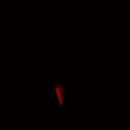
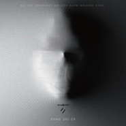

方拾贰
============================

|  |  |
| :--: | :-- |
| [ 方拾贰](https://i.xiami.com/fy) | **播放数**: 20240628 **粉丝数**: 18986 **评论数**: 703 **地区**: China 中国大陆 **风格**: 根源唱作人 Singer-Songwriter, 独立流行 Indie Pop, 世界音乐 World Music, 梦幻流行 Dream Pop  |

## 档案

东方难得女中音方拾贰，二零一八年五月八日用传统仪式发行首张专辑来宣布她的到来。 
同期，她创立了全新的音乐概念“未来东方” 方拾贰把个人独特审美融入到作品中，向世人诠释自己心中的东方音乐。 
作为崭新的独立音乐人，由于首张专辑的成功，方拾贰迅速得到外界关注，接连得到阿比鹿音乐奖、华语金曲奖、全球华语金曲奖的肯定，代表作《望月》与最新作品《花之谜》被德国Cosmo电台特邀推荐。同时还与Beats、淘宝、天猫等品牌展开合作。 
方拾贰没有限定自己的音乐风格，因此，她的音乐才有了更多意料之外的可能。久而久之，方拾贰便成了方拾贰的音乐风格。她把自己的音乐用视觉作以区分，歌曲封面为暗色冷色系时，则当前歌曲会带有“方式”暗黑风，这种风格以《归，不归》为代表，它是方拾贰最初在“零污染”状态下开始创作的后续想象，而浅色暖色系则代表了《山下》《譬如你吐出的烟云》《假装我们不需要呼吸》等作品的风格，甜蜜、温情或是忧伤。 
二零一九年五月，方拾贰带着音乐游历中国开启了首次个人巡演，巡演主题名为《掘野》，意为开疆辟土探索未知荒野。

## 专辑

| 名称 | 语种 | 唱片公司 | 发行时间 | 专辑类别 | 专辑风格 |
| :--: | :-- | :-- | :-- | :-- | :-- |
| [ 好久不见](./albums/5021745706.md) | 国语 | 独立发行 | 2020年10月24日 | 录音室专辑 | 国语流行 Mandarin Pop |
| [ 致命情人](./albums/5021304480.md) | 国语 | 独立发行 | 2020年08月19日 | EP, 单曲 | 国语流行 Mandarin Pop |
| [ 星宿日记](./albums/2105597513.md) | 国语 | 独立发行 | 2019年12月18日 | EP, 单曲 | 国语流行 Mandarin Pop |
| [ 花之谜](./albums/2104850971.md) | 国语 | 独立发行 | 2019年05月08日 | EP, 单曲 | 迷幻流行 Psychedelic Pop |
| [ 假装我们不需要呼吸](./albums/2104591073.md) | 国语 | 独立发行 | 2019年02月12日 | EP, 单曲 | 流行 Pop, 独立流行 Indie Pop |
| [ 送别方太2018中秋节“爱若无缺事事圆”MV《送别篇》](./albums/2104050624.md) | 国语 | 独立发行 | 2018年09月23日 | 录音室专辑 | 流行 Pop |
| [ 拾贰SHIER](./albums/2103703578.md) | 国语 | 虾米音乐人 | 2018年05月08日 | 录音室专辑 | 国语流行 Mandarin Pop, 电子 Electronic, 另类唱作人 Alternative Singer-Songwriter |
| [ 魔豆妈妈](./albums/2103571867.md) | 国语 | 独立发行 | 2018年03月01日 | EP, 单曲 | 国语流行 Mandarin Pop |
| [ 敢问路在何方(淘宝1212#世间宝贝在此#）](./albums/2102972991.md) | 国语 | 独立发行 | 2017年12月12日 | EP, 单曲 | 当代民谣 Contemporary Folk |
| [ 山下](./albums/2102781613.md) | 国语 | 独立发行 | 2017年07月12日 | EP, 单曲 | 当代民谣 Contemporary Folk, 当代唱作人 Contemporary Singer-Songwriter, 华语唱作人 Chinese Singer-Songwriter |
| [ 归，不归](./albums/2102756286.md) | 国语 | 独立发行 | 2016年12月21日 | EP, 单曲 | 电子 Electronic, 当代民谣 Contemporary Folk, 电子民谣 Folktronica |

## 评论

|  |  |  |  |
| :-- | :-- | :-- | :-- |
|  [虾米用户](https://emumo.xiami.com/u/16010993) （） 2021-01-12 23:37 赞(1) 踩(0) | 
再见
 |
|  [虾米用户](https://emumo.xiami.com/u/374464453) 没 事 2020-12-28 01:22 赞(0) 踩(0) | 
初听只觉得好听 ，第二次听就上头了！
 |
|  [虾米用户](https://emumo.xiami.com/u/446115285)  2020-11-22 13:05 赞(0) 踩(0) | 
專門為了方拾貳 下了蝦米
 |
|  [虾米用户](https://emumo.xiami.com/u/427683359) to be a bett... 2020-10-27 07:27 赞(0) 踩(0) | 
爱听你的歌❤
 |
|  [虾米用户](https://emumo.xiami.com/u/93328648)   2020-10-24 01:17 赞(1) 踩(0) | 
如获至宝，言多必失，收！
 |
|  [虾米用户](https://emumo.xiami.com/u/335763493) 不戴墨镜  2020-09-14 21:43 赞(1) 踩(0) | 
️
 |
|  [虾米用户](https://emumo.xiami.com/u/33495734) 我曾愿景活得好似佛门清净 2020-08-28 14:12 赞(1) 踩(0) | 
我居然才发现这个宝藏！！！！
 |
|  [虾米用户](https://emumo.xiami.com/u/379694118)  2020-07-25 23:32 赞(0) 踩(0) | 
亲qqqsl
 |
|  [虾米用户](https://emumo.xiami.com/u/404265987)  2020-07-22 17:10 赞(1) 踩(0) | 
真的好爱你的音乐
 |
|  [虾米用户](https://emumo.xiami.com/u/9062060) 此生没拿一个亿来爱虾米是... 2020-07-14 22:30 赞(0) 踩(0) | 
好听
 |
|  [虾米用户](https://emumo.xiami.com/u/8337431) 以乐会友 2020-06-27 06:54 赞(0) 踩(0) | 
华语魅力女声20200627.692
 |
|  [虾米用户](https://emumo.xiami.com/u/421578063) fox god 2020-05-25 12:56 赞(0) 踩(0) | 
哇
 |
|  [虾米用户](https://emumo.xiami.com/u/58373528) 求好歌 2020-05-18 22:01 赞(0) 踩(0) | 
好听～
 |
|  [虾米用户](https://emumo.xiami.com/u/8697915)  2020-03-21 22:16 赞(0) 踩(0) | 
声音好棒
 |
|  [虾米用户](https://emumo.xiami.com/u/244629936) 音乐不可辜负！ 2020-02-07 23:08 赞(0) 踩(0) | 
说真的，自《山下》后，没有一首足够惊艳的歌曲，《魔豆妈妈》还可以，但还不够，愿妳不负“拾贰”这一天数。
 |
|  [虾米用户](https://emumo.xiami.com/u/3583995) 一個人的戰爭 2020-02-06 22:08 赞(0) 踩(0) | 
.
 |
|  [虾米用户](https://emumo.xiami.com/u/356763773) 我还没想好要写什么... 2020-01-19 21:50 赞(0) 踩(0) | 
~
 |
|  [虾米用户](https://emumo.xiami.com/u/53878168)  2019-12-27 22:33 赞(1) 踩(0) | 
刘贰弎 方拾贰
 |
|  [虾米用户](https://emumo.xiami.com/u/250335397)  2019-12-18 19:18 赞(0) 踩(0) | 
如果您不介意我把您同白安一起"膜拜"
 |
|  [虾米用户](https://emumo.xiami.com/u/255192697) 要知足  :) 2019-11-24 00:01 赞(1) 踩(0) | 
谢谢虾米推荐，又发现了一个有才华的歌手
 |
| ⇒ |  [虾米用户](https://emumo.xiami.com/u/316261284) 到最后…… 2019-12-03 11:34 赞(0) 踩(0) | 
好久不见你才发现呀。
 |
| ⇒ |  [虾米用户](https://emumo.xiami.com/u/255192697) 要知足  :) 2019-12-04 23:48 赞(0) 踩(0) | 
<q><b>星屿说：</b></q>
 |
|  [虾米用户](https://emumo.xiami.com/u/99525044)  Diamond 2019-10-13 17:29 赞(1) 踩(0) | 
喜欢德彪西的女生一定甜，还有点酒精味
 |
|  [虾米用户](https://emumo.xiami.com/u/419708743)  2019-09-13 18:45 赞(0) 踩(0) | 
唱歌那么好听，可以多出点歌吗
 |
|  [虾米用户](https://emumo.xiami.com/u/378109034) 这是系统分配的名字，其实... 2019-09-12 14:10 赞(1) 踩(0) | 
还不错，作品有个人风格，但听下来最出挑的是编曲。
 |
|  [虾米用户](https://emumo.xiami.com/u/81876102)   2019-09-07 01:49 赞(0) 踩(0) | 
听了两年你的歌 
 |
| ⇒ |  [虾米用户](https://emumo.xiami.com/u/95204464) 假设我思考，那么我必然存... 2019-09-08 22:30 赞(0) 踩(0) | 
繼續。
 |
| ⇒ |  [虾米用户](https://emumo.xiami.com/u/81876102)   2019-09-10 08:38 赞(0) 踩(0) | 
<q><b>方拾贰说：</b></q>
 |
|  [虾米用户](https://emumo.xiami.com/u/215379991) 簽名不重要重要的是你聽什... 2019-08-22 22:25 赞(0) 踩(0) | 
ﻌﻌﻌ❤︎
 |
|  [虾米用户](https://emumo.xiami.com/u/428280081) 我还没想好要写什么... 2019-08-21 09:48 赞(0) 踩(0) | 
&amp;hearts;
 |
|  [虾米用户](https://emumo.xiami.com/u/23709244)  2019-06-23 20:28 赞(0) 踩(0) | 
方拾贰，敢问路在何方，最动人版本是你唱的。不情之请，可以分享这个吉他谱吗！
 |
|  [虾米用户](https://emumo.xiami.com/u/4170294) ZUR 2019-06-23 18:43 赞(0) 踩(0) | 
听来听去，一个样。
 |
|  [虾米用户](https://emumo.xiami.com/u/5682615) 我想要的是音乐女人和钱。 2019-06-21 06:46 赞(1) 踩(0) | 
拾贰，今晚欧拉见！！！
 |
|  [虾米用户](https://emumo.xiami.com/u/244629936) 音乐不可辜负！ 2019-06-19 13:31 赞(1) 踩(0) | 
我的《宝贝》呢，不会被遗忘了吧，也许它在哪个角落，期待着妳手心的温暖
 |
|  [虾米用户](https://emumo.xiami.com/u/7070545)  2019-06-16 00:34 赞(1) 踩(0) | 
今晚终于开封CD，CD制作很用心。期待以后的作品。加油！
 |
|  [虾米用户](https://emumo.xiami.com/u/26866006)  2019-06-08 13:32 赞(0) 踩(0) | 
最爱  山下
 |
|  [虾米用户](https://emumo.xiami.com/u/204829310) 安静听歌(*¯︶¯*) 2019-06-01 23:24 赞(0) 踩(0) | 
杭州便宜出一张票！ 
 |
|  [虾米用户](https://emumo.xiami.com/u/364239852)  2019-05-27 23:14 赞(0) 踩(0) | 
昨天vox...我竟然错过了！有缘再会 
 |
|  [虾米用户](https://emumo.xiami.com/u/10081975) weibo@winnin... 2019-05-19 23:24 赞(0) 踩(0) | 
2019.5.19珠海场，太帅了，满足 
 |
|  [虾米用户](https://emumo.xiami.com/u/39801021)  2019-05-19 12:20 赞(1) 踩(0) | 
2019.05.18 深圳场 很有气氛，你送我们月亮，我们送你星光～好想看看合影里能不能找到我哈哈哈～好想要拾贰签售的CD啊～下次一定要有啊～
 |
|  [虾米用户](https://emumo.xiami.com/u/20147189) 嘘 2019-05-17 22:52 赞(0) 踩(0) | 
太有舞台魅力了…  
 |
|  [虾米用户](https://emumo.xiami.com/u/23469324) 我还没想好要写什么... 2019-05-17 22:24 赞(0) 踩(0) | 
2019.05.17 广州场 最后合唱山下 全场为方拾贰打开闪光灯 方拾贰为我们场下观众拍视频 我隔壁的妹子叫了一声:“记得开美颜啊～”
 |
|  [虾米用户](https://emumo.xiami.com/u/20147189) 嘘 2019-05-17 15:14 赞(0) 踩(0) | 
今夜期待♥️
 |
|  [虾米用户](https://emumo.xiami.com/u/39170307) INFINITE 2019-05-17 09:51 赞(0) 踩(0) | 
某个夏日午后，不经意切换到你的歌，就欲罢不能了！今晚，广州凸凸见！ 
 |
|  [虾米用户](https://emumo.xiami.com/u/289740329)  2019-05-13 17:31 赞(0) 踩(0) | 
18号深圳站见 
 |
|  [虾米用户](https://emumo.xiami.com/u/739442)   2019-05-12 20:47 赞(0) 踩(0) | 
noooooo！上海杭州的两场 不在国内去不了可惜了     
 |
|  [虾米用户](https://emumo.xiami.com/u/348938997) 散尽浮云落尽花，到头明月... 2019-05-11 23:17 赞(0) 踩(0) | 
北京站啥时候啊5555
 |
| ⇒ |  [虾米用户](https://emumo.xiami.com/u/95204464) 假设我思考，那么我必然存... 2019-05-14 13:33 赞(0) 踩(0) | 
6.29，將進酒
 |
| ⇒ |  [虾米用户](https://emumo.xiami.com/u/348938997) 散尽浮云落尽花，到头明月... 2019-05-14 17:17 赞(0) 踩(0) | 
<q><b>方拾贰说：</b></q>
 |
|  [虾米用户](https://emumo.xiami.com/u/190222635) faith and fa... 2019-05-08 16:55 赞(0) 踩(0) | 
有想去6.21南京演唱会的吗 那天自己去不了，想把虾米送的票出出去，有要的私信我 
 |
|  [虾米用户](https://emumo.xiami.com/u/86) 我一直假装自己是个机器人... 2019-05-07 14:31 赞(2) 踩(0) | 
恭喜以下用户获得2019方拾贰全国巡演门票，场次和对应的中奖名单如下，我们将在5.7日24点前通过虾小米私信的方式通知中奖用户，请注意查收私信！谢谢成都 听**聊西北重庆 刘丽**7726广州 半**缘，深圳 chen19**_00珠海 /长沙 ROA**RRoyals武汉 M**虾南京 Angeli**.yue上海 有个**叫飞轮海杭州 七**虫声北京 *色
 |
| ⇒ |  [虾米用户](https://emumo.xiami.com/u/96504020) 小舟从此逝 江海寄余生 2019-05-09 14:19 赞(0) 踩(0) | 
亲，我是广州场获奖人，已经回复了姓名及手机号码了。不知道官方能否看到？
 |
| ⇒ |  [虾米用户](https://emumo.xiami.com/u/324344575) 世界以无为本。 2019-05-09 16:55 赞(0) 踩(0) | 
<q><b>半岛无缘，说：</b></q>
 |
| ⇒ |  [虾米用户](https://emumo.xiami.com/u/96504020) 小舟从此逝 江海寄余生 2019-05-09 17:30 赞(0) 踩(0) | 
<q><b>Me小虾说：</b></q>
 |
| ⇒ |  [虾米用户](https://emumo.xiami.com/u/324344575) 世界以无为本。 2019-05-09 17:57 赞(0) 踩(0) | 
<q><b>半岛无缘，说：</b></q>
 |
| ⇒ |  [虾米用户](https://emumo.xiami.com/u/96504020) 小舟从此逝 江海寄余生 2019-05-09 17:58 赞(0) 踩(0) | 
<q><b>Me小虾说：</b></q>
 |
| ⇒ |  [虾米用户](https://emumo.xiami.com/u/324344575) 世界以无为本。 2019-05-09 18:00 赞(0) 踩(0) | 
<q><b>半岛无缘，说：</b></q>
 |
| ⇒ |  [虾米用户](https://emumo.xiami.com/u/96504020) 小舟从此逝 江海寄余生 2019-05-09 18:24 赞(0) 踩(0) | 
<q><b>Me小虾说：</b></q>
 |
|  [虾米用户](https://emumo.xiami.com/u/401320085) I Pray 2019-05-04 15:59 赞(0) 踩(0) | 
期待五月的巡演！！
 |
|  [虾米用户](https://emumo.xiami.com/u/6990246)   2019-05-03 06:03 赞(0) 踩(0) | 
喝了点酒，听的眼角湿润
 |
|  [虾米用户](https://emumo.xiami.com/u/407085769) 脱离了高级趣味的人 2019-05-02 03:45 赞(2) 踩(0) | 
看我！我生日12.12！
 |
|  [虾米用户](https://emumo.xiami.com/u/204829310) 安静听歌(*¯︶¯*) 2019-04-23 22:42 赞(2) 踩(0) | 
这声音太灵了
 |
|  [虾米用户](https://emumo.xiami.com/u/246689266)  2019-04-23 11:49 赞(0) 踩(0) | 
感谢有你;-)
 |
|  [虾米用户](https://emumo.xiami.com/u/123911876) 我还没想好要写什么... 2019-04-21 13:11 赞(0) 踩(0) | 
我想看上海站
 |
| ⇒ |  [虾米用户](https://emumo.xiami.com/u/423455817)  2019-04-21 15:11 赞(0) 踩(0) | 
9机会会考虑图    更好。time也是不是说说
 |
| ⇒ |  [虾米用户](https://emumo.xiami.com/u/313503272) 我还没想好要写什么... 2019-06-01 00:27 赞(0) 踩(0) | 
6.22上海站
 |
|  [虾米用户](https://emumo.xiami.com/u/1917545)  2019-04-21 07:24 赞(2) 踩(0) | 
最喜欢山下，古风大气上档次，听的过程中仿佛自己在山中游走，山中岁月静好，世上繁华落尽，想听现场版！期待长沙的演出。   
 |
|  [虾米用户](https://emumo.xiami.com/u/23597109) 你想要的人在远方,能遇见... 2019-04-21 06:54 赞(2) 踩(0) | 
重庆支持一下吧。
 |
|  [虾米用户](https://emumo.xiami.com/u/190222635) faith and fa... 2019-04-21 00:21 赞(2) 踩(0) | 
第一次听的歌曲好像是《山下》，迷幻到抓耳，听的过程中直接收藏关注了作者，特别喜欢这种风格和特立独行的味道，之后陆续又听到了诸多好作品，例如《望月》。希望拾贰小姐姐继续加油，能够有更多的创造灵感，给我们带来更好的作品 。如果要去的话，应该选南京吧，因为比较近 
 |
|  [虾米用户](https://emumo.xiami.com/u/100609164) 静静的听…… 2019-04-20 21:27 赞(0) 踩(0) | 
最喜欢《酒事儿》，在自己的2018年歌单中排第一，想看北京场。
 |
|  [虾米用户](https://emumo.xiami.com/u/46500375) 花开花谢，云卷云舒。 2019-04-20 13:01 赞(0) 踩(0) | 
喜欢，特别是带着耳机听，立体感太贴耳！
 |
|  [虾米用户](https://emumo.xiami.com/u/204829310) 安静听歌(*¯︶¯*) 2019-04-20 09:19 赞(0) 踩(0) | 
杭州 
 |
|  [虾米用户](https://emumo.xiami.com/u/324471565)  2019-04-20 07:24 赞(0) 踩(0) | 
广州广州广州
 |
|  [虾米用户](https://emumo.xiami.com/u/253048193) 这家伙很聪明什么都不想留... 2019-04-19 23:42 赞(0) 踩(0) | 
山下，上海
 |
|  [虾米用户](https://emumo.xiami.com/u/200323377)  ǝɯ ɹǝqɯǝɯǝɹ... 2019-04-19 23:41 赞(0) 踩(0) | 
来西安一定去看你 
 |
|  [虾米用户](https://emumo.xiami.com/u/28875571)   2019-04-19 22:57 赞(1) 踩(0) | 
最爱 譬如你吐出的烟云 快送我上去 
 |
|  [虾米用户](https://emumo.xiami.com/u/278480150)  2019-04-19 21:32 赞(0) 踩(0) | 
北京
 |
|  [虾米用户](https://emumo.xiami.com/u/44473727)   2019-04-19 20:25 赞(0) 踩(0) | 
最喜欢《望月》!!!编曲太好听了，声音太有穿透力了，大爱!推荐给身边好多朋友啦嘻嘻想去看成都站!让我见见小姐姐本人吧!
 |
|  [虾米用户](https://emumo.xiami.com/u/230803304) 三观正又爱国的成都宝藏男... 2019-04-19 20:20 赞(0) 踩(0) | 
支持一下
 |
|  [虾米用户](https://emumo.xiami.com/u/88515334) 谢谢那胡同，它见你牵过我... 2019-04-19 19:02 赞(0) 踩(0) | 
不来太原或者天津嘛？那我去北京看你！想再听你的歌庭院深深也去听 
 |
|  [虾米用户](https://emumo.xiami.com/u/20147189) 嘘 2019-04-19 18:29 赞(0) 踩(0) | 
巡演见！
 |
|  [虾米用户](https://emumo.xiami.com/u/96504020) 小舟从此逝 江海寄余生 2019-04-19 18:16 赞(2) 踩(0) | 
最喜欢拾贰的歌无非就是《山下》了，深情不带戾气，却带着一股仙气。听的如痴如醉，时常在想，拾贰到底是一个怎样的仙女。舍友因为我的原因也哼起了拾贰的歌，朋友也有听。TU凸空间去见拾贰！
 |
|  [虾米用户](https://emumo.xiami.com/u/27414300) 善良 真诚 尽量不动心。 2019-04-19 17:56 赞(0) 踩(0) | 
深圳 安排！
 |
|  [虾米用户](https://emumo.xiami.com/u/293692544) 你敢给我说话吗？我咬你 2019-04-19 17:29 赞(1) 踩(0) | 
好听
 |
|  [虾米用户](https://emumo.xiami.com/u/423043680)  2019-04-19 16:48 赞(2) 踩(0) | 
欢迎大家微博关注@方拾贰@方拾贰保护小组，有关方拾贰的消息微博上都会第一时间通知。同时线下巡演510成都，511重庆，517广州，518深圳，519珠海，524长沙，526武汉，621南京，622上海，623杭州，629北京，门票100一张，欢迎大家一起来玩[可爱]
 |
| ⇒ |  [虾米用户](https://emumo.xiami.com/u/1917545)  2019-04-21 07:20 赞(0) 踩(0) | 
最喜欢山下，古风大气上档次，听的过程中仿佛自己在山中游走，山中岁月静好，世上繁华落尽，想听现场版！期待长沙的演出。
 |
| ⇒ |  [虾米用户](https://emumo.xiami.com/u/423043680)  2019-04-21 08:43 赞(0) 踩(0) | 
<q><b>安少说：</b></q>
 |
| ⇒ |  [虾米用户](https://emumo.xiami.com/u/1917545)  2019-04-22 11:41 赞(0) 踩(0) | 
<q><b>方拾贰保护小组说：</b></q>
 |
| ⇒ |  [虾米用户](https://emumo.xiami.com/u/423043680)  2019-04-22 16:25 赞(0) 踩(0) | 
<q><b>安少说：</b></q>
 |
| ⇒ |  [虾米用户](https://emumo.xiami.com/u/319267977) 我还没想好要写什么... 2019-05-10 20:13 赞(0) 踩(0) | 
<q><b>安少说：</b></q>
 |
| ⇒ |  [虾米用户](https://emumo.xiami.com/u/319267977) 我还没想好要写什么... 2019-05-10 20:13 赞(0) 踩(0) | 
<q><b>方拾贰保护小组说：</b></q>
 |
|  [虾米用户](https://emumo.xiami.com/u/3524267)  2019-04-19 16:35 赞(1) 踩(0) | 
厦门福州也想拥有姓名_(•̀ω•́ 」∠)_
 |
| ⇒ |  [虾米用户](https://emumo.xiami.com/u/423043680)  2019-04-19 16:40 赞(0) 踩(0) | 
欢迎大家微博关注@方拾贰@方拾贰保护小组，有关方拾贰的消息微博上都会第一时间通知。
 |
|  [虾米用户](https://emumo.xiami.com/u/33646976)  2019-04-19 16:29 赞(3) 踩(0) | 
杭州！！！！山下
 |
| ⇒ |  [虾米用户](https://emumo.xiami.com/u/423043680)  2019-04-19 16:36 赞(0) 踩(0) | 
623见！
 |
| ⇒ |  [虾米用户](https://emumo.xiami.com/u/423043680)  2019-04-19 16:41 赞(0) 踩(0) | 
欢迎微博关注@方拾贰@方拾贰保护小组，有关方拾贰的消息微博上都会第一时间通知。
 |
|  [虾米用户](https://emumo.xiami.com/u/33646976)  2019-04-19 16:28 赞(1) 踩(0) | 
山下！
 |
|  [虾米用户](https://emumo.xiami.com/u/375958474)  2019-04-19 13:41 赞(1) 踩(0) | 
北京见。
 |
|  [虾米用户](https://emumo.xiami.com/u/262169337)  2019-04-19 13:33 赞(2) 踩(0) | 
从《归，不归》就开始关注你，很特别的唱作人。上初中的女儿也非常喜欢你，最近把你的《假装我们不需要呼吸》收进她在虾米上的精选歌单，评价你为宝藏女孩，也是你的小迷妹
 |
| ⇒ |  [虾米用户](https://emumo.xiami.com/u/423043680)  2019-04-19 16:37 赞(0) 踩(0) | 
欢迎来线下一起体验 
 |
|  [虾米用户](https://emumo.xiami.com/u/51705692)  2019-04-19 13:25 赞(1) 踩(0) | 
新的民谣女歌手？？？️️️️
 |
|  [虾米用户](https://emumo.xiami.com/u/2523233) 太热 2019-04-19 13:17 赞(3) 踩(0) | 
专辑里的新歌最喜欢【譬如你吐出的烟云】，旋律真是超棒的！氛围也很够！！我在长沙！  去46很方便！！求点赞嘤嘤嘤！祝给我点赞的朋友心想事成♪((└|o^▽^o|┐))
 |
| ⇒ |  [虾米用户](https://emumo.xiami.com/u/423043680)  2019-04-19 16:37 赞(0) 踩(0) | 
长沙等你哦！
 |
|  [虾米用户](https://emumo.xiami.com/u/348671906) 不 合 格 的 现 代 ... 2019-04-19 13:07 赞(1) 踩(0) | 
为何南京和上海还没有售票 我哭
 |
| ⇒ |  [虾米用户](https://emumo.xiami.com/u/423043680)  2019-04-19 16:38 赞(0) 踩(0) | 
已经售票啦，乐童或者秀动app就可以买！欢迎微博关注方拾贰保护小组 
 |
|  [虾米用户](https://emumo.xiami.com/u/261386312)  2019-04-19 12:54 赞(1) 踩(0) | 
希望下次能在贵阳
 |
| ⇒ |  [虾米用户](https://emumo.xiami.com/u/423043680)  2019-04-19 16:42 赞(0) 踩(0) | 
欢迎大家微博关注@方拾贰@方拾贰保护小组，有关方拾贰的消息微博上都会第一时间通知。 
 |
|  [虾米用户](https://emumo.xiami.com/u/93508608)  2019-04-19 08:57 赞(0) 踩(0) | 
希望你下次能到昆明 
 |
|  [虾米用户](https://emumo.xiami.com/u/46936658)  2019-04-19 08:57 赞(0) 踩(0) | 
南京！
 |
| ⇒ |  [虾米用户](https://emumo.xiami.com/u/423043680)  2019-04-19 16:43 赞(0) 踩(0) | 
欢迎大家微博关注@方拾贰@方拾贰保护小组，有关方拾贰的消息微博上都会第一时间通知。另外，621见 
 |
|  [虾米用户](https://emumo.xiami.com/u/16047370)  2019-04-19 08:25 赞(2) 踩(0) | 
北京见
 |
|  [虾米用户](https://emumo.xiami.com/u/24968228)  2019-04-19 07:38 赞(2) 踩(0) | 
广州的小伙伴，这里赞 我们一起现场听《山下》吧 
 |
| ⇒ |  [虾米用户](https://emumo.xiami.com/u/8396)  2019-04-19 09:56 赞(0) 踩(0) | 
问一下。哦哟哟微微的东。
 |
| ⇒ |  [虾米用户](https://emumo.xiami.com/u/8396)  2019-04-19 09:58 赞(0) 踩(0) | 
的莫一兮东农。口中口39我我我我也一样的系统泼墨我现在。里鳄鱼3333399969其实你并不需要写故事，只要去写这个人物——你把这个角色的性格，甚至是小动作都写出来之后，故事自然就有了。就是说你写一个角色的故事，其实是这个人物的性格对这个场景的反应。你只要把情景想清楚了，再把这个个性鲜明的角色放进去之后，故事自然而然就有了。（我想 摄影也是如此）#摄影小语#小事的线长清6996699393
 |
|  [虾米用户](https://emumo.xiami.com/u/248136555) 沈大头 2019-04-19 07:37 赞(0) 踩(0) | 
厦门能不能有姓名。。
 |
|  [虾米用户](https://emumo.xiami.com/u/324344575) 世界以无为本。 2019-04-19 07:15 赞(2) 踩(0) | 
5月26日武汉站，《山下》
 |
|  [虾米用户](https://emumo.xiami.com/u/4421444) 侧耳倾听 2019-04-19 04:22 赞(0) 踩(0) | 
5月10日 山下
 |
|  [虾米用户](https://emumo.xiami.com/u/9858055) . 2019-04-19 03:44 赞(1) 踩(0) | 
“当你去过了山上，看过了风景，回头看，其实山下也不错。”那撒子，重庆坚果的票是不可能得到的，虽然我也在里面演出过。哈哈哈哈哈哈哈我愿意为我家宝贝！ 买票 ！！！  ( 可是要看我有没有空啊……有空一定不会错过现场！)
 |
|  [虾米用户](https://emumo.xiami.com/u/297618165)  2019-04-09 21:36 赞(1) 踩(0) | 
6.29我去帮你拍照吧 
 |
|  [虾米用户](https://emumo.xiami.com/u/33234927) …… 2019-04-09 12:57 赞(0) 踩(0) | 
5566？(´-ω-`)
 |
|  [虾米用户](https://emumo.xiami.com/u/409496984) Break the hy... 2019-04-04 06:10 赞(0) 踩(0) | 
亲爱的方姑娘，我总被曲子的开头吸引，曲子的开头总是有耳目一新之感。整曲的词也很棒，只是总觉得曲子走着走着便失去了特殊感，我觉得姑娘可以再次更努力追求一下旋律独特性. 个人见解若有冒犯请不必放在心上又遇到一个喜爱的音乐人真的很开心。
 |
|  [虾米用户](https://emumo.xiami.com/u/101636444) ❤️一只喜欢闵玧其的疯姑... 2019-03-22 23:48 赞(0) 踩(0) | 
等着你的二专❤️
 |
|  [虾米用户](https://emumo.xiami.com/u/101636444) ❤️一只喜欢闵玧其的疯姑... 2019-03-17 09:35 赞(1) 踩(0) | 
等着 高考后争取来上海见你！（我一定要拥抱你啊哈哈）从归不归就开始喜欢你了❤️
 |
|  [虾米用户](https://emumo.xiami.com/u/12221090) 逍遥于天地而心意自得 2019-03-16 06:08 赞(0) 踩(0) | 
赞
 |
|  [虾米用户](https://emumo.xiami.com/u/19507983) 我有尚方宝剑！ 2019-03-15 15:40 赞(0) 踩(0) | 
喜欢听硬核风格的居然让这首歌给迷住了。是一种意境；是一种幻觉；一种轻盈；是一种清透；是一种随性。
 |
|  [虾米用户](https://emumo.xiami.com/u/401868417) 我还没想好要写什么... 2019-03-15 11:33 赞(0) 踩(0) | 
坐等开唱，开心！！！(∩_∩)
 |
|  [虾米用户](https://emumo.xiami.com/u/4487129)  2019-03-15 11:21 赞(0) 踩(0) | 
！！！
 |
|  [虾米用户](https://emumo.xiami.com/u/228843687) 懒惰统治人间 2019-03-10 16:40 赞(0) 踩(0) | 
不容易啊
 |
|  [虾米用户](https://emumo.xiami.com/u/37637093) ⁣そして華麗に私を食べて... 2019-03-08 00:14 赞(0) 踩(0) | 
⁣⁣⁣⁣
 |
|  [虾米用户](https://emumo.xiami.com/u/420094895)  2019-02-28 13:27 赞(0) 踩(0) | 
我从某音追随你到云村，现在还是再次追着你的脚步到了这里。永远支持你！<a href="http://emumo.xiami.com/u/95204464" target="_blank" rel="nofollow" name_card="95204464">@方拾贰 </a>
 |
|  [虾米用户](https://emumo.xiami.com/u/5704024) 你怎样信仰，你就怎样生活 2019-02-25 11:19 赞(1) 踩(0) | 
昨天、今天、明天。
 |
|  [虾米用户](https://emumo.xiami.com/u/316854575)  2019-02-19 12:51 赞(1) 踩(0) | 
你好，你的 《回到过去》那首歌怎么没有了，我超级爱听的 
 |
|  [虾米用户](https://emumo.xiami.com/u/265690440) 人走茶凉，故事还长。 2019-02-18 15:28 赞(1) 踩(0) | 
独特的嗓音，我无条件沉迷。
 |
|  [虾米用户](https://emumo.xiami.com/u/126092)  2019-02-14 07:11 赞(1) 踩(0) | 
一定会火
 |
|  [虾米用户](https://emumo.xiami.com/u/412150460)  2019-02-13 21:38 赞(1) 踩(0) | 
拾贰小姐姐歌真的太好听了，我是真的自私 不愿意那歌分享给其他人 除了我超级超级喜欢的人✨✨✨
 |
|  [虾米用户](https://emumo.xiami.com/u/41683599) Hey Nigger 2019-02-13 12:07 赞(0) 踩(0) | 
被声音吸引了。。
 |
| ⇒ |  [虾米用户](https://emumo.xiami.com/u/362741420) 我还没想好要写什么... 2019-02-16 14:05 赞(0) 踩(0) | 
1
 |
|  [虾米用户](https://emumo.xiami.com/u/406447189) 心情好！没烦恼！ 2019-02-12 21:19 赞(0) 踩(0) | 

 |
|  [虾米用户](https://emumo.xiami.com/u/308908844) 再见 2019-02-12 13:18 赞(1) 踩(0) | 

 |
|  [虾米用户](https://emumo.xiami.com/u/326383181)  2019-02-11 22:49 赞(0) 踩(0) | 
很好啊加油
 |
|  [虾米用户](https://emumo.xiami.com/u/222076619)  2019-02-03 22:29 赞(0) 踩(0) | 
我想买实体CD，请问哪里有买。
 |
|  [虾米用户](https://emumo.xiami.com/u/354939751) 留住青春的美好献给美好的... 2019-01-31 13:00 赞(0) 踩(0) | 
娓娓道来让人心里舒服感谢遇见
 |
|  [虾米用户](https://emumo.xiami.com/u/246689266)  2019-01-30 21:43 赞(0) 踩(0) | 
哇⊙∀⊙！塞！宝藏啊！！！
 |
|  [虾米用户](https://emumo.xiami.com/u/9080939) 不为无益之事，何遣有涯之... 2019-01-25 22:15 赞(2) 踩(0) | 
山下很棒 
 |
|  [虾米用户](https://emumo.xiami.com/u/11221879) time comes a... 2019-01-24 20:09 赞(0) 踩(0) | 
越听你的歌越喜欢，好的音乐应当是与人有共鸣并且能抚慰人心的。棒棒哒！
 |
|  [虾米用户](https://emumo.xiami.com/u/40310297) 我们的故事只讲了一半 2019-01-18 14:12 赞(0) 踩(0) | 
为什么有这么好听的声音呀，
 |
|  [虾米用户](https://emumo.xiami.com/u/8226204) ≡ 2019-01-05 23:47 赞(0) 踩(0) | 
色号总是很好看
 |
|  [虾米用户](https://emumo.xiami.com/u/215579437)  2018-12-27 13:31 赞(1) 踩(0) | 
这个声音把我从现实中引向梦乡，太陶醉啦。
 |
|  [虾米用户](https://emumo.xiami.com/u/296819784)  2018-12-16 23:10 赞(0) 踩(0) | 
希望有一天能够看见你
 |
|  [虾米用户](https://emumo.xiami.com/u/405989219)   2018-12-15 23:41 赞(0) 踩(0) | 
有想去看方姑娘1223疆进酒演出的联系我喔～
 |
|  [虾米用户](https://emumo.xiami.com/u/4700572)  2018-12-12 22:52 赞(0) 踩(0) | 
什么时候来南京 谢谢你
 |
|  [虾米用户](https://emumo.xiami.com/u/9812592) . 2018-11-28 12:58 赞(0) 踩(0) | 
18年最喜欢的人没有之一
 |
| ⇒ |  [虾米用户](https://emumo.xiami.com/u/95204464) 假设我思考，那么我必然存... 2018-11-28 16:49 赞(0) 踩(0) | 
謝謝。
 |
|  [虾米用户](https://emumo.xiami.com/u/13356967)   2018-11-10 04:48 赞(0) 踩(0) | 
在2018年的尾巴 我发现我最喜欢的山下
 |
|  [虾米用户](https://emumo.xiami.com/u/285748946)  2018-11-08 23:20 赞(0) 踩(0) | 

 |
|  [虾米用户](https://emumo.xiami.com/u/25595775) Metalring 2018-11-08 10:09 赞(0) 踩(0) | 
有巡演計劃嗎
 |
| ⇒ |  [虾米用户](https://emumo.xiami.com/u/95204464) 假设我思考，那么我必然存... 2018-11-08 15:41 赞(0) 踩(0) | 
明年有巡演。
 |
|  [虾米用户](https://emumo.xiami.com/u/343898898) 新歌，新的恩宠，新的生命 2018-11-08 08:21 赞(0) 踩(0) | 
有点灰暗的感觉，希望艺术真能洗涤我们的灵魂，而不是领人掉进坑里
 |
|  [虾米用户](https://emumo.xiami.com/u/328657369) 风格随心而变、 2018-11-05 22:16 赞(0) 踩(0) | 

 |
|  [虾米用户](https://emumo.xiami.com/u/12248544) 鹿車荷鍤 2018-10-30 16:06 赞(0) 踩(0) | 
留名
 |
|  [虾米用户](https://emumo.xiami.com/u/19756206) I just wanna 2018-10-23 18:42 赞(0) 踩(0) | 
古风配电子怎么就这么奇妙呢！
 |
|  [虾米用户](https://emumo.xiami.com/u/19756206) I just wanna 2018-10-23 18:36 赞(0) 踩(0) | 
我好喜欢你啊！！！
 |
| ⇒ |  [虾米用户](https://emumo.xiami.com/u/95204464) 假设我思考，那么我必然存... 2018-10-23 19:09 赞(0) 踩(0) | 

 |
| ⇒ |  [虾米用户](https://emumo.xiami.com/u/19756206) I just wanna 2018-11-01 16:20 赞(0) 踩(0) | 
<q><b>方拾贰说：</b></q>
 |
|  [虾米用户](https://emumo.xiami.com/u/48341939) 这家伙很聪明什么也没留下... 2018-10-16 13:45 赞(0) 踩(0) | 
一开始我还以为是陈壁，后来还是不一样，都恬淡舒适，可是音乐我更喜欢
 |
|  [虾米用户](https://emumo.xiami.com/u/244082973)   2018-10-14 12:49 赞(1) 踩(0) | 
很幸运听到你的声音，你的音乐陪伴我上次徒步爬山，她会深深地烙印在我记忆深处。记，登加利福尼亚州第二高峰Mt. Williamson
 |
|  [虾米用户](https://emumo.xiami.com/u/18545809) 困。 2018-10-05 17:16 赞(0) 踩(0) | 
遇到你的歌真的很幸福   
 |
|  [虾米用户](https://emumo.xiami.com/u/80857) 二康庙 + 三康庙 2018-10-01 18:07 赞(0) 踩(0) | 
看到有好几首是白叔曲的 &amp;middot;&amp;middot;&amp;middot; 然怪是带有电子风味&amp;middot;&amp;middot;&amp;middot;
 |
| ⇒ |  [虾米用户](https://emumo.xiami.com/u/95204464) 假设我思考，那么我必然存... 2018-10-02 08:29 赞(0) 踩(0) | 
编曲。
 |
|  [虾米用户](https://emumo.xiami.com/u/292416547) 我还没想好要写什么... 2018-09-24 15:32 赞(0) 踩(0) | 

 |
|  [虾米用户](https://emumo.xiami.com/u/52301068)   2018-09-24 02:50 赞(0) 踩(0) | 
科大的吗
 |
|  [虾米用户](https://emumo.xiami.com/u/306065331) 幸福开始有人选 2018-09-21 11:18 赞(0) 踩(0) | 
522评论+
 |
|  [虾米用户](https://emumo.xiami.com/u/303272407) 经典 2018-09-17 19:55 赞(0) 踩(0) | 
加油，
 |
|  [虾米用户](https://emumo.xiami.com/u/124401058) 在希望的麦田上 2018-09-15 19:38 赞(0) 踩(0) | 

 |
|  [虾米用户](https://emumo.xiami.com/u/42762045) 认识有硬货Trance记... 2018-09-15 00:00 赞(0) 踩(0) | 
额！我还是喜欢纯音乐，大家别喷我
 |
| ⇒ |  [虾米用户](https://emumo.xiami.com/u/404105960)  2018-09-15 19:07 赞(0) 踩(0) | 
所以说你在这说了干嘛吖？
 |
| ⇒ |  [虾米用户](https://emumo.xiami.com/u/42762045) 认识有硬货Trance记... 2018-09-15 19:08 赞(0) 踩(0) | 
<q><b>郁欢.说：</b></q>
 |
|  [虾米用户](https://emumo.xiami.com/u/35509231) 提灯天后  策马小僧 2018-09-08 16:30 赞(1) 踩(0) | 
听一遍感叹一边，这姑娘底气十足，前途无量啊
 |
|  [虾米用户](https://emumo.xiami.com/u/320753271)   2018-09-04 21:49 赞(0) 踩(0) | 
刚做了手术一个半月被分手两周或许不能再糟糕了感谢你的声音。
 |
|  [虾米用户](https://emumo.xiami.com/u/212779692) 痛苦而温暖，缠绵又孤独。 2018-09-03 20:10 赞(0) 踩(0) | 
我真爱死你啦
 |
|  [虾米用户](https://emumo.xiami.com/u/297567086) SSSSSSHJ 2018-09-01 16:34 赞(0) 踩(0) | 
望月，不好听我此生不看脆皮鸭 
 |
|  [虾米用户](https://emumo.xiami.com/u/377129216)  2018-08-26 19:31 赞(3) 踩(0) | 
今天才看到你特别强调性别，确实，不知道你是女生的时候听《山下》都是以为一个道士在唱歌，那种飘然于世间&amp;hellip;&amp;hellip;
 |
|  [虾米用户](https://emumo.xiami.com/u/187455362) 人间值得 我也值得 2018-08-18 17:19 赞(1) 踩(0) | 
真的很棒
 |
|  [虾米用户](https://emumo.xiami.com/u/328731660) ギリギリeye ギリギリ... 2018-08-15 20:04 赞(1) 踩(0) | 
穿耳弱电流
 |
|  [虾米用户](https://emumo.xiami.com/u/320575021) 我还没想好要写什么？懒得... 2018-08-15 11:57 赞(3) 踩(0) | 
好厉害୧(๑&amp;bull;̀◡&amp;bull;́๑)૭
 |
|  [虾米用户](https://emumo.xiami.com/u/6281575)  2018-08-13 21:02 赞(2) 踩(0) | 
艺人介绍好可爱(๑❛ᴗ❛๑)
 |
|  [虾米用户](https://emumo.xiami.com/u/251637787)   2018-08-09 10:10 赞(2) 踩(0) | 
听到喜欢的歌不管原唱是谁都想着&amp;ldquo;如果方拾貳唱应该也很好听吧&amp;rdquo;
 |
|  [虾米用户](https://emumo.xiami.com/u/11428127) 可爱迷人的反派角色 2018-08-09 09:01 赞(0) 踩(0) | 
什么时候开演唱会啊啊
 |
| ⇒ |  [虾米用户](https://emumo.xiami.com/u/95204464) 假设我思考，那么我必然存... 2018-08-09 15:39 赞(0) 踩(0) | 
快啦。
 |
|  [虾米用户](https://emumo.xiami.com/u/379154267)  2018-08-03 21:22 赞(0) 踩(0) | 
每一首歌都很好听
 |
| ⇒ |  [虾米用户](https://emumo.xiami.com/u/2378802) 我，好怕你来…又好怕你不... 2018-08-06 18:46 赞(0) 踩(0) | 
我的铃声
 |
|  [虾米用户](https://emumo.xiami.com/u/333587648)  2018-08-02 00:38 赞(0) 踩(0) | 
逆时针的方向，标
 |
|  [虾米用户](https://emumo.xiami.com/u/57703944) 2595953667 2018-07-31 01:12 赞(0) 踩(0) | 
xx
 |
|  [虾米用户](https://emumo.xiami.com/u/57703944) 2595953667 2018-07-31 01:11 赞(0) 踩(0) | 
x
 |
|  [虾米用户](https://emumo.xiami.com/u/380017401)  2018-07-29 09:17 赞(0) 踩(0) | 
为了你下载虾米音乐
 |
|  [虾米用户](https://emumo.xiami.com/u/340707441) 假鹤之名，覆雨翻云 2018-07-24 14:22 赞(1) 踩(0) | 
听了望月各个版本，玩得很HIGH哈。个人觉得，拾贰似乎在RUN新国风时尤其有穿透力呢。可供DIG的元素也很多。如果不幸被符号化，怕是这个时代的必然吧，虽然不幸，或许是另一种幸运也未必。
 |
|  [虾米用户](https://emumo.xiami.com/u/358497443)  2018-07-24 13:30 赞(0) 踩(0) | 
长这么大，很少这么喜欢一个歌手的歌，希望越来越好，不忘初心，也希望来成都开演唱会，一定捧场
 |
|  [虾米用户](https://emumo.xiami.com/u/13121266) Hello！But no... 2018-07-18 01:47 赞(0) 踩(0) | 
庆祝
 |
|  [虾米用户](https://emumo.xiami.com/u/336516835) 来是偶然，走是必然。你我... 2018-07-11 15:02 赞(0) 踩(0) | 
......Look back on your life, making us the pain, not failure, but no experience everything I want to experience.~回首人生，最使得我们痛的，不是失败，而是没有经历我所想要经历的一切。来是偶然，走是必然～出生✪死亡。你我都在路上&amp;hellip;&amp;hellip;欢乐只是记忆，痛苦也只是记忆，一切都只是记忆，让我们慢慢地回忆&amp;hellip;&amp;hellip;愿那些灵魂的深处依然&amp;hellip;&amp;hellip;
 |
|  [虾米用户](https://emumo.xiami.com/u/368974296) 不要来搞我，你会受不了 2018-07-05 06:25 赞(1) 踩(0) | 
通常创作家，思想性格爱好都是怪怪的，这是他们的特征，与众不同，◻️12我喜欢你&amp;hellip;
 |
|  [虾米用户](https://emumo.xiami.com/u/221837377)  2018-07-01 13:27 赞(0) 踩(0) | 
当初的十二个人
 |
|  [虾米用户](https://emumo.xiami.com/u/335568913)  2018-06-19 22:38 赞(0) 踩(0) | 
是朋友推荐这首歌的，不错哦，
 |
|  [虾米用户](https://emumo.xiami.com/u/302302913)  2018-06-10 20:01 赞(0) 踩(0) | 
喜欢嗓音带来的感觉，很舒服
 |
|  [虾米用户](https://emumo.xiami.com/u/33828214) 逗比—么么(~_~;)十... 2018-06-09 19:30 赞(0) 踩(0) | 
369
 |
|  [虾米用户](https://emumo.xiami.com/u/9382553)   2018-06-09 17:13 赞(0) 踩(0) | 
声音棒 编曲棒. 赞
 |
|  [虾米用户](https://emumo.xiami.com/u/356260782)  2018-06-08 09:59 赞(2) 踩(0) | 
声音很特别，音乐风格并不是一味的古风加民谣，还有电音成分。看了就是之后才知道这个小姐姐怎么有趣，既古板又不死板。歌曲很有意境，歌词戳人心，好听忘不了  
 |
|  [虾米用户](https://emumo.xiami.com/u/332363143)  2018-06-05 01:22 赞(1) 踩(0) | 

 |
|  [虾米用户](https://emumo.xiami.com/u/352765183) 让我们一起走，然后各自幸... 2018-05-31 18:13 赞(0) 踩(0) | 
好听哦
 |
|  [虾米用户](https://emumo.xiami.com/u/235380657)  2018-05-26 21:59 赞(0) 踩(0) | 
啥时候来上海的K11
 |
|  [虾米用户](https://emumo.xiami.com/u/235380657)  2018-05-26 21:58 赞(0) 踩(0) | 
迷上了你的声音，几首电音向的编曲都好棒
 |
|  [虾米用户](https://emumo.xiami.com/u/345745576)  2018-05-26 21:28 赞(0) 踩(0) | 
其实声线非常不错，干净厚度都有了。可是可是 ：发音卷舌太重，我就犯了强迫症.......所以只有放弃听，可惜了！
 |
|  [虾米用户](https://emumo.xiami.com/u/291242375)  2018-05-26 01:36 赞(0) 踩(0) | 
睡没？
 |
|  [虾米用户](https://emumo.xiami.com/u/42865033) 蝴蝶在花中静默 2018-05-21 18:19 赞(0) 踩(0) | 
看了艺人介绍，让我想知道为什么叫方拾贰？
 |
|  [虾米用户](https://emumo.xiami.com/u/33445531) 挺好 2018-05-21 13:28 赞(1) 踩(0) | 
强调你性别的时候就让我想到，你的嗓音，好像邱比。
 |
| ⇒ |  [虾米用户](https://emumo.xiami.com/u/246218794)  2018-06-07 22:51 赞(0) 踩(0) | 
看了你的评论瞬间出戏
 |
|  [虾米用户](https://emumo.xiami.com/u/50289273) 我还没想好要写什么... 2018-05-20 00:35 赞(0) 踩(0) | 
喜欢呢。每首都好清透。
 |
|  [虾米用户](https://emumo.xiami.com/u/16037926) 艾斯兔一生推 2018-05-19 22:06 赞(0) 踩(0) | 
要是有实体碟就好了呢
 |
| ⇒ |  [虾米用户](https://emumo.xiami.com/u/95204464) 假设我思考，那么我必然存... 2018-05-19 22:29 赞(0) 踩(0) | 
有，要等。
 |
| ⇒ |  [虾米用户](https://emumo.xiami.com/u/16037926) 艾斯兔一生推 2018-05-20 11:26 赞(0) 踩(0) | 
<q><b>方拾贰说：</b></q>
 |
|  [虾米用户](https://emumo.xiami.com/u/359650981)  2018-05-19 13:40 赞(0) 踩(0) | 
我思，故我在
 |
|  [虾米用户](https://emumo.xiami.com/u/194129232)  2018-05-16 23:51 赞(0) 踩(0) | 
起飞吧，起飞吧，那个黑鸟，真的太扎心了，&amp;ldquo;女主的死亡&amp;rdquo;留下太多思考空间！
 |
|  [虾米用户](https://emumo.xiami.com/u/231067842)   2018-05-16 23:37 赞(0) 踩(0) | 
一直都在听拾贰的歌，好像以后还有机会买专辑听演唱会了呀，哈哈哈，开心
 |
|  [虾米用户](https://emumo.xiami.com/u/110163854) 罢辽 2018-05-15 21:30 赞(2) 踩(0) | 
那姐姐平常都不用百度的吗， _(:з」&amp;ang;)_
 |
|  [虾米用户](https://emumo.xiami.com/u/114690288) 我还没想好要写什么... 2018-05-14 10:10 赞(1) 踩(0) | 
声音太抓耳了！ 真的喜欢！！！！
 |
|  [虾米用户](https://emumo.xiami.com/u/40212149) 该用户的签名涉及违规内容... 2018-05-13 14:47 赞(0) 踩(0) | 
所以为什么不叫方拾贰
 |
|  [虾米用户](https://emumo.xiami.com/u/52399717) 染尽天下色·不如一人歌. 2018-05-12 19:37 赞(2) 踩(0) | 
失眠的安慰
 |
|  [虾米用户](https://emumo.xiami.com/u/5484771) 死了，就像水消失在水中。 2018-05-12 19:04 赞(0) 踩(0) | 
我来啦 好听喔～加油加油 你超棒！
 |
|  [虾米用户](https://emumo.xiami.com/u/331920217) 2019高考胜利！！ 2018-05-11 23:37 赞(1) 踩(0) | 
硕士毕业，吓得我喷了一口老血，学霸姐姐教我读书。 
 |
|  [虾米用户](https://emumo.xiami.com/u/327178441)  2018-05-11 08:58 赞(1) 踩(0) | 
广州K11我在现场            
 |
|  [虾米用户](https://emumo.xiami.com/u/49640493) 网易云SAINTDONT... 2018-05-10 16:43 赞(3) 踩(0) | 
乖
 |
|  [虾米用户](https://emumo.xiami.com/u/324813794)  2018-05-10 15:20 赞(0) 踩(0) | 
想留句话用作评论。思索了半天，&amp;ldquo;我喜欢你&amp;rdquo;有点烂俗，&amp;ldquo;我爱你&amp;rdquo;过于唐突，不如就说&amp;ldquo;我遇见了你&amp;rdquo;吧。 
 |
|  [虾米用户](https://emumo.xiami.com/u/339191478)   2018-05-10 11:14 赞(1) 踩(0) | 
:-)
 |
|  [虾米用户](https://emumo.xiami.com/u/921519) fresh air 2018-05-10 08:50 赞(0) 踩(0) | 
听了有惊喜感，很舒服，棒棒哒
 |
|  [虾米用户](https://emumo.xiami.com/u/860417)  2018-05-09 21:17 赞(0) 踩(0) | 
图书馆纸质版请问怎么查？ 
 |
| ⇒ |  [虾米用户](https://emumo.xiami.com/u/95204464) 假设我思考，那么我必然存... 2018-05-09 21:19 赞(0) 踩(0) | 
去图书馆查啊。
 |
| ⇒ |  [虾米用户](https://emumo.xiami.com/u/246218794)  2018-06-07 22:57 赞(0) 踩(0) | 
想到某个问题某个知识点后直接奔类别找书，图书馆有专门分类，实在不行走图书馆的电脑检索。再不行问度娘有什么相关书籍再回图书馆一本本找。书里面总有目录吧，目录看不出来就把整本看一遍呗。想当年我真干过这么较真的事。
 |
|  [虾米用户](https://emumo.xiami.com/u/252826363)  2018-05-09 10:54 赞(2) 踩(0) | 
2018.05.08，听到了你的 譬如你吐出的烟云 莫名感动。感谢虾米，感谢方拾贰。
 |
|  [虾米用户](https://emumo.xiami.com/u/8604835)  2018-05-09 00:26 赞(0) 踩(0) | 
好听加油
 |
|  [虾米用户](https://emumo.xiami.com/u/42725114) ThistheshitI... 2018-05-08 19:24 赞(0) 踩(0) | 

 |
|  [虾米用户](https://emumo.xiami.com/u/319594642)  2018-05-08 17:26 赞(0) 踩(0) | 
喜欢这个声音
 |
|  [虾米用户](https://emumo.xiami.com/u/48923530)  2018-05-08 17:25 赞(0) 踩(0) | 
喜欢！
 |
|  [虾米用户](https://emumo.xiami.com/u/313625646) Techno 2018-05-08 17:05 赞(2) 踩(0) | 
不知道为什么，我在哪都要@1229！hhhhhhhhhhh
 |
|  [虾米用户](https://emumo.xiami.com/u/316099275) 你是我心里挥之不去的彩虹 2018-05-08 09:36 赞(0) 踩(0) | 
get u
 |
|  [虾米用户](https://emumo.xiami.com/u/77244710) 鼓手，鼓教师 2018-05-08 08:58 赞(3) 踩(0) | 
虾米一直在推寻光新生歌手，实话说很多都不怎么样，这个歌手的原创让人眼前一亮，这种风格还是不多的。部分寻光女歌手原创借鉴抄袭，毫无亮点，真的空有颜值，没什么用
 |
| ⇒ |  [虾米用户](https://emumo.xiami.com/u/172864574)   2018-05-14 15:23 赞(0) 踩(0) | 
当我们听到一首好歌的时候，歌声的形象是在耳朵里诞生的。
 |
|  [虾米用户](https://emumo.xiami.com/u/12961575)  2018-05-08 08:36 赞(0) 踩(0) | 
新专萦绕在心头~❤️
 |
|  [虾米用户](https://emumo.xiami.com/u/115361362)   2018-05-08 02:49 赞(0) 踩(0) | 
才女，努力，支持
 |
|  [虾米用户](https://emumo.xiami.com/u/2523233) 太热 2018-05-07 17:06 赞(0) 踩(0) | 
10398/439
 |
|  [虾米用户](https://emumo.xiami.com/u/101636444) ❤️一只喜欢闵玧其的疯姑... 2018-05-06 22:26 赞(0) 踩(0) | 
换头像啦 好看！ 不过染发很伤发质呐 健康最重要 
 |
| ⇒ |  [虾米用户](https://emumo.xiami.com/u/95204464) 假设我思考，那么我必然存... 2018-05-06 23:25 赞(0) 踩(0) | 
我没有染发，那是音乐节现场的照片光线问题哈哈。
 |
| ⇒ |  [虾米用户](https://emumo.xiami.com/u/101636444) ❤️一只喜欢闵玧其的疯姑... 2018-05-06 23:29 赞(0) 踩(0) | 
<q><b>方拾贰说：</b></q>
 |
|  [虾米用户](https://emumo.xiami.com/u/1442909)  2018-05-03 11:05 赞(0) 踩(0) | 
有缘广州K11快闪LIVE~~惊鸿一瞥呀哈哈哈~！！！好棒~！！！加油~！！！！！！！！！下次来唱更久更久好吗~！！！！！！
 |
| ⇒ |  [虾米用户](https://emumo.xiami.com/u/95204464) 假设我思考，那么我必然存... 2018-05-03 11:43 赞(0) 踩(0) | 
好。
 |
|  [虾米用户](https://emumo.xiami.com/u/334725370)  2018-05-01 18:48 赞(0) 踩(0) | 
成都大麥超現場，直擊心靈的聲音
 |
| ⇒ |  [虾米用户](https://emumo.xiami.com/u/95204464) 假设我思考，那么我必然存... 2018-05-02 01:54 赞(0) 踩(0) | 
谢谢你来看。
 |
| ⇒ |  [虾米用户](https://emumo.xiami.com/u/334725370)  2018-05-02 07:43 赞(0) 踩(0) | 
<q><b>方拾贰说：</b></q>
 |
| ⇒ |  [虾米用户](https://emumo.xiami.com/u/641425)   2018-05-08 15:30 赞(0) 踩(0) | 
啊啊啊 不知道居然在成都啊 哪里看到的消息发布呢？大麦网吗？好遗憾错过了呢
 |
| ⇒ |  [虾米用户](https://emumo.xiami.com/u/334725370)  2018-05-08 18:07 赞(0) 踩(0) | 
<q><b>苍遥姬说：</b></q>
 |
|  [虾米用户](https://emumo.xiami.com/u/306034558) 我还没想好要写什么... 2018-04-30 16:01 赞(0) 踩(0) | 
小姐姐太棒了不红天理难容
 |
|  [虾米用户](https://emumo.xiami.com/u/48748810) ‌一眼望去，精致的面容很... 2018-04-27 22:27 赞(0) 踩(0) | 
开口迷上
 |
|  [虾米用户](https://emumo.xiami.com/u/191882)  2018-04-26 21:18 赞(0) 踩(0) | 
归，不归  听来懒懒 恬适 很舒服的歌
 |
|  [虾米用户](https://emumo.xiami.com/u/191882)  2018-04-26 21:11 赞(0) 踩(0) | 
自由的声音。。。
 |
|  [虾米用户](https://emumo.xiami.com/u/28016704)  2018-04-26 17:22 赞(0) 踩(0) | 
听到拾贰的歌就想分享出去给更多的人喜欢
 |
|  [虾米用户](https://emumo.xiami.com/u/478527) 好想跟衣服在洗衣机里滚 2018-04-23 04:10 赞(1) 踩(0) | 
山下真好听
 |
|  [虾米用户](https://emumo.xiami.com/u/4811886) 夕阳爱好者。 2018-04-18 10:14 赞(0) 踩(0) | 
感觉是会火的音乐人，期待~
 |
|  [虾米用户](https://emumo.xiami.com/u/336493122)  2018-04-18 09:16 赞(0) 踩(0) | 
声音好听。
 |
|  [虾米用户](https://emumo.xiami.com/u/10213118)  2018-04-17 23:23 赞(0) 踩(0) | 
我怎么现在才发现你！！
 |
|  [虾米用户](https://emumo.xiami.com/u/175913468)  2018-04-15 20:18 赞(0) 踩(0) | 
性感的声音，性感的造型！
 |
|  [虾米用户](https://emumo.xiami.com/u/80575932) 喵～ 2018-04-14 23:52 赞(0) 踩(0) | 
看艺人简介看笑了
 |
|  [虾米用户](https://emumo.xiami.com/u/16137733)  2018-04-14 07:41 赞(0) 踩(0) | 
飞！
 |
|  [虾米用户](https://emumo.xiami.com/u/56575784)  2018-04-12 11:55 赞(0) 踩(0) | 
好的 硕士毕业好的 偶也要好的
 |
|  [虾米用户](https://emumo.xiami.com/u/334423637) 年年有今日，日日有今朝 2018-04-09 06:55 赞(0) 踩(0) | 
好，，，给关注度
 |
|  [虾米用户](https://emumo.xiami.com/u/334423637) 年年有今日，日日有今朝 2018-04-09 06:55 赞(0) 踩(0) | 
。。。
 |
|  [虾米用户](https://emumo.xiami.com/u/2291765) 无音乐吾宁死。 2018-04-02 11:04 赞(0) 踩(0) | 
打call打call
 |
|  [虾米用户](https://emumo.xiami.com/u/118277342) 年少模样 2018-04-01 13:03 赞(0) 踩(0) | 
拾贰，我也是来自广东的90后天秤座女生呦～～
 |
|  [虾米用户](https://emumo.xiami.com/u/356428463)  2018-04-01 08:57 赞(3) 踩(0) | 
拾贰唱歌特别好听她独特的嗓音加上电子音乐很迷人
 |
|  [虾米用户](https://emumo.xiami.com/u/118277342) 年少模样 2018-03-31 12:52 赞(4) 踩(0) | 
那我把名字改成杨拾贰～
 |
|  [虾米用户](https://emumo.xiami.com/u/304323843)  2018-03-30 20:37 赞(1) 踩(0) | 
小姐姐喜欢你的歌！
 |
|  [虾米用户](https://emumo.xiami.com/u/342542054) 三指男孩 2018-03-29 10:16 赞(0) 踩(0) | 
加个，微信18201032488妹子
 |
|  [虾米用户](https://emumo.xiami.com/u/190580213) 海的另一边 星星的味道 2018-03-29 08:38 赞(0) 踩(0) | 
单曲循环很多天了
 |
|  [虾米用户](https://emumo.xiami.com/u/190580213) 海的另一边 星星的味道 2018-03-29 08:38 赞(0) 踩(0) | 
特别好听 好像再说自己
 |
|  [虾米用户](https://emumo.xiami.com/u/31587646)  2018-03-28 09:27 赞(0) 踩(0) | 
资金还没到位吗，咱们再买它俩月第一，看谁还说咱是买的第一！！！
 |
|  [虾米用户](https://emumo.xiami.com/u/594931) 趴间:巴尔鲁克歌舞厅 2018-03-28 04:06 赞(0) 踩(0) | 
馫
 |
|  [虾米用户](https://emumo.xiami.com/u/48076317) ㅁ行到水窮處坐看雲起時 2018-03-27 21:39 赞(0) 踩(0) | 
第400条评论！你的歌真的很有感觉 
 |
|  [虾米用户](https://emumo.xiami.com/u/77337114) 我见过许多的脸  却没有... 2018-03-26 11:01 赞(2) 踩(0) | 
两年时间 ，第一年听了287次 ，第二年听了162次。时光不易 白驹过隙。
 |
|  [虾米用户](https://emumo.xiami.com/u/40111085)  2018-03-26 09:02 赞(0) 踩(0) | 
太好听
 |
| ⇒ |  [虾米用户](https://emumo.xiami.com/u/95204464) 假设我思考，那么我必然存... 2018-03-26 09:02 赞(0) 踩(0) | 

 |
|  [虾米用户](https://emumo.xiami.com/u/334423637) 年年有今日，日日有今朝 2018-03-25 19:27 赞(0) 踩(0) | 
人也很美呢，很厲害，直沖第一
 |
|  [虾米用户](https://emumo.xiami.com/u/290480) 我还没想好要写什么... 2018-03-23 02:57 赞(2) 踩(0) | 
評論說不希望紅的那位，音樂人不吃飯的嗎？爛大街才好啊。不然，人民群眾天天聽著簡單和弦的吉他演唱，卻美名其曰城市民謠，我國大眾審美何時才能提高哦。
 |
|  [虾米用户](https://emumo.xiami.com/u/7202885) 不能救我，只能爱我。 2018-03-23 00:06 赞(1) 踩(0) | 
爱你  自私的想，你不要红
 |
| ⇒ |  [虾米用户](https://emumo.xiami.com/u/36691185) 天王盖地虎朋克操金属 2018-03-28 16:13 赞(0) 踩(0) | 
十二听了想打人
 |
| ⇒ |  [虾米用户](https://emumo.xiami.com/u/7202885) 不能救我，只能爱我。 2018-03-29 02:10 赞(0) 踩(0) | 
<q><b>畜牧业金属核说：</b></q>
 |
|  [虾米用户](https://emumo.xiami.com/u/280344560)  2018-03-22 20:04 赞(0) 踩(0) | 
十二萌萌哒！ 
 |
|  [虾米用户](https://emumo.xiami.com/u/343854256) 伊人醉何再 2018-03-22 17:39 赞(0) 踩(0) | 
12
 |
|  [虾米用户](https://emumo.xiami.com/u/200908065) 这家伙很聪明什么也没留下... 2018-03-22 11:50 赞(0) 踩(0) | 
希望你能一直做音乐！爱您！
 |
|  [虾米用户](https://emumo.xiami.com/u/8226204) ≡ 2018-03-20 19:39 赞(0) 踩(0) | 
爱您。
 |
|  [虾米用户](https://emumo.xiami.com/u/221587)  2018-03-20 15:39 赞(0) 踩(0) | 
加油！！
 |
|  [虾米用户](https://emumo.xiami.com/u/949469) 我还没想好要写什么... 2018-03-20 13:52 赞(0) 踩(0) | 
喜欢
 |
|  [虾米用户](https://emumo.xiami.com/u/11067442) No one and n... 2018-03-20 10:27 赞(0) 踩(0) | 
想听现场。
 |
|  [虾米用户](https://emumo.xiami.com/u/41190273) 你！到底，怎么肥四啊？！ 2018-03-15 21:04 赞(0) 踩(0) | 
简介可真是有趣
 |
|  [虾米用户](https://emumo.xiami.com/u/45300140)  2018-03-08 09:56 赞(1) 踩(0) | 
******
 |
|  [虾米用户](https://emumo.xiami.com/u/335008925) 关于人生，我 曾为你 2018-03-05 16:44 赞(0) 踩(0) | 
加油，很喜欢你的曲风
 |
|  [虾米用户](https://emumo.xiami.com/u/257546898)  2018-03-03 17:02 赞(0) 踩(0) | 
加油！十二
 |
|  [虾米用户](https://emumo.xiami.com/u/273457680)  2018-03-02 17:02 赞(0) 踩(0) | 
66666
 |
|  [虾米用户](https://emumo.xiami.com/u/49757429)  2018-02-25 14:11 赞(1) 踩(0) | 
我的小苹果呢  
 |
| ⇒ |  [虾米用户](https://emumo.xiami.com/u/95204464) 假设我思考，那么我必然存... 2018-02-25 14:36 赞(0) 踩(0) | 
下架了。
 |
|  [虾米用户](https://emumo.xiami.com/u/57919)  2018-02-24 22:28 赞(1) 踩(0) | 
大家都喜欢你，都夸你呢！加油！
 |
|  [虾米用户](https://emumo.xiami.com/u/1825603)  2018-02-23 15:37 赞(1) 踩(0) | 
加油！加油！超好听！
 |
|  [虾米用户](https://emumo.xiami.com/u/167111716) 以黄美英金泰妍徐珠贤为圆... 2018-02-23 00:37 赞(2) 踩(0) | 
我真的太喜欢你的歌了
 |
| ⇒ |  [虾米用户](https://emumo.xiami.com/u/95204464) 假设我思考，那么我必然存... 2018-02-23 08:13 赞(0) 踩(0) | 
谢谢你。
 |
|  [虾米用户](https://emumo.xiami.com/u/53692103) 为我喜欢的方式而活 2018-02-18 22:25 赞(2) 踩(0) | 
只想独自拥有
 |
|  [虾米用户](https://emumo.xiami.com/u/109025202) 我 2018-02-06 22:16 赞(3) 踩(0) | 
你可千万别红  不然这么好的歌就烂大街了
 |
| ⇒ |  [虾米用户](https://emumo.xiami.com/u/332736976)  2018-03-07 20:45 赞(0) 踩(0) | 
这我就奇怪了，似乎受众越多，艺术品的质量会随之下降？还有以作者的物质条件来交换你品味的特立独行不大好吧
 |
| ⇒ |  [虾米用户](https://emumo.xiami.com/u/109025202) 我 2018-03-12 14:36 赞(0) 踩(0) | 
<q><b>夕衣说：</b></q>
 |
| ⇒ |  [虾米用户](https://emumo.xiami.com/u/332736976)  2018-04-01 15:18 赞(0) 踩(0) | 
<q><b>阿珩&nbsp;ERIC说：</b></q>
 |
|  [虾米用户](https://emumo.xiami.com/u/5018686)   2018-02-04 15:24 赞(0) 踩(0) | 
造型清奇
 |
|  [虾米用户](https://emumo.xiami.com/u/4015583) 永遠的蝦米 2018-01-27 23:29 赞(0) 踩(0) | 
北师猪？
 |
|  [虾米用户](https://emumo.xiami.com/u/12181015) 朝闻佳音，夕可死矣。 2018-01-19 12:52 赞(1) 踩(0) | 
继续出新歌！     
 |
|  [虾米用户](https://emumo.xiami.com/u/311809458) 我还没想好要写什么... 2018-01-18 18:58 赞(1) 踩(0) | 
超级喜欢你的歌声爱你
 |
|  [虾米用户](https://emumo.xiami.com/u/19957603) 你说山雨潇潇，又说清风寂... 2018-01-13 03:28 赞(1) 踩(0) | 
被敢问路在何方感动了
 |
|  [虾米用户](https://emumo.xiami.com/u/7631496)  2018-01-13 03:03 赞(0) 踩(0) | 
十二完美，玩得也美！
 |
|  [虾米用户](https://emumo.xiami.com/u/202871621) 房间音乐人 微博：谢小呆... 2018-01-13 00:54 赞(3) 踩(0) | 
现在大二 自己也做原创音乐虽然很少人来听 但每写一首歌 室友都会跟着唱这大概就是满足和幸福吧希望更多人听到我的音乐
 |
|  [虾米用户](https://emumo.xiami.com/u/721351)  2018-01-06 00:33 赞(0) 踩(0) | 
以为是个声音特别的&amp;ldquo;哥儿们&amp;rdquo; 
 |
| ⇒ |  [虾米用户](https://emumo.xiami.com/u/295861284) 认识的人多了，我更喜欢狗... 2018-01-08 07:44 赞(0) 踩(0) | 
噗哈哈哈哈哈哈哈哈哈哈
 |
|  [虾米用户](https://emumo.xiami.com/u/341573552)  2018-01-04 18:16 赞(0) 踩(0) | 
     ]     [这歌太好听了！
 |
|  [虾米用户](https://emumo.xiami.com/u/336997160) 执行力 牵引力 2018-01-04 13:15 赞(1) 踩(0) | 
网易不见你，虾米来寻你。
 |
|  [虾米用户](https://emumo.xiami.com/u/45175497)  2018-01-02 22:20 赞(0) 踩(0) | 
得到也许比不上期待那般美好，遗憾或许才是最美的回忆，始终去追随属于自己的那泼颜色，幻化成孤岛或独眠于山谷，沉淀的美怎舍得轻易打搅，翻山越岭也只为一睹你容颜，愿你在四季里一直漂呀，漂呀，超喜欢你头像！
 |
|  [虾米用户](https://emumo.xiami.com/u/341374381)  2017-12-29 09:23 赞(0) 踩(0) | 
歌声好柔。
 |
|  [虾米用户](https://emumo.xiami.com/u/495299)  2017-12-28 22:35 赞(2) 踩(0) | 
好有个性的姑娘，低频混的真好
 |
|  [虾米用户](https://emumo.xiami.com/u/5520234) 淡泊宁静以致远 2017-12-26 11:55 赞(4) 踩(0) | 
为你的山下而来，实在太美了这首歌！从虾米创立开始，我听过无数的歌手，这么多年以来，你是我第一个也是唯一收藏的歌手！望继续出好作品！在精而不在滥。
 |
|  [虾米用户](https://emumo.xiami.com/u/9948560) 青春不能回头，所以青春没... 2017-12-24 02:20 赞(0) 踩(0) | 
callcallcall
 |
|  [虾米用户](https://emumo.xiami.com/u/234583195)  2017-12-21 18:00 赞(0) 踩(0) | 
希望以后能听到你的更多的作品
 |
|  [虾米用户](https://emumo.xiami.com/u/234218965)   2017-12-15 22:37 赞(0) 踩(0) | 
封面是你吗 
 |
|  [虾米用户](https://emumo.xiami.com/u/73857918) 在黎明之前 2017-12-13 01:13 赞(0) 踩(0) | 
个人简介太好玩了吧
 |
|  [虾米用户](https://emumo.xiami.com/u/335348201)  2017-12-12 18:50 赞(0) 踩(0) | 
有特色！
 |
|  [虾米用户](https://emumo.xiami.com/u/328975997)  2017-12-12 11:47 赞(0) 踩(0) | 
你的歌能让人感受到一种灵性。。
 |
|  [虾米用户](https://emumo.xiami.com/u/368861) 咳咳～ 2017-12-11 23:06 赞(0) 踩(0) | 
感觉歌和你的形象联系不起来 
 |
|  [虾米用户](https://emumo.xiami.com/u/31059990)  2017-12-11 20:23 赞(0) 踩(0) | 
tff
 |
|  [虾米用户](https://emumo.xiami.com/u/40826266) 若有朝失左你  花开都不... 2017-12-11 20:06 赞(0) 踩(0) | 
不是方拾圆吗？？
 |
|  [虾米用户](https://emumo.xiami.com/u/22950734)   2017-12-08 00:36 赞(0) 踩(0) | 
飞！喜欢你
 |
|  [虾米用户](https://emumo.xiami.com/u/47570236)  　⠀ 2017-12-06 00:11 赞(1) 踩(0) | 

 |
|  [虾米用户](https://emumo.xiami.com/u/237731999)  2017-12-05 22:39 赞(1) 踩(0) | 
去淘宝找你的专辑居然没有，遗憾，快出专辑，hi-end的那种，你的声音上了好器材听一定更动听
 |
|  [虾米用户](https://emumo.xiami.com/u/119789674)   2017-12-04 20:33 赞(0) 踩(0) | 
好听用解释吗？
 |
|  [虾米用户](https://emumo.xiami.com/u/143401552) 我没有能力我有野心 2017-12-03 11:51 赞(0) 踩(0) | 
声音真好听(✪▽✪)
 |
|  [虾米用户](https://emumo.xiami.com/u/331556610) 真正的遗憾，是遇见了以后... 2017-12-03 01:34 赞(0) 踩(0) | 
总能从歌声中听到一丝孤独，又有些许叹息，或许是经历赋予声音感情
 |
|  [虾米用户](https://emumo.xiami.com/u/332756770)  2017-12-02 23:32 赞(0) 踩(0) | 

 |
|  [虾米用户](https://emumo.xiami.com/u/332736976)  2017-12-02 16:51 赞(0) 踩(0) | 
第一个收藏的虾米音乐人
 |
|  [虾米用户](https://emumo.xiami.com/u/2579730) 紫皮肤 大脑袋 血液不绿... 2017-12-02 01:29 赞(0) 踩(0) | 
66滴
 |
|  [虾米用户](https://emumo.xiami.com/u/328237833) 忙着生，或忙着死 2017-11-30 22:57 赞(0) 踩(0) | 
起飞吧来来来，起飞  
 |
|  [虾米用户](https://emumo.xiami.com/u/199246) 无我 无用 2017-11-30 21:53 赞(0) 踩(0) | 
呦 我想双十一那姑娘怎么这么眼熟呢 
 |
|  [虾米用户](https://emumo.xiami.com/u/253704101)  2017-11-29 19:52 赞(0) 踩(0) | 
加油加油加油
 |
|  [虾米用户](https://emumo.xiami.com/u/214208363) 打手槍直至流眼淚 2017-11-29 15:55 赞(0) 踩(0) | 

 |
|  [虾米用户](https://emumo.xiami.com/u/15437387) 一满足 2017-11-29 09:57 赞(0) 踩(0) | 
第一个阿克江，第二个就属你
 |
|  [虾米用户](https://emumo.xiami.com/u/1852782) 性觉必明,妄为明觉,本觉... 2017-11-29 00:06 赞(1) 踩(0) | 
长得像哪吒
 |
|  [虾米用户](https://emumo.xiami.com/u/9368417) 听最酷的歌，摸最柔的波 2017-11-28 23:43 赞(0) 踩(0) | 
觉得你有点酷
 |
|  [虾米用户](https://emumo.xiami.com/u/167111716) 以黄美英金泰妍徐珠贤为圆... 2017-11-28 23:05 赞(2) 踩(0) | 
我要来报个到！今晚11:00认识了你，你的作品真的很棒！2017.11.28晚11:00
 |
|  [虾米用户](https://emumo.xiami.com/u/9597157) ， 2017-11-28 22:34 赞(0) 踩(0) | 
很酷
 |
|  [虾米用户](https://emumo.xiami.com/u/314150736)  2017-11-28 21:20 赞(0) 踩(0) | 
爱你老公！！！
 |
|  [虾米用户](https://emumo.xiami.com/u/32051445) 女孩儿的歌。 永爱虾米 2017-11-28 20:01 赞(0) 踩(0) | 
挺酷的。
 |
|  [虾米用户](https://emumo.xiami.com/u/118489)  2017-11-28 16:18 赞(0) 踩(0) | 
为什么虾米不推荐你？我音乐品味如此之高，居然不推荐，不科学
 |
|  [虾米用户](https://emumo.xiami.com/u/5952618) 吃多想吐 2017-11-24 22:01 赞(0) 踩(0) | 
可以用作饭制视频BGM吗？不做商用且会注明Producer   
 |
|  [虾米用户](https://emumo.xiami.com/u/261477398) 为音乐而生 为虾米而生 2017-11-15 00:35 赞(1) 踩(0) | 
安静的夜听着你的歌 唱入内心
 |
|  [虾米用户](https://emumo.xiami.com/u/299096857) 我还没想好要写什么... 2017-11-14 15:10 赞(1) 踩(0) | 
太赞了(*￣︶￣)
 |
|  [虾米用户](https://emumo.xiami.com/u/333536156)  2017-11-14 11:50 赞(0) 踩(0) | 
好好听呀
 |
|  [虾米用户](https://emumo.xiami.com/u/3364419) 暂无签名~ 2017-11-13 21:48 赞(0) 踩(0) | 
本名是不是叫王芳
 |
|  [虾米用户](https://emumo.xiami.com/u/16010395)  2017-11-13 15:23 赞(1) 踩(0) | 
一生守候 我以为王若琳唱的呢....
 |
|  [虾米用户](https://emumo.xiami.com/u/305286663) 到这里找感觉来了。 2017-11-13 14:41 赞(0) 踩(0) | 
方家的音乐。
 |
|  [虾米用户](https://emumo.xiami.com/u/250616110) 红尘芬芳，花开自在 2017-11-12 17:00 赞(0) 踩(0) | 
很不错
 |
|  [虾米用户](https://emumo.xiami.com/u/293692544) 你敢给我说话吗？我咬你 2017-11-12 12:17 赞(1) 踩(0) | 
好听
 |
|  [虾米用户](https://emumo.xiami.com/u/92397856)  2017-11-11 11:48 赞(3) 踩(0) | 
粉了粉了
 |
|  [虾米用户](https://emumo.xiami.com/u/15986466) 你长大了，学会不说话了。 2017-11-10 11:36 赞(1) 踩(0) | 
偶滴歌神啊
 |
|  [虾米用户](https://emumo.xiami.com/u/192995544)  2017-10-24 18:45 赞(2) 踩(0) | 
快别说了  二十年老贰迷 从今天开始算
 |
|  [虾米用户](https://emumo.xiami.com/u/34151895) 只想做一名安静的老炮儿。 2017-10-20 15:41 赞(2) 踩(0) | 
喜欢你了
 |
|  [虾米用户](https://emumo.xiami.com/u/7553378)  2017-10-18 04:25 赞(2) 踩(0) | 
你的声音我觉得是蔡琴和王若琳的合一，很奇妙
 |
|  [虾米用户](https://emumo.xiami.com/u/5487045) 我还没想好要写什么... 2017-10-17 21:10 赞(2) 踩(0) | 
掂，撑你
 |
|  [虾米用户](https://emumo.xiami.com/u/15315550) walker 2017-10-16 07:10 赞(2) 踩(0) | 
喜欢这样的声音
 |
|  [虾米用户](https://emumo.xiami.com/u/8915432) 木秀于林 2017-10-14 22:58 赞(2) 踩(0) | 
断断续续听了几个月，终于想起来看了下名字，很喜欢。 归，不归~~~~
 |
|  [虾米用户](https://emumo.xiami.com/u/8915432) 木秀于林 2017-10-14 22:58 赞(2) 踩(0) | 
断断续续听了几个月，终于想起来看了下名字，很喜欢。 归，不归~~~~
 |
|  [虾米用户](https://emumo.xiami.com/u/127250584) 没什么好说的，听歌 2017-10-06 22:47 赞(2) 踩(0) | 
你独白里的那首是什么啊，真好听，
 |
|  [虾米用户](https://emumo.xiami.com/u/258273627)  2017-09-29 05:54 赞(2) 踩(0) | 
此处中毒声，让人昏昏欲睡
 |
|  [虾米用户](https://emumo.xiami.com/u/98101300) 外面风大 带我回家 2017-09-27 14:08 赞(2) 踩(0) | 
好特别 寻光里一听鸡皮疙瘩都起来了 这是好听到起鸡皮疙瘩啊！
 |
|  [虾米用户](https://emumo.xiami.com/u/9757249)   2017-09-26 23:41 赞(2) 踩(0) | 
声音真的好特别！歌也很好听！看好你！！！
 |
|  [虾米用户](https://emumo.xiami.com/u/223510493)  2017-09-26 15:04 赞(2) 踩(0) | 
太好听了，太棒了
 |
|  [虾米用户](https://emumo.xiami.com/u/24177049) 此心拖泥带水，是人生最苦 2017-09-26 00:24 赞(2) 踩(0) | 
归不归有点云踪者《鸟》的那种韵味。特别喜欢这种结合。
 |
|  [虾米用户](https://emumo.xiami.com/u/2627228)  2017-09-25 00:49 赞(2) 踩(0) | 
现场那首 木有啊&amp;middot;&amp;middot;
 |
| ⇒ |  [虾米用户](https://emumo.xiami.com/u/95204464) 假设我思考，那么我必然存... 2017-09-25 11:45 赞(0) 踩(0) | 
未发布。
 |
| ⇒ |  [虾米用户](https://emumo.xiami.com/u/2627228)  2017-09-26 16:45 赞(0) 踩(0) | 
<q><b>方拾贰说：</b></q>
 |
|  [虾米用户](https://emumo.xiami.com/u/293147067)  2017-09-22 22:48 赞(2) 踩(0) | 
十年内听过三个声音，认为是新生代最好的？曾轶可常石磊方拾贰。尤其方拾贰最棒。如果我只能收藏一个人的歌，我会选方拾贰的歌。
 |
|  [虾米用户](https://emumo.xiami.com/u/66823378)  2017-09-22 22:40 赞(3) 踩(0) | 
归，不归，真好听，好有特点的声音哦 
 |
|  [虾米用户](https://emumo.xiami.com/u/9028760) 豆瓣见 spotify ... 2017-09-22 13:24 赞(1) 踩(0) | 
◡̈⃝♩
 |
|  [虾米用户](https://emumo.xiami.com/u/1470093) wo ye bh zhi... 2017-09-22 12:40 赞(1) 踩(0) | 
酷，虾米音乐人的mv
 |
| ⇒ |  [虾米用户](https://emumo.xiami.com/u/95204464) 假设我思考，那么我必然存... 2017-09-22 14:04 赞(0) 踩(0) | 

 |
|  [虾米用户](https://emumo.xiami.com/u/2523233) 太热 2017-09-21 23:44 赞(1) 踩(0) | 
十二你寻光盛典唱的歌在哪里？！  
 |
| ⇒ |  [虾米用户](https://emumo.xiami.com/u/95204464) 假设我思考，那么我必然存... 2017-09-21 23:57 赞(0) 踩(0) | 
未发布。
 |
| ⇒ |  [虾米用户](https://emumo.xiami.com/u/2523233) 太热 2017-09-21 23:59 赞(0) 踩(0) | 
<q><b>方拾贰说：</b></q>
 |
| ⇒ |  [虾米用户](https://emumo.xiami.com/u/95204464) 假设我思考，那么我必然存... 2017-09-22 14:04 赞(0) 踩(0) | 
<q><b>ROARRRRoyals说：</b></q>
 |
|  [虾米用户](https://emumo.xiami.com/u/1547494) 宇宙中的一粒微尘，可爱可... 2017-09-19 22:37 赞(0) 踩(0) | 
666
 |
|  [虾米用户](https://emumo.xiami.com/u/12848371) 我还没想好要写什么... 2017-09-17 10:54 赞(1) 踩(0) | 
破你5000
 |
|  [虾米用户](https://emumo.xiami.com/u/3328288)   2017-09-16 19:38 赞(3) 踩(0) | 
我在现场 哇咔咔
 |
| ⇒ |  [虾米用户](https://emumo.xiami.com/u/95204464) 假设我思考，那么我必然存... 2017-09-16 22:00 赞(0) 踩(0) | 
谢谢。
 |
|  [虾米用户](https://emumo.xiami.com/u/280087327) 人生的两种境界，痛而不言... 2017-09-15 10:19 赞(1) 踩(0) | 
加油，很不错的
 |
|  [虾米用户](https://emumo.xiami.com/u/7871523) 歪星扔 2017-09-14 17:34 赞(1) 踩(0) | 
哈哈哈没看资料前心想，这个男生声音也太好听了吧
 |
|  [虾米用户](https://emumo.xiami.com/u/119382432)  2017-09-14 15:08 赞(1) 踩(0) | 
原来档案都是自己写的呀
 |
|  [虾米用户](https://emumo.xiami.com/u/45300140)  2017-09-11 09:53 赞(2) 踩(0) | 
******
 |
|  [虾米用户](https://emumo.xiami.com/u/324381421)  2017-09-10 18:00 赞(1) 踩(0) | 
作为一个民间琴人（古琴），原本是不会关注流行歌曲的，不过第一次听到方拾贰的声音，就被摄住了魂魄，于是，方拾贰就成了我唯一关注的流行歌曲的歌手。。。   
 |
| ⇒ |  [虾米用户](https://emumo.xiami.com/u/45300140)  2017-09-11 09:54 赞(0) 踩(0) | 
******
 |
| ⇒ |  [虾米用户](https://emumo.xiami.com/u/95204464) 假设我思考，那么我必然存... 2017-09-23 12:39 赞(0) 踩(0) | 
一直对古琴十分感兴趣。
 |
| ⇒ |  [虾米用户](https://emumo.xiami.com/u/324381421)  2017-10-13 06:58 赞(0) 踩(0) | 
<q><b>未知生物说：</b></q>
 |
| ⇒ |  [虾米用户](https://emumo.xiami.com/u/324381421)  2017-10-13 07:00 赞(0) 踩(0) | 
<q><b>方拾贰说：</b></q>
 |
| ⇒ |  [虾米用户](https://emumo.xiami.com/u/95204464) 假设我思考，那么我必然存... 2017-10-13 12:10 赞(0) 踩(0) | 
<q><b>弄墨老客说：</b></q>
 |
|  [虾米用户](https://emumo.xiami.com/u/257938957)  2017-09-10 09:45 赞(0) 踩(0) | 
Is there an album in the works? If so I&amp;#39;m looking forward to hearing more songs by you✌️✌️
 |
|  [虾米用户](https://emumo.xiami.com/u/201391232) 最快的方法是先抱抱 2017-09-06 00:10 赞(2) 踩(0) | 
彡
 |
|  [虾米用户](https://emumo.xiami.com/u/22444238) 邱比官方虾米 2017-09-04 22:30 赞(84) 踩(0) | 
GET.
 |
| ⇒ |  [虾米用户](https://emumo.xiami.com/u/95204464) 假设我思考，那么我必然存... 2017-09-04 22:32 赞(0) 踩(0) | 
总同众国说起你。
 |
| ⇒ |  [虾米用户](https://emumo.xiami.com/u/268673694) chiu pi 2018-02-13 13:28 赞(0) 踩(0) | 
咔咔，合影
 |
| ⇒ |  [虾米用户](https://emumo.xiami.com/u/91021724) 屁桃 2018-03-05 00:05 赞(0) 踩(0) | 
合影!
 |
| ⇒ |  [虾米用户](https://emumo.xiami.com/u/223845151) _(:* ｣∠)_ 2019-08-14 15:09 赞(0) 踩(0) | 
大师球  ！
 |
|  [虾米用户](https://emumo.xiami.com/u/297681691) “年轻人要多听音乐才不会... 2017-09-04 13:52 赞(2) 踩(0) | 
祝好。
 |
|  [虾米用户](https://emumo.xiami.com/u/48090365) 救世主的死亡，即为天启！ 2017-08-27 21:40 赞(0) 踩(0) | 
(๑ŐдŐ)b 厉害厉害~好好听的声音和编曲
 |
|  [虾米用户](https://emumo.xiami.com/u/3837743)  2017-08-25 17:01 赞(0) 踩(0) | 
听声音以为是王若琳，但是又比王若琳妖
 |
|  [虾米用户](https://emumo.xiami.com/u/36556085)  2017-08-21 10:06 赞(0) 踩(0) | 
 听了要上天的感觉，好想看看小姐姐是个什么样子的人 
 |
|  [虾米用户](https://emumo.xiami.com/u/293456715)  2017-08-15 12:01 赞(0) 踩(0) | 
喜欢，归，不归
 |
|  [虾米用户](https://emumo.xiami.com/u/57919)  2017-08-14 11:22 赞(0) 踩(0) | 
美！
 |
|  [虾米用户](https://emumo.xiami.com/u/189284784) 和别人在一起的时候，我总... 2017-08-10 17:59 赞(1) 踩(0) | 
公告有个字错了，八度有十二个半音 
 |
|  [虾米用户](https://emumo.xiami.com/u/1154949) 我想在虾米找个男朋友啊 2017-08-08 16:07 赞(0) 踩(0) | 
这个真惊艳了
 |
|  [虾米用户](https://emumo.xiami.com/u/250760658)  2017-08-08 00:28 赞(0) 踩(0) | 
加油
 |
|  [虾米用户](https://emumo.xiami.com/u/7049211)  2017-08-06 05:00 赞(0) 踩(0) | 
好特别！加油加油～
 |
|  [虾米用户](https://emumo.xiami.com/u/317339208)  2017-08-05 04:57 赞(0) 踩(0) | 
感觉不错很安静很舒服
 |
|  [虾米用户](https://emumo.xiami.com/u/39894460)  2017-08-04 00:15 赞(0) 踩(0) | 
好棒！
 |
|  [虾米用户](https://emumo.xiami.com/u/268340271) 我还没想好要写什么... 2017-08-01 21:54 赞(0) 踩(0) | 
太正点了
 |
|  [虾米用户](https://emumo.xiami.com/u/312858047) 别错过年轻的疯狂，时光很... 2017-07-31 11:05 赞(0) 踩(0) | 
喜欢
 |
|  [虾米用户](https://emumo.xiami.com/u/98492494) 我还没想好要写什么... 2017-07-30 14:03 赞(0) 踩(0) | 
加油 
 |
|  [虾米用户](https://emumo.xiami.com/u/2008838) 随意吧 2017-07-27 21:14 赞(0) 踩(0) | 
小田震
 |
|  [虾米用户](https://emumo.xiami.com/u/94549224)   2017-07-26 14:48 赞(0) 踩(0) | 
爱上一条声带 
 |
|  [虾米用户](https://emumo.xiami.com/u/1527637) 素琴彈復彈，會有知音知 2017-07-26 12:57 赞(0) 踩(0) | 
12th playground 没了！！！！！！/(ㄒoㄒ)/~~
 |
|  [虾米用户](https://emumo.xiami.com/u/299191723)  2017-07-26 12:41 赞(0) 踩(0) | 
到底归不归。
 |
|  [虾米用户](https://emumo.xiami.com/u/50635757)  2017-07-25 22:33 赞(0) 踩(0) | 
好听死了
 |
|  [虾米用户](https://emumo.xiami.com/u/48096813)  2017-07-23 17:11 赞(1) 踩(0) | 
看完艺人信息和档案，我整个人都好了@Kkk
 |
|  [虾米用户](https://emumo.xiami.com/u/13986891) 要有多强大的内心，才能不 2017-07-22 14:21 赞(2) 踩(0) | 
一年有12个月，一天有12个时辰，一刻听一首方12
 |
|  [虾米用户](https://emumo.xiami.com/u/6577808) biubiubiu~ 2017-07-22 10:57 赞(0) 踩(0) | 
这歌词的意蕴大概是一言不合查文献所赐
 |
| ⇒ |  [虾米用户](https://emumo.xiami.com/u/95204464) 假设我思考，那么我必然存... 2017-07-22 11:08 赞(0) 踩(0) | 
哈哈，倒不是，文献看的都是理论知识。
 |
|  [虾米用户](https://emumo.xiami.com/u/211616358) 若他日重逢，我将以何贺你... 2017-07-21 12:28 赞(0) 踩(0) | 
火钳留名
 |
|  [虾米用户](https://emumo.xiami.com/u/211616358) 若他日重逢，我将以何贺你... 2017-07-20 20:52 赞(0) 踩(0) | 
很喜欢
 |
|  [虾米用户](https://emumo.xiami.com/u/8163516)  2017-07-20 18:31 赞(2) 踩(0) | 
寻光Top20里有三位广东女孩：何小河，川子，方拾贰
 |
|  [虾米用户](https://emumo.xiami.com/u/33613682)   2017-07-20 15:20 赞(0) 踩(0) | 
关注起来，山下很大气，喜欢
 |
|  [虾米用户](https://emumo.xiami.com/u/312842730)  2017-07-20 11:22 赞(0) 踩(0) | 
关注太久。
 |
|  [虾米用户](https://emumo.xiami.com/u/4788450) 这里是隐藏的空间 2017-07-20 10:09 赞(0) 踩(0) | 
一言不合查文献，哈哈哈 ，好喜欢这属性。
 |
|  [虾米用户](https://emumo.xiami.com/u/287444591)  2017-07-19 23:36 赞(3) 踩(0) | 
我叫方廿一，自从踏进廿一岁生日那天起，我开始忘记自己的年纪，只记得，我一直二十一岁。
 |
|  [虾米用户](https://emumo.xiami.com/u/313499072)  2017-07-19 23:22 赞(0) 踩(0) | 
蔡琴的感觉，，喜欢
 |
|  [虾米用户](https://emumo.xiami.com/u/271335978)  2017-07-19 21:24 赞(0) 踩(0) | 
加油！
 |
|  [虾米用户](https://emumo.xiami.com/u/9288193) 2020年弃用虾米，20... 2017-07-19 19:28 赞(0) 踩(0) | 
～
 |
|  [虾米用户](https://emumo.xiami.com/u/7827315)  2017-07-19 16:09 赞(0) 踩(0) | 
前排，很棒！
 |
|  [虾米用户](https://emumo.xiami.com/u/12918860) 努力活着 2017-07-19 12:43 赞(0) 踩(0) | 
好听呐
 |
|  [虾米用户](https://emumo.xiami.com/u/290033622) 自由自私 自私高尚 2017-07-19 10:18 赞(0) 踩(0) | 
很喜欢
 |
|  [虾米用户](https://emumo.xiami.com/u/311944064) 音乐，可以陶治情操。 2017-07-19 08:24 赞(0) 踩(0) | 
好听
 |
|  [虾米用户](https://emumo.xiami.com/u/40408136) ☢ Radioactiv... 2017-07-19 01:06 赞(0) 踩(0) | 
我喜欢第四张照片中的感觉&amp;hellip;&amp;hellip;
 |
|  [虾米用户](https://emumo.xiami.com/u/313236316) 万物都是活着的行尸走肉 2017-07-18 22:22 赞(0) 踩(0) | 
 怪姐姐
 |
|  [虾米用户](https://emumo.xiami.com/u/312870054)  2017-07-17 14:52 赞(0) 踩(0) | 
谢谢你。
 |
|  [虾米用户](https://emumo.xiami.com/u/195168970) 用你予我的伊卡洛斯之翼抛... 2017-07-16 21:25 赞(0) 踩(0) | 
 
 |
|  [虾米用户](https://emumo.xiami.com/u/2418238) weibo: @尤米口 2017-07-15 18:15 赞(0) 踩(0) | 
ღ
 |
|  [虾米用户](https://emumo.xiami.com/u/311788810)  2017-07-15 10:48 赞(1) 踩(0) | 
男生还是女生啊
 |
| ⇒ |  [虾米用户](https://emumo.xiami.com/u/95204464) 假设我思考，那么我必然存... 2017-07-15 11:05 赞(0) 踩(0) | 
女。
 |
|  [虾米用户](https://emumo.xiami.com/u/1549842)  2017-07-13 22:04 赞(0) 踩(0) | 
非常像阿四，请问是同一人吗
 |
|  [虾米用户](https://emumo.xiami.com/u/271088491) 坐看风景如画 2017-07-13 20:39 赞(0) 踩(0) | 
加油
 |
|  [虾米用户](https://emumo.xiami.com/u/311812278)  2017-07-13 09:22 赞(0) 踩(0) | 
从我滴歌神啊就开始关注你了
 |
|  [虾米用户](https://emumo.xiami.com/u/311812278)  2017-07-13 09:22 赞(0) 踩(0) | 
从我滴歌神啊就开始关注你了
 |
|  [虾米用户](https://emumo.xiami.com/u/33575558) 一丈孤勇心外仙 2017-07-13 08:18 赞(0) 踩(0) | 
嘿
 |
|  [虾米用户](https://emumo.xiami.com/u/33575558) 一丈孤勇心外仙 2017-07-13 08:18 赞(0) 踩(0) | 
喜欢你
 |
|  [虾米用户](https://emumo.xiami.com/u/30508622) 暂无签名~ 2017-07-12 19:58 赞(0) 踩(0) | 
我是第3600个粉丝，声音真的很棒   
 |
|  [虾米用户](https://emumo.xiami.com/u/304805030)  2017-07-12 19:10 赞(0) 踩(0) | 
很好听！
 |
|  [虾米用户](https://emumo.xiami.com/u/4137442)  2017-07-09 21:56 赞(0) 踩(0) | 
像你这种人品，一辈子都红不起来的，放心吧。
 |
| ⇒ |  [虾米用户](https://emumo.xiami.com/u/54313833) more fascina... 2017-07-13 02:11 赞(0) 踩(0) | 
你这种呢
 |
|  [虾米用户](https://emumo.xiami.com/u/4137442)  2017-07-09 21:55 赞(0) 踩(0) | 
您的音乐做得这么难听，也好意思栽赃大老师～～～真搞笑。
 |
|  [虾米用户](https://emumo.xiami.com/u/309223424)  2017-07-06 11:37 赞(0) 踩(0) | 
为了听你的歌，我下载了虾米音乐，，，平时都不听，但是归，不归听了上瘾
 |
|  [虾米用户](https://emumo.xiami.com/u/36473906)  2017-07-04 11:42 赞(0) 踩(0) | 
太棒了，喜欢
 |
|  [虾米用户](https://emumo.xiami.com/u/305852253)  2017-06-19 19:55 赞(0) 踩(0) | 
十二我来了
 |
|  [虾米用户](https://emumo.xiami.com/u/305852253)  2017-06-19 19:54 赞(1) 踩(0) | 
就是喜欢 不为什么
 |
|  [虾米用户](https://emumo.xiami.com/u/305768752) 我还是没准备好好活太久。 2017-06-19 13:31 赞(0) 踩(0) | 
一首一生守候，你最走心 
 |
|  [虾米用户](https://emumo.xiami.com/u/224874745)  愿你被这世界温柔以待 2017-05-30 16:18 赞(0) 踩(0) | 
出新歌了
 |
|  [虾米用户](https://emumo.xiami.com/u/294718330)  2017-05-08 01:36 赞(0) 踩(0) | 
2216
 |
|  [虾米用户](https://emumo.xiami.com/u/281248282)   2017-03-18 09:28 赞(0) 踩(0) | 
声音真的很特别
 |
|  [虾米用户](https://emumo.xiami.com/u/272959133)  2017-02-12 17:41 赞(0) 踩(0) | 
声音很舒服，翻唱歌曲比原唱好听！
 |
|  [虾米用户](https://emumo.xiami.com/u/253693886)  2017-01-13 17:23 赞(0) 踩(0) | 
声音很特别
 |
|  [虾米用户](https://emumo.xiami.com/u/253010582)  2016-12-08 21:38 赞(1) 踩(0) | 
超喜欢你的歌 方拾贰。
 |
|  [虾米用户](https://emumo.xiami.com/u/52275362) 我听歌都是瞎b听的 2016-11-20 19:23 赞(0) 踩(0) | 
牛逼了
 |
|  [虾米用户](https://emumo.xiami.com/u/242619606)  2016-11-03 15:59 赞(0) 踩(0) | 
拾贰，一年多了，我会默默的支持你，一直很喜欢你的歌
 |
|  [虾米用户](https://emumo.xiami.com/u/236984432)  2016-10-15 19:59 赞(0) 踩(0) | 
加油你的歌声很棒
 |
|  [虾米用户](https://emumo.xiami.com/u/236659699)  2016-10-14 22:23 赞(0) 踩(0) | 
石光红驾到 
 |
|  [虾米用户](https://emumo.xiami.com/u/233321422) 迷, 2016-10-13 22:10 赞(1) 踩(0) | 
第两千了粉丝 
 |
|  [虾米用户](https://emumo.xiami.com/u/234653283) 我想我一直都在你身后 2016-10-08 12:03 赞(0) 踩(0) | 
超喜欢一生守候！所以认识你了！
 |
|  [虾米用户](https://emumo.xiami.com/u/229240392)  2016-09-23 19:15 赞(1) 踩(0) | 
可以唱一些新歌吗
 |
|  [虾米用户](https://emumo.xiami.com/u/116338696)  2016-09-06 19:48 赞(2) 踩(0) | 
听你的一生守候, 跟有感觉, 你的声音比王若琳更有柑橘, 希望能出更多作品,非常期待,也希望能在电视上多看到你! 祝爱情事业一帆风顺
 |
|  [虾米用户](https://emumo.xiami.com/u/155134392) 装bittiy。 2016-08-25 07:48 赞(0) 踩(0) | 
加油
 |
|  [虾米用户](https://emumo.xiami.com/u/217238651)  2016-08-24 01:25 赞(2) 踩(0) | 
我也是为了你下载的虾米音乐。   
 |
|  [虾米用户](https://emumo.xiami.com/u/211845488) 唯12！ 2016-08-12 00:33 赞(3) 踩(0) | 
为了你下了虾米音乐
 |
|  [虾米用户](https://emumo.xiami.com/u/44437366)   2016-08-10 21:15 赞(2) 踩(0) | 
听到校歌太意外了
 |
|  [虾米用户](https://emumo.xiami.com/u/208812878)  2016-08-04 12:46 赞(2) 踩(0) | 
加油
 |
|  [虾米用户](https://emumo.xiami.com/u/207078104) 宅的就只认识我家狗 2016-07-30 22:45 赞(2) 踩(0) | 
好听 喜欢你的声音
 |
|  [虾米用户](https://emumo.xiami.com/u/59293964)  2016-07-21 12:38 赞(2) 踩(0) | 
从偶滴歌神啊到唱吧到虾米音乐只为你
 |
|  [虾米用户](https://emumo.xiami.com/u/7204035)   2016-07-11 10:36 赞(2) 踩(0) | 
嗓音太吸引人 
 |
|  [虾米用户](https://emumo.xiami.com/u/24634576) 一坨惰性气体 2016-07-04 20:09 赞(2) 踩(0) | 
好听 平静 澄澈
 |
|  [虾米用户](https://emumo.xiami.com/u/30850954)  2016-07-02 04:02 赞(1) 踩(0) | 
喜欢你的声音
 |
|  [虾米用户](https://emumo.xiami.com/u/116655186)  2016-06-19 05:29 赞(1) 踩(0) | 
声音好听到cry
 |
|  [虾米用户](https://emumo.xiami.com/u/111165186)  2016-06-06 00:03 赞(1) 踩(0) | 
那一句 等待着你 ✨
 |
|  [虾米用户](https://emumo.xiami.com/u/167624458)   2016-05-28 10:10 赞(1) 踩(0) | 
既然看见了女神    好兴奋
 |
|  [虾米用户](https://emumo.xiami.com/u/180360260)  2016-05-26 23:33 赞(2) 踩(0) | 
通过偶滴歌神啊晓得你的  真的很好听  很好听  很好听  支持你爱你哦黑山老妖
 |
|  [虾米用户](https://emumo.xiami.com/u/179973640) 你 2016-05-26 18:54 赞(1) 踩(0) | 
别人的校歌
 |
|  [虾米用户](https://emumo.xiami.com/u/176758210)  2016-05-23 23:18 赞(1) 踩(0) | 
不错，看好你呦！！ 
 |
|  [虾米用户](https://emumo.xiami.com/u/170652852)  2016-05-16 11:23 赞(1) 踩(0) | 
声音好干净 
 |
|  [虾米用户](https://emumo.xiami.com/u/170131034)  2016-05-15 12:48 赞(1) 踩(0) | 
只为喜欢你，而用内存不足的手机，继续下载这个播放器，“男朋友”你只能撩我啊，哈哈哈哈
 |
|  [虾米用户](https://emumo.xiami.com/u/70366946)  2016-05-12 18:11 赞(1) 踩(0) | 
啊！好喜欢你的声音。  
 |
|  [虾米用户](https://emumo.xiami.com/u/163146222)  2016-05-06 23:24 赞(1) 踩(0) | 
为你而来，第一个愿意关注的人！
 |
|  [虾米用户](https://emumo.xiami.com/u/161942936)  2016-05-05 19:57 赞(2) 踩(0) | 
喜欢你的歌声 ，希望能听到更多你的作品
 |
|  [虾米用户](https://emumo.xiami.com/u/160997598)  2016-05-05 01:08 赞(1) 踩(0) | 

 |
|  [虾米用户](https://emumo.xiami.com/u/12194814)  2016-04-16 14:11 赞(1) 踩(0) | 
好喜欢你的声音
 |
|  [虾米用户](https://emumo.xiami.com/u/3206053) 照章办事 2016-04-15 13:43 赞(1) 踩(0) | 
你好，同在科大，想找你合作
 |
| ⇒ |  [虾米用户](https://emumo.xiami.com/u/95204464) 假设我思考，那么我必然存... 2016-05-13 18:46 赞(0) 踩(0) | 
你好，抱歉我很少上来，才看到。
 |
|  [虾米用户](https://emumo.xiami.com/u/141408664) 我为你而来 2016-04-14 21:24 赞(2) 踩(0) | 
拾贰  为你而来 你很优秀
 |
|  [虾米用户](https://emumo.xiami.com/u/140918854)  2016-04-14 18:54 赞(2) 踩(0) | 
为了你的音乐，下载了虾米音乐……，我就是123
 |
|  [虾米用户](https://emumo.xiami.com/u/1918650)  2016-04-14 15:26 赞(1) 踩(0) | 
嗓音独特
 |
|  [虾米用户](https://emumo.xiami.com/u/140591726) 丑不丑看 2016-04-13 11:26 赞(1) 踩(0) | 
  
 |
|  [虾米用户](https://emumo.xiami.com/u/140049086)  2016-04-12 11:18 赞(1) 踩(0) | 
喜欢
 |
|  [虾米用户](https://emumo.xiami.com/u/134579210) 男神只有一个 2016-04-10 01:17 赞(1) 踩(0) | 
好听
 |
|  [虾米用户](https://emumo.xiami.com/u/70817242)  2016-04-08 22:03 赞(1) 踩(0) | 
喜欢你
 |
|  [虾米用户](https://emumo.xiami.com/u/20479435)  2016-04-06 12:19 赞(1) 踩(0) | 
声音毒的不行 
 |
|  [虾米用户](https://emumo.xiami.com/u/91498474) 最近很绝望 2016-04-05 20:53 赞(1) 踩(0) | 
喜欢你的声音！加油啊！
 |
|  [虾米用户](https://emumo.xiami.com/u/121039870)   2016-04-05 10:36 赞(1) 踩(0) | 
爱
 |
|  [虾米用户](https://emumo.xiami.com/u/132290346)   2016-04-02 20:48 赞(1) 踩(0) | 
另一个我
 |
|  [虾米用户](https://emumo.xiami.com/u/128524858)  2016-03-29 23:03 赞(1) 踩(0) | 
 
 |
|  [虾米用户](https://emumo.xiami.com/u/128177792)  2016-03-29 19:22 赞(1) 踩(0) | 
保持清唱，咬字很清晰，比起鼻音跟好
 |
|  [虾米用户](https://emumo.xiami.com/u/127840162)  2016-03-27 23:29 赞(1) 踩(0) | 
拾贰参加了超女喜欢她的可以下载芒果直播关注拾贰并且送拾贰免费的花花加人气，拾贰在超女的名字是方拾贰不是方圆！
 |
|  [虾米用户](https://emumo.xiami.com/u/127840162)  2016-03-27 21:33 赞(1) 踩(0) | 
为你下虾米
 |
|  [虾米用户](https://emumo.xiami.com/u/950433)  2016-03-26 10:22 赞(1) 踩(0) | 
不会都是拖吧，不过真心好听
 |
|  [虾米用户](https://emumo.xiami.com/u/125273044) 就听一个人的歌 2016-03-20 20:16 赞(1) 踩(0) | 
太好听了
 |
|  [虾米用户](https://emumo.xiami.com/u/35000280) 暂无签名~ 2016-03-20 16:31 赞(1) 踩(0) | 
她微博方拾贰，唱吧口罩怪姐姐
 |
|  [虾米用户](https://emumo.xiami.com/u/125163664) 学生 2016-03-20 14:07 赞(1) 踩(0) | 
很喜欢很喜欢你的声音 
 |
|  [虾米用户](https://emumo.xiami.com/u/88200632)   2016-03-19 13:13 赞(1) 踩(0) | 
黄冠清到此一游 
 |
|  [虾米用户](https://emumo.xiami.com/u/50089468) 现已变身工作狂一只 2016-03-18 21:16 赞(1) 踩(0) | 
喜欢你改的小苹果(ོ•̀⌄•́)ོ
 |
|  [虾米用户](https://emumo.xiami.com/u/37398076)  2016-03-18 11:58 赞(0) 踩(0) | 
口罩怪姐姐！好喜欢好喜欢你的歌声！好喜欢你啊！好激动好激动 看到我快看到我，好喜欢你啊！快看到我！快看到我！这里这里！
 |
|  [虾米用户](https://emumo.xiami.com/u/37398076)  2016-03-18 11:54 赞(0) 踩(0) | 
天哪！深陷你的歌声！ 好爱你！！
 |
|  [虾米用户](https://emumo.xiami.com/u/124415202)  2016-03-18 11:39 赞(0) 踩(0) | 
..66633=665857****74741111
 |
|  [虾米用户](https://emumo.xiami.com/u/124272944)  2016-03-17 20:52 赞(0) 踩(0) | 
为你特意下的
 |
|  [虾米用户](https://emumo.xiami.com/u/124182510) 不要瞧不起那些喜新厌旧的... 2016-03-17 15:20 赞(0) 踩(0) | 
为你下的虾米，支持！加油！
 |
|  [虾米用户](https://emumo.xiami.com/u/124164208) : ） 2016-03-17 13:52 赞(0) 踩(0) | 
因为你下载的虾米
 |
|  [虾米用户](https://emumo.xiami.com/u/124161820)  2016-03-17 13:40 赞(0) 踩(0) | 
  原来不只我一个人因为你下了虾米
 |
|  [虾米用户](https://emumo.xiami.com/u/13531749)   2016-03-17 11:49 赞(0) 踩(0) | 
十二
 |
|  [虾米用户](https://emumo.xiami.com/u/124026936) 我在逃离命运的路上，与命... 2016-03-16 22:16 赞(0) 踩(0) | 
虾米    唱吧口罩怪姐姐，加油
 |
|  [虾米用户](https://emumo.xiami.com/u/6892282)  2016-03-16 15:48 赞(0) 踩(0) | 
就是喜欢
 |
|  [虾米用户](https://emumo.xiami.com/u/123843716) 坚定 2016-03-16 12:29 赞(1) 踩(0) | 
唱吧虾米因为你所以手机里都下载了
 |
|  [虾米用户](https://emumo.xiami.com/u/44226267)   2016-03-15 19:51 赞(0) 踩(0) | 
为你下了虾米，加油，多些歌，原创翻唱都OK
 |
|  [虾米用户](https://emumo.xiami.com/u/2703277) 喜音乐。 2016-03-15 17:14 赞(0) 踩(0) | 
枫 怎么听不到
 |
|  [虾米用户](https://emumo.xiami.com/u/108957590)  2016-03-15 17:06 赞(0) 踩(0) | 
刚看到就都下了。喜欢你 喜欢你的声音。加油 你是最棒的
 |
|  [虾米用户](https://emumo.xiami.com/u/120246304)  2016-03-12 13:19 赞(0) 踩(0) | 
姐姐 怎么不更新啦 两首不够听
 |
|  [虾米用户](https://emumo.xiami.com/u/121365736)  2016-03-09 00:31 赞(0) 踩(0) | 
每天睡前一首，可惜就两首。
 |
|  [虾米用户](https://emumo.xiami.com/u/120246304)  2016-03-05 13:17 赞(0) 踩(0) | 
第一次用虾米，只因为有你在
 |
|  [虾米用户](https://emumo.xiami.com/u/52843889)  2016-03-03 13:03 赞(2) 踩(0) | 
就两首啊？
 |
|  [虾米用户](https://emumo.xiami.com/u/119301676)  2016-03-02 10:36 赞(0) 踩(0) | 
为了你    爱你！
 |
|  [虾米用户](https://emumo.xiami.com/u/106250232)  2016-03-01 15:45 赞(0) 踩(0) | 

 |
|  [虾米用户](https://emumo.xiami.com/u/36132310)  2016-03-01 00:34 赞(42) 踩(0) | 
为了你的歌，下载了虾米音乐 
 |
|  [虾米用户](https://emumo.xiami.com/u/36132310)  2016-03-01 00:33 赞(0) 踩(0) | 
完美 
 |
|  [虾米用户](https://emumo.xiami.com/u/117321608)   2016-02-28 11:22 赞(0) 踩(0) | 
更新歌吧☺️☺️☺️
 |
|  [虾米用户](https://emumo.xiami.com/u/100949458)  2016-02-27 22:27 赞(0) 踩(0) | 
只为你的歌, 多来几首歌吧
 |
|  [虾米用户](https://emumo.xiami.com/u/99587838)   2016-02-27 10:49 赞(0) 踩(0) | 
好久有更新啦
 |
|  [虾米用户](https://emumo.xiami.com/u/117273702)  2016-02-25 02:46 赞(1) 踩(0) | 
等待每个app都能听到你的歌。    
 |
|  [虾米用户](https://emumo.xiami.com/u/63655234)  2016-02-24 00:23 赞(1) 踩(0) | 
拾贰，我强烈要求把唱吧里面的“枫”和“南方姑娘”放到这里，循环了无数遍！
 |
|  [虾米用户](https://emumo.xiami.com/u/116943218)  2016-02-23 23:45 赞(0) 踩(0) | 
我不喜欢偶像派的歌手！你美还有更美的！你年轻还有更加年轻的！但是实力派就是永恒的！德华这么多年都不褪色！靠的就是扎实的演技功低和实力派的嗓音！请你千万不要改变自己！永远保持这么一刻骄傲的心！自信的心！不要被这个社会污染了！你的声音有一直让人感觉没有污染的感觉！
 |
|  [虾米用户](https://emumo.xiami.com/u/116943218)  2016-02-23 23:40 赞(0) 踩(0) | 
感觉这么多歌手，都太单一了！你是我第一个感觉与众不同的音乐人！有一种让人心扉敞开的感觉
 |
|  [虾米用户](https://emumo.xiami.com/u/116943218)  2016-02-23 23:38 赞(1) 踩(0) | 
为了听你的歌、才下的虾米音乐
 |
|  [虾米用户](https://emumo.xiami.com/u/27997606)  2016-02-22 10:02 赞(0) 踩(0) | 
一生守候唱的太好听了。因为你下载了虾米音乐APP。。
 |
|  [虾米用户](https://emumo.xiami.com/u/54865363)  2016-02-21 16:04 赞(0) 踩(0) | 
来啦来啦
 |
|  [虾米用户](https://emumo.xiami.com/u/115449782)   2016-02-21 12:30 赞(0) 踩(0) | 
期待新歌，赞一个  
 |
|  [虾米用户](https://emumo.xiami.com/u/93141604)  2016-02-20 21:15 赞(0) 踩(0) | 
唱吧是哪个
 |
| ⇒ |  [虾米用户](https://emumo.xiami.com/u/33153550) . 2016-02-22 13:18 赞(0) 踩(0) | 
口罩怪姐姐
 |
|  [虾米用户](https://emumo.xiami.com/u/101159206)   2016-02-20 11:04 赞(0) 踩(0) | 
声线太独特了！好听
 |
|  [虾米用户](https://emumo.xiami.com/u/70817242)  2016-02-20 10:01 赞(0) 踩(0) | 
多更新几首歌吧， 女神
 |
|  [虾米用户](https://emumo.xiami.com/u/28363258) 万物都是活着的行尸走兽 2016-02-19 20:22 赞(0) 踩(0) | 
脑残粉.................
 |
| ⇒ |  [虾米用户](https://emumo.xiami.com/u/128524858)  2016-03-29 23:03 赞(0) 踩(0) | 
滚秃子
 |
|  [虾米用户](https://emumo.xiami.com/u/33153550) . 2016-02-19 13:33 赞(0) 踩(0) | 
喜欢你
 |
|  [虾米用户](https://emumo.xiami.com/u/115427694)  2016-02-19 11:35 赞(0) 踩(0) | 
为你下载唱吧和虾米，就是因为喜欢你
 |
|  [虾米用户](https://emumo.xiami.com/u/115358018) 一灯 2016-02-19 02:07 赞(0) 踩(0) | 
因为你下了唱吧，又下了虾米。。
 |
|  [虾米用户](https://emumo.xiami.com/u/13531749)   2016-02-18 19:34 赞(0) 踩(0) | 
发新歌。
 |
|  [虾米用户](https://emumo.xiami.com/u/13531749)   2016-02-18 19:34 赞(0) 踩(0) | 
发新歌
 |
|  [虾米用户](https://emumo.xiami.com/u/13531749)   2016-02-18 19:34 赞(0) 踩(0) | 
就知道虾米一定有这首歌
 |
|  [虾米用户](https://emumo.xiami.com/u/86597022) ⭐ 2016-02-18 08:46 赞(0) 踩(0) | 
终于下到这首歌了  
 |
|  [虾米用户](https://emumo.xiami.com/u/26524401) 暂无签名~ 2016-02-18 03:51 赞(0) 踩(0) | 
太喜欢你了，在学校就听过你唱歌，加油，
 |
|  [虾米用户](https://emumo.xiami.com/u/74891690)   2016-02-18 03:49 赞(0) 踩(0) | 
好听醉了
 |
|  [虾米用户](https://emumo.xiami.com/u/87064002)  2016-02-18 02:35 赞(0) 踩(0) | 
喜欢你
 |
|  [虾米用户](https://emumo.xiami.com/u/43921285) 喜欢养狗 不喜欢洗头 2016-02-18 01:18 赞(0) 踩(0) | 
好喜欢你的声音
 |
|  [虾米用户](https://emumo.xiami.com/u/108957590)  2016-02-17 22:30 赞(0) 踩(0) | 
多更新几首歌啊  
 |
|  [虾米用户](https://emumo.xiami.com/u/108957590)  2016-02-17 22:29 赞(0) 踩(0) | 
喜欢你唱的歌
 |
|  [虾米用户](https://emumo.xiami.com/u/114978922) 遇到小伙伴～很开心～ 2016-02-17 22:11 赞(0) 踩(0) | 
你在哪里我就在那！
 |
|  [虾米用户](https://emumo.xiami.com/u/114979268)  2016-02-17 22:11 赞(0) 踩(0) | 
大写赞
 |
|  [虾米用户](https://emumo.xiami.com/u/44676161)  2016-02-17 19:52 赞(0) 踩(0) | 
一生守候
 |
|  [虾米用户](https://emumo.xiami.com/u/36769157)  2016-02-15 20:35 赞(0) 踩(0) | 
歌太少，期待新歌
 |
|  [虾米用户](https://emumo.xiami.com/u/113711218)  2016-02-13 23:33 赞(0) 踩(0) | 
超喜欢你唱歌的声音，好听爆了 
 |
|  [虾米用户](https://emumo.xiami.com/u/12102328)  2016-02-12 18:14 赞(0) 踩(0) | 
很喜欢你唱得民谣，可以多放几首嘛？
 |
|  [虾米用户](https://emumo.xiami.com/u/112623996) qigai 2016-02-11 10:19 赞(1) 踩(0) | 
独特的声线，独特的诠释，独特的风格。希望现在的这种独特不被世俗污染，而能一直坚持下去，支持你。
 |
|  [虾米用户](https://emumo.xiami.com/u/111972476) 美好即是虚幻 2016-02-09 02:18 赞(0) 踩(0) | 
微博 唱吧 虾米都关注了。时刻关注你的歌 
 |
|  [虾米用户](https://emumo.xiami.com/u/111097232)  2016-02-06 23:08 赞(0) 踩(0) | 
好好听！看偶滴歌神看见你，听见你声音被吓到了
 |
|  [虾米用户](https://emumo.xiami.com/u/92428008) 。神经病 2016-02-06 21:42 赞(0) 踩(0) | 
喜欢的
 |
|  [虾米用户](https://emumo.xiami.com/u/103240856)  2016-01-30 11:59 赞(0) 踩(0) | 
想听你唱你最喜欢的歌   钻石
 |
|  [虾米用户](https://emumo.xiami.com/u/48305090) 直到 极致 疯 2016-01-29 21:56 赞(0) 踩(0) | 
识她
 |
|  [虾米用户](https://emumo.xiami.com/u/67919638) 爱音乐，爱自己 2016-01-28 14:14 赞(0) 踩(0) | 
跪求更多新歌 
 |
|  [虾米用户](https://emumo.xiami.com/u/103597346)  2016-01-27 16:07 赞(0) 踩(0) | 
啥时候更新更多的歌啊！跪求
 |
|  [虾米用户](https://emumo.xiami.com/u/103373426)  2016-01-26 19:09 赞(0) 踩(0) | 
终于找到了！下载了
 |
|  [虾米用户](https://emumo.xiami.com/u/103168666)  2016-01-25 21:48 赞(0) 踩(0) | 
听到会哭的声音
 |
|  [虾米用户](https://emumo.xiami.com/u/102951580)  2016-01-25 00:22 赞(0) 踩(0) | 
還有嗎
 |
|  [虾米用户](https://emumo.xiami.com/u/102814504)   2016-01-25 00:14 赞(0) 踩(0) | 
喜欢！加油
 |
|  [虾米用户](https://emumo.xiami.com/u/61523036) 想成为你的鹿 2016-01-24 12:06 赞(0) 踩(0) | 
炒鸡喜欢你的声音！加油
 |
|  [虾米用户](https://emumo.xiami.com/u/101449228)  2016-01-23 18:29 赞(0) 踩(0) | 
好听
 |
|  [虾米用户](https://emumo.xiami.com/u/60885766)  2016-01-22 10:34 赞(0) 踩(0) | 
好听
 |
|  [虾米用户](https://emumo.xiami.com/u/37672618)  2016-01-21 22:17 赞(0) 踩(0) | 
很好听的声音，很喜欢的调调
 |
|  [虾米用户](https://emumo.xiami.com/u/767662)   2016-01-20 21:31 赞(0) 踩(0) | 
姑娘早日出专辑哈，看好你 
 |
|  [虾米用户](https://emumo.xiami.com/u/10023077)  2016-01-20 21:26 赞(0) 踩(0) | 
好听。可惜不能下载。小方能不能下载你的歌来听啊？
 |
|  [虾米用户](https://emumo.xiami.com/u/90099882)  2016-01-17 21:00 赞(0) 踩(0) | 
喜欢你，加油 
 |
|  [虾米用户](https://emumo.xiami.com/u/100852564)  2016-01-17 14:31 赞(0) 踩(0) | 
和别人的合唱曲目在哪里听？
 |
|  [虾米用户](https://emumo.xiami.com/u/100756518)  2016-01-17 02:59 赞(0) 踩(0) | 
喜欢你的嗓音，不过没想像出你是广东人 
 |
|  [虾米用户](https://emumo.xiami.com/u/100591862)  2016-01-16 15:51 赞(0) 踩(0) | 
我爱你！ 快出新歌呀
 |
|  [虾米用户](https://emumo.xiami.com/u/36769157)  2016-01-15 19:40 赞(0) 踩(0) | 
希望出新歌，期待，很期待，非常期待 
 |
|  [虾米用户](https://emumo.xiami.com/u/46240775)  2016-01-14 22:48 赞(24) 踩(0) | 
刚刚看偶滴歌神
 |
|  [虾米用户](https://emumo.xiami.com/u/99898182)  2016-01-14 03:29 赞(1) 踩(0) | 
在多唱些歌
 |
|  [虾米用户](https://emumo.xiami.com/u/43357247)  2016-01-13 22:48 赞(1) 踩(0) | 
好好听
 |
|  [虾米用户](https://emumo.xiami.com/u/43357247)  2016-01-13 22:47 赞(0) 踩(0) | 
南方姑娘也传上来吧
 |
|  [虾米用户](https://emumo.xiami.com/u/48409829) 存两三日胡茬，等着吻你，... 2016-01-13 18:35 赞(0) 踩(0) | 
留名
 |
|  [虾米用户](https://emumo.xiami.com/u/85425484)  2016-01-12 21:59 赞(0) 踩(0) | 
终于找到了 
 |
|  [虾米用户](https://emumo.xiami.com/u/19222985)          梦中的... 2016-01-12 15:26 赞(0) 踩(0) | 
喜欢的声音
 |
|  [虾米用户](https://emumo.xiami.com/u/19222985)          梦中的... 2016-01-12 15:26 赞(0) 踩(0) | 
喜欢的声音
 |
|  [虾米用户](https://emumo.xiami.com/u/98820784)  2016-01-11 22:28 赞(0) 踩(0) | 
喜欢你的歌，特意下的虾米
 |
|  [虾米用户](https://emumo.xiami.com/u/99225576)   2016-01-11 13:43 赞(0) 踩(0) | 
特意下虾米 
 |
|  [虾米用户](https://emumo.xiami.com/u/27482985)  2016-01-10 17:48 赞(0) 踩(0) | 
哈哈哈哈，刚从微博出来就来听歌了
 |
|  [虾米用户](https://emumo.xiami.com/u/99008040)  2016-01-10 16:27 赞(0) 踩(0) | 
喜欢喜欢  
 |
|  [虾米用户](https://emumo.xiami.com/u/98964878)  2016-01-10 13:46 赞(0) 踩(0) | 

 |
|  [虾米用户](https://emumo.xiami.com/u/98655946)  2016-01-10 11:45 赞(0) 踩(0) | 
很喜欢！
 |
|  [虾米用户](https://emumo.xiami.com/u/98358198) -当一切成为习惯，就没有... 2016-01-10 10:41 赞(0) 踩(0) | 
每天都来
 |
|  [虾米用户](https://emumo.xiami.com/u/56965978) 我不是人，我是猪 我不是... 2016-01-10 09:59 赞(0) 踩(0) | 
很棒！！！
 |
|  [虾米用户](https://emumo.xiami.com/u/98862982) 对最亲最熟的人，依然保持... 2016-01-10 01:14 赞(0) 踩(0) | 
为了你特意下载的虾米音乐 加油
 |
|  [虾米用户](https://emumo.xiami.com/u/77667366) 愿你迷路一生 最后还是走... 2016-01-09 21:26 赞(0) 踩(0) | 
好喜欢！ 
 |
|  [虾米用户](https://emumo.xiami.com/u/95249094)  2016-01-09 21:21 赞(0) 踩(0) | 
加油，多唱点儿歌咱就满足啦！
 |
|  [虾米用户](https://emumo.xiami.com/u/73435560)  2016-01-09 21:03 赞(0) 踩(0) | 
好喜欢你的声音，方圆加油 
 |
|  [虾米用户](https://emumo.xiami.com/u/29054451)  2016-01-09 20:47 赞(0) 踩(0) | 
加油。。。。。新浪群
 |
|  [虾米用户](https://emumo.xiami.com/u/98789778) HCY 2016-01-09 20:45 赞(0) 踩(0) | 
加油(ง •̀_•́)ง支持你！！希望你以后有更多的好听的歌  
 |
|  [虾米用户](https://emumo.xiami.com/u/98358198) -当一切成为习惯，就没有... 2016-01-09 20:24 赞(0) 踩(0) | 
刷刷刷
 |
|  [虾米用户](https://emumo.xiami.com/u/98731782)  2016-01-09 17:40 赞(0) 踩(0) | 
加油！！已成粉丝！！好听，循环播放ing........
 |
|  [虾米用户](https://emumo.xiami.com/u/40806791) 我还没想好要写什么... 2016-01-09 15:44 赞(0) 踩(0) | 
知道立马过来！快点多发点歌！！！
 |
|  [虾米用户](https://emumo.xiami.com/u/66912876)  2016-01-09 12:20 赞(0) 踩(0) | 
天呐……终于听到完整版的了 
 |
|  [虾米用户](https://emumo.xiami.com/u/44437255)  2016-01-08 23:02 赞(0) 踩(0) | 
声音真的很好听。不是一般的好听！
 |
|  [虾米用户](https://emumo.xiami.com/u/98410408)  2016-01-08 21:16 赞(0) 踩(0) | 
方圆姐，你是我的小苹果。 
 |
|  [虾米用户](https://emumo.xiami.com/u/98410408)  2016-01-08 21:14 赞(0) 踩(0) | 
方圆姐。我永远支持你，爱你。爱拉服油 
 |
|  [虾米用户](https://emumo.xiami.com/u/35738069) 只有音乐才是我的解药 2016-01-08 18:16 赞(0) 踩(0) | 
留名留名
 |
|  [虾米用户](https://emumo.xiami.com/u/98371976) big陈有才 2016-01-08 10:44 赞(0) 踩(0) | 
好好听
 |
|  [虾米用户](https://emumo.xiami.com/u/43448612) ▫️ 2016-01-08 09:59 赞(0) 踩(0) | 
终于等到你！！！！我超爱你的声音
 |
|  [虾米用户](https://emumo.xiami.com/u/50824683)  2016-01-08 07:56 赞(0) 踩(0) | 
加油 
 |
|  [虾米用户](https://emumo.xiami.com/u/98323494) 我想念一个人在几千米之外 2016-01-08 00:40 赞(0) 踩(0) | 
好的我下载了虾米音乐 
 |
|  [虾米用户](https://emumo.xiami.com/u/98322324)  2016-01-08 00:39 赞(0) 踩(0) | 
前排前排
 |
|  [虾米用户](https://emumo.xiami.com/u/3668945)  2016-01-08 00:22 赞(0) 踩(0) | 
加油女神！！！我支持你！！
 |
|  [虾米用户](https://emumo.xiami.com/u/83263138) ╮(╯▽╰)╭ 2016-01-08 00:10 赞(0) 踩(0) | 
女神加油
 |
|  [虾米用户](https://emumo.xiami.com/u/95204464) 假设我思考，那么我必然存... 2016-01-07 22:45 赞(485) 踩(0) | 
我刚入驻了虾米音乐人，欢迎大家来我的个人主页，收听我的最新音乐
 |
| ⇒ |  [虾米用户](https://emumo.xiami.com/u/98358198) -当一切成为习惯，就没有... 2016-01-08 09:29 赞(0) 踩(0) | 
棒棒哒
 |
| ⇒ |  [虾米用户](https://emumo.xiami.com/u/98410408)  2016-01-08 14:09 赞(0) 踩(0) | 
哪里有你。哪里就有我。 
 |
| ⇒ |  [虾米用户](https://emumo.xiami.com/u/98729592)   2016-01-09 17:23 赞(0) 踩(0) | 
支持 
 |
| ⇒ |  [虾米用户](https://emumo.xiami.com/u/100375968)  2016-01-17 17:47 赞(0) 踩(0) | 
加油  
 |
| ⇒ |  [虾米用户](https://emumo.xiami.com/u/42649959)   2016-01-31 14:35 赞(0) 踩(0) | 

 |
| ⇒ |  [虾米用户](https://emumo.xiami.com/u/18930905)  2016-03-08 19:11 赞(0) 踩(0) | 
棒棒哒
 |
| ⇒ |  [虾米用户](https://emumo.xiami.com/u/37398076)  2016-03-18 12:04 赞(0) 踩(0) | 
口罩怪姐姐！好喜欢好喜欢你的歌声！好喜欢你啊！好激动好激动 看到我快看到我！快看这里！这里！这里！      ，你要加油，加油！你是最酷，最帅气，最美的！
 |
| ⇒ |  [虾米用户](https://emumo.xiami.com/u/311540490) 努力过好每一天！加油！ 2017-07-13 01:09 赞(0) 踩(0) | 
好听
 |
| ⇒ |  [虾米用户](https://emumo.xiami.com/u/62969790)  2017-07-13 06:53 赞(0) 踩(0) | 
棒棒哒
 |
| ⇒ |  [虾米用户](https://emumo.xiami.com/u/246455464)  2017-07-17 20:22 赞(0) 踩(0) | 
会的 
 |
| ⇒ |  [虾米用户](https://emumo.xiami.com/u/33392616) 听歌的人都在怀念旧时光 2017-07-18 23:04 赞(0) 踩(0) | 
 一首歌点亮我的一天，越听越着迷，比心 
 |
| ⇒ |  [虾米用户](https://emumo.xiami.com/u/234164045) 小众音乐 2017-08-12 16:31 赞(0) 踩(0) | 
节奏音色都很好
 |
| ⇒ |  [虾米用户](https://emumo.xiami.com/u/274483750)  2017-08-20 11:09 赞(0) 踩(0) | 
超喜欢姐姐的歌！当初在寻光的时候听到前两句就上瘾啦，加油！
 |
| ⇒ |  [虾米用户](https://emumo.xiami.com/u/135012782)  2017-09-18 02:59 赞(0) 踩(0) | 
好钟意你过首 归，不归
 |
| ⇒ |  [虾米用户](https://emumo.xiami.com/u/10802998)  2017-09-18 11:00 赞(0) 踩(0) | 
你迷我的手工，我迷你的音乐
 |
| ⇒ |  [虾米用户](https://emumo.xiami.com/u/2552299)  2017-10-02 12:28 赞(0) 踩(0) | 
明年参加明日之子，虽然我没看过今年的明日之子
 |
| ⇒ |  [虾米用户](https://emumo.xiami.com/u/305995290)  2017-11-09 14:27 赞(0) 踩(0) | 
加油  你唱歌好好听
 |
| ⇒ |  [虾米用户](https://emumo.xiami.com/u/38409680)  2017-11-13 21:52 赞(0) 踩(0) | 
喜欢
 |
| ⇒ |  [虾米用户](https://emumo.xiami.com/u/245302723)  2017-11-13 23:32 赞(0) 踩(0) | 
一听便沉浸在你的声音里 加油。祝好。 
 |
| ⇒ |  [虾米用户](https://emumo.xiami.com/u/266763409) 斯人若彩虹，遇上方知有 2017-11-19 12:38 赞(0) 踩(0) | 
在网易看到小姐姐的动态，莫名可爱，希望姐姐可以一直可爱❤
 |
| ⇒ |  [虾米用户](https://emumo.xiami.com/u/8603202) 我还没想好要写什么... 2017-11-20 13:14 赞(0) 踩(0) | 
超棒
 |
| ⇒ |  [虾米用户](https://emumo.xiami.com/u/40724203) 等待就是浪费青春。 2017-11-28 22:25 赞(0) 踩(0) | 
欢迎
 |
| ⇒ |  [虾米用户](https://emumo.xiami.com/u/333706888) 啦啦啦， 2017-11-29 09:58 赞(0) 踩(0) | 
美美哒，好好听，喜欢你，
 |
| ⇒ |  [虾米用户](https://emumo.xiami.com/u/320875596)  2017-11-29 12:41 赞(0) 踩(0) | 
新歌很飞！！！ 
 |
| ⇒ |  [虾米用户](https://emumo.xiami.com/u/230956508)  2017-11-29 19:30 赞(0) 踩(0) | 
偶滴歌神！！！爱死你！！！上传《小苹果》顶起
 |
| ⇒ |  [虾米用户](https://emumo.xiami.com/u/308353298) 我还没想好要写什么... 2017-12-13 02:59 赞(0) 踩(0) | 
我刚在淘宝上听到，就找过来了。
 |
| ⇒ |  [虾米用户](https://emumo.xiami.com/u/344114248)  2018-01-10 15:34 赞(0) 踩(0) | 
听完山下  我竟再也找不到好听的歌了
 |
| ⇒ |  [虾米用户](https://emumo.xiami.com/u/328705270)  2018-01-12 23:51 赞(0) 踩(0) | 
请问在哪里可以买CD吗？
 |
| ⇒ |  [虾米用户](https://emumo.xiami.com/u/113525962) 谁能知道哪首音乐何时成为... 2018-01-14 02:10 赞(0) 踩(0) | 
非常好，声线优美，唱功扎实，技巧纯熟，加油啊看好你。        
 |
| ⇒ |  [虾米用户](https://emumo.xiami.com/u/99597394)  2018-04-27 00:05 赞(0) 踩(0) | 
什么时候有演出呢？12，哪里我都去
 |
| ⇒ |  [虾米用户](https://emumo.xiami.com/u/95204464) 假设我思考，那么我必然存... 2018-04-27 01:16 赞(0) 踩(0) | 
<q><b>西瓜78933说：</b></q>
 |
| ⇒ |  [虾米用户](https://emumo.xiami.com/u/99597394)  2018-04-28 07:11 赞(0) 踩(0) | 
<q><b>方拾贰说：</b></q>
 |
| ⇒ |  [虾米用户](https://emumo.xiami.com/u/327995167) 19，像15，做着10岁... 2018-05-14 23:55 赞(0) 踩(0) | 
哈哈！喜欢硕士姐姐！高考结束就去看下一次的演唱会 
 |
| ⇒ |  [虾米用户](https://emumo.xiami.com/u/34643881)  2018-07-13 13:43 赞(0) 踩(0) | 
优秀的音乐人！
 |
| ⇒ |  [虾米用户](https://emumo.xiami.com/u/31462146) 我还没想好要写什么... 2018-07-23 20:28 赞(0) 踩(0) | 
什么时候开个演唱会啊&amp;hellip;&amp;hellip;想去现场一睹风采
 |
| ⇒ |  [虾米用户](https://emumo.xiami.com/u/333639998) 我还没想好要写什么... 2018-07-31 01:11 赞(0) 踩(0) | 
x
 |
| ⇒ |  [虾米用户](https://emumo.xiami.com/u/403155236) so what if 2018-10-22 17:07 赞(0) 踩(0) | 
不错不错哦
 |
| ⇒ |  [虾米用户](https://emumo.xiami.com/u/403155236) so what if 2018-10-22 17:08 赞(0) 踩(0) | 
你咋信介么厉害呢？<a href="http://emumo.xiami.com/u/375362129" target="_blank" rel="nofollow" name_card="375362129">@Listen </a>
 |
| ⇒ |  [虾米用户](https://emumo.xiami.com/u/407764894)  2019-01-01 01:56 赞(0) 踩(0) | 
好好听
 |
| ⇒ |  [虾米用户](https://emumo.xiami.com/u/67608) 最深处的曼陀…… 2019-03-27 00:33 赞(0) 踩(0) | 
原本要睡着了，鬼使神差看了眼虾米，就看到方拾贰的《望月》MV（新版）。感触良多，怎么说呢，她身上的才华可以用“恐怖”来形容，她的出现几乎要让华语女歌手的格局重新洗牌，那些混事儿的，不求上进的，坐吃山空的，妄自尊大的……女歌手们，很可能悄无声息被灭了自己都浑然不觉。这个时代就是这样，所以，毋宁说这也是最好的时代。真心看好那些像方拾贰一样认真做音乐，认真思考音乐，认真打理音乐，认真对待音乐的人们！恭喜你们，你们的时代来临了！一一这是我在朋友圈分享《望月》的新版MV时写的文字，真心话。  
 |
| ⇒ |  [虾米用户](https://emumo.xiami.com/u/95204464) 假设我思考，那么我必然存... 2019-03-27 01:41 赞(0) 踩(0) | 
<q><b>马上说：</b></q>
 |
| ⇒ |  [虾米用户](https://emumo.xiami.com/u/38918617) 你相信我，我相信你 2019-04-19 07:10 赞(0) 踩(0) | 
<q><b>方拾贰说：</b></q>
 |
| ⇒ |  [虾米用户](https://emumo.xiami.com/u/95204464) 假设我思考，那么我必然存... 2019-05-14 13:30 赞(0) 踩(0) | 
<q><b>说：</b></q>
 |
| ⇒ |  [虾米用户](https://emumo.xiami.com/u/355711791)  2019-05-14 17:31 赞(0) 踩(0) | 
<q><b>方拾贰说：</b></q>
 |
| ⇒ |  [虾米用户](https://emumo.xiami.com/u/67608) 最深处的曼陀…… 2019-08-21 10:05 赞(0) 踩(0) | 
<q><b>方拾贰说：</b></q>
 |
| ⇒ |  [虾米用户](https://emumo.xiami.com/u/86642190) 字很丑 2021-01-20 21:20 赞(0) 踩(0) | 
拾贰，怎么办，你的躁，94，酒事儿只有虾米能听，我在扣扣音乐还有网易云都找不到，急死了，未来听不到咋整，这可是我最喜欢的你的歌
 |
